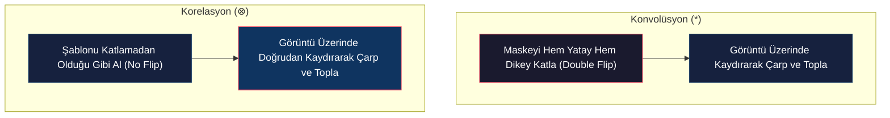
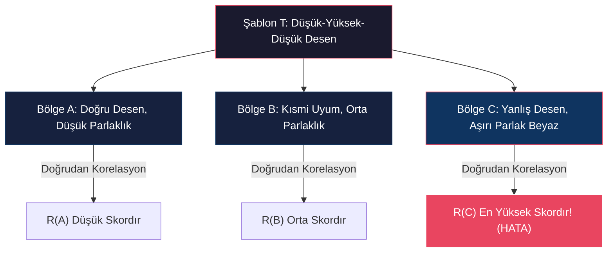

# Şablon Eşleme (Template Matching)

<!-- toc -->

## 1. Şablon Eşleştirme Problemi (Template Matching)

Şablon eşleştirme (*Template Matching*); büyük bir $f[x,y]$ ana görüntüsü içerisinde, boyut olarak daha küçük olan bir $T[u,v]$ şablon görüntüsünün (*desenin / yamanın*) nerede yer aldığını koordinat bazlı olarak saptama ve konumlandırma problemidir.

### Fiziksel Senaryo Örneği
Bir iskambil kartı destesi görüntüsü ($f[x,y]$) içerisinde sadece Maça Papazı kartının yüz bölgesini ($T[u,v]$ şablonu) aratıp geometrik olarak doğru koordinatta tespit etmek tipik bir şablon eşleme uygulamasıdır.

---

## 2. Kare Farkların Toplamı (Sum of Squared Differences - SSD)

Şablon ile ana görüntü arasındaki geometrik ve renk farkını ölçmenin en doğrudan ve sezgisel yolu, çakışan piksellerin parlaklık farklarının karesini alıp toplamaktır.

Eşik kayması koordinatları $(i,j)$ olmak üzere, $E[i,j]$ hata metriği matematiksel olarak şu şekilde tanımlanır:

$$E[i,j] = \sum_{m} \sum_{n} \left( f[m,n] - T[m-i, n-j] \right)^2$$

> **Key Insight:** Hata değeri $E[i,j]$ sıfıra ne kadar yakınsa ($E[i,j] \to 0$), ilgili $(i,j)$ koordinatında şablonla o kadar mükemmel uyum sağlayan bir bölge bulunmuş demektir.

### 2.1 SSD Formülünün Cebirsel Açılımı

Kare ifade açılıp toplam sembolleri terimlere dağıtıldığında:

$$E[i,j] = \sum_{m}\sum_{n} \left( f^2[m,n] + T^2[m-i, n-j] - 2 \cdot f[m,n] \cdot T[m-i, n-j] \right)$$

$$E[i,j] = \sum_{m}\sum_{n} f^2[m,n] + \sum_{m}\sum_{n} T^2[m-i, n-j] - 2 \sum_{m}\sum_{n} f[m,n] \cdot T[m-i, n-j]$$

<figure style="display:flex; justify-content: center; margin: 20px 0;">
  

    
    <figcaption style="margin-top: 0.5em; text-align: center; font-size: 13px; color: #888;"><em>İskambil kartında şablon arama ve SSD denkleminin çapraz korelasyon terimine açılımı</em></figcaption>
  

</figure>

Bu cebirsel denklemin bileşenleri incelendiğinde:

1. **$\sum \sum T^2$ (Şablon Enerjisi):** Şablon sabit olduğu için pencere kaydırılsa dahi toplam enerjisi değişmez (sabit sayıdır).
2. **$\sum \sum f^2$ (Yerel Görüntü Enerjisi):** Görüntünün o an çakışan yerel bölgesinin piksel enerjiler toplamıdır.
3. **$-2 \sum \sum f \cdot T$ (Çapraz Terim):** Formüldeki üçüncü terimin başında negatif ($-$) işareti yer almaktadır.

Bu durum kritik bir cebirsel ilişkiyi ortaya çıkarır: Hata metriğini ($E[i,j]$) **minimize etmek**, başında eksi işareti bulunan üçüncü terimi ($\sum \sum f \cdot T$) **maksimize etmekle** doğrudan eşdeğerdir. Bu üçüncü terim, şablon ile görüntünün **Çapraz Korelasyonudur (Cross-Correlation)**.

---

## 3. Çapraz Korelasyon (Cross-Correlation)

Şablon ile görüntünün örtüşen piksellerinin doğrudan çarpımlarının toplamını ifade eden Çapraz Korelasyon ($\otimes$), matematiksel olarak şu şekilde ifade edilir:

$$R[i,j] = f[i,j] \otimes T[i,j] = \sum_{m} \sum_{n} f[m,n] \cdot T[m-i, n-j]$$

### 3.1 Konvolüsyon ve Korelasyon Farkı

İki işlem görünüşte benzer olsa da aralarında temel bir operasyonel fark bulunur:

* **Konvolüsyon (Convolution - $*$):** Maske pikselleri hedef piksele yerleştirilmeden önce yatay ve dikey eksenlerde iki kez çevrilir (*double flip*):

  $$g[i,j] = f[i,j] * h[i,j] = \sum_{m} \sum_{n} f[m,n] \cdot h[i-m, j-n]$$

* **Korelasyon (Correlation - $\otimes$):** Şablon görüntü üzerine hiçbir katlama yapılmadan (*no flipping*) doğrudan yerleştirilir ve kaydırılır:

  $$R[i,j] = f[i,j] \otimes T[i,j] = \sum_{m} \sum_{n} f[m,n] \cdot T[m-i, n-j]$$

Yazılımsal uygulamalarda iki işlem, maskeyi ters çevirme adımı hariç birebir aynı döngü yapılarıyla çalıştırılır.

---

## 4. Doğrudan Korelasyonun Kusuru ve Parlaklık Hassasiyeti

Doğrudan çapraz korelasyon ($R[i,j]$) şablon eşleştirmede tek başına kullanıldığında ciddi hatalara yol açar. Çünkü çarpım sonucu mutlak parlaklık yoğunluğundan doğrudan etkilenir.

### 4.1 Çarpıcı Karşıt Örnek (Counter-Example)

Tek boyutta bir $T$ şablonu ile görüntü üzerindeki üç farklı bölge ($A$, $B$, $C$) karşılaştırılsın:
* **$T$ (Şablon):** Low-High-Low genliğinde özel bir karakter deseni.
* **$A$ Bölgesi:** Şablon deseniyle yapısal olarak mükemmel uyuşan ancak sönük (düşük parlaklıkta) bir bölge.
* **$B$ Bölgesi:** Şablonla kısmen uyuşan orta parlaklıkta bir bölge.
* **$C$ Bölgesi:** Şablonla hiçbir alakası olmayan ancak aşırı yüksek parlaklık piksellerine sahip düz beyaz bir bölge.

#### Doğrudan Korelasyon Skoru:
Çapraz korelasyon hesaplandığında, yüksek piksel değerleri çarpımı domine ettiği için şu hatalı sıralama ortaya çıkar:

$$R_C > R_B > R_A$$

<figure style="display:flex; justify-content: center; margin: 20px 0;">
  

    
    <figcaption style="margin-top: 0.5em; text-align: center; font-size: 13px; color: #888;"><em>Doğrudan çapraz korelasyonda parlak C bölgesinin hatalı bir şekilde en yüksek skoru üretmesi</em></figcaption>
  

</figure>

Sistem, yapıyla ilgisiz ama aşırı parlak olan **$C$ bölgesini en iyi eşleşme** olarak seçer. Bu durum bilgisayarlı görüde kabul edilemez bir yanııgıdır.

---

## 5. Normalize Çapraz Korelasyon (Normalized Cross-Correlation - NCC)

Mutlak parlaklık yanılgısını gidermek için korelasyon sonucu, şablonun kendi enerjisine ve görüntünün o an çakıştığı yerel bölgenin enerjisine bölünerek normalize edilmelidir.

Bu yöntem **Normalize Çapraz Korelasyon (Normalized Cross-Correlation - NCC)** olarak adlandırılır:

$$R_{\text{NCC}}[i,j] = \frac{\sum_{m} \sum_{n} f[m,n] \cdot T[m-i, n-j]}{\sqrt{\left( \sum_{m} \sum_{n} f^2[m,n] \right) \cdot \left( \sum_{m} \sum_{n} T^2[m-i, n-j] \right)}}$$

<figure style="display:flex; justify-content: center; margin: 20px 0;">
  

    
    <figcaption style="margin-top: 0.5em; text-align: center; font-size: 13px; color: #888;"><em>NCC formülü ile enerji normalizasyonu ve maça papazı yüzünün doğru haritalanması</em></figcaption>
  

</figure>

### 5.1 NCC'nin Fiziksel Bağışıklığı ve Avantajları

Paydadaki normalizasyon terimleri sayesinde NCC şu üstünlükleri kazanır:

* **Işık Değişimlerine Bağışıklık:** Ortam aydınlatması veya gölge değişimleri gerçekleştiğinde NCC skorunda bozulma yaşanmaz.
* **Kamera Kazancı (Gain) Özgürlüğü:** Kameranın parlaklık ve kontrast ayarlarına karşı dirençlidir.
* **Doğru Desen Eşleşmesi:** Karşıt örneğimizde NCC uygulandığında parlaklık etkisi sönümlenir ve desen yapısı baskın hale gelerek doğru sıralama elde edilir:

  $$R_{\text{NCC}}(A) > R_{\text{NCC}}(B) > R_{\text{NCC}}(C)$$

> **Key Insight:** NCC haritasında ($R_{\text{NCC}}$) elde edilen en yüksek tepe noktası (*global maximum*), aranan şablonun ana görüntü üzerindeki tam merkez koordinatını temsil eder.
