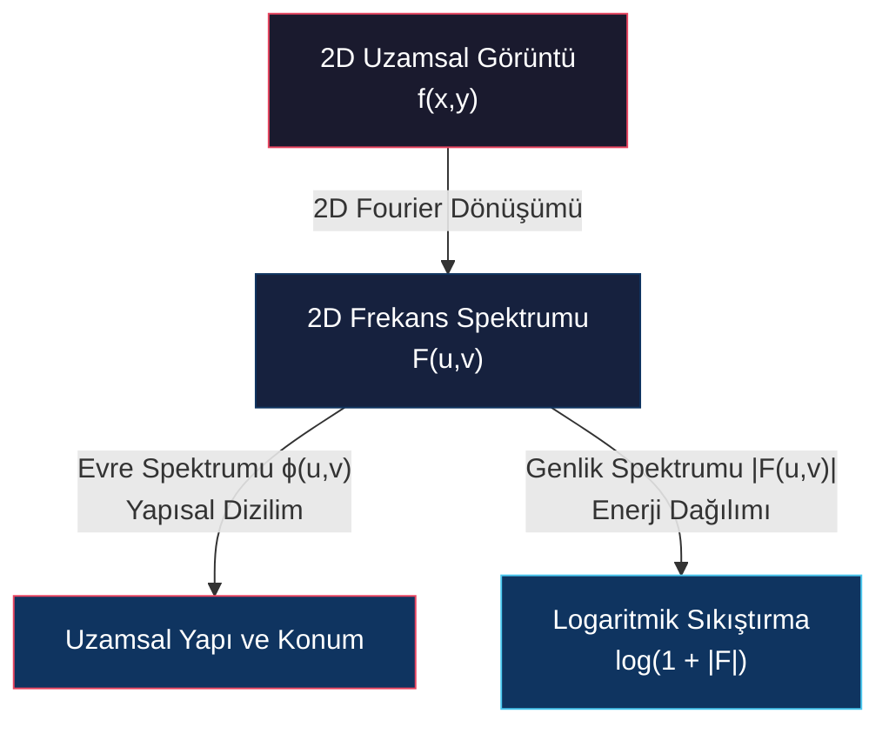
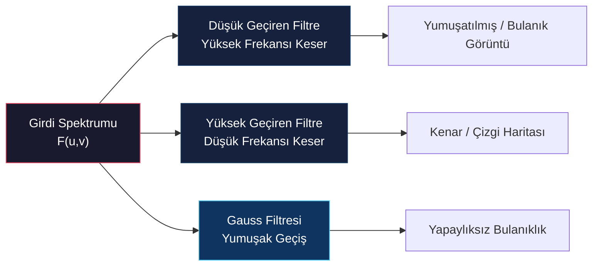
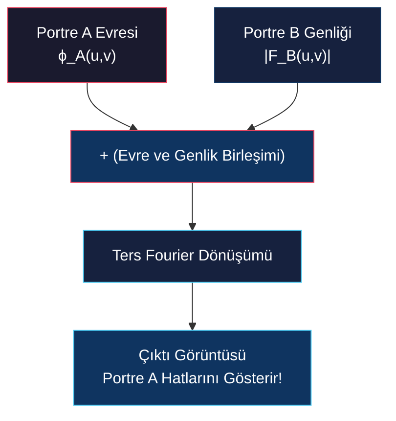
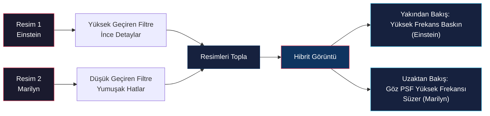
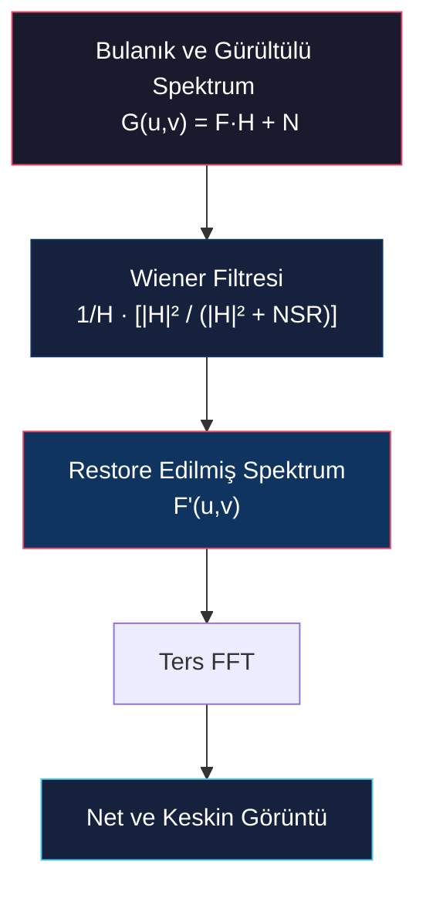

# Frekans Etki Alanında Filtreleme ve Dekonvolüsyon

<!-- toc -->

## 1. İki Boyutlu (2D) Fourier Dönüşümü

Görüntüler iki boyutlu uzamsal parlaklık dağılımlarından $f(x,y)$ oluştuğu için, tek boyutlu Fourier dönüşümü formülleri hem yatay ($u$) hem de dikey ($v$) uzamsal frekans bileşenlerini kapsayacak şekilde genişletilir.

### 1.1 2D Sürekli Fourier Dönüşümü (2D FT)

Sürekli bir 2D $f(x,y)$ görüntü fonksiyonu için ileri Fourier dönüşümü şu şekilde tanımlanır:

$$F(u,v) = \int_{-\infty}^{\infty} \int_{-\infty}^{\infty} f(x,y) e^{-i 2\pi (ux + vy)} \, dx \, dy$$

### 1.2 2D Ters Sürekli Fourier Dönüşümü (2D IFT)

Orijinal sürekli $f(x,y)$ görüntüsü, frekans spektrumundan $F(u,v)$ şu şekilde geri elde edilir:

$$f(x,y) = \int_{-\infty}^{\infty} \int_{-\infty}^{\infty} F(u,v) e^{i 2\pi (ux + vy)} \, du \, dv$$

### 1.3 2D Ayrık Fourier Dönüşümü (2D DFT)

Dijital bilgisayar ortamında görüntüler $M \times N$ boyutlu piksellerden oluştuğu için sürekli integraller çift toplam sembolüne dönüşür. $m, n$ uzamsal piksel indislerini ($0 \le m < M, 0 \le n < N$), $p, q$ ise ayrık frekans indislerini temsil etmek üzere:

$$F[p,q] = \sum_{m=0}^{M-1} \sum_{n=0}^{N-1} f[m,n] e^{-i 2\pi \left(\frac{pm}{M} + \frac{qn}{N}\right)}$$

### 1.4 2D Ters Ayrık Fourier Dönüşümü (2D IDFT)

Ayrık uzamsal görüntü $f[m,n]$, frekans katsayılarından $F[p,q]$ şu şekilde geri kestirilir:

$$f[m,n] = \frac{1}{MN} \sum_{p=0}^{M-1} \sum_{q=0}^{N-1} F[p,q] e^{i 2\pi \left(\frac{pm}{M} + \frac{qn}{N}\right)}$$

---

## 2. 2D Frekans Spektrumunun Görselleştirilmesi

Fourier katsayıları $F(u,v)$ karmaşık sayılardan oluştuğu için, standart görselleştirmelerde evre bilgisi ihmal edilerek sadece **genlik spektrumu** $|F(u,v)|$ incelenir.

### 2.1 Logaritmik Sıkıştırma (Dynamic Range Compression)
Spektrumdaki genlik değerleri sıklıkla devasa bir dinamik aralığa (örneğin $10^0$ ile $10^6$ arasında) sahiptir. Ham genlik değerlerini doğrudan ekrana bastırmak yüksek frekanslı ince detayları görünmez kılar. Detayları ekranda seçilebilir kılmak için logaritmik ölçekleme uygulanır:

$$D(u,v) = c \cdot \log(1 + |F(u,v)|)$$

Burada $c$ normalize edici bir ölçek katsayısıdır.

### 2.2 Spektrumun Merkezi (FFT Shift)
Varsayılan olarak sıfır frekans bileşeni $F[0,0]$ matrisin sol üst köşesinde yer alır. Görsel yorumlamayı kolaylaştırmak için spektrum çeyrekleri döndürülerek (FFT shift) $(u=0, v=0)$ koordinatı spektrumun tam merkezine taşınır. Yüksek frekanslar merkezden dışarıya doğru dairesel olarak genişler.

### 2.3 DC Bileşeni (Direct Current Component)
Dijital görüntülerde piksel değerleri negatif olamayacağı için (örneğin 8-bitlik görüntülerde parlaklık $0-255$ arasındadır), görüntünün ortalama parlaklık değeri sıfırdan büyüktür. Sıfır frekanstaki $F(0,0)$ katsayısı—yani **DC bileşeni**—görüntünün toplam ortalama parlaklığına karşılık gelir ve spektrum merkezinde son derece parlak bir nokta olarak belirir:

$$F(0,0) = \sum_{m=0}^{M-1} \sum_{n=0}^{N-1} f[m,n]$$

---

## 3. 2D Spektrum Örnekleri ve Fiziksel Karşılıkları

Görüntüdeki nesnelerin yönelimi ve uzamsal yapıları frekans spektrumunda doğrudan karakteristik modeller üretir:

* **Yatay Kosinüs Dalgası:** Saf bir yatay sinüzoid, spektrum merkezinde DC noktası ve yatay eksen boyunca dizilmiş simetrik $\pm k$ konumlarında iki adet frekans noktası üretir. Sinyalin frekansı arttıkça bu noktalar merkezden dışa doğru uzaklaşır. İki kosinüs toplandığında spektrumda 5 nokta belirir.

<figure style="display:flex; justify-content: center; margin: 20px 0;">
  

    
    <figcaption style="margin-top: 0.5em; text-align: center; font-size: 13px; color: #888;"><em>Yatay kosinüs dalgaları ($f, g$) ile toplamlarının ($f+g$) spektrumda oluşturduğu frekans noktaları</em></figcaption>
  

</figure>

* **Eğik Yarık / Dikdörtgen Pencere & Daire:** Eğik bir yarık/dikdörtgen nesne o kenarlara dik doğrultuda uzanan yüksek frekanslar üretirken; dairesel bir disk rotasyonel simetrik Airy halkaları üretir.

<figure style="display:flex; justify-content: center; margin: 20px 0;">
  

    
    <figcaption style="margin-top: 0.5em; text-align: center; font-size: 13px; color: #888;"><em>Eğik dikdörtgen yarık (dik frekans çizgileri) ve dairesel disk (dairesel simetrik spektrum) örnekleri</em></figcaption>
  

</figure>

* **Rubik Küpü & Mandrill Doku:** Rubik küpünün üç dominant kenar doğrultusu spektrumda merkezden saçılan 3 dikey frekans ışını oluştururken, karmaşık dokulu Mandrill görüntüsü yaygın bir spektrum bulutu oluşturur.

<figure style="display:flex; justify-content: center; margin: 20px 0;">
  

    
    <figcaption style="margin-top: 0.5em; text-align: center; font-size: 13px; color: #888;"><em>Rubik Küpü (dominant kenar frekans ışınları) ve Mandrill (karmaşık dokusal frekans bulutu)</em></figcaption>
  

</figure>

* **Rastgele Gürültü:** Gürültü uzayda hızlı ve korelasyonsuz değişimlerden oluştuğu için tüm frekans alanına homojen şekilde yayılmış geniş bantlı beyaz gürültü enerjisi üretir.

<figure style="display:flex; justify-content: center; margin: 20px 0;">
  

    
    <figcaption style="margin-top: 0.5em; text-align: center; font-size: 13px; color: #888;"><em>Cameraman görüntüsü (baskın üçayak frekans çizgileri) ve Rastgele Gürültü (tüm spektruma yayılan gürültü)</em></figcaption>
  

</figure>

---

## 4. Frekans Düzleminde Temel Görüntü Filtreleri

Frekans alanında filtreleme, görüntünün Fourier spektrumunun $F(u,v)$ bir frekans transfer fonksiyonu $H(u,v)$ ile noktadan noktaya çarpılmasıyla gerçekleştirilir:

$$G(u,v) = F(u,v) \cdot H(u,v)$$

### 4.1 Düşük Geçiren Filtre (Low-Pass Filter - LPF)
Belirlenen bir $D_0$ eşik yarıçapının ötesindeki yüksek frekansları engelleyip sadece merkezdeki düşük frekansları geçiren filtredir:

$$H_{\text{ILPF}}(u,v) = \begin{cases} 1 & \text{eğer } D(u,v) \le D_0 \\ 0 & \text{eğer } D(u,v) > D_0 \end{cases}$$

* **Görsel Çıktı:** İnce detayları ve gürültüyü sönümleyerek pürüzsüz, bulanıklaştırılmış bir görüntü üretir.

<figure style="display:flex; justify-content: center; margin: 20px 0;">
  

    
    <figcaption style="margin-top: 0.5em; text-align: center; font-size: 13px; color: #888;"><em>Rubik Küpü üzerinde Düşük Geçiren Filtre (LPF) uygulaması ve frekanstaki dairesel kesme disk alanı</em></figcaption>
  

</figure>

* **Yarıçap Etkisi:** Filtre diskinin yarıçapı küçüldükçe, yüksek frekanslı detaylar daha çok engellendiği için görüntü daha da ağır şekilde bulanıklaşır.

<figure style="display:flex; justify-content: center; margin: 20px 0;">
  

    
    <figcaption style="margin-top: 0.5em; text-align: center; font-size: 13px; color: #888;"><em>LPF yarıçapı küçültüldüğünde (dar dairesel pencere) görüntünün ağır şekilde bulanıklaşması</em></figcaption>
  

</figure>

* **İdeal Filtre Hatası:** İdeal LPF gibi keskin eşikli adımlar frekansta uygulandığında, uzamsal düzlemde Sinc dalgalanmalarına yol açarak görüntünün kenarlarında **yapay halkalanma** (*ringing artifacts*) ve bloklaşmalar oluşturur.

### 4.2 Yüksek Geçiren Filtre (High-Pass Filter - HPF)
Merkezdeki düşük frekansları (DC bileşeni dahil) engelleyip dışarıdaki yüksek frekansları geçiren filtredir:

$$H_{\text{IHPF}}(u,v) = 1 - H_{\text{ILPF}}(u,v)$$

* **Görsel Çıktı:** Homojen parlaklıktaki alanlar tamamen siyahlaşır; geriye sadece hızlı parlaklık değişimi içeren keskin kenarlar ve detaylar kalır.

<figure style="display:flex; justify-content: center; margin: 20px 0;">
  

    
    <figcaption style="margin-top: 0.5em; text-align: center; font-size: 13px; color: #888;"><em>Rubik Küpü üzerinde Yüksek Geçiren Filtre (HPF) uygulaması ve elde edilen kenar haritası</em></figcaption>
  

</figure>

* **Bilgisayarlı Görüdeki Rolü & Yarıçap Etkisi:** Sobel ve Laplacian gibi temel kenar ve köşe bulma operatörleri birer yüksek geçiren filtre tasarımıdır. Filtre kesme yarıçapı büyütüldükçe kenar çizgileri daha da incelir ve keskinleşir.

<figure style="display:flex; justify-content: center; margin: 20px 0;">
  

    
    <figcaption style="margin-top: 0.5em; text-align: center; font-size: 13px; color: #888;"><em>HPF kesme yarıçapı büyütüldüğünde (geniş merkez engelleme diski) daha ince ve keskin kenar hatlarının elde edilmesi</em></figcaption>
  

</figure>

### 4.3 Gauss Pürüzsüzleştirmesi (Gaussian Smoothing)
İdeal filtrelerin yarattığı halkalanma (ringing) hatalarını engellemek için, frekanstaki geçiş sınırı yumuşak olan **Gauss Düşük Geçiren Filtresi (GLPF)** kullanılır:

$$H_{\text{GLPF}}(u,v) = e^{-\frac{D^2(u,v)}{2 D_0^2}}$$

Konvolüsyon teoremi gereği, frekansta Gauss eğrisiyle çarpmak uzamsal düzlemde Gauss maskesiyle konvolüsyon yapmaya eşdeğerdir.

<figure style="display:flex; justify-content: center; margin: 20px 0;">
  

    
    <figcaption style="margin-top: 0.5em; text-align: center; font-size: 13px; color: #888;"><em>Uzamsal Gauss konvolüsyonu ($f * n_\sigma$) ile frekansta Gauss çarpımının ($F \cdot N_\sigma$) eşdeğerliği</em></figcaption>
  

</figure>

* **Ters Ölçekleme Etkisi:** Uzamsal Gauss maskesi genişletildikçe, frekanstaki Gauss daralır ve daha fazla yüksek frekansı bloke ederek görüntüyü daha çok bulandırır.

<figure style="display:flex; justify-content: center; margin: 20px 0;">
  

    
    <figcaption style="margin-top: 0.5em; text-align: center; font-size: 13px; color: #888;"><em>Geniş uzamsal Gauss maskesinin frekansta dar bir Gauss filtresi üreterek daha ağır bulanıklık sağlaması</em></figcaption>
  

</figure>

---

## 5. Evre Bilgisinin (Phase) Kritik Önemi

Genlik spektrumu $|F(u,v)|$ her bir frekansta *ne kadar* enerji bulunduğunu gösterirken, **evre spektrumu** $\phi(u,v)$ bu frekans bileşenlerinin uzamda *nerede* konumlandığını belirler.

> **Key Insight: Yapısal Kimliği Evre Belirler**  
> Oppenheim, Lim ve Curtis (1983) tarafından yapılan klasik deneyler, görsel algıda ve nesne hatlarının korunmasında evre bilgisinin genlikten çok daha hayati olduğunu ortaya koymuştur.

### 5.1 Evre ve Genlik Değiştirme Deneyi

1. **Yalnızca Genlik ile Rekonstrüksiyon:** Bir portrenin (Marilyn Monroe veya Albert Einstein) evre bilgisi tamamen sıfırlanıp sadece genlik spektrumuyla Ters Fourier Dönüşümü hesaplandığında, elde edilen görüntü tamamen anlamsız, bulutumsu ve tanınamaz bir forma dönüşür.
2. **Evre Korunup Genlik Değiştirildiğinde:** Marilyn Monroe'nun orijinal evre bilgisi korunup, genlik spektrumu tamamen alakasız bir manzara resminin genliğiyle değiştirildiğinde; Ters Fourier çıktısında net bir şekilde Marilyn Monroe'nun yüz hatları belirir.

<figure style="display:flex; justify-content: center; margin: 20px 0;">
  

    
    <figcaption style="margin-top: 0.5em; text-align: center; font-size: 13px; color: #888;"><em>Marilyn Monroe ve Albert Einstein üzerinde evre vs genlik deneyi: Evre korunduğunda nesne kimliği tanınabilir kalır.</em></figcaption>
  

</figure>

---

## 6. Hibrit Görüntüler (Hybrid Images)

Aude Oliva (2006) tarafından geliştirilen **Hibrit Görüntüler**, insan gözünün biyolojik odaklanma mesafesini ve Nokta Yayılım Fonksiyonunu (PSF) kullanan bir optik illüzyon tasarımıdır.

<figure style="display:flex; justify-content: center; margin: 20px 0;">
  

    
    <figcaption style="margin-top: 0.5em; text-align: center; font-size: 13px; color: #888;"><em>Hibrit Görüntü inşası: Düşük frekanslı Marilyn Monroe + Yüksek frekanslı Albert Einstein = Hibrit Görüntü</em></figcaption>
  

</figure>

### 6.1 İnşa Aşamaları
1. **Yüksek Geçiren Bileşen:** Birinci görüntüye (Albert Einstein) Yüksek Geçiren Filtre uygulanarak keskin detaylar korunur.
2. **Düşük Geçiren Bileşen:** İkinci görüntüye (Marilyn Monroe) Düşük Geçiren Filtre uygulanarak yumuşak arka plan hatları korunur.
3. **Süperpozisyon:** İki filtrelenmiş görüntü toplanarak tek bir Hibrit Görüntü elde edilir.

### 6.2 Algısal Mekanizma
* **Yakından Bakıldığında:** İnsan retinası yüksek uzamsal frekansları net seçebildiği için ağırlıklı olarak yüksek geçiren resmi (Einstein) algılar.
* **Uzaktan Bakıldığında:** İnsan göz merceğinin kendi açısal çözünürlüğü ve odak PSF yapısı yüksek frekansları doğal olarak süzer; geriye sadece düşük frekanslı yumuşak hatlar (Marilyn Monroe) kalır.

---

## 7. Bulanıklık Giderme ve Dekonvolüsyon

Çekim esnasında kamera sarsıntısı veya odak dışı kalma nedeniyle ideal net sahne $f(x,y)$, bozucu bir sistem fonksiyonuyla ($h(x,y)$ - **Nokta Yayılım Fonksiyonu / PSF**) konvolüsyona uğrayarak bulanıklaşır:

$$g(x,y) = f(x,y) * h(x,y)$$

**Dekonvolüsyon** (*Deconvolution*), bu bulanıklaştıran konvolüsyon etkisini tersine çevirerek net sahneyi $f(x,y)$ geri elde etme işlemidir.

<figure style="display:flex; justify-content: center; margin: 20px 0;">
  

    
    <figcaption style="margin-top: 0.5em; text-align: center; font-size: 13px; color: #888;"><em>Bulanıklık bozulma modeli: Sahne ($f$) * Kamera sarsıntısı PSF ($h$) = Bulanık görüntü ($g$)</em></figcaption>
  

</figure>

### 7.1 IMU Sensörleri ile PSF Tahmini
Akıllı telefon kameralarında el sarsıntısından kaynaklanan $h(x,y)$ PSF fonksiyonunu hesaplamak için dahili IMU (Atalet Ölçüm Birimi) sensörleri (ivmeölçer ve jiroskop) kullanılır. Pozlama süresince gerçekleşen 3D hareket vektörleri ölçülerek fiziksel kayma çekirdeği matematiksel olarak modellenir.

### 7.2 Basit Ters Filtreleme (Simple Deconvolution) ve Çöküşü

Gürültüsüz ideal bir ortamda $g(x,y) = f(x,y) * h(x,y)$ denklemi frekans düzleminde şu hale gelir:

$$G(u,v) = F(u,v) \cdot H(u,v) \implies F'(u,v) = \frac{G(u,v)}{H(u,v)}$$

Ters Fourier Dönüşümü $\text{IFT}\{F'(u,v)\}$ alındığında ideal sahne $f(x,y)$ kusursuzca geri elde edilir.

<figure style="display:flex; justify-content: center; margin: 20px 0;">
  

    
    <figcaption style="margin-top: 0.5em; text-align: center; font-size: 13px; color: #888;"><em>Gürültüsüz ortamda basit dekonvolüsyon Adım 1: Frekans spektrumlarının bölümü ($F' = G / H$)</em></figcaption>
  

</figure>

<figure style="display:flex; justify-content: center; margin: 20px 0;">
  

    
    <figcaption style="margin-top: 0.5em; text-align: center; font-size: 13px; color: #888;"><em>Gürültüsüz ortamda basit dekonvolüsyon Adım 2: Ters FT ile net sahnenin ($f'$) kusursuz geri elde edilişi</em></figcaption>
  

</figure>

Ancak tüm gerçek dijital sensörlerde sisteme eklenen gürültü $n(x,y)$ mevcuttur:

$$g(x,y) = f(x,y) * h(x,y) + n(x,y) \implies G(u,v) = F(u,v)H(u,v) + N(u,v)$$

Bu gerçekçi modele basit ters filtreleme uygulanırsa:

$$F'(u,v) = \frac{G(u,v)}{H(u,v)} = F(u,v) + \frac{N(u,v)}{H(u,v)}$$

> **Warning: Basit Ters Filtrelemenin İki Büyük Matematiksel Çöküşü**  
> 1. **Sıfıra Bölme Hatası:** Bulanıklık filtresi $H(u,v)$ bir düşük geçiren filtredir ve yüksek frekanslarda değeri sıfıra yaklaşır. $\frac{1}{H(u,v)}$ terimi sıfır noktalarında tanımsızlığa ($\infty$) yol açar.  
> 2. **Devasa Gürültü Patlaması (Noise Amplification):** Yüksek frekanslarda $|H(u,v)| \approx 0$ iken gürültü spektrumu $N(u,v)$ sıfırdan farklıdır. Çok küçük bir sayıya bölünen gürültü terimi ($\frac{N}{H} \gg 1$) devasa bir oranda büyüyerek gerçek sinyali boğar. Sonuç görüntüsü tamamen tuz-biber gürültüsüyle kaplanır.

---

## 8. Wiener Dekonvolüsyonu (Wiener Deconvolution)

Gürültü patlamasını önlemek ve ters filtreleme işlemini gürültünün gücüne göre dinamik olarak sönümlemek için **Wiener Filtresi** kullanılır.

### 8.1 Teorik Wiener Filtre Formülü

Wiener filtresi kestirilen $f'(x,y)$ ile gerçek $f(x,y)$ arasındaki ortalama kare hatayı (MSE) minimize eder:

$$F'(u,v) = \frac{G(u,v)}{H(u,v)} \cdot \left[ \frac{1}{1 + \frac{\text{NSR}(u,v)}{|H(u,v)|^2}} \right]$$

Burada $\text{NSR}(u,v)$ frekansa bağlı **Gürültü-Sinyal Oranını** (*Noise-to-Signal Ratio*) temsil eder:

$$\text{NSR}(u,v) = \frac{|N(u,v)|^2}{|F(u,v)|^2}$$

### 8.2 Çalışma Mekanizması
* **Yüksek Sinyal/Gürültü Oranı ($|N|^2 \ll |F|^2$):** $\text{NSR} \to 0$ olur ve parantez içindeki sönümleme terimi $1$'e yaklaşır. Filtre standart ters filtre $\frac{G}{H}$ gibi davranır.
* **Düşük Sinyal/Gürültü Oranı ($|H| \to 0$ veya $|N|^2 \gg |F|^2$):** $\frac{\text{NSR}}{|H|^2} \to \infty$ olacağından parantez içindeki sönümleme terimi $0$'a yaklaşır. Bu durum gürültü patlamasını ve sıfıra bölme sonsuzluğunu tamamen engeller.

### 8.3 Pratik Sabit $\lambda$ Yaklaşımı

Uygulamada gerçek gürültü $|N(u,v)|^2$ ve net sahne $|F(u,v)|^2$ spektrumlarını önceden bilmek imkansız olduğu için, NSR terimi yerine çok küçük bir deneysel $\lambda$ sabiti (örneğin $\lambda \approx 0.002$) kullanılır:

$$F'(u,v) = \frac{G(u,v)}{H(u,v)} \cdot \left[ \frac{|H(u,v)|^2}{|H(u,v)|^2 + \lambda} \right]$$

<figure style="display:flex; justify-content: center; margin: 20px 0;">
  

    
    <figcaption style="margin-top: 0.5em; text-align: center; font-size: 13px; color: #888;"><em>Wiener Dekonvolüsyonu ($\lambda = 0.002$) ile gürültülü ve bulanık görüntünün keskin ve temiz biçimde kurtarılması</em></figcaption>
  

</figure>

Sabit bir $\lambda$ seçimi keskin kenarlarda hafif halkalanmalar (*ringing*) bıraksa da, sarsıntı nedeniyle bozulan gürültülü görüntüleri oldukça net ve keskin bir forma kavuşturur.
