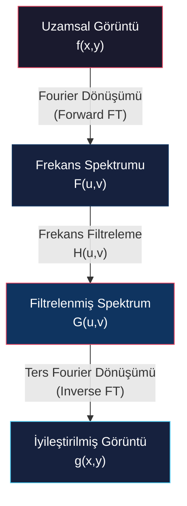
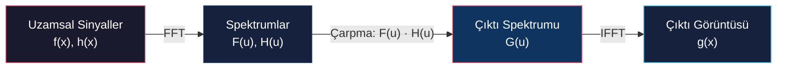

# Genel Bakış, Fourier Dönüşümü ve Konvolüsyon Teoremi

<!-- toc -->

## 1. Frekans Alanına Genel Bakış (Overview of Frequency Domain)

Görüntüleri yalnızca uzamsal düzlemde (*spatial domain*) piksel piksel işlemek, bulanıklaştırma, keskinleştirme veya dekonvolüsyon gibi karmaşık işlemlerde hem matematiksel açıdan güçleşir hem de hesaplama maliyetini aşırı artırır. **Frekans alanı** (*frequency domain*), görüntüdeki uzamsal yapıları farklı frekanslardaki sinüzoidlerin (sinüs ve kosinüs dalgalarının) ağırlıklı toplamı olarak ifade etmemizi sağlayan alternatif bir temsil sunar.

Uzamsal koordinatlardan frekans temsiline geçiş üç temel mühendislik avantajı sağlar:

1. **Konvolüsyon Kolaylığı:** Uzamsal düzlemdeki yüksek hesaplama maliyetli konvolüsyon (katlama) integralleri, frekans düzleminde basit birer nokta çarpımına (*element-wise multiplication*) dönüşür.
2. **Bileşen Ayrıştırma:** Görüntünün yüksek frekanslı bileşenleri (ince detaylar, keskin kenarlar, gürültüler) ile düşük frekanslı bileşenleri (pürüzsüz arka planlar, yavaş parlaklık değişimleri) spektrumun farklı bölgelerinde net bir şekilde ayrıştırılır.
3. **Restorasyon ve Kararlılık:** Görüntü restorasyonu, hareket bulanıklığı giderme ve ters filtreleme (*deconvolution*) işlemleri matematiksel olarak kararlı hale getirilir.

> **Key Insight:** Uzamsal düzlem parlaklık değişimlerinin *nerede* olduğunu incelerken, frekans düzlemi parlaklık değişimlerinin uzayda *ne kadar hızlı* gerçekleştiğini analiz eder.

---

## 2. Fourier Dönüşümü (Fourier Transform)

Fourier Dönüşümü, adını Fransız matematikçi ve fizikçi **Jean Baptiste Joseph Fourier**'den (1768–1830) almıştır.

### 2.1 Tarihsel Arka Plan

Fourier, katı cisimler içindeki ısı yayılımını (*heat diffusion*) matematiksel olarak modellerken periyodik fonksiyonların farklı frekanstaki sinüzoidlerin toplamı olarak yazılabileceğini öne sürmüştür.

Dönemin önde gelen matematikçileri Joseph-Louis Lagrange ve Leonhard Euler, Fourier'nin bu çalışmasını matematiksel açıdan yeterince titiz (*rigorous*) bulmayarak reddetmiş ve makalenin yayınlanması yaklaşık 8 yıl sürmüştür. Günümüzde ise Fourier Dönüşümü sinyal işleme, bilgisayarlı görü, haberleşme ve fizikte devrim yaratan temel bir sütundur.

### 2.2 Temel İlke: Sinüzoidal Yapı Taşları

Fourier analizinin kalbinde **sinüzoid** (*sinusoid*) dalgalar yer alır. Tek boyutlu sürekli bir sinüzoid dalga matematiksel olarak şu şekilde tanımlanır:

$$f(x) = A \sin(2\pi u x + \phi)$$

Burada:
* **$A$ (Genlik / Amplitude):** Dalganın genliği, yani maksimum tepe yüksekliği veya gücüdür.
* **$u$ (Frekans / Frequency):** Dalganın birim uzamsal mesafedeki salınım sayısıdır.
* **$T = \frac{1}{u}$ (Periyot / Period):** Bir tam salınım döngüsünün gerektirdiği uzamsal mesafedir.
* **$\phi$ (Evre / Phase):** Orijine göre dalganın başlama veya kayma açısıdır.

<figure style="display:flex; justify-content: center; margin: 20px 0;">
  

    
    <figcaption style="margin-top: 0.5em; text-align: center; font-size: 13px; color: #888;"><em>Sinüzoid dalganın geometrik bileşenleri: Genlik ($A$), Frekans ($u$), Periyot ($T = 1/u$) ve Evre ($\phi$).</em></figcaption>
  

</figure>

---

## 3. Kare Dalga İnşası ve Fourier Serisi

Fourier teorisini anlamanın en klasik yolu, periyodik bir **kare dalgayı** (*square wave*) farklı frekanslardaki sinüs dalgalarını toplayarak adım adım inşa etmektir.

1. **1 Sinüzoid:** Yalnızca temel $u$ frekansı kullanıldığında kare dalgaya oldukça yumuşak ve kaba bir yaklaşım elde edilir.
2. **Ardışık Tek Harmonikler:** Frekansları ardışık olarak artan tek katlı harmonikler ($u, 3u, 5u, 7u, \dots$) ve genlikleri azalan katsayılar ($\frac{1}{1}, \frac{1}{3}, \frac{1}{5}, \frac{1}{7}, \dots$) eklendikçe, dalganın tepesi düzleşir ve dikey kenarları dikleşir.
3. **8 Sinüzoid:** İlk 8 harmonik terim toplandığında kare dalgaya çok yakın bir form elde edilir.
4. **Sonsuz Terim:** Sonsuz sayıda sinüzoid toplandığında tam dikey geçişli köşeli bir kare dalga oluşur.

<figure style="display:flex; justify-content: center; margin: 20px 0;">
  

    
    <figcaption style="margin-top: 0.5em; text-align: center; font-size: 13px; color: #888;"><em>Fourier Serisi ile kare dalga inşası (İlk 7 ve 8 harmonik sinüzoidin toplamı)</em></figcaption>
  

</figure>

<figure style="display:flex; justify-content: center; margin: 20px 0;">
  

    
    <figcaption style="margin-top: 0.5em; text-align: center; font-size: 13px; color: #888;"><em>Kare dalganın Genlik (Amplitude) ve Evre (Phase, $\phi \in \{-\pi/2, \pi/2\}$) spektrumu ayrışımı</em></figcaption>
  

</figure>

> **Warning: Yapay Dalgalanma (Ringing) ve Gibbs Fenomeni**  
> Kare dalganın dikey kenarları gibi anlık uzamsal sıçramaları (keskin kenarları) temsil edebilmek için sonsuz yüksek frekanslara ihtiyaç duyulur. Fourier serisi sınırlı sayıda terimde kesildiğinde, keskin geçiş noktalarında **Gibbs Fenomeni** olarak bilinen yapay salınımlar (*ringing artifacts*) oluşur. Ayrıca kare dalga inşasında harmoniklerin evreleri ($\phi$) $-\pi/2$ ile $\pi/2$ arasında salınır.

---

## 4. Matematiksel Formülasyon ve İspatlar

Fourier Dönüşümü, sürekli uzamsal $f(x)$ sinyalini frekans düzlemindeki $F(u)$ gösterimine hiçbir bilgi kaybı olmadan dönüştürür ve geri elde eder.

### 4.1 1D Sürekli Fourier Dönüşümü (İleri ve Ters)

**1D İleri Fourier Dönüşümü (Forward FT)**, uzamsal $f(x)$ fonksiyonunu frekans spektrumuna $F(u)$ taşır:

$$F(u) = \int_{-\infty}^{\infty} f(x) e^{-i 2\pi u x} \, dx$$

**1D Ters Fourier Dönüşümü (Inverse FT)**, frekans spektrumundan $F(u)$ orijinal uzamsal sinyali $f(x)$ geri elde eder:

$$f(x) = \int_{-\infty}^{\infty} F(u) e^{i 2\pi u x} \, du$$

Burada $x$ uzamsal koordinatı, $u$ ise frekans koordinatını temsil eder.

<figure style="display:flex; justify-content: center; margin: 20px 0;">
  

    
    <figcaption style="margin-top: 0.5em; text-align: center; font-size: 13px; color: #888;"><em>Fourier Dönüşümü (FT) ile Ters Fourier Dönüşümü (IFT) arasındaki girdi-çıktı ve spektral bağıntı</em></figcaption>
  

</figure>

> **Matematiksel Simetri Notu:** İleri dönüşümde karmaşık üstel terimde $-i$ yer alırken, ters dönüşümde $+i$ yer alır.

### 4.2 Taylor Serisi ile Euler Formülü İspatı

Formüllerdeki karmaşık üstel terimin ($e^{i\theta}$) sinüzoidal dalgalarla ($\cos\theta, \sin\theta$) olan ilişkisi **Euler Formülü** ile sağlanır:

$$e^{i\theta} = \cos\theta + i\sin\theta \quad (\text{burada } i = \sqrt{-1})$$

<figure style="display:flex; justify-content: center; margin: 20px 0;">
  

    
    <figcaption style="margin-top: 0.5em; text-align: center; font-size: 13px; color: #888;"><em>Euler Formülünün ($e^{i\theta} = \cos\theta + i\sin\theta$) Taylor serisi açılımı ile matematiksel ispatı</em></figcaption>
  

</figure>

#### Adım Adım İspat:

$e^x$ fonksiyonunun $x = 0$ etrafındaki Maclaurin (Taylor serisi) açılımı:

$$e^{x} = 1 + x + \frac{x^2}{2!} + \frac{x^3}{3!} + \frac{x^4}{4!} + \frac{x^5}{5!} + \dots$$

$x$ yerine karmaşık sayı olan $i\theta$ koyalım:

$$e^{i\theta} = 1 + (i\theta) + \frac{(i\theta)^2}{2!} + \frac{(i\theta)^3}{3!} + \frac{(i\theta)^4}{4!} + \frac{(i\theta)^5}{5!} + \dots$$

$i$'nin kuvvetlerini ($i^2 = -1, i^3 = -i, i^4 = 1, i^5 = i$) yerine koyalım:

$$e^{i\theta} = 1 + i\theta - \frac{\theta^2}{2!} - i\frac{\theta^3}{3!} + \frac{\theta^4}{4!} + i\frac{\theta^5}{5!} - \dots$$

Reel ve sanal kısımları ayrı parantezlerde gruplayalım:

$$e^{i\theta} = \left( 1 - \frac{\theta^2}{2!} + \frac{\theta^4}{4!} - \dots \right) + i \left( \theta - \frac{\theta^3}{3!} + \frac{\theta^5}{5!} - \dots \right)$$

Bu seriler standart cos ve sin Taylor serisi açılımlarıyla karşılaştırıldığında:
* $\cos\theta = 1 - \frac{\theta^2}{2!} + \frac{\theta^4}{4!} - \dots$
* $\sin\theta = \theta - \frac{\theta^3}{3!} + \frac{\theta^5}{5!} - \dots$

Değerler yerine yazıldığında Euler Formülü elde edilmiş olur:

$$e^{i\theta} = \cos\theta + i\sin\theta \quad \blacksquare$$

---

## 5. Fourier Dönüşümünün Karmaşık Yapısı

Belirli bir $u$ frekansındaki sinüzoidin hem **genliğini** (gücünü) hem de **evresini** (konum kaymasını) aynı anda temsil edebilmesi için Fourier katsayısı $F(u)$ karmaşık bir sayıdır ($F(u) \in \mathbb{C}$):

$$F(u) = \Re(F(u)) + i \Im(F(u))$$

### 5.1 Genlik Spektrumu (Magnitude Spectrum)
Genlik spektrumu $|F(u)|$, $u$ frekansındaki dalganın taşıdığı gücü/enerjiyi gösterir:

$$|F(u)| = \sqrt{\Re(F(u))^2 + \Im(F(u))^2}$$

### 5.2 Evre Spektrumu (Phase Spectrum)
Evre spektrumu $\phi(u)$, dalganın uzamsal başlangıç kaymasını gösterir:

$$\phi(u) = \tan^{-1}\left( \frac{\Im(F(u))}{\Re(F(u))} \right) \quad (\text{uygulamada } \text{atan2}(\Im, \Re) \text{ kullanılır})$$

> **Negatif Frekanslar:** Fourier entegrali $-\infty$ ile $+\infty$ arasında tanımlıdır. Negatif frekanslar ($u < 0$), reel uzamsal sinyaller için Hermitsel matematiksel simetriyi korumak amacıyla Euler formülünden doğal olarak doğar.

---

## 6. Temel Fonksiyonların Fourier Dönüşüm Çiftleri

Aşağıda sık kullanılan uzamsal $f(x)$ fonksiyonları ve bunların Fourier spektrumundaki karşılıkları özetlenmiştir:

### 6.1 Kosinüs Fonksiyonu
Tek bir saf kosinüs $f(x) = \cos(2\pi k x)$ yalnızca $k$ frekansına sahiptir. Fourier dönüşümü reel eksende $u = \pm k$ noktalarında iki adet Dirac delta darbesinden oluşur:

$$\mathcal{F}\{\cos(2\pi k x)\} = \frac{1}{2} \left[ \delta(u - k) + \delta(u + k) \right]$$

<figure style="display:flex; justify-content: center; margin: 20px 0;">
  

    
    <figcaption style="margin-top: 0.5em; text-align: center; font-size: 13px; color: #888;"><em>Kosinüs fonksiyonu $f(x) = \cos(2\pi k x)$ ve frekanstaki iki adet simetrik Dirac delta darbesi</em></figcaption>
  

</figure>

### 6.2 Kosinüslerin Toplamı
İki kosinüsün toplamı $f(x) = \cos(2\pi k_1 x) + \cos(2\pi k_2 x)$, spektrumda $u = \pm k_1$ ve $u = \pm k_2$ noktalarında dört adet delta darbesi üretir.

<figure style="display:flex; justify-content: center; margin: 20px 0;">
  

    
    <figcaption style="margin-top: 0.5em; text-align: center; font-size: 13px; color: #888;"><em>İki farklı kosinüsün toplamı ve spektrumda oluşan dört adet Dirac delta darbesi</em></figcaption>
  

</figure>

### 6.3 Sinüs Fonksiyonu
$f(x) = \sin(2\pi k x)$ da tek frekans barındırır, ancak delta darbeleri sanal eksende yer alır ve zıt yönlüdür:

$$\mathcal{F}\{\sin(2\pi k x)\} = \frac{i}{2} \left[ \delta(u + k) - \delta(u - k) \right]$$

### 6.4 Sabit Değer (DC Sinyal)
Sabit bir $f(x) = 1$ sinyali hiçbir uzamsal değişime sahip değildir (frekansı sıfırdır). Spektrumu yalnızca orijinde ($u = 0$) tek bir Dirac darbesidir:

$$\mathcal{F}\{1\} = \delta(u)$$

<figure style="display:flex; justify-content: center; margin: 20px 0;">
  

    
    <figcaption style="margin-top: 0.5em; text-align: center; font-size: 13px; color: #888;"><em>Sabit DC sinyal $f(x) = 1$ ve orijindeki ($u=0$) tekil Dirac delta darbesi</em></figcaption>
  

</figure>

### 6.5 Birim Darbe (Dirac Delta) Fonksiyonu
Tekil bir darbe $f(x) = \delta(x)$, oluşturulabilmek için tüm frekanslardaki sinüzoidlerin eşit güçte toplanmasını gerektirir. Spektrumu tamamen düzdür:

$$\mathcal{F}\{\delta(x)\} = 1$$

<figure style="display:flex; justify-content: center; margin: 20px 0;">
  

    
    <figcaption style="margin-top: 0.5em; text-align: center; font-size: 13px; color: #888;"><em>Uzamsal birim darbe $f(x) = \delta(x)$ ve tamamen düz frekans spektrumu $F(u) = 1$</em></figcaption>
  

</figure>

### 6.6 Dikdörtgen (Pencere) Fonksiyonu
Genişliği $T$ olan uzamsal dikdörtgen pencere $f(x) = \text{Rect}(x/T)$ bir **Sinc fonksiyonuna** dönüşür:

$$\mathcal{F}\{\text{Rect}(x/T)\} = T \cdot \text{sinc}(Tu) = T \frac{\sin(\pi T u)}{\pi T u}$$

<figure style="display:flex; justify-content: center; margin: 20px 0;">
  

    
    <figcaption style="margin-top: 0.5em; text-align: center; font-size: 13px; color: #888;"><em>Uzamsal dikdörtgen pencere $f(x) = \text{Rect}(x/T)$ ve frekanstaki Sinc spektrumu</em></figcaption>
  

</figure>

### 6.7 Gauss Fonksiyonu
Genişlik parametresi $a$ olan uzamsal Gauss eğrisi $f(x) = e^{-ax^2}$, frekans alanında yine bir Gauss eğrisine dönüşür:

$$\mathcal{F}\{e^{-ax^2}\} = \sqrt{\frac{\pi}{a}} e^{-\frac{\pi^2 u^2}{a}}$$

<figure style="display:flex; justify-content: center; margin: 20px 0;">
  

    
    <figcaption style="margin-top: 0.5em; text-align: center; font-size: 13px; color: #888;"><em>Uzamsal Gauss eğrisi $f(x) = e^{-ax^2}$ ve frekanstaki Gauss spektrumu</em></figcaption>
  

</figure>

### 6.8 Ters Ölçekleme İlkesi (Inverse Scaling Principle)
Gauss ve Rect-Sinc örneklerinde görüldüğü gibi, bir sinyal uzamsal düzlemde genişletildikçe frekans düzleminde daralır ve sıkışır:

$$f(ax) \iff \frac{1}{|a|} F\left(\frac{u}{a}\right)$$

---

## 7. Fourier Dönüşümünün Temel Özellikleri

<figure style="display:flex; justify-content: center; margin: 20px 0;">
  

    
    <figcaption style="margin-top: 0.5em; text-align: center; font-size: 13px; color: #888;"><em>Uzamsal düzlem ile frekans düzlemi arasındaki temel dönüşüm özellikleri tablosu</em></figcaption>
  

</figure>

| Özellik | Uzamsal Düzlem ($f(x)$) | Frekans Düzlemi ($F(u)$) | Teknik Açıklama |
| :--- | :--- | :--- | :--- |
| **Doğrusallık (Linearity)** | $\alpha f_1(x) + \beta f_2(x)$ | $\alpha F_1(u) + \beta F_2(u)$ | Süperpozisyon ve ölçekleme her iki alanda da korunur. |
| **Ölçekleme (Scaling)** | $f(ax)$ | $\frac{1}{\|a\|} F\left(\frac{u}{a}\right)$ | Uzamsal genişleme frekansta sıkışmaya neden olur. |
| **Kaydırma (Shifting)** | $f(x - a)$ | $F(u) e^{-i 2\pi u a}$ | Uzamsal öteleme genliği değiştirmeden evreyi döndürür. |
| **Türev Alma (Differentiation)** | $\frac{d^n f(x)}{dx^n}$ | $(i 2\pi u)^n F(u)$ | Uzamsal türev alma yüksek frekansları güçlendirerek keskinleştirme yapar. |

---

## 8. Konvolüsyon Teoremi (Convolution Theorem)

Sürekli tek boyutta girdi $f(x)$ ile filtre $h(x)$ arasındaki uzamsal konvolüsyon ($*$) şu integral denklemiyle tanımlanır:

$$g(x) = f(x) * h(x) = \int_{-\infty}^{\infty} f(\tau) h(x - \tau) \, d\tau$$

Görsel olarak uzamsal konvolüsyon; filtre çekirdeğinin ters çevrilmesi $h(\tau) \to h(-\tau)$, $x$ kadar kaydırılması, $f(\tau)$ ile çarpılması ve örtüşen alanın entegre edilmesidir. Örneğin iki özdeş dikdörtgenin konvolüsyonu simetrik bir üçgen fonksiyon üretir.

### 8.1 Teoremin İfadesi

**Konvolüsyon Teoremi**, uzamsal düzlemdeki işlemleri frekans alanına bağlayan en güçlü matematiksel köprüdür:

$$\mathcal{F}\{f(x) * h(x)\} = F(u) \cdot H(u)$$

$$\mathcal{F}\{f(x) \cdot h(x)\} = F(u) * H(u)$$

<figure style="display:flex; justify-content: center; margin: 20px 0;">
  

    
    <figcaption style="margin-top: 0.5em; text-align: center; font-size: 13px; color: #888;"><em>Konvolüsyon Teoremi: Uzamsal konvolüsyon frekansta nokta çarpımına, uzamsal çarpım ise frekansta konvolüsyona karşılık gelir.</em></figcaption>
  

</figure>

* **Uzamsal Konvolüsyon $\iff$ Frekans Çarpımı:** Uzamsal düzlemde iki sinyali konvole etmek, frekans düzleminde spektrumlarını noktasal olarak çarpmaya eşdeğerdir.
* **Uzamsal Çarpım $\iff$ Frekans Konvolüsyonu:** Uzamsal düzlemde iki sinyali çarpmak, frekans düzleminde spektrumlarını konvole etmeye eşdeğerdir.

### 8.2 Konvolüsyon Teoreminin Matematiksel İspatı

Uzamsal konvolüsyon çıktısı $g(x) = f(x) * h(x)$ fonksiyonunun Fourier dönüşümü $G(u)$'yu entegre edelim:

$$G(u) = \int_{-\infty}^{\infty} g(x) e^{-i 2\pi u x} \, dx$$

$g(x)$ yerine uzamsal konvolüsyon entegral tanımını yazalım:

$$G(u) = \int_{-\infty}^{\infty} \left[ \int_{-\infty}^{\infty} f(\tau) h(x - \tau) \, d\tau \right] e^{-i 2\pi u x} \, dx$$

Entegrallerin sırasını değiştirelim ve üstel terime $+u\tau - u\tau$ ekleyerek ayıralım:

$$e^{-i 2\pi u x} = e^{-i 2\pi u (x - \tau)} e^{-i 2\pi u \tau}$$

İç ve dış integralleri yeniden düzenleyelim:

$$G(u) = \int_{-\infty}^{\infty} f(\tau) e^{-i 2\pi u \tau} \left[ \int_{-\infty}^{\infty} h(x - \tau) e^{-i 2\pi u (x - \tau)} \, dx \right] d\tau$$

İçteki integralde $y = x - \tau$ değişken dönüşümü uygulayalım ($dy = dx$). $\tau$ sonlu olduğundan integral sınırları $[-\infty, \infty]$ kalır:

$$G(u) = \left( \int_{-\infty}^{\infty} f(\tau) e^{-i 2\pi u \tau} \, d\tau \right) \cdot \left( \int_{-\infty}^{\infty} h(y) e^{-i 2\pi u y} \, dy \right)$$

İlk integral doğrudan $F(u)$ tanımı, ikinci integral ise $H(u)$ tanımıdır:

$$G(u) = F(u) \cdot H(u) \quad \blacksquare$$

### 8.3 Hesaplama Maliyeti ve Mühendislik Avantajı

$N \times N$ boyutlu bir görüntüyü geniş bir filtre maskesiyle uzamsal düzlemde konvolüsyona sokmak piksel başına $O(N^2)$ hesaplama karmaşıklığına sahiptir. Konvolüsyon Teoremi ve Hızlı Fourier Dönüşümü (FFT) sayesinde:

  

    <figure style="margin: 0;">
      
      <figcaption style="margin-top: 0.5em; font-size: 13px; color: #888;"><em>Gürültülü sinyal ($f(x)$) ile Gauss çekirdeğinin ($n_\sigma(x)$) Fourier dönüşümleri ($F(u)$ ve $N_\sigma(u)$) ve frekanstaki nokta çarpımı</em></figcaption>
    </figure>
  

  

    <figure style="margin: 0;">
      
      <figcaption style="margin-top: 0.5em; font-size: 13px; color: #888;"><em>Frekansta filtrelenmiş spektrumun ($F(u)H(u)$) Ters Fourier Dönüşümü ile pürüzsüzleştirilmiş çıktı sinyali $g(x)$</em></figcaption>
    </figure>
  

1. FFT ile $F(u) = \mathcal{F}\{f(x)\}$ ve $H(u) = \mathcal{F}\{h(x)\}$ hesaplanır ($O(N \log N)$).
2. Frekansta nokta çarpımı $G(u) = F(u) \cdot H(u)$ yapılır ($O(N)$).
3. Ters FFT ile çıktı görüntüsü $g(x) = \mathcal{F}^{-1}\{G(u)\}$ elde edilir ($O(N \log N)$).

Bu yaklaşım, işlem karmaşıklığını $O(N^2)$'den $O(N \log N)$ seviyesine düşürerek devasa bir hızlandırma sağlar ve tasarlanan filtrenin frekans spektrumunda hangi dalga boylarını sönümlediğini net şekilde görmemize olanak tanır.
