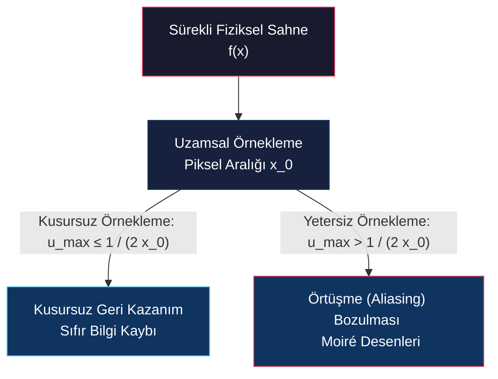
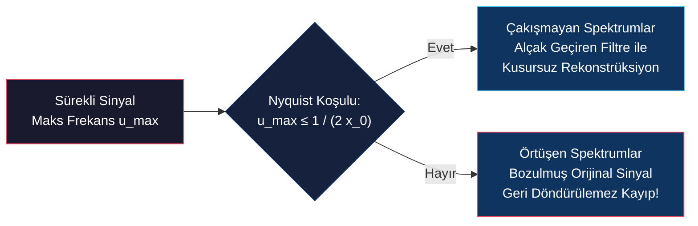

# Örnekleme Teoremi ve Örtüşme (Sampling Theory & Aliasing)

<!-- toc -->

## 1. Dijitalleşme ve Örnekleme Problemi

Sürekli fiziksel bir sahneyi dijital bir görüntüye dönüştürmek uzamsal **örnekleme** (*sampling*) gerektirir. Bu işlem, sürekli uzayı düzenli bir piksel parlaklık örnekleri ağına ayırmaktır. Bu süreç temel bir mühendislik sorusunu beraberinde getirir: *Sürekli bir sahnedeki tüm görsel bilgileri hiçbir kayba uğratmadan geri kazanabilmek için pikselleri ne kadar sık (yoğun) yerleştirmeliyiz?*

<figure style="display:flex; justify-content: center; margin: 20px 0;">
  

    
    <figcaption style="margin-top: 0.5em; text-align: center; font-size: 13px; color: #888;"><em>Sürekli uzamsal sinyal $f(x)$ ve ayrık delta darbeleriyle örneklenmiş dijital sinyal $f_s(x)$</em></figcaption>
  

</figure>

### 1.1 Yetersiz Örnekleme ve Bilgi Kaybı (Under-Sampling)
Eğer yüksek frekanslı (hızlı salınım yapan) sürekli bir sinüs dalgasını seyrek piksellerle örneklersek:
* Elde edilen örnek noktalarını doğrusal interpolasyon ile birleştirdiğimizde, dalga tamamen düz bir çizgiye veya orijinalinde hiç var olmayan bambaşka bir düşük frekanslı dalgaya dönüşür.
* Yetersiz örnekleme nedeniyle sahte ve yanlış düşük frekansların oluşması olayına **Örtüşme** (*Aliasing*) denir.

<figure style="display:flex; justify-content: center; margin: 20px 0;">
  

    
    <figcaption style="margin-top: 0.5em; text-align: center; font-size: 13px; color: #888;"><em>Düşük ve yüksek frekanslı sinyallerin örneklenmesi: Yüksek frekansta yetersiz örnekleme sahte düz/düşük frekanslı sinyal üretir (Aliasing).</em></figcaption>
  

</figure>

### 1.2 Görsel Yansımalar: Moiré Desenleri
Görüntülerde aliasing kendisini **Moiré Desenleri** (örneğin bir tuğla duvarın ince derzlerinde, çizgili bir gömlekte veya ince dairesel ızgaralarda oluşan sahte dalgalı gölgelenmeler ve renk haleleri) olarak gösterir.

<figure style="display:flex; justify-content: center; margin: 20px 0;">
  

    
    <figcaption style="margin-top: 0.5em; text-align: center; font-size: 13px; color: #888;"><em>Kusursuz örneklenmiş görüntü (solda) ile yetersiz örnekleme sonucu oluşan Moiré dalgaları (sağda)</em></figcaption>
  

</figure>

---

## 2. Örneklemenin Matematiksel Modeli (Shah Fonksiyonu)

Sürekli bir $f(x)$ sinyalini $x_0$ aralıklarıyla uzamsal olarak örneklemek, matematiksel olarak $f(x)$ sinyalini sonsuz bir Dirac delta serisi olan **Shah Fonksiyonu** (Darbe Dizisi / *Impulse Train*) $s(x)$ ile çarpmaktır.

<figure style="display:flex; justify-content: center; margin: 20px 0;">
  

    
    <figcaption style="margin-top: 0.5em; text-align: center; font-size: 13px; color: #888;"><em>Sürekli sinyal $f(x)$ ile Shah fonksiyonunun $s(x)$ çarpımı sonucu örneklenmiş sinyal $f_s(x) = f(x)s(x)$</em></figcaption>
  

</figure>

$$s(x) = \sum_{n=-\infty}^{\infty} \delta(x - n x_0)$$

Örneklenmiş sinyal $f_s(x)$:

$$f_s(x) = f(x) \cdot s(x) = f(x) \sum_{n=-\infty}^{\infty} \delta(x - n x_0)$$

### 2.1 Shah Fonksiyonunun Fourier Dönüşümü
Uzamsal düzlemde $x_0$ periyoduna sahip bir Shah fonksiyonunun Fourier dönüşümü, frekans düzleminde $\frac{1}{x_0}$ aralıklı başka bir Shah fonksiyonudur:

$$\mathcal{F}\{s(x)\} = S(u) = \frac{1}{x_0} \sum_{n=-\infty}^{\infty} \delta\left(u - \frac{n}{x_0}\right)$$

<figure style="display:flex; justify-content: center; margin: 20px 0;">
  

    
    <figcaption style="margin-top: 0.5em; text-align: center; font-size: 13px; color: #888;"><em>Uzamsal düzlemdeki Shah fonksiyonu $s(x)$ ($x_0$ aralıklı) ve Fourier düzlemindeki $S(u)$ ($1/x_0$ aralıklı) ikilisi</em></figcaption>
  

</figure>

### 2.2 Frekans Düzleminde Örnekleme (Konvolüsyon Teoremi)
Konvolüsyon Teoremi gereğince, uzamsal düzlemde yapılan **çarpma** işlemi, frekans düzleminde **konvolüsyona** dönüşür:

$$\mathcal{F}\{f_s(x)\} = F_s(u) = F(u) * S(u)$$

$$F_s(u) = F(u) * \left[ \frac{1}{x_0} \sum_{n=-\infty}^{\infty} \delta\left(u - \frac{n}{x_0}\right) \right] = \frac{1}{x_0} \sum_{n=-\infty}^{\infty} F\left(u - \frac{n}{x_0}\right)$$

<figure style="display:flex; justify-content: center; margin: 20px 0;">
  

    
    <figcaption style="margin-top: 0.5em; text-align: center; font-size: 13px; color: #888;"><em>Bant sınırlı spektrum $F(u)$ ile darbe dizisi $S(u)$ konvolüsyonu ($F_s(u) = F(u) * S(u)$)</em></figcaption>
  

</figure>

> **Key Insight: Spektrumun Periyodik Kopyalanması**  
> Uzamsal düzlemde örnekleme yapmak, orijinal $F(u)$ frekans spektrumunu frekans ekseni boyunca $\frac{1}{x_0}$ adımlarıyla sonsuz kez kopyalamak ve üst üste eklemek demektir.

---

## 3. Nyquist-Shannon Örnekleme Teoremi

Sinyal işleme ve bilgisayarlı görünün en temel teoremi olan **Nyquist-Shannon Örnekleme Teoremi**, bir sinyalin kayıpsız geri kazanılabileceği sınır koşulu tanımlar.

### 3.1 Teorem Tanımı
En yüksek frekansı $u_{\max}$ olan bant sınırlı bir sinyalden tüm bilgiyi eksiksiz geri kazanabilmek için, piksel örnekleme aralığı $x_0$ şu şartı sağlamalıdır:

$$u_{\max} \le \frac{1}{2 x_0} \quad \iff \quad \frac{1}{x_0} \ge 2 u_{\max}$$

* **Nyquist Frekansı ($u_N = \frac{1}{2x_0}$):** Belirli bir piksel ızgarasının ($x_0$) temsil edebileceği teorik maksimum frekans sınırıdır.
* **Nyquist Örnekleme Oranı ($2 u_{\max}$):** Bir sinyali kayıpsız dijitalleştirmek için gereken minimum örnekleme frekansıdır.

<figure style="display:flex; justify-content: center; margin: 20px 0;">
  

    
    <figcaption style="margin-top: 0.5em; text-align: center; font-size: 13px; color: #888;"><em>$u_{\max} \le \frac{1}{2x_0}$ sağlandığında spektrum kopyaları ($F_s(u)$) aralarında boşluk bırakarak çakışmadan dizilir.</em></figcaption>
  

</figure>

### 3.2 Aliasing'in Frekans Düzlemindeki Anlamı (Spektral Örtüşme)
Eğer örnekleme sıklığı yetersizse ($u_{\max} > \frac{1}{2x_0}$), $\frac{1}{x_0}$ aralığıyla ötelenen periyodik spektrum kopyaları birbirinin üzerine biner (*overlap*).

<figure style="display:flex; justify-content: center; margin: 20px 0;">
  

    
    <figcaption style="margin-top: 0.5em; text-align: center; font-size: 13px; color: #888;"><em>$u_{\max} > \frac{1}{2x_0}$ durumunda spektrumların üst üste binerek orijinal frekans bilgisini bozması (Aliasing)</em></figcaption>
  

</figure>

Örtüşme meydana geldiğinde yüksek frekanslar, spektrumun sınırından sekerek düşük frekans bölgesine yapay enerji olarak eklenir. Bu işlem gerçekleştikten sonra orijinal $F(u)$ spektrumunu ayrıştırmak matematiksel olarak imkansız hale gelir.

---

## 4. Sinyal Rekonstrüksiyonu (Mükemmel Geri Kazanım)

Nyquist şartı sağlandığında ($u_{\max} \le \frac{1}{2x_0}$), periyodik spektrum $F_s(u)$ içinden sadece merkezdeki orijinal $F(u)$ spektrumunu süzmek için ideal bir **Alçak Geçiren Rekonstrüksiyon Filtresi** $C(u)$ (kutu fonksiyonu) kullanılır:

$$C(u) = \begin{cases} x_0 & \text{eğer } |u| < \frac{1}{2x_0} \\ 0 & \text{diğer durumlarda} \end{cases}$$

$$F(u) = F_s(u) \cdot C(u)$$

<figure style="display:flex; justify-content: center; margin: 20px 0;">
  

    
    <figcaption style="margin-top: 0.5em; text-align: center; font-size: 13px; color: #888;"><em>Merkez spektrumun kutu filtresi $C(u)$ ile süzülüp Ters Fourier Dönüşümü ($\text{IFT}$) ile orijinal $f(x)$ sinyalinin elde edilişi</em></figcaption>
  

</figure>

Uzamsal düzlemde frekanstaki kutu fonksiyonu $C(u)$ bir **Sinc** fonksiyonuna karşılık gelir:

$$c(x) = \mathcal{F}^{-1}\{C(u)\} = \text{sinc}\left(\frac{x}{x_0}\right)$$

$$f(x) = f_s(x) * c(x) = \sum_{n=-\infty}^{\infty} f(n x_0) \cdot \text{sinc}\left(\frac{x - n x_0}{x_0}\right)$$

Bu denklem (Whittaker-Shannon İnterpolasyon Formülü), dijital örnek noktalarından sürekli sinyalin **Sinc İnterpolasyonu** ile kusursuzca nasıl yeniden oluşturulabileceğini kanıtlar.

---

## 5. Aliasing Önleme Teknikleri (Anti-Aliasing)

Gerçek dünyadaki fiziksel sahneler (keskin kenarlar, duvar kaplamaları) sonsuz genişlikte frekans bileşenleri içerir. Dolayısıyla hiçbir dijital sensör Nyquist şartını mükemmel şekilde karşılayamaz.

<figure style="display:flex; justify-content: center; margin: 20px 0;">
  

    
    <figcaption style="margin-top: 0.5em; text-align: center; font-size: 13px; color: #888;"><em>Doğal sahnelerin genlik spektrumu ve kamera sensörünün Nyquist sınırını aşan yüksek frekansların oluşturduğu Moiré desenleri</em></figcaption>
  

</figure>

Kameralar ve görüntüleme sistemleri aliasing bozulmalarını engellemek için iki temel mühendislik çözümü uygular:

### 5.1 Fiziksel Sensör Stratejileri

<figure style="display:flex; justify-content: center; margin: 20px 0;">
  

    
    <figcaption style="margin-top: 0.5em; text-align: center; font-size: 13px; color: #888;"><em>Sensör seviyesinde iki anti-aliasing stratejisi: Alan entegrasyonlu piksel hücreleri (solda) ve Optik Alçak Geçiren Filtre / OLPF (sağda)</em></figcaption>
  

</figure>

1. **Piksel Entegrasyon Alanı (Box-Averaging Filter):** Gerçek sensör pikselleri sonsuz küçük noktalar değil, belirli bir yüzey alanına sahip fotodiyotlardır. Işık piksel yüzeyine düştüğünde alan integral ortalaması alınır. Bu işlem uzamsal kutu filtresi görevi görerek ultra yüksek frekansları doğal olarak süzmektedir.
2. **Optik Alçak Geçiren Filtre (OLPF / Anti-Aliasing Filter):** Kamera sensörünün tam önüne yerleştirilen ince bir çift kırılmalı kristal katmandır. Işık sensöre ulaşmadan hemen önce görüntüyü optik olarak çok hafifçe bulandırır. Nyquist frekansının ($u_N = \frac{1}{2x_0}$) üzerindeki yüksek frekansları fiziksel olarak yok ederek sensörün Moiré deseni üretmesini engeller.
