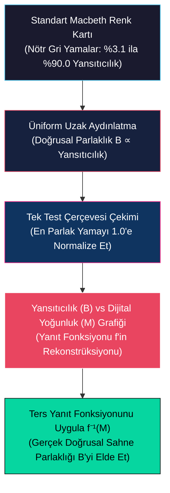
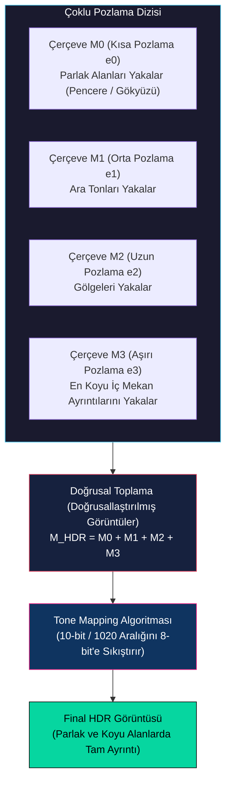
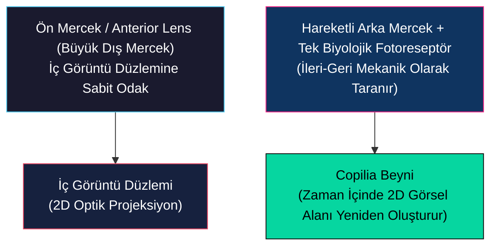

# Kamera Yanıt Fonksiyonu, HDR Görüntüleme ve Doğanın Sensörleri

<!-- toc -->

## 1. Kamera Yanıt Fonksiyonu ve Radyometrik Kalibrasyon

Fiziksel foton akısı ile üretilen sensör yükü arasındaki ilişki son derece doğrusal (lineer) olsa da, tüketici kameraları doğrusal olmayan piksel yoğunlukları üretir.

### 1.1 Kamera Yanıt Fonksiyonu ($f$)

Işık bir sensör pikseline çarptığında, sahne parlaklığı ile ölçülen görüntü yoğunluğu arasındaki ilişkinin monotonik olacağı garantilidir; ancak neredeyse hiçbir zaman doğrusal değildir.

#### Doğrusal Pozlama ($B$)
Piksel içindeki ham yoğunluk $B$, gelen foton akısı $I$ ve toplam pozlama $e$ ile kesinlikle doğrusaldır. Pozlama, diyafram açıklığı alanı $A$ (çap $D$ ile ilişkili) ile entegrasyon süresinin $T$ çarpımıdır:

$$B = I \times e = I \times (A \times T)$$

#### Elektronik Modülasyon
Dijital bir $M$ ölçümü olarak çıktı verilmeden önce, bu doğrusal $B$ yükü elektron-voltaj dönüşümüne, Analog-Dijital dönüşüme (ADC) ve çeşitli dijital görüntü sinyal işleme (ISP) işlemlerine (demosaicing, keskinleştirme ve kontrast iyileştirme gibi) tabi tutulur.

#### Doğrusal Olmayan Sıkıştırma (Gama Eğrisi)
Kamera üreticileri kastı olarak doğrusal olmayan bir $f$ eşleme fonksiyonu (Gama Eğrisi veya Gama Fonksiyonu olarak bilinir) ekler:

$$M = f(B)$$

> **Sıkıştırma İlkesi (The Squeezing Principle):** Dijital görüntü formatları sonlu bir dinamik aralığa (genellikle kanal başına 8 bit, 0-255) sahip olduğundan, doğrusal yoğunlukları doğrudan eşlemek insan gözünün kolayca ayırt edemediği parlak alanlara değerli sayısal bitleri israf eder. Bunun yerine $f$, parlak ve yüksek yoğunluklu bölgeleri (gökyüzündeki bulutlar gibi) sıkıştırırken, karanlık değerlere çok daha yüksek sayısal çözünürlük ayırarak gölge ayrıntılarını korur.

<figure style="display:flex; justify-content: center; margin: 20px 0;">
  

    
    <figcaption style="margin-top: 0.5em; text-align: center; font-size: 13px; color: #888;"><em>Farklı tüketici ve profesyonel görüntüleme sensörleri için gama eğrileri olarak adlandırılan doğrusal olmayan kamera yanıt fonksiyonlarının karşılaştırılması.</em></figcaption>
  

</figure>

### 1.2 Radyometrik Kalibrasyon (Radiometric Calibration)

Kantitatif bilgisayarlı görü uygulamaları (fotometrik stereo veya gölgeden şekil çıkarma gibi) için, doğrusal olmayan $M$ piksel değerlerinden gerçek doğrusal sahne ışıklılığı (irradiance) geri elde edilmelidir. Bu doğrusal olmayan $f$ fonksiyonunu bulma ve tersini alma işlemine **radyometrik kalibrasyon** denir.

#### Macbeth Kartı ile Kalibrasyon Adımları
1. **Kart Seçimi:** Standart bir Macbeth Kartı, %3.1'den (koyu yama) %90.0'a (parlak yama) kadar kesin olarak bilinen fiziksel yansıtıcılık değerlerine sahip nötr gri yamalardan oluşan bir alt satır içerir.
2. **Üniform Aydınlatma:** Kart, tüm yüzeyde mükemmel üniform bir aydınlatma sağlamak için uzak ışık kaynakları kullanılarak aydınlatılır.
3. **Yansıtıcılık Orantılılığı:** Aydınlatma sabit olduğundan, her bir gri yamanın gerçek doğrusal görüntü parlaklığı $B$, bilinmeyen sabit bir $k$ faktörü ile ölçeklenmiş olarak bilinen fiziksel yansıtıcılığı ile doğrudan orantılıdır:
   $$B \propto \text{Yansıtıcılık}$$
4. **Grafik Çizimi ve Tersini Alma:** Kartın tek bir görüntüsü çekilir. Bilinmeyen $k$ ölçek faktörünü ortadan kaldırmak için en parlak yamanın doğrusal yoğunluğu 1.0'e normalize edilir.
5. **Eğri Rekonstrüksiyonu:** x ekseninde bilinen doğrusal yansıtıcılıklar ($B$) ve y ekseninde ölçülen dijital piksel değerleri ($M$) çizilerek kameranın $f$ yanıt eğrisi yeniden oluşturulur.

$f$ kalibre edildikten sonra, pikselleri $f^{-1}$ ters fonksiyonundan geçirerek kamerayla çekilen herhangi bir görüntüyü doğrusallaştırabilir ve gerçek sahne parlaklığını tek bir ölçek faktörüne kadar elde edebiliriz:

$$B = f^{-1}(M)$$

<figure style="display:flex; justify-content: center; margin: 20px 0;">
  

    
    <figcaption style="margin-top: 0.5em; text-align: center; font-size: 13px; color: #888;"><em>Kamera yanıtını doğrusallaştırmak için ölçülen piksel değerlerini Macbeth kartının bilinen yüzey yansıtıcılık değerleriyle eşleyen radyometrik kalibrasyon süreci.</em></figcaption>
  

</figure>

---

## 2. Yüksek Dinamik Aralık (HDR) Görüntüleme

Gerçek dünya ortamları, tüketici sensörlerinin 72 dB'lik dinamik aralığını fazlasıyla aşan devasa bir ışık yoğunluğu aralığı sergiler.

### 2.1 Pozlama Basamaklama (Exposure Bracketing)

Pozlama basamaklama (exposure bracketing), daha geniş bir dinamik aralığa sahip bir görüntü sentezlemek için farklı entegrasyon sürelerinde çekilmiş statik bir sahnenin birden fazla çerçevesini birleştirir.

#### Çoklu Pozlama Dizisi
Kamera, değişen pozlama süreleriyle ($e_0 < e_1 < e_2 < e_3$) bir dizi fotoğraf çeker.

#### Matematiksel Dilimleme
Gerçek parlaklığı $P$ olan bir sahne noktası için $i$ çerçevesindeki ölçülen değer, sensörün maksimum doyum sınırı olan 255 ile sınırlandırılır:

$$M_i = \min(e_i \cdot P,\ 255)$$

- **Kısa Pozlama ($e_0$):** Parlak noktaların (gökyüzü veya pencere gibi) doymasını önler, ancak gölgeleri tamamen siyah ve gürültülü bırakır.
- **Uzun Pozlama ($e_3$):** Sensörü fotonlarla doldurarak karanlık iç mekan gölgelerindeki ayrıntıları yakalar, ancak dış mekan bölgelerini tamamen patlatır (satüre eder).

<figure style="display:flex; justify-content: center; margin: 20px 0;">
  

    
    <figcaption style="margin-top: 0.5em; text-align: center; font-size: 13px; color: #888;"><em>Çoklu pozlama basamaklaması, yüksek dinamik aralıklı bir sahnenin hem parlak hem de gölge bölgelerindeki ayrıntıları kaydetmek için farklı pozlama sürelerinde çekilen bir dizi görüntüyü birleştirir.</em></figcaption>
  

</figure>

#### Doğrusal Toplama
Kamera yanıtının doğrusallaştırıldığı ($f^{-1}$ uygulandığı) varsayılarak, birleşik bir görüntü oluşturmak için bu dört pozlamayı toplarız:

$$M_{\text{HDR}} = M_0 + M_1 + M_2 + M_3$$

Bu birleşik sanal kameranın birleşik yanıt fonksiyonu, karanlık bölgelerde yüksek duyarlılığı korurken yüksek sahne yoğunluklarını sıkıştırır ve maksimum 1020 ($4 \times 255$) sayısal değerine ulaşır.

#### Tone Mapping (Ton Eşleme)
Bir ton eşleme algoritması, bu 10-bitlik yüksek sadakatli çıktıyı tekrar standart 8-bitlik ekran formatlarına sıkıştırarak hem iç mekan gölgelerini hem de dış mekan gökyüzünü mükemmel ayrıntılarla sunar.

<figure style="display:flex; justify-content: center; margin: 20px 0;">
  

    
    <figcaption style="margin-top: 0.5em; text-align: center; font-size: 13px; color: #888;"><em>Basamaklanmış pozlamaların birleşik yanıtı, ayrıntıları korurken dinamik aralığı standart ekranlar için sıkıştıran tone-mapping işleminden geçmiş yüksek dinamik aralıklı bir görüntü üretir.</em></figcaption>
  

</figure>

> **Hayalet Görüntü (Ghosting Artifact):** Pozlama basamaklama statik sahneler için son derece iyi çalışır ancak dinamik ortamlarda başarısız olur. Pozlama dizisi sırasında bir nesne (bisikletli veya yaya gibi) hareket ederse, her çerçevede farklı mekânsal koordinatlarda kaydedilir. Bu çerçevelerin toplanması son görüntüde **hayalet görüntü (ghosting)** olarak bilinen yarı saydam, yinelenen çakışan kopyalarla sonuçlanır.

### 2.2 Karma Pikseller (Assorted Pixels) ile Tek Çekim HDR

Hareketli nesnelerin HDR görüntülerini hayalet görüntü oluşmadan yakalamak için, tüm dinamik aralık tek bir pozlamada kaydedilmelidir. Bu, yaygın olarak **Karma Pikseller (Assorted Pixels)** olarak adlandırılan mekânsal değişken piksel pozlamaları (SVE) kullanılarak elde edilir.

- **Piksel Düzeyinde Duyarlılık Modülasyonu:** Tüm piksellerin özdeş duyarlılığa sahip olduğu üniform bir sensör yerine karma piksel sensörü, eşit olmayan ışık duyarlılıklarına sahip komşu fotodiyotlar içerir.
- **Optomekanik Uygulama:** Bu mekânsal varyasyon, piksellerin üzerine doğrudan farklı optik geçirgenliklerde mikrogölgeler yerleştirilerek veya komşu pikseller farklı entegrasyon süreleriyle sürülerek uygulanır.
- **Mekânsal İnterpolasyon Hattı:**
  - Yüksek duyarlılıklı bir piksel parlak ışık altında doyarsa (255'e kırpılırsa), daha az duyarlı (gölgeli) komşusu doymayacak ve parlak alan ayrıntısını başarıyla kaydedecektir.
  - Gölgeli bir piksel çok karanlıksa, gölgesiz komşusu gölgelerde temiz, yüksek SNR'lı ayrıntılar yakalayacaktır.
  - Bir interpolasyon algoritması daha sonra bu damalı görüntü desenini işleyerek komşu piksellerden eksik yüksek ve düşük pozlama değerlerini kestirir.
- **Sonuç:** Bu tek çekimli HDR mimarisi, hareket bozulmaları içermeyen tam renkli, yüksek kontrastlı görüntüler üretir ve modern akıllı telefon kamera modüllerinde yaygın olarak kullanılır.

<figure style="display:flex; justify-content: center; margin: 20px 0;">
  

    
    <figcaption style="margin-top: 0.5em; text-align: center; font-size: 13px; color: #888;"><em>Karma piksel mimarisi, tek bir pozlamada yüksek dinamik aralıklı veri yakalamak için değişen duyarlıklara veya pozlama sürelerine sahip komşu foto-dedektör alanlarını kullanır.</em></figcaption>
  

</figure>

---

## 3. Doğanın Görüntü Sensörleri ve Biyolojik Görme

Milyonlarca yıllık evrim boyunca doğa, karmaşık algılama zorluklarını zarif ve geleneksel olmayan konfigürasyonlarla çözen görsel sistemler geliştirmiştir.

### 3.1 Copilia'nın Mekanik Tarama Gözü

Mikroskobik plankton benzeri bir deniz kabuklusu olan *Copilia*, optomekanik bir tarayıcı gibi çalışan bir göze sahiptir.

- **Optik Yapı:** Her göz iki mercek içerir. Büyük, statik bir dış ön mercek (anterior lens) kafanın içinde iki boyutlu bir görüntü oluşturmak için ışığı odaklar.
- **Mekanik Tarama:** Bu görüntü düzleminin arkasında, tek bir biyolojik fotoreseptörle (tek piksellik bir sensör) eşleştirilmiş hareketli bir arka mercek (posterior lens) yer alır.
- **Çalışma Prensibi:** *Copilia*, milyonlarca reseptörden oluşan yoğun bir ızgara kullanmak yerine, bu arka mercek-reseptör montajını ön merceğin odak düzlemi boyunca mekanik olarak ileri geri tarar. *Copilia*'nın beyni tek pikseli zaman içinde mekânsal olarak tarayarak çevresinin eksiksiz iki boyutlu bir görüntüsünü yeniden oluşturur.

### 3.2 Yılan Yıldızı (*Ophiocoma wendtii*): Mercekle Kaplı Gövde

<figure style="display:flex; justify-content: center; margin: 20px 0;">
  

    
    <figcaption style="margin-top: 0.5em; text-align: center; font-size: 13px; color: #888;"><em>Yılan yıldızının tüm gövdesini kaplayan ve dağıtılmış, esnek bir göz gibi işlev gören kalsitik mikromercek dizisini gösteren taramalı elektron mikroskobu (SEM) görüntüsü.</em></figcaption>
  

</figure>

Yılan Yıldızı (*Ophiocoma wendtii*), beyni ve geleneksel odaksal gözleri olmayan bir deniz canlısıdır. Onlarca yıl boyunca biyologlar, bu canlının karmaşık kayalıklarda gezinme ve avcılardan kaçma yeteneği karşısında şaşkına dönmüşlerdir.

- **Keşif:** 2001 civarında taramalı elektron mikroskobu (SEM) incelemeleri, yılan yıldızının tüm kalsitik iskelet gövdesinin milyonlarca minik, yüksek derecede saydam kalsit kristal kabarcığıyla kaplı olduğunu ortaya çıkardı.
- **Optik Hassasiyet:** Her kristal kabarcığı, çapı yaklaşık milimetrenin 20'de biri olan optik olarak mükemmel bir mikromercektir.
- **Esnek Kamera:** Bu kalsitik mikromercekler ışığı doğrudan altlarında uzanan sinir lifi demetlerine odaklar. Yılan yıldızının tüm iskelet gövdesi etkili bir şekilde devasa, esnek, kavisli bir görüntü sensörü gibi çalışarak tüm vücudu boyunca ışık ve gölgenin mekânsal dağılımını algılamasını sağlar.

### 3.3 Ahtapot Kamufle Olması ve Kromatoforlar

Ahtapotun derisi dinamik bir biyolojik ekran ve sensör dizisidir.

- **Kromatoforlar:** Deri, kromatofor adı verilen renk pigmenti dolu milyonlarca mikroskobik kese içerir.
- **Nöral Kontrol:** Bu keseler etraftaki kas lifleri tarafından doğrudan kontrol edilir. Beyin bir nöral impuls gönderdiğinde kaslar kasılır veya gevşer; bu da pigment keselerinin fiziksel şeklini ve yüzey alanını değiştirir.
- **Kamufle Olma:** Ahtapot hangi renklerin açığa çıkacağını hassas bir sekilde modüle ederek etrafındaki mercan kayalıklarının veya bitkilerin dokusuna, rengine ve yansıtıcılığına uyum sağlayabilir. Bu gerçek zamanlı kamuflaj o kadar mükemmeldir ki ahtapot yakın mesafeden bile avcılar için tamamen görünmez kalır.

### 3.4 İnsan Gözünün Kör Noktası (Blind Spot)

İnsan gözünde retinanın biyolojik kablolanması benzersiz bir optik kusur yaratır.

- **Optik Disk (Optic Disk):** Çubuklar ve koniler tarafından üretilen tüm sinir impulsları retinadaki tek bir noktada toplanan aksonlar boyunca ilerler: optik disk.
- **Sıfır Reseptör Yoğunluğu:** Bu çıkış noktasında optik sinir, beynin görsel korteksine gitmek üzere retina katmanını delip geçer. Sinir bu alanı kapladığı için retinada çubuk ve konilerden tamamen yoksun fiziksel bir yama vardır. Burası **kör noktadır**.

> **Nöral İnpainting (Neural Inpainting):** Günlük görüş alanımızda fiziksel bir delik fark etmeyiz çünkü beynimiz çevredeki doku, renk ve bağlama dayanarak eksik görsel bilgileri dolduran gerçek zamanlı mekânsal bir "inpainting" (interpolasyon) gerçekleştirir.
