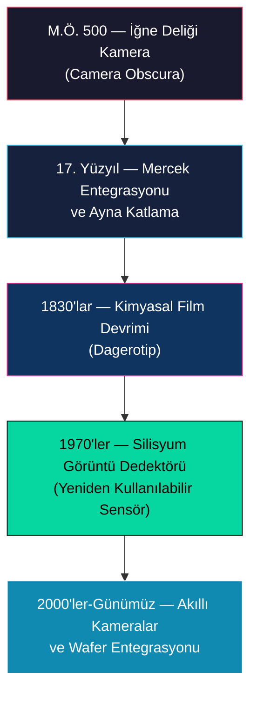
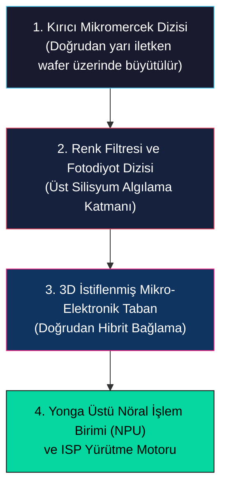
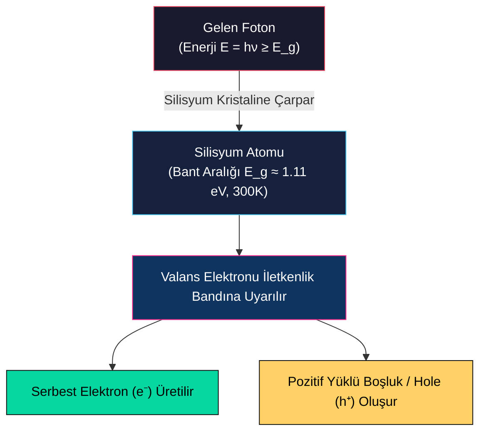
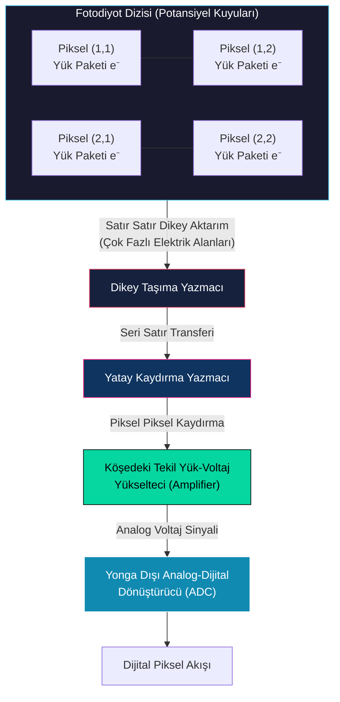
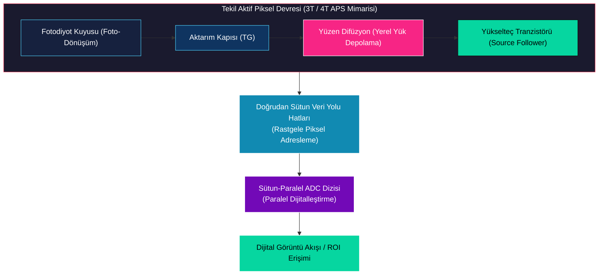
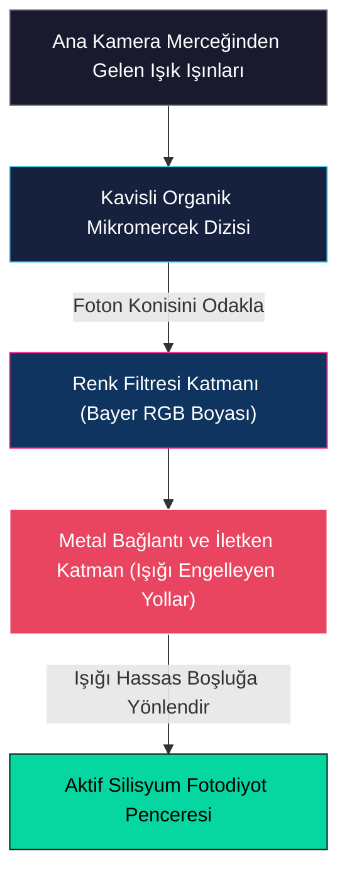

# Genel Bakış, Tarihçe ve Görüntü Sensör Türleri

<!-- toc -->

## 1. Genel Bakış

Görüntü algılama (image sensing), üç boyutlu (3D) bir sahneden yayılan veya yansıyan elektromanyetik radyasyonun (ışığın) yakalanarak iki boyutlu (2D) kalıcı ve ölçülebilir bir temsil biçimine dönüştürülmesi işlemidir. Optik sistemler (mercekler ve diyaframlar) projeksiyonun *geometrisini* yönetirken, görüntü algılama mekanizması *fotometrik dönüşümü* yönetir — yani gelen foton akısını filmdeki kimyasal indirgenmeye veya silisyumdaki elektrik yüküne dönüştürür.

Görüntü sensörlerinin evrimini ve fiziğini anlamak, bilgisayarlı görü (computer vision) disiplininin temelini oluşturur: Dijital pikseller üzerinde çalışan her algoritma, alt katmandaki sensör mimarisinin optoelektronik özelliklerine, örnekleme sınırlarına, dinamik aralığına ve gürültü karakteristiklerine doğrudan bağımlıdır.

> **Temel Sezgi (Key Insight):** Optik düzenek ışık ışınlarının düzlemde *nereye* düşeceğini belirler; algılama mekanizması ise foton enerjisinin *nasıl* sayılabilir bir sinyale (yük veya voltaj) dönüştürüleceğini yönetir.

---

## 2. Görüntülemenin Kısa Tarihçesi

Işığı yakalama ve fiziksel dünyayı iki boyutlu bir yüzeye yansıtma yolculuğu, pasif optik projeksiyondan kimyasal depolamaya ve nihayetinde dijital silisyum mimarilerine uzanan asırlık bilimsel ve sanatsal bir evrimi kapsar.

### 2.1 İğne Deliği Kamera (Camera Obscura)

Görüntü oluşumunun temel kavramları M.Ö. 500 yıllarına, Çinli filozofların iğne deliği kamera ilkelerini belgelemesine kadar uzanır. M.S. 1000 civarında, Arap bilim insanı İbn-i Heysem (Alhazen), iğne deliği kameranın optik özelliklerini ve geometrik projeksiyonunu titizlikle analiz etmiştir.

Konseptin Batı'da, özellikle sanatçılar arasında yaygınlaşması 16. yüzyılı bulmuştur. Felemenkli matematikçi Gemma Frisius'un 1544 tarihli çiziminde gösterildiği gibi:
1. Karanlık bir odanın duvarındaki minik bir iğne deliği, 3D bir sahneyi karşı duvara yansıtarak ters dönmüş 2D bir görüntü oluşturur.
2. Sanatçı camera obscura odasına girerek duvardaki projeksiyonun üzerinden çizebilir ve 3D sahnenin geometrik olarak son derece doğru çizimlerini elde edebilirdi.

> **Optik Kısıt:** İğne deliği kamera sonsuz alan derinliğinde son derece keskin görüntüler üretse de, açıklığı matematiksel olarak çok küçük olduğu için çok az foton toplar. Sonuçta oluşan projeksiyonlar son derece karanlıktır ve gözün karanlığa uyum sağlaması gerekir.

### 2.2 Mercek ve Ayna Entegrasyonu

İğne deliğinin foton yetersizliğini (photon starvation) çözmek amacıyla 17. yüzyıl tasarımcıları, minik iğne deliği yerine kırıcı bir dışbükey (konveks) mercek yerleştirdiler. Mercek, çok daha geniş bir ışık konisini odaklayarak belirgin şekilde daha parlak görüntüler oluşturdu.

18. yüzyılda optomekanik tasarımlar sanatçı ergonomisine odaklandı:
- Mercek tarafından yansıtılan dikey ışık konusu $45^\circ$'lik bir ayna ile katlandı.
- Bu düzenek ışığı yukarıya, yatay ve yarı saydam bir aydınger kâğıdına yönlendirdi.
- Sanatçı rahatça oturup aşağıya bakarak sahnenin üzerinden çizebiliyordu. Bu optomekanik mimari, daha sonra Tek Mercekli Yansımalı (SLR) vizör sistemlerine ilham vermiştir.

<figure style="display:flex; justify-content: center; margin: 20px 0;">
  

    
    <figcaption style="margin-top: 0.5em; text-align: center; font-size: 13px; color: #888;"><em>18. Yüzyıl Aynalı/Mercekli Box Camera Obscura: Merceğin oluşturduğu görüntüyü 45 derecelik bir ayna ile yatay buzlu cama katlayarak ressamların çizimini kolaylaştıran optomekanik kutu tasarımı.</em></figcaption>
  

</figure>

### 2.3 Kimyasal Film Devrimi

Görüntülemedeki en köklü kültürel sıçrama 1830'larda Louis Daguerre'in **Dagerotip (Daguerreotype)** kamerasını icat etmesiyle gerçekleşti. 1837'de çekilen natürmort fotoğraflar, bir sahnenin insan sanatçıyı aradan çıkararak tek bir düğmeye basışla kalıcı bir kimyasal ortama kaydedilebileceğini kanıtladı.

<figure style="display:flex; justify-content: center; margin: 20px 0;">
  

    
    <figcaption style="margin-top: 0.5em; text-align: center; font-size: 13px; color: #888;"><em>Louis Daguerre - Still Life (1837): Daguerreotype kamera ile çekilen ve insanlık tarihinin ilk kalıcı kimyasal film görüntülerinden biri olan alçı büst ve obje natürmortu.</em></figcaption>
  

</figure>

#### Siyah-Beyaz Filmin Kimyasal Süreci
1. **Emülsiyon:** Film, ışığa duyarlı gümüş halojenür kristalleri ($\text{AgX}$, burada $\text{X} = \text{Br, Cl, I}$) içeren mikroskobik bir katmanla kaplanır.
2. **Pozlama (Exposure):** Foton emilimi, gümüş iyonlarının metallic gümüşe indirgenmesini tetikler:
   $$\text{Ag}^+ + e^- \xrightarrow{h\nu} \text{Ag}^0$$
   Toplam pozlama enerjisi $E$, karşılıklılık yasasına (reciprocity law) uyar:
   $$\text{Pozlama } (E) \propto \text{Işınım (Irradiance } I) \times \text{Entegrasyon Süresi } (T)$$
3. **Banyo / Geliştirme (Development):** Kimyasal banyo, bu gizil (latent) gümüş görüntüsünü büyüterek kararlı, yüksek çözünürlüklü bir fotoğraf negatifine dönüştürür.

#### Renkli Filme Geçiş (1880'ler)
Tüm görünür spektrumu yakalamak daha karmaşık bir emülsiyon kimyası gerektirdi. 1887'de Louis Ducos du Hauron; Kırmızı, Yeşil ve Mavi pigmentler içeren boya bağlayıcılı katmanları gümüş halojenür ile üst üste istifleyerek ilk renkli fotoğrafları elde etti.

<figure style="display:flex; justify-content: center; margin: 20px 0;">
  

    
    <figcaption style="margin-top: 0.5em; text-align: center; font-size: 13px; color: #888;"><em>Louis Ducos du Hauron - Angoulême Manzarası (1877/1887): Üç renkli (kırmızı, yeşil, mavi) emülsiyon ve boya bağlayıcı katmanlarla çekilen ilk renkli manzara fotoğrafı.</em></figcaption>
  

</figure>

1920'lere gelindiğinde Ernemann gibi tüketici kameraları *"Görebildiğin her şeyi fotoğraflayabilirsin"* sloganıyla kitle pazarına girdi ve görsel kaydı insan ifadesinin evrensel bir aracı haline getirdi.

<figure style="display:flex; justify-content: center; margin: 20px 0;">
  

    
    <figcaption style="margin-top: 0.5em; text-align: center; font-size: 13px; color: #888;"><em>Ernemann Katlanabilir Plaka Film Kamerası: 1920'lerde mass-market tüketici fotoğrafçılığını başlatan ve "Gördüğünü fotoğraflayabilirsin" reklamıyla sunulan ikonik cihaz.</em></figcaption>
  

</figure>

### 2.4 Silisyum Görüntü Dedektörü (Silicon Detector)

Kimyasal film görsel kültürü devrimcileştirmiş olsa da, tek kullanımlık bir sarf malzemesi olması en büyük kısıtıydı. 1970'lerde silisyum görüntü dedektörünün icadı bu paradigmayı kökten değiştirdi:

- Kimyasal filmin aksine, silisyum sensör kimyasal banyo gerektirmeden sonsuz sayıda görüntü dizisi yakalayabilen **yeniden kullanılabilir bir katı hal (solid-state) cihazıdır**.
- Silisyum üretiminin tüketici seviyesine ulaşması yaklaşık 20 yıl sürdü ve 1990'ların başında Nikon COOLPIX gibi ilk dijital kameralar piyasaya çıktı.
- Bu ilk cihazlar $640 \times 480$ piksel ($\approx 0.3\text{ MP}$) çözünürlük sunuyor, yüksek güç tüketiyor ve hızlı depolamadan yoksun bulunuyordu; ancak dijital görüntü işlemenin geleceğini kanıtladı.

### 2.5 Akıllı Telefon Kameraları ve AI Katalizörü

20. yüzyılın sonları ve 21. yüzyılın başlarında kamera modüllerinin cep telefonlarına entegre edilmesi, benzeri görülmemiş bir minyatürleşme ve optik mühendisliği hamlesi başlattı.

- 2007'de akıllı telefonların doğuşu ikinci dijital kamera devrimini tetikledi.

<figure style="display:flex; justify-content: center; margin: 20px 0;">
  

    
    <figcaption style="margin-top: 0.5em; text-align: center; font-size: 13px; color: #888;"><em>Apple iPhone 1 (2007) Arka Gövde Görseli: Tüketici elektroniğinde kamera minyatürleşmesinin miladı sayılan ve bilgisayarlı görünün gelişimini tetikleyen ilk iPhone tasarımı.</em></figcaption>
  

</figure>

- Bu mobil kamera patlaması petabaytlarca görsel veri üreten küresel iletişim platformlarını doğurdu.
- En önemlisi, bu devasa dijital görüntü akışı, modern bilgisayarlı görü ve derin öğrenme algoritmalarının temel veri kümesini ve hesaplamalı katalizörünü oluşturdu.

### 2.6 Yüzyıllık Karşılaştırma: Kodak Brownie vs. Modern Akıllı Telefon Kamerası

| Özellik / Parametre | Kodak Brownie Model 1 (1900) | Modern Akıllı Telefon Kamera Modülü |
| :--- | :--- | :--- |
| **Satış Fiyatı** | 1.00$ USD (Enflasyon ayarlı ~30$ USD) | Kitlesel üretimle optimize edilmiş maliyet |
| **Optik Geometri** | Tekil küresel cam mercek elemanı | Çok elemanlı, ultra ince asferik kalıplanmış plastik/cam mercekler |
| **Odaklama Mekanizması** | Sabit odaklı (Fixed-focus) sistem | Mikron hassasiyetli ses bobini motoru (VCM) ile dinamik otofokus |
| **Diyafram Kontrolü** | Farklı delik çaplarına sahip kayar metal plaka | Minyatür diyafram dizileri veya sabit düşük F-sayılı açıklıklar ($f/1.5 - f/1.8$) |
| **Vizör ve Geri Bildirim** | Köşede küçük yansıtıcı ayna (sensör beslemesi yok) | Canlı elektronik sensör akışını gösteren gerçek zamanlı dijital ekran |
| **Kayıt Ortamı / Gecikme** | Gümüş halojenür rulo film; postayla gönderim; haftalarca gecikme | Silisyum sensör; dahili ISP; anlık görselleştirme ve sıfır deklanşör gecikmesi |

### 2.7 Gelecek Vizyonu: Wafer Seviyesinde Entegrasyon (Wafer-Scale Integration)

Sensör tasarımındaki bir sonraki paradigma kayması **Optics-on-Wafer** ve **3D-Stacked Sensor** teknolojisidir:

- Tamamlanmış sensörün üzerine ayrı plastik mercekler monte etmek yerine, kırıcı mercek elemanları dökümhanede doğrudan silisyum wafer üzerinde büyütülür.
- Algılama katmanının altına 3D istiflenmiş elektronik devreler doğrudan entegre edilir.
- Bu mimari; Görüntü Sensörünü, Renk Filtresini, Mikromercekleri ve dijital mikro-nöral işlemcileri tek bir birleşik yongada toplar — kamerayı pasif bir yakalama cihazından otonom bir yonga üstü bilgisayarlı görü sistemine dönüştürür.

---

## 3. Görüntü Sensör Türleri ve Katı Hal Fiziği

### 3.1 Silisyum Foto-Dönüşümünün Fiziği

Dijital görüntü algılamanın temel mekanizması, kristal silisyumun ($\text{Si}$) optoelektronik özelliklerine dayanır.

<figure style="display:flex; justify-content: center; margin: 20px 0;">
  

    
    <figcaption style="margin-top: 0.5em; text-align: center; font-size: 13px; color: #888;"><em>Silisyum Foto-Konversiyon Fiziği Şeması: Gelen fotonun silikon atomuna çarparak valans elektronunu iletim bandına uyarmasını ve elektron-delik çifti (electron-hole pair) oluşturmasını gösteren şema.</em></figcaption>
  

</figure>

1. **Bant Aralığı Enerjisi ($E_g$):** Silisyumun bant aralığı oda sıcaklığında ($300\text{ K}$) yaklaşık $E_g \approx 1.11\text{ eV}$'dir. $E = h\nu \ge E_g$ enerjisine sahip gelen bir foton silisyum kristaline çarptığında, bir valans elektronunu iletkenlik bandına uyarır.
2. **Elektron-Boşluk Çifti Üretimi:** Bu uyarılma serbest bir iletkenlik elektronu ($e^-$) oluşturur ve geride pozitif yüklü bir boşluk ($h^+$) bırakır.
3. **Kuantum DENGESİ:** Sürekli aydınlatma altında, gelen foton akısı ile üretilen elektron akısı arasında bir kararlı durum kurulur. Biriken bu elektron yükünün ölçülmesi, o konuma düşen ışık yoğunluğunu nicelleştirmemizi sağlar:
   $$Q = \int_{0}^{T} \frac{\eta \cdot q \cdot P(t)}{h\nu} \, dt$$
   burada $\eta$ kuantum verimliliği, $q$ elektron yükü, $P(t)$ optik güç ve $T$ pozlama süresidir.

> **Mühendislik Zorluğu:** Silisyum optik-elektronsal dönüşümü doğal olarak gerçekleştirir. Temel mühendislik zorluğu, milyonlarca pikseldeki bu hassas elektron paketlerini gürültü, sinyal bozulması veya çapraz etkileşim (cross-talk) olmadan okumaktır.

### 3.2 Minyatürleşme Sınırları ve Moore Yasası

Modern yüksek yoğunluklu sensörler, piksel aralığı $1.25\ \mu\text{m}$'ye kadar düşen onlarca megapikseli küçücük mobil alanlara sığdırır. Ancak piksel küçültme, ışığın kırınım fiziği nedeniyle Moore Yasasını sonsuza kadar takip edemez:

- **Görünür Dalga Boyu Spektrumu:** Görünür ışık $\lambda \approx 400\text{ nm}$ (mor) ile $\lambda \approx 700\text{ nm}$ (kırmızı) arasında değişir.
- **Kırınım Sınırı (Diffraction Limit):** Piksel boyutu $d$ yaklaşık yarım mikrometreye ($d \approx 0.5\ \mu\text{m}$) düştüğünde, ışığın dalga boyu mertebesine ulaşır:
  $$d_{\text{sınır}} \approx \frac{\lambda}{2}$$
- Bu sınırın altında optik kırınım (diffraction) baskın hale gelir. Işık dalgaları piksel sınırlarından bükülerek komşu pikseller arasında şiddetli optik çapraz etkileşime (cross-talk) yol açar ve fiziksel alan ne kadar küçültülürse küçültülsün gerçek optik çözünürlük artışını engeller.

> **Ana Çıkarım:** Kırınım sınırının ötesinde çözünürlüğü artırmak için mühendisler bireysel pikselleri küçültmek yerine silisyum yonganın fiziksel alanını büyütmek zorundadır.

### 3.3 CCD (Charge Coupled Device) Mimarisi

1969 yılında Willard Boyle ve George E. Smith tarafından icat edilen **CCD (Charge-Coupled Device)** mimarisi, bir analog kaydırmalı yazmaç (shift register) gibi çalışır.

#### Okuma Mekanizması: Kovalı Taşıma (Bucket Brigade)
1. **Potansiyel Kuyuları:** Her piksel, pozlama süresince foto-üretilmiş elektronları biriktiren bir potansiyel kuyusu (fotodiyot) olarak görev yapar.
2. **Dikey Satır Aktarımı:** Pozlama tamamlandığında yükler piksel içinde voltaja dönüştürülmez. Elektrot kapılarına uygulanan çok fazlı saat voltajları, tüm yük satırlarını adım adım altındaki potansiyel kuyularına kaydırır.
3. **Yatay Kaydırma ve Yükseltme:** En alt satır yatay kaydırma yazmacına girer ve yükler her defasında tek bir piksel kaydırılarak yonganın köşesindeki yüksek hassasiyetli yük-voltaj yükseltecine iletilir.
4. **Dijitalleştirme:** Köşedeki yükselteç her yük paketini voltaj sinyaline dönüştürür ve bu sinyal yonga dışındaki bir ADC tarafından dijitalleştirilir.

> **Kovalı Taşıma Benzetmesi:** CCD yük transferi, yangını söndürmek için elden ele su kovası taşıyan insan dizisine benzer. Tek bir çıkış yükselteci kullandığı için pikseller arası mükemmel birörnekliğe (uniformity) ve düşük gürültüye sahiptir; ancak yüksek güç tüketimi, yavaş okuma hızı ve blooming duyarlılığı en büyük dezavantajlarıdır.

<figure style="display:flex; justify-content: center; margin: 20px 0;">
  

    
    <figcaption style="margin-top: 0.5em; text-align: center; font-size: 13px; color: #888;"><em>CCD Satır Kaydırma "Bucket Brigade" Şeması: Potansiyel kuyulardaki elektron paketlerinin elektrot elektrik alanları yardımıyla satır satır aşağı, ardından yatay olarak köşedeki amplifikatöre aktarım şeması.</em></figcaption>
  

</figure>

### 3.4 CMOS (Complementary Metal-Oxide Semiconductor) Mimarisi

**CMOS Aktif Piksel Sensörü (APS)** modern dijital görüntülemenin baskın mimarisidir.

#### Okuma Mekanizması: Yerel Dönüşüm ve Rastgele Erişim
- **Piksel İçi Yük Dönüşümü:** CCD'lerin aksine, her bir CMOS pikseli kendi foto-diyodunun hemen yanında kendi yük-voltaj dönüştürücü devresine (genellikle 3 veya 4 tranzistörlü aktif piksel tasarımı) sahiptir.
- **Doğrudan Adreslenebilirlik:** CMOS sensörler satır seçme ve sütun okuma hatlarını kullanarak sistem RAM'ine benzer şekilde rastgele piksel adreslemeye izin verir.
- **İlgi Bölgesi (Region of Interest - ROI):** Bu mimari, sensörün tüm çerçeveyi okumak yerine sadece belirlenen alt pencereleri (ROI) aşırı yüksek kare hızlarında okumasını sağlar.

<figure style="display:flex; justify-content: center; margin: 20px 0;">
  

    
    <figcaption style="margin-top: 0.5em; text-align: center; font-size: 13px; color: #888;"><em>CMOS Aktif Piksel Okuma Şeması: Her pikselin yanında kendi elektron-voltaj dönüştürücü devresinin bulunduğu ve veri yolu (bus lines) ile adrese dayalı doğrudan piksel okuma tasarımı.</em></figcaption>
  

</figure>

| Mimari Karşılaştırması | CCD (Charge-Coupled Device) | CMOS (Active-Pixel Sensor) |
| :--- | :--- | :--- |
| **Yük Dönüşümü** | Piksel dışı (Köşede tek yükselteç) | Piksel içi (Her pikselde tranzistör) |
| **Okuma Türü** | Seri yük aktarımı ("Kovalı Taşıma") | Paralel voltaj okuma (Rastgele erişim) |
| **Güç Tüketimi** | Yüksek (Çok fazlı yüksek voltaj saatleri) | Düşük (Standart CMOS dijital voltajı) |
| **Okuma Hızı** | Seri aktarım darboğazı nedeniyle sınırlı | Son derece yüksek (Sütun-paralel ADC'ler) |
| **Dolgu Faktörü (Fill Factor)** | $\approx \%100$ (Piksel içi tranzistör yok) | Düşük (Tranzistörler piksel alanını kaplar) |

### 3.5 Mikro-Optik: Mikromercek Dizisi (Microlens Array)

CMOS sensörlerde piksel içi tranzistör devrelerinin neden olduğu dolgu faktörü (fill factor) kaybını telafi etmek amacıyla üreticiler, sensör yüzeyinin üzerine bir **Mikromercek Dizisi** entegre ederler.

- **Çalışma Prensibi:** Her pikselin üzerine minik kavisli organik bir mikromercek yerleştirilir.
- **Foton Hunileme (Photon Funneling):** Işık ışınlarının duyarsız tranzistör yollarına çarpmasına izin vermek yerine mikromercek, piksel alanındaki tüm fotonları toplayıp kırarak aktif fotodiyot alanına odaklar.

<figure style="display:flex; justify-content: center; margin: 20px 0;">
  

    
    <figcaption style="margin-top: 0.5em; text-align: center; font-size: 13px; color: #888;"><em>Mikromercek ve Filtre Dizilimi 3D Modeli: Silikon taban üzerindeki fotodiyotların üzerine yerleştirilen Bayer filtre mozaiği ve en üstteki organik ışık toplama mikromerceklerinin (microlenses) 3D kesiti.</em></figcaption>
  

</figure>

- **Mikro-Katman Yapısı:** Taramalı Elektron Mikroskobu (SEM) incelemeleri, mikromercek tepesinden silisyum tabanına kadar olan toplam katman yüksekliğinin yalnızca $\approx 9.6\ \mu\text{m}$ olduğunu gösterir:
  1. *Üst Katman:* Kavisli organik mikromercek dizisi
  2. *Ara Katman:* Renk filtresi dizisi (RGB boyaları)
  3. *Taban Katmanı:* Fotodiyot kuyuları, yüzen difüzyon ve metal bağlantı yolları içeren silisyum taban.

<figure style="display:flex; justify-content: center; margin: 20px 0;">
  

    
    <figcaption style="margin-top: 0.5em; text-align: center; font-size: 13px; color: #888;"><em>Görüntü Sensörü SEM Enine Kesit Görüntüsü: Taramalı Elektron Mikroskobu (SEM) ile çekilen; mikromercek, renk filtresi, metal yollar ve silikon tabakanın toplam 9.6 mikrometre kalınlığını gösteren gerçek nanoyapı görüntüsü.</em></figcaption>
  

</figure>
