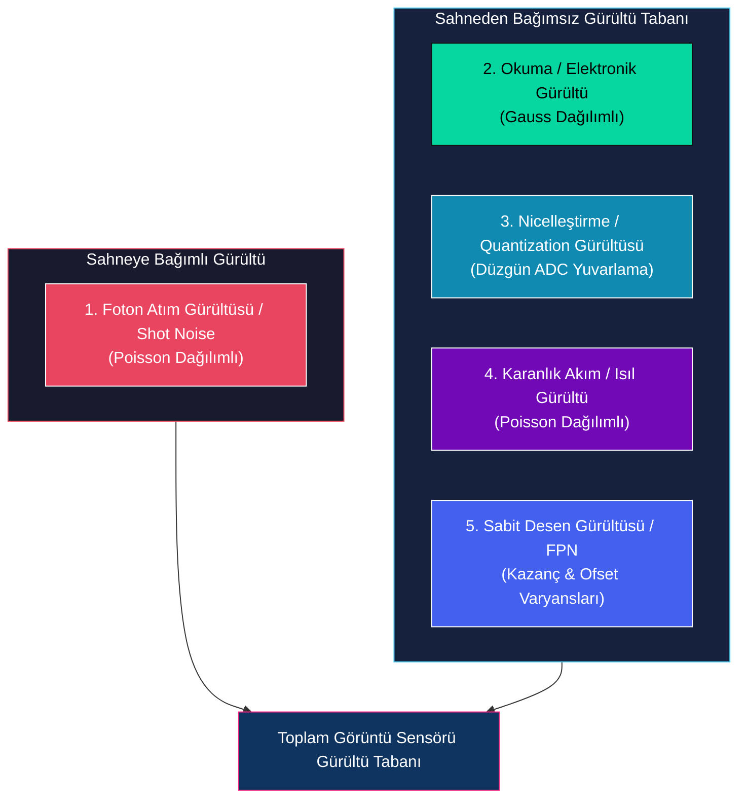
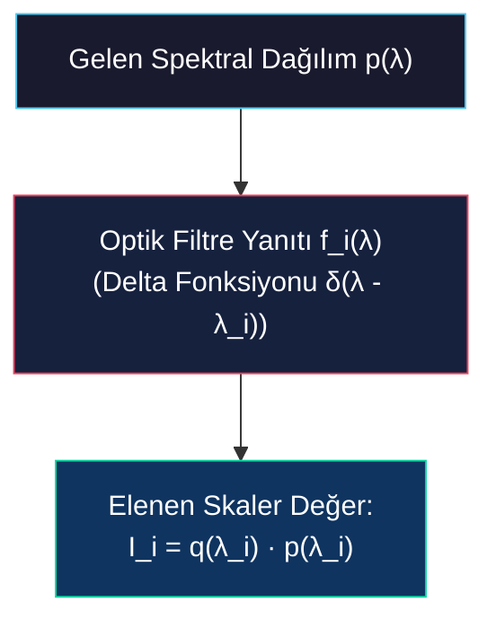
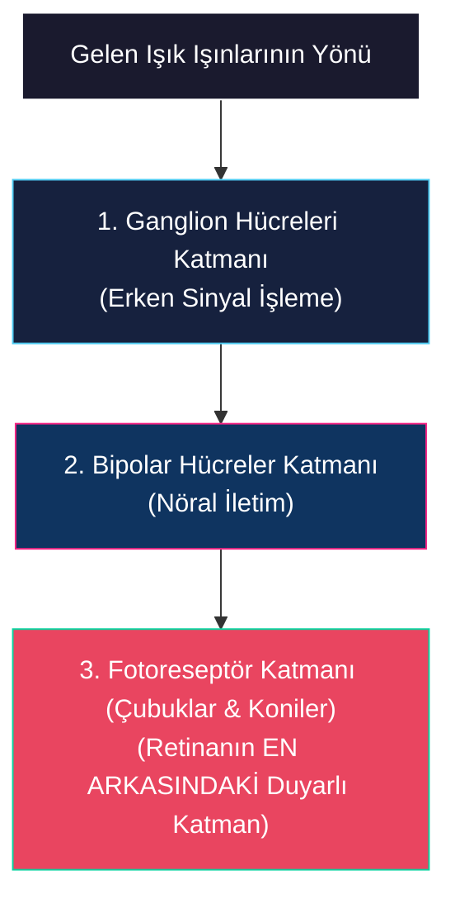
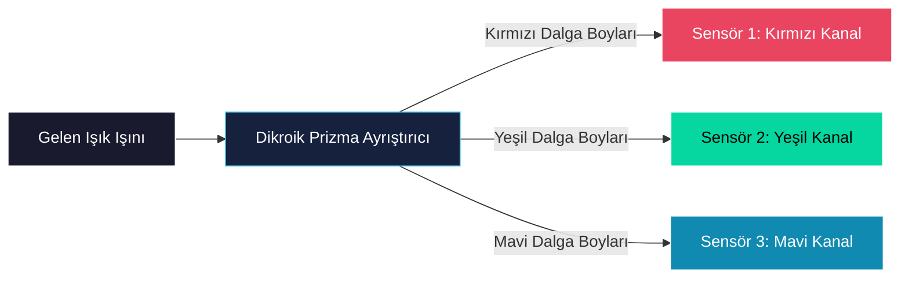

# Çözünürlük, Gürültü, Dinamik Aralık ve Renk Algılama

<!-- toc -->

## 1. Çözünürlük, Gürültü ve Dinamik Aralık

Bir görüntü sensörünün performansı matematiksel ve fiziksel olarak geometrik çözünürlüğü, elektronik gürültü tabanı (noise floor) ve dinamik aralık sınırı ile kısıtlanır. Bu parametreleri anlamak, dayanıklı ve güvenilir bilgisayarlı görü hatları (pipelines) tasarlamak için şarttır.

### 1.1 Çözünürlük Eğilimleri

1990'ların ortalarından 2010'ların başlarına kadar sensör çözünürlüğü hızlı bir büyüme geçirdi ve sub-megapiksel formatlardan ($640 \times 480$ piksel) 16 megapikseli aşan standart tüketici formatlarına kaydı. İlk sensörler yüksek güç tüketimi ve ciddi ısıl kısıtlamalardan muzdaripken, modern yarı iletken üretim düğümleri son derece düşük gürültü değerlerine sahip düşük güçlü, yüksek yoğunluklu sensörler üretmektedir. Bu sensörler genellikle standart bilgisayarlı görü uygulamalarının gereksinimlerini aşan çözünürlükler (örneğin 50 megapiksel) sunar.

> **Temel Sezgi (Key Insight):** Modern sensör üretimi piksel yoğunluğunu okuma hızından büyük ölçüde bağımsızlaştırmış, bilgisayarlı görüdeki temel darboğazı mekânsal çözünürlükten veri iletim bant genişliğine ve gerçek zamanlı işlem kapasitesine kaydırmıştır.

### 1.2 Sensör Gürültüsünün Matematiksel Formülasyonu

Gürültü, optik sinyalin yakalanması, elektronik dönüşümü, dijital işlenmesi, iletimi veya depolanması sırasında meydana gelen istenmeyen bozulmaları temsil eder. Dijital görüntüleme sistemleri, sahneye bağımlı (scene-dependent) ve sahneden bağımsız (scene-independent) olmak üzere beş temel gürültü kaynağından etkilenir:

#### 1.2.1 Foton Atım Gürültüsü / Shot Noise (Sahneye Bağımlı)

Foton atım gürültüsü (photon shot noise), doğrudan ışığın kuantum ve kesikli yapısından kaynaklanır. Işık fotonları bir pikselin açıklığına rastgele zamanlarda ulaşır; bu durum bir kovaya düşen yağmur damlalarına benzetilebilir. Bu geliş dizisi matematiksel olarak Poisson Dağılımı ile modellenir:

$$P(k) = \frac{\lambda^k e^{-\lambda}}{k!}$$

<figure style="display:flex; justify-content: center; margin: 20px 0;">
  

    
    <figcaption style="margin-top: 0.5em; text-align: center; font-size: 13px; color: #888;"><em>Foton Gürültüsü Poisson Dağılım Grafikleri: Farklı ortalama foton geliş oranları ($\lambda$) için olasılık dağılım eğrileri.</em></figcaption>
  

</figure>

burada:
- $\lambda$, pozlama (entegrasyon) süresi boyunca piksel üzerine düşen beklenen ortalama foton akısıdır (gerçek sahne parlaklığını temsil eder).
- $k$, belirli bir pozlama penceresinde gerçekten yakalanan foton sayısıdır.

##### Matematiksel Özellik
Poisson dağılımının temel bir özelliği, varyansının ($\sigma^2$) ortalamasına ($\lambda$) eşit olmasıdır:

$$\text{Var}(\text{Sinyal}) = \sigma^2 = \lambda$$

$$\text{Standart Sapma } (\sigma) = \sqrt{\lambda}$$

##### Sahne Bağımlılığı ve SNR
Varyans doğrudan gerçek parlaklık $\lambda$'ya bağlı olduğundan, atım gürültüsü son derece sahneye bağımlıdır. Yüksek yoğunluklu aydınlatma altında (büyük $\lambda$), mutlak gürültü standart sapması artar; ancak sinyal gürültüden daha hızlı büyüdüğü için Sinyal-Gürültü Oranı (SNR) iyileşir:

$$\text{SNR} = \frac{\text{Sinyal}}{\text{Gürültü}} = \frac{\lambda}{\sqrt{\lambda}} = \sqrt{\lambda}$$

##### Gauss Yakınsaması
$\lambda \ge 10$ olduğu bağıl olarak parlak bölgelerde Poisson dağılımı matematiksel olarak standart simetrik Gauss eğrisine yakınsar.

#### 1.2.2 Okuma Gürültüsü / Readout Noise (Sahneden Bağımsız)

Okuma gürültüsü (readout noise), biriken foto-elektronların analog voltaja dönüştürülmesi ve ön yükseltilmesi sırasında oluşan elektronik gürültüyü temsil eder. Toplamsal Gauss Dağılımı olarak modellenir:

$$P(x) = \frac{1}{\sigma \sqrt{2\pi}} \exp\left( -\frac{(x - \mu)^2}{2\sigma^2} \right)$$

burada:
- $\mu$, gerçek sinyal değeridir (voltaja dönüştürülen ortalama elektron sayısı).
- $\sigma$, okuma devresinin ısıl ve elektronik gürültü tabanını temsil eden standart sapmadır.

> **Kalite Faktörü:** Yüksek kaliteli bilimsel sensörler dar bir Gauss yayılımına (düşük $\sigma$) sahipken, ucuz sensörler geniş bir yayılım (yüksek $\sigma$) gösterir. Okuma gürültüsü sahne parlaklığından tamamen bağımsızdır.

<figure style="display:flex; justify-content: center; margin: 20px 0;">
  

    
    <figcaption style="margin-top: 0.5em; text-align: center; font-size: 13px; color: #888;"><em>Okuma ve Elektronik Gürültüsü Gauss Dağılım Eğrisi: Sensör ön yükselteç gürültüsünü temsil eden simetrik Gauss dağılım eğrisi.</em></figcaption>
  

</figure>

#### 1.2.3 Nicelleştirme Gürültüsü / Quantization Noise (Sahneden Bağımsız)

Nicelleştirme gürültüsü (quantization noise), sürekli analog voltajın Analog-Dijital Dönüştürme (ADC) sırasında kesikli bir tam sayı değerine eşlenmesiyle oluşur.

Nicelleştirme adımı (iki ardışık dijital gri seviye arasındaki voltaj aralığı) $\Delta$ olarak gösterilirse, yuvarlama hatası $-\frac{\Delta}{2}$ ile $+\frac{\Delta}{2}$ arasında düzgün (uniform) olarak dağılır.

##### Nicelleştirme Varyansı
Bu düzgün hata dağılımının varyansı ($\sigma^2_q$) şu şekilde verilir:

$$\sigma^2_q = \frac{\Delta^2}{12}$$

<figure style="display:flex; justify-content: center; margin: 20px 0;">
  

    
    <figcaption style="margin-top: 0.5em; text-align: center; font-size: 13px; color: #888;"><em>Nicelleştirme Gürültüsü Basamak Fonksiyonu: ADC dönüşümünde $-\Delta/2$ ile $+\Delta/2$ arasında düzgün yuvarlama hatası dağılımı.</em></figcaption>
  

</figure>

12-bit ila 14-bit yoğunluk çözünürlüğü sunan modern yüksek performanslı sensörler için $\Delta$ adım boyutu son derece küçüktür ve nicelleştirme gürültüsünü matematiksel olarak ihmal edilebilir kılar.

#### 1.2.4 Karanlık Akım / Isıl Gürültü (Sahneden Bağımsız)

Kamera merceği ışık geçirmez bir kapakla kapatılsa bile, silisyum tabandaki ısıl enerji valans elektronlarını iletim bandına uyararak potansiyel kuyularında sahte (spurious) yük birikmesine neden olur.

- **Karakteristik:** Isıl olarak üretilen bu karanlık akım (dark current) bir Poisson dağılımı takip eder ve entegrasyon süresi boyunca doğrusal olarak birikir.
- **Önem:** Kısa pozlama süreleri nedeniyle standart tüketici fotoğrafçılığında ihmal edilebilir. Ancak uzun entegrasyon gerektiren bilimsel uygulamalarda (örneğin astronomi veya aşırı düşük ışıklı görüntüleme), karanlık akım hızla birikerek zayıf optik sinyalleri bastırır.
- **Çözüm:** Karanlık akımı bastırmak için bilimsel kameralar sıvı azot veya termoelektrik Peltier soğutucular kullanılarak kriyojenik sıcaklıklara soğutulur.

<figure style="display:flex; justify-content: center; margin: 20px 0;">
  

    
    <figcaption style="margin-top: 0.5em; text-align: center; font-size: 13px; color: #888;"><em>Karanlık Akım Isıl Gürültü ve Sabit Desen Gürültüsü: Pozlama süresince ısıl elektron birikimi ve pikseller arası mekânsal FPN duyarlılık farkları.</em></figcaption>
  

</figure>

#### 1.2.5 Sabit Desen Gürültüsü / Fixed Pattern Noise (Sahneden Bağımsız)

Sabit Desen Gürültüsü (FPN), tamamen üniform aydınlatma altında piksellerin yanıtlarındaki mekânsal varyasyonları ifade eder.

- **Kökeni:** Potansiyel kuyu kapasitelerinde, foto-site geometrilerinde ve piksel seviyesindeki yükselteç kazançlarında mikro farklara yol açan kaçınılmaz üretim toleranslarından kaynaklanır.
- **Giderilmesi:** Rastgele elektronik gürültünün aksine FPN zamanla sabittir (statik). Düz alan çerçevesi (flat-field frame, üniform gri görüntü) çekilerek, her piksel için yerel ölçek-ofset düzeltme faktörü hesaplanıp sonraki tüm çerçevelere uygulanarak kalibre edilebilir.

### 1.3 Dinamik Aralık (Dynamic Range - DR)

Dinamik aralık, sensörün tek bir sahnedeki aşırı kontrast varyasyonlarını ölçme kapasitesini tanımlar. Matematiksel olarak şu şekilde tanımlanır:

$$\text{DR} = 20 \log_{10} \left( \frac{b_{\max}}{b_{\min}} \right)\ \text{dB}$$

burada:
- $b_{\max}$, pikselin Tam Kuyu Kapasitesidir (Full-Well Capacity / doyum sınırı); potansiyel kuyusunun doymadan önce tutabileceği maksimum elektron sayısını temsil eder. Doymuş bir piksele çarpan ek fotonlar komşu piksellere taşar (blooming) ve çıkış değerini artırmaz.
- $b_{\min}$, sistemin gürültü tabanı tarafından belirlenen Minimum Algılanabilir Foton Enerjisidir. Sinyal genliği gürültünün standart sapmasından düşükse ($\text{Sinyal} < \sigma_{\text{Gürültü}}$), optik sinyal gürültüden matematiksel olarak ayırt edilemez.

#### Dinamik Aralık Performans Karşılaştırması

| Görüntüleme Sistemi | Dinamik Aralık Oranı | Dinamik Aralık (dB) |
| :--- | :--- | :--- |
| **İnsan Gözü** | 1.000.000 : 1 | 120 dB |
| **Yüksek Dinamik Aralık (HDR) Ekran** | 200.000 : 1 | 106 dB |
| **Tüketici Dijital Kamerası (Fotoğraf)** | 4.096 : 1 | 72.2 dB |
| **Standart Fotoğraf Filmi** | 2.948 : 1 | 66.2 dB |
| **Standart Dijital Video Kamerası** | 45 : 1 | 33.1 dB |

> **Video Kısıtı:** Dijital video sensörleri aşırı sıkıştırılmış dinamik aralıklardan muzdariptir. Standart kare hızlarını (örneğin 30 fps) korumak için maksimum entegrasyon (pozlama) süresi bir saniyenin küçük bir kesriyle (örneğin $30\text{ ms}$) sınırlıdır. Bu kısa pozlama toplam biriken foton enerjisini ($b_{\max}$ ara tonlar için ulaşılamaz) sınırlayarak genel SNR'ı düşürürken elektronik okuma gürültü tabanı sabit kalır.

---

## 2. Renk Algılama (Sensing Color)

Renk ışığın fiziksel bir özelliği değildir; aksine insan beyninin belirli elektromanyetik dalga boylarına verdiği psikofiziksel ve nörokimyasal bir tepkidir.

### 2.1 Spektral Entegrasyonun Matematiği

Sürekli bir spektral foton dağılımı $p(\lambda)$ taşıyan gelen bir ışık dalgası silisyum fotodiyoda çarptığında, sensör bu sürekli spektral eğriyi elektron akısını temsil eden tek bir skaler değere çökerdir.

#### Silisyumun Kuantum Verimliliği ($q(\lambda)$)
Üretilen elektron akısının gelen foton akısına oranı dalga boyunun ($\lambda$) bir fonksiyonu olarak silisyumun kuantum verimliliğini ($q(\lambda)$) tanımlar:

<figure style="display:flex; justify-content: center; margin: 20px 0;">
  

    
    <figcaption style="margin-top: 0.5em; text-align: center; font-size: 13px; color: #888;"><em>Silisyum Kuantum Verimliliği $q(\lambda)$ Eğrisi: Silisyumun 1000 nm yakın kızılötesinde 1.0 zirvesi ve 400 nm ultraviyole kesim noktası.</em></figcaption>
  

</figure>
- **Yakın Kızılötesi Zirvesi:** $\lambda \approx 1000\text{ nm}$ civarındaki dalga boylarında silisyum 1.0'e yakın neredeyse mükemmel bir kuantum verimliliği sergiler; yani gelen her foton bir elektron serbest bırakır.
- **Ultraviyole Kesimi:** Dalga boyları $400\text{ nm}$'nin altına düştükçe $q(\lambda)$ hızla sıfıra düşer.
- **Geçirgenlik:** Sonuç olarak silisyum $1000\text{ nm}$ üzerindeki dalga boyları için neredeyse saydam bir ortam gibi davranırken, $400\text{ nm}$ altındaki dalga boyları için son derece opaktır.

#### Entegrasyon Eşitliği
Spektral dağılımı $p(\lambda)$ olan bir ışık kaynağından sürekli aydınlatma altındaki bir piksel için üretilen toplam elektron akısı $I$ matematiksel olarak şöyle ifade edilir:

$$I = \int_{0}^{\infty} q(\lambda) p(\lambda) \, d\lambda$$

> **Bilgi Kaybı:** $I$ tek bir entegre skaler değer olduğundan, yalnızca $I$ değerinden çok boyutlu spektral eğriyi $p(\lambda)$ yeniden oluşturmak matematiksel olarak imkânsızdır. Birbirinden tamamen farklı sonsuz sayıda spektral eğri birebir aynı skaler $I$ değerini üretebilir.

<figure style="display:flex; justify-content: center; margin: 20px 0;">
  

    
    <figcaption style="margin-top: 0.5em; text-align: center; font-size: 13px; color: #888;"><em>Görünür Dalga Boyu Spektrumu Gradyanı: Ultraviyole ve kızılötesi sınırları arasındaki 400 nm ile 700 nm arası görünür tayf.</em></figcaption>
  

</figure>

### 2.2 Filtre Eleme (Sifting) ile Spektrumu Yeniden Oluşturma

Spektral eğriyi $p(\lambda)$ yeniden oluşturmak için piksel dizisinin önüne optik filtreler entegre edilir. Her $i$ filtresi bir $f_i(\lambda)$ spektral yanıt fonksiyonuna sahiptir.

Belirli $\lambda_i$ dalga boylarında merkezlenmiş Dirac Delta fonksiyonları olarak modellenen dar bantlı filtreler kullanılırsa:

$$f_i(\lambda) = \delta(\lambda - \lambda_i)$$

Delta fonksiyonunun eleme (sifting) özelliği sayesinde üretilen elektron akısı denklemi sadeleşir:

$$I_i = \int_{0}^{\infty} q(\lambda) p(\lambda) \delta(\lambda - \lambda_i) \, d\lambda = q(\lambda_i) p(\lambda_i)$$

- **Spektrum Rekonstrüksiyonu:** Farklı kesikli filtre dalga boylarında $\lambda_i$ $I_i$ değerleri ölçülerek spektral eğri $p(\lambda)$ üzerindeki bireysel noktalar elde edilebilir.
- **Sınırlı Filtre Sayısı:** Tam spektral rekonstrüksiyon teorik olarak sonsuz filtre gerektirse de, doğadaki fiziksel spektral dağılımlar $p(\lambda)$ pürüzsüz olduğundan ve yüksek frekanslı değişimlerden yoksun bulunduğundan, küçük ve sonlu sayıda filtre spektrumu bilgi kaybı olmadan yeniden oluşturmak için matematiksel olarak yeterlidir.

### 2.3 Biyolojik Görme: Çubuklar (Rods) ve Koniler (Cones)

İnsan görsel sistemi rengi algılamak için aynı entegrasyon ve filtreleme ilkelerini kullanır.

#### Retina Mimarisi
Retina, fiziksel olarak tersine doğru yapılandırılmış kavisli bir biyolojik görüntü sensörüdür:
1. Işık göze girer, mercekten geçer ve retinada en ön katmanda yer alan ganglion ve bipolar hücrelere çarpar.
2. Işık, retinanın en arkasında sabitlenmiş ışığa duyarlı fotoreseptörlere (çubuklar ve koniler) ulaşmadan önce bu yarı saydam nöral katmanlardan geçmek zorundadır.

#### Çubuklar vs. Koniler

##### Çubuklar / Rods (Skotopik Görme)
- **Miktar:** Retina başına yaklaşık 120 milyon.
- **Protein:** Işığa duyarlı rodopsin (rhodopsin) proteini içerir.
- **İşlev:** Düşük foton yoğunluklarına aşırı duyarlıdır ve monokromatik gece görüşünü sağlar. Çubuklar renk algılamaz; bu nedenle loş ay ışığı altında gözlemlenen sahneler gri ve doymamış görünür.

##### Koniler / Cones (Fotopik Görme)
- **Miktar:** Retina başına yaklaşık 7 milyon.
- **Protein:** Fotopsin (photopsin) proteini içerir.
- **İşlev:** Tetiklenmek için yüksek foton yoğunluğu gerektirir; keskin ve tam renkli gündüz görüşünü sağlar.
- **Mekânsal Dağılım:** Koniler, yüksek keskinlikteki görüşten sorumlu olan retinanın merkez noktası foveada yoğunlaşmıştır. Buna karşılık çubuklar foveanın merkezinde tamamen yokken, çevresel (periferik) bölgelerde en yüksek yoğunluğuna ulaşır.

<figure style="display:flex; justify-content: center; margin: 20px 0;">
  

    
    <figcaption style="margin-top: 0.5em; text-align: center; font-size: 13px; color: #888;"><em>Retina Üzerindeki Çubuk ve Koni Hücrelerinin Mekânsal Dağılımı: Foveada (0°) yüksek koni yoğunlaşması ve çevre bölgelerde zirve yapan çubuk dağılımı.</em></figcaption>
  

</figure>

### 2.4 Tristimulus Değerleri ve Metamerizm

İnsanlar, üç farklı koni hücresine sahip trikromatlardır (Kırmızı, Yeşil ve Mavi koniler). Bunların spektral yanıt eğrilerine tristimulus eğrileri (üçlü uyarıcı eğrileri) denir:
- $h_R(\lambda)$ (L-konileri, uzun dalga boylarına duyarlı)
- $h_G(\lambda)$ (M-konileri, orta dalga boylarına duyarlı)
- $h_B(\lambda)$ (S-konileri, kısa dalga boylarına duyarlı)

#### Tristimulus Entegrasyon Eşitlikleri
Gelen herhangi bir spektral ışık dağılımı $p(\lambda)$ için retina bu spektrumu tam olarak üç skaler değere çökerdir. Bunlara tristimulus değerleri ($R, G, B$) denir:

$$R = \int_{0}^{\infty} h_R(\lambda) p(\lambda) \, d\lambda$$

$$G = \int_{0}^{\infty} h_G(\lambda) p(\lambda) \, d\lambda$$

$$B = \int_{0}^{\infty} h_B(\lambda) p(\lambda) \, d\lambda$$

<figure style="display:flex; justify-content: center; margin: 20px 0;">
  

    
    <figcaption style="margin-top: 0.5em; text-align: center; font-size: 13px; color: #888;"><em>İnsan Üçlü Uyarıcı (Tristimulus) Duyarlılık Eğrileri: L-koni (kırmızı), M-koni (yeşil) ve S-koni (mavi) spektral yanıt fonksiyonları.</em></figcaption>
  

</figure>

#### Metamerizm (Metamerism) Fenomeni
İnsan beyni yalnızca bu üç entegre skaler değeri ($R, G, B$) aldığı için, orijinal sürekli spektrumu $p(\lambda)$ yeniden oluşturamaz. Bu durum **metamerizm** fenomenine yol açar:

- **Tanım:** Metamerler, insan tristimulus eğrileriyle entegre edildiklerinde birebir aynı tristimulus değerlerini ($R_1 = R_2, G_1 = G_2, B_1 = B_2$) üreten fiziksel olarak farklı spektral dağılımlardır ($p_1(\lambda) \neq p_2(\lambda)$).
- **Sonuç:** Fiziksel ışık dalgaları tamamen farklı olmasına rağmen insanlar onları birebir aynı renk olarak algılar. Örneğin birbirinden tamamen farklı spektral dağılımlar $R=115, G=60, B=108$ değerlerini üretebilir ve beyin bunu tek bir mor/macenta tonu olarak algılar.

<figure style="display:flex; justify-content: center; margin: 20px 0;">
  

    
    <figcaption style="margin-top: 0.5em; text-align: center; font-size: 13px; color: #888;"><em>Metamerizm Fenomeni: Üç farklı fiziksel spektral ışık dağılımının ($p_1, p_2, p_3$) entegre edilerek birebir aynı tristimulus ($R, G, B$) değerlerini üretebilmesi.</em></figcaption>
  

</figure>

### 2.5 Young'ın Renk Karışımı ve Kamera Filtreleme

Thomas Young tarihi renk karışımı deneyinde, sadece üç birincil ışık dalga boyunu (650 nm (kırmızı), 530 nm (yeşil) ve 410 nm (mavi)) farklı yoğunluklarda yansıtıp karıştırmanın insanlar tarafından algılanabilen neredeyse tüm renk gamını üretebildiğini göstermiştir. Bu tri-kromatik keşif, modern kameraların ve ekranların doğal sahneleri yakalamak ve yeniden üretmek için yalnızca üç filtre kullanmasını sağlar.

#### Dijital Renk Yakalama Mimarileri

##### Dikroik Prizma (3-CCD Sistemi)
- **Mekanizma:** Karmaşık bir cam prizma, gelen görüntüyü iç girişim kaplamalarını kullanarak kırmızı, yeşil ve mavi spektral bileşenlerine ayırır. Prizmanın yüzeylerine monte edilmiş üç bağımsız ve hizalanmış görüntü sensörü, her piksel koordinatında $R$, $G$ ve $B$ kanallarını eş zamanlı olarak kaydeder.
- **Değerlendirme:** Bu sistem mekânsal aliasing olmaksızın ultra yüksek sadakatli renk haritaları üretir; ancak son derece hacimli, pahalı ve kırılgandır.

<figure style="display:flex; justify-content: center; margin: 20px 0;">
  

    
    <figcaption style="margin-top: 0.5em; text-align: center; font-size: 13px; color: #888;"><em>Dikroik Prizma Renk Ayrıştırma Sistemi: Beyaz ışığı kırıp 3 ayrı sensöre Kırmızı, Yeşil ve Mavi dalga boylarında aktaran optik prizma düzenek şeması.</em></figcaption>
  

</figure>

##### Renk Filtresi Mozaiği (Bayer Deseni)
- **Mekanizma:** Tek bir CMOS sensör, tekrarlayan $2\times2$'lik bir renk filtresi ızgarasıyla (genellikle %50 Yeşil, %25 Kırmızı ve %25 Mavi filtrelerden oluşan Bayer Deseni) kaplanır. Yeşil filtreler baskındır çünkü insan gözü yeşil dalga boylarına daha duyarlıdır.
- **Ham Görüntü (Raw Image):** Her piksel yalnızca tek bir renk bileşenini ($R$, $G$ veya $B$) yakalar ve mozaiklenmiş bir "ham" görüntü oluşturur.
- **Demosaicing (Renk Interpolasyonu):** Her pikselin eksiksiz $R, G, B$ değerlerine sahip olduğu tam renkli bir görüntü oluşturmak için bir interpolasyon algoritması (demosaicing) komşu piksel değerlerini analiz ederek eksik renk kanallarını kestirir.

<figure style="display:flex; justify-content: center; margin: 20px 0;">
  

    
    <figcaption style="margin-top: 0.5em; text-align: center; font-size: 13px; color: #888;"><em>Bayer Deseni Mozaiği ve Demosaicing Adımları: RGGB renk filtresi ızgarası, ham tek-kanal piksel görüntüsü, komşu piksel interpolasyonu ve tam RGB rekonstrüksiyonu.</em></figcaption>
  

</figure>
