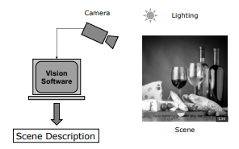
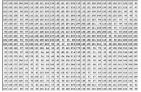
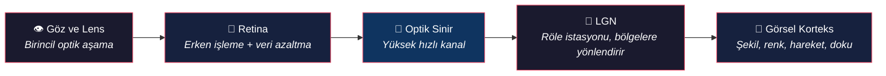
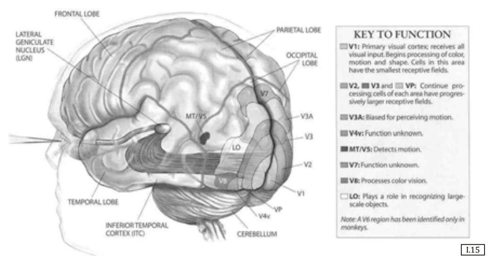
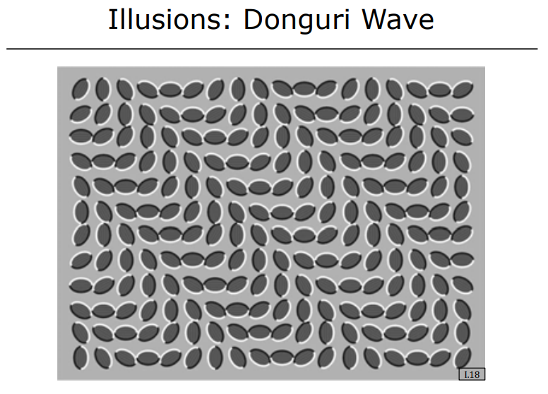
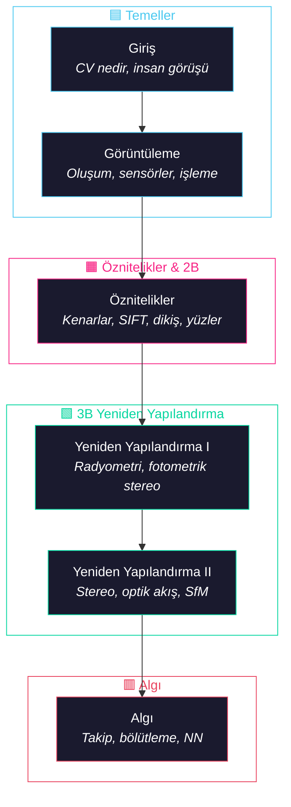

# Bilgisayarlı Görmeye Giriş

<!-- toc -->

## 1. Bilgisayarlı Görü Nedir?

Bilgisayarlı görü (computer vision), yalnızca yapay zekanın bir alt kümesi değil; çok disiplinli, köklü bir mühendislik ve bilim girişimidir. Fiziksel dünya ile sembolik anlama arasında köprü kurar; optik, sinyal işleme, elektrik mühendisliği ve bilgisayar biliminden beslenir.

    

<i>Görü hattı: ışık kaynağı → sahne → kamera → Vision Software, sahne açıklamasını üretir</i>

Temel zorluk, ham sayısal dizileri—piksel verisini—anlamlı bir 3B ortam tanımına dönüştürmektir.

    

        
        
<i>Ham görsel girdi: duş alan iki çocuk</i>

    

    

        
        
<i>Aynı sahnenin sayısal piksel matrisi temsili</i>

    

Bu alanda, misyonun tanımı çoğu zaman yöntemi belirler. Aşağıda bilgisayarlı görü araştırmasının üç temel felsefi dayanağının bir karşılaştırması yer almaktadır:

| Perspektif | Savunucu | Temel Felsefe |
|-------------|-----------|----------------|
| Görü olarak Taklit | David Marr | Biyolojik sistemlerin karmaşıklığını kopyalamak için insan görsel süreçlerini otomatikleştirmeyi amaçlar |
| Görü olarak Bilgi İşleme | Berthold Horn | Görüntü oluşumunu "tersine çevirme" işi olarak tanımlar — 2B projeksiyondan 3B gerçekliğe matematiksel olarak geri yürümek |
| Görü olarak İşlevsel Araç | Takeo Kanade | Görünün "eğlenceli" ama daha da önemlisi "kullanışlı" olduğunu vurgular; saf araştırma ile pratik uygulama arasında köprü kurar |

### 1.1 "İlk Prensipler" Felsefesi

Çağdaş derin öğrenme güçlü araçlar sunarken, **İlk Prensipler** yaklaşımı—matematiksel ve fiziksel temellere odaklanmak—genelleştirilebilir ve açıklanabilir yapay zeka için bir ön koşuldur. "Kara kutu" modellere güvenmek, gerçek yenilik için gereken yapısal anlayışı atlar.

> **Neden İlk Prensipler?** Fiziksel olaylar çoğu zaman zarif matematikle tanımlanabilir; bu da devasa veri kümelerini ve kapsamlı eğitim döngülerini gereksiz kılar.

Bu temelleri dört nedenle önceliyoruz:

1. **Kesinlik ve Özlülük** — Fiziksel olaylar genellikle zarif matematikle tanımlanabilir, büyük veri kümelerini gereksiz kılar.
2. **Hata Ayıklama ve Teşhis** — Bir görü sistemi başarısız olduğunda, ilk prensipler hatanın nedenini teşhis etmek için tek titiz çerçeveyi sağlar.
3. **Sentetik Veri Üretimi** — Gerçek dünya verisi toplamak pratik olmadığında veya tehlikeli olduğunda, matematiksel modeller yüksek kaliteli eğitim verisi üretmemizi sağlar.
4. **Bilimsel Merak** — Görsel olayların ardındaki "neden"i anlama içgüdüsü, yalnızca veri odaklı yöntemlerin gözden kaçırabileceği atılımlara yol açar.

---

## 2. İnsan Görme Sistemi: Biyoloji, Yanılma ve Belirsizlik

İnsan gözünü incelemek, yapay görü tasarlamak için gerekli bir başlangıç noktasıdır. Makineler ve insanlar çoğu zaman farklı hedeflere sahip olsa da—niteliksel navigasyon niceliksel ölçüme karşı—göz, verimli bilgi azaltımı için bir yol haritası sağlar.

### 2.1 Biyolojik Olarak Işının Takip Ettiği Patika

İnsan görsel sistemi, hızlı analiz için tasarlanmış karmaşık bir hiyerarşidir:

    

<i>Biyolojik görme yolağı: retina → LGN → görsel korteks (V1, V2, MT/V5, V8)</i>

### 2.2 Niteliksel ve Niceliksel Görü

Mühendisler olarak şunu kabul etmeliyiz ki **insan görüşü niteliksel bir sistemdir**; oysa fabrika otomasyonu, tıbbi görüntüleme ve robotik niceliksel hassasiyet gerektirir. Bir insan bir yüzü anında tanıyabilir ancak bir bileşenin uzunluğunu milimetre hassasiyetiyle ölçemez. Aşırı güvenilirlik gerektiren görevler için insan biyolojisini taklit etmek çoğu zaman "yanlış" hedeftir; makineler biyolojik sistemlerin eksik olduğu ölçülebilir doğruluğu sağlamalıdır.

### 2.3 Görsel Yanılsamalar (İllüzyonlar)

İnsan görüşü göründüğünden daha yanılabilirdir; belirsizliği çözmek için genellikle içsel varsayımlara güvenir.

 

**Örnek — Dongary Dalgası İllüzyonu:** Aşağıdaki statik yaprak deseni, gözün istemsiz mikro-sakadları nedeniyle titreşiyor veya hareket ediyormuş gibi görünür.

    
    
<i>Hareket algısı yaratan statik yaprak deseni — Dongary Dalgası illüzyonu</i>

| İllüzyon | Gösterdiği |
|----------|------------|
| **Fraser'in Spirali** | İç içe dairelerin beyin tarafından spiral olarak yorumlanması |
| **Adelson'un Satranç Gölgesi** | Beynin aydınlatmayı telafi etmesi — iki özdeş gri kare farklı görünür |
| **Dongary Dalgası** | İstemsiz göz hareketleri nedeniyle statik bir görüntüden hareket algılanması |
| **Ames Odası** | Perspektif ve göreceli boyut, insanların büyüyüp küçülüyormuş gibi göründüğü bir illüzyon yaratır |
| **Necker Küpü / Yüzler vs. Vazo** | Tek bir 2B görüntü birden fazla 3B veya sembolik yoruma izin verir |
| **Krater İllüzyonu** | "Yukarıdan aydınlatma" varsayımı — bir tümseği ters çevirmek onu krater gibi gösterir |
| **Kanizsa Üçgeni** | Beyin, pikselleri işlemekten (görmek) öte, veriyi "doldurur" (düşünür) — fiziksel olarak var olmayan bir üçgen algılar |

> **Önemli Çıkarım:** İnsanlar görsel deneyimleri aracılığıyla *düşünürken*, makineler önce radyometri ve geometrinin titiz merceğinden *hesaplamayı* öğrenmelidir.

---

## 3. Kapsanan Konular: Yol Haritası

Bu specializasyon, piksellerden algıya kadar tüm hattı kapsar ve altı modüle ayrılmıştır:

### Modül Detayları

| # | Modül | Odak |
|---|-------|------|
| 1 | **Görüntüleme** | Görüntü oluşumu, sensörler, ikili görüntüler, görüntü işleme (konvolüsyon, Fourier) |
| 2 | **Öznitelikler** | Kenar/sınır tespiti, SIFT, görüntü dikişi, yüz tespiti |
| 3 | **Yeniden Yapılandırma I** | Radyometri, fotometrik stereo, gölgelemeden şekil, odak dışından derinlik |
| 4 | **Yeniden Yapılandırma II** | Kamera kalibrasyonu, stereo, optik akış, hareketten yapı |
| 5 | **Algı** | Nesne takibi, bölütleme, görünüm eşleme, sinir ağları |

---

## 4. Küresel Uygulamalar: Modern Dünyada Bilgisayarlı Görü

Görü, bir laboratuvar merakından, çeşitli sektörlerde gelişen küresel bir endüstriye dönüşmüştür.

 

| Alan | Uygulamalar |
|------|-------------|
| **Endüstriyel / Verimlilik** | Fabrika otomasyonu, yüksek hızlı görsel denetim, plaka ve posta tarama için OCR |
| **Güvenlik / Kimlik** | DNA kadar benzersiz iris desenleriyle biyometri, güçlü yüz tanıma |
| **Tüketici Teknolojisi** | Optik fareler (mini görü sistemleri), oyun (Kinect/PlayStation), AR (Snapchat 3B filtreler) |
| **Akıllı Pazarlama** | Müşteri demografisini (yaş/cinsiyet) algılayıp hedefli ürün gösteren Shinagawa İstasyonu'ndaki otomatlar |
| **Görsel Arama** | Mobil cihazlarla anıtların ve nesnelerin anında tanımlanması |
| **İleri Mobilite** | Sensör füzyonu kullanan sürücüsüz arabalar, Mars Keşif Aracı'nın yabancı ortamlarda arazi haritalaması |
| **Yaratıcı / Tıbbi** | Sinema için hareket yakalama, X-ray, MR ve ultrason ile tıbbi teşhis |

---
