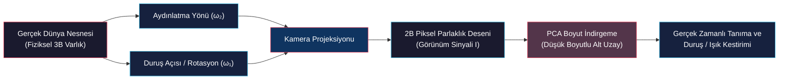

# Görünüm Tabanlı Temsil ve Temel Bileşenler Analizi (Appearance Representation & PCA)

<!-- toc -->

Bu ders notu; bilgisayarlı görünün geometrik modelleme paradigmasından sinyal tabanlı modellemeye geçişini, yüksek boyutlu piksel uzayında görsel görünüm temsillerini, veri toplama ve parlaklık normalizasyon adımlarını ve bu uzayı sıkıştırmanın matematiksel kalbi olan **Temel Bileşenler Analizi (Principal Component Analysis - PCA)** teorisini tüm doğrusal cebirsel temelleri ve Lagrange çarpanı optimizasyonu ile Columbia Üniversitesi CAVE laboratuvarı (Prof. Shree K. Nayar) müfredatı doğrultusunda ele almaktadır.

---

## 1. Giriş ve Genel Bakış (Overview)

Bilgisayarlı görüde nesne tanıma (object recognition) ve duruş açısı kestirimi (pose estimation) problemlerinin çözümünde geleneksel yaklaşımlar, nesnelerin üç boyutlu (3B) açık geometrik modellerini çıkarmayı ve bu modelleri 3B sensör verileriyle eşleştirmeyi hedeflemiştir. Ancak 3B şekil çıkarmanın ve işlemenin getirdiği donanımsal ve algoritmik darboğazlar, araştırmacıları doğrudan 2B görüntülerdeki görsel parlaklık sinyallerini kullanmaya yöneltmiştir.

**Görünüm Eşleştirme (Appearance Matching)**; nesneleri karmaşık ve explicit 3B geometrileriyle modellemek yerine, farklı bakış açıları (pose) ve ışık koşulları (illumination) altında çekilmiş 2B projeksiyon görüntülerinin oluşturduğu bütünsel görsel örüntüyü doğrudan temsil eden ve tanıyan güçlü bir bilgisayarlı görü paradigmasıdır.

Bu yaklaşımın temel amacı, yüksek boyutlu piksel uzayındaki (örneğin $200 \times 200 = 40.000$ boyutlu uzay) devasa görsel veriyi, nesneye özgü ayırt edici bilgi kayıplarını minimumda tutarak çok daha küçük boyutlu matematiksel alt uzaylara (subspace) sıkıştırmaktır.

<figure style="display:flex; justify-content: center; margin: 20px 0;">
  

    
    <figcaption style="margin-top: 0.5em; text-align: center; font-size: 13px; color: #888;"><em>Şekil 1: Görünüm Tabanlı Tanıma Problemi: Bilinmeyen bir giriş görüntüsü (Input Image) ve veritabanında farklı nesnelere ait çoklu açı/ışık şablonları (Object Image Sets).</em></figcaption>
  

</figure>

---

## 2. Şekil ve Görünüm Temsillerinin Karşılaştırılması (Shape vs. Appearance)

### 2.1 3B Şekil Temsilleri (Explicit 3D Geometry)

Bilgisayar grafikleri, katı modelleme, imalat ve fabrika otomasyonunda nesneleri geometrik olarak temsil etmek için açık (**explicit**) 3B matematiksel modeller kullanılır:

1. **Voxel Temsili (Voxel Representation):** İki boyutlu pikselin (picture element) üç boyutlu hacimsel hücre genellemesidir (**volume element**). 3B uzay ızgaralara bölünür ve hangi hücrelerin dolu, hangilerinin boş olduğu binary veya yoğunluk matrisiyle saklanır.
2. **Yüzey Primitifleri (Surface Primitives):** Nesnelerin sınırlarını düzlemsel poligonlar (mesh), küreler veya düşük dereceli parametrik yüzeyler yardımıyla tanımlar.
3. **Süperkuadrikler (Superquadrics):** Keskin köşelerden pürüzsüz yuvarlak hatlara kadar geniş bir şekil yelpazesini tek bir kompakt analitik formülle ifade edebilen egzotik geometrik gövdelerdir:

$$|x|^r + |y|^s + |z|^t = 1$$

Burada $r, s, t$ parametreleri gerçel sayılardır. Bu üslerin değiştirilmesiyle küplerden elipsoitlere, silindirlerden konik yapılara kadar pek çok 3B form tek bir eşitlikten türetilebilir.

<figure style="display:flex; justify-content: center; margin: 20px 0;">
  

    
    <figcaption style="margin-top: 0.5em; text-align: center; font-size: 13px; color: #888;"><em>Şekil 2: Explicit 3B Geometrik Modeller: Sol: Voxel temsili (ejderha modeli); Sağ: Analitik süperkuadrik ailesi ($|x|^r + |y|^s + |z|^t = 1$).</em></figcaption>
  

</figure>

4. **Yapıcı Katı Geometrisi (Constructive Solid Geometry - CSG):** Küre, blok, silindir ve koni gibi temel geometrik ilkel şekillerin (**primitives**); birleşim (**Union**), fark (**Difference**) ve kesişim (**Intersection**) gibi Boole küme operasyonlarıyla birleştirilerek karmaşık endüstriyel parçaların üretilmesini sağlar. CAD/CAM tasarım sistemlerinin omurgasını oluşturur.

<figure style="display:flex; justify-content: center; margin: 20px 0;">
  

    
    <figcaption style="margin-top: 0.5em; text-align: center; font-size: 13px; color: #888;"><em>Şekil 3: Constructive Solid Geometry (CSG) Operasyonları: Bir küp ve küre arasındaki Birleşim (Union), Fark (Difference) ve Kesişim (Intersection) işlemleri.</em></figcaption>
  

</figure>

### 2.2 3B Şekil Modellemenin Bilgisayarlı Görüdeki Zorlukları

Tasarım ve grafik üretiminde başarılı olan bu geometrik modeller, bilgisayarlı görüyle nesne algılama aşamasında ciddi engellerle karşılaşır:

* **Explicit Model Üretim Zorluğu:** Veritabanındaki her bir nesne için ya titiz CAD modelleri elle tasarlanmalı ya da yapılandırılmış ışık/lazer tarayıcılar ile 3B koordinatlar taranmalıdır.
* **Online Derinlik Sensörü Bağımlılığı:** Çalışma anında nesneyi tanımak için sahnenin de derinlik sensörleriyle (RGB-D, LiDAR, stereo kameralar) taranarak gürültülü 3B nokta bulutlarının çıkarılması gerekir.
* **Hizalama ve Eşleştirme Maliyeti:** Nokta bulutları veya poligon yüzeyler arasında uzaysal çakıştırma (ICP - Iterative Closest Point vb.) hesaplama açısından son derece maliyetlidir ve yerel minimumlara kolayca takılır.

### 2.3 Görünüm Tabanlı Yaklaşım (Appearance-Based Approach)

Görünüm tabanlı yaklaşım, 3B geometriyi explicit olarak modellemek yerine nesnenin doğrudan kameraya ürettiği görsel sinyali (2B parlaklık haritası) baz alır. Bir nesnenin kamerada oluşturduğu görüntü, iki temel parametre grubunun ortak fonksiyonudur:

$$\text{Görsel Görünüm} = \mathcal{F}(\text{İçsel Parametreler}, \text{Dışsal Parametreler})$$

1. **İçsel Parametreler (Intrinsic Parameters):** Nesnenin kendi fiziksel doğasına ait, gözlemciden bağımsız ve zamanla değişmeyen özellikleridir. 3B yüzey geometrisini ve yüzey yansıtma özelliklerini (**BRDF - Bidirectional Reflectance Distribution Function**) kapsar. Rijit cisimler için sabittir.
2. **Dışsal Parametreler (Extrinsic Parameters):** Kameranın, ortamın ve aydınlatmanın durumuna göre anlık değişen, gözlemciye bağlı parametrelerdir. Nesnenin kameraya göre uzaysal duruş açısını (**Pose $\boldsymbol{\omega}_1$**) ve aydınlatma yönünü/şiddetini (**Illumination $\boldsymbol{\omega}_2$**) temsil eder.

> **Temel Fikir:** Nesnenin 3B geometrisini ve BRDF denklemlerini explicit olarak hiç çözmeden; dışsal parametrelerin ($\boldsymbol{\omega} = [\omega_1, \omega_2]^T$) oluşturduğu tüm olası 2B görüntü varyasyonlarını kompakt bir matematiksel alt uzayda öğrenmek!

---

## 3. Görünüm Öğrenme ve Ön İşleme (Learning Appearance)

Makinelere nesne görünümünü öğretme felsefesi, insan görsel sisteminin doğal öğrenme sürecine dayanır. İnsanlar yeni bir nesneyle karşılaştıklarında, onu ellerinde evirip çevirerek farklı açılardan ve ışık yönlerinden inceler ve zihinlerinde nesneye ait kompakt bir görünüm şablonu oluştururlar.

<figure style="display:flex; justify-content: center; margin: 20px 0;">
  

    
    <figcaption style="margin-top: 0.5em; text-align: center; font-size: 13px; color: #888;"><em>Şekil 4: İnsan Algısının Taklidi: Nesnenin elde farklı yönelimlerde ve açılarda döndürülerek incelenmesi.</em></figcaption>
  

</figure>

### 3.1 Nesne Görüntü Kümesinin (Object Image Set) Toplanması

Bu süreci sistematik ve otomatik hale getirmek için kontrollü bir laboratuvar düzeneği kurulur:

* **Döner Tabla (Turntable - Duruş Parametresi $\omega_1$):** Nesne, stabil bir duruşunda tablanın üzerine konur. Tabla $360^\circ$ döndürülerek nesnenin duruş açısı $\omega_1$ düzenli adımlarla (örneğin her $5^\circ$'de bir) taranır.
* **Robotik Işık Kolu (Aydınlatma Parametresi $\omega_2$):** Robotik bir kolun ucuna takılı ışık kaynağı nesne etrafında bir yarıküre üzerinde gezdirilerek aydınlatma yönü $\omega_2$ sistematik olarak değiştirilir.
* **Sabit Kamera:** Her $(\omega_1, \omega_2)$ konfigürasyonunda yüksek çözünürlüklü bir görüntü kaydedilerek yüzlerce kareden oluşan **Nesne Görüntü Kümesi (Object Image Set)** inşa edilir.

<figure style="display:flex; justify-content: center; margin: 20px 0;">
  

    
    <figcaption style="margin-top: 0.5em; text-align: center; font-size: 13px; color: #888;"><em>Şekil 5: Görünüm Veri Toplama Düzeneği: Döner tabla (Pose $\omega_1$), robot kola bağlı ışık kaynağı (Lighting $\omega_2$) ve sabit kamera.</em></figcaption>
  

</figure>

### 3.2 Görüntü Ön İşleme Hattı (Preprocessing Pipeline)

Farklı koşullarda çekilen tüm görüntülerin pikselsel olarak doğrudan karşılaştırılabilir (**comparable**) olması için üç kritik ön işleme adımı uygulanır:

1. **Segmentasyon (Arka Plan Temizliği):** Nesneler homojen siyah bir arka plan önünde çekilir ve arka plan maskelenerek tamamen sıfıra eşitlenir. Böylece arka plan karmaşasının (background clutter) görünüm modelini bozması engellenir.
2. **Kanonik Boyutlandırma (Resizing):** Segment edilen nesnenin sınır kutusu (bounding box) saptanır ve nesne en boy oranı korunarak standart bir kanonik boyuta (örneğin $128 \times 128$ veya $200 \times 200$ piksel) ölçeklenir.
3. **Vektörel Parlaklık Normalizasyonu (Vectorial Brightness Normalization):** Işık şiddeti dalgalanmaları, lamba voltajı ve kamera pozlama (exposure) değişimlerinin yapay tanıma hataları üretmesini engellemek için görüntü matrisi $I$ tek bir vektöre açıldıktan sonra kendi $L_2$ normuna bölünür:

$$\hat{\mathbf{I}} = \frac{I}{\|I\|} = \frac{I}{\sqrt{\sum_{x,y} I(x,y)^2}}$$

Bu normalizasyon sayesinde tüm görüntü vektörleri yüksek boyutlu uzayda bir **Birim Küre (Unit Sphere)** üzerine izdüşürülür ve saf enerji büyüklüğünden bağımsız hale gelir.

---

## 4. Temel Bileşenler Analizi (Principal Component Analysis - PCA)

### 4.1 Yüksek Boyutlu Piksel Uzayı (High-Dimensional Pixel Space)

Ön işlemeden geçmiş her bir kanonik görüntü $P \times Q = N$ adet piksel içerir. Bu 2B matrisi, sütunlarını (veya satırlarını) ardışık olarak uca ekleyerek (raster scanning) $N \times 1$ boyutunda bir **Özellik Vektörüne ($\mathbf{f}'$)** dönüştürürüz.

<figure style="display:flex; justify-content: center; margin: 20px 0;">
  

    
    <figcaption style="margin-top: 0.5em; text-align: center; font-size: 13px; color: #888;"><em>Şekil 6: Görüntü Vektörizasyonu: $P \times Q = N$ boyutlu 2B görüntünün $N \times 1$ boyutlu tekil bir $\mathbf{f}'$ özellik vektörüne dönüştürülmesi.</em></figcaption>
  

</figure>

Bu dönüşüm sonucunda her bir görüntü, $N$-boyutlu bir Öklid uzayında tek bir nokta olarak konumlanır:

* Uzaydaki her bir eksen, görüntünün belirli bir piksel konumundaki gri seviye parlaklık değerine karşılık gelir.
* Uzayın standart baz vektörleri $\{\mathbf{i}_1, \mathbf{i}_2, \dots, \mathbf{i}_N\}$, ilgili piksel indisinde 1, diğer tüm konumlarda 0 olan ortonormal bir temeldir:

$$\mathbf{i}_1 = \begin{bmatrix} 1 \\ 0 \\ \vdots \\ 0 \end{bmatrix}, \quad \mathbf{i}_2 = \begin{bmatrix} 0 \\ 1 \\ \vdots \\ 0 \end{bmatrix}, \quad \dots, \quad \mathbf{i}_N = \begin{bmatrix} 0 \\ 0 \\ \vdots \\ 1 \end{bmatrix}$$

<figure style="display:flex; justify-content: center; margin: 20px 0;">
  

    
    <figcaption style="margin-top: 0.5em; text-align: center; font-size: 13px; color: #888;"><em>Şekil 7: $N$-Boyutlu Piksel Uzayı: Standart ortonormal baz $\{\mathbf{i}_1, \dots, \mathbf{i}_N\}$ ve uzayda tek bir nokta olarak temsil edilen $\mathbf{f}'$ imaj vektörü.</em></figcaption>
  

</figure>

### 4.2 Görüntü Uzayında SSD ile $N$-Boyutlu Öklid Mesafesi Eşdeğerliği

İki görüntü ($I_1$ ve $I_2$) arasındaki görsel benzerliği ölçmek için klasik olarak Kare Farklar Toplamı (**Sum of Squared Differences - SSD**) kullanılır. Bu metrik, $N$-boyutlu uzayda vektörler arasındaki $L_2$ Öklid mesafesinin karesine tam olarak eşittir:

$$\text{SSD} = \sum_{p=1}^P \sum_{q=1}^Q \left( I_1[p,q] - I_2[p,q] \right)^2 \equiv d^2 = \|\mathbf{f}'_1 - \mathbf{f}'_2\|^2$$

<figure style="display:flex; justify-content: center; margin: 20px 0;">
  

    
    <figcaption style="margin-top: 0.5em; text-align: center; font-size: 13px; color: #888;"><em>Şekil 8: İki görüntü arasındaki piksel tabanlı SSD korelasyonunun, $N$-boyutlu uzaydaki Öklid mesafesi karesine ($d^2 = \|\mathbf{f}'_1 - \mathbf{f}'_2\|^2$) denkliği.</em></figcaption>
  

</figure>

### 4.3 Boyutluluk Laneti ve Görsel Fazlalık (Redundancy)

Tipik bir $200 \times 200$ piksellik görüntü dahi $N = 40.000$ boyutlu akıl almaz büyüklükte bir uzay yaratır. Binlerce nesne ve her nesne için yüzlerce açı düşünüldüğünde, doğrudan $40.000$ boyutta şablon karşılaştırması (template matching) yapmak hem bellek hem de işlem süresi açısından imkansızdır.

<figure style="display:flex; justify-content: center; margin: 20px 0;">
  

    
    <figcaption style="margin-top: 0.5em; text-align: center; font-size: 13px; color: #888;"><em>Şekil 9: Yüksek Boyutlu Şablon Eşleme Zorluğu: Giriş görüntüsünün veritabanındaki her bir discrete şablonla tek tek $N$-boyutta karşılaştırılması sürdürülemez bir maliyet getirir.</em></figcaption>
  

</figure>

Ancak döner tablada sıralı olarak kaydedilen görüntüler incelendiğinde çok önemli bir fiziksel gerçek ortaya çıkar: **Komşu açılardaki görüntüler birbirine muazzam derecede benzerdir ve aralarında devasa bir korelasyon (görsel fazlalık / redundancy) vardır.**

<figure style="display:flex; justify-content: center; margin: 20px 0;">
  

    
    <figcaption style="margin-top: 0.5em; text-align: center; font-size: 13px; color: #888;"><em>Şekil 10: Görsel Korelasyon ve Fazlalık: Duruş açısı değiştikçe nesne piksellerinin ani sıçramalar yapmaması, veri noktalarının uzayda düşük boyutlu bir yapıda toplandığını gösterir.</em></figcaption>
  

</figure>

Bu yüksek korelasyon; $40.000$ boyutlu uzaydaki veri noktalarının rastgele saçılmadığını, uzayın çok küçük boyutlu ($K \ll N$, örneğin $K = 8 \sim 20$) doğrusal bir alt uzayına (**Linear Subspace / Eigenspace**) hapsolduğunu kanıtlar.

<figure style="display:flex; justify-content: center; margin: 20px 0;">
  

    
    <figcaption style="margin-top: 0.5em; text-align: center; font-size: 13px; color: #888;"><em>Şekil 11: $N$-Boyutlu uzayda $M$ adet görüntü noktasının kümelenmesi ve bu veriyi temsil eden $K$-boyutlu $\{\mathbf{e}_1, \dots, \mathbf{e}_K\}$ ortonormal alt uzayı ($K \ll N$).</em></figcaption>
  

</figure>

### 4.4 Ortalama Çıkarımı (Mean Subtraction) ve Merkezleme

PCA uygulamadan önceki ilk matematiksel adım, veritabanındaki $M$ adet görüntünün aritmetik ortalamasını alarak **Ortalama İmaj Vektörünü ($\mathbf{c}$)** hesaplamaktır:

$$\mathbf{c} = \frac{1}{M} \sum_{m=1}^M \mathbf{f}'_m$$

Ardından, her bir görüntüden bu ortalama imaj çıkarılarak verinin ağırlık merkezi (centroid) koordinat sisteminin orijinine $(0,0,\dots,0)$ ötelenir:

$$\mathbf{f}_m = \mathbf{f}'_m - \mathbf{c}$$

Bu merkezleme işlemi sayesinde tüm varyasyon ve istatistiksel saçılım orijin etrafında sıfır ortalamalı ($E[\mathbf{f}] = \mathbf{0}$) olarak incelenir.

---

## 5. Temel Bileşenlerin Matematiksel Türetilişi (Finding Principal Components)

İlk temel bileşen olan $\mathbf{e}_1$ birim yönelim vektörü; merkezlenmiş veri noktalarımızın **maksimum varyans (en yüksek bilgi içeriği)** gösterdiği doğrultudur. Bu doğrultu, tüm veri noktalarına doğrusal en küçük kareler (least squares) anlamında en iyi uyan (best-fit) doğrunun yönüdür.

<figure style="display:flex; justify-content: center; margin: 20px 0;">
  

    
    <figcaption style="margin-top: 0.5em; text-align: center; font-size: 13px; color: #888;"><em>Şekil 12: Birinci Temel Bileşen $\mathbf{e}_1$: Maksimum varyans doğrultusu ve $\mathbf{f}$ imajının bu eksene tek bir skaler izdüşümü ($p = \mathbf{e}_1 \cdot \mathbf{f}$).</em></figcaption>
  

</figure>

### 5.1 Adım Adım Doğrusal Cebir ve Lagrange İspatı

#### Adım 1: İzdüşüm Skalerinin Tanımlanması
Herhangi bir merkezlenmiş $\mathbf{f}$ imaj vektörünün, aradığımız birim $\mathbf{e}$ yön vektörü üzerindeki izdüşüm büyüklüğü (koordinatı) bu iki vektörün iç çarpımıdır:

$$p = \mathbf{e} \cdot \mathbf{f} = \mathbf{e}^T \mathbf{f}$$

#### Adım 2: İzdüşümün Beklenen Değeri (Ortalaması)
Verimiz sıfır ortalamalı ($E[\mathbf{f}] = \mathbf{0}$) olduğundan, skaler izdüşümlerin ortalaması da sıfırdır:

$$E[p] = E[\mathbf{e}^T \mathbf{f}] = \mathbf{e}^T E[\mathbf{f}] = \mathbf{e}^T \mathbf{0} = 0$$

#### Adım 3: İzdüşümlerin Varyansının Formüle Edilmesi
Varyansın istatistiksel tanımından hareketle:

$$\text{Var}(p) = E\left[ (p - E[p])^2 \right] = E\left[ p^2 \right] = E\left[ (\mathbf{e}^T \mathbf{f})^2 \right]$$

İç çarpım skaler bir sayı olduğundan karesi matris çarpımı cinsinden $(\mathbf{e}^T \mathbf{f})(\mathbf{e}^T \mathbf{f})^T$ olarak yazılabilir:

$$(\mathbf{e}^T \mathbf{f})^2 = (\mathbf{e}^T \mathbf{f})(\mathbf{e}^T \mathbf{f})^T = (\mathbf{e}^T \mathbf{f})(\mathbf{f}^T \mathbf{e}) = \mathbf{e}^T (\mathbf{f} \mathbf{f}^T) \mathbf{e}$$

Yön vektörü $\mathbf{e}$ sabit bir arama parametresi olduğundan beklenen değer (expectation) operatörünün dışına alınır:

$$\text{Var}(p) = E\left[ \mathbf{e}^T (\mathbf{f} \mathbf{f}^T) \mathbf{e} \right] = \mathbf{e}^T E\left[ \mathbf{f} \mathbf{f}^T \right] \mathbf{e}$$

Buradaki $E[\mathbf{f} \mathbf{f}^T]$ matrisi, verinin pikselleri arasındaki ilişkileri ve korelasyonları saklayan $N \times N$ boyutundaki **Kovaryans Matrisidir ($R$)**:

$$R = E[\mathbf{f} \mathbf{f}^T] = \frac{1}{M} \sum_{m=1}^M \mathbf{f}_m \mathbf{f}_m^T$$

Böylece maksimize etmek istediğimiz izdüşüm varyansı kuadratik bir forma dönüşür:

$$\text{Var}(p) = \mathbf{e}^T R \mathbf{e}$$

#### Adım 4: Birim Vektör Kısıtı ve Lagrange Çarpanı
$\mathbf{e}$ vektörünün boyunun sonsuza giderek varyansı yapay biçimde büyütmesini engellemek için, onun bir birim yön vektörü olması kısıtı getirilmelidir:

$$\|\mathbf{e}\|^2 = 1 \implies \mathbf{e}^T \mathbf{e} = 1 \implies \mathbf{e}^T \mathbf{e} - 1 = 0$$

Bu kısıt altında $\mathbf{e}^T R \mathbf{e}$ varyansını maksimize etmek için bir $\lambda$ Lagrange çarpanı ekleyerek $\mathcal{L}(\mathbf{e}, \lambda)$ Lagrange fonksiyonunu oluştururuz:

$$\mathcal{L}(\mathbf{e}, \lambda) = \mathbf{e}^T R \mathbf{e} - \lambda (\mathbf{e}^T \mathbf{e} - 1)$$

#### Adım 5: Kısmi Türev ve Özdeğer Eşitliği
Lagrange fonksiyonunun $\mathbf{e}$ vektörüne göre gradyanını alıp sıfıra eşitleriz:

$$\frac{\partial \mathcal{L}}{\partial \mathbf{e}} = 2 R \mathbf{e} - 2 \lambda \mathbf{e} = \mathbf{0}$$

Eşitliği $2$'ye bölüp düzenlediğimizde karşımıza doğrusal cebirin temel taşlarından biri olan **Özdeğer/Özvektör (Eigenvalue/Eigenvector) Problemi** çıkar:

$$R \mathbf{e} = \lambda \mathbf{e}$$

#### Adım 6: Varyans ve Özdeğer İlişkisi
Elde ettiğimiz $R \mathbf{e} = \lambda \mathbf{e}$ eşitliğini varyans denklemimizde yerine yazalım:

$$\text{Var}(p) = \mathbf{e}^T (R \mathbf{e}) = \mathbf{e}^T (\lambda \mathbf{e}) = \lambda (\mathbf{e}^T \mathbf{e})$$

$\mathbf{e}^T \mathbf{e} = 1$ birim kısıtı sebebiyle:

$$\text{Var}(p) = \lambda$$

> **Nihai Teorem:** İzdüşüm doğrultusu boyunca elde edilen veri varyansı, doğrudan o doğrultuya ait $\lambda$ özdeğerine eşittir! Dolayısıyla varyansı maksimize etmek; $R$ kovaryans matrisinin **en büyük özdeğerini ($\lambda_1$)** ve bu değere karşılık gelen **birinci özvektörünü ($\mathbf{e}_1$)** seçmektir.

---

### 5.2 Çok Boyutlu Eigenspace İnşası ve İzdüşüm

İkinci temel bileşen $\mathbf{e}_2$; birinci bileşene dik ($\mathbf{e}_1 \perp \mathbf{e}_2$) olmak koşuluyla kalan varyansı maksimize eden ikinci en büyük özdeğerin ($\lambda_2$) özvektörüdür.

<figure style="display:flex; justify-content: center; margin: 20px 0;">
  

    
    <figcaption style="margin-top: 0.5em; text-align: center; font-size: 13px; color: #888;"><em>Şekil 13: İkinci Temel Bileşen $\mathbf{e}_2$: $\mathbf{e}_1$'e dik doğrultuda maksimum varyans ve görüntünün 2B koordinat vektörü $\mathbf{p} = [p_1, p_2]^T$.</em></figcaption>
  

</figure>

Bu süreç sıralı olarak tekrarlanarak azalan özdeğer sırasıyla ($\lambda_1 \ge \lambda_2 \ge \dots \ge \lambda_K$) $K$ adet ortonormal özvektörden oluşan yeni bir **Öz-uzay Matrisi ($E$)** tanımlanır:

$$E = \begin{bmatrix} \mathbf{e}_1 & \mathbf{e}_2 & \dots & \mathbf{e}_K \end{bmatrix}_{N \times K}$$

<figure style="display:flex; justify-content: center; margin: 20px 0;">
  

    
    <figcaption style="margin-top: 0.5em; text-align: center; font-size: 13px; color: #888;"><em>Şekil 14: $K$-Boyutlu Temel Bileşen Temsili: $N$-boyutlu devasa bir $\mathbf{f}$ imaj vektörünün $K \times 1$ boyutlu kompakt bir $\mathbf{p}$ koordinat vektörüne izdüşürülmesi.</em></figcaption>
  

</figure>

### 5.3 İleri ve Geri Projeksiyon (Forward & Back Projection)

1. **İleri Projeksiyon (Forward Projection - Kodlama / Sıkıştırma):** $N \times 1$ boyutundaki herhangi bir merkezlenmiş $\mathbf{f}$ görüntüsü, öz-uzay matrisinin transpozuyla çarpılarak yalnızca $K \times 1$ boyutunda bir koordinat vektörüne ($\mathbf{p}$) indirgenir:

$$\mathbf{p} = \begin{bmatrix} p_1 \\ p_2 \\ \vdots \\ p_K \end{bmatrix} = \begin{bmatrix} \mathbf{e}_1 & \mathbf{e}_2 & \dots & \mathbf{e}_K \end{bmatrix}^T \mathbf{f} = E^T \mathbf{f}$$

2. **Geri Projeksiyon (Back Projection - Görüntü Rekonstrüksiyonu):** Sıkıştırılmış $K$ boyutlu $\mathbf{p}$ koordinat vektöründen orijinal $N$ boyutlu görüntüye geri dönülmek istendiğinde, özvektörlerin lineer kombinasyonu alınır:

$$\mathbf{f} \approx \sum_{k=1}^K p_k \mathbf{e}_k = E \mathbf{p}$$

Orijinal merkezlenmemiş görüntüye dönmek için ortalama imaj tekrar eklenir:

$$\mathbf{f}' \approx \mathbf{c} + \sum_{k=1}^K p_k \mathbf{e}_k$$

<figure style="display:flex; justify-content: center; margin: 20px 0;">
  

    
    <figcaption style="margin-top: 0.5em; text-align: center; font-size: 13px; color: #888;"><em>Şekil 15: İleri (Forward) ve Geri (Back) Projeksiyon: Lineer alt uzayda kodlama ($\mathbf{p} = E^T \mathbf{f}$) ve geri çatma ($\mathbf{f} \approx \sum_{k=1}^K p_k \mathbf{e}_k$).</em></figcaption>
  

</figure>

---

## 6. Özet ve Sonraki Adım

| Kavram | Matematiksel Formül | Açıklama |
| :--- | :--- | :--- |
| **Piksel Normalizasyonu** | $\hat{\mathbf{I}} = I / \|I\|$ | Parlaklık ve pozlama dalgalanmalarını sıfırlayarak birim küreye izdüşürür. |
| **Ortalama İmaj** | $\mathbf{c} = \frac{1}{M}\sum \mathbf{f}'_m$ | Veri kümesinin $N$-boyutlu uzaydaki ağırlık merkezidir. |
| **Kovaryans Matrisi** | $R = \frac{1}{M}\sum \mathbf{f}_m \mathbf{f}_m^T$ | $N \times N$ boyutunda, pikseller arası kovaryansı saklar. |
| **Özdeğer Problemi** | $R \mathbf{e} = \lambda \mathbf{e}$ | Maksimum varyans doğrultularını (özvektörler) ve varyans miktarını ($\lambda$) verir. |
| **İleri Projeksiyon** | $\mathbf{p} = E^T \mathbf{f}$ | $N$-boyutlu devasa piksel vektörünü $K$-boyutlu kompakt koordinata sıkıştırır. |
| **Geri Projeksiyon** | $\mathbf{f} \approx E \mathbf{p}$ | Düşük boyutlu koordinatlardan orijinal görüntüyü minimum bilgi kaybıyla yeniden üretir. |

> **Gelecek Konu:** $40.000 \times 40.000$ boyutundaki devasa $R$ matrisinin özdeğerlerini doğrudan hesaplamak pratik olarak imkansızdır. Bir sonraki derste, **Tekil Değer Ayrışımı (SVD)** ile bu hesaplama yükünün nasıl saniyeler seviyesine indirildiğini, öz-uzay üzerinde spline interpolasyonu ile **Parametrik Görünüm Manifoldlarının (Appearance Manifolds)** nasıl inşa edildiğini ve gerçek zamanlı **Görünüm Eşleştirme (Appearance Matching)** algoritmalarını inceleyeceğiz.
