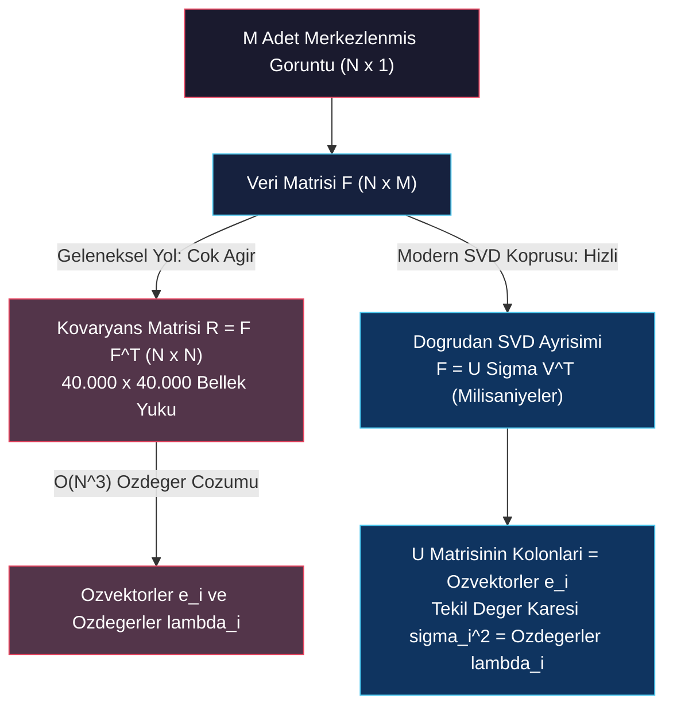
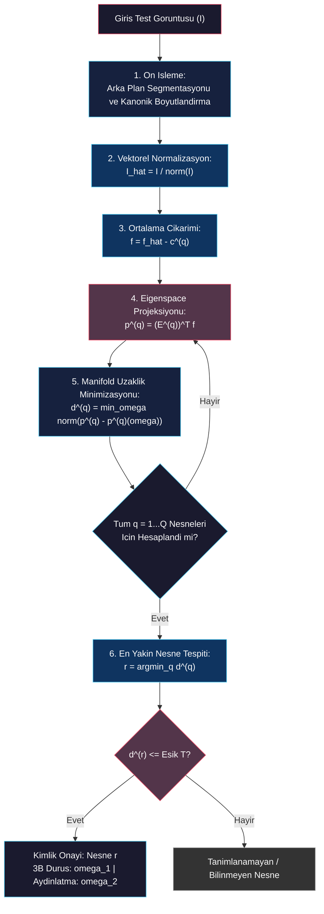

# SVD Optimizasyonu, Parametrik Manifoldlar ve Görünüm Eşleştirme (SVD, Manifolds & Matching)

<!-- toc -->

Bu ders notu; devasa görüntü boyutlarında Temel Bileşenler Analizi (PCA) hesaplamanın pratik sınırlarını ortadan kaldıran **Tekil Değer Ayrışımı (Singular Value Decomposition - SVD)** köprüsünü, öz-uzay (eigenspace) üzerinde sürekli geometrik yüzeylerin (**Görünüm Manifoldları**) örülmesini, gerçek zamanlı **Görünüm Eşleştirme (Appearance Matching)** algoritmalarını ve bu modellerin yüz tanıma (**Eigenfaces**), robotik yönlendirme (**Visual Servoing**) ve endüstriyel kalite kontroldeki uygulamalarını Columbia Üniversitesi CAVE laboratuvarı (Prof. Shree K. Nayar) müfredatı doğrultusunda ele almaktadır.

---

## 1. PCA ve SVD İlişkisinin Doğrusal Cebirsel İspatı

Bir önceki dersimizde, $N$ pikselli görüntüler için $N \times N$ boyutunda bir $R$ kovaryans matrisinin özdeğer problemini ($R \mathbf{e} = \lambda \mathbf{e}$) çözmemiz gerektiğini gördük. Ancak gerçek bilgisayarlı görü uygulamalarında bu doğrudan yaklaşım çok ciddi bir hesaplama ve bellek bariyerine çarpar:

* **Boyutluluk Krizi:** Eğer görüntülerimiz $200 \times 200 = 40.000$ piksel ise, kovaryans matrisi $R$, **$40.000 \times 40.000$ elemanlı (yaklaşık 1.6 milyar kayan noktalı sayı)** devasa bir matristir.
* **Hesaplama Maliyeti:** $40.000 \times 40.000$ boyutundaki bir matrisin RAM'de tutulması $\sim 6.4 \text{ GB}$ bellek gerektirir ve klasik $\mathcal{O}(N^3)$ karmaşıklığındaki özdeğer çözücüleri işlemcileri dakikalarca kilitler.

Bu pratik engeli aşmak için, $R$ kovaryans matrisini bellekte hiç oluşturmadan, doğrudan ham veri matrisi üzerinde **Tekil Değer Ayrışımı (SVD)** işletilir.

### 1.1 Matematiksel İspat Köprüsü

Merkezlenmiş (mean-subtracted) $M$ adet imaj vektörümüzü yan yana sütunlar halinde dizerek $N \times M$ boyutunda bir $F$ Veri Matrisi inşa edelim ($M \ll N$, örneğin $M = 360$ görüntü, $N = 40.000$ piksel):

$$F = \begin{bmatrix} \mathbf{f}_1 & \mathbf{f}_2 & \dots & \mathbf{f}_M \end{bmatrix}$$

Kovaryans matrisimiz $R$, veri matrisi ve transpozunun çarpımıdır:

$$R = F F^T$$

Doğrusal cebirin SVD Teoremi uyarınca, herhangi bir $F$ matrisi üç özel matrisin çarpımı olarak kesin şekilde ayrıştırılabilir:

$$F = U \Sigma V^T$$

Burada:
* $U$ ($N \times N$) ve $V$ ($M \times M$) ortonormal matrislerdir ($U^T U = I$ ve $V^T V = I$).
* $\Sigma$ ($N \times M$) matrisi, ana köşegeninde azalan sırada sıralanmış negatif olmayan tekil değerleri ($\sigma_1 \ge \sigma_2 \ge \dots \ge \sigma_M \ge 0$) barındıran diyagonal bir matristir.

<figure style="display:flex; justify-content: center; margin: 20px 0;">
  

    
    <figcaption style="margin-top: 0.5em; text-align: center; font-size: 13px; color: #888;"><em>Şekil 1: Tekil Değer Ayrışımı (SVD): $A = U \Sigma V^T$ faktörizasyonu ve $\Sigma$ tekil değerler matrisi.</em></figcaption>
  

</figure>

Bu SVD eşitliğini $R = F F^T$ kovaryans denkleminde yerine koyalım:

$$R = F F^T = (U \Sigma V^T) (U \Sigma V^T)^T$$

Matris transpoz kuralını $(A B C)^T = C^T B^T A^T$ uyguladığımızda:

$$R = (U \Sigma V^T) (V \Sigma^T U^T) = U \Sigma (V^T V) \Sigma^T U^T$$

$V$ ortonormal bir matris olduğundan $V^T V = I$ birim matristir ve denklemden sadeleşir:

$$R = U (\Sigma \Sigma^T) U^T$$

Burada $\Sigma \Sigma^T$ çarpımı $N \times N$ boyutunda diyagonal bir $\Lambda$ matrisidir:

$$\Lambda = \Sigma \Sigma^T = \begin{bmatrix} \sigma_1^2 & 0 & \dots & 0 \\ 0 & \sigma_2^2 & \dots & 0 \\ \vdots & \vdots & \ddots & \vdots \\ 0 & 0 & \dots & 0 \end{bmatrix}$$

Denklemi yeniden düzenleyip her iki tarafı sağdan $U$ ile çarptığımızda ($U^T U = I$ olduğu için):

$$R = U \Lambda U^T \implies R U = U \Lambda$$

$U$ matrisinin her bir $i$'nci sütun vektörü $\mathbf{u}_i$ için bu eşitliği yazdığımızda:

$$R \mathbf{u}_i = \lambda_i \mathbf{u}_i \quad \text{burada} \quad \lambda_i = \sigma_i^2$$

> **Nihai Doğrusal Cebir İspatı:**
> 1. $F$ veri matrisinin SVD ayrışımından çıkan **$U$ matrisinin sütunları ($\mathbf{u}_i$)**, doğrudan $R$ kovaryans matrisinin aranan **özvektörlerine ($\mathbf{e}_i$)** eşittir.
> 2. $R$ kovaryans matrisinin **özdeğerleri ($\lambda_i$)**, $F$ veri matrisinin **tekil değerlerinin karesine ($\sigma_i^2$)** eşittir.
> 
> SVD algoritmaları yalnızca $\min(N,M) = M$ adet bileşeni hesapladığından, işlem süresi dakikalardan milisaniyelere iner!

---

## 2. Parametrik Görünüm Temsili (Parametric Appearance Representation)

### 2.1 Alt Uzay Boyutunun ($K$) Belirlenmesi ve Enerji Kriteri

Döner tabladan ardışık çekilen görüntülerde bilgi fazlalığı (korelasyon) son derece yüksek olduğundan, hesaplanan özdeğerler ($\lambda_k$) çok dik bir düşüş sergiler. İlk birkaç bileşenden sonraki özdeğerler neredeyse sıfıra yaklaşır.

<figure style="display:flex; justify-content: center; margin: 20px 0;">
  

    
    <figcaption style="margin-top: 0.5em; text-align: center; font-size: 13px; color: #888;"><em>Şekil 2: Görünüm Verisinde Öz-uzay: 1) Ortalama imaj ve sıralı özvektörler (1., 2., 3., 10., 20., 40., 50.); 2) Özdeğerlerin ($\lambda_k$) hızlı sönüm eğrisi.</em></figcaption>
  

</figure>

Görsel verinin toplam enerjisinin (varyansının) $\%95$'ini korumak için gerekli optimal $K$ boyutu kümülatif enerji oranıyla belirlenir:

$$\text{En küçük } K \text{ değerini seç öyle ki:} \quad \frac{\sum_{i=1}^{K} \lambda_i}{\sum_{j=1}^{N} \lambda_j} \ge 0.95$$

<figure style="display:flex; justify-content: center; margin: 20px 0;">
  

    
    <figcaption style="margin-top: 0.5em; text-align: center; font-size: 13px; color: #888;"><em>Şekil 3: Enerji Korunum Kriteri: Toplam varyansın $\%95$'ini yakalayan en küçük $K$ bileşen sayısının tespiti.</em></figcaption>
  

</figure>

Pratikte $40.000$ boyutlu piksel uzayından $\%95$ enerjiyle $K = 8 \sim 20$ boyutlu bir öz-uzaya inilir. Bu, veri boyutunda **yaklaşık 2000 ila 5000 katlık** kayıpsıza yakın bir sıkıştırma sağlar.

### 2.2 Eigenspace Projeksiyonu ve Dışsal Parametreler

Nesnenin görsel görünümü, fiziksel içsel parametrelerin yanı sıra anlık dışsal parametrelerin ($\boldsymbol{\omega}$) bir fonksiyonudur:

$$\boldsymbol{\omega} = \begin{bmatrix} \omega_1 \\ \omega_2 \\ \vdots \\ \omega_T \end{bmatrix} = \begin{bmatrix} \text{Duruş Açısı (Pose)} \\ \text{Aydınlatma Yönü (Illumination)} \\ \vdots \end{bmatrix}$$

<figure style="display:flex; justify-content: center; margin: 20px 0;">
  

    
    <figcaption style="margin-top: 0.5em; text-align: center; font-size: 13px; color: #888;"><em>Şekil 4: Görsel Görünüm Fonksiyonu: İçsel özellikler (şekil, BRDF) ve dışsal parametre vektörü $\boldsymbol{\omega}$ (duruş, aydınlatma).</em></figcaption>
  

</figure>

Belirli bir $\boldsymbol{\omega}$ parametre durumundaki normalize edilmiş $\mathbf{f}'(\boldsymbol{\omega})$ görüntüsü, ortalama imaj çıkarıldıktan sonra öz-uzaya yansıtılır:

$$\mathbf{p}(\boldsymbol{\omega}) = \begin{bmatrix} \mathbf{e}_1 & \mathbf{e}_2 & \dots & \mathbf{e}_K \end{bmatrix}^T (\mathbf{f}'(\boldsymbol{\omega}) - \mathbf{c})$$

Böylece $40.000$ piksellik koca bir görüntü, $K$-boyutlu öz-uzayda tek bir $\mathbf{p}(\boldsymbol{\omega})$ koordinat noktasına dönüşür.

<figure style="display:flex; justify-content: center; margin: 20px 0;">
  

    
    <figcaption style="margin-top: 0.5em; text-align: center; font-size: 13px; color: #888;"><em>Şekil 5: Eigenspace Projeksiyonu: $N$-boyutlu görüntülerin $K$-boyutlu öz-uzayda ($\mathbf{e}_1, \mathbf{e}_2, \mathbf{e}_3$) noktalara $\mathbf{p}(\boldsymbol{\omega})$ dönüşmesi.</em></figcaption>
  

</figure>

### 2.3 Sürekli Görünüm Manifoldunun (Appearance Manifold) İnşası

Fiziksel olarak döner tablayı sonsuz küçük adımlarla döndüremeyiz; görüntüler ancak $5^\circ$ veya $10^\circ$ gibi kesikli (discrete) aralıklarla çekilebilir. Bu kesikli projeksiyon noktaları öz-uzayda bir hat boyunca saçılır.

1. **Kübik Spline İnterpolasyonu (Cubic Splines):** Kesikli $\mathbf{p}(\boldsymbol{\omega}_m)$ noktaları arasına kübik spline eğri ve yüzey interpolasyonu uygulanır.
2. **Sürekli ve Kapalı Manifold (Closed Manifold):** Döner tabla $360^\circ$ döndüğünde nesne başladığı ilk açıya geri döndüğü için, bu yüzey kendi üzerine kıvrılarak kesintisiz, pürüzsüz ve kapalı bir **Görünüm Manifoldu (Appearance Manifold)** oluşturur.

<figure style="display:flex; justify-content: center; margin: 20px 0;">
  

    
    <figcaption style="margin-top: 0.5em; text-align: center; font-size: 13px; color: #888;"><em>Şekil 6: Sürekli Görünüm Manifoldları: Farklı nesneler (ördek, kuş, tavuk, köpek) için duruş açısı $\theta_1$ ve aydınlatma yönü $\theta_2$ parametrelerine bağlı kapalı 3B manifold yüzeyleri.</em></figcaption>
  

</figure>

---

## 3. Görünüm Eşleştirme (Appearance Matching - Online Recognition)

Eğitim aşamasında veritabanındaki tüm nesnelerin sürekli manifoldları $\mathbf{p}^{(q)}(\boldsymbol{\omega})$ inşa edildikten sonra, sahneden alınan yeni bir test görüntüsünü tanımak ve parametrelerini kestirmek için aşağıdaki gerçek zamanlı algoritma işletilir:

### 3.1 Adım Adım Tanıma Algoritması

1. **Ön İşleme:** Test görüntüsü $I$ segment edilir, kanonik boyuta getirilir ve $L_2$ normuna bölünerek normalize edilir: $\mathbf{f}' = I / \|I\|$.
2. **Projeksiyon:** $q$'ıncı nesnenin ortalama görüntüsü çıkarılarak o nesnenin öz-uzayına izdüşürülür:

$$\mathbf{p}^{(q)} = (E^{(q)})^T (\mathbf{f}' - \mathbf{c}^{(q)})$$

3. **Uzaklık Minimizasyonu (Nearest Manifold Point):** Projeksiyon noktası $\mathbf{p}^{(q)}$ ile o nesnenin sürekli manifoldu $\mathbf{p}^{(q)}(\boldsymbol{\omega})$ arasındaki en kısa Öklid mesafesi $d^{(q)}$ çözülür:

$$d^{(q)} = \min_{\boldsymbol{\omega}} \|\mathbf{p}^{(q)} - \mathbf{p}^{(q)}(\boldsymbol{\omega})\|$$

4. **Karar ve Parametre Kestirimi:** En küçük mesafeyi veren nesne $r$ belirlenir:

$$r = \arg\min_q d^{(q)}$$

Eğer $d^{(r)} \le T$ (güvenlik eşiği) ise nesnenin kimliği $r$ olarak onaylanır. En yakın manifold noktasının parametresi olan $\boldsymbol{\omega}^* = [\omega_1^*, \omega_2^*]^T$ değeri, nesnenin sahnedeki **3B duruş açısını (pose)** ve **aydınlatma yönünü** derece hassasiyetinde verir.

<figure style="display:flex; justify-content: center; margin: 20px 0;">
  

    
    <figcaption style="margin-top: 0.5em; text-align: center; font-size: 13px; color: #888;"><em>Şekil 7: Columbia COIL-100 Veritabanı: 100 farklı nesne arasında test görüntüsünün tanınması ve anlık duruş açısının (Pose = 334°) kestirimi.</em></figcaption>
  

</figure>

### 3.2 Öz-Uzay Mesafesinin SSD İspatı

Öz-uzayda ölçülen Öklid mesafesi, piksel uzayındaki pahalı SSD (Sum of Squared Differences) metriğine matematiksel olarak denktir:

$$d^2 = \|\mathbf{p}_1 - \mathbf{p}_2\|^2 = \left\| \sum_{k=1}^{K} p_k^{(1)} \mathbf{e}_k - \sum_{k=1}^{K} p_k^{(2)} \mathbf{e}_k \right\|^2 \approx \|\mathbf{f}_1' - \mathbf{f}_2'\|^2 = \text{SSD}$$

<figure style="display:flex; justify-content: center; margin: 20px 0;">
  

    
    <figcaption style="margin-top: 0.5em; text-align: center; font-size: 13px; color: #888;"><em>Şekil 8: Mesafe Korunumu: $K$-boyutlu öz-uzaydaki $L_2$ mesafesi karesinin ($d^2 = \|\mathbf{p}_1 - \mathbf{p}_2\|^2$), görüntü uzayındaki SSD farkına denkliğinin gösterimi.</em></figcaption>
  

</figure>

Bu sayede, piksel uzayında milyonlarca çarpma-toplama gerektiren şablon eşleme operasyonları, $K$-boyutlu uzayda birkaç basit çıkarma işlemine indirgenir.

---

## 4. Başarılı Uygulama Alanları (Applications)

### 4.1 Yüz Tanıma: Eigenfaces (Turk & Pentland, 1991)

Matthew Turk ve Alex Pentland tarafından geliştirilen **Eigenfaces (Öz-yüzler)** algoritması, bilgisayarlı görü tarihinin en ünlü görünüm tabanlı uygulamasıdır.

* Yüz veri kümesinden çıkarılan temel bileşenler görselleştirildiğinde hayaletsi insan yüzlerine benzer (**Eigenfaces**).
* Her bir insan yüzü, bu temel öz-yüzlerin doğrusal bir kombinasyonu (ağırlıklı toplamı) olarak ifade edilir:

$$\text{Yüz Görüntüsü} \approx \mathbf{c} + w_1 \mathbf{e}_1 + w_2 \mathbf{e}_2 + \dots + w_K \mathbf{e}_K$$

* Tanıma işlemi, test yüzünün $[w_1, \dots, w_K]$ katsayılarının veritabanındaki kişi ağırlıklarıyla en yakın komşu mantığıyla karşılaştırılmasıyla saniyeler içinde gerçekleştirilir.

<figure style="display:flex; justify-content: center; margin: 20px 0;">
  

    
    <figcaption style="margin-top: 0.5em; text-align: center; font-size: 13px; color: #888;"><em>Şekil 9: Eigenfaces (Turk & Pentland, 1991): Eğitim yüzleri, türetilen öz-yüzler (Eigenfaces) ve test görüntüsünün ağırlık vektörüyle doğru kişiyle eşleştirilmesi.</em></figcaption>
  

</figure>

### 4.2 Robotik Yönlendirme ve Takip: Visual Servoing

Endüstriyel montaj hatlarında (örneğin *peg-in-hole* / pimi deliğe takma görevi), robotun tutucusuna (gripper) monte edilen bir kamera kullanılır.

* Delik veya hedef parçanın 3B CAD koordinatlarını çözmek yerine, kameranın aldığı anlık görüntünün öz-uzay manifolduna göre yer değiştirmesi ($\Delta \mathbf{p}$) analiz edilir.
* Bu görünüm kayması, robot kontrolcüsüne doğrudan eklem hız ve konum düzeltme komutları olarak iletilir ($\text{Appearance} = \mathcal{F}\{\text{Robot Coordinates}\}$).

<figure style="display:flex; justify-content: center; margin: 20px 0;">
  

    
    <figcaption style="margin-top: 0.5em; text-align: center; font-size: 13px; color: #888;"><em>Şekil 10: Visual Servoing (Robotik Görsel Yönlendirme): Tutucuya bağlı kamera ve ışık kaynağıyla 3B geometri hesaplamadan hassas montaj ve takip.</em></figcaption>
  

</figure>

### 4.3 Zamansal Görsel Denetim (Temporal Inspection)

Elektronik devre kartlarının (PCB) ve karmaşık makine montajlarının kalite kontrolünde, robotik kol sabit bir yörüngede hareket ederken kartı tarar.

* Hata bulunmayan standart bir ürünün taranması öz-uzay üzerinde zaman parametreli tek bir **Referans Yörünge Eğrisi** üretir.
* Üretim bandından geçen yeni bir kart tarandığında, eğer üzerinde bir mikroçip eksikse veya lehim hatası varsa, taranan profil referans eğriden sapar ve hata anında lokalize edilir.

---

## 5. Özet ve Karşılaştırma

| Yöntem / Aşama | Klasik 3B Geometrik Yaklaşım | Görünüm Tabanlı (PCA + SVD + Manifold) |
| :--- | :--- | :--- |
| **Model Temsili** | CAD, Mesh, Voxel, CSG | Düşük boyutlu Eigenspace ($K \approx 15$) ve Sürekli Manifold |
| **Sensör Gereksinimi** | Lazer / Yapılandırılmış Işık / RGB-D | Standart 2B Kamera |
| **Hesaplama Yükü** | Ağır 3B nokta bulutu hizalama (ICP) | Milisaniyelik $K$-boyutlu Öklid uzaklık hesabı |
| **Işık ve Duruş Çözümü**| Ayrı ayrı karmaşık fotometrik analizler | Manifold üzerindeki $\boldsymbol{\omega}^*$ ile eş zamanlı kestirim |
| **Hesaplama Optimizasyonu**| $\mathcal{O}(N^3)$ Kovaryans Özdeğer Çözümü | $\mathcal{O}(M^2 N)$ Hızlı Tekil Değer Ayrışımı (SVD) |
