# Görüntü Bölütleme Teknolojileri ve Kümeleme Matematiği (Image Segmentation Foundations)

<!-- toc -->

Bu ders notu, bilgisayarlı görünün en temel ve "tanımsız/belirsiz" (ill-defined) problemlerinden biri olan **Görüntü Bölütleme (Image Segmentation)** konusunu; insan fizyolojisi ve Gestalt algı kurallarından başlayarak, piksel özellik uzayında kümeleme matematiğini, **k-Means** ve **Mean-Shift** algoritmalarını ve modern spektral grafik teorisine dayanan **Normalized Cuts (NCut)** yaklaşımlarını tüm akademik, matematiksel ve algoritmik detaylarıyla Columbia Üniversitesi CAVE laboratuvarı (Prof. Shree K. Nayar) müfredatı doğrultusunda ele almaktadır.

---

## 1. Genel Bakış ve Bölütleme Stratejileri (Overview)

**Görüntü Bölütleme (Image Segmentation)**; bir dijital görüntüyü kendi içinde görsel, geometrik veya anlamsal (semantik) olarak homojen, tutarlı ve anlamlı alt bölgelere (**segmentlere**) ayrıştırma sürecidir. Bölütleme; nesne tespiti (object detection), nesne tanıma (object recognition), 3B sahne anlama ve görüntü sınıflandırma (classification) gibi üst düzey bilgisayarlı görü problemleri için kritik bir ön hazırlık (**precursor**) adımıdır.

### 1.1 İlkel Bölütleme Yaklaşımları

Genel bölütleme teorisine geçmeden önce, bilgisayarlı görü literatüründe geçmişte sıkça başvurulan iki ilkel yaklaşım şunlardır:

1. **Histogram Eşikleme (Thresholding):** Nesnenin homojen ve tek renkli bir arka plan üzerinde durduğu basit senaryolarda görüntünün parlaklık histogramı çıkarılır. Histogramdaki iki ana tepe noktası arasındaki vadi saptanarak uygun bir $T$ eşiği belirlenir ve görüntünün pikselleri $I(x,y) > T$ kuralına göre siyah-beyaza (binary) indirgenerek bölütlenir.

<figure style="display:flex; justify-content: center; margin: 20px 0;">
  

    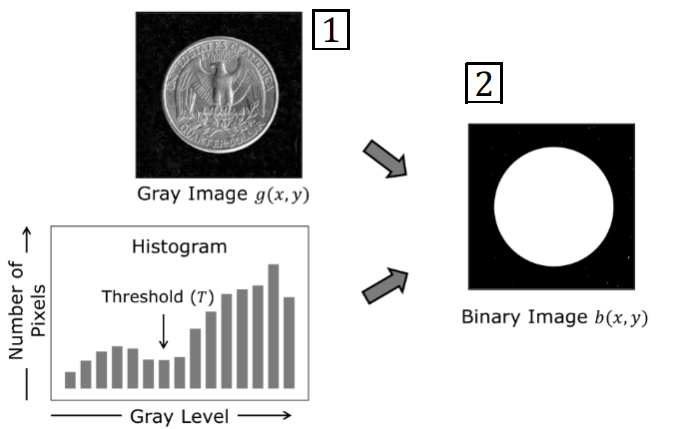
    <figcaption style="margin-top: 0.5em; text-align: center; font-size: 13px; color: #888;"><em>Şekil 1: Histogram Eşikleme (Thresholding): 1) Gri seviye görüntü $g(x,y)$ ve histogram vadisinden saptanan eşik $T$; 2) Elde edilen ikili (binary) bölütleme maskesi $b(x,y)$.</em></figcaption>
  

</figure>

2. **Aktif Konturlar (Active Contours / Snakes):** Görüntü üzerine kullanıcı tarafından yaklaşık dairesel bir başlangıç konturu yerleştirilir. Bu elastik kontur, içsel gerilim/bükülme kuvvetleri ve dışsal görüntü kuvvetleri (gradyanlar) altında otomatik olarak büzülüp genişleyerek nesnenin kesin sınır çizgisine kilitlenir (**latch**). Ancak bu yöntem kullanıcı müdahalesi ve manuel başlatma (**initialization**) gerektirdiğinden genel ve tam otomatik bölütleme problemini çözemez.

<figure style="display:flex; justify-content: center; margin: 20px 0;">
  

    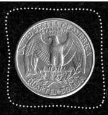
    <figcaption style="margin-top: 0.5em; text-align: center; font-size: 13px; color: #888;"><em>Şekil 2: Aktif Konturlar (Snakes): Madeni para etrafına başlatılan elastik eğrinin gradyan kuvvetleriyle sınıra kilitlenmesi.</em></figcaption>
  

</figure>

### 1.2 Bölütlemenin "Tanımsız" (Ill-Defined) ve Öznel Doğası

Doğal sahneler (**natural scenes**) üzerinde genel bir bölütleme yapmaya çalıştığımızda, karşımıza "anlamlı bölüt" (**meaningful segment**) kavramının mutlak bir matematiksel tanımının olmaması problemi çıkar.

* **Örnek Senaryo:** Şapka takmış bir insanın fotoğrafında şapka insanın bir parçası olarak tek bir segment mi sayılmalıdır, yoksa bağımsız iki ayrı segment mi? Bu sorunun cevabı tamamen çözülmek istenen göreve, bağlama ve uygulamaya bağlıdır.
* **İnsan Öznelliği:** Martin ve arkadaşları (2001) tarafından yapılan psikofiziksel deneylerde, aynı doğal manzara fotoğrafları farklı insan deneklere verilmiş ve onlardan anlamlı bölütler çizmeleri istenmiştir. Deney sonuçlarında, bir kişinin görüntüyü sadece kaba dış hatlarıyla ayırdığı, bir diğerinin mimari süslemelere kadar indiği, üçüncü bir kişinin ise mikro dekoratif parçaları dahi ayrı birer segment olarak kaydettiği görülmüştür. Bölütleme, insanlar için bile son derece öznel (**subjective**) bir süreçtir.

<figure style="display:flex; justify-content: center; margin: 20px 0;">
  

    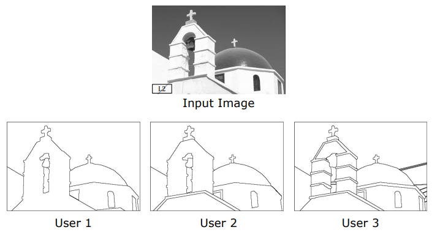
    <figcaption style="margin-top: 0.5em; text-align: center; font-size: 13px; color: #888;"><em>Şekil 3: Bölütlemenin öznel doğası (Martin et al., 2001): Aynı giriş görüntüsü üzerinde farklı insan deneklerin (User 1, User 2, User 3) çizdiği bölütleme sınırları.</em></figcaption>
  

</figure>

### 1.3 İki Temel Bölütleme Paradigması

Bu karmaşıklığı yönetmek ve algoritmik bir çerçeveye oturtmak için iki temel strateji geliştirilmiştir:

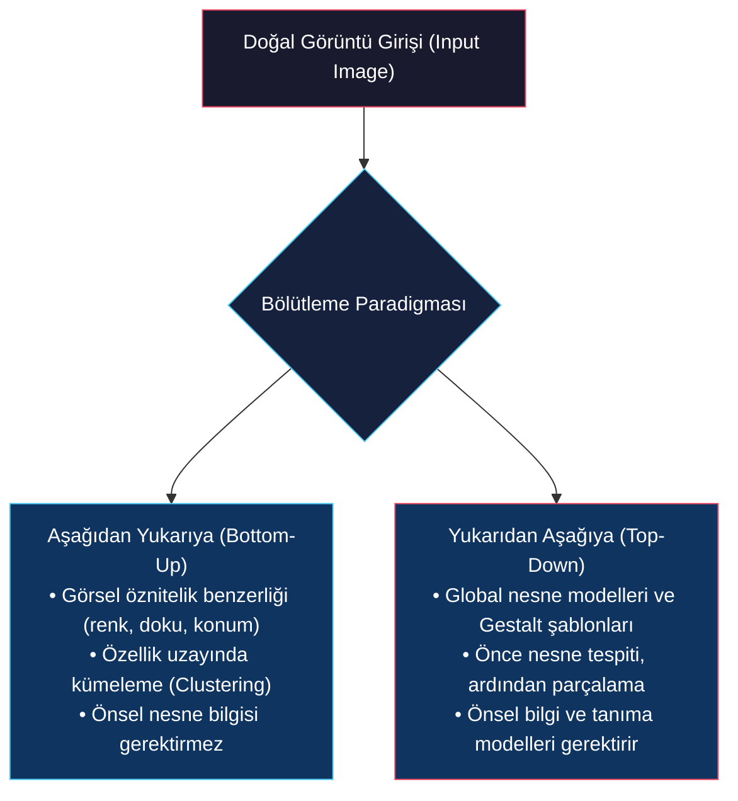

1. **Yukarıdan Aşağıya (Top-Down) Bölütleme:** Piksellerin bir araya gelme sebebi, onların aynı global nesneye (**object model**) ait olmalarıdır. Sistem önce nesneyi tespit eder, ardından alt parçalarını bölütler.
2. **Aşağıdan Yukarıya (Bottom-Up) Bölütleme:** Piksellerin bir araya gelme sebebi, onların yerel ve görsel özniteliklerinin (renk, parlaklık, doku, konum vb.) benzer olmasıdır. Matematiksel olarak modellenmesi çok daha elverişli olan bu yaklaşım, bölütleme problemini saf bir **Özellik Uzayında Kümeleme (Clustering)** problemi haline indirger.

---

## 2. İnsan Görsel Sisteminde Bölütleme (Segmentation by Humans)

İnsanların karmaşık sahnelerdeki nesneleri milisaniyeler içinde nasıl gruplayıp bölütlediğini açıklayan en güçlü psikolojik çerçeve **Gestalt Psikolojisidir** (Almanca "biçim/bütünlük"). Bu teorinin temel direği, görsel sistemimizin nesneleri parçalarından bağımsız olarak **önce bütünüyle (entirety)** bir grup olarak algıladığı, ardından o grubun alt elemanlarını (**subgroups**) saptadığı gerçeğidir.

> **Dalmaçyalı Köpek Olgusu:** Siyah-beyaz lekelerden oluşan soyut bir resme baktığımızda, bir süre sonra gözümüz resmin ortasındaki Dalmaçyalı köpeği bir bütün olarak saptar. Bu bütünü algıladıktan sonra köpeğin ayaklarını, kafasını ve kuyruğunu (alt grupları) ayırt edebiliriz.

<figure style="display:flex; justify-content: center; margin: 20px 0;">
  

    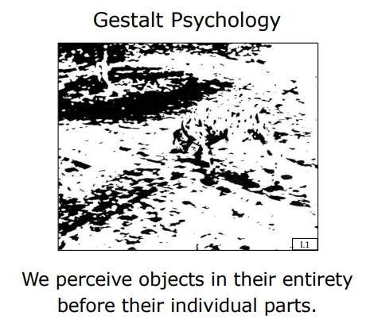
    <figcaption style="margin-top: 0.5em; text-align: center; font-size: 13px; color: #888;"><em>Şekil 4: Gestalt Psikolojisi: Bütüncül algı ilkesi ("We perceive objects in their entirety before their individual parts").</em></figcaption>
  

</figure>

Todorovic (2008) ve Smith (1988), insan beyninin pikselleri ve görsel uyarıcıları bir araya getirmek (**grouping**) için kullandığı temel Gestalt kurallarını şu şekilde tanımlamıştır:

### 2.1 Yakınlık İlkesi (Proximity)

Uzamsal olarak birbirine daha yakın konumlandırılmış olan nesneler ve ögeler, görsel sistemimiz tarafından otomatik olarak bir grup/alt grup olarak algılanır. Eşit aralıklı noktalar tek bir bütün oluştururken, noktalar arasındaki bağıl mesafeler değiştirildiğinde anında ikişerli veya üçerli alt kümeler belirir.

<figure style="display:flex; justify-content: center; margin: 20px 0;">
  

    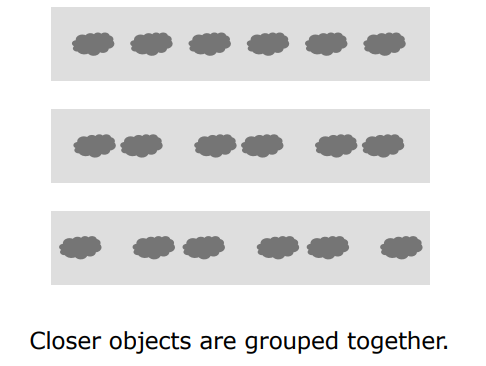
    <figcaption style="margin-top: 0.5em; text-align: center; font-size: 13px; color: #888;"><em>Şekil 5: Yakınlık İlkesi (Proximity): Birbirine uzamsal olarak daha yakın olan görsel ögeler birlikte gruplanır.</em></figcaption>
  

</figure>

### 2.2 Benzerlik İlkesi (Similarity)

Görünüm özellikleri (parlaklık, renk, boyut, yönelim vb.) benzer olan görsel elemanlar bir arada gruplanır. 

* **Rekabet Durumu:** Benzerlik ile yakınlık ilkeleri birbiriyle rekabet ettiğinde (örneğin farklı renklerdeki noktalar birbirine çok yakın çiftler halinde dizildiğinde), genellikle **yakınlık ilkesi baskın gelir** ve farklı renkte olsalar dahi birbirine yakın duran çiftleri tek bir alt grup olarak algılarız.

<figure style="display:flex; justify-content: center; margin: 20px 0;">
  

    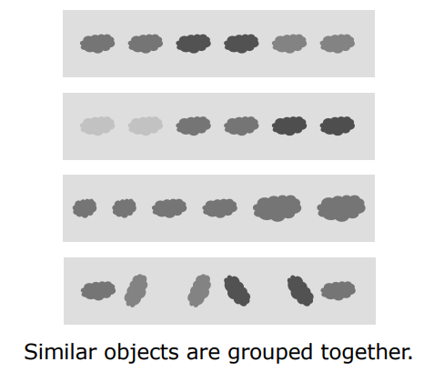
    <figcaption style="margin-top: 0.5em; text-align: center; font-size: 13px; color: #888;"><em>Şekil 6: Benzerlik İlkesi (Similarity): Benzer parlaklık, renk, ölçek ve yönelime sahip ögelerin gruplanması.</em></figcaption>
  

</figure>

### 2.3 Ortak Kader İlkesi (Common Fate)

Birbirinden uzamsal olarak çok uzakta veya dağınık olsalar dahi, aynı doğrultuda ve aynı hızla hareket eden (aynı "kadere" sahip olan) veya görünümünü senkronize değiştiren tüm görsel elemanlar beyin tarafından anında bağımsız tek bir grup olarak birleştirilir.

<figure style="display:flex; justify-content: center; margin: 20px 0;">
  

    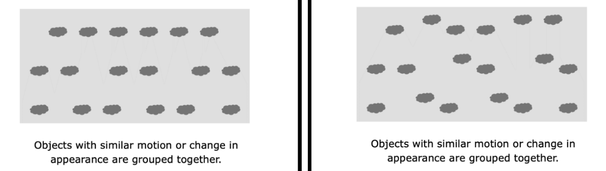
    <figcaption style="margin-top: 0.5em; text-align: center; font-size: 13px; color: #888;"><em>Şekil 7: Ortak Kader İlkesi (Common Fate): Birlikte hareket eden veya görünümü aynı anda değişen ögelerin gruplanması.</em></figcaption>
  

</figure>

### 2.4 Ortak Bölge ve Bağlantılılık (Common Region & Connectivity)

Üzerlerine kapalı sınırlar (elipsler/kutular) çizilmiş veya ince çizgisel linklerle birbirine fiziksel olarak bağlanmış görsel elemanlar, uzamsal aralıkları tamamen üniform olsa dahi bağlantılılık kuralı gereğince anında bağımsız alt gruplar olarak algılanır.

<figure style="display:flex; justify-content: center; margin: 20px 0;">
  

    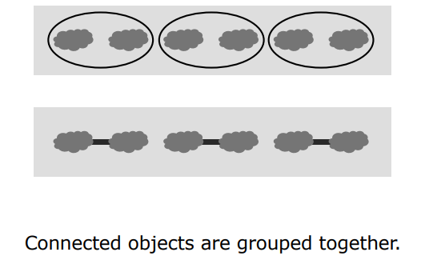
    <figcaption style="margin-top: 0.5em; text-align: center; font-size: 13px; color: #888;"><em>Şekil 8: Ortak Bölge ve Bağlantılılık (Common Region & Connectivity): Kapalı sınırlar veya fiziksel bağlantılarla birleştirilen ögelerin algısal gruplanması.</em></figcaption>
  

</figure>

### 2.5 Süreklilik İlkesi (Continuity)

Aynı pürüzsüz ve sürekli bir geometrik eğri (**continuous curve**) üzerine hizalanmış olan görsel noktalar ve parçacıklar, aralarında fiziksel boşluklar olsa veya kesişmeler bulunsa dahi görsel sistemimiz tarafından tek bir hat olarak algılanır.

<figure style="display:flex; justify-content: center; margin: 20px 0;">
  

    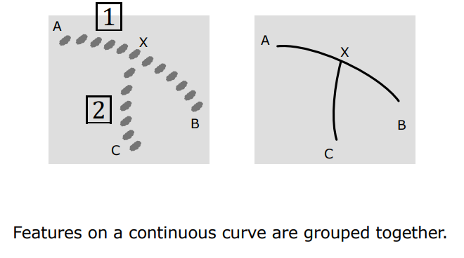
    <figcaption style="margin-top: 0.5em; text-align: center; font-size: 13px; color: #888;"><em>Şekil 9: Süreklilik İlkesi (Continuity): Pürüzsüz eğri boyunca uzanan ögelerin kesintisiz bir hat olarak algılanması ($A-X-B$ hattının $C-X$ hattından ayrışması).</em></figcaption>
  

</figure>

### 2.6 Simetri İlkesi (Symmetry)

Birbirine paralel ve simetrik (öteleme veya yansıma simetrisi) olan yapılar çok güçlü bir gruplama uyarısı oluşturur. Fiziksel dünyada iki tamamen bağımsız nesnenin şans eseri kusursuz bir simetri oluşturma olasılığı neredeyse sıfırdır; dolayısıyla simetrik yapılar beyin tarafından kesinlikle aynı gruba ait kabul edilir.

<figure style="display:flex; justify-content: center; margin: 20px 0;">
  

    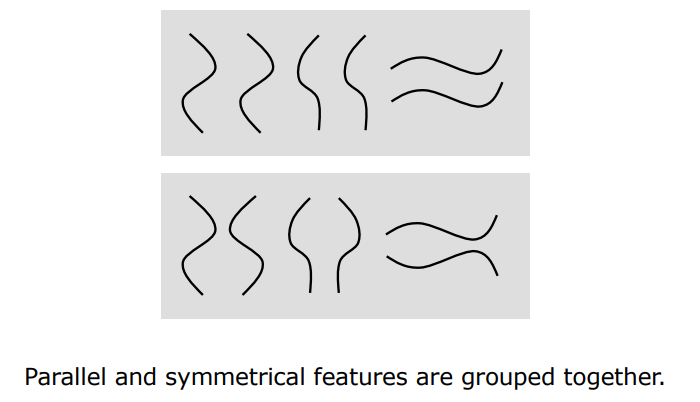
    <figcaption style="margin-top: 0.5em; text-align: center; font-size: 13px; color: #888;"><em>Şekil 10: Simetri İlkesi (Symmetry): Paralel ve simetrik çizgisel yapıların algısal olarak birbirine bağlanması.</em></figcaption>
  

</figure>

---

## 3. Kümeleme Olarak Bölütleme Matematiği (Segmentation as Clustering)

Aşağıdan yukarıya (**bottom-up**) bölütleme felsefesinde, görüntüdeki her bir pikseli temsil etmek üzere ölçülebilen veya hesaplanabilen görsel özelliklerden oluşan yüksek boyutlu bir **Özellik Vektörü (Feature Vector - $\mathbf{f}_i$)** tanımlanır.

### 3.1 Piksel Özellik Uzayı (Feature Space)

Piksel özellik vektörünü oluşturmak için şu bileşenler bir araya getirilebilir:

* **Ölçülebilen Özellikler:** Pikselin parlaklığı ($I$), renk kanalları ($R, G, B$).
* **Uzamsal Koordinatlar:** Pikselin görüntü düzlemindeki konumu ($x, y$).
* **Hesaplanabilen Özellikler:** Aktif aydınlatma (ToF), defocus veya stereo ile saptanan derinlik ($z$ / $d$); piksellerin zamansal hareketini belirten optik akış vektörleri ($u, v$); yerel doku (texture) tanımlayıcıları ve malzeme yansıtma (BRDF) özellikleri.

$$\mathbf{f}\_i = \begin{bmatrix} R \\ G \\ B \\ x \\ y \\ d \\ \vdots \end{bmatrix}$$

Bu özellik vektörü, her pikseli yüksek boyutlu bir **Öklid Uzayına (Euclidean Space - $n$-space)** birer nokta olarak haritalar.

<figure style="display:flex; justify-content: center; margin: 20px 0;">
  

    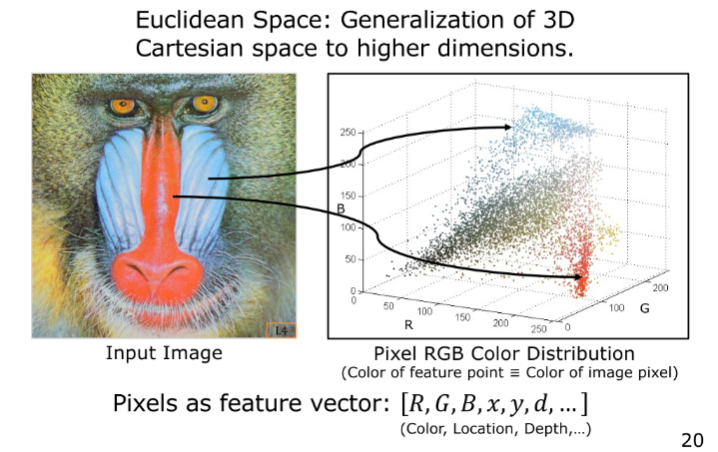
    <figcaption style="margin-top: 0.5em; text-align: center; font-size: 13px; color: #888;"><em>Şekil 11: Öklid Özellik Uzayı: Mandrill görüntüsünün piksellerinin 3B RGB renk uzayına dağıtılması ve özellik vektörü $\mathbf{f} = [R, G, B, x, y, d, \dots]^T$ temsili.</em></figcaption>
  

</figure>

### 3.2 Piksel Benzerliği ve Öklid Mesafesi

İki piksel ($i$ ve $j$) arasındaki görsel benzerliği ölçmek için, bu piksellerin özellik uzayındaki haritaları ($\mathbf{f}\_i$ ve $\mathbf{f}\_j$) arasındaki $\mathcal{L}\_2$ (Öklid) uzaklığı hesaplanır:

$$\mathcal{L}\_2(\mathbf{f}\_i, \mathbf{f}\_j) = \|\mathbf{f}\_i - \mathbf{f}\_j\| = \sqrt{\sum\_{k=1}^D (f\_{ik} - f\_{jk})^2}$$

Bu matematiksel kurala göre; **özellik uzayındaki mesafe ne kadar küçükse, iki piksel arasındaki görsel ve geometrik benzerlik o kadar büyüktür**. Görüntü bölütleme, benzer pikselleri özellik uzayında bir araya getiren **kümeleme (clustering)** algoritmalarının çalıştırılmasına indirgenir.

<figure style="display:flex; justify-content: center; margin: 20px 0;">
  

    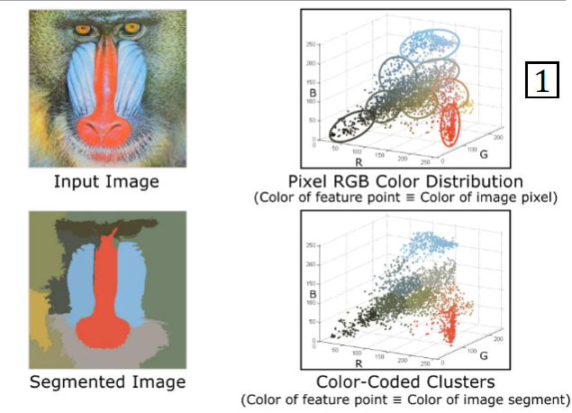
    <figcaption style="margin-top: 0.5em; text-align: center; font-size: 13px; color: #888;"><em>Şekil 12: Kümeleme olarak bölütleme: RGB uzayında kümelenen noktaların etiketlenmesi ve görüntü düzleminde segmentlere dönüştürülmesi.</em></figcaption>
  

</figure>

---

## 4. k-Means Bölütleme (k-Means Segmentation)

**k-Means**, bilgisayarlı görüde en sık kullanılan, uygulaması kolay ve hızlı bir bölütleme algoritmasıdır. Lloyd-MacQueen algoritmasına dayanır.

### 4.1 Algoritmanın Çalışma Adımları

Verilen bir $N$ pikselli görüntüden $k$ adet segment (küme) elde etmek için şu adımlar izlenir:

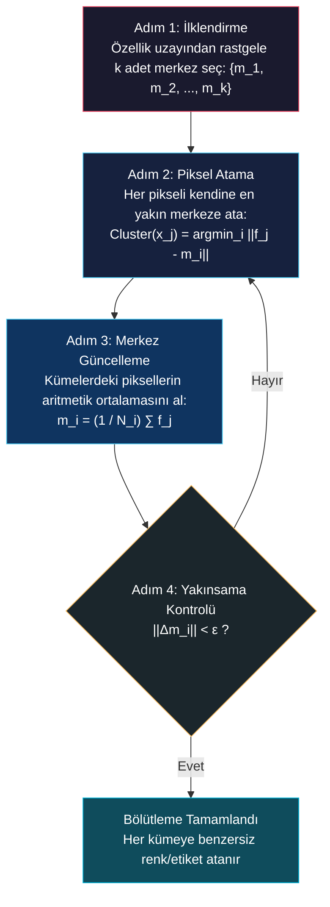

1. **İlklendirme (Initialization):** Özellik uzayında $k$ adet başlangıç merkezi seçilir: $\{m\_1, m\_2, \dots, m\_k\}$.
2. **Piksel Atama (Assignment):** Her bir $x\_j$ pikseli için en yakın $m\_i$ merkezi saptanır ve piksel $i$. kümeye atanır:
   $$\text{Atama}(x\_j) = \arg\min\_{i} \|\mathbf{f}\_j - m\_i\|$$
3. **Merkez Güncelleme (Update):** Her bir kümenin yeni merkezi, o kümeye atanan tüm piksellerin aritmetik ortalaması alınarak yeniden hesaplanır:
   $$m\_i = \frac{1}{N\_i} \sum\_{j \in \text{Cluster } i} \mathbf{f}\_j$$
4. **Yakınsama Kontrolü (Convergence):** Eğer tüm $k$ merkezdeki kayma miktarı belirlenen çok küçük bir $\epsilon$ eşik değerinden küçükse algoritma yakınsamış kabul edilerek durdurulur; aksi takdirde Adım 2'ye geri dönülür.

<figure style="display:flex; justify-content: center; margin: 20px 0;">
  

    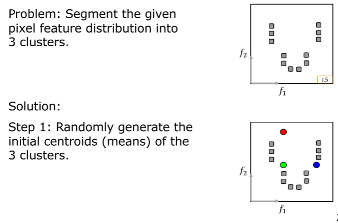
    <figcaption style="margin-top: 0.5em; text-align: center; font-size: 13px; color: #888;"><em>Şekil 13: k-Means İlklendirme: $k=3$ adet başlangıç merkezinin özellik uzayına rastgele yerleştirilmesi.</em></figcaption>
  

</figure>

<figure style="display:flex; justify-content: center; margin: 20px 0;">
  

    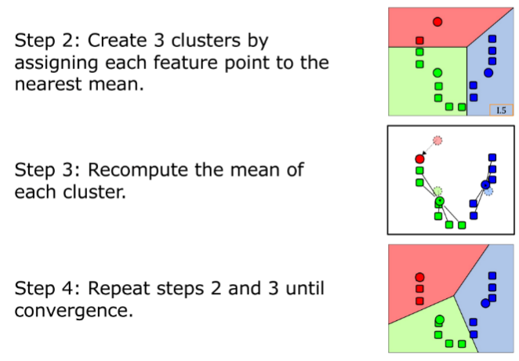
    <figcaption style="margin-top: 0.5em; text-align: center; font-size: 13px; color: #888;"><em>Şekil 14: k-Means İterasyonları: Adım 2 (Voronoi ataması), Adım 3 (Merkezlerin ağırlıklı ortalamaya kayması) ve Adım 4 (Yakınsama).</em></figcaption>
  

</figure>

### 4.2 Merkez İlklendirme Yöntemleri (Initialization Methods)

k-Means yerel minimumlara (**local minima**) karşı hassas olduğundan, başlangıç merkezlerinin doğru seçilmesi hayati önem taşır:

* **Yöntem 1 (Rastgele Seçim):** Dağılımdan tamamen rastgele $k$ nokta seçilir. Seçilen iki nokta birbirine çok yakınsa, dengeli kümelenme için süreç tekrarlanarak yeniden örnekleme (**resample**) yapılır.
* **Yöntem 2 (Üniform Dağıtım):** Özellik uzayındaki tüm dağılımın sınır kutusu (bounding box) hesaplanır ve $k$ adet merkez bu kutunun içine sınırlar dahilinde eşit aralıklarla (**uniform**) dağıtılır.
* **Yöntem 3 (Alt Küme k-Means - En Kararlı Yaklaşım):** Görüntüdeki milyonlarca piksel arasından rastgele çok küçük bir alt küme (örneğin 100 veya 1000 piksel) seçilir. Bu küçük grup üzerinde k-Means çalıştırılır ve elde edilen kararlı merkezler, tüm görüntünün k-Means işleminde başlangıç merkezleri olarak atanır.

### 4.3 Küme Sayısı $k$'nın Etkisi

Küme sayısı $k$, bölütlemenin detay seviyesini doğrudan belirler:

<figure style="display:flex; justify-content: center; margin: 20px 0;">
  

    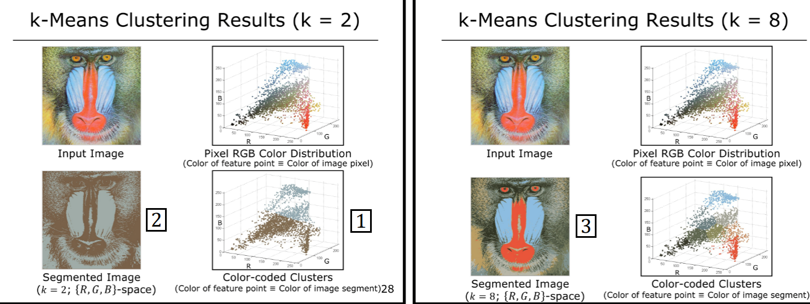
    <figcaption style="margin-top: 0.5em; text-align: center; font-size: 13px; color: #888;"><em>Şekil 15: Mandrill görüntüsünde k-Means sonuçları: Sol: $k=2$ (sadece 2 renk tonu); Sağ: $k=8$ (daha zengin ve detaylı segmentasyon).</em></figcaption>
  

</figure>

### 4.4 Boyut Problemi: RGB vs. RGB-XY Uzayı

* **Sadece Renk Uzayı Kullanımı (RGB):** Görüntüyü sadece RGB renk uzayında kümelediğimizde, görüntünün tamamen farklı yerlerinde bulunan ama renkleri aynı olan bağımsız nesne parçaları aynı kümede birleşir (**disjoint regions**). Örneğin, yeşil biber görüntüsünde sol üstteki yaprak ile sağ alttaki biber parçası aynı küme etiketini alır.
* **Konumsal Koordinatların Entegrasyonu (RGB-XY):** Bu sorunu çözmek için piksel özellik vektörüne uzamsal $(x,y)$ koordinatları da dahil edilerek 5 boyutlu bir özellik uzayı ($\mathbf{f} = [R, G, B, x, y]^T$) oluşturulur. Bu sayede, birbirine yakın olan benzer renkli piksellerin aynı bölgeye ait olması teşvik edilirken, uzaktaki piksellerin ayrılması sağlanır.

<figure style="display:flex; justify-content: center; margin: 20px 0;">
  

    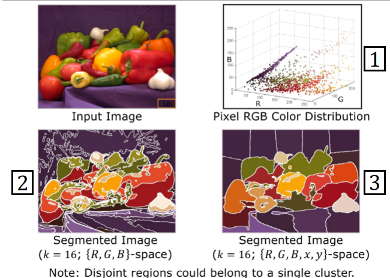
    <figcaption style="margin-top: 0.5em; text-align: center; font-size: 13px; color: #888;"><em>Şekil 16: Peppers görüntüsünde k-Means ($k=16$): Sol: $\{R,G,B\}$-uzayı (ayrık bölgeler tek kümede birleşir); Sağ: $\{R,G,B,x,y\}$-uzayı (uzamsal süreklilik korunur).</em></figcaption>
  

</figure>

> **k-Means'in Temel Zayıflıkları:**
> 1. Küme sayısı $k$ kullanıcı tarafından önceden kesin olarak verilmelidir.
> 2. Başlangıç merkezlerine aşırı derecede duyarlıdır (farklı ilklendirmeler çok farklı sonuçlar üretir).
> 3. Aykırı değerlere (**outliers**) karşı dayanıksızdır; tek bir gürültü pikseli tüm küme merkezini kendine çekebilir.

---

## 5. Mean-Shift Bölütleme (Mean-Shift Segmentation)

**Mean-Shift**, k-Means algoritmasının iki büyük dezavantajını (önceden $k$ belirtme zorunluluğu ve ilklendirme hassasiyeti) tamamen ortadan kaldıran parametresiz, olasılıksal bir **tepe tırmanma (hill-climbing / gradient ascent)** yöntemidir (Comaniciu & Meer, 2002).

### 5.1 Olasılık Yoğunluk Tepeleri ve Mod (Mode) Konsepti

Özellik uzayındaki piksellerin dağılımı, pürüzsüz bir **Olasılık Yoğunluk Fonksiyonu (Probability Density Function - PDF)** olarak modellenir. Bu fonksiyon, 3B uzayda inişli çıkışlı tepelerden (hills) ve vadilerden oluşan bir coğrafi haritaya benzer:

* Haritadaki her bir tepe (hill), bağımsız bir **kümeyi (segmenti)** temsil eder.
* Tepenin en yüksek zirve noktası (**mode / peak**), o kümenin geometrik merkezidir.
* Görüntüdeki her bir piksel, kendi yerel komşuluğundaki en dik eğimi takip ederek en yüksek tepeye doğru tırmanır (**hill-climbing**).
* **Aynı zirveye (mode) ulaşan tüm pikseller, aynı bölüte (segment değerine) atanır.** Bu sayede bölüt sayısı $k$ önceden belirtilmez; sistem tarafından doğal olarak keşfedilir.

<figure style="display:flex; justify-content: center; margin: 20px 0;">
  

    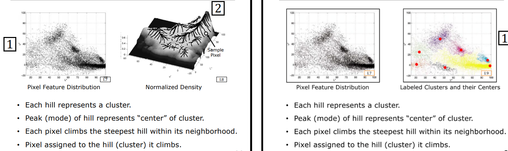
    <figcaption style="margin-top: 0.5em; text-align: center; font-size: 13px; color: #888;"><em>Şekil 17: Mean-Shift Prensibi: Özellik dağılımının normalize yoğunluk yüzeyine dönüştürülmesi, her pikselin zirveye tırmanması ve modların küme merkezleri olarak etiketlenmesi.</em></figcaption>
  

</figure>

### 5.2 Mean-Shift Algoritması Adımları

$N$ pikselli bir dağılım ve $W$ yarıçapında dairesel bir analiz penceresi (**bandwidth / window size**) verildiğinde süreç şu şekilde işler:

1. Her bir $i$ pikselinin başlangıç konumu kendi özellik değerine eşitlenir: $m\_i^{(0)} = \mathbf{f}\_i$.
2. $m\_i$ merkezli, $W$ yarıçapına sahip dairesel/küresel bir pencere yerleştirilir.
3. Pencerenin içinde kalan tüm noktaların ağırlıklı merkezi (**centroid**) hesaplanır:
   $$m = \frac{\sum\_{\mathbf{x}\_j \in W(m\_i)} K(\mathbf{x}\_j - m\_i) \mathbf{x}\_j}{\sum\_{\mathbf{x}\_j \in W(m\_i)} K(\mathbf{x}\_j - m\_i)}$$
4. Pencerenin merkezi, hesaplanan bu yeni ağırlıklı merkeze doğru kaydırılır ($m\_i \leftarrow m$). Bu kayma vektörüne **Mean Shift Vektörü** denir.
5. Kayma miktarı belirlenen çok küçük bir $\epsilon$ değerinin altına inene kadar (pencere zirveye ulaşıp durana kadar) Adım 2 ve 4 tekrarlanır.
6. Zirveye ulaşan nokta o pikselin **modu (mode)** kabul edilir. Aynı moda yakınsayan tüm pikseller aynı küme etiketiyle işaretlenir.

<figure style="display:flex; justify-content: center; margin: 20px 0;">
  

    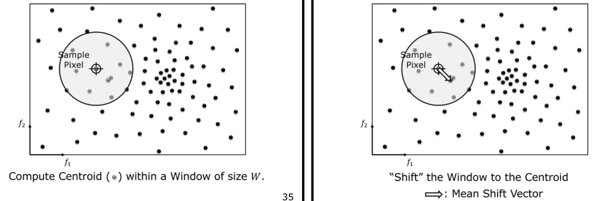
    <figcaption style="margin-top: 0.5em; text-align: center; font-size: 13px; color: #888;"><em>Şekil 18: Mean-Shift Adımları: $W$ penceresi içindeki ağırlıklı merkezin hesaplanması ve pencerenin bu merkeze kaydırılması (Mean Shift Vektörü).</em></figcaption>
  

</figure>

<figure style="display:flex; justify-content: center; margin: 20px 0;">
  

    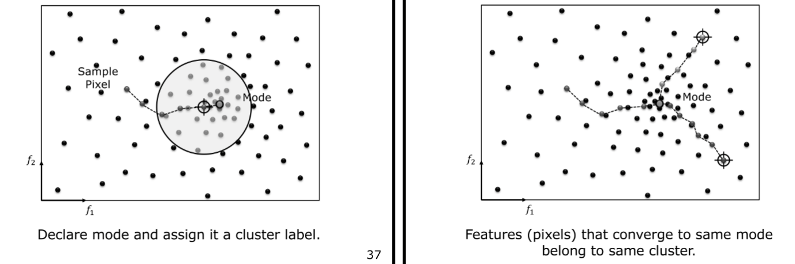
    <figcaption style="margin-top: 0.5em; text-align: center; font-size: 13px; color: #888;"><em>Şekil 19: Yakınsama: Tepe noktasına (moda) ulaşan pencere durur; aynı moda ulaşan tüm piksel yolları aynı küme etiketini alır.</em></figcaption>
  

</figure>

### 5.3 k-Means ve Mean-Shift Karşılaştırması

* **Aykırı Değer (Outlier) ve Şekil Dayanıklılığı:** k-Means, kümelerin küresel (dairesel) olduğunu varsayar ve dışta kalan aykırı değerlerden ötürü merkezleri kaydırarak hatalı bölütler üretir. Mean-Shift ise yerel yoğunluk tepelerine tırmandığından, karmaşık geometrileri (örneğin Mickey Mouse dağılımı gibi iç içe geçmiş veya farklı yoğunluklu kümeleri) ve aykırı değerleri kusursuz şekilde yönetir.

<figure style="display:flex; justify-content: center; margin: 20px 0;">
  

    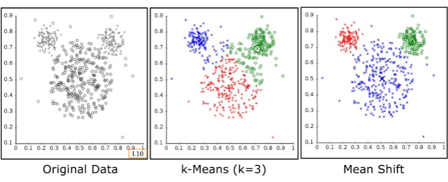
    <figcaption style="margin-top: 0.5em; text-align: center; font-size: 13px; color: #888;"><em>Şekil 20: Karmaşık dağılımda karşılaştırma: Sol: Orijinal veri (Mickey şekli ve aykırı değerler); Orta: k-Means ($k=3$) başarısızlığı; Sağ: Mean-Shift'in doğru kümeleme başarısı.</em></figcaption>
  

</figure>

<figure style="display:flex; justify-content: center; margin: 20px 0;">
  

    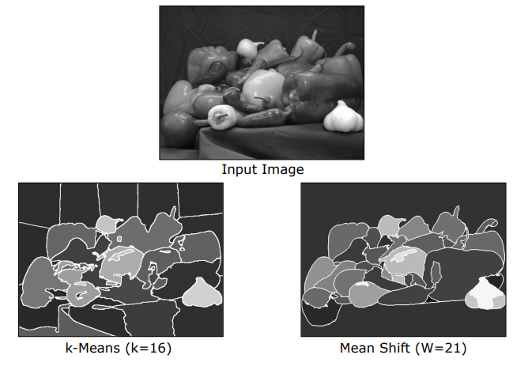
    <figcaption style="margin-top: 0.5em; text-align: center; font-size: 13px; color: #888;"><em>Şekil 21: Doğal görüntüde karşılaştırma: k-Means ($k=16$) arka planı yapay olarak parçalarken; Mean-Shift ($W=21$) biberleri ve arka planı homojen bir şekilde bölütler.</em></figcaption>
  

</figure>

> **Mean-Shift Değerlendirmesi:**
> - **Avantajları:** $k$ parametresi gerektirmez, keyfi küme şekillerini bulabilir, aykırı değerlere karşı son derece dirençlidir.
> - **Dezavantajları:** Hesaplama maliyeti çok yüksektir (her bir tekil piksel için tepe tırmanma döngüsü yürütülür). Sonuçlar seçilen pencere boyutu $W$ parametresine aşırı duyarlıdır ($W$ çok küçükse aşırı bölütleme, çok büyükse segmentlerin birleşmesi gerçekleşir).

---

## 6. Grafik Tabanlı Bölütleme (Graph-Based Segmentation)

Grafik tabanlı bölütleme, görüntüyü piksel bazlı bağımsız bir kümeleme problemi olarak görmek yerine, pikselleri birbirine bağlayan devasa bir **ilişkisel ağ (graph)** olarak modeller.

### 6.1 Görüntünün Grafik Olarak Temsili

Görüntü, $G = (V, E)$ şeklinde ağırlıklı ve yönsüz bir grafiğe dönüştürülür:

* **Düğümler (Vertices - $V$):** Görüntüdeki her bir piksel grafikte bir düğümdür.
* **Kenarlar (Edges - $E$):** Piksel çiftleri arasında tanımlanan bağlantılardır.
* **Kenar Ağırlığı (Weight - $w(i,j)$):** İki piksel arasındaki **Affinity (Yakınlık / Benzerlik)** değeridir.

<figure style="display:flex; justify-content: center; margin: 20px 0;">
  

    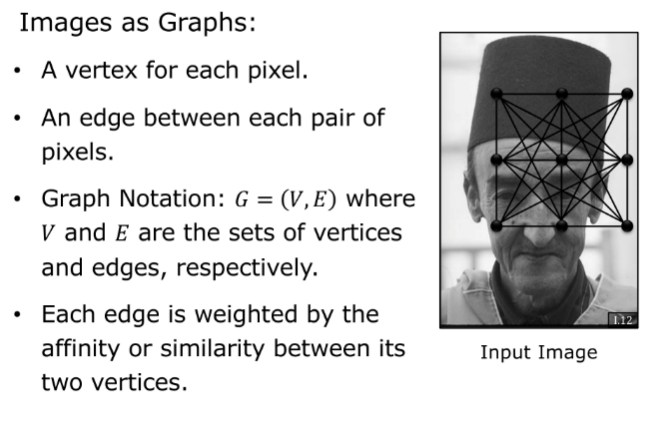
    <figcaption style="margin-top: 0.5em; text-align: center; font-size: 13px; color: #888;"><em>Şekil 22: Görüntü Grafiği: Düğümler (pikseller), kenarlar ve kenar ağırlığı olarak tanımlanan afinite (benzerlik) değerleri.</em></figcaption>
  

</figure>

#### Piksel Yakınlığı (Affinity) Formülasyonu

$\mathbf{f}\_i$ ve $\mathbf{f}\_j$ özelliklerine sahip iki piksel arasındaki farklılık mesafesi $S(\mathbf{f}\_i, \mathbf{f}\_j) = \|\mathbf{f}\_i - \mathbf{f}\_j\|^2$ olsun. Aralarındaki afinite $w(i,j)$, negatif üslü bir Gauss fonksiyonu ile tanımlanır:

$$w(i,j) = A(\mathbf{f}\_i, \mathbf{f}\_j) = e^{-\frac{1}{2\sigma^2} \|\mathbf{f}\_i - \mathbf{f}\_j\|^2}$$

* İki piksel birbirine ne kadar çok benziyorsa ($\|\mathbf{f}\_i - \mathbf{f}\_j\| \to 0$), aralarındaki kenar ağırlığı o kadar büyüktür ($w(i,j) \to 1$).
* $\sigma$ parametresi, afinitenin parlaklık/renk değişimlerine karşı duyarlılığını kontrol eder.

### 6.2 Grafik Kesimi (Graph Cut) ve Minimum Kesim (Min-Cut)

* **Kesim (Cut):** Grafikteki tüm düğümleri ($V$) birbirine ayrık iki alt gruba ($V\_A$ ve $V\_B$) ayıran bölme hattıdır ($V\_A \cup V\_B = V, V\_A \cap V\_B = \emptyset$).
* **Kesim Kümesi (Cut-Set):** Bu bölme esnasında koparılan/kesilen tüm kenarların kümesidir.
* **Kesim Maliyeti (Cost of Cut):** Kesilen tüm kenarların ağırlıklarının toplamıdır:

$$\text{cut}(V\_A, V\_B) = \sum\_{u \in V\_A, \, v \in V\_B} w(u,v)$$

<figure style="display:flex; justify-content: center; margin: 20px 0;">
  

    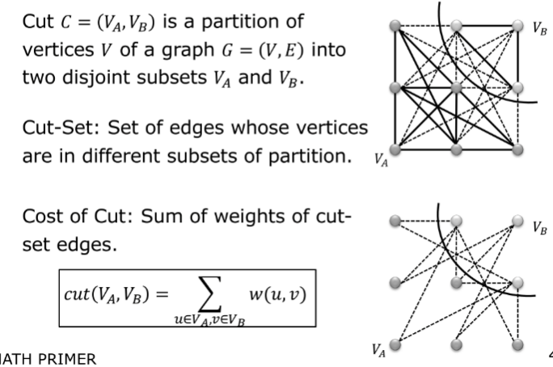
    <figcaption style="margin-top: 0.5em; text-align: center; font-size: 13px; color: #888;"><em>Şekil 23: Grafik Kesimi: $V$ grafiğinin $V_A$ ve $V_B$ kümelerine ayrılması ve $\text{cut}(V_A, V_B) = \sum w(u,v)$ maliyet hesabı.</em></figcaption>
  

</figure>

#### Min-Cut Algoritması ve Kritik Kusuru (Bias Toward Small Segments)

İlk akla gelen bölütleme yöntemi, kesim maliyetini minimize eden $\arg\min \text{cut}(V\_A, V\_B)$ hattını bulmaktır (**Min-Cut**). Çünkü aynı gruptaki piksellerin birbirine benzer (yüksek afinite), farklı gruptakilerin ise benzersiz (düşük afinite) olması istenir.

> **Min-Cut Kusuru (Küçük Parça Eğilimi):** Min-Cut algoritması, grafiği sürekli çok küçük, tekil veya izole parçalara (örneğin sadece tek bir köşe pikseline) bölmeye karşı ölümcül bir eğilime (**bias**) sahiptir.
> 
> *Nedeni:* Kesim maliyeti kesilen kenar sayısıyla doğru orantılı olarak büyür. Çok zayıf 100 kenarı keserek büyük bir nesneyi ayırmanın maliyeti, tek bir güçlü kenarı (örneğin tek bir pikseli) kesmekten çok daha büyüktür. Bu yüzden Min-Cut, görüntünün kenarlarından sürekli minik pikseller kopararak anlamsız parçalar üretir.

### 6.3 Normalize Edilmiş Kesim (Normalized Cut - NCut)

Jianbo Shi ve Jitendra Malik (2000), bu küçük parça hatasını çözmek amacıyla kesim maliyetini elde edilen alt grafiklerin toplam boyutlarıyla oranlayarak normalize eden **Normalized Cut (NCut)** yöntemini geliştirmiştir.

#### 1. Alt Grafik Boyutunun Ölçülmesi (Association)

Bir alt grafiğin ($V\_A$) boyutu, onun tüm büyük grafikle ($V$) ne kadar güçlü bağlara sahip olduğu toplanarak ölçülür; buna **Association (İlişkilendirme)** denir:

$$\text{assoc}(V\_A, V) = \sum\_{u \in V\_A, \, v \in V} w(u,v)$$

#### 2. NCut Formülasyonu

Bölüm sonucunda elde edilen $V\_A$ ve $V\_B$ alt grupları için normalize edilmiş kesim maliyeti şu şekilde tanımlanır:

$$\text{NCut}(V\_A, V\_B) = \frac{\text{cut}(V\_A, V\_B)}{\text{assoc}(V\_A, V)} + \frac{\text{cut}(V\_A, V\_B)}{\text{assoc}(V\_B, V)}$$

* Bu formülasyon sayesinde, eğer alt gruplardan biri çok küçük olursa (örneğin $V\_A$ sadece tek bir piksel içerirse), paydadaki $\text{assoc}(V\_A, V)$ değeri çok küçük olacağından terimin değeri patlar ve toplam $\text{NCut}$ maliyeti devasa düzeyde cezalandırılır.
* Algoritma ancak her iki alt grafik de dengeli ve büyük boyutlarda olduğunda minimum değeri üretir.

#### 3. Çözüm Zorluğu ve Spektral Yaklaşımlar (Spectral Methods)

* **NP-Complete Karmaşıklığı:** $\text{NCut}$ değerini tam olarak minimum yapan ayrık kesimi bulmanın bilinen hiçbir polinom-zamanlı algoritması yoktur; problem **NP-Complete** sınıfındadır.
* **Spektral Gevşetme (Shi-Malik Özvektör Çözümü):** Shi ve Malik, bu zorlu ayrık optimizasyon problemini sürekli (continuous) bir düzleme gevşeterek (**relaxation**), genelleştirilmiş bir özdeğer/özvektör problemine dönüştürmüştür:
  $$(D - W)\mathbf{y} = \lambda D \mathbf{y}$$
  Burada $W$ afinite matrisi, $D$ ise köşegen derece matrisidir ($D\_{ii} = \sum\_j W\_{ij}$). İkinci en küçük özdeğere karşılık gelen özvektör (**Fiedler vector**), görüntüyü en optimal şekilde ikiye bölen sürekli göstergedir.

<figure style="display:flex; justify-content: center; margin: 20px 0;">
  

    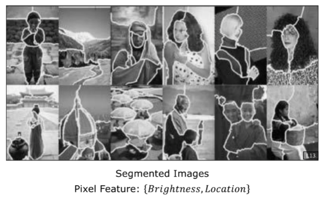
    <figcaption style="margin-top: 0.5em; text-align: center; font-size: 13px; color: #888;"><em>Şekil 24: Normalized Cut (Shi & Malik, 2000) Başarımı: Parlaklık ve konum özellikleri ($\{Brightness, Location\}$) kullanılarak doğal portre ve manzara görüntülerinin spektral grafik kesimiyle dengeli bölütlenmesi.</em></figcaption>
  

</figure>

---

## 7. Özetleyici Teknik Karşılaştırma Matrisi

Aşağıdaki matris, bu derste incelenen tüm görüntü bölütleme yaklaşımlarının temel matematiksel karar mekanizmalarını, girdi gereksinimlerini, avantajlarını ve sınır koşullarını özetlemektedir:

| Algoritma Sınıfı | Temel Matematiksel Formül / Karar | Kullanıcı Parametre Girişi | En Güçlü Avantajı | Temel Sınırlaması / Çöküş Noktası |
| :--- | :--- | :--- | :--- | :--- |
| **k-Means** | $\text{Cluster}(x\_j) = \arg\min\_i \|\mathbf{f}\_j - m\_i\|$ | Küme sayısı $k$ | Basit matematik, hızlı hesaplama ve kolay paralelleştirme | $k$ değerinin önceden bilinmesi zorunluluğu, rastgele ilklendirme hassasiyeti ve aykırı değerlere (outliers) dayanıksızlık |
| **Mean-Shift** | $m\_i \leftarrow \text{centroid}(W(m\_i))$ (Hill-Climbing) | Pencere yarıçapı $W$ (Bandwidth) | $k$ değerini kendi keşfeder; keyfi küme şekillerine ve aykırı değerlere karşı son derece dayanıklıdır | Her piksel için bağımsız tepe tırmanma yapıldığından hesaplama maliyetinin çok yüksek olması; $W$'ya aşırı duyarlılık |
| **Min-Cut (Graph)** | $\min \sum\_{u \in V\_A, v \in V\_B} w(u,v)$ | Yok (Saf min-cut) | Küresel grafik ilişkilerini kullanarak nesne sınırlarını matematiksel optimize etme | Grafikten sürekli tekil pikselleri koparma eğilimi (**bias toward small isolated segments**) |
| **Normalized-Cut (NCut)** | $\min \left( \frac{\text{cut}(V\_A, V\_B)}{\text{assoc}(V\_A, V)} + \frac{\text{cut}(V\_A, V\_B)}{\text{assoc}(V\_B, V)} \right)$ | Gevşetme parametreleri / Özvektör eşiği | NCut normalizasyonu sayesinde dengeli, anlamsal ve büyük nesne segmentleri üretimi | NP-Complete olması; sadece matris özvektör (spectral) yaklaşıklıklarıyla çözülebilmesi |

