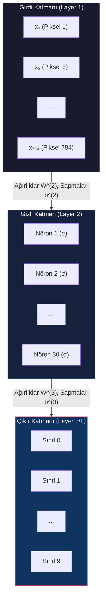
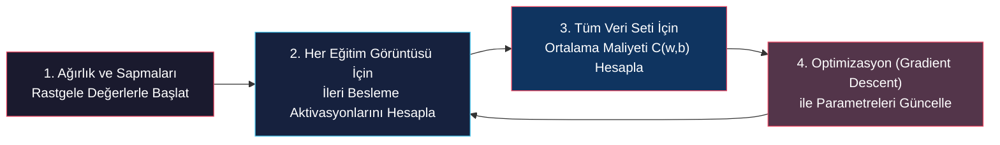
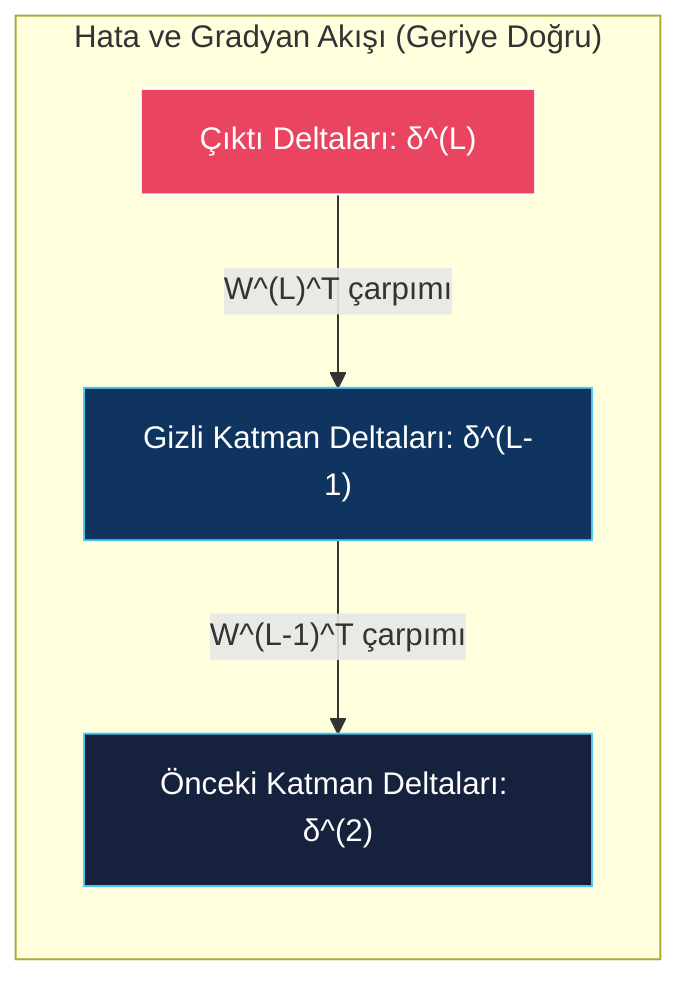

# Çok Katmanlı Ağlar, Gradyan Azalma ve Geriye Yayılım (Multi-Layer Networks & Backpropagation)

<!-- toc -->

Bu ders notu, yapay sinir ağları konusunun ikinci ve en kritik evresini; çok katmanlı ileri beslemeli ağ yapısını (Multi-Layer Perceptron - MLP), hata fonksiyonlarının çok boyutlu geometrisini, optimizasyon motoru olan **Gradyan Azalmayı (Gradient Descent)** ve yapay zeka devriminin matematiksel omurgasını oluşturan **Geriye Yayılım Algoritmasını (Backpropagation)** tüm doğrusal cebirsel ve diferansiyel zincir kuralı ispatlarıyla ele almaktadır.

---

## 1. Çok Katmanlı Yapay Sinir Ağları (Multi-Layer Perceptron - MLP)

Tek bir perceptron veya tek katmanlı doğrusal sınıflandırıcılar yalnızca düz bir hiperdüzlemle ayrılabilen (linearly separable) problemleri çözebilirken, araya birden çok **Gizli Katman (Hidden Layer)** eklenerek oluşturulan Çok Katmanlı Yapay Sinir Ağları (MLP), girdi ile çıktı arasında son derece karmaşık ve doğrusal olmayan her türlü manifold haritalama (mapping) işlevini öğrenebilir.

---

### 1.1 MLP Ağ Anatomisi ve Parametrik Gösterim

Tipik bir Çok Katmanlı Yapay Sinir Ağı üç ana katman hiyerarşisinden oluşur:

1. **Girdi Katmanı (Input Layer - Layer 1):** Ağın dış dünyadan ham veriyi kabul ettiği ilk katmandır. Buradaki düğümler herhangi bir matematiksel aktivasyon veya dönüşüm hesaplamaz; yalnızca girdi vektörünü (örneğin MNIST görüntüsündeki $28 \times 28 = 784$ adet piksel parlaklık değerini) sonraki katmanlara dağıtır.
2. **Gizli Katmanlar (Hidden Layers - Layer $2 \dots L-1$):** Girdi ile çıktı katmanı arasında yer alan içsel katmanlardır. Bu katmanlardaki sigmoid/ReLU nöronları, ham piksel girdilerinden kademeli olarak daha soyut ve üst düzey anlamsal özellikleri (kenarlar, dokular, köşe birleşimleri ve parça geometrileri) öğrenir.
3. **Çıktı Katmanı (Output Layer - Layer $L$):** Nihai sınıflandırma veya regresyon kararının üretildiği son katmandır. Örneğin MNIST rakam tanıma ağında, her biri $0$'dan $9$'a kadar bir rakam sınıfını temsil eden tam 10 adet çıktı nöronu yer alır.

<figure style="display:flex; justify-content: center; margin: 20px 0;">
  

    
    <figcaption style="margin-top: 0.5em; text-align: center; font-size: 13px; color: #888;"><em>Şekil 1: Çok Katmanlı Yapay Sinir Ağı Anatomisi: Girdi Katmanı (Layer 1), Gizli Katmanlar (Layer 2 & 3) ve Çıktı Katmanı (Layer 4). İlgili katmandaki bağlantı ağırlıkları $w_{jk}^{(l)}$ ve sapma parametreleri $b_j^{(l)}$ ile temsil edilir.</em></figcaption>
  

</figure>

---

### 1.2 Michael Nielsen'in MNIST Karar Ağı Örneği

Bilgisayarlı görü literatüründe standart referans olarak kabul edilen Michael Nielsen'in MNIST el yazısı rakam sınıflandırma mimarisi şu katman yapısına sahiptir:

<figure style="display:flex; justify-content: center; margin: 20px 0;">
  

    
    <figcaption style="margin-top: 0.5em; text-align: center; font-size: 13px; color: #888;"><em>Şekil 2: MNIST Veri Kümesi: Farklı el yazısı stillerinde yazılmış $28 \times 28$ boyutlu segmentlenmiş onluk taban rakam görüntüleri.</em></figcaption>
  

</figure>

- **Girdi Katmanı:** 784 nöron ($28 \times 28$ piksel normalize edilmiş parlaklık dizisi).
- **Gizli Katman:** 30 nöron (tam bağlı / fully connected yapı).
- **Çıktı Katmanı:** 10 nöron (0'dan 9'a her bir sınıf için bir aktivasyon).

<figure style="display:flex; justify-content: center; margin: 20px 0;">
  

    
    <figcaption style="margin-top: 0.5em; text-align: center; font-size: 13px; color: #888;"><em>Şekil 3: Nielsen MNIST Karar Ağı: Girdi olarak verilen '6' rakamı için çıktı katmanındaki 6. nöronun $a_6 \approx 1$, diğer nöronların $a_j \approx 0$ aktivasyonu üreterek %95 doğruluk sağlaması.</em></figcaption>
  

</figure>

#### Parametre Sayısı Analizi:
1. **Ağırlıklar (Weights):**
   - 1. Katmandan 2. Katmana: $784 \times 30 = 23.520$ adet
   - 2. Katmandan 3. Katmana: $30 \times 10 = 300$ adet
   - Toplam Ağırlık: $23.520 + 300 = 23.820$ adet
2. **Sapmalar (Biases):**
   - Gizli Katman Sapmaları: $30$ adet
   - Çıktı Katmanı Sapmaları: $10$ adet
   - Toplam Sapma: $30 + 10 = 40$ adet
3. **Toplam Eğitilebilir Parametre:**
   $$\text{Toplam Parametre} = 23.820 + 40 = 23.860 \text{ adet}$$

---

## 2. Hata Fonksiyonu ve Gradyan Azalma (Gradient Descent)

Rastgele başlatılan bir yapay sinir ağı, girdi olarak verilen bir "5" rakamı için hedef sınıfa değil, rastgele dağılmış hatalı aktivasyonlar üretecektir. Öğrenme süreci, bu hatayı ölçen maliyet fonksiyonunu adım adım minimize eden bir parametre optimizasyonudur.

---

### 2.1 Hedef Aktivasyonlar ve Maliyet Fonksiyonu (Cost Function)

Eğitim setindeki her $x$ görüntüsü için bir gerçek hedef sınıf etiketi (ground truth label) bulunur. Bu etiketler **One-Hot Encoding** formatında $\hat{\mathbf{a}}(x)$ vektörü olarak ifade edilir:

<figure style="display:flex; justify-content: center; margin: 20px 0;">
  

    
    <figcaption style="margin-top: 0.5em; text-align: center; font-size: 13px; color: #888;"><em>Şekil 4: Hedef Aktivasyonlar (Ground Truth): MNIST eğitim setindeki görüntüler ve bunlara karşılık gelen one-hot hedef vektörleri $\hat{\mathbf{a}}(x)$.</em></figcaption>
  

</figure>

Eğitilmemiş ağ rastgele ağırlıklarla çalıştırıldığında çıktılar hedeften tamamen sapmış durumdadır:

<figure style="display:flex; justify-content: center; margin: 20px 0;">
  

    
    <figcaption style="margin-top: 0.5em; text-align: center; font-size: 13px; color: #888;"><em>Şekil 5: Rastgele Başlatma Durumu: Girdi olarak gelen '5' rakamı için ağın ürettiği tahmin vektörü $\mathbf{a} = [0.3, 0.5, 0.0, 0.1, 0.8, 0.3, 0.5, 0.2, 0.7, 0.1]^T$ hedef $[0,0,0,0,0,1,0,0,0,0]^T$ vektöründen uzaktır.</em></figcaption>
  

</figure>

#### Karesel Hata (MSE) Maliyet Fonksiyonu:
Tek bir $x$ eğitim örneği için karesel maliyet $C_x$, ağın çıktı aktivasyon vektörü $\mathbf{a}(x)$ ile hedef vektör $\hat{\mathbf{a}}(x)$ arasındaki Öklid mesafesinin karesidir:

$$C_x(\mathbf{w}, \mathbf{b}) = \|\hat{\mathbf{a}}(x) - \mathbf{a}(x | \mathbf{w}, \mathbf{b})\|^2 = \sum_{j} \left( \hat{a}_j(x) - a_j^L(x) \right)^2$$

Tüm eğitim kümesi ($n = 60.000$ görüntü) üzerindeki genel ortalama maliyet $C(\mathbf{w}, \mathbf{b})$ ise:

$$C(\mathbf{w}, \mathbf{b}) = \frac{1}{n} \sum_{x} C_x(\mathbf{w}, \mathbf{b})$$

<figure style="display:flex; justify-content: center; margin: 20px 0;">
  

    
    <figcaption style="margin-top: 0.5em; text-align: center; font-size: 13px; color: #888;"><em>Şekil 6: Maliyet Hesabı: Tekil örnek için hata $C_x = 2.27$ ve tüm veri seti üzerindeki ortalama maliyet formülasyonu. Maliyet ne kadar düşükse, sınıflandırma o kadar başarılıdır.</em></figcaption>
  

</figure>

<figure style="display:flex; justify-content: center; margin: 20px 0;">
  

    
    <figcaption style="margin-top: 0.5em; text-align: center; font-size: 13px; color: #888;"><em>Şekil 7: Kapalı Çevrim Eğitim Döngüsü: Eğitim verisi $\to$ Ağ Aktivasyonları $\to$ Maliyet Hesabı $\to$ Parametre Güncellemesi.</em></figcaption>
  

</figure>

---

### 2.2 Gradyan Azalma (Gradient Descent) Matematiği ve Hata Yüzeyi

Amacımız, 23.860 boyutlu parametre uzayında tanımlı $C(\mathbf{w}, \mathbf{b})$ fonksiyonunun dip noktasını (minimum maliyeti) bulmaktır.

<figure style="display:flex; justify-content: center; margin: 20px 0;">
  

    
    <figcaption style="margin-top: 0.5em; text-align: center; font-size: 13px; color: #888;"><em>Şekil 8: Çok Boyutlu Hata Yüzeyi: Rastgele başlangıç maliyeti noktasından en çukur minimum maliyet noktasına doğru parametre kaydırma hedefi.</em></figcaption>
  

</figure>

<figure style="display:flex; justify-content: center; margin: 20px 0;">
  

    
    <figcaption style="margin-top: 0.5em; text-align: center; font-size: 13px; color: #888;"><em>Şekil 9: Sisli Dağ Yamacı Sezgisi: Dağın zirvesinde yoğun sis altında kalan bir dağcının, vadiyi göremese bile ayaklarının altındaki en dik eğimi hissederek adım adım vadi tabanına inmesi.</em></figcaption>
  

</figure>

#### Analitik İniş İspatı:
Parametrelerdeki küçük bir $\Delta \mathbf{v} = [\Delta w_1, \dots, \Delta b_1, \dots]^T$ değişiminin maliyette yarattığı $\Delta C$ farkı, çok değişkenli Taylor açılımıyla şu iç çarpıma eşittir:

$$\Delta C \approx \nabla C \cdot \Delta \mathbf{v}$$

Burada $\nabla C$, maliyetin tüm parametrelere göre kısmi türevler vektörüdür (Gradyan):

$$\nabla C = \left[ \frac{\partial C}{\partial w_1}, \frac{\partial C}{\partial w_2}, \dots, \frac{\partial C}{\partial b_1}, \dots \right]^T$$

Maliyette maksimum düşüşü ($\Delta C < 0$) sağlamak için Cauchy-Schwarz eşitsizliği gereğince $\Delta \mathbf{v}$ vektörü gradyanın tam zıt yönünde seçilmelidir:

$$\Delta \mathbf{v} = -\eta \nabla C$$

Burada $\eta > 0$ **Öğrenme Oranıdır (Learning Rate)**. Bu seçim yapıldığında:

$$\Delta C \approx \nabla C \cdot (-\eta \nabla C) = -\eta \|\nabla C\|^2 \leq 0$$

Maliyet değişimi **kesinlikle negatif** olur; yani her adımda maliyet daima azalır!

<figure style="display:flex; justify-content: center; margin: 20px 0;">
  

    
    <figcaption style="margin-top: 0.5em; text-align: center; font-size: 13px; color: #888;"><em>Şekil 10: Gradyan Azalma Matematiksel İspatı: $\Delta \mathbf{v} = -\eta \nabla C \implies \Delta C = -\eta \|\nabla C\|^2$. Her optimizasyon adımında parametreler gradyanın tersi yönünde güncellenir.</em></figcaption>
  

</figure>

<figure style="display:flex; justify-content: center; margin: 20px 0;">
  

    
    <figcaption style="margin-top: 0.5em; text-align: center; font-size: 13px; color: #888;"><em>Şekil 11: Gradyan İnişi Kapalı Çevrim Pipeline'ı: Hata hesaplandıktan sonra Gradient Descent motoru ağırlık ve sapmaları sürekli günceller.</em></figcaption>
  

</figure>

#### Parametre Güncelleme Formülleri:
$$w_i \leftarrow w_i - \eta \frac{\partial C}{\partial w_i}$$
$$b_j \leftarrow b_j - \eta \frac{\partial C}{\partial b_j}$$

---

### 2.3 Geleneksel Sonlu Farklar (Brute-Force) Yönteminin Çöküşü

Gradyan azalmayı uygulayabilmek için her iterasyonda $23.860$ adet kısmi türevi hesaplamamız gerekir.

<figure style="display:flex; justify-content: center; margin: 20px 0;">
  

    
    <figcaption style="margin-top: 0.5em; text-align: center; font-size: 13px; color: #888;"><em>Şekil 12: Brute-Force Hesaplama Yükü: 23.860 parametre için her gradyan adımında 23.861 tam maliyet hesabı gereklidir.</em></figcaption>
  

</figure>

Geleneksel **Sonlu Farklar (Finite Differences)** numerik türevi kullanılırsa:

$$\frac{\partial C}{\partial w_k} \approx \frac{C(\mathbf{w} + \epsilon \mathbf{e}_k, \mathbf{b}) - C(\mathbf{w}, \mathbf{b})}{\epsilon}$$

#### Hesaplama Yükü Analizi:
1. Tek bir görüntü için ileri besleme: $23.820$ çarpma.
2. Tüm veri seti ($60.000$ görüntü) için tek bir $C(\mathbf{w}, \mathbf{b})$ hesabı:
   $$60.000 \times 23.820 \approx 1.43 \times 10^9 \text{ çarpım}$$
3. $23.860$ parametrenin tamamı için sonlu farklar çalıştırmak, eğitim setini **23.861 kez** baştan geçirmeyi gerektirir:
   $$\text{Tek Bir Gradient Adımının Yükü} = 23.861 \times (1.43 \times 10^9) \approx \mathbf{3.4 \times 10^{13}} \text{ çarpma!}$$

> **Kritik Sonuç:** Saniyede milyarlarca işlem yapan süper bilgisayarlarda bile tek bir optimizasyon adımı günler sürer. Brute-force sonlu farklar yaklaşımı pratik olarak **tamamen imkansızdır**.

---

## 3. Geriye Yayılım Algoritması (Backpropagation)

Yapay zeka devrimini başlatan en büyük matematiksel buluş, gradyan hesaplama yükünü $10.000$ kat düşüren **Geriye Yayılım (Backpropagation)** algoritmasıdır.

---

### 3.1 Zincir Kuralı (Chain Rule) ile Analitik Çıkarım

Geriye yayılım, kalkülüste yer alan diferansiyel zincir kuralına dayanır. Çıktı katmanındaki ($L = 4$) $w_{11}^{(4)}$ ağırlığına göre maliyetin türevini adım adım çözelim:

<figure style="display:flex; justify-content: center; margin: 20px 0;">
  

    
    <figcaption style="margin-top: 0.5em; text-align: center; font-size: 13px; color: #888;"><em>Şekil 13: Zincir Kuralı Bağıntı Hattı: Maliyet $C_x \to$ Aktivasyon $a_1^{(4)} \to$ Net Girdi $z_1^{(4)} \to$ Ağırlık $w_{11}^{(4)}$.</em></figcaption>
  

</figure>

Zincir kuralı bağıntısı:

$$\frac{\partial C_x}{\partial w_{ji}^L} = \frac{\partial C_x}{\partial a_j^L} \cdot \frac{\partial a_j^L}{\partial z_j^L} \cdot \frac{\partial z_j^L}{\partial w_{ji}^L}$$

Bu üç diferansiyel terimi tek tek analitik olarak hesaplayalım:

1. **Maliyetin Aktivasyona Göre Türevi:**
   $$C_x = \sum_k (a_k^L - \hat{a}_k)^2 \implies \frac{\partial C_x}{\partial a_j^L} = 2(a_j^L - \hat{a}_j)$$
2. **Aktivasyonun Net Girdiye Göre Türevi (Sigmoid Türevi):**
   $$a_j^L = \sigma(z_j^L) \implies \frac{\partial a_j^L}{\partial z_j^L} = \sigma'(z_j^L) = \sigma(z_j^L)(1 - \sigma(z_j^L)) = a_j^L (1 - a_j^L)$$
3. **Net Girdinin Ağırlığa Göre Türevi:**
   $$z_j^L = \sum_k w_{jk}^L a_k^{L-1} + b_j^L \implies \frac{\partial z_j^L}{\partial w_{ji}^L} = a_i^{L-1}$$

Üç terimi çarptığımızda:

$$\frac{\partial C_x}{\partial w_{ji}^L} = \underbrace{\left[ 2(a_j^L - \hat{a}_j) \cdot a_j^L (1 - a_j^L) \right]}_{\text{Yerel Gradyan } \delta_j^L} \cdot a_i^{L-1}$$

---

### 3.2 Yerel Gradyan ($\delta$) ve Hataların Geriye Yayılması

Köşeli parantez içindeki ifadeye $j$. nöronun **Yerel Gradyanı (Local Gradient - $\delta_j^L$)** denir:

$$\delta_j^L = \frac{\partial C_x}{\partial z_j^L} = 2(a_j^L - \hat{a}_j) \cdot a_j^L (1 - a_j^L)$$

Böylece tüm ağırlık ve sapma türevleri son derece kompakt iki çarpıma indirgenir:

$$\frac{\partial C_x}{\partial w_{jk}^{(l)}} = \delta_j^{(l)} a_k^{(l-1)}$$
$$\frac{\partial C_x}{\partial b_j^{(l)}} = \delta_j^{(l)}$$

<figure style="display:flex; justify-content: center; margin: 20px 0;">
  

    
    <figcaption style="margin-top: 0.5em; text-align: center; font-size: 13px; color: #888;"><em>Şekil 14: Geriye Yayılım Formülasyonu: Ağdaki herhangi bir katmandaki ($l$) herhangi bir ağırlık ve sapma türevi, o katmanın yerel gradyanı $\delta_j^{(l)}$ ve bir önceki katmanın aktivasyonu $a_k^{(l-1)}$ cinsinden hesaplanır.</em></figcaption>
  

</figure>

#### Gizli Katman Yerel Gradyanlarının Geriye Doğru Hesabı:
Çıktı katmanındaki $\delta^L$ bilindiğinde, bir önceki gizli katmanın yerel gradyanı $\delta^l$, bir sonraki katmanın deltaları ve aradaki ağırlıklar kullanılarak geriye doğru akar:

$$\delta_j^l = \left( \sum_k \delta_k^{l+1} w_{kj}^{l+1} \right) a_j^l (1 - a_j^l)$$

---

### 3.3 Hesaplama Karmaşıklığı Karşılaştırması

Backpropagation algoritmasının sağladığı devrimsel hesaplama kazancı:

| Yöntem | Görüntü Başına İşlem | Tüm Veri Seti (60.000 İmaj) İçin İterasyon Maliyeti | Göreceli Hız Kazancı |
| :--- | :---: | :---: | :---: |
| **Sonlu Farklar (Finite Differences)** | $23.861 \times 23.820 \approx 5.68 \times 10^8$ | $\mathbf{3.4 \times 10^{13}} \text{ işlem}$ | $1\times$ (Referans - Aşırı Yavaş) |
| **Geriye Yayılım (Backpropagation)** | $23.820 \text{ (İleri)} + 24.210 \text{ (Geri)} = 48.030$ | $\mathbf{2.8 \times 10^9} \text{ işlem}$ | $\mathbf{\approx 10.000\times \text{ Daha Hızlı!}}$ |

> **Devrimsel Sonuç:** Backpropagation sayesinde gradyan hesaplama yükü tam $10^4$ kat azalarak saatler süren işlemler saniyelere indirilmiştir.

---

## 4. Örnek Uygulamalar (Example Applications)

Yapay sinir ağları, bilgisayarlı görüde piksel düzeyinden anlamsal sahne düzeyine kadar pek çok alanda kullanılmaktadır:

---

### 4.1 MNIST Karakter Tanıma Başarısı

Eğitilmiş 30 gizli nöronlu MLP ağı; eğik, deforme veya alışılmadık el yazısı rakamlarını yüksek güvenle tanır:

<figure style="display:flex; justify-content: center; margin: 20px 0;">
  

    
    <figcaption style="margin-top: 0.5em; text-align: center; font-size: 13px; color: #888;"><em>Şekil 15: Sınıflandırma Sonuçları: Farklı el yazısı karakterleri için ağın ürettiği aktivasyon vektörleri ve doğru etiket tahminleri (7, 2, 5, 8).</em></figcaption>
  

</figure>

---

### 4.2 Yann LeCun'un Evrişimli Sinir Ağları (CNN / LeNet)

Klasik bilgisayarlı görüde Sobel, Gaussian veya Gabor gibi filtreler uzmanlar tarafından el ile tasarlanırdı. **Yann LeCun (1998)** tarafından geliştirilen Evrişimli Sinir Ağlarında (CNN):

1. Evrişim çekirdeklerinin ($k_1 \dots k_5$) katsayıları doğrudan ağın **öğrenilebilir ağırlıkları** olarak atanır.
2. Geriye yayılım algoritması, bu filtreleri hedef göreve göre otomatik olarak optimize eder.

<figure style="display:flex; justify-content: center; margin: 20px 0;">
  

    
    <figcaption style="margin-top: 0.5em; text-align: center; font-size: 13px; color: #888;"><em>Şekil 16: Evrişimli Sinir Ağı (CNN) Mimarisi: Evrişim Katmanı (öğrenilen çekirdekler $k_1 \dots k_5$), Alt Örnekleme (Subsampling/Pooling) ve Tam Bağlı Sınıflandırma Katmanı [LeCun et al. 1998].</em></figcaption>
  

</figure>

---

### 4.3 Görsel Anlamsal Etiketleme (Clarifai)

Derin ağlar, karmaşık görüntülerden tek bir sınıf yerine onlarca anlamsal kavramı aynı anda çıkarabilir:

<figure style="display:flex; justify-content: center; margin: 20px 0;">
  

    
    <figcaption style="margin-top: 0.5em; text-align: center; font-size: 13px; color: #888;"><em>Şekil 17: Otomatik Fotoğraf Etiketleme: Bir yemek fotoğrafından çıkarılan anlamsal etiketler ('food', 'dinner', 'meat', 'chicken', 'sauce', 'restaurant' vb.) [Clarifai.com].</em></figcaption>
  

</figure>

---

## 5. Ne Zaman Makine Öğrenmesi Kullanmalıyız? (When to Use Machine Learning?)

Derin öğrenmenin popülaritesi her mühendislik problemini doğrudan makine öğrenmesiyle çözme dürtüsü oluştursa da, fiziksel ve optik prensiplerle çözülebilecek problemler için ML kullanmak ciddi verimsizliklere yol açar.

---

### 5.1 Birinci İlkeler (First Principles) vs. Veri Tabanlı Yaklaşım (ML Approach)

Serbest düşen bir nesnenin aldığı yolu hesaplama problemini düşünelim:

- **Fiziksel Birinci İlkeler (Newton):**
  $$s = ut + \frac{1}{2}at^2$$
  Formül kesindir, anında hesaplanır, sıfır veri gerektirir ve yerçekimi ivmesi ($a$) hakkında derin fiziksel içgörü sunar.
- **Veri Tabanlı Yaklaşım (ML):**
  Farklı yüksekliklerden yüzlerce top bırakıp kronometreyle düşüş sürelerini ölçerek devasa bir veri kümesi toplamak ve bunu bir yapay sinir ağına uydurmak gerekir.

#### ML Yaklaşımının Bu Senaryodaki Sınırları:
1. **Zaman ve İşlem İsrafı:** Bilinen bir analitik formülü öğrenmek için devasa veri toplama ve GPU gücü harcanır.
2. **Sıfır İçgörü (Black-Box):** Ağ girdi ile çıktı arasında başarılı bir eşleme yapsa dahi, fizik yasaları ve yerçekimi ivmesi hakkında hiçbir açıklanabilir bilgi sunamaz.
3. **Son Mil Sınırı (The Last Mile Problem):** Veri tabanlı modeller hızlıca %90-95 başarıya ulaşır; ancak güvenlik kritik sistemlerin gerektirdiği %99.99'luk kusursuzluğa ulaşmak için veri toplamak ve parametre bükmek aşırı derecede verimsiz bir sürece dönüşür.

---

### 5.2 Karar Matrisi: Birinci İlkeler mi, Makine Öğrenmesi mi?

| Karar Kriteri | Birinci İlkeler (First Principles) | Makine Öğrenmesi (Machine Learning) |
| :--- | :--- | :--- |
| **Sürecin Bilinirliği** | Fiziksel ve optik yasalar (perspektif projeksiyon, Lambertian yansıma, kalibrasyon) net olarak bilinmektedir. | Süreç analitik modellenemeyecek kadar karmaşık, kaotik ve varyasyonludur (el yazısı, doğal yüzler). |
| **Açıklanabilirlik** | Kararların arkasındaki matematiksel eşitlikler ve fiziksel parametreler tamamen şeffaftır. | Sistem bir kara kutudur (black-box); milyonlarca ağırlığın içsel semantiği doğrudan açıklanamaz. |
| **Veri Gereksinimi** | Eğitim verisine ihtiyaç duymaz; fiziksel formülasyon anında uygulanır. | Genelleme için binlerce/milyonlarca etiketli eğitim verisine ve temizlemeye ihtiyaç duyar. |
| **İşlem & Donanım Maliyeti** | Düşük işlem gücüyle standart CPU'larda anında çalışır. | Yüksek GPU/TPU donanım yatırımı ve günlerce süren eğitim iterasyonları gerektirir. |

> **Altın Kural (Simbiyotik İlişki):** Bilgisayarlı görüde en üstün yaklaşım, problemi analitik olarak çözülebildiği yere kadar birinci ilkelerle sadeleştirmek; deterministik modellerin tükendiği o karmaşık ve gürültülü manifold sınırlarında kontrolü makine öğrenmesi algoritmalarına devretmektir.
