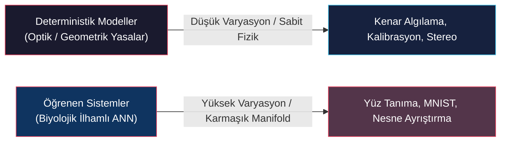
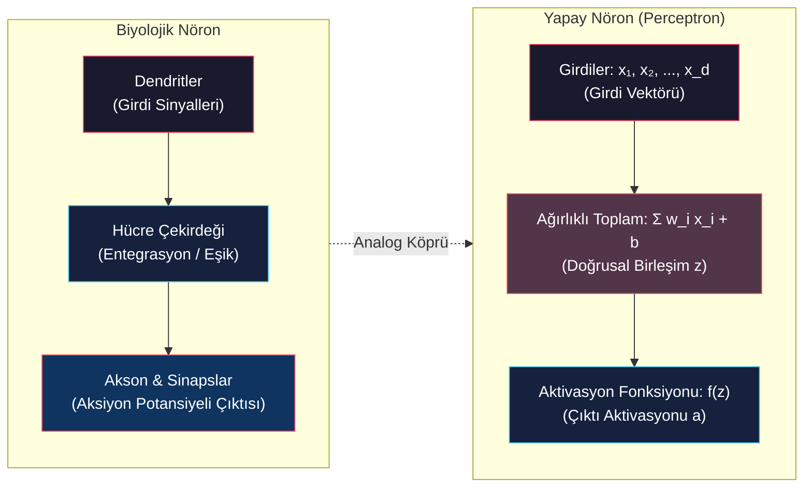
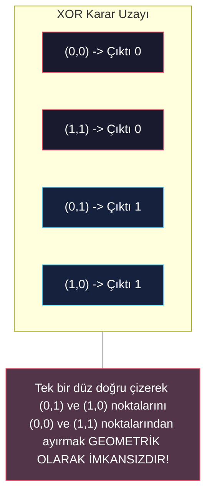

# Yapay Sinir Ağlarının Temelleri: Perceptron ve Aktivasyon Fonksiyonları (Perceptron Foundations & Activation Functions)

<!-- toc -->

Bu ders notu, bilgisayarlı görü ve yapay zeka çalışmalarının en temel yapı taşlarından biri olan Yapay Sinir Ağları (Neural Networks) konusunun ilk evresini; biyolojik esinlenmelerden başlayarak Frank Rosenblatt'ın Perceptron modeline, doğrusal ayrılabilirlik sınırlarına, NAND kapısı üzerinden evrensel hesaplama ispatına ve doğrusal olmayan aktivasyon fonksiyonlarının geometrik gerekliliğine kadar en ince teknik ayrıntılarıyla ele almaktadır.

---

## 1. Genel Bakış ve Biyolojik Esinlenme (Overview & Biological Inspiration)

### 1.1 Geleneksel Yöntemler ve Görsel Eşleme Karmaşıklığı

Bilgisayarlı görüde daha önce ele aldığımız kenar algılama, kamera kalibrasyonu, stereo rekonstrüksiyon veya fotometrik stereo gibi konular, doğrudan fiziksel ve optik yasalara (birinci ilkelere) dayanan deterministik algoritmalarla çözülebilmektedir. Ancak, insan görsel sisteminin çok büyük bir kolaylıkla çözdüğü bazı görevler, geleneksel deterministik ve el yapımı özellik (hand-crafted features) yöntemleri için aşırı derecede karmaşıktır:

1. **El Yazısı Rakam Tanıma (MNIST):** Farklı insanların yazdığı aynı rakamlar (örneğin "5" veya "6") arasında inanılmaz derecede yüksek bir biçimsel varyasyon (çizgi kalınlığı, eğim, mürekkep yoğunluğu, orantı) mevcuttur. Sabit bir geometrik şablon veya doğrusal filtre setiyle tüm bu varyasyonları kapsamak imkansızdır.
2. **Genel Nesne Tanıma (Örn. Sandalye & İnsan Yüzü):** Sahnede yer alan tüm sandalyeler "oturma" fonksiyonuna hizmet etse de ofis sandalyesi, yemek sandalyesi veya sallanan sandalye gibi formlar tamamen farklı 3B geometrilere ve 2B piksel desenlerine sahiptir. Benzer şekilde insan yüzleri de yaş, cinsiyet, etnik köken, ışık ve açı varyasyonları nedeniyle deterministik kurallarla sınıflandırılamaz.

<figure style="display:flex; justify-content: center; margin: 20px 0;">
  

    
    <figcaption style="margin-top: 0.5em; text-align: center; font-size: 13px; color: #888;"><em>Şekil 1: Yüksek Görsel Varyasyon: Farklı yaş, cinsiyet, açı ve aydınlatma altındaki yüzler; klasik deterministik şablonların ve basit doğrusal uzayların (SVM, PCA vb.) ötesinde öğrenen sistemleri zorunlu kılar.</em></figcaption>
  

</figure>

---

### 1.2 Biyolojik Nöron Yapısı ve Beyin Mimarisi

İnsan beyni, bu son derece karmaşık görsel haritalama problemlerini (visual mapping) saniyeler içinde zahmetsizce çözer. Beynin bu muazzam başarısı, her biri tek başına son derece basit matematiksel ve elektriksel hesaplamalar yapan milyarlarca biyolojik nöronun bir araya gelerek oluşturduğu devasa büyüklükteki birleşik ağ yapısına dayanmaktadır:

- **İnsan Beyni:** Yaklaşık $1.5\text{ kg}$ ($3.3\text{ lbs}$) ağırlığında ve $1260\text{ cm}^3$ hacmindedir.
- **Hesaplama Kapasitesi:** Yaklaşık **100 Milyar ($10^{11}$)** nöron ve **100 Trilyon ($10^{14}$)** sinaptik bağlantı barındırır.

<figure style="display:flex; justify-content: center; margin: 20px 0;">
  

    
    <figcaption style="margin-top: 0.5em; text-align: center; font-size: 13px; color: #888;"><em>Şekil 2: Biyolojik Hesaplama Gücü: İnsan beyni ve 100 milyar nöron ile 100 trilyon sinaptik bağlantı içeren karmaşık sinir ağı yapısı.</em></figcaption>
  

</figure>

Biyolojik bir nöronun temel anatomik bileşenleri şunlardır:

1. **Dendritler (Dendrites & Dendritic Branches):** Diğer nöronlardan gelen elektrokimyasal sinyalleri toplayan giriş kollarıdır.
2. **Hücre Gövdesi ve Çekirdek (Soma / Nucleus):** Gelen tüm sinyalleri biriktirir ve elektrokimyasal potansiyeli hesaplar.
3. **Akson (Axon):** Hücre içi potansiyel belirli bir eşiği aştığında oluşan aksiyon potansiyelini (elektriksel darbeyi) ileten uzun iletim hattıdır.
4. **Sinapslar (Synaptic Terminals):** Akson ucundan diğer nöronların dendritlerine sinyali kimyasal taşıyıcılarla (nörotransmitter) aktaran temas noktalarıdır. Sinapsların iletkenliği, bağlantının "gücünü" (ağırlığını) belirler.

<figure style="display:flex; justify-content: center; margin: 20px 0;">
  

    
    <figcaption style="margin-top: 0.5em; text-align: center; font-size: 13px; color: #888;"><em>Şekil 3: Biyolojik Nöron Anatomisi: Dendritler (girdi), Hücre Çekirdeği (toplama/entegrasyon), Akson (iletim hattı) ve Sinaptik Uçlar (çıktı bağlantıları).</em></figcaption>
  

</figure>

---

## 2. Perceptron (Tek Katmanlı Alıcı)

Yapay sinir ağlarının en temel, en eski ve en sade hesaplama birimi **Perceptron**'dur. İlk kez **Frank Rosenblatt (1958)** tarafından Cornell Aeronautical Laboratory'de geliştirilen bu model, biyolojik bir nöronun karar verme mekanizmasını matematiksel olarak taklit eden ilk öğrenen sınıflandırıcıdır.

---

### 2.1 Matematiksel Model

Bir perceptron, dış dünyadan veya önceki katmanlardan gelen $d$ adet bağımsız $x_1, x_2, \dots, x_d$ girdisini kabul eder. Bu girdilerin her birini, o girdinin karar üzerindeki önem derecesini (önceliğini) temsil eden $w_1, w_2, \dots, w_d$ ağırlık katsayıları (**weights**) ile çarpar. Ardından sisteme esneklik kazandıran tek bir $b$ sapma (**bias**) veya eşik değeri (**threshold**) terimini ekler.

<figure style="display:flex; justify-content: center; margin: 20px 0;">
  

    
    <figcaption style="margin-top: 0.5em; text-align: center; font-size: 13px; color: #888;"><em>Şekil 4: Perceptron Hesaplama Modeli: Girdilerin ağırlıklı toplamı ve bias teriminin basamak (step) fonksiyonundan geçirilmesi.</em></figcaption>
  

</figure>

Matematiksel olarak bu içsel ağ birleşimi $z$ şu vektörel iç çarpımla ifade edilir:

$$z = \sum_{j=1}^d w_j x_j + b = \mathbf{w}^T \mathbf{x} + b$$

Burada:
- $\mathbf{w} = [w_1, w_2, \dots, w_d]^T$ : Ağırlık vektörüdür.
- $\mathbf{x} = [x_1, x_2, \dots, x_d]^T$ : Girdi vektörüdür.
- $b$ : Sapma (bias) katsayısıdır (eşik değeri $-\text{threshold}$ olarak da yorumlanır).

Perceptron'un üreteceği nihai çıktı $a$ (aktivasyon), bu hesaplanan $z$ skaler değerinin sert bir **Heaviside (Basamak / Step)** fonksiyonundan geçirilmesiyle elde edilir:

$$a = f(z) = \begin{cases} 1, & \text{eğer } z > 0 \quad (\mathbf{w}^T \mathbf{x} + b > 0) \\ 0, & \text{eğer } z \leq 0 \quad (\mathbf{w}^T \mathbf{x} + b \leq 0) \end{cases}$$

<figure style="display:flex; justify-content: center; margin: 20px 0;">
  

    
    <figcaption style="margin-top: 0.5em; text-align: center; font-size: 13px; color: #888;"><em>Şekil 5: Step (Heaviside) Aktivasyon Fonksiyonu: $z \leq 0$ için çıktı $0$, $z > 0$ için çıktı $1$'dir.</em></figcaption>
  

</figure>

---

### 2.2 Karar Önceliklendirme Senaryosu (Movie Decision Example)

Perceptron'un insan karar mekanizmasını ve ağırlıklandırılmış öncelikleri nasıl modellediğini somutlaştırmak için *"Sinemaya gidecek miyim?"* karar senaryosunu inceleyelim:

Bu karar üç ikili (binary) değişkene bağlı olsun:
- $x_1 = 1$ (Hava güzel), $x_1 = 0$ (Hava kötü)
- $x_2 = 1$ (Arkadaş var), $x_2 = 0$ (Yalnızım)
- $x_3 = 1$ (Sinema yakın), $x_3 = 0$ (Sinema uzak)

<figure style="display:flex; justify-content: center; margin: 20px 0;">
  

    
    <figcaption style="margin-top: 0.5em; text-align: center; font-size: 13px; color: #888;"><em>Şekil 6: Perceptron ile Öncelikli Karar Modellemesi: Hava durumunun en baskın faktör olduğu senaryoda $w_1 = 4, w_2 = 2, w_3 = 2$ ve $b = -5$.</em></figcaption>
  

</figure>

Hava durumu sizin için vazgeçilmez bir önkoşul ise, $w_1$ ağırlığını diğerlerinden çok daha büyük seçersiniz:

- **Parametreler:** $w_1 = 4$ (Hava), $w_2 = 2$ (Arkadaş), $w_3 = 2$ (Yakınlık), $b = -5$.

**Senaryo Analizi:**
1. **Hava Kötü ($x_1 = 0$), diğer şartlar mükemmel ($x_2 = 1, x_3 = 1$):**
   $$z = (4 \cdot 0) + (2 \cdot 1) + (2 \cdot 1) - 5 = 4 - 5 = -1$$
   $z \leq 0 \implies a = 0$ (Sinemaya gidilmez). Arkadaş ve yakınlık olumlu olsa dahi kötü hava tek başına kararı engellemiştir.
2. **Hava Güzel ($x_1 = 1$), arkadaş var ($x_2 = 1$), sinema uzak ($x_3 = 0$):**
   $$z = (4 \cdot 1) + (2 \cdot 1) + (2 \cdot 0) - 5 = 6 - 5 = +1$$
   $z > 0 \implies a = 1$ (Sinemaya gidilir).

---

### 2.3 Doğrusal Sınıflandırıcı Olarak Karar Sınırı Geometrisi

İki boyutlu girdi uzayında ($x_1, x_2$) çalışan, ağırlıkları $w_1 = -2, w_2 = -2$ ve sapması $b = 3$ olan bir perceptron modelini ele alalım.

İçsel birleşim denklemi:
$$z = -2x_1 - 2x_2 + 3$$

Girdi uzayında $z = 0$ eşitliğini sağlayan doğru, modelin **Karar Sınırıdır (Decision Boundary)**:

$$-2x_1 - 2x_2 + 3 = 0 \implies x_2 = -x_1 + 1.5$$

<figure style="display:flex; justify-content: center; margin: 20px 0;">
  

    
    <figcaption style="margin-top: 0.5em; text-align: center; font-size: 13px; color: #888;"><em>Şekil 7: 2B Girdi Uzayında Karar Sınırı: $-2x_1 - 2x_2 + 3 = 0$ doğrusu uzayı iki yarı düzleme böler ($z > 0 \implies a=1$, $z \leq 0 \implies a=0$).</em></figcaption>
  

</figure>

- Eğer girdi noktası $(x_1, x_2)$ doğrunun sol-alt tarafında kalıyorsa, $z > 0$ olur ve çıktı $a = 1$ üretilir.
- Nokta doğrunun sağ-üst tarafında veya üzerinde kalıyorsa, $z \leq 0$ olur ve çıktı $a = 0$ üretilir.

> **Doğrusal Ayrılabilirlik Tanımı:** Tek bir perceptron, $d$-boyutlu girdi uzayını $(d-1)$-boyutlu düz bir hiperdüzlemle ($\mathbf{w}^T \mathbf{x} + b = 0$) ikiye ayıran kesin bir **Doğrusal Sınıflandırıcıdır (Linear Classifier)**.

---

### 2.4 Minsky ve Papert (1969) XOR Problemi İspatı ve AI Winter

Tek bir perceptron AND, OR ve NAND gibi doğrusal ayrılabilir mantıksal fonksiyonları kolaylıkla öğrenebilirken, **XOR (Ayrıcalıklı VEYA / Exclusive-OR)** fonksiyonunu tek bir doğru ile sınıflandıramaz.

| $x_1$ | $x_2$ | $x_1 \text{ XOR } x_2$ |
| :---: | :---: | :---: |
| 0 | 0 | **0** |
| 0 | 1 | **1** |
| 1 | 0 | **1** |
| 1 | 1 | **0** |

**Analitik İspat:**
Perceptron'un XOR tablosunu doğru sınıflandırması için şu 4 eşitsizliği aynı anda sağlaması gerekir:
1. $(0,0) \implies b \leq 0$
2. $(0,1) \implies w_2 + b > 0$
3. $(1,0) \implies w_1 + b > 0$
4. $(1,1) \implies w_1 + w_2 + b \leq 0$

(2) ve (3) numaralı eşitsizlikleri toplarsak:
$$w_1 + w_2 + 2b > 0 \implies (w_1 + w_2 + b) + b > 0$$

(1)'den $b \leq 0$ olduğunu biliyoruz. O halde $w_1 + w_2 + b > -b \geq 0$ olmalıdır, yani $w_1 + w_2 + b > 0$ çıkar. Ancak bu durum doğrudan (4) numaralı şartla ($w_1 + w_2 + b \leq 0$) çelişir!

> **Tarihsel Etki (AI Winter):** Marvin Minsky ve Seymour Papert'in 1969'da yayımladıkları *"Perceptrons"* kitabı, tek katmanlı perceptron'ların basit bir XOR problemini bile çözemeyeceğini matematiksel olarak kanıtladı. Çok katmanlı ağların nasıl eğitileceği o tarihte bilinmediği için bu ispat, yapay zeka fonlarının neredeyse tamamen kesildiği ilk **Yapay Zeka Kışı (AI Winter)** dönemini başlattı.

---

## 3. Perceptron Ağları ve Evrensel Hesaplama (Perceptron Networks & Universality)

Doğrusal olarak ayrılamayan karmaşık karar bölgelerini izole etmek için birden çok perceptron ardışık ve paralel katmanlar halinde birbirine bağlanır.

---

### 3.1 Karmaşık ve Kapalı Karar Bölgelerinin İnşası

İki boyutlu uzayda rastgele çokgen (poligonal) kapalı bir bölge içindeki noktaları izole etmek istediğimizi varsayalım:

1. **İlk Katman (Kenar Sınırları):** Bölgeyi çevreleyen her bir doğru parçası için bir perceptron atanır (örneğin 4 kenarlı bir poligon için 4 perceptron). Her perceptron kendi sınır çizgisinin doğru tarafında $1$, yanlış tarafında $0$ üretir.
2. **Çıkış Katmanı (Mantıksal Karar / Kesişim):** İlk katmandaki 4 nöronun çıktısı, çıkış nöronuna $w = [2, 2, 2, 2]^T$ ve $b = -7$ parametreleriyle bağlanır.

<figure style="display:flex; justify-content: center; margin: 20px 0;">
  

    
    <figcaption style="margin-top: 0.5em; text-align: center; font-size: 13px; color: #888;"><em>Şekil 8: Çok Katmanlı Perceptron Karar Bölgesi: 4 adet doğrusal sınırın kesişimiyle kapalı bir konveks poligon oluşturulması.</em></figcaption>
  

</figure>

- Eğer girdilerden herhangi biri $0$ olursa, maksimum toplam $2 \times 3 = 6$ olur; $z = 6 - 7 = -1 \leq 0 \implies a = 0$.
- Yalnızca ve yalnızca 4 nöronun tamamı $1$ olduğunda (nokta poligonun tam içinde kaldığında) toplam $8$ olur; $z = 8 - 7 = +1 > 0 \implies a = 1$.

---

### 3.2 Perceptron'un NAND Kapısı Olarak İspatı ve Evrensellik

Ağırlıkları $w_1 = -2, w_2 = -2$ ve sapması $b = 3$ olan 2-girdili perceptron modelini inceleyelim:

| $x_1$ | $x_2$ | $z = -2x_1 - 2x_2 + 3$ | Çıktı $a = f(z)$ | Mantıksal Eşdeğer |
| :---: | :---: | :---: | :---: | :---: |
| 0 | 0 | $-2(0) - 2(0) + 3 = +3 > 0$ | **1** | $\text{NAND}(0,0) = 1$ |
| 0 | 1 | $-2(0) - 2(1) + 3 = +1 > 0$ | **1** | $\text{NAND}(0,1) = 1$ |
| 1 | 0 | $-2(1) - 2(0) + 3 = +1 > 0$ | **1** | $\text{NAND}(1,0) = 1$ |
| 1 | 1 | $-2(1) - 2(1) + 3 = -1 \leq 0$ | **0** | $\text{NAND}(1,1) = 0$ |

<figure style="display:flex; justify-content: center; margin: 20px 0;">
  

    
    <figcaption style="margin-top: 0.5em; text-align: center; font-size: 13px; color: #888;"><em>Şekil 9: Perceptron ve NAND Kapısı Eşdeğerliği: Doğruluk tablosu ve devre sembolü.</em></figcaption>
  

</figure>

#### Evrensel Hesaplama İspatı (Universality of Computation)
Dijital mantık teorisinde **NAND** kapısı evrensel bir kapıdır (**Universal Logic Gate**). Yalnızca belirli sayıda NAND kapısı birbirine bağlanarak NOT, AND, OR, NOR ve XOR kapılarının tamamı kurulabilir.

<figure style="display:flex; justify-content: center; margin: 20px 0;">
  

    
    <figcaption style="margin-top: 0.5em; text-align: center; font-size: 13px; color: #888;"><em>Şekil 10: NAND Tabanlı Mantık Devreleri: NOT, AND, OR ve NOR kapılarının sadece NAND kapıları kullanılarak inşası.</em></figcaption>
  

</figure>

Tek bir perceptron bir NAND kapısını kusursuz taklit edebildiğine göre:
1. Dünyadaki tüm dijital devreler, aritmetik mantık birimleri (ALU) ve modern işlemciler perceptron ağları ile birebir kurulabilir.
2. Örneğin, iki adet 1-bitlik sayıyı toplayıp **Toplam ($\text{Sum} = x_1 \oplus x_2$)** ve **Elde ($\text{Carry} = x_1 x_2$)** bitlerini üreten 1-Bit Toplayıcı (Half Adder) devresi, eşdeğer bir perceptron ağıyla kurulabilmektedir.

<figure style="display:flex; justify-content: center; margin: 20px 0;">
  

    
    <figcaption style="margin-top: 0.5em; text-align: center; font-size: 13px; color: #888;"><em>Şekil 11: Dijital Devre ve Eşdeğer Perceptron Ağı: 1-Bit Toplayıcı devresinin (Sum & Carry) perceptron ağı olarak eşdeğer gösterimi.</em></figcaption>
  

</figure>

---

### 3.3 Çok Katmanlı Ağ Mimarisine Geçiş

Perceptron ağları teorik olarak evrensel hesaplama yeteneğine sahip olsa da, bu hesaplamaların pratik bilgisayarlı görü ve derin öğrenme modellerinde uygulanabilmesi için yapılandırılmış katman gösterimlerine ihtiyaç duyulur.

<figure style="display:flex; justify-content: center; margin: 20px 0;">
  

    
    <figcaption style="margin-top: 0.5em; text-align: center; font-size: 13px; color: #888;"><em>Şekil 12: Çok Katmanlı Ağ Mimarisi: Girdi Katmanı (Layer 1), Gizli Katmanlar (Layer 2 & 3) ve Çıktı Katmanı (Layer 4). İlgili katmandaki $j$. nöronun parametreleri $w_{jk}^{(l)}$ ve $b_j^{(l)}$ ile ifade edilir.</em></figcaption>
  

</figure>

---

## 4. Aktivasyon Fonksiyonları (Activation Functions)

Perceptron ağlarının teorik gücüne rağmen, bu ağların gerçek dünya verileriyle (örneğin MNIST görüntüleri) **kendi kendine eğitilmesi (training)** basamak fonksiyonunun doğası gereği imkansızdır.

---

### 4.1 Heaviside (Step) Fonksiyonunun Sınırlamaları ve Eğitim Krizi

Sinir ağlarını eğitirken temel amaç, ağın parametrelerinde ($w$ ve $b$) yapılacak küçük bir $\Delta w$ değişiminin ağ çıktısında oluşturduğu $\Delta a$ değişimini ölçmektir:

$$\Delta a \approx \frac{\partial a}{\partial w} \Delta w$$

Ancak basamak fonksiyonu içeren klasik perceptron'da bu türevsel geri bildirim çöker:

1. **Sıfır Değişim / Kör Bölge ($\Delta a = 0$):** $z \leq 0$ bölgesindeki bir nöronun ağırlığı küçük bir $\Delta w$ kadar değiştirildiğinde, yeni değer $z + \Delta z \leq 0$ kaldığı sürece çıktı $0 \to 0$ kalır ($\Delta a = 0$). Türev sıfır olduğu için parametrenin doğru yönde değişip değişmediğini anlayacak hiçbir gradyan bilgisi üretilemez.
2. **Sonsuz Kararsızlık / Ani Sıçrama:** Tam eşik noktasında milimetrik bir değişim yapıldığında çıktı aniden $0 \to 1$ sıçraması yapar. Bu kontrolsüz ani sıçrama, kademeli ve kararlı optimizasyonu (gradyan inişini) imkansız kılar.

<figure style="display:flex; justify-content: center; margin: 20px 0;">
  

    
    <figcaption style="margin-top: 0.5em; text-align: center; font-size: 13px; color: #888;"><em>Şekil 13: Step Fonksiyonunun Sınırlaması: Parametre değişimi $\Delta w$ net girdiyi $\Delta z$ kadar kaydırsa bile çıktıda hiçbir değişim oluşmaz ($\Delta a = 0$), türevsel geri bildirim sıfırlanır.</em></figcaption>
  

</figure>

---

### 4.2 Sigmoid Nöronu (Sigmoid Neuron)

Bu eğitim krizini aşmak için basamak fonksiyonu yerine pürüzsüz, sürekli ve her noktada türevlenebilir **Sigmoid Aktivasyon Fonksiyonu** ($\sigma$) getirilmiştir.

Matematiksel Tanımı:
$$\sigma(z) = \frac{1}{1 + e^{-z}}$$

<figure style="display:flex; justify-content: center; margin: 20px 0;">
  

    
    <figcaption style="margin-top: 0.5em; text-align: center; font-size: 13px; color: #888;"><em>Şekil 14: Sigmoid Nöronu: Ağırlık ve sapmalardaki küçük değişimlerin çıktıda oluşturduğu sürekli ve ölçülebilir pürüzsüz $\Delta a$ tepkileri.</em></figcaption>
  

</figure>

**Sigmoid Fonksiyonunun Temel Özellikleri:**
1. **Sürekli Çıktı Aralığı:** $a \in (0, 1)$ aralığında gerçel değerler üretir (örneğin $0.12, 0.41, 0.95$). Olasılıksal yorumlama için idealdir.
2. **Sürekli Türevlenebilirlik (Differentiability):** Ağırlıklardaki küçük bir değişim, çıktıda anlık olarak doğrusal yaklaşıklıkla ölçülebilen küçük bir $\Delta a$ değişimi yaratır:
   $$\Delta a \approx \sum_j \frac{\partial \sigma}{\partial w_j} \Delta w_j + \frac{\partial \sigma}{\partial b} \Delta b$$

**Sigmoid Türevinin Analitik Çıkarımı:**
$$\sigma'(z) = \frac{d}{dz}\left[(1 + e^{-z})^{-1}\right] = -(1 + e^{-z})^{-2} \cdot (-e^{-z}) = \frac{e^{-z}}{(1 + e^{-z})^2}$$
$$\sigma'(z) = \frac{1}{1 + e^{-z}} \cdot \frac{e^{-z}}{1 + e^{-z}} = \sigma(z) \cdot (1 - \sigma(z))$$

Bu zarif türev bağıntısı ($\sigma'(z) = \sigma(z)(1 - \sigma(z))$), geriye yayılım algoritmasında donanımsal hesaplama yükünü inanılmaz derecede azaltır.

---

### 4.3 Neden Doğrusal Olmayan (Non-Linear) Aktivasyon Zorunludur?

Aktivasyon fonksiyonunun sadece sürekli olması yetmez; **kesinlikle doğrusal olmayan (non-linear)** bir yapıda olması şarttır.

**Matematiksel İspat (Doğrusal Katmanlar Zincirinin Çöküşü):**
Farz edelim ki aktivasyon fonksiyonumuz doğrusal olsun: $f(z) = c \cdot z$. Basitlik için $c=1$ alalım ($f(z) = z$).

$L$ katmanlı bir ağda:
- 1. Katman: $\mathbf{a}^{(1)} = \mathbf{W}^{(1)} \mathbf{x} + \mathbf{b}^{(1)}$
- 2. Katman: $\mathbf{a}^{(2)} = \mathbf{W}^{(2)} \mathbf{a}^{(1)} + \mathbf{b}^{(2)} = \mathbf{W}^{(2)}(\mathbf{W}^{(1)} \mathbf{x} + \mathbf{b}^{(1)}) + \mathbf{b}^{(2)} = (\mathbf{W}^{(2)}\mathbf{W}^{(1)})\mathbf{x} + (\mathbf{W}^{(2)}\mathbf{b}^{(1)} + \mathbf{b}^{(2)})$
- Yeni matrisler tanımlayalım: $\mathbf{W}' = \mathbf{W}^{(2)}\mathbf{W}^{(1)}$ ve $\mathbf{b}' = \mathbf{W}^{(2)}\mathbf{b}^{(1)} + \mathbf{b}^{(2)}$.
- O halde: $\mathbf{a}^{(2)} = \mathbf{W}' \mathbf{x} + \mathbf{b}'$

> **Çıkarım:** Arada 1000 adet gizli katman dahi olsa, doğrusal aktivasyon kullanıldığında tüm o katmanlar matris çarpımının birleşme özelliği nedeniyle **tek bir doğrusal katmana indirgenir**. Ağ, tek bir perceptron'un çözemediği XOR problemini bile çözemez hale gelir. Doğrusal olmayan aktivasyonlar, ağın karmaşık manifoldları bükebilmesini ve evrensel fonksiyon yaklaşıklayıcısı (Universal Approximation Theorem) olmasını sağlar.

---

### 4.4 Popüler Aktivasyon Fonksiyonlarının Karşılaştırmalı Analizi

Modern derin öğrenmede sigmoid'in yanı sıra kullanılan temel aktivasyon fonksiyonları:

```mermaid
flowchart LR
    Step["Step (Heaviside)\nBinary {0,1}\nTürev = 0"]
    Sigmoid["Sigmoid σ(z)\nAralık (0,1)\nVanishing Gradient"]
    Tanh["Tanh(z)\nAralık (-1,1)\nSıfır Merkezli"]
    ReLU["ReLU: max(0,z)\nAralık [0, ∞)\nHızlı / Gradyan Kaybolmaz"]
    LeakyReLU["Leaky ReLU\nAralık (-∞, ∞)\nÖlü Nöron Önleyici"]

    Step -->|"Pürüzsüzleştirme"| Sigmoid
    Sigmoid -->|"Sıfır Merkezleme"| Tanh
    Tanh -->|"Derin Ağ Çözümü"| ReLU
    ReLU -->|"Negatif Eğim Desteği"| LeakyReLU

    style Step fill:#1a1a2e,stroke:#e94560,color:#fff
    style Sigmoid fill:#16213e,stroke:#4cc9f0,color:#fff
    style Tanh fill:#0f3460,stroke:#e94560,color:#fff
    style ReLU fill:#53354a,stroke:#e94560,color:#fff
    style LeakyReLU fill:#16213e,stroke:#4cc9f0,color:#fff
```

#### 1. Hiperbolik Tanjant (Tanh)
- **Formül:** $\tanh(z) = \frac{e^z - e^{-z}}{e^z + e^{-z}} = 2\sigma(2z) - 1$
- **Çıktı Aralığı:** $(-1, 1)$
- **Türevi:** $\tanh'(z) = 1 - \tanh^2(z)$
- **Avantajı:** Çıktıları **sıfır merkezlidir (zero-centered)**. Bu sayede gradyan güncellemelerinde zikzak hareketler azalır ve optimizasyon hızlanır.
- **Dezavantajı:** Uç noktalarda ($|z| > 3$) türev sıfıra yaklaştığından gradyan kaybolması (**Vanishing Gradient**) yaşar.

#### 2. ReLU (Rectified Linear Unit)
- **Formül:** $f(z) = \max(0, z)$
- **Çıktı Aralığı:** $[0, \infty)$
- **Türevi:** $f'(z) = \begin{cases} 1, & z > 0 \\ 0, & z < 0 \end{cases}$ ($z=0$ noktasında subgradient $0$ veya $1$ seçilir).
- **Avantajı:** Pozitif bölgede türevi her zaman $1$'dir; doygunluğa (saturation) uğramaz ve gradyan kaybolması sorununu çözer. Üstel işlem içermediği için aşırı hızlı hesaplanır.
- **Dezavantajı (Dying ReLU):** $z < 0$ bölgesine düşen nöronların gradyanı sıfırlanır ve bu nöronlar bir daha asla güncellenemeyerek "ölebilir".

#### 3. Leaky ReLU
- **Formül:** $f(z) = \max(\alpha z, z) \quad (0 < \alpha \ll 1, \text{genellikle } \alpha = 0.01)$
- **Çıktı Aralığı:** $(-\infty, \infty)$
- **Türevi:** $f'(z) = \begin{cases} 1, & z > 0 \\ \alpha, & z < 0 \end{cases}$
- **Avantajı:** Negatif bölgede küçük bir $\alpha$ eğimi bırakarak nöronların tamamen ölmesini engeller.

---

## 5. Özet Teknik Karşılaştırma Matrisi

| Aktivasyon Fonksiyonu | Matematiksel Formülü | Çıktı Aralığı (Range) | Türevi $f'(z)$ | Temel Avantajı | Karşılaştığı Temel Kısıt |
| :--- | :--- | :---: | :--- | :--- | :--- |
| **Heaviside (Step)** | $f(z) = \begin{cases} 1, & z > 0 \\ 0, & z \leq 0 \end{cases}$ | $\{0, 1\}$ | $0 \quad (\forall z \neq 0)$ | Basit dijital kararlar ve evrensel NAND kapısı kurulumu | Türevinin her yerde sıfır olması nedeniyle gradyan tabanlı eğitim yapılamaması |
| **Sigmoid** | $\sigma(z) = \frac{1}{1 + e^{-z}}$ | $(0, 1)$ | $\sigma(z)(1 - \sigma(z))$ | Pürüzsüz, sürekli türevlenebilirlik ve olasılıksal yorumlama | Uç noktalarda türevin sıfırlanması (**Vanishing Gradient**) ve sıfır merkezli olmaması |
| **Tanh** | $f(z) = \frac{e^z - e^{-z}}{e^z + e^{-z}}$ | $(-1, 1)$ | $1 - f(z)^2$ | **Sıfır merkezli (zero-centered)** olması ve daha hızlı yakınsama | Uç değerlerde gradyan kaybolması (**Vanishing Gradient**) |
| **ReLU** | $f(z) = \max(0, z)$ | $[0, \infty)$ | $\begin{cases} 1, & z > 0 \\ 0, & z < 0 \end{cases}$ | Çok yüksek hesaplama hızı ve pozitif bölgede gradyan sönümlememesi | Negatif bölgede **Dying ReLU (Ölü Nöron)** problemi |
| **Leaky ReLU** | $f(z) = \max(\alpha z, z)$ | $(-\infty, \infty)$ | $\begin{cases} 1, & z > 0 \\ \alpha, & z < 0 \end{cases}$ | Negatif bölgede gradyan akışını koruyarak nöron ölümlerini engellemesi | $\alpha$ hiperparametresinin seçilme zorunluluğu |
