# Nesne Takibi ve Arka Plan Çıkarma Teknolojileri (Object Tracking & Background Subtraction)

<!-- toc -->

Bu ders notu, bilgisayarlı görünün en önemli dinamik analiz ve algılama motorlarından biri olan **Nesne Takibi (Object Tracking)** ve **Değişim Tespiti (Change Detection / Background Subtraction)** konularını; piksel düzeyindeki diferansiyel hareket analizlerinden başlayarak, istatistiksel ve olasılıksal **Gauss Karışım Modellerine (Gaussian Mixture Model - GMM)**, şablon ve histogram tabanlı yerel aramalardan, SIFT tabanlı **"Bag of Features"** nesne takip sistemlerine kadar tüm akademik, matematiksel ve algoritmik detaylarıyla Columbia Üniversitesi CAVE laboratuvarı (Prof. Shree K. Nayar) müfredatı doğrultusunda ele almaktadır.

---

## 1. Genel Bakış (Overview)

Bilgisayarlı görüde **Nesne Takibi (Object Tracking)**; zamansal olarak ardışık video kareleri ($I_1, I_2, \dots, I_T$) boyunca belirli bir hedef nesnenin veya ilgi bölgesinin (**Region of Interest - ROI**) uzamsal konumunu, geometrik sınırlarını, ölçeğini ve hareket yörüngesini kesintisiz, kararlı ve otomatik olarak izleme sürecidir.

<figure style="display:flex; justify-content: center; margin: 20px 0;">
  

    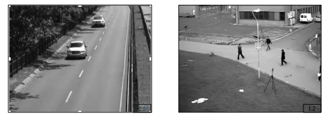
    <figcaption style="margin-top: 0.5em; text-align: center; font-size: 13px; color: #888;"><em>Şekil 1: Tipik nesne takibi ve dinamik algılama senaryoları (Sol: Otoyolda hızla akan araçların takibi; Sağ: Kavşakta yürüyen yayaların takibi).</em></figcaption>
  

</figure>

Daha önce incelediğimiz **Optik Akış (Optical Flow)** algoritması, görüntüdeki her bir tekil pikselin kareden kareye nereye gittiğini diferansiyel düzeyde (yoğun/seyrek hareket vektör alanı $\mathbf{u} = [u, v]^T$) çözmeye odaklanırken; nesne takibi, pikselleri tekil ve bağımsız olarak izlemek yerine **bütünsel bir nesne varlığını** (örneğin bir insanı, aracı, yüzü, hayvanı veya sporcuyu) semantik bir bütün olarak takip etmeyi amaçlar.

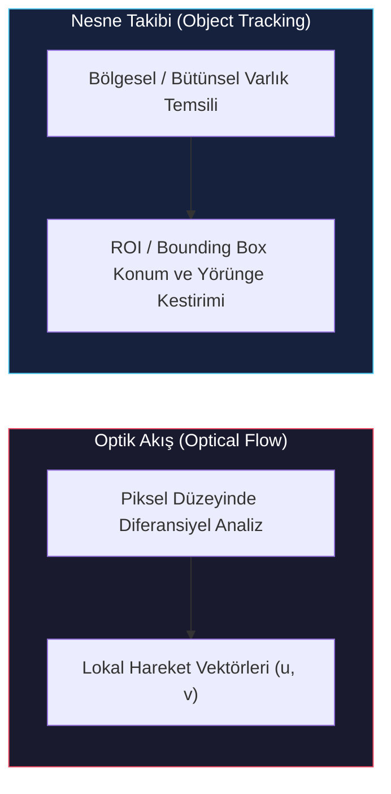

### 1.1 Nesne Takibinin Karşılaştığı Temel Zorluklar

Gerçek dünya ortamlarında video çeken kameralar ideal laboratuvar koşullarından oldukça uzaktır. Kararlı, hassas ve kesintisiz çalışan bir nesne takip algoritmasının şu temel fiziksel ve optik bozucu etkenlere karşı dayanıklı (**robust/resilient**) olması şarttır:

1. **Aydınlatma Değişimleri (Illumination Changes):** Güneşin aniden bulut arkasına girmesi, iç mekanlarda lambaların açılıp kapanması veya nesnenin ağaçların/binaların gölgesine girmesiyle hedef piksellerin parlaklık ve renk değerlerinin dramatik olarak değişmesi.
2. **Ölçek Değişimleri (Scale Changes):** Takip edilen nesnenin kameraya yaklaşması veya kameradan uzaklaşması durumunda görüntü düzlemindeki piksel alanının (çözünürlüğünün ve sınır kutusu boyutunun) sürekli büyümesi veya küçülmesi.
3. **Dönme ve Bakış Açısı Değişimleri (Rotation & Viewpoint Changes):** Nesnenin kendi ekseni etrafında 3B dönmesi (örneğin virajı dönen bir araba veya başını çeviren bir insan) nedeniyle kameraya yansıyan 2B izdüşüm dokusunun köklü biçimde farklılaşması.
4. **Kapanmalar (Occlusions):** Takip edilen nesnenin sahnedeki sabit (direk, ağaç, trafik levhası) veya hareketli (başka bir yaya veya araç) engellerin arkasından geçerek kısmi (**partial occlusion**) veya tamamen (**full occlusion**) gözden kaybolması.
5. **Kamera Titreşimi ve Dinamik Arka Plan:** Direğe monte edilmiş gözetleme kameralarının rüzgarda sallanması ya da sahnede rüzgardan dalgalanan ağaç yaprakları, akan nehir yüzeyi gibi dinamik arka plan hareketlerinin bulunması.

<figure style="display:flex; justify-content: center; margin: 20px 0;">
  

    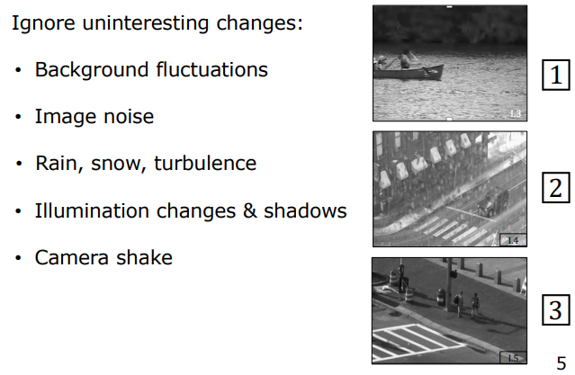
    <figcaption style="margin-top: 0.5em; text-align: center; font-size: 13px; color: #888;"><em>Şekil 2: Algoritmaların filtrelemesi gereken ilgisiz değişimler: 1) Su yüzeyi dalgalanmaları (Background fluctuations); 2) Şiddetli yağmur ve sensör gürültüsü (Rain, turbulence & noise); 3) Dinamik aydınlatma ve zemin gölgeleri (Illumination changes & shadows).</em></figcaption>
  

</figure>

### 1.2 Nesne Takibi Sürecinin İki Ana Aşaması

Modern ve modüler bir nesne takip sistemi genel olarak iki birbirini tamamlayan ana aşamadan meydana gelir:

1. **Değişim Tespiti (Change Detection / Background Subtraction):** Video akışında zamansal olarak hareket eden, durağan yapıdan sapan veya sahneye yeni giren piksellerin tespit edilerek statik arka plandan ayrıştırılması (**Ön Plan / Arka Plan Ayrımı**).
2. **Hareket Takibi ve Konumlandırma (Tracking & Localization):** İlk aşamada tespit edilen veya kullanıcı tarafından manuel seçilen hedef nesnenin, sonraki karelerde görünüm şablonu (**appearance template**), renk histogramı (**color histogram**) veya yerel öznitelik eşleştirmesi (**feature tracking**) algoritmalarıyla kesintisiz izlenmesi.

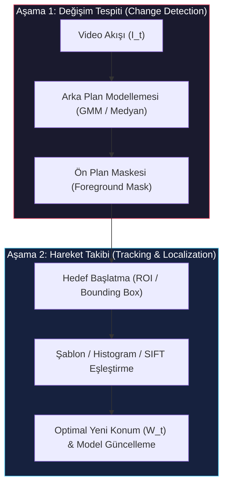

---

## 2. Değişim Tespiti (Change Detection)

Nesne takibine otonom olarak başlayabilmek için öncelikle durağan bir sahnede neyin hareket ettiğini, yani sahnedeki "anlamlı değişimin" nerede gerçekleştiğini matematiksel olarak belirlememiz gerekir.

### 2.1 Ön Plan - Arka Plan Sınıflandırma Problemi

Değişim tespiti, her bir piksel koordinatı $(x, y)$ için gerçek zamanlı olarak ikili bir karar verme problemidir:
- **Ön Plan (Foreground - FG):** Sahnedeki anlamlı hareketleri temsil eden nesneler (örneğin yürüyen insanlar, hareket eden arabalar).
- **Arka Plan (Background - BG):** Sahnenin durağan veya periyodik olarak tekrarlanan sabit fiziksel yapısı (yol, binalar, duvarlar, zemin).

Ancak bu sınıflandırma sürecinde algoritmanın **anlamlı değişimler** ile **anlamsız (ilgisiz) değişimleri** birbirinden hatasız ayırt etmesi gerekir:

* **Arka Plan Dalgalanmaları (Background Fluctuations):** Rüzgarda sallanan yapraklar, çimenler veya su yüzeyindeki ışık kırılmaları.
* **Sensör Gürültüsü (Sensor Noise):** Düşük ışıkta veya gece çekimlerinde piksel yoğunluklarında oluşan rastgele termal ve kuantum dalgalanmaları.
* **Hava Durumu Olayları (Weather Effects):** Piksel alanından hızla geçip kaybolan yağmur damlaları, kar taneleri veya sıcak hava serapları (turbulence).
* **Hareketli Gölgeler (Shadows):** Hareket eden nesnenin zemin üzerine düşürdüğü ve nesneyle birlikte hareket eden ancak geometrik olarak nesnenin parçası olmayan karanlık alanlar.
* **Kamera Sarsıntısı (Camera Shake):** Rüzgar veya mekanik titreşim nedeniyle tüm görüntü matrisinin birkaç piksel kayması.

### 2.2 Değişim Tespiti Yöntemleri ve Evrimsel Gelişimi

Değişim tespitinin bilgisayarlı görüdeki tarihsel gelişimi, basit piksel farklarından adaptif istatistiksel modellere doğru bir evrim izlemiştir.

#### 2.2.1 Kare Farkı Yöntemi (Frame Differencing)

En temel ve sezgisel yöntemdir. Mevcut video karesi ($I_t$) ile hemen bir önceki kare ($I_{t-1}$) arasındaki mutlak parlaklık farkı hesaplanır ve bu fark belirlenen bir eşik değerinden ($\tau$) büyükse o piksel ön plan ilan edilir:

$$F(x, y, t) = \begin{cases} 1 & \text{eğer } |I(x, y, t) - I(x, y, t-1)| > \tau \\ 0 & \text{aksi takdirde} \end{cases}$$

<figure style="display:flex; justify-content: center; margin: 20px 0;">
  

    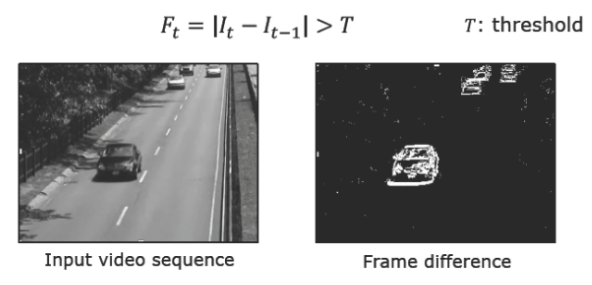
    <figcaption style="margin-top: 0.5em; text-align: center; font-size: 13px; color: #888;"><em>Şekil 3: Kare Farkı Yöntemi ($F_t = |I_t - I_{t-1}| > T$). Homojen renge sahip aracın iç kısımlarında kareler arası fark oluşmadığı için nesnenin içi boş (delikli/hollow) kalmakta, sadece dış hatları aydınlanmaktadır.</em></figcaption>
  

</figure>

> **Zayıf Yönleri (Kritik Delik / Hole Problemi):**
> 1. Rüzgarda sallanan en ufak bir yaprak veya sensör gürültüsü anında yapay bir "ön plan" olarak işaretlenir.
> 2. En büyük handikapı: Eğer hareket eden nesne (örneğin tek renkli gri bir otomobil) homojen bir iç yüzey rengine sahipse, nesne hareket etse bile iç piksellerin değeri kareden kareye değişmez ($|I_t - I_{t-1}| \approx 0$). Sonuç olarak nesnenin gövdesi boş kalır (iç delikler oluşur), sadece nesnenin ön ve arka kontrast kenarları tespit edilebilir. Bu da nesnenin bütünsel takibini imkânsız kılar.

#### 2.2.2 Ortalama Arka Plan Yöntemi (Average Background)

Kare farkının delik problemini çözmek için, durağan sahneyi temsil eden tek bir **Referans Arka Plan Resmi ($B$)** oluşturulur. Videonun ilk $K$ adet karesinin aritmetik ortalaması alınır:

$$B(x, y) = \frac{1}{K} \sum_{i=1}^K I(x, y, i)$$

Sonraki karelerdeki her piksel, bu sabit arka plan resmiyle karşılaştırılır:

$$F(x, y, t) = |I(x, y, t) - B(x, y)| > \tau$$

<figure style="display:flex; justify-content: center; margin: 20px 0;">
  

    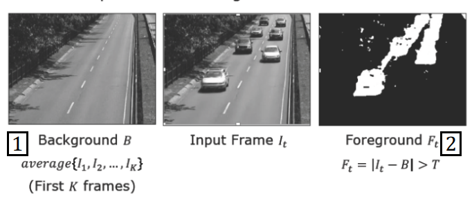
    <figcaption style="margin-top: 0.5em; text-align: center; font-size: 13px; color: #888;"><em>Şekil 4: Ortalama Arka Plan Yöntemi ($B = \text{average}\{I_1, \dots, I_K\}$). Sabit arka plan çıkarımı sayesinde hareketli nesnelerin içi dolu tespit edilir ancak aydınlatma değişimlerine ve arka plan dalgalanmalarına karşı duyarsızdır.</em></figcaption>
  

</figure>

> **Zayıf Yönleri:**
> 1. İlk $K$ kare esnasında arka plandan geçen tekil bir araba veya insan varsa, bu geçici nesne ortalama arka plan resmine "hayalet (ghost)" bir leke olarak kalıcı şekilde kazınır.
> 2. Model sabittir (statik); gün içinde güneşin açısının değişmesi veya bulutların hareketi gibi uzun vadeli aydınlatma değişimlerine uyum sağlayamaz; kısa sürede tüm sahneyi hatalı biçimde ön plan olarak sınıflandırmaya başlar.

#### 2.2.3 Medyan Arka Plan Yöntemi (Median Background)

Aritmetik ortalama yerine, ilk $K$ karedeki piksel değerlerinin istatistiksel medyanı (ortanca değeri) referans arka plan modeli olarak seçilir:

$$B(x, y) = \text{median}\{I(x, y, 1), I(x, y, 2), \dots, I(x, y, K)\}$$

<figure style="display:flex; justify-content: center; margin: 20px 0;">
  

    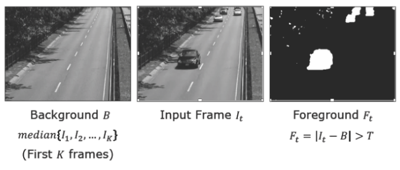
    <figcaption style="margin-top: 0.5em; text-align: center; font-size: 13px; color: #888;"><em>Şekil 5: Medyan Arka Plan Yöntemi ($B = \text{median}\{I_1, \dots, I_K\}$). Medyan fonksiyonu aykırı değerlere (outliers) karşı son derece dirençlidir ve arka plandan geçen tekil arabaları arka plan modeline karıştırmaz.</em></figcaption>
  

</figure>

> **Medyanın Gücü:** Medyan operatörü, istatistikte aykırı değerlere (**outliers**) karşı ortalamaya kıyasla çok daha dayanıklıdır. İlk $K$ kare içinde o pikselin üzerinden kısa süreliğine bir araba geçse bile, o anki parlaklık değeri dağılımın uç noktalarında kalacağından medyan değerini bozamaz; kusursuz temizlikte bir arka plan resmi elde edilir. Ancak model hala zamansal değişimlere kapalıdır.

#### 2.2.4 Adaptif Medyan Yöntemi (Adaptive / Moving Median)

Medyan modelini sabit tutmak yerine, modelin her yeni karede kayan bir zaman penceresi (**sliding history window**) üzerinden veya üstel bir öğrenme katsayısı ($\alpha$) ile dinamik olarak güncellenmesi sağlanır:

$$B_t(x, y) = \begin{cases} B_{t-1}(x, y) + 1 & \text{eğer } I(x, y, t) > B_{t-1}(x, y) \\ B_{t-1}(x, y) - 1 & \text{eğer } I(x, y, t) < B_{t-1}(x, y) \\ B_{t-1}(x, y) & \text{aksi takdirde} \end{cases}$$

Bu yöntem yavaş aydınlatma değişimlerini arka plana adapte etmede başarılı olsa da; çok modlu (multimodal) dağılımlarda (örneğin rüzgarda sallanan ağaç yapraklarında veya kar/yağmur yağışında) tek bir medyan değeri tuttuğu için yetersiz kalır.

---

## 3. Gauss Karışım Modeli (Gaussian Mixture Model - GMM)

Gerçek dünyada bir pikselin zaman içindeki parlaklık değişimi tek bir tepe noktasına sahip basit bir dağılım göstermez. Örneğin, rüzgarda sallanan bir ağaç dalının arkasındaki pikseli 1000 kare boyunca gözlemlediğimizde, o piksel bazı karelerde açık mavi gökyüzünü, bazı karelerde ise koyu yeşil yaprağı görecektir. Dolayısıyla o pikselin zaman içindeki parlaklık histogramında **iki farklı tepe noktası (bimodal dağılım)** meydana gelir.

### 3.1 Piksel Yoğunluk Dağılımı ve Çok Modlu (Multimodal) Doğası

Şiddetli kar yağışı altındaki bir caddeyi izleyen kamerayı ele alalım. Yoldaki bir piksel koordinatının zaman içindeki histogramı incelendiğinde çok modlu bir yapı ortaya çıkar:

<figure style="display:flex; justify-content: center; margin: 20px 0;">
  

    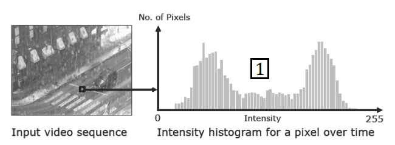
    <figcaption style="margin-top: 0.5em; text-align: center; font-size: 13px; color: #888;"><em>Şekil 6: Yağışlı bir sahnede seçilen tek bir pikselin zaman içindeki parlaklık histogramı. Pikselin hem koyu asfalt zemin hem de parlak kar taneleri görmesinden ötürü iki belirgin tepe (bimodal dağılım) oluşmaktadır.</em></figcaption>
  

</figure>

Bu histogram dikkatle analiz edildiğinde dağılımı oluşturan 3 temel fiziksel unsur ayırt edilir:

<figure style="display:flex; justify-content: center; margin: 20px 0;">
  

    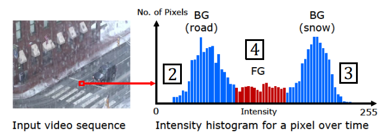
    <figcaption style="margin-top: 0.5em; text-align: center; font-size: 13px; color: #888;"><em>Şekil 7: Piksel histogramının fiziksel bileşenleri: 1) Koyu Mavi Tepe: Statik Arka Plan Asfalt (BG - Road); 2) Açık Mavi Tepe: Arka Plan Kar Yağışı (BG - Snow); 3) Kırmızı Düzlük: Piksel üzerinden nadiren geçen Ön Plan Araç (FG - Vehicle).</em></figcaption>
  

</figure>

1. **Statik Arka Plan (Yol/Asfalt):** Zamanın büyük çoğunluğunda görünen, dar varyanslı ve yüksek frekanslı ana tepe.
2. **Dinamik Arka Plan Dalgalanması (Kar Taneleri):** Sürekli tekrarlayan ancak daha geniş varyansa sahip ikinci arka plan tepesi.
3. **Ön Plan Nesneleri (Geçici Araçlar):** Piksel alanından çok nadiren ve çok kısa süreliğine geçen, bu nedenle histogramda çok düşük tepe yüksekliğine (küçük kanıt/weight) sahip geçici dağılım.

> **Kritik GMM Sezgisi (Intuition):** Ön plan nesneleri bir pikseli zamanın sadece çok küçük bir kesrinde işgal ederler. Arka plan ve gürültü bileşenleri ise zamanın ezici çoğunluğunda o piksel üzerinde baskındır.

### 3.2 Matematiksel GMM Formülasyonu (1B Durum)

GMM, bir pikselin parlaklık histogramını $K$ adet ($K = 3, 4, 5$) bağımsız Gauss (Normal) dağılımının ağırlıklı toplamı (**mixture**) olarak modeller.

<figure style="display:flex; justify-content: center; margin: 20px 0;">
  

    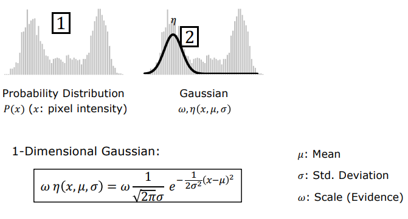
    <figcaption style="margin-top: 0.5em; text-align: center; font-size: 13px; color: #888;"><em>Şekil 8: 1 Boyutlu Gauss Dağılımı: $\omega \cdot \eta(x, \mu, \sigma)$; Ortalama ($\mu$), Standart Sapma ($\sigma$) ve Destekleyici Kanıt / Ağırlık ($\omega$).</em></figcaption>
  

</figure>

Gri seviye ($1\text{B}$) görüntülerde bir pikselin $x$ parlaklık değerine sahip olma olasılığı şu formülle ifade edilir:

$$P(x) = \sum_{k=1}^K \omega_k \cdot \eta(x \mid \mu_k, \sigma_k^2)$$

Burada:

$$\eta(x \mid \mu_k, \sigma_k^2) = \frac{1}{\sqrt{2\pi}\sigma_k} e^{-\frac{(x - \mu_k)^2}{2\sigma_k^2}}$$

* $\mu_k$ : $k$. Gauss bileşeninin ortalama parlaklık değeridir (tepe noktasının konumu).
* $\sigma_k$ : $k$. bileşenin standart sapmasıdır (tepenin genişliği / varyans).
* $\omega_k$ : Destekleyici Kanıt (Weight/Evidence) katsayısıdır. O tepe noktasının veri popülasyonunda ne kadar sık görüldüğünü temsil eder.

Tüm ağırlıkların toplamı bir olasılık dağılımı oluşturacak şekilde normalize edilmiştir:

$$\sum_{k=1}^K \omega_k = 1$$

<figure style="display:flex; justify-content: center; margin: 20px 0;">
  

    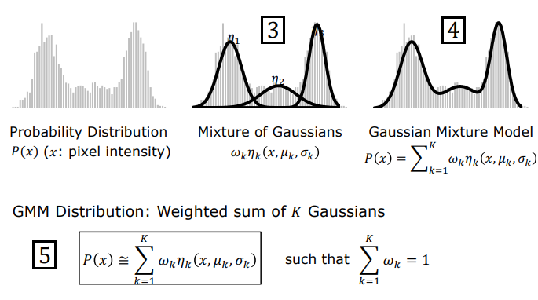
    <figcaption style="margin-top: 0.5em; text-align: center; font-size: 13px; color: #888;"><em>Şekil 9: $K$ adet Gauss bileşeninin ağırlıklı toplamı ($P(x) \approx \sum_{k=1}^K \omega_k \eta_k$). Farklı tepe noktaları birleşerek karmaşık ve çok modlu piksel dağılımını kusursuz şekilde modeller.</em></figcaption>
  

</figure>

### 3.3 Yüksek Boyutlu Renk Uzayında GMM (RGB & Kovaryans Matrisleri)

Gri seviye yerine 3 boyutlu RGB renk uzayında ($\mathbf{x} = [R, G, B]^T, d=3$) çalışıldığında çok değişkenli Gauss dağılımı kullanılır:

$$P(\mathbf{x}) = \sum_{k=1}^K \omega_k \cdot \frac{1}{(2\pi)^{d/2} |\Sigma_k|^{1/2}} e^{-\frac{1}{2}(\mathbf{x} - \boldsymbol{\mu}_k)^T \Sigma_k^{-1} (\mathbf{x} - \boldsymbol{\mu}_k)}$$

* $\boldsymbol{\mu}_k = [\mu_R, \mu_G, \mu_B]^T$ : $3 \times 1$ boyutlu ortalama renk vektörüdür.
* $\Sigma_k$ : $3 \times 3$ boyutlu Kovaryans Matrisidir.

Kovaryans matrisinin yapısı hesaplama karmaşıklığı ile modelleme gücü arasındaki dengeyi belirler:

| Kovaryans Modeli | Matris Yapısı | Geometrik Temsil | İşlem Hızı | Doğruluk |
| :--- | :--- | :--- | :--- | :--- |
| **Simetrik / Küre Modeli** | $\Sigma_k = \sigma_k^2 I$ | 3B uzayda tam küre | Çok Yüksek (Hızlı) | Temel |
| **Köşegen (Diagonal) Modeli** | $\Sigma_k = \text{diag}(\sigma_R^2, \sigma_G^2, \sigma_B^2)$ | Eksenlere paralel elipsoit | Yüksek | İyi |
| **Tam (Full) Kovaryans Modeli** | $\Sigma_k = \begin{bmatrix} \sigma_{RR} & \sigma_{RG} & \sigma_{RB} \\ \sigma_{GR} & \sigma_{GG} & \sigma_{GB} \\ \sigma_{BR} & \sigma_{BG} & \sigma_{BB} \end{bmatrix}$ | Yönü döndürülmüş 3B elipsoit | Düşük (Maliyetli) | En Yüksek |

### 3.4 Sınıflandırma Kuralı: Ön Plan vs. Arka Plan ($\omega / \sigma$ Oranı)

Hesaplanan $K$ adet Gauss bileşeninden hangilerinin **Arka Plan**, hangilerinin ise **Ön Plan (Anlamlı Değişim)** olduğunu belirlemek için şu rasyonel oran kullanılır:

$$\text{Bileşen Skoru} = \frac{\omega_k}{\sigma_k}$$

<figure style="display:flex; justify-content: center; margin: 20px 0;">
  

    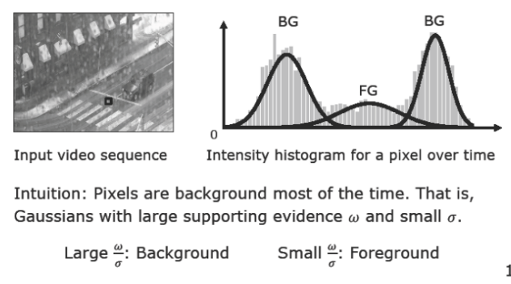
    <figcaption style="margin-top: 0.5em; text-align: center; font-size: 13px; color: #888;"><em>Şekil 10: GMM Sınıflandırma Sezgisi: Büyük $\frac{\omega}{\sigma}$ oranı $\rightarrow$ Kararlı Arka Plan (Background); Küçük $\frac{\omega}{\sigma}$ oranı $\rightarrow$ Geçici Ön Plan (Foreground).</em></figcaption>
  

</figure>

* **Arka Plan Bileşenleri (Yüksek $\omega_k / \sigma_k$):** Zamanın çoğunda o pikselde var oldukları için destekleyici kanıtları ($\omega_k$) çok yüksektir; kararlı ve durağan oldukları için varyansları ($\sigma_k$) küçüktür. Bu nedenle oranları en büyük olan ilk $B$ adet Gauss arka planı oluşturur.
* **Ön Plan Bileşenleri (Düşük $\omega_k / \sigma_k$):** Sahneden nadiren ve hızla geçtikleri için kanıtları ($\omega_k$) çok düşüktür; hareket kaynaklı bulanıklık nedeniyle varyansları ($\sigma_k$) geniştir. Oranları en küçük olan bileşenler ön planı temsil eder.

### 3.5 Çevrimiçi Uyarlamalı GMM Algoritması (Stauffer-Grimson)

Her karede pikseller için sıfırdan Expectation-Maximization (EM) ile GMM uydurmak imkânsız bir hesaplama maliyeti getireceğinden, **Stauffer ve Grimson (1999)** tarafından geliştirilen çevrimiçi (**online adaptive update**) algoritması uygulanır:

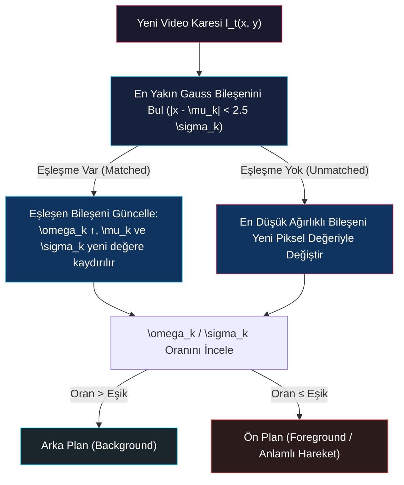

1. **Mahalanobis Eşleşme Kontrolü:** Yeni gelen piksel değeri $x_t$, mevcut $K$ Gauss bileşeninin ortalamalarıyla karşılaştırılır. Eğer piksel bir Gauss'un ortalamasından $2.5 \sigma_k$ uzaklık içindeyse eşleşme kabul edilir:
   $$|x_t - \mu_k| \le 2.5 \sigma_k$$
2. **Parametre Güncelleme:**
   - Eşleşen Gauss için ağırlık artırılır: $\omega_k \leftarrow (1-\alpha)\omega_k + \alpha$
   - Ortalama yeni değere doğru kaydırılır: $\mu_k \leftarrow (1-\rho)\mu_k + \rho x_t$
   - Varyans güncellenir: $\sigma_k^2 \leftarrow (1-\rho)\sigma_k^2 + \rho (x_t - \mu_k)^2$
   - Eşleşmeyen diğer bileşenlerin ağırlıkları sönümlenir: $\omega_j \leftarrow (1-\alpha)\omega_j$
3. **Eşleşme Bulunamaması Durumu:** Eğer piksel hiçbir Gauss bileşeniyle eşleşmezse, en düşük $\omega / \sigma$ oranına sahip en zayıf Gauss bileşeni silinir; yerine ortalaması $x_t$, varyansı yüksek ve ağırlığı küçük yeni bir Gauss bileşeni başlatılır.

### 3.6 GMM Başarımı ve Hareketli Medyan ile Karşılaştırma

<figure style="display:flex; justify-content: center; margin: 20px 0;">
  

    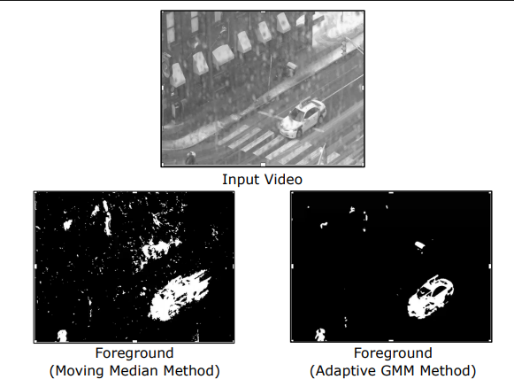
    <figcaption style="margin-top: 0.5em; text-align: center; font-size: 13px; color: #888;"><em>Şekil 11: Kar yağışı altındaki sahnede ön plan çıkarımı: Sol: Hareketli Medyan Yöntemi (Moving Median) kar tanelerini yanlışlıkla ön plan olarak algılayıp sahneyi gürültüye boğar; Sağ: Uyarlamalı GMM (Adaptive GMM) çoklu tepe modellemesiyle kar yağışını arka plana katar ve sadece gerçek hareketli aracı temiz bir şekilde tespit eder.</em></figcaption>
  

</figure>

---

## 4. Şablon Eşleştirme ile Nesne Takibi (Template Matching)

Değişim tespiti veya manuel seçim yardımıyla hedef nesnenin etrafına bir sınır kutusu (**bounding box / ROI**) yerleştirildikten sonra, bu nesneyi sonraki video karelerinde takip etmenin en doğrudan yolu **Şablon Eşleştirme (Template Matching)** yöntemidir.

<figure style="display:flex; justify-content: center; margin: 20px 0;">
  

    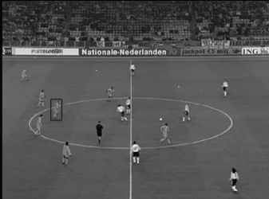
    <figcaption style="margin-top: 0.5em; text-align: center; font-size: 13px; color: #888;"><em>Şekil 12: Geniş açılı bir futbol maçında hedef oyuncu etrafına yerleştirilen sınır kutusu (ROI) ve şablon takibi.</em></figcaption>
  

</figure>

Şablon eşleştirme temelde iki farklı görsel temsil modeliyle gerçekleştirilir:

<figure style="display:flex; justify-content: center; margin: 20px 0;">
  

    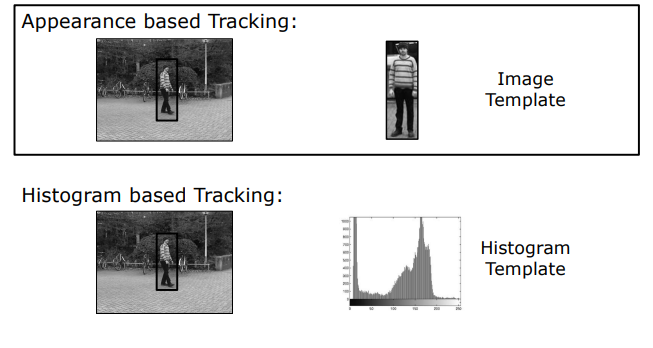
    <figcaption style="margin-top: 0.5em; text-align: center; font-size: 13px; color: #888;"><em>Şekil 13: İki Temel Şablon Temsili: Üst: Görünüm Tabanlı Şablon (Görüntü piksel matrisi); Alt: Histogram Tabanlı Şablon (Renk/yoğunluk olasılık dağılımı).</em></figcaption>
  

</figure>

### 4.1 Görünüm Tabanlı Takip (Appearance-Based Tracking)

* **Çalışma Prensibi:** İlk karede hedef nesnenin piksel matrisi doğrudan bir Görünüm Şablonu ($T$) olarak saklanır. Sonraki $I_t$ karesinde, nesnenin önceki konumunun etrafında tanımlanan bir arama penceresi içinde şablon kaydırılarak benzerlik aranır.

<figure style="display:flex; justify-content: center; margin: 20px 0;">
  

    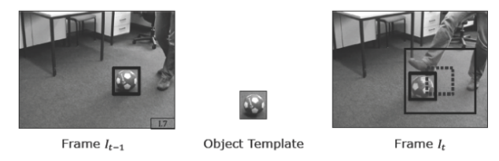
    <figcaption style="margin-top: 0.5em; text-align: center; font-size: 13px; color: #888;"><em>Şekil 14: Kare $I_{t-1}$'deki nesne şablonunun, Kare $I_t$'deki genişletilmiş arama penceresi içinde kaydırılarak en yüksek korelasyonlu konumun bulunması.</em></figcaption>
  

</figure>

* **Benzerlik Metrikleri:**
  - **SAD (Sum of Absolute Differences):** $\text{SAD}(u, v) = \sum_{x, y} |I(x+u, y+v) - T(x, y)|$
  - **SSD (Sum of Squared Differences):** $\text{SSD}(u, v) = \sum_{x, y} (I(x+u, y+v) - T(x, y))^2$
  - **NCC (Normalized Cross-Correlation):** Aydınlatma değişimlerine dirençli normalize çapraz korelasyon.
* **Sınırları:** Nesne döndüğünde (rotation), ölçeği değiştiğinde (scale) veya kısmi kapanmaya uğradığında (occlusion) piksel matrisi hedefle uyuşmaz ve takip anında kopar.

### 4.2 Histogram Tabanlı Takip (Histogram-Based Tracking)

* **Çalışma Prensibi:** Nesneyi ham piksel dizilimiyle temsil etmek yerine, takip kutusunun içindeki piksellerin renk veya yoğunluk dağılımının histogramı şablon olarak kaydedilir.
* **Üstünlüğü:** Histogram uzamsal piksel koordinatlarını tamamen yok ettiği için nesnenin kendi ekseninde dönmesinden (**rotation**) veya esnek vücut hareketlerinden etkilenmez; renk dağılımı korunduğu sürece nesne başarıyla izlenir.
* **Kritik Zayıflığı (Arka Plan Kirlenmesi):** Dikdörtgen sınır kutusunun köşelerinde nesneye ait olmayan arka plan pikselleri (çimen, yol vb.) de yer alır. Nesne hareket ettikçe bu arka plan pikselleri histogramı kirleterek takibin zamanla arka plana kaymasına (**drift**) yol açar.

### 4.3 Epanechnikov Çekirdeği ile Uzamsal Ağırlıklandırma (Weighted Histogram)

Arka plan piksellerinin histogramı kirletmesini engellemek için **Epanechnikov Çekirdeği (Epanechnikov Kernel)** adı verilen dairesel bir uzamsal ağırlıklandırma fonksiyonu kullanılır:

<figure style="display:flex; justify-content: center; margin: 20px 0;">
  

    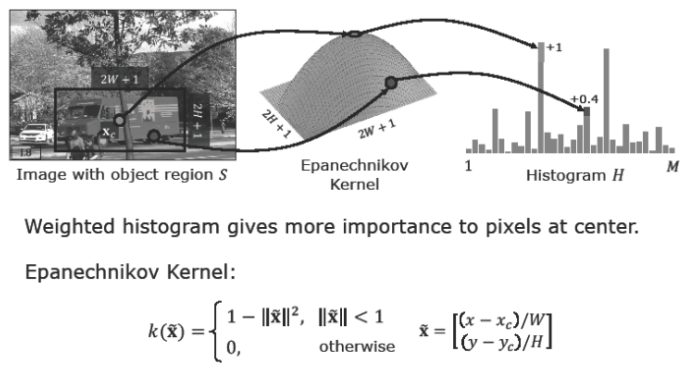
    <figcaption style="margin-top: 0.5em; text-align: center; font-size: 13px; color: #888;"><em>Şekil 15: Epanechnikov Çekirdeği ile Ağırlıklı Histogram. Takip kutusunun merkezindeki piksellere tam ağırlık (+1.0), kenar ve köşelerdeki piksellere ise düşük ağırlık (+0.4) atanarak arka plan kirliliği matematiksel olarak filtrelenir.</em></figcaption>
  

</figure>

Boyutları $(2W+1) \times (2H+1)$ olan bir pencerede merkez koordinatı $\mathbf{x}_c = [x_c, y_c]^T$ olmak üzere normalize edilmiş uzaklık vektörü:

$$\mathbf{\tilde{x}} = \begin{bmatrix} \frac{x - x_c}{W} \\ \frac{y - y_c}{H} \end{bmatrix}$$

Epanechnikov çekirdeği fonksiyonu:

$$k(\mathbf{\tilde{x}}) = \begin{cases} 1 - \|\mathbf{\tilde{x}}\|^2 & \text{eğer } \|\mathbf{\tilde{x}}\| < 1 \\ 0 & \text{aksi takdirde} \end{cases}$$

> **Matematiksel Mantık:** Takip penceresinin tam merkezindeki piksellerin nesneye ait olma olasılığı kesindir; bu yüzden histogram kutularına katkıları $+1.0$ (tam ağırlık) olarak eklenir. Pencere kenarlarına ve köşelerine doğru gidildikçe çekirdek değeri parabolik olarak sıfıra yaklaşır ($+0.4, +0.1$ vb.); böylece kutu köşelerindeki arka plan pikselleri sönümlenmiş olur.

### 4.4 Histogram Kesişimi (Histogram Intersection) ve Benzer Renk Çakışması (Latching)

İki normalize histogramı ($H_1$ ve $H_2$) karşılaştırmak için en kararlı metrik **Histogram Kesişimi (Histogram Intersection)** algoritmasıdır:

$$D(H_1, H_2) = \sum_{i=1}^M \min(H_1(i), H_2(i))$$

* **Kapanma Direnci:** Minimum ($\min$) operatörü sayesinde hedef nesnenin üzerine yabancı bir engel bindiğinde (kısmi kapanma), sadece ortak renk bileşenleri eşleşir ve algoritma takibi kaybetmez.
* **Tehlikeli Sınır Koşulu (Benzer Renk Kilitlenmesi - Latching / Identity Switch):** Histogram uzamsal konum bilgisini tutmadığı için, takip edilen sporcu (örneğin kırmızı formalı bir basketbolcu), aynı kırmızı formayı giyen bir takım arkadaşının çok yakınından geçtiğinde takip penceresi diğer oyuncuya kilitlenerek yön değiştirebilir (**identity switch**).

<figure style="display:flex; justify-content: center; margin: 20px 0;">
  

    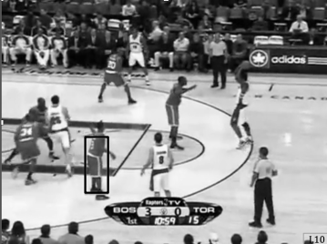
    <figcaption style="margin-top: 0.5em; text-align: center; font-size: 13px; color: #888;"><em>Şekil 16: Basketbol maçında hedef oyuncu takibi. Aynı formayı giyen sporcuların birbirinin yanından geçmesi histogram tabanlı takipte kilitlenme (latching) riskini doğurur.</em></figcaption>
  

</figure>

---

## 5. Öznitelik Tespiti ile Nesne Takibi (Tracking by Feature Detection)

Şablon ve histogram eşleştirmenin zayıflıklarını aşmak amacıyla, nesneyi bütünsel bir piksel kutusu olarak değil, onun üzerindeki kararlı yerel özniteliklerin (**local invariant features**) bir kombinasyonu olarak modelleyen **SIFT Tabanlı "Bag of Features" Nesne Takip Mimarisi (Gu et al., 2010)** geliştirilmiştir.

<figure style="display:flex; justify-content: center; margin: 20px 0;">
  

    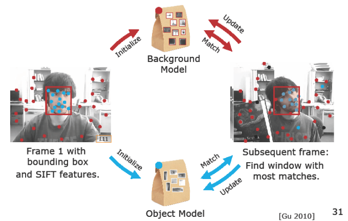
    <figcaption style="margin-top: 0.5em; text-align: center; font-size: 13px; color: #888;"><em>Şekil 17: SIFT Bag of Features Takip Mimarisi (Gu et al., 2010). Nesne ve Arka Plan öznitelik torbalarının başlatılması, kareden kareye eşleştirilmesi ve dinamik çevrimiçi güncellenmesi.</em></figcaption>
  

</figure>

### 5.1 Model İnşası ve İlklendirme (Initialization & Bag of Features)

İlk video karesinde ($t=1$) sistem şu adımlarla başlatılır:

<figure style="display:flex; justify-content: center; margin: 20px 0;">
  

    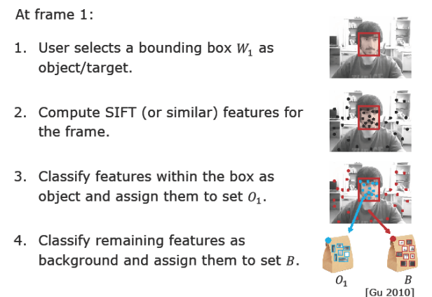
    <figcaption style="margin-top: 0.5em; text-align: center; font-size: 13px; color: #888;"><em>Şekil 18: İlk Karede İlklendirme: 1) Sınır kutusu $W_1$ seçimi; 2) SIFT anahtar noktalarının çıkarılması; 3) Kutu içindeki noktaların Nesne Torbasına ($O_1$), dışındakilerin Arka Plan Torbasına ($B$) atanması.</em></figcaption>
  

</figure>

1. **Sınır Kutusu Seçimi:** Kullanıcı veya bir nesne dedektörü hedef nesnenin etrafına $W_1$ sınır kutusunu yerleştirir.
2. **SIFT Öznitelik Tespiti:** Görüntünün tamamında SIFT algoritması çalıştırılarak anahtar noktalar ve 128 boyutlu tanımlayıcı vektörler ($\mathbf{v}_i$) çıkarılır.
3. **Nesne Modeli ($O_1$ Torbası):** $W_1$ sınır kutusunun içinde kalan tüm SIFT öznitelikleri **Nesne Torbası ($O_1$)** olarak kaydedilir (Mavi Noktalar).
4. **Arka Plan Modeli ($B$ Torbası):** Sınır kutusunun dışında kalan tüm diğer SIFT öznitelikleri **Arka Plan Torbası ($B$)** olarak kaydedilir (Kırmızı Noktalar).

### 5.2 Kareden Kareye Takip Mekanizması ve Güven Skoru Oran Testi

Sonraki $I_t$ karesi geldiğinde takip süreci şu matematiksel adımlarla yürütülür:

<figure style="display:flex; justify-content: center; margin: 20px 0;">
  

    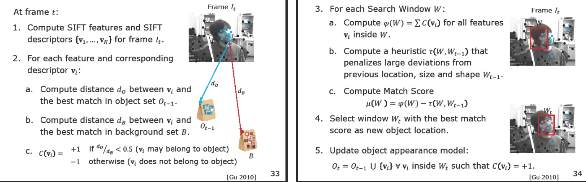
    <figcaption style="margin-top: 0.5em; text-align: center; font-size: 13px; color: #888;"><em>Şekil 19: Takip Aşamaları: 1) SIFT özniteliklerinin çıkarılması; 2) Mesafe oran testi ($d_O / d_B &lt; 0.5$) ile güven skorlarının ($C(\mathbf{v}_i) = \pm 1$) atanması; 3) Aday pencerelerde skor hesabı ($\mu(W) = \varphi(W) - \tau(W)$); 4) En yüksek skorlu $W_t$ penceresinin seçilmesi; 5) Nesne modelinin çevrimiçi güncellenmesi.</em></figcaption>
  

</figure>

1. **Yeni Özniteliklerin Çıkarılması:** Kare $I_t$ üzerinde SIFT çalıştırılarak $\{\mathbf{v}_1, \mathbf{v}_2, \dots, \mathbf{v}_K\}$ öznitelikleri saptanır.
2. **Mesafe Oran Testi ve Güven Skoru:** Yeni saptanan her bir $\mathbf{v}_i$ özniteliği için;
   - Nesne Torbasındaki ($O_{t-1}$) en yakın komşusuna olan Öklid uzaklığı: $d_O = \min_{\mathbf{u} \in O_{t-1}} \|\mathbf{v}_i - \mathbf{u}\|$
   - Arka Plan Torbasındaki ($B$) en yakın komşusuna olan Öklid uzaklığı: $d_B = \min_{\mathbf{u} \in B} \|\mathbf{v}_i - \mathbf{u}\|$
   hesaplanır ve şu oran testi uygulanır:
   
   $$C(\mathbf{v}_i) = \begin{cases} +1 & \text{eğer } \frac{d_O}{d_B} < 0.5 \quad (\mathbf{v}_i \text{ nesneye aittir}) \\ -1 & \text{aksi takdirde } (\mathbf{v}_i \text{ arka plana aittir}) \end{cases}$$

### 5.3 Optimal Pencere Arama ve Geometrik Deformasyon Cezası

Takip penceresi önceki konum $W_{t-1}$ etrafında kaydırılıp ölçeği ve en-boy oranı hafifçe esnetilerek (deformasyon) aday pencereler ($W$) taranır. Her aday pencere için bir **Eşleşme Skoru $\mu(W)$** hesaplanır:

$$\mu(W) = \varphi(W) - \tau(W, W_{t-1})$$

* **Pencere Güven Skoru Toplamı:** $\varphi(W) = \sum_{\mathbf{v}_i \in W} C(\mathbf{v}_i)$ (Amaç, içinde olabildiğince çok mavi $+1$ nesne noktası ve olabildiğince az kırmızı $-1$ arka plan noktası barındıran pencereyi bulmaktır).
* **Geometrik Deformasyon Cezası (Shape Penalty):** $\tau(W, W_{t-1})$, pencerenin bir önceki karedeki boyut, en-boy oranı ve konumuna göre ani, gerçekçi olmayan sıçramalarını ve şekil bozulmalarını cezalandırır.

Maksimum $\mu(W)$ skoruna ulaşan aday pencere $W_t$, nesnenin o karedeki yeni kesin konumu ilan edilir:

$$W_t = \arg\max_W \mu(W)$$

### 5.4 Görünüm Modelinin Çevrimiçi Güncellenmesi

Nesne hareket ettikçe bakış açısı, gölgeler ve pozisyon sürekli değişir. Modelin yaşlanmasını (**model drifting / staleness**) önlemek için her karede nesne torbası dinamik olarak genişletilir:

$$O_t = O_{t-1} \cup \{\mathbf{v}_i \mid \mathbf{v}_i \in W_t \text{ ve } C(\mathbf{v}_i) = +1\}$$

### 5.5 Öznitelik Tabanlı Takibin Kapanma, Dönme ve Işık Değişimlerine Dayanıklılığı

SIFT tabanlı Bag of Features mimarisi, geleneksel şablon ve histogram eşleştirmenin çöktüğü tüm zorlu senaryolarda üstün bir kararlılık sergiler:

<figure style="display:flex; justify-content: center; margin: 20px 0;">
  

    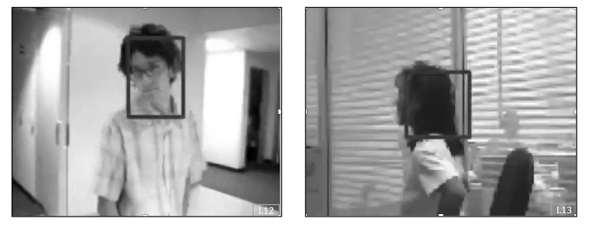
    <figcaption style="margin-top: 0.5em; text-align: center; font-size: 13px; color: #888;"><em>Şekil 20: Zorlu takip koşulları: Sol: Ani aydınlatma değişimi; Sağ: Karmaşık arka plan önünde 3B kafa dönmesi. SIFT tanımlayıcılarının değişmezliği sayesinde takip kusursuz sürdürülür.</em></figcaption>
  

</figure>

<figure style="display:flex; justify-content: center; margin: 20px 0;">
  

    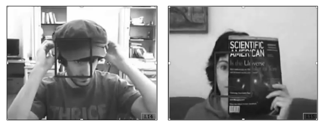
    <figcaption style="margin-top: 0.5em; text-align: center; font-size: 13px; color: #888;"><em>Şekil 21: Aşırı kapanma (Severe Occlusion) senaryoları: Sol: Şapka takarak yüzün üst kısmının kapatılması; Sağ: Dergi ile yüzün yarısının tamamen perdelenmesi. Açıkta kalan SIFT noktaları sayesinde takip kutusu hedefi asla kaybetmez.</em></figcaption>
  

</figure>

* **Kapanma Direnci (Occlusion Robustness):** Yüzün önüne bir dergi veya şapka girdiğinde, engelin getirdiği yeni öznitelikler bizim nesne torbamızda bulunmadığı için güven skorları $-1$ çıkar ve $\varphi(W)$ toplamını artıramaz. Nesnenin açıkta kalan kısımlarındaki güçlü mavi $+1$ noktaları, pencereyi tam hedef üzerinde tutmaya devam eder.
* **3B Dönme ve Işık Değişimi:** SIFT tanımlayıcıları ölçek, rotasyon ve gradyan normalizasyonu sayesinde parlaklık değişimlerine doğuştan dayanıklıdır; nesne 3B döndüğünde dahi takip kararlılıkla sürdürülür.

---

## 6. Özetleyici Teknik Karşılaştırma Matrisi

Aşağıdaki matris, bu derste incelenen tüm nesne takibi ve arka plan çıkarma algoritmalarının temel karar mekanizmalarını, girdi gereksinimlerini, güçlü yönlerini ve temel sınır koşullarını özetlemektedir:

| Yöntem Başlığı | Temel Karar Mekanizması / Formül | Gereken Bilgi / Girdi | En Güçlü Olduğu Durum | Karşılaştığı Temel Sınır Koşulu |
| :--- | :--- | :--- | :--- | :--- |
| **Kare Farkı (Differencing)** | $\lvert I_t - I_{t-1} \rvert > \tau$ | Ardışık iki video karesi | Hızlı prototipleme, sabit kameralarda çok ani hareketler | Homojen nesne içlerinde delikler (holes), sallanan yapraklar |
| **Medyan Arka Plan (Median BG)** | $\lvert I_t - \text{median}\{I_1, \dots, I_K\} \rvert > \tau$ | İlk $K$ video karesi | Durağan sahnelerde tekil geçen arabaların filtrelenmesi | Statik model; zamanla değişen gün ışığına uyum sağlayamaz |
| **Gauss Karışım Modeli (GMM)** | $\frac{\omega_k}{\sigma_k}$ sıralaması ve Mahalanobis eşiği | Piksel başına $K$ adet Gauss parametresi $(\omega_k, \mu_k, \Sigma_k)$ | Yağmurlu/karlı havalar, sallanan yapraklar, dinamik arka planlar | Nesneyle aynı renge sahip hareketli gölgelerin (shadows) ayrıştırılamaması |
| **Görünüm Şablonu (Appearance)** | $\min \text{SSD}$ veya $\max \text{NCC}$ | Nesnenin ilk karedeki ham piksel matrisi | Kısa süreli, yönelimi ve ölçeği değişmeyen doğrusal hareketler | Ölçek değişimi, 3B dönme veya en ufak bir kapanmada takibin kopması |
| **Histogram Şablonu (Weighted)** | Epanechnikov ağırlıklı histogram kesişimi | ROI piksellerinin ağırlıklı renk histogramı | Nesnenin kendi ekseninde dönmesi ve esnek vücut hareketleri | Aynı formayı giyen sporcuların çakışmasında takibin sapması (**latching**) |
| **Öznitelik Torbası (Bag of Features)** | $\max (\varphi(W) - \tau(W))$ ile SIFT oran testi | Nesne ($O$) ve Arka Plan ($B$) SIFT öznitelik torbaları | Yoğun kapanmalar (occlusion), 3B dönmeler, zorlu ışık değişimleri | SIFT anahtar noktası barındırmayan tamamen dokusuz (pürüzsüz) nesneler |
