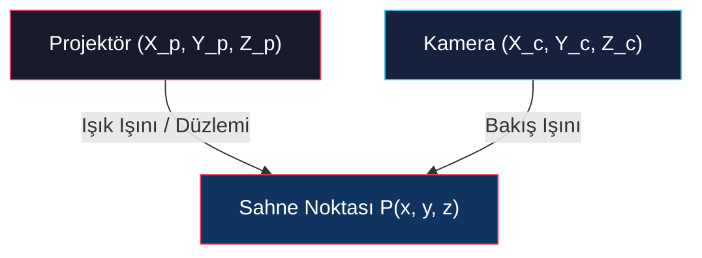

# Genel Bakış, Fotometrik Stereo Sistemleri ve Yapılandırılmış Işık ile Mesafe Ölçümü

<!-- toc -->

Bilgisayarlı görüde kameralar genellikle pasif gözlemcilerdir; sahnedeki mevcut doğal ışıkla yetinmek zorundadırlar. Ancak endüstriyel otomasyon, robotik, otonom sürüş ve kalite kontrol gibi alanlarda, aydınlatmayı aktif olarak kontrol etme özgürlüğüne sahibizdir. Bu stratejik yaklaşım **Aktif Aydınlatma** (*Active Illumination*) olarak adlandırılır.

---

## 1. Genel Bakış (Overview)

Pasif vizyon teknikleri (pasif stereo görü ve optik akış gibi), sahnede mevcut olan ortam ışığına ve yüzeyin doğal görünümüne bağımlıdır. Aktif aydınlatma sistemleri ise sahne üzerine kontrol edilebilir ışık enerjisi yansıtarak, pasif kameralarla elde edilmesi zor veya imkansız olan geometrik ve radyometrik özellikleri açığa çıkarır.

### 1.1 Pasif Vizyonun Sınırları ve Aktif Aydınlatmanın Üstünlüğü

- **Dokusuz (Textureless) Alanlar:** Pasif stereo vizyon ve optik akış (*optical flow*) algoritmaları, homojen boyanmış beyaz bir duvar veya pürüzsüz bir plastik yüzey üzerinde karşılık gelen pikselleri (*correspondences*) bulamaz ve çöker. Aktif aydınlatma sahneye yapay doku (yüksek kontrastlı yapılandırılmış desen) yansıtarak bu engeli aşar.
- **Işık Koşullarından Bağımsızlık:** Ortam ışığının sürekli değiştiği veya tamamen karanlık olduğu sahnelerde, aktif sistemler kendi özel ışık kaynaklarıyla kararlı ve gürültüsüz ölçümler sunar.
- **Foton Manipülasyonu:** Işığın dalga boyu, yönü, fazı ve yayılım zamanı hassas bir şekilde kontrol edilerek sahnenin pasif kameralarla görünmeyen gizli geometrik ve fiziksel (yansıtma) özellikleri açığa çıkarılır.
- **İnsan Gözünden Gizleme (Spectrum Selection):** Kızılötesi (IR) veya Ultraviyole (UV) gibi görünmez bantlarda yansıtılan aktif desenler, insanları rahatsız etmeden (örneğin akıllı telefon yüz kilidi açma ünitelerinde veya otonom gece sürüşlerinde) 3B veri toplar.

> **Temel Sezgi:** Aktif aydınlatma, sahneye düşen ışık alanını kontrol ederek belirsiz (*ill-posed*) görsel kestirim problemlerini matematiksel olarak iyi tanımlanmış (*well-posed*) geometrik ve radyometrik ölçümlere dönüştürür.

---

## 2. Fotometrik Stereo Sistemleri (Photometric Stereo Systems)

Fotometrik stereo, kameranın ve nesnenin konumunu tamamen sabit tutup, ışık kaynaklarının yönünü sırayla değiştirerek piksellerdeki parlaklık değişimlerinden yüzey normallerini saptayan kararlı bir yöntemdir.

<figure style="display:flex; justify-content: center; margin: 20px 0;">
  

    
    <figcaption style="margin-top: 0.5em; text-align: center; font-size: 13px; color: #888;"><em>Şekil 1: Sabit kamera ve yüzey normali n olan nesneyi farklı s1, s2, s3 yönlerinden aydınlatan temel fotometrik stereo düzeneği.</em></figcaption>
  

</figure>

### 2.1 Fotometrik Örnekleme (Photometric Sampling)

Geleneksel fotometrik stereoda nesnenin yansıtma özellikleri (BRDF) önceden tamamen Lambertian (mat) olarak kabul edilir. Ancak gerçek dünyadaki nesneler hibrit (hem mat hem parlak) yansıma gösterirler. Nayar (1989) tarafından geliştirilen **Fotometrik Örnekleme** teorisi bu kısıtlamayı kaldırır:

- **Çoklu LED Dizisi:** Nesneyi çevreleyen küresel bir kubbe üzerine çok sayıda bağımsız LED ışık kaynağı yerleştirilir. Bu kaynaklar yüksek hızlı kameralarla senkronize olarak milisaniyeler içinde taranır.
- **Difüzör Perde Entegrasyonu:** Kusursuz aynasal (*specular*) bir yüzeyi noktasal kaynaklarla çözmek imkansızdır; çünkü yansıma sadece tek bir noktada ayna görüntüsü (*highlight*) oluşturur. Bu optik engeli aşmak için kubbe ile nesne arasına yarı saydam bir difüzör (*diffuser dome*) yerleştirilir. Difüzör, noktasal kaynakları geniş açılı alan kaynaklarına (*area sources*) dönüştürerek örtüşen ve sürekli değişen yumuşak parlaklık alanları oluşturur. Bu sayede karmaşık metalik yüzeylerin normalleri dahi hassas şekilde çözülür.

<figure style="display:flex; justify-content: center; margin: 20px 0;">
  

    
    <figcaption style="margin-top: 0.5em; text-align: center; font-size: 13px; color: #888;"><em>Şekil 2: Fotometrik örnekleme için etrafı dağıtıcı difüzör perde ve LED kaynaklarıyla çevrilmiş küresel düzenek [Nayar 1989].</em></figcaption>
  

</figure>

<figure style="display:flex; justify-content: center; margin: 20px 0;">
  

    
    <figcaption style="margin-top: 0.5em; text-align: center; font-size: 13px; color: #888;"><em>Şekil 3: Fotometrik örnekleme sonuçları: Metalik nesne, hesaplanan yüzey normalleri ve ayrıştırılmış difüz/speküler yansıma haritaları.</em></figcaption>
  

</figure>

### 2.2 Debevec ve "Light Stage" Teknolojisi

Fotometrik örnekleme felsefesi, Paul Debevec ve ekibi tarafından sinema ve bilgisayar grafikleri endüstrisinde insan performansını 3B yakalamak amacıyla küresel ölçeğe taşınmıştır:

- **Hızlı Tarama:** Yüzlerce programlanabilir LED içeren küresel kafes (*Light Stage*), bir aktörün etrafında saniyede binlerce kez farklı aydınlatma kombinasyonlarını tetikler. Yüksek hızlı kameralar aktörü milisaniyelik bir süre içinde düzinelerce farklı aydınlatma açısı altında fotoğraflar.
- **Yeniden Aydınlatma (Relighting):** Elde edilen bu çok açılı parlaklık yığını, doğrusal kombinasyonlar şeklinde birleştirilerek aktörün herhangi bir sanal ortama (örneğin bir film sahnesine) o ortamın ışık koşullarıyla %100 uyumlu olacak şekilde entegre edilmesini (*relighting*) sağlar. Yüzün 3B geometrisi, gözenek detayları (*micro-geometry*) ve difüz/speküler yansıtma haritaları aynı anda elde edilir.

<figure style="display:flex; justify-content: center; margin: 20px 0;">
  

    
    <figcaption style="margin-top: 0.5em; text-align: center; font-size: 13px; color: #888;"><em>Şekil 4: Paul Debevec tarafından geliştirilen, aktörün yüz performansını farklı aydınlatma açıları altında saniyede binlerce kareyle yakalayan küresel Light Stage kafesi.</em></figcaption>
  

</figure>

<figure style="display:flex; justify-content: center; margin: 20px 0;">
  

    
    <figcaption style="margin-top: 0.5em; text-align: center; font-size: 13px; color: #888;"><em>Şekil 5: Light Stage verisinden elde edilen yüksek çözünürlüklü yüzey normalleri (sol) ve hedef ortama kusursuz relighting uygulaması (sağ).</em></figcaption>
  

</figure>

---

## 3. Yapılandırılmış Işık ile Mesafe Ölçümü (Structured Light Range Finding)

Yapılandırılmış ışık sistemleri, sahne üzerine geometrisi önceden bilinen ışık desenleri yansıtarak nirengi (*triangulation*) yöntemiyle doğrudan derinlik ($z$) haritası hesaplar.

### 3.1 Nokta Tabanlı Mesafe Ölçümü (Point-Based Range Finding)

- **Çalışma Prensibi:** Konumu ve yönelimi projektör koordinat sisteminde hassas olarak bilinen tek bir lazer işaretçi, sahneye doğrusal bir ışın gönderir. Bu ışın nesneye çarptığında kamerada parlak bir nokta $(x_i, y_i)$ oluşturur.
- **Nirengi (Triangulation):** Kameranın optik merkezinden çıkan bakış ışını ile lazer ışınının 3B uzaydaki denklemi kesiştirilerek çarpma noktasının kesin $P(x, y, z)$ koordinatları hesaplanır.

<figure style="display:flex; justify-content: center; margin: 20px 0;">
  

    
    <figcaption style="margin-top: 0.5em; text-align: center; font-size: 13px; color: #888;"><em>Şekil 6: Nokta tabanlı mesafe ölçümü geometrisi: Kamera bakış ışını ile lazer işaretçi ışınının 3B uzayda kesiştirilmesi.</em></figcaption>
  

</figure>

- **Arka Plan Çıkarma (Background Subtraction):** Lazerli ve lazersiz çekilen iki görüntü birbirinden çıkarılarak sadece lazer noktasının merkezi (*centroid*) alt-piksel hassasiyetinde saptanır.

<figure style="display:flex; justify-content: center; margin: 20px 0;">
  

    
    <figcaption style="margin-top: 0.5em; text-align: center; font-size: 13px; color: #888;"><em>Şekil 7: Arka plan çıkarma süreci: Lazerli I_P ve lazersiz I_B görüntülerin çıkarılmasıyla nokta merkezinin tespit edilmesi.</em></figcaption>
  

</figure>

- **Zaman Kısıtı:** Her bir pikselin derinliğini ölçmek için ayrı bir görüntü çekilmelidir. $640 \times 480$ çözünürlüğündeki bir derinlik haritası için 300.000'den fazla görüntü çekilmesi gerekir; bu da sistemi aşırı derecede yavaş ve kullanışsız kılar.

### 3.2 Çizgi Tarama (Light Striping / Line-Based)

Noktasal lazer yerine, sahneye özel bir silindirik mercekle açılmış bir ışık düzlemi (*sheet/plane of light*) yansıtılır. Bu düzlem nesne üzerinde kıvrılan parlak bir çizgi (*stripe*) oluşturur.

Kameradaki her bir çizgi pikseli $(x_i, y_i)$, kamera bakış ışını ile bilinen $A x + B y + C z + D = 0$ ışık düzleminin kesiştirilmesiyle doğrudan derinliğe ($z$) dönüştürülür:

$$z = \frac{-D \cdot f}{A x_i + B y_i + C f}$$

Burada $f$ mercek odak uzaklığıdır.

<figure style="display:flex; justify-content: center; margin: 20px 0;">
  

    
    <figcaption style="margin-top: 0.5em; text-align: center; font-size: 13px; color: #888;"><em>Şekil 8: Çizgi tarama geometrisi: Kamera bakış ışını ile projektörün Ax + By + Cz + D = 0 ışık düzleminin kesişimi.</em></figcaption>
  

</figure>

<figure style="display:flex; justify-content: center; margin: 20px 0;">
  

    
    <figcaption style="margin-top: 0.5em; text-align: center; font-size: 13px; color: #888;"><em>Şekil 9: Çizgi tarama örneği: Kamerada nesne üzerinde kıvrılan çizgi ile projektör tarafındaki düz ışık katmanı.</em></figcaption>
  

</figure>

Süreç boyunca ışık düzlemi sahne boyunca bir motor yardımıyla süpürülür (*sweep*). $640 \times 480$ derinlik haritası için sadece 640 görüntü çekilmesi yeterlidir (30 fps hızında yaklaşık 21 saniye sürer).

### 3.3 Çoklu Çizgi Belirsizliği (Ambiguity)

Tüm çizgileri aynı anda tek bir karede yansıtıp süreyi milisaniyelere indirmek istediğimizde karşımıza sıralama belirsizliği (*ambiguity*) çıkar. Karmaşık derinliğe sahip sahnelerde (örneğin arka arkaya duran nesneler veya derin yarıklar), çizgilerin sırası kamerada yer değiştirebilir veya bazı çizgiler engellenebilir (*shadowing*). Kameradaki bir çizginin, projeksiyondaki hangi orijinal kolona ait olduğu bilinemezse nirengi denklemleri çözülemez.

<figure style="display:flex; justify-content: center; margin: 20px 0;">
  

    
    <figcaption style="margin-top: 0.5em; text-align: center; font-size: 13px; color: #888;"><em>Şekil 10: Karmaşık nesnelerde çoklu çizgiler aynı anda yansıtıldığında ortaya çıkan eşleştirme ve sıralama belirsizliği.</em></figcaption>
  

</figure>

### 3.4 İkili Kodlanmış Yapılandırılmış Işık (Binary Coded Structured Light)

Birden fazla çizgiyi karıştırmadan tek seferde çözebilmek için uzamsal-zamansal kodlama (*space-time encoding*) yöntemi geliştirilmiştir:

- **Kod Sözcüğü (Codeword) Mantığı:** Örneğin sahneyi 7 bölgeye (şerite) ayırmak isteyelim. 7 şeridi temsil etmek için $\log_2(7 + 1) = 3$ bit yeterlidir.
- **Model Kodları:**
  1. *1. Görüntü (Bit 1):* Kodunun ilk biti 1 olan şeritler aydınlatılır, 0 olanlar kapatılır (4 şerit açık, 3 şerit kapalı).
  2. *2. Görüntü (Bit 2):* İkinci biti 1 olanlar aydınlatılır.
  3. *3. Görüntü (Bit 3):* Üçüncü biti 1 olanlar aydınlatılır.
- Kameradaki herhangi bir piksel bu 3 kare boyunca "Açık-Kapalı-Açık" (yani $101_2 = 5$) şablonu gösteriyorsa, onun kesin olarak projektörün 5. şeridi tarafından aydınlatıldığı anlaşılır.

<figure style="display:flex; justify-content: center; margin: 20px 0;">
  

    
    <figcaption style="margin-top: 0.5em; text-align: center; font-size: 13px; color: #888;"><em>Şekil 11: Uzamsal-zamansal ikili kodlama tablosu: n görüntü ile 2^n - 1 şeridin benzersiz kod sözcükleriyle etiketlenmesi [Posdamer 1981].</em></figcaption>
  

</figure>

<figure style="display:flex; justify-content: center; margin: 20px 0;">
  

    
    <figcaption style="margin-top: 0.5em; text-align: center; font-size: 13px; color: #888;"><em>Şekil 12: Nesne üzerine sırayla yansıtılan ikili şerit desenleri ve elde edilen 3B yeniden yapılandırma sonucu.</em></figcaption>
  

</figure>

Genel kural olarak, $n$ adet görüntü çekilerek $2^n - 1$ adet şerit kodlanabilir (`000` durumu tamamen karanlık olduğu için elenir). Örneğin, sadece 8 görüntüyle 255 şeritli yüksek çözünürlüklü bir derinlik haritası elde edilir.

### 3.5 Işık Sızması ve Gray Kodlama

- **Işık Sızması (Light Bleeding) Problemi:** Projektörün ve kameranın sınırlı odak yetenekleri nedeniyle, şeritlerin siyah-beyaz keskin geçiş sınırları (*edges*) sahnede kaçınılmaz olarak bulandığı için gri tonlara dönüşür. Bu sınır bölgelerindeki piksellerin 0 mı yoksa 1 mi olduğunu eşiklemek (*thresholding*) ciddi derinlik hatalarına yol açar. $2^n - 1$ klasik ikili kodlamada geçiş sınırı sayısı çok yüksektir.

<figure style="display:flex; justify-content: center; margin: 20px 0;">
  

    
    <figcaption style="margin-top: 0.5em; text-align: center; font-size: 13px; color: #888;"><em>Şekil 13: Standart ikili kodlamada optik ışık sızması nedeniyle sınır piksellerinde yaşanan eşikleme belirsizliği.</em></figcaption>
  

</figure>

- **Gray Kodlama Çözümü (Inokuchi 1984):** Şeritlerin sayısal temsil sıraları değiştirilerek, ardışık şeritler arasında sadece tek bir bitin değişmesi (*Gray Code*) sağlanır. Bu matematiksel düzenleme sayesinde geçiş sınırı sayısı minimize edilir ve ışık sızmasından kaynaklanan sınır eşikleme hataları engellenir.

<figure style="display:flex; justify-content: center; margin: 20px 0;">
  

    
    <figcaption style="margin-top: 0.5em; text-align: center; font-size: 13px; color: #888;"><em>Şekil 14: Standart binary kodun Gray koduna dönüştürülmesi ile komşu şeritler arası bit değişiminin 1'e indirilmesi.</em></figcaption>
  

</figure>

### 3.6 Çok Seviyeli ve Renkli Kodlama (k-ary / Color Coded)

Sadece açık/kapalı (binary) durumları yerine, $k$ adet farklı parlaklık seviyesi veya renk (örneğin kırmızı, yeşil, mavi ile ternary sistem, $k=3$) kullanılarak görüntünün bilgi kapasitesi artırılır:

<figure style="display:flex; justify-content: center; margin: 20px 0;">
  

    
    <figcaption style="margin-top: 0.5em; text-align: center; font-size: 13px; color: #888;"><em>Şekil 15: Kodlama altyapılarının karşılaştırılması: Binary (k=2), Ternary (k=3) ve genel k-li sistemler.</em></figcaption>
  

</figure>

- Ternary sistemde, 7 şeridi temsil etmek için sadece 2 adet trit (*ternary digit*) yeterlidir; yani gereken görüntü sayısı 3'ten 2'ye düşer.

<figure style="display:flex; justify-content: center; margin: 20px 0;">
  

    
    <figcaption style="margin-top: 0.5em; text-align: center; font-size: 13px; color: #888;"><em>Şekil 16: RGB renk kodlu ternary yapılandırılmış ışık: 7 şeridin sadece 2 karede Kırmızı, Yeşil ve Mavi ile kodlanması.</em></figcaption>
  

</figure>

- Genel kural olarak, $n$ görüntü ile $k^n - 1$ adet şerit kodlanabilir.

<figure style="display:flex; justify-content: center; margin: 20px 0;">
  

    
    <figcaption style="margin-top: 0.5em; text-align: center; font-size: 13px; color: #888;"><em>Şekil 17: Renkli kodlamanın fiziksel sınırları: Nesne renkleri nedeniyle ışığın soğurulması (yansıma olmaması) ve renk karışması.</em></figcaption>
  

</figure>

> **Renkli Kodlamanın Limitleri:** Kamera ve projektörün renk filtrelerinin geniş spektral bantları renklerin birbirine karışmasına (*crosstalk*) neden olur. Ayrıca nesnenin kendi renk pigmentleri (yansıtma özellikleri) yansımayı bozar. Örneğin, derin mavi bir nesne üzerine parlak kırmızı bir ışık yansıtıldığında ışık tamamen soğurulur ve kameraya hiçbir yansıma dönmez. Renkli yapılandırılmış ışık, sadece tüm renkleri eşit derecede yansıtan mat gri nesnelerin (*gray world*) taranmasında kusursuz çalışır.
