# Faz Kaydırma Yöntemi, Yapılandırılmış Işık Sistemleri ve Uçuş Süresi Yöntemi

<!-- toc -->

Kesikli ikili desenler nirengiyi çözmede etkili olsa da, milimetrik ve alt-piksel düzeyinde 3B hassasiyet elde etmek için sahneye yoğunluğu uzamsal olarak sürekli değişen ışık fonksiyonları yansıtılır. Bu bölümde faz kaydırma yöntemi, sanayideki yüksek hassasiyetli yapılandırılmış ışık uygulamaları, optik sınırlandırmalar ve Uçuş Süresi (*Time-of-Flight*) derinlik algılama teknolojisi incelenmektedir.

---

## 1. Faz Kaydırma Yöntemi (Phase Shifting Method)

Kesikli (*discrete*) şeritler yerine, sahneye parlaklığı sürekli (*continuous*) olarak değişen matematiksel fonksiyonlar yansıtılarak çözünürlük piksel ve alt-piksel hassasiyetine indirgenir.

### 1.1 Yoğunluk Oranı Metodu (Intensity Ratio)

- **Ramp Fonksiyonu:** Sahneye bir ucu parlak, diğer ucu doğrusal olarak sıfıra inen tek bir rampa ışık deseni ($L_1$) yansıtılır.
- **Düz Işık:** Ardından sahneye üniform (sabit) parlaklıkta ikinci bir ışık ($L_2$) gönderilir.

<figure style="display:flex; justify-content: center; margin: 20px 0;">
  

    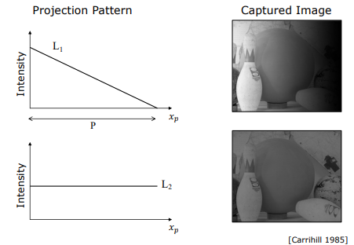
    <figcaption style="margin-top: 0.5em; text-align: center; font-size: 13px; color: #888;"><em>Şekil 1: Doğrusal rampa deseni L1 ve sabit parlaklıklı L2 desenlerinin projeksiyonu [Carrihill 1985].</em></figcaption>
  

</figure>

- **Normalizasyon:** Kamerada ölçülen $I_1 = \rho \cdot L_1$ ve $I_2 = \rho \cdot L_2$ değerleri birbirine oranlandığında, yüzeyin albedosu ve normal etkilerini barındıran $\rho$ yansıtma katsayısı birbirini götürür:

$$\frac{I_1}{I_2} = \frac{\rho \cdot L_1}{\rho \cdot L_2} = \frac{L_1}{L_2}$$

<figure style="display:flex; justify-content: center; margin: 20px 0;">
  

    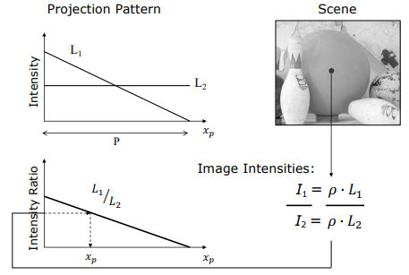
    <figcaption style="margin-top: 0.5em; text-align: center; font-size: 13px; color: #888;"><em>Şekil 2: I1/I2 oranı alınarak yüzey yansıtma katsayısının (albedo) yok edilmesi ve projektör x_p koordinatının elde edilmesi.</em></figcaption>
  

</figure>

Bu oran doğrudan yansıtılan kolon koordinatını ($x_p$) verir.

> **Dezavantajı:** Gürültüye (*noise*) karşı aşırı duyarlıdır ve projektörün parlaklık adımlarının kalitesine (*quantization*) bağımlıdır.

### 1.2 Sinüzoidal Faz Kaydırma (Phase Shifting) Matematiği

Sanayide ve fabrika otomasyonlarında en yaygın kullanılan altın standart yöntem, sahneye sinüzoidal/kosinüsel dalgalar yansıtıp bunların fazlarını kaydırmaktır.

Projektörden yansıtılan kosinüs dalgası ortalama parlaklık $b$, genlik $b$ ve periyot $P$ ile tanımlanır. Sahnedeki bilinmeyen ortam aydınlatması $a$ ve yüzeyin bağıl yansıtma gücü $\rho$ olmak üzere, pikselde ölçülen ışık şiddeti denklemi:

$$I_1(x_c, y_c) = \rho a + \rho b + \rho b \cos\left( \frac{2\pi x_p}{P} \right)$$

<figure style="display:flex; justify-content: center; margin: 20px 0;">
  

    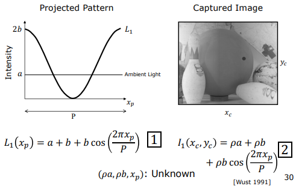
    <figcaption style="margin-top: 0.5em; text-align: center; font-size: 13px; color: #888;"><em>Şekil 3: Sahneye yansıtılan ilk referans kosinüs dalgası L1 [Wust 1991].</em></figcaption>
  

</figure>

Bu denklemde çözmemiz gereken üç bilinmeyen mevcuttur: $\rho a$ (ortam katkısı), $\rho b$ (genlik katkısı) ve aradığımız kolon konumu olan $x_p$. Bu 3 bilinmeyeni çözmek için fazı kaydırılmış tam 3 adet görüntü çekilir:

1. **1. Görüntü ($I_1$):** Referans kosinüs deseni $L_1$ yansıtılır ($0^\circ$ faz kayması).
2. **2. Görüntü ($I_2$):** Desenin fazı $-120^\circ$ ($-2\pi/3$) kaydırılarak yansıtılır.

<figure style="display:flex; justify-content: center; margin: 20px 0;">
  

    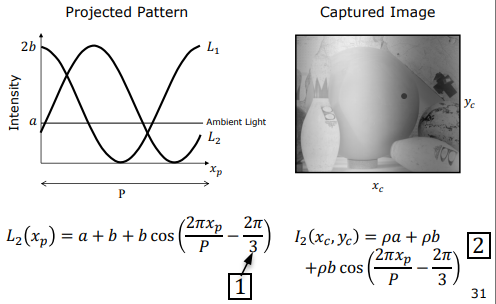
    <figcaption style="margin-top: 0.5em; text-align: center; font-size: 13px; color: #888;"><em>Şekil 4: Fazı -120° (-2π/3) kaydırılmış ikinci kosinüs deseni L2.</em></figcaption>
  

</figure>

3. **3. Görüntü ($I_3$):** Desenin fazı $+120^\circ$ ($+2\pi/3$) kaydırılarak yansıtılır.

<figure style="display:flex; justify-content: center; margin: 20px 0;">
  

    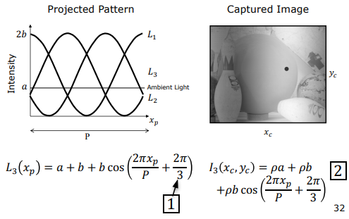
    <figcaption style="margin-top: 0.5em; text-align: center; font-size: 13px; color: #888;"><em>Şekil 5: Fazı +120° (+2π/3) kaydırılmış üçüncü kosinüs deseni L3.</em></figcaption>
  

</figure>

Bu üç bağımsız denklemin ortak trigonometrik çözümüyle, bilinmeyen albedo $\rho a$ ve genlik $\rho b$ sadeleştirilerek $x_p$ koordinatı kapalı formda doğrudan elde edilir:

$$x_p = \frac{P}{2\pi} \tan^{-1}\left( \sqrt{3} \frac{I_2 - I_3}{2I_1 - I_2 - I_3} \right)$$

<figure style="display:flex; justify-content: center; margin: 20px 0;">
  

    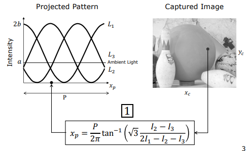
    <figcaption style="margin-top: 0.5em; text-align: center; font-size: 13px; color: #888;"><em>Şekil 6: Çekilen 3 faz kaydırmalı görüntüden projektör x_p kolon koordinatını hesaplayan trigonometrik denklem.</em></figcaption>
  

</figure>

Bu hesaplanan $x_p$ kolon düzlemi ile kameranın bakış ışını kesiştirilerek 3D koordinatlar milimetrik doğrulukla çıkarılır.

---

## 2. Yapılandırılmış Işık Sistemleri (Structured Light Systems)

### 2.1 Öne Çıkan Başarılı Sistemler

- **3B Görsel Denetim (Omron Corp.):** Fabrika otomasyonunda basılı devre kartlarının (PCB) üzerindeki lehim bağlantılarını (*solder joints*) ve mikro bileşenleri gerçek zamanlı denetlemek için kullanılır. Kart küçük karolara (*tiles*) bölünerek faz kaydırma yöntemiyle saniyeler içinde taranır ve hatalı lehimler hattan ayıklanır.
- **Dijital Michelangelo Projesi (Levoy 2000):** İtalya'daki ünlü Davut (*David*) heykelini ve diğer tarihi eserleri 30 gece boyunca hassas yapılandırılmış ışık tarayıcılarıyla taramıştır. Milimetrenin dörtte biri ($1/4 \text{ mm}$) çözünürlükle heykelin dijital ikizi (*Virtual David*) oluşturulmuş, aşınma ve bozulma takipleri için kalıcı bir arşiv sunulmuştur.

<figure style="display:flex; justify-content: center; margin: 20px 0;">
  

    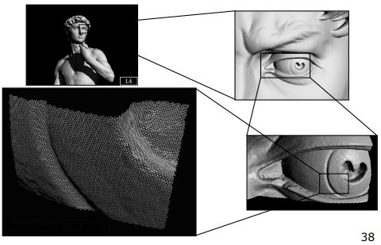
    <figcaption style="margin-top: 0.5em; text-align: center; font-size: 13px; color: #888;"><em>Şekil 7: Dijital Michelangelo Projesi: Davut heykelinin 1/4 mm çözünürlükte elde edilen 3B dijital ikizi [Levoy 2000].</em></figcaption>
  

</figure>

- **Büyük Buddha Projesi (Ikeuchi 2007):** Nara'daki devasa Buddha heykelini ve tarihi tapınakları dijitalleştirmek için dronelara entegre edilmiş yapılandırılmış ışık tarayıcıları kullanılmıştır.

<figure style="display:flex; justify-content: center; margin: 20px 0;">
  

    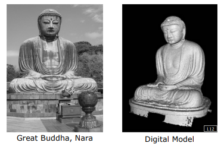
    <figcaption style="margin-top: 0.5em; text-align: center; font-size: 13px; color: #888;"><em>Şekil 8: Büyük Buddha Projesi: Nara'daki dev heykel ve oluşturulan 3B dijital modeli [Ikeuchi 2007].</em></figcaption>
  

</figure>

### 2.2 Sınırlar ve Çözülemeyen Problemler (Unsolved Problems)

Yapılandırılmış ışık teknolojisinin fiziksel sınırlamalar gereği çaresiz kaldığı bazı yüzey ve ortam türleri şunlardır:

1. **Aynasal / Metalik Yüzeyler:** Işık sadece tek bir yöne yansıdığı (gelme açısı = yansıma açısı) için kameraya geri dönemez ve derinlik haritasında boşluklar (delikler) kalır.
2. **Yarı Saydam / Saçılımlı Yüzeyler (Subsurface Scattering):** Işık mermer veya insan derisi gibi malzemelerin içine girip alt katmanlarda saçıldıktan sonra komşu piksellerden dışarı çıkar. Bu durum desen sınırlarının keskinliğini tamamen yok eder.
3. **Katılımcı Ortamlar (Participating Media):** Sisli veya bulanık su altı çekimlerinde ışık yolda hızla sönümlenir ve ortamın kendisi parlayarak (*glow*) deseni maskeler.
4. **Cam ve Tamamen Şeffaf Nesneler:** Işık kırınarak nesnenin içinden doğrudan geçip gider.
5. **Saç ve Kıl Yapıları:** Saç telleri tek bir piksel boyutundan çok daha küçük olduğu için, tek bir piksele birden fazla kılın görüntüsü düşer ve nirengi yapılamaz.

<figure style="display:flex; justify-content: center; margin: 20px 0;">
  

    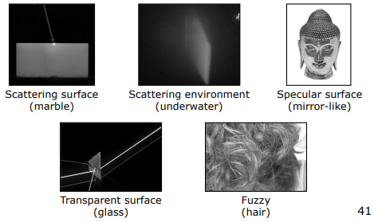
    <figcaption style="margin-top: 0.5em; text-align: center; font-size: 13px; color: #888;"><em>Şekil 9: Yapılandırılmış ışık sistemlerinin başarısız olduğu ortamlar: Yüzey altı saçılması (mermer), katılımcı ortamlar (su altı), aynasal metal, şeffaf cam ve saç telleri.</em></figcaption>
  

</figure>

### 2.3 Yapılandırılmış Işık Yöntemlerinin Karşılaştırmalı Özeti

Aşağıdaki tablo, incelenen tüm yapılandırılmış ışık yöntemlerinin gerektirdiği kare sayılarını özetlemektedir:

<figure style="display:flex; justify-content: center; margin: 20px 0;">
  

    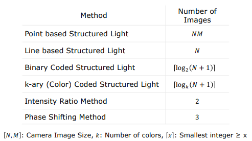
    <figcaption style="margin-top: 0.5em; text-align: center; font-size: 13px; color: #888;"><em>Şekil 10: Yapılandırılmış ışık yöntemlerinin gerektirdiği kare sayılarını karşılaştıran özet tablo.</em></figcaption>
  

</figure>

---

## 3. Uçuş Süresi Yöntemi (Time of Flight Method - ToF)

Uçuş Süresi (ToF) yöntemi, nirengi geometrisine ihtiyaç duymadan, doğrudan ışığın yayılma hızını ($c \approx 3 \times 10^8 \text{ m/s}$) temel alarak derinlik ölçer.

### 3.1 Doğadaki Kökeni ve Erken Dönem Hız Ölçümleri

- **Doğadaki Biosonar:** Yarasalar, yunuslar ve balinalar ses dalgalarının yankılanma süresini (*echolocation/sonar*) ölçerek 3D dünyayı algılarlar. ToF ise bunu ses yerine ışık dalgalarıyla yapar.

<figure style="display:flex; justify-content: center; margin: 20px 0;">
  

    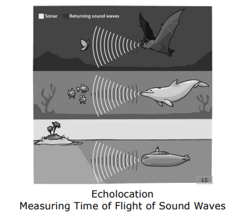
    <figcaption style="margin-top: 0.5em; text-align: center; font-size: 13px; color: #888;"><em>Şekil 11: Uçuş süresi prensibinin doğadaki kökeni: Yarasalarda, yunuslarda ve denizaltılarda ses dalgalarıyla echolocation.</em></figcaption>
  

</figure>

- **Galileo'nun Başarısız Deneyi (1600'ler):** İki tepe arasına (1000 metre mesafe, 2000m gidiş-dönüş) yerleştirilen iki kişinin fener kapaklarını açıp kapatarak ışık hızını ölçme çabasıdır. Işığın bu mesafeyi katetme süresi $6.6 \ \mu\text{s}$ iken, insan kas ve refleks hızı milisaniyeler düzeyinde kaldığı için başarısız olmuştur.

<figure style="display:flex; justify-content: center; margin: 20px 0;">
  

    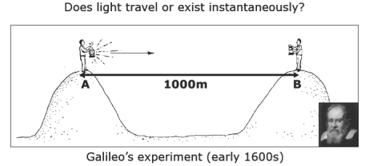
    <figcaption style="margin-top: 0.5em; text-align: center; font-size: 13px; color: #888;"><em>Şekil 12: Galileo'nun 1600'lerde iki tepe arasında ışık hızını ölçmeye çalıştığı ilk deney düzeneği.</em></figcaption>
  

</figure>

- **Fizeau'nun Çark Deneyi (1849):** Işığı dönen dişli bir çarkın arasından geçirip 8633 metre uzaktaki aynaya gönderen ve dönen dişlerin ışığı dönüş yolunda bloke etme hızını ölçerek ışık hızını $c_{\text{hesaplanan}} \approx 3.153 \times 10^8 \text{ m/s}$ olarak hesaplayan dahi bir optik düzenektir.

<figure style="display:flex; justify-content: center; margin: 20px 0;">
  

    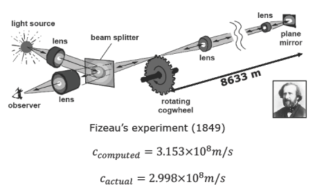
    <figcaption style="margin-top: 0.5em; text-align: center; font-size: 13px; color: #888;"><em>Şekil 13: Fizeau'nun 1849 yılında dönen dişli çark mekanizmasıyla 8633 metre mesafede ışık hızını ölçtüğü deney.</em></figcaption>
  

</figure>

### 3.2 Nabız Modülasyonu (Pulse Modulation / Flash Method)

- **Çalışma Prensibi:** Kaynaktan çok kısa ve çok güçlü tek bir ışık darbesi (*pulse*) sahneye gönderilir ve sensöre geri dönme süresi nanosaniye hassasiyetli bir kronometreyle ölçülür.
- **Dezavantajı:** Milimetrik hassasiyet için nanosaniyenin altında ölçüm yapabilen çok pahalı stop-watch donanımlarına ve çok yüksek anlık güç tüketen lazer ünitelerine ihtiyaç duyar.

<figure style="display:flex; justify-content: center; margin: 20px 0;">
  

    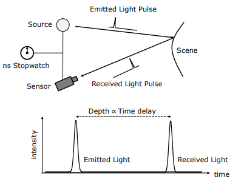
    <figcaption style="margin-top: 0.5em; text-align: center; font-size: 13px; color: #888;"><em>Şekil 14: Nabız modülasyonu (Flash ToF): Işık darbesinin gidiş-dönüş gecikme süresinin nanosaniye kronometreyle ölçülmesi.</em></figcaption>
  

</figure>

### 3.3 Kesintisiz Modülasyon (Continuous Modulation / Phase ToF)

Sayısal stop-watch kısıtlamalarını aşmak için yansıtılan ışığın parlaklığı (genliği) belirli bir yüksek frekansta (örneğin $f = 30 \text{ MHz}$) sinüzoidal olarak modüle edilir.

Yansıtılan dalga ile geri dönen dalga arasındaki faz kayması ($\varphi$) doğrudan derinliği verir.

<figure style="display:flex; justify-content: center; margin: 20px 0;">
  

    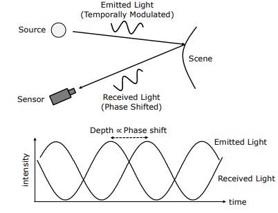
    <figcaption style="margin-top: 0.5em; text-align: center; font-size: 13px; color: #888;"><em>Şekil 15: Kesintisiz modülasyon ToF: Yansıtılan ve geri dönen sinüzoidal ışık dalgaları arasındaki faz farkı φ.</em></figcaption>
  

</figure>

#### Korelasyon Tabanlı Faz Ölçümü

Geri gelen ışık, sensör piksellerinin kazanç katsayıları yansıtma frekansıyla uyumlu kosinüsel olarak değiştirilerek (demodülasyon) çarpılır ve entegre edilir:

$$L_{emit} = \cos(\omega t)$$

$$L_{scene} = O + A \cos(\omega t - \varphi)$$

$$S_{ref} = \cos(\omega t - \delta)$$

<figure style="display:flex; justify-content: center; margin: 20px 0;">
  

    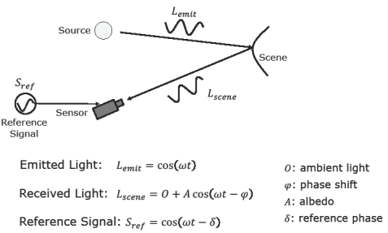
    <figcaption style="margin-top: 0.5em; text-align: center; font-size: 13px; color: #888;"><em>Şekil 16: Korelasyon tabanlı faz ölçümü parametreleri: Ortam ışığı O, albedo A, faz kayması φ ve referans fazı δ.</em></figcaption>
  

</figure>

Sensör tarafından kontrol edilen 3 farklı referans fazı ($\delta_1, \delta_2, \delta_3$) altında 3 bağımsız yoğunluk ölçülerek aranan kesin faz farkı ($\varphi$) çözülür.

#### Fazdan Derinliğe ($d$) Geçiş Formülü

Elde edilen faz farkından kesin uzaklığa geçiş denklemi:

$$d = c \frac{\varphi}{4\pi f}$$

> **Sayısal Örnek:** Modülasyon frekansı $f = 30 \text{ MHz}$ ve saptanan faz farkı $\varphi = \pi$ ise:
> $$d = (3 \times 10^8) \cdot \frac{\pi}{4\pi \cdot (30 \times 10^6)} = \frac{3 \times 10^8}{1.2 \times 10^8} = 2.5 \text{ metre}$$

### 3.4 Endüstriyel Durum ve Mobil Cihazlar

- **Otonom Araçlar (LiDAR):** Dönüşümlü tekil lazer ışınlarını mekanik olarak 360 derece döndürerek (*scanning ToF*) son derece detaylı nokta bulutları (*point clouds*) üretirler. Katı hal (*solid-state*) LiDAR teknolojileriyle bu sistemler hızla ucuzlamaktadır.

<figure style="display:flex; justify-content: center; margin: 20px 0;">
  

    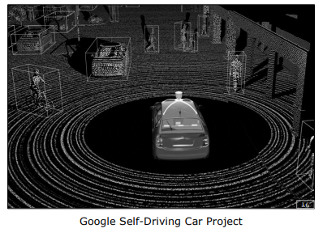
    <figcaption style="margin-top: 0.5em; text-align: center; font-size: 13px; color: #888;"><em>Şekil 17: Otonom araçlarda taramalı LiDAR / ToF sensörleri kullanılarak oluşturulan 3B nokta bulutu haritası.</em></figcaption>
  

</figure>

- **Mobil Cihazlar (Solid-State ToF):** Günümüz akıllı telefon ve tabletlerinde, tarama yapmadan tüm piksellerde aynı anda faz farkı ölçebilen mikro ToF kamera dizileri entegre edilmiştir. Bu sayede fotoğraflar sadece RGB değil, her pikselde milimetrik derinlik bilgisiyle kaydedilmektedir.
