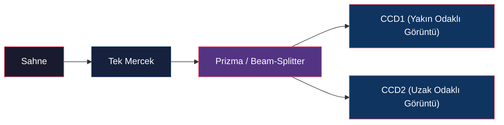

# Odaktan ve Odak Kusurundan Derinlik Çıkarma (Depth from Focus & Defocus)

<!-- toc -->

Bilgisayarlı görüde (computer vision) derinlik ve şekil çıkarma yöntemleri genellikle iki sınıfa ayrılır: **aktif yöntemler** (lazer tarayıcılar, yapılandırılmış ışık vb.) ve **pasif yöntemler** (stereo görü, hareketten şekil çıkarma vb.). Optik odak kısıtlamalarına dayanan **Odaktan Derinlik Çıkarma** (Depth from Focus - DFF) ve **Odak Kusurundan Derinlik Çıkarma** (Depth from Defocus - DFD), tek mercekli kameraların sınırlı alan derinliğini (depth of field) fiziksel bir derinlik ipucu olarak kullanan pasif ve son derece güçlü derinlik algılama teknikleridir.

<figure style="display:flex; justify-content: center; margin: 20px 0;">
  

    
    <figcaption style="margin-top: 0.5em; text-align: center; font-size: 13px; color: #888;"><em>Şekil 1: Sığ alan derinliğine sahip bir çekimde yalnızca odak düzlemindeki nesne net görünürken, önündeki ve arkasındaki nesneler odak kusuru (defocus) nedeniyle bulanıklaşır.</em></figcaption>
  

</figure>

---

## 1. Genel Bakış (Overview)

Sığ bir alan derinliğine (*shallow depth of field*) sahip bir kamera ile çekilen görüntülerde, yalnızca odak düzleminde (*plane of focus*) yer alan nesneler keskin ve net görünürken; bu düzlemin önünde veya arkasında kalan nesneler odaksızlaşarak bulanıklaşır. Optik fizik kurallarına göre, bulanıklığın miktarı ve yapısı, nesnenin odak düzlemine olan fiziksel mesafesiyle doğrudan ilişkilidir.

Ancak, tek bir görüntü üzerinden yerel bulanıklık miktarını tahmin etmek matematiksel olarak eksik belirlenmiş (*under-constrained*) bir problemdir. Bir görüntü yaması (*patch*) ele alındığında, bu yamanın odaksız çekildiği için mi bulanık göründüğü, yoksa odak düzleminde olmasına rağmen nesnenin kendi orijinal dokusunun (*texture*) mu bulanık/pürüzsüz olduğu ayırt edilemez. Örneğin, pürüzsüz ve düz boyanmış beyaz bir duvarın odaklı fotoğrafı ile bulanık bir fotoğrafı yerel olarak birbirine çok benzer.

<figure style="display:flex; justify-content: center; margin: 20px 0;">
  

    
    <figcaption style="margin-top: 0.5em; text-align: center; font-size: 13px; color: #888;"><em>Şekil 2: Yakalanan görüntü üzerindeki farklı bölgelerin odak kusuru miktarı ve bunlara karşılık gelen Nokta Yayılım Fonksiyonları (PSF).</em></figcaption>
  

</figure>

Bu belirsizliği aşmak için farklı odak ayarları veya kamera parametreleri altında çekilmiş birden fazla görüntüye ihtiyaç duyulur. Bu doğrultuda iki temel yaklaşım geliştirilmiştir:

1. **Odaktan Derinlik Çıkarma (Depth from Focus - DFF):** Odak düzlemini sahne boyunca adım adım kaydırarak geniş bir görüntü yığını (*focal stack*) toplar. Her bir piksel koordinatı için bu yığın içindeki "en keskin" ve "en yüksek kontrastlı" anı arar.
2. **Odak Kusurundan Derinlik Çıkarma (Depth from Defocus - DFD):** Genellikle sadece iki veya üç adet farklı odak/açıklık ayarına sahip görüntü toplar. Piksellerin görüntüler arasındaki bağıl bulanıklık (*relative blur*) oranlarını analiz ederek doğrudan analitik veya optimizasyon tabanlı yöntemlerle derinliği hesaplar.

---

## 2. Nokta Yayılım Fonksiyonu (Point Spread Function - PSF)

Odak kusurunun matematiksel olarak modellenebilmesi için, sahnedeki ideal bir nokta ışık kaynağının (*impulse*) sensör üzerinde oluşturduğu enerji dağılımı tanımlanmalıdır. Bu dağılıma **Nokta Yayılım Fonksiyonu** (Point Spread Function - PSF) denir.

### 2.1 Bulanıklık Çemberi Geometrisi (Circle of Confusion)

Gauss İnce Mercek Yasasına (*Gaussian Lens Law*) göre, odak uzaklığı $f$ olan bir mercekten $u$ (veya $o$) kadar uzaktaki bir sahne noktası, merceğin arkasında $v$ (veya $i$) mesafesinde kusursuz bir şekilde odaklanır:

$$\frac{1}{f} = \frac{1}{u} + \frac{1}{v}$$

<figure style="display:flex; justify-content: center; margin: 20px 0;">
  

    
    <figcaption style="margin-top: 0.5em; text-align: center; font-size: 13px; color: #888;"><em>Şekil 3: Gauss İnce Mercek Yasası (Gaussian Lens Law) optik diyagramı.</em></figcaption>
  

</figure>

Eğer görüntüyü kaydeden sensör (görüntü düzlemi) tam olarak $v$ konumunda değil de mercekten $s$ kadar uzakta duruyorsa, odaklanan ışınlar sensör üzerinde dairesel bir yama oluşturur. Mercek açıklığının (*aperture*) dairesel olduğu kabul edilirse, sensör düzleminde oluşan bu dairesel ışık konisi tabanına **Bulanıklık Çemberi** (*Blur Circle / Circle of Confusion*) denir.

<figure style="display:flex; justify-content: center; margin: 20px 0;">
  

    
    <figcaption style="margin-top: 0.5em; text-align: center; font-size: 13px; color: #888;"><em>Şekil 4: Bulanıklık Çemberi çapı ($b$) ve sensör konumu ($s$) arasındaki geometrik bağıntı.</em></figcaption>
  

</figure>

Benzer üçgenler yardımıyla, bu çemberin çapı ($b$) ile mercek açıklık çapı ($D$) arasındaki geometrik ilişki şu şekilde türetilir:

$$\frac{b}{D} = \frac{|v - s|}{v} \implies b = D \cdot s \left| \frac{1}{s} - \frac{1}{v} \right|$$

Bu denklem, odak kusurunu (bulanıklık miktarını) kontrol etmenin iki fiziksel yolu olduğunu gösterir:

1. **Sensör Konumunu Değiştirmek ($s$):** Odak düzleminin yerini sahne üzerinde ileri-geri kaydırmak.
2. **Açıklık Boyutunu Değiştirmek ($D$):** Açıklık kısılarak ($D$ küçültülerek) ışık konisi daraltılır; bu da bulanıklık çemberi çapını ($b$) küçülterek alan derinliğini artırır.

<figure style="display:flex; justify-content: center; margin: 20px 0;">
  

    
    <figcaption style="margin-top: 0.5em; text-align: center; font-size: 13px; color: #888;"><em>Şekil 5: Yöntem 1: Diyafram açıklığını ($D$) değiştirmek; Yöntem 2: Sensör konumunu ($s$) değiştirmek.</em></figcaption>
  

</figure>

---

### 2.2 Pillbox vs. Gauss Tipi PSF Modelleri

İdeal pürüzsüz bir optik sistemde, bir nokta kaynağın sensör üzerindeki aydınlık dağılımı homojen (*uniform*) bir disk olarak kabul edilebilir. Bu modele **Pillbox Fonksiyonu** denir ve uzamsal tanımı şu şekildedir:

$$h_{\text{pillbox}}(x, y) = \begin{cases} \frac{4}{\pi b^2}, & x^2 + y^2 \leq \frac{b^2}{4} \\ 0, & \text{diğer durumlarda} \end{cases}$$

Buradaki $\frac{4}{\pi b^2}$ katsayısı, lensten toplanan toplam ışık enerjisinin alan genişlese dahi korunmasını (*conservation of energy*) sağlar.

<figure style="display:flex; justify-content: center; margin: 20px 0;">
  

    
    <figcaption style="margin-top: 0.5em; text-align: center; font-size: 13px; color: #888;"><em>Şekil 6: İdeal Pillbox (Disk) Nokta Yayılım Fonksiyonu (PSF) modeli.</em></figcaption>
  

</figure>

Ancak gerçek dünyadaki optik sistemlerde; mercek kenarlarındaki ışık kırınımları (*diffraction*), merceğin geometrik ve renk sapmaları (*aberrations*), mercek yüzey pürüzleri ve piksellerin etkin ışık toplama alanlarındaki uzamsal ortalamalar nedeniyle kusursuz keskin kenarlı bir pillbox elde etmek imkansızdır. Bu bozucu etkilerin birleşimiyle, pratik nokta yayılım fonksiyonu merkeze doğru yoğunlaşan ve kenarlara doğru yumuşak sönümlenen bir **Gauss Fonksiyonu** şeklinde modellenir:

$$h_{\text{Gaussian}}(x, y) = \frac{1}{2\pi \sigma^2} e^{-\frac{x^2+y^2}{2\sigma^2}}$$

<figure style="display:flex; justify-content: center; margin: 20px 0;">
  

    
    <figcaption style="margin-top: 0.5em; text-align: center; font-size: 13px; color: #888;"><em>Şekil 7: Pratik Gauss Nokta Yayılım Fonksiyonu (PSF) modeli ($\sigma \approx b/2$).</em></figcaption>
  

</figure>

Burada Gauss'un standart sapması ($\sigma$) ile bulanıklık dairesi çapı ($b$) arasında deneysel olarak şu dönüşüm kabul edilir:

$$\sigma \approx \frac{b}{2} \propto D \cdot s \left| \frac{1}{s} - \frac{1}{v} \right|$$

---

### 2.3 Konvolüsyon ve Düşük Geçiren Filtre Karşılığı

Sahne derinliğinin yerel bir bölge içinde sabit olduğu varsayılırsa, odak kusuru işlemi doğrusal ve kaymayla değişmez (*Linear Shift-Invariant - LSI*) bir sistem olarak kabul edilir. Bu kabul altında, bulanık (*captured*) görüntü $g(x,y)$, odaklanmış net görüntü $f(x,y)$ ile nokta yayılım fonksiyonunun ($h(x,y)$) konvolüsyonuna eşittir:

$$g(x, y) = f(x, y) * h(x, y)$$

<figure style="display:flex; justify-content: center; margin: 20px 0;">
  

    
    <figcaption style="margin-top: 0.5em; text-align: center; font-size: 13px; color: #888;"><em>Şekil 8: Uzamsal düzlemde konvolüsyon modeli: Net görüntü $f_0(x,y)$ ile PSF $h(x,y)$ konvolüsyonu sonucunda bulanık görüntü $f(x,y)$ oluşur.</em></figcaption>
  

</figure>

Frekans (Fourier) düzleminde bu işlem doğrudan çarpım haline gelir:

$$G(u, v) = F(u, v) \cdot H(u, v)$$

<figure style="display:flex; justify-content: center; margin: 20px 0;">
  

    
    <figcaption style="margin-top: 0.5em; text-align: center; font-size: 13px; color: #888;"><em>Şekil 9: Frekans düzleminde 1D Fourier kesiti: Odak kusuru yüksek frekansları sönümleyen bir Alçak Geçiren Filtre (Low-Pass Filter) gibi davranır.</em></figcaption>
  

</figure>

Gauss fonksiyonunun Fourier dönüşümü yine bir Gauss fonksiyonu ürettiği için, genişleyen bir PSF ($\sigma$ büyümesi), frekans düzleminde daha dar ve keskin sönümlenen bir Gauss filtresine karşılık gelir.

Fiziksel olarak odak kusuru, görüntüye uygulanan kusursuz bir **Alçak Geçiren Filtre** (*Low-Pass Filter*) gibi çalışır. Düşük frekanslı genel şekil hatlarının geçmesine izin verirken, yüksek frekanslı ince detayları, dokuları ve keskin kenarları şiddetle baskılar. Derinlik hesaplama algoritmaları, bu yüksek frekans kaybını ölçümleyerek çalışır.

---

## 3. Odaktan Derinlik Çıkarma (Depth from Focus - DFF)

**Depth from Focus (DFF)** yöntemi, odak düzlemini sahne boyunca milimetrik adımlarla hareket ettirerek geniş bir görüntü yığını (*focal stack*) toplar ve her pikselin en yüksek frekans içeriğine ulaştığı "en odaklı" katmanı saptar.

<figure style="display:flex; justify-content: center; margin: 20px 0;">
  

    
    <figcaption style="margin-top: 0.5em; text-align: center; font-size: 13px; color: #888;"><em>Şekil 10: Farklı sensör konumlarında ($s = 50.95 \dots 51.85\text{ mm}$) çekilen odak yığınında en keskin görüntünün ($s = 51.25\text{ mm}$) seçilmesi ve derinliğin ($o$) hesaplanması.</em></figcaption>
  

</figure>

---

### 3.1 Odak Ölçütü (Focus Measure) ve Modifiye Laplacian

Odak yığınındaki görüntüler incelenirken, piksellerin yerel komşuluklarındaki yüksek frekans miktarını ölçen bir **Odak Ölçütü** (*Focus Measure*) tanımlanır. Defocus yüksek frekansları sönümlediği için, yerel parlaklık değişimlerinin (türevlerinin) büyüklüğü keskinliği gösterir.

Standart Laplacian operatöründe, yatay ve dikey yöndeki ikinci türevlerin farklı işaretler alarak birbirini sönümleme riski mevcuttur. Bu riski engellemek ve her iki yöndeki değişimi de pozitif katkı olarak toplamak amacıyla **Modifiye Laplacian** ($\nabla_M^2$) operatörü kullanılır:

$$\nabla_M^2 I = \left| \frac{\partial^2 I}{\partial x^2} \right| + \left| \frac{\partial^2 I}{\partial y^2} \right|$$

Ayrık 2D piksel ızgarasında bu kısmi türevler şu şablonlarla hesaplanır:

$$\frac{\partial^2 I}{\partial x^2} = I(x+1, y) - 2I(x, y) + I(x-1, y)$$

$$\frac{\partial^2 I}{\partial y^2} = I(x, y+1) - 2I(x, y) + I(x, y-1)$$

Uzamsal çözünürlüğü yüksek tutmak amacıyla, belirlenen $(2K+1) \times (2K+1)$ boyutlarındaki küçük bir yerel pencere (genellikle $3 \times 3$ veya $5 \times 5$) içinde bu Modifiye Laplacian değerleri toplanarak her piksel için yerel odak ölçüm skoru $M(x,y)$ elde edilir:

$$M(x, y) = \sum_{i=x-K}^{x+K} \sum_{j=y-K}^{y+K} \nabla_M^2 I(i, j)$$

<figure style="display:flex; justify-content: center; margin: 20px 0;">
  

    
    <figcaption style="margin-top: 0.5em; text-align: center; font-size: 13px; color: #888;"><em>Şekil 11: Sahnedeki farklı derinliklerde yer alan A ve B noktaları için sensör konumuna ($s$) bağlı Odak Ölçüm Skoru $M(x,y)$ değişimi.</em></figcaption>
  

</figure>

---

### 3.2 Gauss İnterpolasyonu (Gaussian Interpolation) ile Pürüzsüzleştirme

Eğer derinlik doğrudan en yüksek $M(x,y)$ skoruna sahip görüntü katmanına göre atanırsa, ölçülebilecek derinlik seviyeleri focal stack'teki görüntü sayısı ($N$) ile sınırlı kalır. Bu durum, 3B derinlik modeli üzerinde belirgin yapay basamaklar (*discrete steps / contouring artifacts*) oluşturur. Görüntü sayısını artırmak çekim süresini ve bellek ihtiyacını uzatacağı için pratik değildir.

<figure style="display:flex; justify-content: center; margin: 20px 0;">
  

    
    <figcaption style="margin-top: 0.5em; text-align: center; font-size: 13px; color: #888;"><em>Şekil 12: Ayrık örneklenmiş odak ölçümlerinin tepe noktası etrafındaki sürekli Gauss dağılımı ve gerçek odak konumu $\bar{s}$.</em></figcaption>
  

</figure>

Bu sorunu aşmak için, odak ölçüm fonksiyonunun ($M(s)$) sensör konumuna bağlı dağılımının yerel tepe noktası yakınlarında **Gauss Çanı** şeklinde davrandığı kabul edilir:

$$M(s) = M_p e^{-\frac{(s - \bar{s})^2}{2\sigma_m^2}}$$

<figure style="display:flex; justify-content: center; margin: 20px 0;">
  

    
    <figcaption style="margin-top: 0.5em; text-align: center; font-size: 13px; color: #888;"><em>Şekil 13: Gauss İnterpolasyonu parametreleri: Bilinen örnekler ($M_{s_i}, s_i$) ve bilinmeyenler ($M_p, \bar{s}, \sigma_M$).</em></figcaption>
  

</figure>

Burada $\bar{s}$ kesin odaklanmanın gerçekleştiği gerçek (*discrete* olmayan) sensör konumudur. Bu fonksiyonun her iki tarafının doğal logaritması alınarak doğrusal bir sisteme dönüştürülür:

$$\ln M(s) = \ln M_p - \frac{(s - \bar{s})^2}{2\sigma_m^2}$$

Ölçülen odak yığınından en büyük skora sahip ardışık üç discrete odak ölçümü ($M_1, M_2, M_3$) ve bunlara karşılık gelen sensör konumları ($s_1, s_2, s_3$) seçilerek, doğrusal denklem sistemi çözülür. Eşit aralıklı odak adımları ($\Delta s = s_2 - s_1 = s_3 - s_2$) kullanıldığında, alt-piksel hassasiyetinde en iyi odak konumunu ($\bar{s}$) veren kapalı form analitik formül türetilir:

$$\bar{s} = s_2 + \frac{\Delta s \left( \ln M_3 - \ln M_1 \right)}{2 \left( 2 \ln M_2 - \ln M_1 - \ln M_3 \right)}$$

Bu hesaplanan kesin $\bar{s}$ değeri Gauss ince mercek yasasına yerleştirilerek pürüzsüz ve kademesiz 3B yüzey derinlikleri başarıyla elde edilir.

<figure style="display:flex; justify-content: center; margin: 20px 0;">
  

    
    <figcaption style="margin-top: 0.5em; text-align: center; font-size: 13px; color: #888;"><em>Şekil 14: Metal küre yüzeyi: Gauss İnterpolasyonu olmadan (basamaklı yapay yüzey) ve Gauss İnterpolasyonu ile (pürüzsüz 3B rekonstrüksiyon).</em></figcaption>
  

</figure>

DFF yöntemi özellikle dar alan derinlikli objektiflere sahip mikroskopi ve endüstriyel kalite kontrol sistemlerinde yaygın kullanılır. Wafer üzerindeki mikro devrelerin ve biyolojik yapıların yüksek hassasiyetli 3B haritaları bu yöntemle çıkarılır.

<figure style="display:flex; justify-content: center; margin: 20px 0;">
  

    
    <figcaption style="margin-top: 0.5em; text-align: center; font-size: 13px; color: #888;"><em>Şekil 15: DFF mikroskopi uygulamaları: Silikon Wafer üzerindeki mikro yapılar (13 mikron yükseklik) ve Yaprak Gözenekleri (30 mikron yükseklik).</em></figcaption>
  

</figure>

> **Önemli Kısıtlama:** DFF yönteminin çalışması için yüzeyin görsel bir dokuya (*surface texture*) sahip olması şarttır; dokusuz pürüzsüz yüzeylerde kontrast değişimi ölçülemez.

---

## 4. Odak Kusurundan Derinlik Çıkarma (Depth from Defocus - DFD)

DFF yöntemi yüksek hassasiyet sunsa da, onlarca görüntü toplama gereksinimi gerçek zamanlı video çekim hızları (30 FPS) için çok yavaştır. **Depth from Defocus (DFD)** ise, en az iki görüntünün bağıl bulanıklık farkını inceleyerek aynı işlemi çok daha hızlı çözmeyi amaçlar.

<figure style="display:flex; justify-content: center; margin: 20px 0;">
  

    
    <figcaption style="margin-top: 0.5em; text-align: center; font-size: 13px; color: #888;"><em>Şekil 16: İki farklı diyafram açıklığı ($D_1, D_2$) ile elde edilen farklı genişlikteki PSF'ler ($\sigma_1, \sigma_2$).</em></figcaption>
  

</figure>

---

### 4.1 Naif DFD Çözümü (Ratio of Fourier Transforms)

Aynı odaklı $f(x,y)$ sahnesinin, iki farklı bilinmeyen açıklık çapı ($D_1, D_2$) ile çekilen iki görüntüsünü ($g_1, g_2$) ele alalım. Bu görüntüler iki farklı PSF genişliği ($\sigma_1, \sigma_2$) ile oluşacaktır. Elimizde üç bilinmeyen ($f, \sigma_1, \sigma_2$) olmasına rağmen, donanım kontrolümüzde olduğu için açıklık çaplarının oranını yani PSF genişliklerinin oranını kesinlikle biliriz:

$$\frac{\sigma_1}{\sigma_2} = \frac{D_1}{D_2} \implies \sigma_2 = \sigma_1 \frac{D_2}{D_1}$$

<figure style="display:flex; justify-content: center; margin: 20px 0;">
  

    
    <figcaption style="margin-top: 0.5em; text-align: center; font-size: 13px; color: #888;"><em>Şekil 17: DFD denklem sistemi: 3 bilinmeyen ve 3 bağımsız denklem (Uzamsal ve Fourier düzleminde).</em></figcaption>
  

</figure>

Böylelikle 3 bilinmeyen ve 3 bağımsız denklem elde edilmiş olur. Bu denklemleri Fourier düzlemine taşıdığımızda:

$$G_1(u, v) = F(u, v) \cdot H_{\sigma_1}(u, v)$$

$$G_2(u, v) = F(u, v) \cdot H_{\sigma_2}(u, v)$$

İki görüntünün Fourier dönüşüm oranları hesaplandığında, sahne içeriği ve pürüzsüzlük dokusu olan $F(u,v)$ terimi birbirini kusursuz şekilde götürür (sadeleşir):

$$\frac{G_1(u, v)}{G_2(u, v)} = \frac{H_{\sigma_1}(u, v)}{H_{\sigma_2}(u, v)}$$

Gauss tipi PSF'lerin Fourier karşılıkları yerleştirilip iki tarafın doğal logaritması alındığında, tek bilinmeyenli ($\sigma_1$ cinsinden) şu analitik denklem elde edilir:

$$\sigma_1^2 - \sigma_2^2 = \frac{\ln G_2(u, v) - \ln G_1(u, v)}{2 \pi^2 (u^2 + v^2)}$$

Bu denklemden elde edilen $\sigma_1$ genişliği doğrudan bulanıklık dairesi çapına ($b_1 = 2\sigma_1$) dönüştürülerek nesne mesafesi ($u$) çözülür.

> **Uyarı:** Bu naif yöntem, paydada yüksek frekansları ($u^2+v^2$) barındırdığı ve yüksek frekanslar sensör gürültüsünden (*noise*) en çok etkilenen yerler olduğu için gürültü karşısında kararsızdır.

---

### 4.2 Rekonstrüksiyon Tabanlı Kararlı DFD

Gürültü hassasiyetini sönümlemek amacıyla Favaro (2003) ve Pentland (1987) tarafından geliştirilen optimizasyona dayalı bu modelde, gerçek odaklı görüntü ($f$) ve bulanıklık parametresi ($\sigma_1$) birer optimizasyon değişkeni olarak tutulur. Amaç, toplanan iki görüntünün teorik yeniden inşaları arasındaki karesel hatayı (*reconstruction error - E*) minimize etmektir:

$$E = \iint \left( g_1(x, y) - h_{\sigma_1} * f(x, y) \right)^2 dx dy + \iint \left( g_2(x, y) - h_{\sigma_1 \frac{D_2}{D_1}} * f(x, y) \right)^2 dx dy$$

Bu fonksiyonun $\sigma_1$ ve $f$ parametrelerine göre kısmi türevleri sıfıra eşitlenerek ($\frac{\partial E}{\partial \sigma_1} = 0, \frac{\partial E}{\partial f} = 0$) iteratif optimizasyon algoritmalarıyla gürültüye son derece dayanıklı, kararlı ve pürüzsüz 3B rekonstrüksiyon sonuçları elde edilir.

---

### 4.3 Gerçek Zamanlı (Video-Rate) DFD Sistem Mimarisi (Nayar 1996)

Nayar tarafından geliştirilen bu özel donanımda, tek bir lensin arkasına yerleştirilen ışık bölücü prizma (*beam-splitter*) sayesinde gelen ışık ikiye ayrılır. İki adet özdeş CCD sensör (CCD1 ve CCD2) farklı optik yol uzunluklarına (*displaced path lengths*) yerleştirilir.

Bu sayede, tek bir deklanşör tetikleriyle aynı sahneye ait biri yakın-odaklı (*near-focused*), diğeri uzak-odaklı (*far-focused*) iki görüntü aynı anda (*simultaneous*) yakalanır ve 30 FPS video hızında gerçek zamanlı 3B derinlik haritası hesaplanır.

---

### 4.4 Dokusuz (Textureless) Yüzeyler İçin Aktif Aydınlatma

DFF ve DFD yöntemleri yüksek frekanslı dokuların analizine dayandığından, pürüzsüz beyaz bir duvar veya fincan üzerinde çalışamazlar. Bu sınırlamayı aşmak için sisteme yerleştirilen özel bir projektör ve desenli maske (*active illumination mask*) yardımıyla, nesne üzerine mikro düzeyde yapay ve yüksek frekanslı bir kontrast deseni yansıtılır. Nesne bu deseni kendi dokusu gibi benimsediği için, dokusuz nesnelerin veya hareket eden bir elin derinliği dahi kusursuz bir hassasiyetle hesaplanabilir.

<figure style="display:flex; justify-content: center; margin: 20px 0;">
  

    
    <figcaption style="margin-top: 0.5em; text-align: center; font-size: 13px; color: #888;"><em>Şekil 18: Nayar'ın çift sensörlü ve aktif aydınlatma desenli gerçek zamanlı DFD donanım kurulumu.</em></figcaption>
  

</figure>

---

## 5. Özetleyici Teknik Karşılaştırma Matrisi

| Özellik / Metot | Depth from Focus (DFF) | Depth from Defocus (DFD) |
| :--- | :--- | :--- |
| **Gereken Görüntü Sayısı** | Çok sayıda ($10 \sim 100$ arası Focal Stack) | En az 2 (Farklı diyafram veya odak ayarında) |
| **Matematiksel Yaklaşım** | Lokal Modifiye Laplacian ($\nabla_M^2$) ve 3-nokta Gauss İnterpolasyonu | PSF oranlama veya iteratif karesel rekonstrüksiyon optimizasyonu |
| **Derinlik Çözünürlüğü** | Son derece yüksek (Mikroskop seviyesinde hassasiyet) | Orta-Yüksek (Video hızı ve gerçek zamanlı takip için ideal) |
| **Hesaplama Süresi** | Yüksek (Yığındaki tüm resimlerin taranması gerekir) | Çok Düşük (Sadece 2 resim arasındaki bağıl fark çözülür) |
| **Doku Gereksinimi** | Şarttır. Dokusuz alanlarda odak ölçütü çalışmaz. | Şarttır. Ancak Aktif Yapay Aydınlatma Maskesi ile çözülebilir. |
| **Donanım Mimarisi** | Motorize odak kaydırma mekanizmaları | Çift sensörlü, beam-splitter prizmalı real-time kameralar |
| **Temel Uygulama Alanı** | Mikroskopi, endüstriyel kalite kontrol, tıbbi cihazlar | Tüketici elektroniği, mobil kameralar, gerçek zamanlı video takibi |
