# Kalibrasyon Tabanlı Fotometrik Stereo, Normalden Şekil Çıkarma ve İç Yansımalar

<!-- toc -->

## 1. Kalibrasyon Tabanlı Fotometrik Stereo (Calibration-Based Photometric Stereo)

Gerçek dünyadaki birçok malzeme (parlak plastikler, vernikli ahşaplar, metaller) kusursuz Lambertian matlığa sahip değildir; üzerlerinde karmaşık difüz ve aynasal (*specular*) yansımalar barındırırlar. Bu tür malzemelerin yansıtma haritalarını analitik formüllerle matematiksel olarak yazmak imkansızdır.

Bu kısıtlamayı aşmak için veriye dayalı (*data-driven*) bir yöntem olan **Kalibrasyon Tabanlı Fotometrik Stereo (Calibration-Based Photometric Stereo)** uygulanır.

<figure style="display:flex; justify-content: center; margin: 20px 0;">
  

    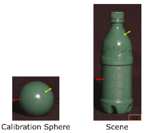
    <figcaption style="margin-top: 0.5em; text-align: center; font-size: 13px; color: #888;"><em>Görsel 1: Yönelim tutarlılığı ilkesi: Aynı malzemeden yapılan kalibrasyon küresi ve hedef nesnede aynı normal açısına sahip noktalar aynı parlaklık değerlerini verir.</em></figcaption>
  

</figure>

### 1.1 Yönelim Tutarlılığı İlkesi (Orientation Consistency)

Kalibrasyon tabanlı yaklaşımın temeli şu ilkeye dayanır: **Eğer iki farklı nesne aynı malzemeden üretilmişse ve uzayda aynı aydınlatma koşulları altında aynı yüzey yönelimine (normal açısına) sahiplerse, kamerada tamamen aynı piksel parlaklık kombinasyonlarını üretmek zorundadırlar.**

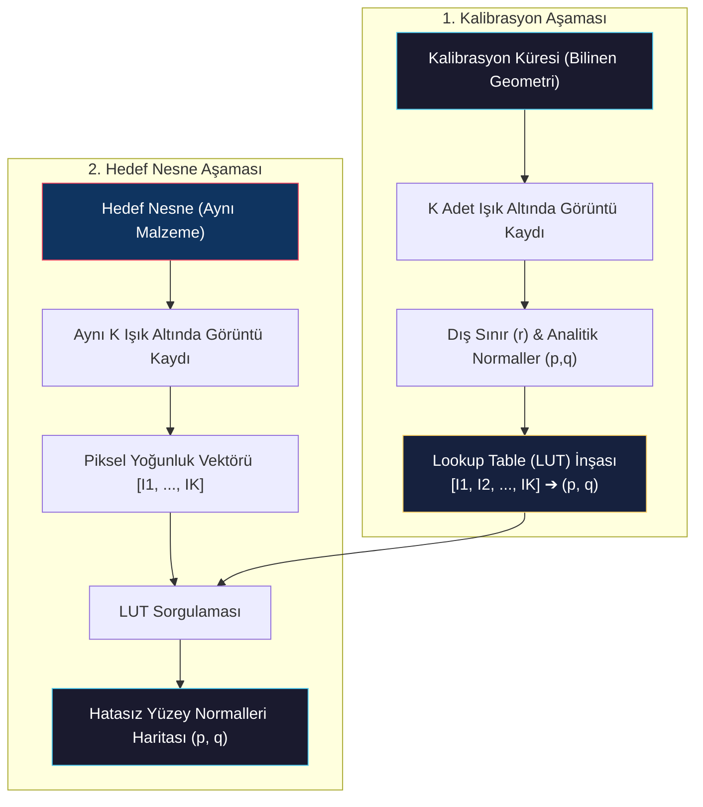

### 1.2 Uygulama Adımları

1. **Kalibrasyon Nesnesi:** Hedef nesneyle birebir aynı malzemeyle kaplanmış, geometrisi kusursuz olarak bilinen bir **kalibrasyon küresi (calibration sphere)** hazırlanır.
2. **Küre Görüntülerinin Kaydı:** Küre, hedef nesneyi aydınlatacak aynı $K$ adet ışık kaynağıyla sırayla aydınlatılarak $K$ adet görüntüsü kaydedilir.

<figure style="display:flex; justify-content: center; margin: 20px 0;">
  

    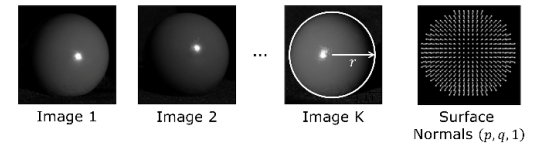
    <figcaption style="margin-top: 0.5em; text-align: center; font-size: 13px; color: #888;"><em>Görsel 2: Kalibrasyon küresinin K adet aydınlatma altındaki görüntüleri, dairesel sınır tespiti (r) ve hesaplanan analitik yüzey normalleri (p,q,1).</em></figcaption>
  

</figure>

3. **Analitik Normal Haritası:** Kürenin dairesel dış sınırları (*occluding boundary*) saptanarak, küre üzerindeki her bir pikselin kesin yüzey normali doğrultusu ($p, q$) analitik geometri üzerinden hesaplanır.
4. **Lookup Table (LUT) İnşası:** Küre üzerindeki piksellerden ölçülen $K$-lı parlaklık kombinasyonu $[I_1, I_2, \dots, I_K]$ indeks (anahtar) olarak; o piksellerdeki bilinen normal $[p, q]$ ise tablonun değeri olarak kaydedilir.
5. **Hedef Nesne Saptaması:** Hedef nesne aynı $K$ ışıkla aydınlatılıp görüntüleri çekilir. Nesne üzerindeki herhangi bir pikselden okunan parlaklık kombinasyonu doğrudan bu LUT tablosunda aratılarak karşılık gelen $[p, q]$ normali anında atanır.

<figure style="display:flex; justify-content: center; margin: 20px 0;">
  

    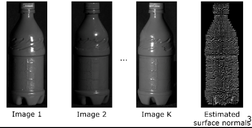
    <figcaption style="margin-top: 0.5em; text-align: center; font-size: 13px; color: #888;"><em>Görsel 3: Hedef karmaşık nesne (plastik şişe) görüntüleri ve LUT tablosu sorgusuyla kestirilen yerel yüzey normalleri.</em></figcaption>
  

</figure>

Bu sayede hiçbir yansıtma fiziği denklemine ihtiyaç duyulmadan, her türlü karmaşık ve pürüzlü endüstriyel malzemenin yüzey normal haritası sıfır hatayla elde edilir.

<figure style="display:flex; justify-content: center; margin: 20px 0;">
  

    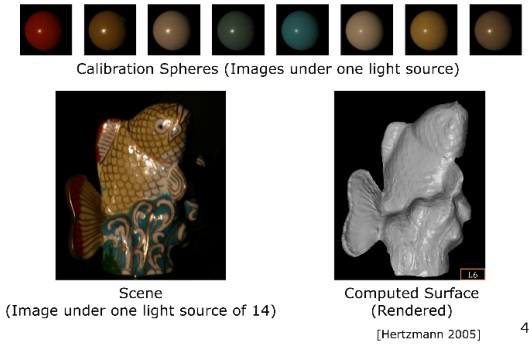
    <figcaption style="margin-top: 0.5em; text-align: center; font-size: 13px; color: #888;"><em>Görsel 4: Hertzmann (2005) uygulaması: Çoklu kalibrasyon küreleri kullanılarak cilalı seramik balık figürünün karmaşık yansımalara rağmen 3D rekonstrüksiyonu.</em></figcaption>
  

</figure>

> **Key Insight:** Kalibrasyon tabanlı yöntem, yansıma matematiğini analitik olarak modellemek yerine fiziksel bir kalibrasyon küresi üzerinden deneysel olarak haritalandırır. Bu durum, BRDF modeli bilinmeyen parlak ve karmaşık yüzeylerde mükemmel sonuç verir.

---

## 2. Normallerden Şekil Çıkarma (Shape from Surface Normals)

Fotometrik stereo uygulandıktan sonra her piksel için yüzey yönelim eğimleri ($p, q$) elde edilmiş olur. Nihai amacımız bu kısmi türev bileşenlerini entegre ederek nesnenin asıl derinlik haritasını ($z(x,y)$) oluşturmaktır.

<figure style="display:flex; justify-content: center; margin: 20px 0;">
  

    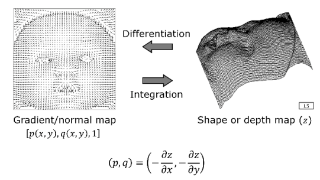
    <figcaption style="margin-top: 0.5em; text-align: center; font-size: 13px; color: #888;"><em>Görsel 5: Yüzey gradyan/normal haritası [p, q, 1] ile 3D derinlik haritası z(x,y) arasındaki türev (Differentiation) ve entegrasyon (Integration) ilişkisi.</em></figcaption>
  

</figure>

### 2.1 Naif Yol İntegrasyonu (Path Integration) ve Gürültü Çöküşü

Teorik olarak, sol-üst köşeye $z(x_0, y_0) = 0$ referansı atanıp, komşu hücreler arasındaki gradyan farkları ($p$ ve $q$) boyunca entegrasyon yapılarak her noktanın derinliği hesaplanabilir:

$$z(x, y) = z(x_0, y_0) + \int_{x_0}^{x} -p \, dx + \int_{y_0}^{y} -q \, dy$$

<figure style="display:flex; justify-content: center; margin: 20px 0;">
  

    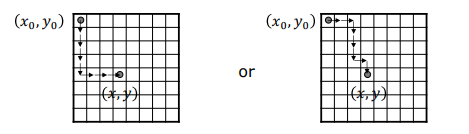
    <figcaption style="margin-top: 0.5em; text-align: center; font-size: 13px; color: #888;"><em>Görsel 6: Ayrık piksel ızgarasında (x0, y0) noktasından (x, y) noktasına farklı iki entegrasyon yolu (Path 1 ve Path 2).</em></figcaption>
  

</figure>

Ancak gerçek ölçümlerde yoğun gürültüler mevcuttur. Gürültülü bir gradyan haritasında, seçilen entegrasyon yoluna göre (örneğin önce sağa sonra aşağı gitmek ile önce aşağı sonra sağa gitmek arasında) piksellerde tamamen farklı derinlik değerleri birikir.

<figure style="display:flex; justify-content: center; margin: 20px 0;">
  

    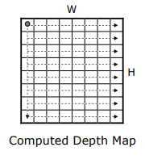
    <figcaption style="margin-top: 0.5em; text-align: center; font-size: 13px; color: #888;"><em>Görsel 7: Taraftaki satır ve sütunlar boyunca biriken gradyan gürültüsünün haritadaki ilerleyişi.</em></figcaption>
  

</figure>

Hatalar dalga dalga yayılarak yüzeyde süreksizliklere ve yırtılmalara yol açar, yüzeyi tamamen tanınmaz hale getirir.

<figure style="display:flex; justify-content: center; margin: 20px 0;">
  

    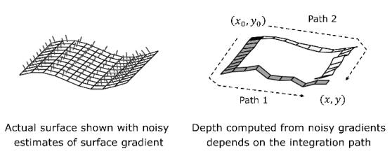
    <figcaption style="margin-top: 0.5em; text-align: center; font-size: 13px; color: #888;"><em>Görsel 8: Gerçek yüzey gradyanlarındaki gürültü nedeniyle Path 1 ve Path 2 entegrasyonlarının uyumsuzluğu ve yüzey yırtılması.</em></figcaption>
  

</figure>

### 2.2 Frankot-Chellappa Entegrasyon Algoritması (Fourier Domain Least Squares)

Gürültü birikimini önlemek amacıyla, hesaplanacak derinlik haritasının kısmi türevleri ile fotometrik stereodan ölçülen $p$ ve $q$ değerleri arasındaki karesel farkı tüm görüntü boyunca minimize eden bir **En Küçük Kareler (Least Squares)** hata fonksiyonu kurulur:

$$D = \iint \left[ \left( \frac{\partial z}{\partial x} + p \right)^2 + \left( \frac{\partial z}{\partial y} + q \right)^2 \right] dx \, dy$$

Bu optimizasyon problemi, **Frankot-Chellappa (1988)** tarafından frekans (Fourier) düzlemine taşınarak tek bir matematiksel adımda çözülmüştür.

Derinlik görüntüsü $z(x,y)$'nin 2D Fourier dönüşümü $Z(u,v)$, ölçülen gradyanların Fourier dönüşümleri sırasıyla $P(u,v)$ ve $Q(u,v)$ olmak üzere, Fourier türev alma özelliği ($\mathcal{F}\{\frac{\partial z}{\partial x}\} = i u Z(u,v)$) kullanılarak hata sıfıra eşitlendiğinde en uygun derinlik spektrumu elde edilir:

$$Z(u, v) = \frac{-i u P(u, v) - i v Q(u, v)}{u^2 + v^2}$$

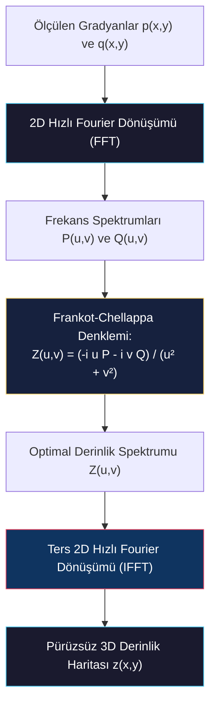

Hesaplanan bu spektrumun **Ters Hızlı Fourier Dönüşümü (IFFT)** hesaplandığında, gürültülerden arındırılmış, global olarak en tutarlı ve pürüzsüz 3D derinlik haritası ($z(x,y)$) saniyeler içinde rekonstrükt edilmiş olur.

<figure style="display:flex; justify-content: center; margin: 20px 0;">
  

    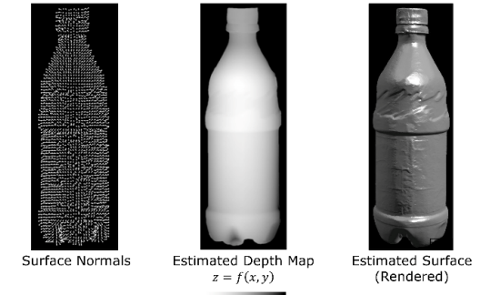
    <figcaption style="margin-top: 0.5em; text-align: center; font-size: 13px; color: #888;"><em>Görsel 9: Frankot-Chellappa Fourier entegrasyonu: Yüzey normalleri, kestirilen kesintisiz derinlik haritası z = f(x,y) ve işlenmiş 3D model.</em></figcaption>
  

</figure>

> **Key Insight:** Frankot-Chellappa algoritması lokal yol integrasyonu yapmak yerine tüm görüntüyü Fourier frekans etki alanında global olarak optimize eder. Bu sayede lokal gradyan gürültüleri yüzeyi bozamaz.

---

## 3. Karşılıklı Yansımalar (Interreflections)

Fotometrik stereonun en büyük basitleştirici kabullerinden biri, sahnedeki bir noktanın sadece doğrudan ışık kaynağından gelen ışınlarla aydınlandığı varsayımıdır. Ancak nesne içbükey (*concave*) bir geometriye sahipse (örneğin kase, fincan veya derin bir oluk), bu varsayım geçerliliğini yitirir.

<figure style="display:flex; justify-content: center; margin: 20px 0;">
  

    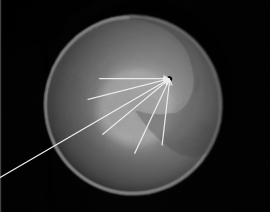
    <figcaption style="margin-top: 0.5em; text-align: center; font-size: 13px; color: #888;"><em>Görsel 10: İçbükey yüzeylerde karşılıklı yansımalar: Bir noktaya doğrudan gelen ışık ışınının yanı sıra komşu yüzey piksellerinden yansıyan ikincil ışınlar.</em></figcaption>
  

</figure>

### 3.1 Karşılıklı Yansıma Probleminin Bozucu Etkileri

1. **Çoklu Yansımalar (Multiple Bounces):** İçbükey bir yüzeyin üzerindeki bir nokta, doğrudan kaynaktan gelen ışığın yanı sıra, etrafındaki komşu yüzey piksellerinin yansıttığı ikincil ve üçüncül ışınlarla da aydınlanır.
2. **Albedo Aşırı Tahmini (Overestimation of Albedo):** Noktalar ikincil ışıklar nedeniyle normalden çok daha parlak göründüğü için, fotometrik stereo sonucunda hesaplanan albedo ($\rho$) değerleri gerçekte olduğundan çok daha yüksek çıkar.
3. **Yüzeyin Sığlaşması (Underestimation of Surface Tilt):** Yüzey normallerinin eğim açıları ikincil aydınlatmalar yüzünden daha dik saptanır; bu durum derinlik entegrasyonuna girdiğinde içbükey nesnelerin gerçekte olduğundan çok daha sığ (*shallower*) hesaplanmasına yol açar.

### 3.2 Nayar-Ikeuchi-Kanade (1991) İteratif Algoritması

Karşılıklı yansımaların bozucu etkilerini gidermek amacıyla **Nayar, Ikeuchi ve Kanade (1991)** tarafından önerilen iteratif yöntem uygulanır:

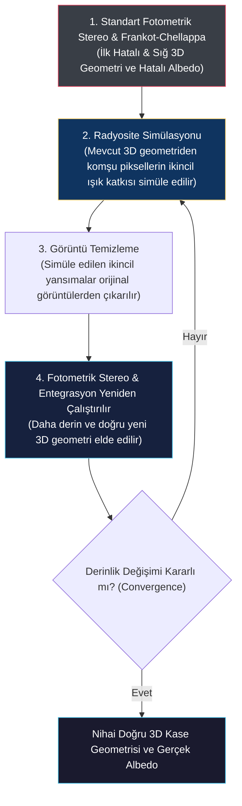

#### İteratif Çalışma Adımları:

1. **İlk Kaba Tahmin:** Karşılıklı yansımalar tamamen ihmal edilerek standart fotometrik stereo ile ilk "hatalı ve sığ" derinlik profili ve hatalı albedo haritası hesaplanır.
2. **Yansıma Simülasyonu:** Hesaplanan bu ilk kaba 3D geometri kullanılarak, her noktanın birbirine yansıtabileceği ikincil difüz ışık miktarları (radyosite denklemleriyle) sayısal olarak simüle edilir.
3. **Görüntü Temizleme:** Simüle edilen bu ikincil yansıma katkıları, orijinal kamera görüntülerindeki piksel yoğunluklarından çıkarılarak görüntüler temizlenir (*interreflection-compensated images*).
4. **Yeniden Rekonstrüksiyon:** Temizlenen bu görüntülerle fotometrik stereo ve Frankot-Chellappa entegrasyonu yeniden çalıştırılarak daha derin ve doğru bir 3D yüzey elde edilir.
5. **Döngü ve Yakınsama:** Bu süreç (geometriyi güncelleme, yansımayı düşürme, yeniden çözme) yüzey derinlik değişimi kararlı hale gelene kadar iteratif olarak tekrarlanır.

<figure style="display:flex; justify-content: center; margin: 20px 0;">
  

    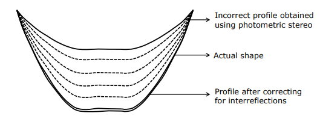
    <figcaption style="margin-top: 0.5em; text-align: center; font-size: 13px; color: #888;"><em>Görsel 11: Nayar-Ikeuchi-Kanade algoritmasının yakınsaması: Naif fotometrik stereo ile elde edilen hatalı sığ profilden (üst çizgi), ikincil yansıma düzeltmeleriyle gerçek derin kase profilinde (alt çizgi) kararlı yakınsama.</em></figcaption>
  

</figure>

> **Key Insight:** İçbükey yapılarda ikincil yansımalar yüzeyi sığ gösterir. Nayar-Ikeuchi-Kanade algoritması, sayısal simülasyonla ikincil ışık bileşenlerini görüntülerden adım adım çıkartarak gerçek derin geometrik profile tam olarak yakınsar.
