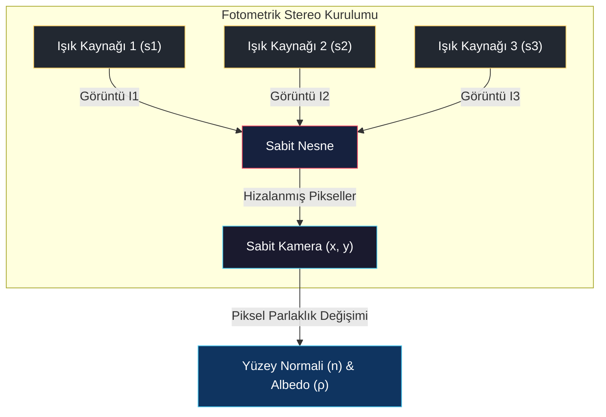
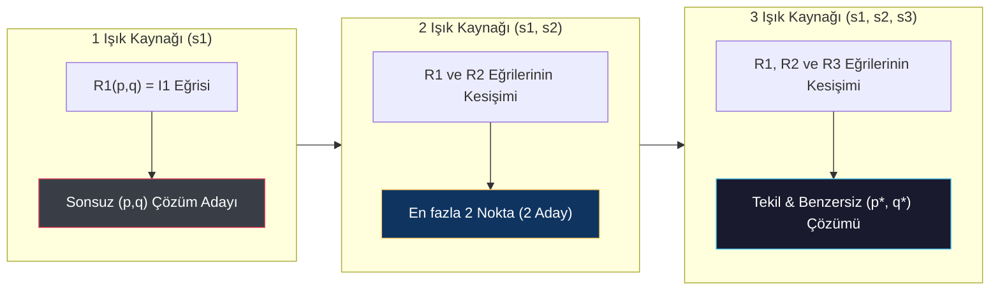
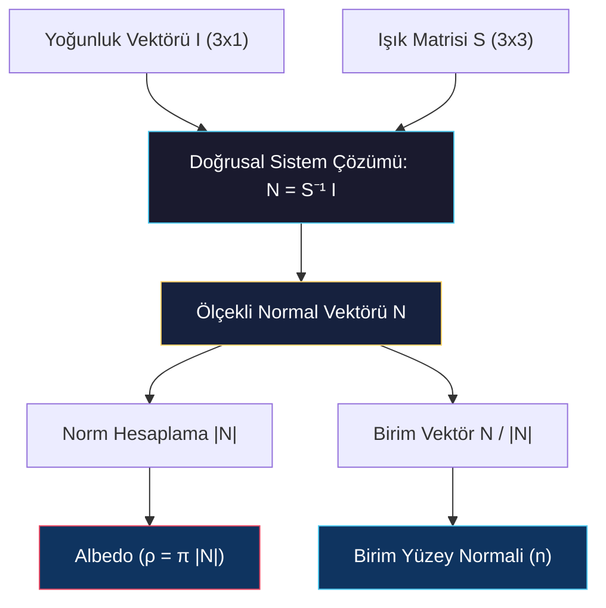

# Genel Bakış, Gradyan Uzayı, Yansıtma Haritası ve Lambertian Durumu

<!-- toc -->

## 1. Genel Bakış (Overview)

Üç boyutlu dünyayı tek bir iki boyutlu görüntü üzerinden anlamlandırmaya çalışmak (örneğin derinlik hesabı yapmak), bilgisayarlı görüde her zaman eksik belirlenmiş (**under-constrained / ill-posed**) bir problem olmuştur. **Shape from Shading (Gölgelendirmeden Şekil Çıkarma)** gibi tek görüntülü yaklaşımlar, tek bir piksel yoğunluğundan yüzeyin iki boyutlu eğimini ($p, q$) bulmaya çalışır ve sonsuz sayıda olası çözüm üretir (sonsuz belirsizlik / *infinite ambiguity*).

<figure style="display:flex; justify-content: center; margin: 20px 0;">
  

    
    <figcaption style="margin-top: 0.5em; text-align: center; font-size: 13px; color: #888;"><em>Görsel 1: Fotometrik Stereo görüntü alma düzeneği ve piksel parlaklık denklemi I = F(Source, Normal n, Reflectance).</em></figcaption>
  

</figure>

Bu kısıtlamayı aşmak amacıyla **Robert Woodham (1980)** tarafından önerilen **Fotometrik Stereo (Photometric Stereo)**, kontrollü aydınlatma düzeneğine sahip ortamlarda (örneğin endüstriyel tarayıcılar ve kalite kontrol sistemleri) 3D şekil tespiti için devrimsel bir yaklaşım sunar.

### 1.1 Temel Varsayımlar ve Çalışma Düzeni

Fotometrik Stereonun güvenilir 3D yeniden yapılandırma yapabilmesi için üç temel fiziksel varsayım geçerlidir:

1. **Kamera Sabittir:** Görüntü kaydı boyunca kamera ve nesne milimetrik olarak dahi kımıldamaz. Bu sayede tüm görüntülerdeki piksel koordinatları ($x, y$) geometrik olarak birbirleriyle kusursuz bir şekilde hizalıdır (*co-registered*).
2. **Işık Kaynakları Değişkendir:** Nesne, konumları ve parlaklık şiddetleri hassas bir şekilde bilinen en az 3 farklı ışık kaynağıyla sırasıyla (tek tek) aydınlatılır.
3. **Piksel Yoğunluk Değişimi:** Aynı pikselin farklı aydınlatma koşullarında gösterdiği parlaklık dalgalanmaları, doğrudan o pikselin temsil ettiği yerel yüzey normali vektörünün ($\mathbf{n}$) doğrultusunu verir.

> **Key Insight:** Kamera geometrisi sabit tutulup yalnızca aydınlatma yönü değiştirildiğinde, pikseller arasındaki piksel eşleştirme (*correspondence*) problemi tamamen ortadan kalkar. Her pikselin yoğunluk değişimi doğrudan yerel yüzey normalinin bir fonksiyonu haline gelir.

---

## 2. Gradyan Uzayı ve Yansıtma Haritası (Gradient Space & Reflectance Map)

Fotometrik stereoda yüzey yönelimlerini matematiksel ve geometrik olarak ifade etmek için **Gradyan Uzayı ($p-q$ düzlemi)** ve **Yansıtma Haritası** kavramları kullanılır.

### 2.1 Gradyan Uzayı (Gradient Space)

Üç boyutlu uzayda sürekli bir yüzeyi $z = f(x, y)$ fonksiyonu olarak tanımlayalım. Bu yüzeyin kısmi türevlerinin negatifi, yüzeyin yerel doğrultu eğimlerini yani gradyan bileşenlerini ($p, q$) verir:

$$p = -\frac{\partial z}{\partial x}, \quad q = -\frac{\partial z}{\partial y}$$

Bu tanım altında, yüzey üzerindeki herhangi bir noktanın ölçeklenmemiş yüzey normali vektörü $\mathbf{N}$ şu şekilde yazılır:

$$\mathbf{N} = \begin{bmatrix} p \\ q \\ 1 \end{bmatrix}$$

Bu vektörün kendi normuna bölünmesiyle, birim yarım küre üzerindeki birim yüzey normali vektörü ($\mathbf{n}$) elde edilir:

$$\mathbf{n} = \frac{\mathbf{N}}{|\mathbf{N}|} = \frac{1}{\sqrt{p^2 + q^2 + 1}} \begin{bmatrix} p \\ q \\ 1 \end{bmatrix}$$

<figure style="display:flex; justify-content: center; margin: 20px 0;">
  

    
    <figcaption style="margin-top: 0.5em; text-align: center; font-size: 13px; color: #888;"><em>Görsel 2: z = 1 projeksiyon düzleminde N(p, q, 1) ve S(ps, qs, 1) ile gradyan uzayı (p-q düzlemi) parametrizasyonu.</em></figcaption>
  

</figure>

#### Geometrik Yorum:
Görüntü düzlemimize paralel ve $z = 1$ mesafesinde yer alan bir düzlem hayal edelim. Orijinden çıkan bir yüzey normali doğrusal olarak uzatılıp bu düzlemle kesiştirildiğinde, kesişim noktasının 2D koordinatları doğrudan o yüzeyin $(p, q)$ gradyan değerlerine karşılık gelir. Elde edilen bu $p-q$ koordinat düzlemine **gradyan uzayı (gradient space)** adı verilir.

<figure style="display:flex; justify-content: center; margin: 20px 0;">
  

    
    <figcaption style="margin-top: 0.5em; text-align: center; font-size: 13px; color: #888;"><em>Görsel 3: Uzak ışık kaynağı s ve v = (0,0,1) bakış doğrultusu altında ölçekli yüzey normali N(p, q, 1).</em></figcaption>
  

</figure>

Aynı kutupsal parametrizasyon, sahneyi aydınlatan uzak bir noktasal ışık kaynağının doğrultu vektörünü ($\mathbf{s}$) tanımlamak için de kullanılır:

$$\mathbf{s} = \frac{1}{\sqrt{p_s^2 + q_s^2 + 1}} \begin{bmatrix} p_s \\ q_s \\ 1 \end{bmatrix}$$

### 2.2 Yansıtma Haritası (Reflectance Map - $R(p,q)$)

Malzemenin yansıtma özellikleri (BRDF), ışık kaynağının konumu ($\mathbf{s}$) ve parlaklığı bilindiğinde; yüzey yönelimi ($p, q$) ile kamerada ölçülecek piksel yoğunluğu ($I$) arasındaki ilişkiyi kuran fonksiyona **Yansıtma Haritası ($R(p, q)$)** denir:

$$I(x, y) = R(p, q)$$

İdeal mat (Lambertian) bir yüzey için, tüm radyometrik katsayılar normalleştirildiğinde parlaklık sadece birim yüzey normali ile birim ışık vektörünün nokta çarpımına (Kosinüs Yasası) eşittir:

<figure style="display:flex; justify-content: center; margin: 20px 0;">
  

    
    <figcaption style="margin-top: 0.5em; text-align: center; font-size: 13px; color: #888;"><em>Görsel 4: İdeal mat (Lambertian) yüzeylerde farklı geliş açılarındaki ışığın tüm yönlere eşit yayılımı (Örnek: Toprak saksı).</em></figcaption>
  

</figure>

$$I = \cos\theta_i = \mathbf{n} \cdot \mathbf{s}$$

<figure style="display:flex; justify-content: center; margin: 20px 0;">
  

    
    <figcaption style="margin-top: 0.5em; text-align: center; font-size: 13px; color: #888;"><em>Görsel 5: Işık kaynağı vektörü s ile yüzey normali n arasındaki geliş açısı θi ve v = (0,0,1) kamera doğrultusu.</em></figcaption>
  

</figure>

Bu nokta çarpımı gradyan uzayındaki ($p, q$ cinsinden) parametrelerle açık olarak yazıldığında Lambertian yüzeyler için genel yansıtma haritası formülü türetilmiş olur:

$$R(p, q) = \frac{p p_s + q q_s + 1}{\sqrt{p^2 + q^2 + 1} \sqrt{p_s^2 + q_s^2 + 1}}$$

<figure style="display:flex; justify-content: center; margin: 20px 0;">
  

    
    <figcaption style="margin-top: 0.5em; text-align: center; font-size: 13px; color: #888;"><em>Görsel 6: Gradyan uzayında yansıtma haritası R(p,q) ve maksimum parlaklığın oluştuğu (ps, qs) merkez noktası.</em></figcaption>
  

</figure>

### 2.3 Eş-Parlaklık Eğrileri (Iso-Brightness Contours)

Yansıtma haritası üzerinde aynı yoğunluk değerini ($I = C$) veren noktaların oluşturduğu geometrik kümelere **eş-parlaklık eğrileri (iso-brightness contours)** adı verilir.

<figure style="display:flex; justify-content: center; margin: 20px 0;">
  

    
    <figcaption style="margin-top: 0.5em; text-align: center; font-size: 13px; color: #888;"><em>Görsel 7: Tek bir ışık kaynağı altında aynı θi açısını koruyan normallerin z = 1 düzleminde oluşturduğu konik kesit.</em></figcaption>
  

</figure>

* **Maksimum Tepe Noktası:** Yüzey normalinin doğrudan ışık kaynağına baktığı ($p = p_s, q = q_s$) durumda $\cos\theta_i = 1$ olur ve bu nokta haritanın en parlak merkezidir.
* **Konik Kesitler:** Lambertian yüzeylerde, ışık kaynağı doğrultusu etrafında aynı açıyı koruyan normaller bir koni (*cone*) oluşturur. Bu koninin $z=1$ gradyan düzlemiyle kesişmesi sonucunda gradyan uzayında elips, parabol veya hiperbol şeklinde eğriler elde edilir.
* **Terminator (Karanlık Sınırı):** Parlaklığın sıfıra indiği ($I = 0$ veya $90^\circ$ teğet açısı) durum sınırında, pay kısmı sıfıra eşitlenerek gradyan uzayında düz bir çizgi elde edilir:

$$p p_s + q q_s + 1 = 0$$

<figure style="display:flex; justify-content: center; margin: 20px 0;">
  

    
    <figcaption style="margin-top: 0.5em; text-align: center; font-size: 13px; color: #888;"><em>Görsel 8: Yansıtma haritası üzerinde eş-parlaklık seviye eğrileri (0.1 - 1.0) ve θi = 90° karanlık sınırı (terminator).</em></figcaption>
  

</figure>

Tek bir görüntüde ölçülen piksel parlaklığı, bu eğrilerden birine karşılık gelir. Eğri üzerinde sonsuz sayıda farklı $(p,q)$ noktası yer aldığından, tek bir görüntüden yüzey normalini tekil olarak kurtarmak matematiksel olarak imkansızdır.

<figure style="display:flex; justify-content: center; margin: 20px 0;">
  

    
    <figcaption style="margin-top: 0.5em; text-align: center; font-size: 13px; color: #888;"><em>Görsel 9: Görüntü I üzerindeki tek piksel ölçümünün R(p,q) haritasındaki bir eğriye eşleşmesi ve çözümsüzlük belirsizliği.</em></figcaption>
  

</figure>

---

## 3. Fotometrik Stereo ile Belirsizliğin Kesişim Çözümü

Fotometrik stereo, bu sonsuz yönelim adayını, farklı yönlerden gelen kontrollü ışıklar altındaki eş-parlaklık (*iso-brightness*) eğrilerini kesiştirerek çözer:

<figure style="display:flex; justify-content: center; margin: 20px 0;">
  

    
    <figcaption style="margin-top: 0.5em; text-align: center; font-size: 13px; color: #888;"><em>Görsel 10: Üç farklı yönden gelen bilinen s1, s2, s3 ışık kaynakları ile aydınlatılan aynı yerel yüzey noktası.</em></figcaption>
  

</figure>

* **Tek Işık Kaynağı ($\mathbf{s}_1$):** Ölçülen parlaklık $I_1$ değeri $R_1(p,q)$ haritasında bir eğri çizer. Çözüm bu eğri üzerindeki sonsuz adaydan biridir.

<figure style="display:flex; justify-content: center; margin: 20px 0;">
  

    
    <figcaption style="margin-top: 0.5em; text-align: center; font-size: 13px; color: #888;"><em>Görsel 11: Tek s1 ışık kaynağı altında ölçülen I1 = 0.9 yoğunluğunun R1(p,q) haritasındaki iso-brightness eğrisi.</em></figcaption>
  

</figure>

* **İki Işık Kaynağı ($\mathbf{s}_1, \mathbf{s}_2$):** İkinci yönden ışık verilip ölçülen $I_2$ değeri, $R_2(p,q)$ eğrisini oluşturur. Bu iki eğri birbiriyle en fazla iki noktada kesişebilir. Olası normal adayları ikiye düşürülmüştür.

<figure style="display:flex; justify-content: center; margin: 20px 0;">
  

    
    <figcaption style="margin-top: 0.5em; text-align: center; font-size: 13px; color: #888;"><em>Görsel 12: İki farklı s1, s2 ışığı altındaki R1 ve R2 eğrilerinin kesişimi ile çözümlerin en fazla iki noktaya indirgenmesi.</em></figcaption>
  

</figure>

* **Üç Işık Kaynağı ($\mathbf{s}_1, \mathbf{s}_2, \mathbf{s}_3$):** Üçüncü bir yönden ışık verilip $I_3$ ölçüldüğünde elde edilen $R_3(p,q)$ eğrisi, diğer iki eğrinin kesişim noktalarını test eder. Üç eğrinin de ortak olarak kesiştiği **tek bir benzersiz $(p^*, q^*)$ noktası** bulunur ve yüzey normali tam olarak konumlandırılır.

> **Key Insight:** Her ilave ışık kaynağı gradyan uzayına bağımsız bir geometrik kısıt ekler. İki ışık ikiliği 2 aday noktaya indirgerken, üçüncü ışık ikiliği çözerek benzersiz yerel yüzey normalini verir.

---

## 4. Lambertian Durumu (Lambertian Case)

Yüzey yansıtmasının ideal mat (Lambertian) olduğu durumlarda, gradyan uzayı eğrileriyle uğraşmaya gerek kalmadan, doğrusal cebir yardımıyla doğrudan analitik ve hızlı çözüme ulaşılır. Bu durumda yüzeyin noktadan noktaya değişen albedosu (yansıtma katsayısı - $\rho$) bilinmiyor olsa dahi eş zamanlı olarak kurtarılabilir.

### 4.1 Doğrusal Sistem Formülasyonu

Sahneye sırasıyla $\mathbf{s}_1, \mathbf{s}_2, \mathbf{s}_3$ yönlerinden birim ışıklar verildiğinde, bir pikselde ölçülen üç yoğunluk değeri Lambertian formülüne göre yazılır:

$$I_1 = \frac{\rho}{\pi} (\mathbf{n} \cdot \mathbf{s}_1), \quad I_2 = \frac{\rho}{\pi} (\mathbf{n} \cdot \mathbf{s}_2), \quad I_3 = \frac{\rho}{\pi} (\mathbf{n} \cdot \mathbf{s}_3)$$

Bu sistemi tek bir matris çarpımı olarak yazalım:

$$\mathbf{I} = S \mathbf{N}$$

Burada:

* $\mathbf{I} = \begin{bmatrix} I_1 \\ I_2 \\ I_3 \end{bmatrix}$ : Ölçülen $3 \times 1$ boyutlu yoğunluk vektörüdür.
* $S = \begin{bmatrix} \mathbf{s}_1^T \\ \mathbf{s}_2^T \\ \mathbf{s}_3^T \end{bmatrix} = \begin{bmatrix} p_{s1} & q_{s1} & 1 \\ p_{s2} & q_{s2} & 1 \\ p_{s3} & q_{s3} & 1 \end{bmatrix}$ : Bilinen $3 \times 3$ boyutlu ışık kaynakları yön matrisidir.
* $\mathbf{N} = \frac{\rho}{\pi} \mathbf{n}$ : Albedo ile ölçeklenmiş normal vektörüdür.

Işık kaynakları matrisi doğrusal bağımsız ise ($\det(S) \neq 0$) matrisin tersi ($S^{-1}$) alınarak $\mathbf{N}$ vektörü doğrudan çözülür:

$$\mathbf{N} = S^{-1} \mathbf{I}$$

Hesaplanan $\mathbf{N}$ vektörünün büyüklüğü ve yönü ayrıştırılarak albedo ve birim yüzey normali tek seferde elde edilir:

$$\text{Albedo } (\rho) = \pi |\mathbf{N}|$$

$$\text{Birim Yüzey Normali } (\mathbf{n}) = \frac{\mathbf{N}}{|\mathbf{N}|}$$

#### Örnek Rekonstrüksiyon Sonuçları:

<figure style="display:flex; justify-content: center; margin: 20px 0;">
  

    
    <figcaption style="margin-top: 0.5em; text-align: center; font-size: 13px; color: #888;"><em>Görsel 16: Dört farklı albedoya sahip küre üzerinde Fotometrik Stereo: 5 girdi görüntüsü, iğne haritası (normaller) ve kestirilen albedo.</em></figcaption>
  

</figure>

<figure style="display:flex; justify-content: center; margin: 20px 0;">
  

    
    <figcaption style="margin-top: 0.5em; text-align: center; font-size: 13px; color: #888;"><em>Görsel 17: İki renkli insan yüzü maskesinde Fotometrik Stereo: Farklı aydınlatmalı girdiler, yüzey normalleri iğne haritası ve ayrıştırılan albedo.</em></figcaption>
  

</figure>

### 4.2 Tekillik ve "Kötü Günler" (Singularities)

Işık matrisinin tersinin alınamadığı ($\det(S) = 0$) durumlarda sistem çözülemez. Bu durum, üç ışık kaynağının da sahne noktasıyla aynı düzlem üzerinde yer alması (*coplanar* olması) durumunda gerçekleşir.

<figure style="display:flex; justify-content: center; margin: 20px 0;">
  

    
    <figcaption style="margin-top: 0.5em; text-align: center; font-size: 13px; color: #888;"><em>Görsel 13: Coplanar ışık kaynakları tekilliği: Tüm s1, s2, s3 ışık vektörleri ve orijin aynı düzlem üzerinde kalır (det(S) = 0).</em></figcaption>
  

</figure>

Örneğin, açık havada güneşin hareketinden yararlanarak fotometrik stereo yapılmak istendiğinde dünya yörüngesi geometrisi nedeniyle tekillikler oluşur:

<figure style="display:flex; justify-content: center; margin: 20px 0;">
  

    
    <figcaption style="margin-top: 0.5em; text-align: center; font-size: 13px; color: #888;"><em>Görsel 14: Ekinoks tekilliği: Güneşin dünya ekvator düzleminde hareket etmesi nedeniyle tüm güneş doğrultularının coplanar kalması.</em></figcaption>
  

</figure>

* **Ekinoks Tekilliği (Equinox Singularity):** Güneşin dünya ekvator çizgisi doğrultusunda hareket ettiği günlerde, gün boyunca kaydedilen tüm güneş yönelim vektörleri aynı düzlem üzerinde kalır. Bu durum $S$ matrisini doğrusal bağımlı kılarak ($\det(S) = 0$) çözümü imkansızlaştırır.

### 4.3 Çoklu Işık Kaynakları ($K > 3$) ve Least Squares

Gürültüyü sönümlemek ve gölge bölgelerini minimize etmek amacıyla $K$ adet ($K > 3$) ışık kaynağı kullanıldığında, $S$ matrisi $K \times 3$ boyutuna ulaşır. Bu durumda **En Küçük Kareler (Least Squares)** çözümü uygulanarak en kararlı $\mathbf{N}$ vektörü hesaplanır:

$$\mathbf{N} = (S^T S)^{-1} S^T \mathbf{I}$$

### 4.4 Etkin Işık Kaynağı Özelliği (Effective Light Source)

Yalnızca Lambertian yüzeylere özgü çok kritik bir fiziksel sadeleştirme mevcuttur: 

Aynı anda yanan birden fazla noktasal ışık kaynağı veya geniş alan aydınlatmaları (gölgelenme ve tıkanma durumları hariç tutulursa), bu kaynakların parlaklık ağırlıklı geometrik merkezinde (*centroid*) konumlanmış tek bir **etkin noktasal ışık kaynağına ($\mathbf{s}_{\text{eff}}$)** fiziksel ve matematiksel olarak tamamen eşdeğerdir.

<figure style="display:flex; justify-content: center; margin: 20px 0;">
  

    
    <figcaption style="margin-top: 0.5em; text-align: center; font-size: 13px; color: #888;"><em>Görsel 15: Çoklu noktasal ışık kaynaklarının (1) veya uzatılmış alan aydınlatmasının (2) tek bir si etkin ışık kaynağına eşdeğerliği.</em></figcaption>
  

</figure>
