# Genel Bakış, Radyometrik Kavramlar, Işınım ve BRDF

<!-- toc -->

## 1. Genel Bakış: Görüntü Yoğunluğunu Anlama Problemi

Bilgisayarlı görünün en temel fiziksel sorularından biri şudur: **Görüntü üzerindeki tek bir pikselin ölçülen yoğunluk değeri (parlaklığı, örneğin 65), sahnedeki karşılık gelen fiziksel nokta hakkında bize ne söyler?** Bu probleme **görüntü yoğunluğunu anlama (image intensity understanding)** adı verilir.

<figure style="display:flex; justify-content: center; margin: 20px 0;">
  

    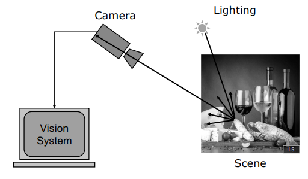
    <figcaption style="margin-top: 0.5em; text-align: center; font-size: 13px; color: #888;"><em>Görsel 1: Bilgisayarlı görü görüntü alma kurulumu: Aydınlatma sahneyi aydınlatır, yansıyan ışık kameraya ulaşarak Görsel Sistemi besler.</em></figcaption>
  

</figure>

Bir pikselin parlaklık değerini belirleyen ve süreci karmaşıklaştıran üç temel fiziksel faktör vardır:

1. **Aydınlatma (Illumination):** Işık kaynaklarının sayısı, tipi (noktasal, alansal veya gökyüzü gibi uzatılmış kaynaklar), parlaklığı ve yönleri ($\mathbf{s}$).
2. **Yüzey Yönelimi (Surface Orientation):** İncelenen noktanın üç boyutlu uzaydaki yüzey normali vektörü ($\mathbf{n}$).
3. **Yüzey Yansıtma Özellikleri (Surface Reflectance):** Malzemenin ışığı belirli bir geliş doğrultusundan alıp kameranın bulunduğu doğrultuya yansıtma kapasitesi (malzeme özellikleri).

<figure style="display:flex; justify-content: center; margin: 20px 0;">
  

    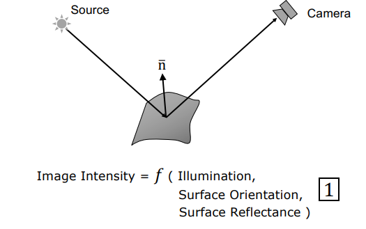
    <figcaption style="margin-top: 0.5em; text-align: center; font-size: 13px; color: #888;"><em>Görsel 2: Piksel parlaklığını belirleyen temel fiziksel faktörler: Aydınlatma, yüzey normali n ve gözlemci konumu.</em></figcaption>
  

</figure>

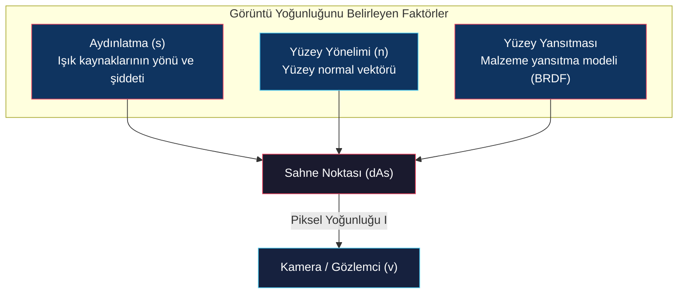

Sol tarafta elimizde sadece tek bir ölçüm değeri (piksel yoğunluğu $I$) varken, sağ tarafta aydınlatma parametreleri, yüzey yönelimi ve yansıtma katsayıları gibi çok sayıda bilinmeyen değişken bulunur. Bu nedenle, görüntü yoğunluğunu anlama problemi **aşırı derecede eksik belirlenmiş (severely under-constrained)** bir matematiksel problemdir.

> **Key Insight:** Tek bir piksel parlaklığından derinlik ve eğim çıkarmak imkansız görünse de, fiziksel ışık yayılım kuralları ve yüzey yansıma kısıtları uygulandığında bu eksik belirlenmiş problem matematiksel olarak çözülebilir hale gelir.

---

## 2. Radyometrik Kavramlar (Radiometric Concepts)

**Radyometri**, elektromanyetik radyasyonun (ışık dahil) ölçülmesi bilimidir. Bilgisayarlı görüde piksel yoğunluklarını anlamlandırmak için kullanılan temel radyometrik kavramlar şunlardır:

### 2.1 2 Boyutlu Açı (Angle in 2D)

Bir daire üzerinde $dl$ yay uzunluğunun merkezden gördüğü açı $d\theta$, yayın yarıçapı $r$'ye bölünmesiyle tanımlanır:

$$d\theta = \frac{dl}{r}$$

<figure style="display:flex; justify-content: center; margin: 20px 0;">
  

    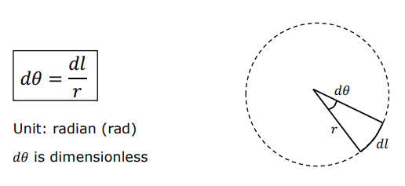
    <figcaption style="margin-top: 0.5em; text-align: center; font-size: 13px; color: #888;"><em>Görsel 3: 2 boyutlu açının (radyan) daire üzerindeki geometrik tanımı.</em></figcaption>
  

</figure>

Birimi **radyan (rad)** olup, iki uzunluğun oranı olmasından dolayı boyutsuz bir büyüklüktür. Tam bir daire $2\pi$ radyan açı kaplar.

### 2.2 3 Boyutlu Uzay Açı (Solid Angle - 3D)

Üç boyutlu uzayda bir $P$ noktasından bakıldığında, $r$ uzaklığındaki infinitesimal bir $dA$ alanının kapladığı uzaysal açıdır. Alanın bakış doğrultusuyla yaptığı $\theta$ eğiklik açısı hesaba katılarak izdüşüm alanı (foreshortened area) $dA' = dA \cos\theta$ hesaplanır. 

Uzay açı $d\omega$ şu şekilde tanımlanır:

$$d\omega = \frac{dA'}{r^2} = \frac{dA \cos\theta}{r^2}$$

<figure style="display:flex; justify-content: center; margin: 20px 0;">
  

    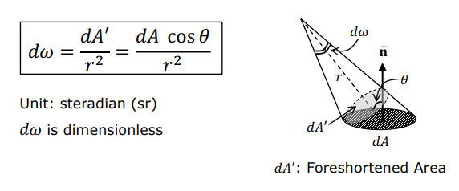
    <figcaption style="margin-top: 0.5em; text-align: center; font-size: 13px; color: #888;"><em>Görsel 4: 3 boyutlu uzay açının ($d\omega$) ve izdüşüm alanının ($dA'$) konik uzay geometrisi.</em></figcaption>
  

</figure>

Birimi **steradyan (sr)** olup yine boyutsuz bir niceliktir. Geometrik entegrasyon yapıldığında:
- Bir yarım kürenin (hemisphere) gördüğü toplam uzay açı: $2\pi \text{ sr}$
- Tam bir kürenin (sphere) gördüğü toplam uzay açı: $4\pi \text{ sr}$

### 2.3 Işık Akısı (Radiant Flux - $\Phi$)

Bir ışık kaynağının birim zamanda yaydığı ya da bir yüzey tarafından alınan toplam elektromanyetik güçtür. Birimi **Watt (W)**'tır.

$$\Phi = \frac{dQ}{dt}$$

<figure style="display:flex; justify-content: center; margin: 20px 0;">
  

    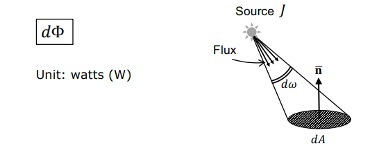
    <figcaption style="margin-top: 0.5em; text-align: center; font-size: 13px; color: #888;"><em>Görsel 5: Noktasal $J$ kaynağından $d\omega$ uzay açısı boyunca yayılan radiant flux $d\Phi$.</em></figcaption>
  

</figure>

### 2.4 Işıma Şiddeti (Radiant Intensity - $J$)

Noktasal bir ışık kaynağının belirli bir uzay açı $d\omega$ doğrultusunda birim steradyan başına yaydığı akıdır:

$$J = \frac{d\Phi}{d\omega}$$

Birimi **Watt / steradyan (W/sr)** olan bu büyüklük, noktasal kaynağın yönsel parlaklığını ifade eder.

### 2.5 Yüzey Aydınlatma Şiddeti (Surface Irradiance - $E$)

Birim yüzey alanına düşen toplam ışık akısı miktarıdır:

$$E = \frac{d\Phi}{dA}$$

Birimi **Watt / metrekare ($\text{W/m}^2$)**'dir. Işıma şiddeti $J$ olan bir kaynaktan $r$ uzaklıkta ve normaliyle $\theta$ açısı yapan bir yüzeyin aydınlanma şiddeti şu formülle hesaplanır:

$$E = \frac{J \cos\theta}{r^2}$$

Bu formül iki önemli fiziksel yasayı ortaya koyar:

1. **$1/r^2$ Azalma Kuralı (Inverse Square Law):** Işık kaynağı uzaklaştıkça aydınlanma şiddeti mesafenin karesiyle ters orantılı olarak azalır.
2. **Kosinüs Bağımlılığı (Lambert Cosine Law):** Eğiklik açısı $\theta$ arttıkça yüzeyin yakaladığı akı alanı daralır ve aydınlanma düşer. Aydınlanma, ışık dik geldiğinde ($\theta = 0^\circ$) maksimumdur, teğet açıda ($\theta = 90^\circ$) sıfıra iner.

### 2.6 Yüzey Parlaklığı (Surface Radiance - $L$)

Bir yüzey noktasından belirli bir yöne doğru yayılan ışığın parlaklık ölçüsüdür. Bir sensörün yüzeyden topladığı ışığı ölçerken, sensörün uzaklaşması (uzay açının küçülmesi) ve yüzey alanının genişlemesi gibi geometrik etkileri sönümlemek amacıyla radiance; **birim uzay açı ve birim izdüşüm alanı (foreshortened area) başına düşen akı** olarak tanımlanır:

$$L = \frac{d^2\Phi}{d\omega \cdot \cos\theta_r \, dA}$$

<figure style="display:flex; justify-content: center; margin: 20px 0;">
  

    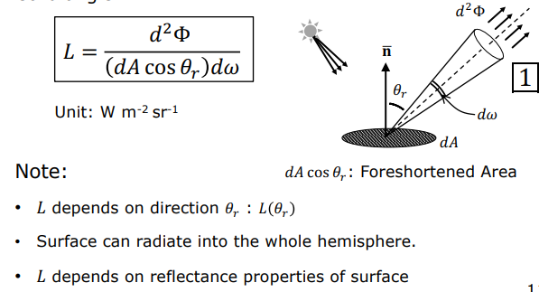
    <figcaption style="margin-top: 0.5em; text-align: center; font-size: 13px; color: #888;"><em>Görsel 6: Yüzey parlaklığının ($L$) birim izdüşüm alanı ve birim uzay açı başına tanımı.</em></figcaption>
  

</figure>

Birimi **$\text{W} / (\text{m}^2 \cdot \text{sr})$** olan radiance, gözlem yönüne ($\theta_r$) bağlıdır ve yüzeyin malzeme özellikleri ile yansıtma kapasitesine göre yönsel değişim gösterir.

---

## 3. Sahne Parlaklığı ve Görüntü Aydınlatması İlişkisi (Scene Radiance & Image Irradiance)

Bilgisayarlı görünün en temel fiziksel ilişkilerinden biri, sahnedeki bir noktanın parlaklığı (scene radiance, $L$) ile kameranın görüntü düzleminde oluşturduğu piksellerin aydınlık değeri (image irradiance, $E$) arasındaki matematiksel bağıntıdır.

<figure style="display:flex; justify-content: center; margin: 20px 0;">
  

    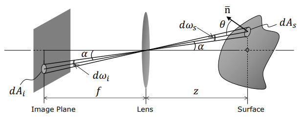
    <figcaption style="margin-top: 0.5em; text-align: center; font-size: 13px; color: #888;"><em>Görsel 7: Tek mercekli kamera modelinde görüntü pikselleri ve sahne yamalarının uzay açı ilişkisi.</em></figcaption>
  

</figure>

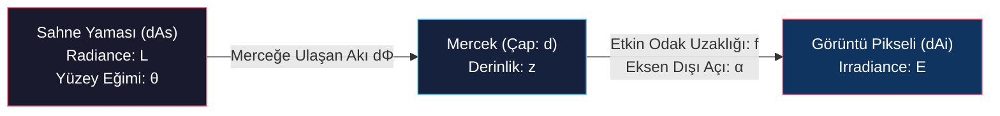

Etkin odak uzaklığı $f$ ve mercek çapı $d$ olan tek mercekli bir kamera sistemi ele alalım. Görüntü düzleminde $dA_i$ alanına sahip bir piksel, optik merkezden geçen ışınlar doğrultusunda sahnedeki $dA_s$ alanına sahip bir yüzey yamasını görür. Yamanın normali bakış doğrultusuyla $\theta$ açısı yaparken, bu bakış doğrultusu optik eksenle $\alpha$ açısı yapmaktadır; yamanın merceğe olan derinliği ise $z$'dir.

Bu geometrik yapıda dört temel denklem kurulur:

### Denklem 1: Uzay Açılarının Eşitliği
Pikselin ve sahnedeki yamanın mercek merkezinde oluşturduğu uzay açılar birbirine eşittir ($d\omega_i = d\omega_s$):

$$\frac{dA_i \cos\alpha}{(f / \cos\alpha)^2} = \frac{dA_s \cos\theta}{(z / \cos\alpha)^2} \implies \frac{dA_s}{dA_i} = \frac{z^2 \cos\alpha}{f^2 \cos\theta}$$

### Denklem 2: Merceğin Uzay Açısı
Sahne noktasından bakıldığında merceğin kapladığı uzay açı, merceğin izdüşüm alanının uzaklığın karesine oranıdır:

$$d\omega_l = \frac{\frac{\pi d^2}{4} \cos\alpha}{(z / \cos\alpha)^2} = \frac{\pi d^2 \cos^3\alpha}{4 z^2}$$

<figure style="display:flex; justify-content: center; margin: 20px 0;">
  

    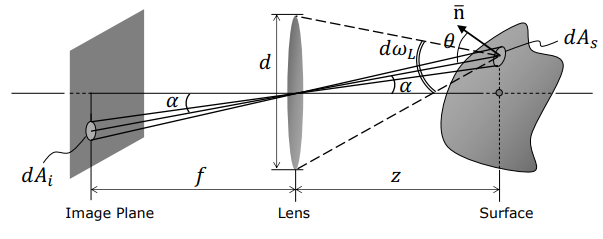
    <figcaption style="margin-top: 0.5em; text-align: center; font-size: 13px; color: #888;"><em>Görsel 8: Sahne noktasından bakıldığında mercek çapı d'nin kapladığı uzay açı dωL.</em></figcaption>
  

</figure>

### Denklem 3: Merceğe Ulaşan Işık Akısı
Sahne yamasından yayılan ve mercek tarafından toplanan akı, radiance tanımı kullanılarak yazılır:

$$d\Phi = L \cdot dA_s \cos\theta \cdot d\omega_l$$

### Denklem 4: Görüntü Aydınlatması
Merceğe giren tüm akı piksel üzerine düştüğünden, görüntü aydınlatması akının piksel alanına oranıdır:

$$E = \frac{d\Phi}{dA_i}$$

### Görüntü Parlaklığı Denklemi (Image Irradiance Equation)

Bu dört denklem birbiri yerine yazılıp sadeleştirildiğinde, bilgisayarlı görünün ana taşlarından biri olan **Image Irradiance Denklemi** türetilir:

$$E = L \cdot \frac{\pi}{4} \left(\frac{d}{f}\right)^2 \cos^4\alpha$$

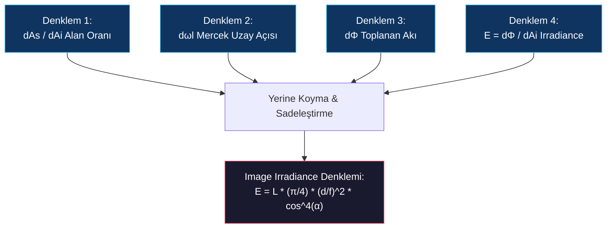

> **Denklemin Sunduğu Kritik Fiziksel Gerçekler:**
> 1. **Doğrusallık (Linearity):** Görüntü aydınlatması ($E$), sahnedeki parlaklık ($L$) ile doğrudan doğruya doğrusal orantılıdır ($E \propto L$).
> 2. **Kenara Doğru Kararma (Vignetting):** Optik eksenden uzaklaştıkça ($\alpha$ açısı büyüdükçe) görüntü parlaklığı $\cos^4\alpha$ oranında düşer. Bu fiziksel etki, bileşik (compound) lens tasarımlarıyla veya dijital kalibrasyonla düzeltilir.
> 3. **Derinlikten Bağımsızlık (Depth Independence):** Denklemin içinde sahne derinliği olan $z$ parametresi yer almaz! Kamerayı geri çektiğimizde pikselin gördüğü sahne alanı $z^2$ ile orantılı olarak büyür ve daha çok ışık biriktirir. Ancak merceğin o noktadan topladığı uzay açı $1/z^2$ oranında küçülür. Bu iki fiziksel olgu birbirini kusursuz bir şekilde yok ettiği için **görüntü parlaklığı sahne derinliğinden tamamen bağımsızdır**.

<figure style="display:flex; justify-content: center; margin: 20px 0;">
  

    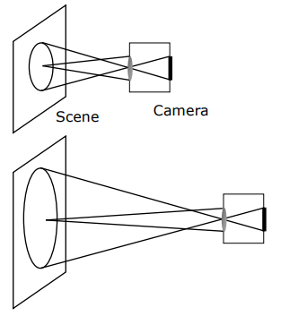
    <figcaption style="margin-top: 0.5em; text-align: center; font-size: 13px; color: #888;"><em>Görsel 9: Görüntü parlaklığının derinlikten bağımsızlığı: Mesafe arttıkça görülen alan z^2 ile genişler, mercek uzay açısı 1/z^2 ile küçülür.</em></figcaption>
  

</figure>

<figure style="display:flex; justify-content: center; margin: 20px 0;">
  

    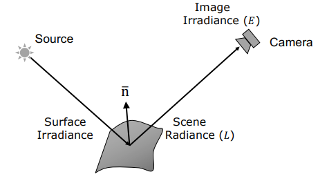
    <figcaption style="margin-top: 0.5em; text-align: center; font-size: 13px; color: #888;"><em>Görsel 10: Uçtan uca radyometrik akış: Işık Kaynağı → Surface Irradiance → Scene Radiance L → Kamera → Image Irradiance E.</em></figcaption>
  

</figure>

---

## 4. Çift Yönlü Yansıtma Dağılım Fonksiyonu (BRDF)

Yüzeylerin üzerlerine düşen ışığı yansıtma kapasitesi, malzemenin atomik ve yapısal özelliklerine bağlıdır. Bu durumu genel ve standart bir çerçevede tanımlamak için **BRDF (Bidirectional Reflectance Distribution Function)** kullanılır.

<figure style="display:flex; justify-content: center; margin: 20px 0;">
  

    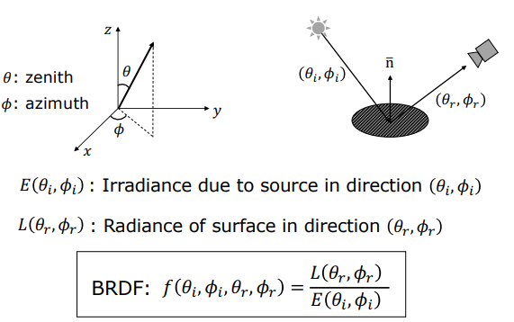
    <figcaption style="margin-top: 0.5em; text-align: center; font-size: 13px; color: #888;"><em>Görsel 11: BRDF fonksiyonunun küresel zenith (θ) ve azimuth (φ) açıları cinsinden 4 boyutlu geometrisi.</em></figcaption>
  

</figure>

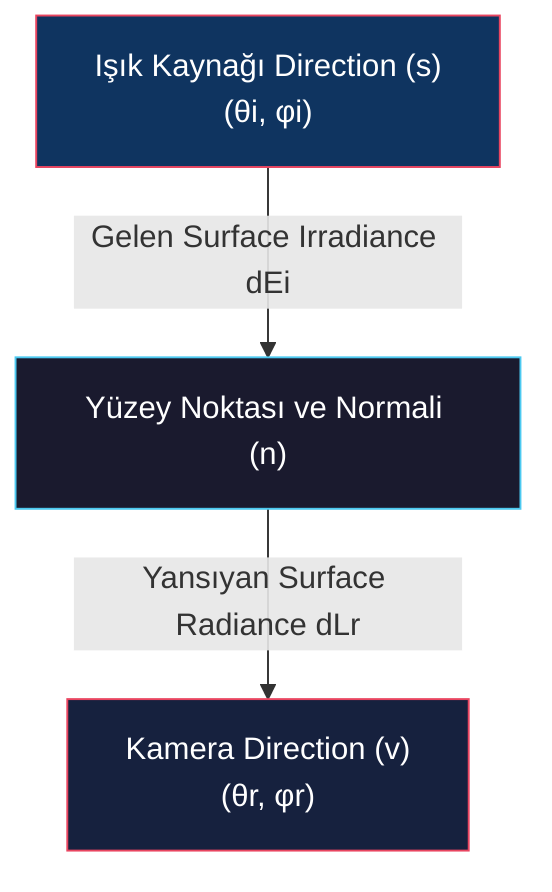

BRDF hesaplanırken iki yönlü bir geometri esas alınır:
- **Işığın geliş (aydınlatma) yönü:** $(\theta_i, \phi_i)$
- **Yansıma (gözlem) yönü:** $(\theta_r, \phi_r)$

Bu doğrultular **zenith açısı ($\theta$)** ve **azimuth açısı ($\phi$)** ile tanımlanır.

### 4.1 Matematiksel Tanım

BRDF ($f$), gözlem yönündeki yansıyan surface radiance ($L$) değerinin, gelen surface irradiance ($E$) değerine oranı olarak tanımlanan **4 boyutlu** bir fonksiyondur:

$$f(\theta_i, \phi_i, \theta_r, \phi_r) = \frac{L(\theta_r, \phi_r)}{E(\theta_i, \phi_i)}$$

Birimi **$1/\text{steradyan}$ ($\text{sr}^{-1}$)**'dir.

### 4.2 BRDF'in Temel Fiziksel Özellikleri

BRDF fonksiyonu üç kritik fiziksel kısıta uyar:

1. **Negatif Olamama (Non-Negativity):** Fiziksel olarak negatif ışık enerjisi yansıtılamayacağı için her zaman:
   $$f \ge 0$$

2. **Helmholtz Karşılıklılığı (Helmholtz Reciprocity):** Işık kaynağı ile kameranın konumları (aydınlatma ve gözlem yönleri) kendi arasında yer değiştirilirse BRDF değeri kesinlikle değişmez:
   $$f(\theta_i, \phi_i, \theta_r, \phi_r) = f(\theta_r, \phi_r, \theta_i, \phi_i)$$

3. **İzotropi ve Anizotropi (Isotropic vs. Anisotropic):**
   - **İzotropik (Isotropic):** Birçok homojen malzeme (mat boyalar, seramikler) normal vektörü etrafında döndürüldüğünde parlaklık değişimi göstermez. Bu tür yüzeylerde BRDF boyutu 3'e düşer ve sadece azimuth açılarının farkına bağlıdır:
     $$f(\theta_i, \theta_r, \phi_r - \phi_i)$$
   - **Anizotropik (Anisotropic):** Zımparalanmış metaller, kadife kumaşlar, kelebek kanatları veya tavus kuşu tüyleri gibi yönlü mikroyapılara (grooves/kanallar) sahip yüzeyler anizotropiktir. Yüzey normali etrafında döndürüldüklerinde parlaklıkları dramatik şekilde değiştiğinden BRDF'leri 4 boyutlu kalmaya devam eder.

<figure style="display:flex; justify-content: center; margin: 20px 0;">
  

    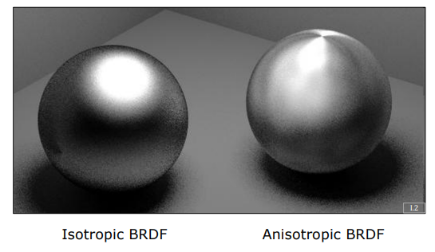
    <figcaption style="margin-top: 0.5em; text-align: center; font-size: 13px; color: #888;"><em>Görsel 12: İzotropik BRDF (sol) ile anizotropik BRDF (sağ) yüzey yansımalarının görsel karşılaştırması.</em></figcaption>
  

</figure>
