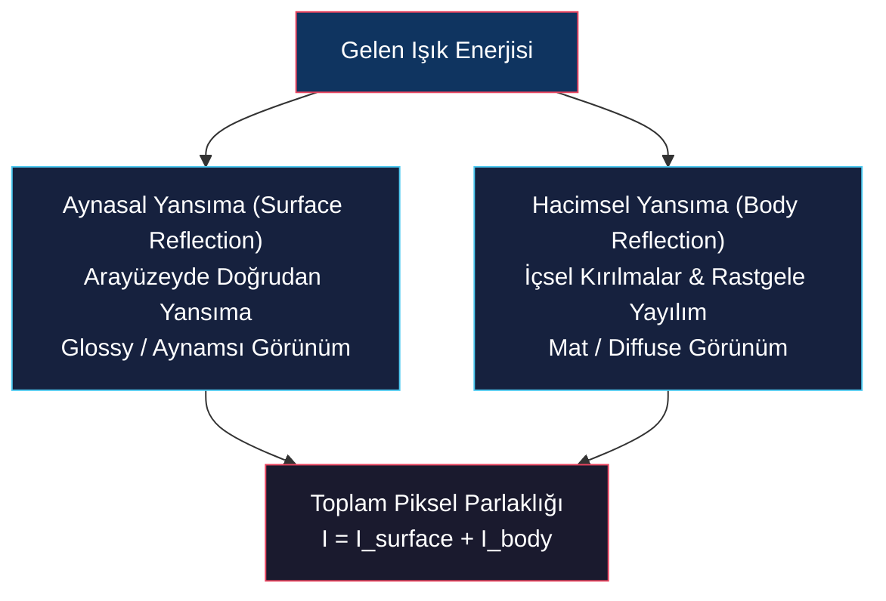
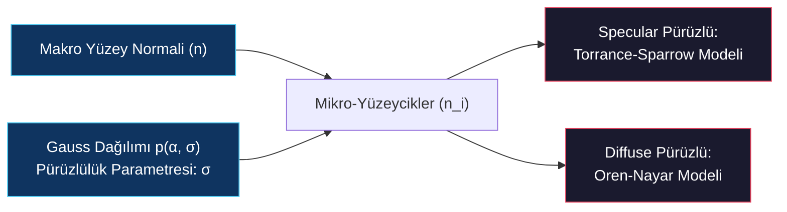

# Yansıma Modelleri, Pürüzlü Yüzeyler ve Dikromatik Model

<!-- toc -->

## 1. Klasik Yansıtma Modelleri (Reflectance Models)

Doğadaki yansıtma süreçleri temelde iki fiziksel mekanizmanın birleşimiyle açıklanır:

1. **Aynasal Yansıma (Surface / Specular Reflection):** Işığın doğrudan yüzey arayüzeyinde (interface) kırılmadan yansımasıdır. Pürüzsüz metaller, cam ve aynalarda baskındır ve nesneye parlak (glossy) bir görünüm kazandırır.
2. **Hacimsel Yansıma (Body / Diffuse Reflection):** Işığın malzemenin içine girip içindeki heterojen parçacıklardan defalarca kırılıp yansıyarak rastgele yönlerde dışarı çıkmasıdır. Kil, alçı ve kağıt gibi malzemelerde baskındır ve mat bir görünüm yaratır.

<figure style="display:flex; justify-content: center; margin: 20px 0;">
  

    
    <figcaption style="margin-top: 0.5em; text-align: center; font-size: 13px; color: #888;"><em>Görsel 1: Yüzey (Aynasal/Specular) ve Hacimsel (Yayılı/Diffuse) yansıma süreçlerinin fiziksel mekanizmaları.</em></figcaption>
  

</figure>

<figure style="display:flex; justify-content: center; margin: 20px 0;">
  

    
    <figcaption style="margin-top: 0.5em; text-align: center; font-size: 13px; color: #888;"><em>Görsel 2: Gerçek dünya malzemelerinde Hacimsel (toprak vazo), Aynasal (krom küre) ve Hibrit (cilalı ahşap) yansıma örnekleri.</em></figcaption>
  

</figure>

### 1.1 Lambertian Modeli (Body Reflection)

İdeal mat yüzeyleri modelleyen bu yaklaşıma göre, yüzey hangi yönden gözlemlenirse gözlemlensin her zaman eşit derecede parlak görünür (radiance gözlem yönünden bağımsızdır). BRDF değeri sabit bir sayıya eşittir:

$$f_{\text{Lambertian}} = \frac{\rho_d}{\pi}$$

Burada $\rho_d$ malzemenin **albedosudur** ($0 \leq \rho_d \leq 1$; tamamen siyah için 0, tamamen beyaz için 1'dir).

Lambertian yüzeyin parlaklık (radiance) denklemi şu şekildedir:

$$L = \frac{\rho_d}{\pi} E = \frac{\rho_d}{\pi} \frac{J}{r^2} (\mathbf{n} \cdot \mathbf{s})$$

<figure style="display:flex; justify-content: center; margin: 20px 0;">
  

    
    <figcaption style="margin-top: 0.5em; text-align: center; font-size: 13px; color: #888;"><em>Görsel 3: Lambertian yüzeyde geliş açısı değiştikçe (n · s) homojen küresel yansıma miktarının değişimi.</em></figcaption>
  

</figure>

Burada $\mathbf{s}$ ışık kaynağı yönündeki, $\mathbf{n}$ ise yüzey normali yönündeki birim vektördür. Parlaklık gözlem yönünden bağımsız olup, sadece ışığın geliş açısının kosinüsüne ($\mathbf{n} \cdot \mathbf{s}$) bağlıdır.

### 1.2 İdeal Aynasal Model (Ideal Specular Model)

Kusursuz aynaları modelleyen bu sistemde, gelen ışık enerjisinin tamamı yalnızca tek bir yansıma doğrultusuna ($\mathbf{r}$) aktarılır. Gözlemci sadece bakış doğrultusu ($\mathbf{v}$) bu doğrultuya tam eşit olduğunda ışığı görebilir ($\mathbf{v} = \mathbf{r}$).

BRDF, Dirac Delta fonksiyonları kullanılarak ifade edilir:

$$f_{\text{Specular}} = \frac{\delta(\theta_r - \theta_i) \delta(\phi_r - (\phi_i + \pi))}{\cos\theta_i \sin\theta_i}$$

Burada paydadaki terim enerjinin korunumu yasasını sağlamak için kullanılan normalizasyon faktörüdür.

<figure style="display:flex; justify-content: center; margin: 20px 0;">
  

    
    <figcaption style="margin-top: 0.5em; text-align: center; font-size: 13px; color: #888;"><em>Görsel 4: Lambertian küre (üstte yumuşak gölgeleme) ile İdeal Aynasal küre (altta tekil parlak ayna noktası q) karşılaştırması.</em></figcaption>
  

</figure>

---

## 2. Pürüzlü Yüzeylerden Yansıma (Reflection from Rough Surfaces)

Gerçek dünyadaki yüzeyler kusursuz pürüzsüz değildir. Piksel düzeyinde bakıldığında yüzey, farklı yönlere bakan mikroskobik yüzeyciklerin (**microfacets**) bir araya gelmesiyle oluşur. Bu yüzeyciklerin yönelimleri ($\alpha$ açıları), standart sapması $\sigma$ olan bir Gauss dağılımı $p(\alpha, \sigma)$ ile modellenir.

<figure style="display:flex; justify-content: center; margin: 20px 0;">
  

    
    <figcaption style="margin-top: 0.5em; text-align: center; font-size: 13px; color: #888;"><em>Görsel 5: Pinhole kamera pikselinin gördüğü makro yüzey altındaki mikroskobik yüzeycik (microfacet) yapısı.</em></figcaption>
  

</figure>

<figure style="display:flex; justify-content: center; margin: 20px 0;">
  

    
    <figcaption style="margin-top: 0.5em; text-align: center; font-size: 13px; color: #888;"><em>Görsel 6: Gauss pürüzlülük parametresi σ (0, 0.1, 0.3, 0.6) arttıkça mikro-yüzeycik dağılımının değişimi.</em></figcaption>
  

</figure>

### 2.1 Specular Pürüzlü Yüzeyler: Torrance-Sparrow Modeli

Her bir mikro-yüzeyciğin ideal birer ayna olduğu varsayılır. Toplam yüzey parçasının yansıtma BRDF'i şu şekilde türetilmiştir:

$$f_{\text{Torrance-Sparrow}} = \frac{\rho_s}{(\mathbf{n} \cdot \mathbf{s})(\mathbf{n} \cdot \mathbf{v})} p(\alpha, \sigma) G(\mathbf{s}, \mathbf{n}, \mathbf{v})$$

- $\rho_s$: Mikro-yüzeyciğin yansıtma kapasitesi.
- $p(\alpha, \sigma)$: Gauss pürüzlülük dağılımı.
- $G(\mathbf{s}, \mathbf{n}, \mathbf{v})$: Geometrik zayıflatma faktörüdür (komşu yüzeyciklerin birbiri üzerine düşürdüğü gölgeleme ve maskeleme etkisi - shadowing & masking).

<figure style="display:flex; justify-content: center; margin: 20px 0;">
  

    
    <figcaption style="margin-top: 0.5em; text-align: center; font-size: 13px; color: #888;"><em>Görsel 7: Torrance-Sparrow modelinde σ arttıkça ayna noktasının genişleyerek mat parlamaya (specular lobe) dönüşmesi.</em></figcaption>
  

</figure>

Pürüzlülük ($\sigma$) arttıkça, tekil ayna noktası genişleyerek mat parlamalara (**specular lobe / highlight**) dönüşür. Çok pürüzlü yüzeylerde en parlak noktanın geometrik yansıma konumundan (**off-specular peak**) sapması bu modelle açıklanır.

<figure style="display:flex; justify-content: center; margin: 20px 0;">
  

    
    <figcaption style="margin-top: 0.5em; text-align: center; font-size: 13px; color: #888;"><em>Görsel 8: Pürüzlülük arttıkça çevre yansımasının net ayna görüntüsünden bulanık parlamaya geçişi.</em></figcaption>
  

</figure>

### 2.2 Diffuse Pürüzlü Yüzeyler: Oren-Nayar Modeli

Her bir mikro-yüzeyciğin ideal birer Lambertian mat yüzey olduğu varsayılır. $\sigma = 0$ iken model saf Lambertian modeline indirgenir.

<figure style="display:flex; justify-content: center; margin: 20px 0;">
  

    
    <figcaption style="margin-top: 0.5em; text-align: center; font-size: 13px; color: #888;"><em>Görsel 9: Oren-Nayar modelinde σ arttıkça kürenin kenarlarına doğru parlaklık düşüşünün engellenmesi.</em></figcaption>
  

</figure>

Ancak pürüzlülük ($\sigma$) arttıkça, küre şeklindeki nesnelerin kenarlarına doğru parlaklığın hızlıca düşmesi engellenir ve küre daha düz bir disk (**flat disc**) gibi görünmeye başlar.

<figure style="display:flex; justify-content: center; margin: 20px 0;">
  

    
    <figcaption style="margin-top: 0.5em; text-align: center; font-size: 13px; color: #888;"><em>Görsel 10: Dolunay (Full Moon) olgusunun fiziksel açıklaması: Aşırı pürüzlü toz tabakası küreyi kenarlara kadar eşit parlaklıkta düz bir tepsi gibi gösterir.</em></figcaption>
  

</figure>

> **Key Insight:** Yüzeyi aşırı derecede pürüzlü ve tozlu olan dolunayın (full moon) gölgeli bir küre gibi değil, kenarlarına kadar eşit parlaklıkta düz bir tepsi gibi görünmesinin fiziksel ve matematiksel açıklaması **Oren-Nayar Diffuse Pürüzlülük Modeli** ile verilir.

---

## 3. Dikromatik Model (Dichromatic Model)

Shafer (1985) tarafından önerilen bu model, hibrit yüzeylerde yansıma mekanizmaları ile ışık ve nesne renklerinin etkileşimini açıklar.

<figure style="display:flex; justify-content: center; margin: 20px 0;">
  

    
    <figcaption style="margin-top: 0.5em; text-align: center; font-size: 13px; color: #888;"><em>Görsel 11: Dikromatik modelde Hacimsel (Body: Işık x Nesne rengi) ve Aynasal (Surface: Işık rengi) yansıma renkleri.</em></figcaption>
  

</figure>

1. **Aynasal (Yüzey) Renk Bileşeni ($\mathbf{C}_s$):** Işık doğrudan yüzey arayüzeyinden yansıdığı için renk seçici bir soğrulmaya uğramaz. Dolayısıyla, aynasal yansımanın rengi ışık kaynağının kendi rengine eşittir.
2. **Hacimsel (Body) Renk Bileşeni ($\mathbf{C}_b$):** Işık malzemenin içine girip pigmentlerle etkileştiği için belirli dalga boyları soğurulur. Bu yüzden difüz yansımanın rengi, ışığın rengi ile nesnenin kendi renk pigmentlerinin çarpımıdır.

Bu doğrusal kombinasyon sonucu pikselde ölçülen toplam renk vektörü RGB uzayında şu şekilde ifade edilir:

$$\mathbf{C} = m_b \mathbf{C}_b + m_s \mathbf{C}_s$$

- $\mathbf{C}_b$: Difüz (body) renk vektörü.
- $\mathbf{C}_s$: Aynasal (surface) renk vektörü.
- $m_b, m_s$: Geometrik ağırlık parametreleri.

<figure style="display:flex; justify-content: center; margin: 20px 0;">
  

    
    <figcaption style="margin-top: 0.5em; text-align: center; font-size: 13px; color: #888;"><em>Görsel 12: RGB renk uzayında Cb ve Cs vektörlerinin tanımladığı Dikromatik Düzlem (Dichromatic Plane).</em></figcaption>
  

</figure>

### 3.1 Dikromatik Düzlem ve "Skewed-T" Dağılımı

Tek bir homojen malzemeden üretilmiş nesne üzerindeki tüm piksellerin renk değerleri, RGB uzayında bu iki vektörün tanımladığı **dikromatik düzlem (dichromatic plane)** üzerinde yer almak zorundadır.

<figure style="display:flex; justify-content: center; margin: 20px 0;">
  

    
    <figcaption style="margin-top: 0.5em; text-align: center; font-size: 13px; color: #888;"><em>Görsel 13: Mavi ışık altında renklendirilmiş nesnenin RGB renk histogramında oluşturduğu Skewed-T dağılımı.</em></figcaption>
  

</figure>

Pikseller renk uzayında haritalandırıldığında, gölgeden başlayıp saf nesne rengine uzanan bir hat ile aynasal parlamaların ışık kaynağı rengine doğru büküldüğü ikinci bir hattın birleşiminden oluşan yamuk bir **T ("Skewed-T")** dağılımı sergilerler.

<figure style="display:flex; justify-content: center; margin: 20px 0;">
  

    
    <figcaption style="margin-top: 0.5em; text-align: center; font-size: 13px; color: #888;"><em>Görsel 14: Sarı ışık altında plastik bardaklar deneyi ve RGB küpü içindeki dikromatik düzlem kümelenmesi.</em></figcaption>
  

</figure>

### 3.2 Klinker Parlama Ayrıştırma Algoritması (Highlight Separation)

Klinker (1990) tarafından geliştirilen algoritmalarla bu "Skewed-T" geometrisi analiz edilerek, görüntünün pikselleri saf difüz gölgelendirme (shading) görüntüsüne ve saf aynasal parlama (highlight) görüntüsüne başarılı bir şekilde ayrıştırılabilmektedir.

<figure style="display:flex; justify-content: center; margin: 20px 0;">
  

    
    <figcaption style="margin-top: 0.5em; text-align: center; font-size: 13px; color: #888;"><em>Görsel 15: Klinker algoritması sonuçları: Orijinal girdi (üst sol), RGB histogramı (üst sağ), saf difüz gölge (alt sol) ve saf aynasal parlama (alt sağ).</em></figcaption>
  

</figure>

> **Key Insight:** Klinker parlamayı ayrıştırma algoritması, parlaklıkların (specular highlights) yarattığı yanıltıcı 3D derinlik ve çizgi hatalarını ortadan kaldırarak nesnenin gerçek yüzey geometrisinin ve albedosunun hesaplanmasını son derece kolaylaştırır.
