# Gölgelendirmeden Şekil Çıkarma (Shape from Shading)

<!-- toc -->

## 1. Genel Bakış ve Temel Sınıflandırma (Overview)

Bilgisayarlı görünün en köklü problemlerinden biri olan **Gölgelendirmeden Şekil Çıkarma (Shape from Shading - SfS)**, tek bir monokrom (gri seviye) görüntüden yola çıkarak sahnedeki nesnelerin 3B yüzey geometrisini (yüzey normallerini veya derinlik haritasını) kurtarmayı hedefler.

<figure style="display:flex; justify-content: center; margin: 20px 0;">
  

    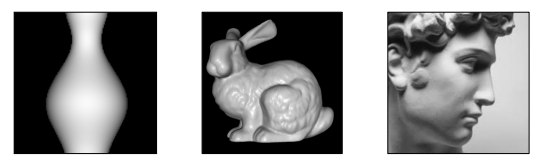
    <figcaption style="margin-top: 0.5em; text-align: center; font-size: 13px; color: #888;"><em>Görsel 1: Tek bir gölgeli görüntüden 3B yüzey geometrisi çıkarımı yapılan klasik örnek nesneler (Vazo, Stanford Tavşanı, David Büstü).</em></figcaption>
  

</figure>

> **Key Insight:** Fotometrik Stereo birden fazla farklı aydınlatma altındaki görüntüye ihtiyaç duyarken, Shape from Shading **tek bir görüntüden** 3B rekonstrüksiyon yapmaya çalışır. Bu durum problemi fiziksel ve matematiksel olarak aşırı derecede eksik belirlenmiş (*severely under-constrained*) kılar.

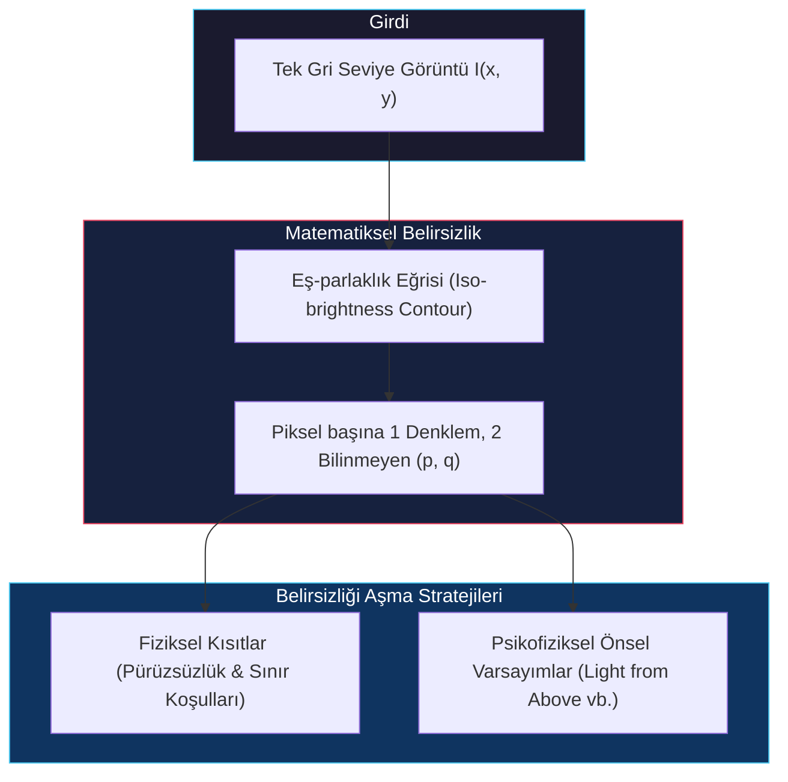

### 1.1 Matematiksel Belirsizlik (Under-Constrained Problem)

Sahnede yer alan homojen bir malzemenin yansıtma özelliklerini (BRDF), ışık kaynağının yönünü ($\mathbf{s}$) ve parlaklığını tam olarak bildiğimizi varsayalım. Bu durumda, herhangi bir yüzey normali yönelimi (yani $p-q$ gradyanı) için kameranın pikselinde oluşacak teorik parlaklığı veren bir **Yansıtma Haritası ($R(p, q)$)** oluşturabiliriz.

<figure style="display:flex; justify-content: center; margin: 20px 0;">
  

    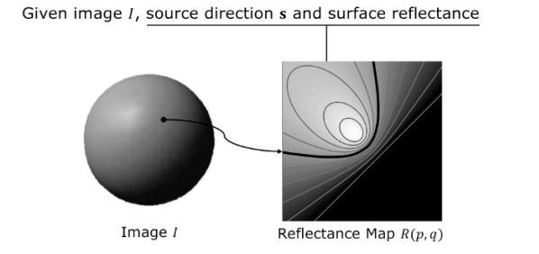
    <figcaption style="margin-top: 0.5em; text-align: center; font-size: 13px; color: #888;"><em>Görsel 2: Ölçülen piksel parlaklığı I(x,y) için Yansıtma Haritası R(p,q) üzerinde aynı parlaklığı üreten sonsuz sayıda normal adayı içeren Eş-parlaklık Eğrisi (Iso-brightness contour).</em></figcaption>
  

</figure>

Ancak, bu fiziksel sürecin tersine işletilmesi, yani ölçülen tek bir piksel yoğunluk değerinden ($I(x,y)$) o noktadaki yüzey normali yönünün ($p, q$) saptanması matematiksel olarak imkansızdır:

1. **Eş-parlaklık Eğrisi (Iso-brightness Contour):** Yansıtma haritasında, ölçülen parlaklığa ($I$) eşit olan noktaların oluşturduğu sürekli bir hat yer alır; buna eş-parlaklık eğrisi denir.
2. **Sonsuz Yüzey Normali Adayı:** Bu eğri üzerinde, birebir aynı parlaklık değerini üretebilecek sonsuz sayıda farklı yüzey normali adayı ($p, q$ gradyanı) bulunur.
3. **Eksik Belirlenmiş Denklem Sistemi:** Piksel başına tek bir denkleme ($I(x,y) = R(p,q)$) karşılık çözülmesi gereken iki bağımsız değişken ($p$ ve $q$) bulunması, problemi aşırı derecede eksik belirlenmiş (*severely under-constrained*) bir hale getirir.

### 1.2 Belirsizliği Aşma Stratejisi

Bu sonsuz yönelim belirsizliğini aşarak tekil ve kararlı bir geometrik çözüme ulaşabilmek için iki temel yaklaşım benimsenir:

* **Fiziksel / Matematiksel Kısıtlar:** Görüntüdeki piksellerin bağımsız hareket edemeyeceği varsayılarak sahneye pürüzsüzlük (*smoothness*) ve bilinen sınır koşulları (*boundary conditions*) entegre edilir.
* **Psikofiziksel Önsel Varsayımlar (Priors):** İnsan görsel sisteminin bu belirsizliği milisaniyeler içinde nasıl çözdüğü analiz edilerek, beynin kullandığı sezgisel kurallar matematikselleştirilir.

---

## 2. İnsan Görsel Sisteminde Gölgelendirmenin Algılanması (Human Perception of Shading)

İnsan görsel sistemi, tek bir gölgeli fotoğrafa baktığında nesnenin tüm kıvrımlarını ve 3B yapısını anında algılar. Beynimiz, optik verilerdeki eksiklikleri gidermek için fiziksel dünyaya ait son derece güçlü önsel varsayımlar (*prior assumptions*) kullanır.

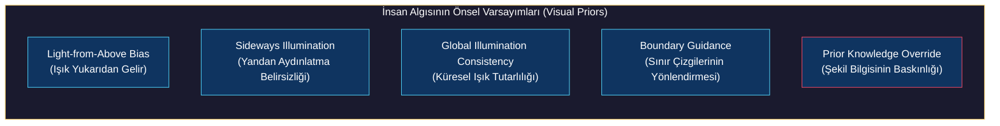

### 2.1 Işığın "Yukarıdan" Geldiği Varsayımı (Light from Above Bias)

Güneş ve gökyüzü gibi doğal ışık kaynaklarının her zaman yukarıda bulunması gerçeğinden yola çıkan beynimiz, ışığın her zaman yukarıdan aşağıya doğru yayıldığını varsayar.

<figure style="display:flex; justify-content: center; margin: 20px 0;">
  

    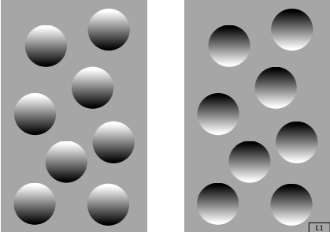
    <figcaption style="margin-top: 0.5em; text-align: center; font-size: 13px; color: #888;"><em>Görsel 3: Işığın yukarıdan geldiği varsayımı. Üstü parlak/altı gölgeli nesneler dışbükey (tümsek), altı parlak/üstü gölgeli nesneler içbükey (çukur) olarak algılanır.</em></figcaption>
  

</figure>

* **Tümsek ve Çukurlar (Bumps vs. Concavities):** Bir panel üzerindeki dairesel bir şeklin üst kısmı parlak, alt kısmı gölgeliyse, beyin ışığı yukarıdan kabul ettiği için bu nesneyi dışbükey (*convex/tümsek*) olarak algılar. Eğer aynı dairesel şeklin altı parlak, üstü gölgeliyse, nesne içbükey (*concave/çukur*) olarak yorumlanır.
* **Döndürme İllüzyonu (Mound vs. Crater):** Ortasında derin bir çukur olan bir tepenin fotoğrafı $180^\circ$ ters çevrildiğinde, beynimiz sadece ters dönmüş bir tepe görmek yerine, ortasında tümsek olan devasa bir krater algılar. Beynimiz ışık kaynağının yönünü ters çevirmeyi reddeder; bunun yerine nesnenin geometrisini "yukarıdan gelen ışık" kuralıyla uyumlu olacak şekilde yeniden kurgular.

<figure style="display:flex; justify-content: center; margin: 20px 0;">
  

    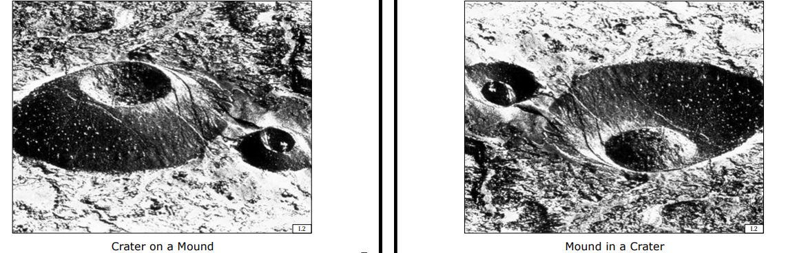
    <figcaption style="margin-top: 0.5em; text-align: center; font-size: 13px; color: #888;"><em>Görsel 4: Tepe üzerindeki krater (Crater on a Mound) görüntüsü 180° döndürüldüğünde beyin ışığın yönünü değiştirmek yerine algıyı krater içindeki tümseğe (Mound in a Crater) dönüştürür.</em></figcaption>
  

</figure>

### 2.2 Yandan Aydınlatma Belirsizliği (Sideways Illumination)

Eğer gölgelendirme yatay doğrultudaysa (ışık tam sağdan veya soldan geliyorsa), insan beyninin varsayılan bir önceliği kalmaz. Denekler bu nesneleri tümsek veya çukur olarak algılamada kararsız kalırlar. Kişi, zihninde ışık kaynağını sağa veya sola kaydırdığı an, nesnenin derinlik algısı da tümsekten çukura (veya tersine) anlık olarak bükülür.

<figure style="display:flex; justify-content: center; margin: 20px 0;">
  

    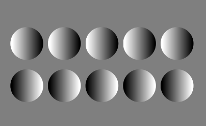
    <figcaption style="margin-top: 0.5em; text-align: center; font-size: 13px; color: #888;"><em>Görsel 5: Yandan gelen aydınlatmada insan beyninin dikey ışık önceliği kalmaz; nesnelerin tümsek mi yoksa çukur mu olduğu belirsizleşir.</em></figcaption>
  

</figure>

### 2.3 Üniform Küresel Aydınlatma Tutarlılığı (Global Illumination Consistency)

İnsan görsel sistemi, bir sahnedeki ışık kaynaklarının nesneden nesneye parça parça değiştiğini düşünmek istemez. Sahnedeki tüm nesnelerin aynı yönden gelen tek bir küresel ışık kaynağıyla aydınlandığını varsayar. Yan yana duran iki sıradan üsttekini tümsek olarak kabul ettiğimiz an, alttaki sırayı tutarlılığı korumak adına çukur olarak algılamak zorunda kalırız.

<figure style="display:flex; justify-content: center; margin: 20px 0;">
  

    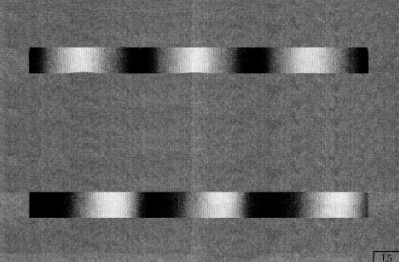
    <figcaption style="margin-top: 0.5em; text-align: center; font-size: 13px; color: #888;"><em>Görsel 6: İki paralel şerit üzerinde ters gradyanlar. Beyin tekil küresel ışık kaynağı varsayımıyla iki şeridi zıt yüzey eğimleri olarak algılar.</em></figcaption>
  

</figure>

<figure style="display:flex; justify-content: center; margin: 20px 0;">
  

    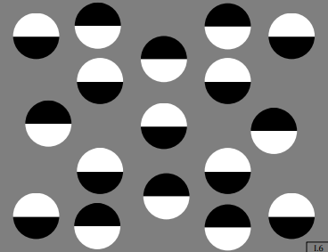
    <figcaption style="margin-top: 0.5em; text-align: center; font-size: 13px; color: #888;"><em>Görsel 7: Keskin ikili (binary) gölgelendirmeye sahip daireler dizilimi. Işık yönüne bağlı gruplama algısı.</em></figcaption>
  

</figure>

<figure style="display:flex; justify-content: center; margin: 20px 0;">
  

    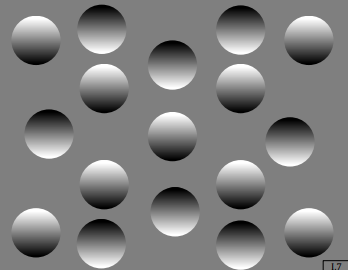
    <figcaption style="margin-top: 0.5em; text-align: center; font-size: 13px; color: #888;"><em>Görsel 8: Pürüzsüz gradyanlı daireler dizilimi. Beyin ışığı yukarıdan kabul ederek zıt gradyanlı daireleri otomatik olarak içbükey ve dışbükey gruplarına ayırır.</em></figcaption>
  

</figure>

### 2.4 Sınır Çizgilerinin Şekillendirici Rolü (Boundaries)

Aynı gölgelendirme desenine sahip iki şerit, sadece dış sınırlarının kesim geometrisi değiştirilerek tamamen farklı algılatılabilir:

* **Düzgün Dalgalı Sınırlar:** Şeridin sınır çizgileri sinüzoidal dalgalar şeklinde kesildiğinde, içerideki gölge geçişi yan yana duran silindirler (dalgalı sac yüzeyi) gibi algılanır.
* **Testere Dişi Sınırlar:** Sınırlar keskin üçgen şeklinde kesildiğinde, aynı gölgelendirme bu kez katlanmış oluklu bir çatı yüzeyi algısı yaratır. Sınır çizgileri, beynin gölgeleri anlamlandırmasında en güçlü geometrik yönlendiricidir.

<figure style="display:flex; justify-content: center; margin: 20px 0;">
  

    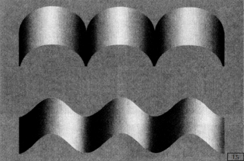
    <figcaption style="margin-top: 0.5em; text-align: center; font-size: 13px; color: #888;"><em>Görsel 9: Aynı iç gölgelendirmeye sahip şeritlerin dış sınır kesimleri değiştirildiğinde (kemerli vs. sinüzoidal), 3B yüzey formu algısı kökten değişir.</em></figcaption>
  

</figure>

### 2.5 Önsel Bilgiyle Varsayımı Geçersiz Kılma (Prior Knowledge Override)

İnsan beyni, çok iyi bildiği ve aşina olduğu yapılarla karşılaştığında, "ışık yukarıdan gelir" kuralını çiğneyebilir:

* **Hollow-Mask (Oyuk Maske) İllüzyonu:** İçi boş, içbükey bir insan yüzü maskesi yukarıdan aydınlatıldığında dahi, insan beyni bir yüzün içbükey olamayacağını bildiği (çünkü tüm insan yüzleri dışbükeydir) için maskeyi dışa doğru fırlamış normal bir yüz olarak görür. Beynimiz bu derinlik algısını koruyabilmek için, ışığın "aşağıdan aydınlatma" yaptığı yanılgısını kabul eder.

<figure style="display:flex; justify-content: center; margin: 20px 0;">
  

    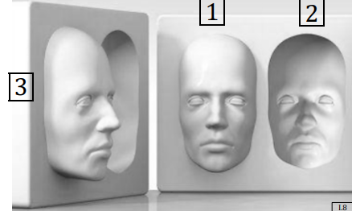
    <figcaption style="margin-top: 0.5em; text-align: center; font-size: 13px; color: #888;"><em>Görsel 10: Oyuk Maske İllüzyonu. 1: Dışbükey yüz, 2: İçbükey maske önden görünümü (dışbükey olarak algılanır), 3: Profil görünümü (gerçek içbükey yapıyı gösterir). Beyin bilinen yüz şeklini korumak için ışık varsayımını çiğner.</em></figcaption>
  

</figure>

---

## 3. Stereografik İzdüşüm (Stereographic Projection / f-g Uzayı)

Yüzey yönelimini matematiksel olarak modellemek için kullanılan geleneksel $(p, q)$ gradyan uzayı, çok ciddi bir sayısal kararsızlık problemine sahiptir.

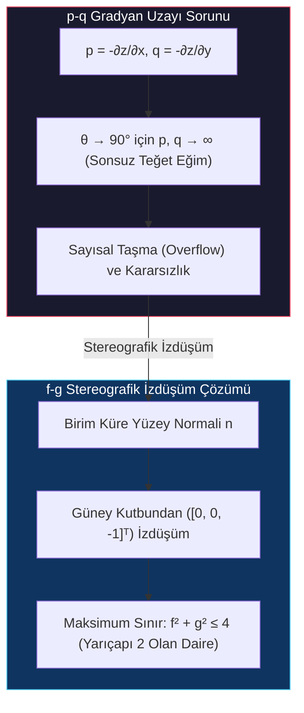

### 3.1 p-q Gradyan Uzayının Sınırlandırması

Birim yüzey normali ($\mathbf{n}$), kameranın bakış yönü ($z$ ekseni) ile $\theta$ açısı yapsın. Normali $z = 1$ düzlemine uzatarak kesiştirdiğimizde $p = -\partial z/\partial x$ ve $q = -\partial z/\partial y$ koordinatlarını elde ederiz.

* Yüzey eğimi dikleştikçe ve yüzey normali teğet açıya (yani $\theta \to 90^\circ$ kapanma sınırına) yaklaştıkça, $p$ ve $q$ değerleri kontrolsüzce büyür ve sınırda sonsuza ($\infty$) ulaşır.
* Bu durum bilgisayarda taşma (*overflow*) hatalarına, sayısal kararsızlıklara ve çözünürlük doğrusal olmamasına yol açar.

### 3.2 f-g Uzayı (Stereografik İzdüşüm)

Bu sayısal kısıtı çözmek ve değerleri sınırlandırmak için $f-g$ stereografik izdüşüm uzayı kullanılır:

1. İzdüşüm, $z$-ekseni üzerindeki Güney Kutbu ($[0, 0, -1]^T$) noktasından başlatılır.
2. Bu noktadan çıkan doğrusal ışın, birim küre üzerindeki birim normal vektörün ($\mathbf{n}$) ucundan geçerek $z=1$ düzlemini kestiği yerde $(f, g)$ koordinatını oluşturur.
3. Benzer üçgenler yardımıyla $(f,g)$ ile $(p,q)$ arasındaki matematiksel geçiş köprüsü şu şekilde kurulur:

$$f = \frac{2p}{1 + \sqrt{p^2 + q^2 + 1}}, \quad g = \frac{2q}{1 + \sqrt{p^2 + q^2 + 1}}$$

<figure style="display:flex; justify-content: center; margin: 20px 0;">
  

    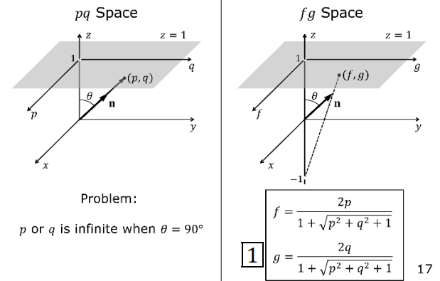
    <figcaption style="margin-top: 0.5em; text-align: center; font-size: 13px; color: #888;"><em>Görsel 11: Sol: pq gradyan uzayı (θ=90° sınırında sonsuza gider). Sağ: Güney Kutbundan ([0,0,-1]ᵀ) z=1 düzlemine fg stereografik izdüşümü.</em></figcaption>
  

</figure>

### 3.3 Sayısal Avantajı

Bu izdüşüm sayesinde, kameranın gördüğü tüm görünür üst yarım küredeki (*upper hemisphere*) olası tüm yüzey normalleri, $f-g$ uzayında yarıçapı tam olarak 2 olan bir dairenin içine sıkıştırılır:

$$\text{Maksimum Sınır:} \quad f^2 + g^2 \leq 4$$

<figure style="display:flex; justify-content: center; margin: 20px 0;">
  

    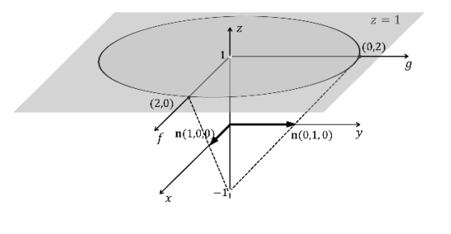
    <figcaption style="margin-top: 0.5em; text-align: center; font-size: 13px; color: #888;"><em>Görsel 12: Stereografik izdüşüm ile üst yarımküredeki tüm normaller z=1 düzleminde f²+g² ≤ 4 dairesine haritalanır. (1,0,0) normali (2,0), (0,1,0) normali (0,2) noktasına denk gelir.</em></figcaption>
  

</figure>

Örneğin, $y$-eksenine hizalı $(0, 1, 0)$ normali $(0, 2)$ noktasına, $x$-eksenine hizalı $(1, 0, 0)$ normali ise $(2, 0)$ noktasına haritalanır. Değerlerin $[-2, 2]$ aralığında kesin olarak sınırlandırılması (*bounded*), sayısal SfS algoritmalarının kararlılığı için muazzam bir avantajdır.

---

## 4. Gölgelendirmeden Şekil Çıkarma Algoritması (Shape from Shading Algorithm)

**Ikeuchi ve Horn (1981)** tarafından geliştirilen sayısal gölgelendirmeden şekil çıkarma algoritması, problemi çözülebilir kılmak için üç temel kısıtı birleştirir ve sınır koşullarından başlayarak iç piksellerin normallerini iteratif olarak hesaplar.

<figure style="display:flex; justify-content: center; margin: 20px 0;">
  

    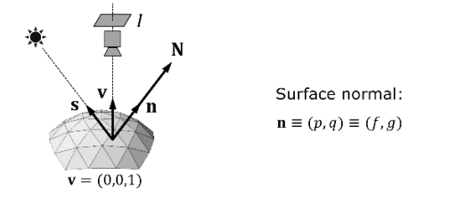
    <figcaption style="margin-top: 0.5em; text-align: center; font-size: 13px; color: #888;"><em>Görsel 13: Yüzey normali N, bakış yönü v = (0,0,1), ışık yönü s ve temsil n ≡ (p,q) ≡ (f,g).</em></figcaption>
  

</figure>

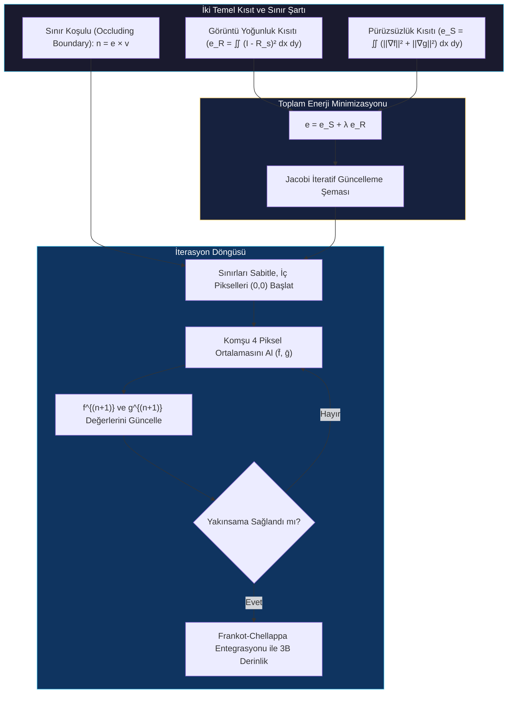

### 4.1 Sınır Koşulu Kısıtı (Occluding Boundaries)

Nesnenin arka plana kıvrılarak gözden kaybolduğu dış sınıra **occluding boundary (kapanma sınırı)** denir.

* Bu sınırdaki birim yüzey normali ($\mathbf{n}$), hem kameranın bakış yönüne ($\mathbf{v}$) hem de görüntü düzleminde saptanan sınır kenar vektörüne ($\mathbf{e}$) tam olarak diktir ($\mathbf{n} \perp \mathbf{v}$ ve $\mathbf{n} \perp \mathbf{e}$).
* Dolayısıyla sınır piksellerindeki normaller, bu iki bilinen vektörün vektörel çarpımıyla (*cross-product*) doğrudan ve kesin olarak hesaplanabilir:

$$\mathbf{n} = \mathbf{e} \times \mathbf{v}$$

<figure style="display:flex; justify-content: center; margin: 20px 0;">
  

    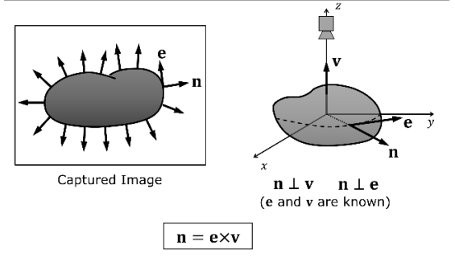
    <figcaption style="margin-top: 0.5em; text-align: center; font-size: 13px; color: #888;"><em>Görsel 14: Kapanma sınırında (Occluding boundary) yüzey normali n, bakış yönü v ve kenar vektörü e'ye diktir. Dirichlet sınır koşulu n = e × v ile kesin olarak bulunur.</em></figcaption>
  

</figure>

Hesaplanan bu sınır normalleri ($f, g$ değerleri), algoritma boyunca sabit sınır koşulları (**Dirichlet Boundary Conditions**) olarak tutulur ve iç piksellere doğru bilgi akışını (yayılımını) sağlar.

### 4.2 Görüntü Yoğunluk Kısıtı (Image Irradiance Constraint)

Hesaplanan her bir $(f, g)$ yöneliminin yansıtma haritasındaki karşılığı ($R_s(f, g)$), o pikselde ölçülen gerçek kamera parlaklığına ($I(x,y)$) eşit olmalıdır. Bu amaçla kurulan hata terimi ($e_R$) şu şekildedir:

$$e_R = \iint \left( I(x,y) - R_s(f, g) \right)^2 dx dy$$

### 4.3 Pürüzsüzlük Kısıtı (Smoothness Constraint)

Problemin eksik belirlenmiş yapısını çözmek amacıyla, komşu piksellerin normallerinin birbirinden aşırı derecede farklı olamayacağı, yani yüzeyin pürüzsüz (*smooth*) olduğu varsayılır. Yüzeydeki ani yön değişimlerini cezalandırmak için $f$ ve $g$'nin kısmi türevlerinin karesel toplamı ($e_S$) minimize edilir:

$$e_S = \iint \left( \left(\frac{\partial f}{\partial x}\right)^2 + \left(\frac{\partial f}{\partial y}\right)^2 + \left(\frac{\partial g}{\partial x}\right)^2 + \left(\frac{\partial g}{\partial y}\right)^2 \right) dx dy$$

### 4.4 Toplam Enerji Minimizasyonu ve İteratif Çözüm (Jacobi Iterative Scheme)

Bu iki hata bileşeni bir $\lambda$ ağırlık katsayısıyla birleştirilerek toplam enerji fonksiyonu ($e$) tanımlanır:

$$e = e_S + \lambda e_R$$

Sürekli düzlemdeki türevler ayrık 2D piksel ızgarasında sonlu farklar (Laplacian benzeri) ile ifade edilir. Enerjiyi minimum yapmak için her bir pikseldeki ($f\_{k,l}, g\_{k,l}$) elemanlarına göre kısmi türevler alınıp sıfıra eşitlenir. Doğrusal olmayan bu sistemi çözmek için **Jacobi tipi iteratif bir güncelleme kuralı** türetilir:

$$f\_{k,l}^{(n+1)} = \bar{f}\_{k,l}^{(n)} + \lambda \left( I\_{k,l} - R_s(f\_{k,l}^{(n)}, g\_{k,l}^{(n)}) \right) \frac{\partial R_s}{\partial f}$$

$$g\_{k,l}^{(n+1)} = \bar{g}\_{k,l}^{(n)} + \lambda \left( I\_{k,l} - R_s(f\_{k,l}^{(n)}, g_{k,l}^{(n)}) \right) \frac{\partial R_s}{\partial g}$$

Burada:

* $n$: İterasyon adım sayısıdır.
* $\bar{f}\_{k,l}^{(n)}$ ve $\bar{g}\_{k,l}^{(n)}$: Pikselin üst, alt, sol ve sağındaki 4 komşu hücrenin yerel ortalamasıdır. Bu ortalama terimi, komşular arasındaki geometrik pürüzsüzlük akışını ve sınır normallerinin içeriye doğru yayılmasını sağlar.
* $\frac{\partial R_s}{\partial f}$ ve $\frac{\partial R_s}{\partial g}$: Kullanılan BRDF modeline göre hesaplanan yansıtma haritasının kısmi türevleridir.

Sınır piksellerindeki değerler sabit tutularak, iç pikseller $[0, 0]^T$ değeriyle başlatılır ve ardışık iki iterasyon arasındaki fark belirlenen bir eşik değerinin altına inene kadar iterasyonlar sürdürülür. Elde edilen $(f, g)$ normal haritası, daha sonra Fourier entegrasyonu (**Frankot-Chellappa**) ile pürüzsüz bir 3B derinlik yüzeyine dönüştürülür.

<figure style="display:flex; justify-content: center; margin: 20px 0;">
  

    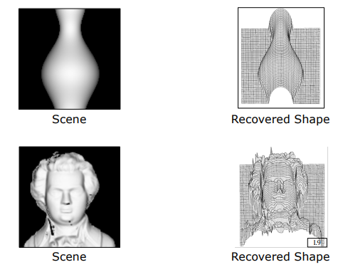
    <figcaption style="margin-top: 0.5em; text-align: center; font-size: 13px; color: #888;"><em>Görsel 15: Ikeuchi-Horn Shape from Shading algoritması sonucu elde edilen 3B yüzey derinlik ağları (Vazo ve Beethoven Büstü rekonstrüksiyon sonuçları).</em></figcaption>
  

</figure>

---

## 5. Gölgelendirme İllüzyonları (Shading Illusions)

Gölgelendirmeden şekil çıkarma fiziği ve insan algısı, beynimizin mutlak parlaklık ölçmek yerine bağıntısal değişimleri algılamasından kaynaklanan bazı görsel yanılsamalara (illüzyonlara) yol açar.

### 5.1 Kaybolan Disk İllüzyonu (Fading Disk Illusion)

Büyük yeşil bir dairenin tam merkezine yerleştirilmiş, kenarları yumuşak geçişli (*fuzzy*) mavi bir disk içeren görüntüye gözümüzü kırpmadan tek bir noktaya odaklanarak baktığımızda, bir süre sonra ortadaki mavi diskin tamamen silinerek yok olduğunu ve tüm alanı yeşil gördüğümüzü fark ederiz.

* **Fiziksel Açıklaması:** İnsan görsel sistemi, mutlak piksel parlaklıklarını ölçmek yerine zamansal ve uzamsal değişimleri (gradyanları) algılamaya programlanmıştır. Gözümüzü sabitlediğimizde (*fixation*), mavi diskin çok yavaş değişen geçiş sınırları algı süzgecine takılamaz ve beyin bu yavaş değişimi ihmal ederek alanı tek bir renkle doldurur (*filling-in* süreci).

### 5.2 Checker Shadow (Satranç Tahtası Gölgesi) İllüzyonu

Edward Adelson tarafından tasarlanan bu ünlü illüzyonda, gölgenin altında kalan bir "B" karesi ile açıkta duran bir "A" karesi yer alır. Gözümüz B karesini A'dan çok daha açık renkli algılar; ancak sahnenin geri kalanı kapatıldığında iki karenin de fiziksel olarak birebir aynı gri parlaklık değerine sahip olduğu görülür.

<figure style="display:flex; justify-content: center; margin: 20px 0;">
  

    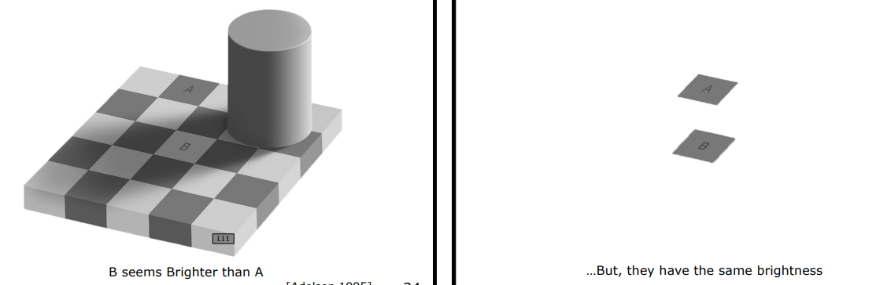
    <figcaption style="margin-top: 0.5em; text-align: center; font-size: 13px; color: #888;"><em>Görsel 16: Adelson Checker Shadow İllüzyonu (1995). Sol: Gölge altındaki B karesi A'dan daha açık görünür. Sağ: İzole edildiklerinde A ve B karelerinin mutlak piksel parlaklıklarının birebir aynı olduğu ortaya çıkar.</em></figcaption>
  

</figure>

* **Fiziksel Açıklaması:** İnsan beyni, sahnede bir silindir tarafından düşürülen kademeli bir gölge (*gradual illumination change*) olduğunu anında saptar. Nesnelerin gerçek malzeme yansıtıcılığını (*albedo*) doğru algılayabilmek için bu gölge farkını matematiksel olarak filtreler (*normalleştirir*). Bu akıllı "aydınlatma filtrelemesi", piksellerin mutlak fiziksel parlaklıkları aynı olsa dahi beynimizin B'yi daha açık boyanmış bir kare olarak algılamasını sağlar.

---

## 6. Özetleyici Teknik Karşılaştırma Matrisi

| SfS Konu Başlığı | Matematiksel / Fiziksel Kısıt | Sağladığı Kritik Avantaj | Karşılaşılan Sınır / Çöküş Noktası |
| :--- | :--- | :--- | :--- |
| **Matematiksel Belirsizlik** | Tek yoğunluk denklemine karşılık 2 bilinmeyen ($p, q$). | Tek görüntüden derinlik rekonstrüksiyonunun teorik sınırlarını kurma. | Ek kısıtlar (*smoothness, boundary*) olmadan çözümsüz kalması. |
| **İnsan Shading Algısı** | Işığın yukarıdan geldiği ve tekil olduğu varsayımı. | Belirsizliği aşmak için beynin güçlü geometrik önsel kuralları (*priors*) dayatması. | Hollow-mask illüzyonunda olduğu gibi aşina olunan şekillerde yanılma. |
| **Stereografik İzdüşüm** | Güney kutbundan $z=1$ düzlemine homojen izdüşüm. | Yüzey normallerini sonsuza gitmeden $[-2, 2]$ dairesine hapsetme. | Sadece üst yarım küredeki (görünür) normaller için geçerli olması. |
| **Ikeuchi-Horn Algoritması** | $e = e_S + \lambda e_R$ minimizasyonu ve Dirichlet sınırları. | Sınır normallerini içeriye doğru yayarak pürüzsüz 3B derinlik inşası. | Yüz kenarları gibi ani bükülmeli (pürüzsüz olmayan) alanlarda hata payının artması. |
| **Şema İllüzyonları** | Uzamsal normalizasyon ve gradyan hassasiyeti. | Beynin aydınlatma değişimlerini nasıl süzdüğünü ve kompanse ettiğini anlama. | Mutlak piksel ölçümlerinde insan gözünün donanımsal olarak yanılması. |
