# Kamera Modelleri, Koordinat Sistemleri ve Kamera Kalibrasyonu

<!-- toc -->

## 1. Kamera Kalibrasyonuna Genel Bakış (Overview)

Bilgisayarlı görünün en temel hedeflerinden biri, iki boyutlu (2B) görüntülerdeki pikselleri analiz ederek sahnenin üç boyutlu (3B) metrik yapısını yeniden inşa etmektir (rekonstrüksiyon). Bir robotun, otonom aracın veya artırılmış gerçeklik (AR) sisteminin dış dünya ile fiziksel etkileşime girebilmesi için sahne boyutlarının piksel biriminden milimetre veya metre gibi fiziksel büyüklüklere dönüştürülmesi şarttır.

Bu geçişi sağlayan matematiksel ve optik süreç **Kamera Kalibrasyonu (Camera Calibration)** olarak adlandırılır. Bir kameranın görüntüleme geometrisini tanımlayabilmek ve 2B piksel koordinatları ile 3B dünya koordinatları arasındaki matematiksel köprüyü kurabilmek için iki temel parametre grubunun saptanması gerekir:

1. **Dışsal (Ekstrensek - Extrinsic) Parametreler:** Kameranın 3B dünya koordinat sistemine ($\mathcal{W}$) göre uzaydaki kesin konumunu (öteleme - translation, $\mathbf{t}$) ve bakış açısını (dönme - rotation, $R$) tanımlar.
2. **İçsel (İntrensek - Intrinsic) Parametreler:** Kameranın kendi donanımsal ve optik özelliklerini tanımlar. Merceğin odak uzaklığı ($f$), sensörün piksel yoğunlukları ($m_x, m_y$) ve optik eksenin sensörü kestiği asal noktanın (principal point) koordinatları ($o_x, o_y$) bu gruptadır.

<figure style="display:flex; justify-content: center; margin: 20px 0;">
  <div style="text-align: center;">
    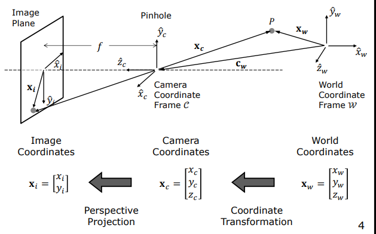
    <figcaption style="margin-top: 0.5em; text-align: center; font-size: 13px; color: #888;"><em>Görsel 1: 3B Dünya koordinat sisteminden ($\mathcal{W}$) kamera koordinat sistemine ($\mathcal{C}$) koordinat dönüşümü ve iğne deliği merceğinden 2B görüntü düzlemine perspektif izdüşüm geometrisi.</em></figcaption>
  </div>
</figure>

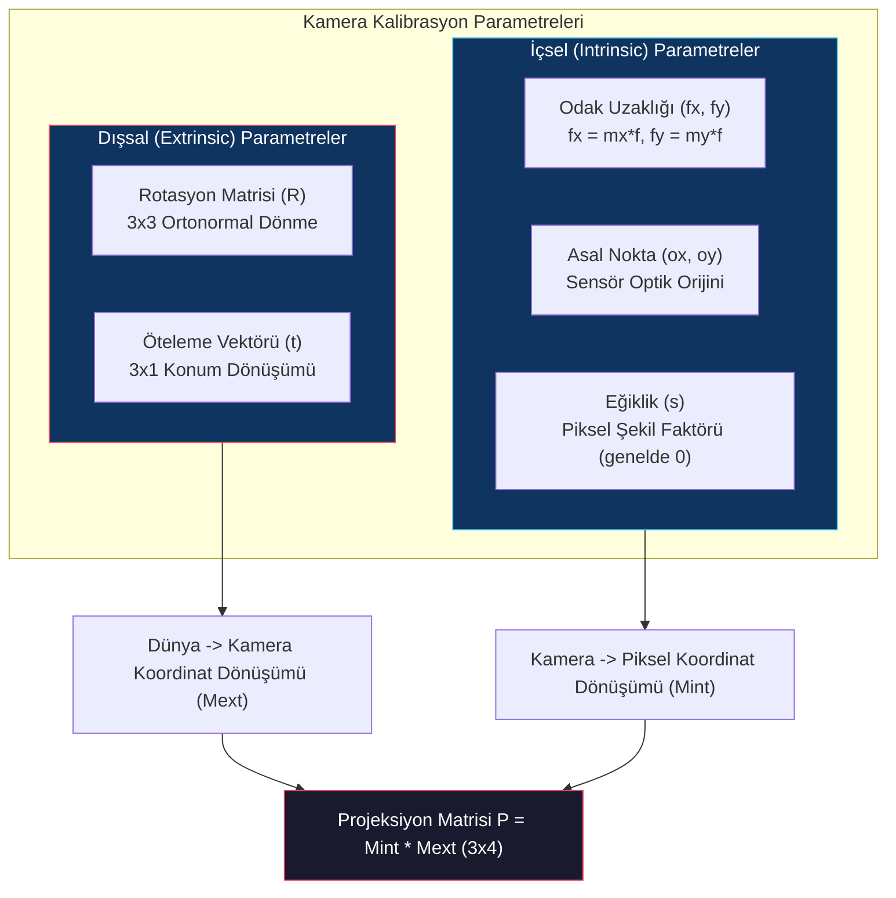

Kamera kalibrasyonu, geometrisi ve boyutları çok hassas olarak bilinen bir kalibrasyon nesnesi (örneğin 3B satranç tahtası/küpü deseni) kullanılarak bu parametrelerin sayısal olarak hesaplanması işlemidir. Bu süreçte, kalibrasyon nesnesi üzerindeki bilinen 3B dünya koordinatları $\mathbf{X}_{wi} = [x_{wi}, y_{wi}, z_{wi}]^T$ ile bunların görüntüdeki 2B piksel izdüşümleri $\mathbf{u}_i = [u_i, v_i]^T$ arasında eşleşmeler kurulur.

Bu eşleşmeler kullanılarak önce tek bir global $3 \times 4$ boyutlu **Projeksiyon Matrisi ($P$)** çözülür; ardından bu matris doğrusal cebir yöntemleriyle (QR ayrıştırması) ayrıştırılarak içsel ve dışsal parametreler tek tek elde edilir.

> **Key Insight:** Kalibrasyon yapılmadan bir görüntüdeki nesnenin gerçek dünyadaki boyutları veya kameraya olan uzaklığı bilinemez. Kamera kalibrasyonu, piksel boyutunu metreye bağlayan köprüdür.

---

## 2. Doğrusal Kamera Modeli (Linear Camera Model)

3B uzaydaki bir noktanın kamera sensöründeki 2B piksel koordinatına dönüşümü, **İleri Görüntüleme Modeli (Forward Imaging Model)** ile üç adımda matematikselleştirilir:

```mermaid
flowchart LR
    World["3B Dünya Noktası<br/>(Xw, Yw, Zw)"] -->|Dışsal Dönüşüm<br/>(R, t)| Cam["3B Kamera Noktası<br/>(Xc, Yc, Zc)"]
    Cam -->|Perspektif İzdüşüm<br/>Mercek Odak Uzaklığı f| ImagePlane["2B Görüntü Düzlemi (mm)<br/>(xi, yi)"]
    ImagePlane -->|Sensör Haritalama<br/>Piksel Yoğunlukları & Asal Nokta| Pixel["2B Piksel Koordinatı<br/>(u, v)"]
    style World fill:#1a1a2e,stroke:#e94560,color:#fff
    style Cam fill:#16213e,stroke:#4cc9f0,color:#fff
    style ImagePlane fill:#0f3460,stroke:#e94560,color:#fff
    style Pixel fill:#0f3460,stroke:#4cc9f0,color:#fff
```

### 2.1 Perspektif İzdüşüm (3B'dan 2B Milimetreye)

Optik merkez (orijin) $O_c$ noktasına yerleştirilmiş ve optik ekseni $z_c$ yönünde olan bir **iğne deliği (pinhole)** kamera modelinde, $(x_c, y_c, z_c)$ konumundaki bir sahne noktasının görüntü düzlemindeki milimetrik izdüşümü $(x_i, y_i)$, benzer üçgenler yardımıyla türetilir:

$$\frac{x_i}{f} = \frac{x_c}{z_c} \implies x_i = f \frac{x_c}{z_c}$$

$$\frac{y_i}{f} = \frac{y_c}{z_c} \implies y_i = f \frac{y_c}{z_c}$$

Burada $f$, kameranın etkin odak uzaklığıdır (focal length, mm biriminde).

### 2.2 Sensör Haritalama (Milimetreden Piksele)

Dijital görüntü sensörü (CCD/CMOS), milimetrik görüntü düzlemini piksellere dönüştürür. Sensör üzerindeki pikseller kusursuz kare olmayabilir. Bu nedenle sensörün yatay piksel yoğunluğu $m_x$ (piksel/mm) ve dikey piksel yoğunluğu $m_y$ (piksel/mm) olarak tanımlanır.

<figure style="display:flex; justify-content: center; margin: 20px 0;">
  <div style="text-align: center;">
    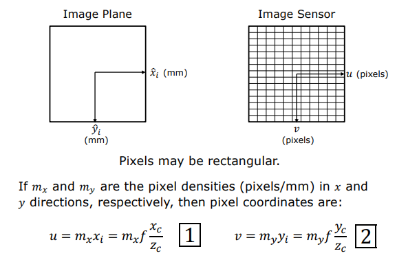
    <figcaption style="margin-top: 0.5em; text-align: center; font-size: 13px; color: #888;"><em>Görsel 2: Milimetrik görüntü düzleminden ($x_i, y_i$) dijital piksel sensörüne ($u, v$) geçiş ve $m_x, m_y$ piksel yoğunlukları ile ölçekleme.</em></figcaption>
  </div>
</figure>

Ayrıca, optik eksenin sensörü tam olarak deldiği **Asal Nokta (Principal Point)**, görüntü koordinat sisteminin sol-üst köşesinde yer alan $(0,0)$ orijinine göre $(o_x, o_y)$ piksel kaymasına sahiptir.

<figure style="display:flex; justify-content: center; margin: 20px 0;">
  <div style="text-align: center;">
    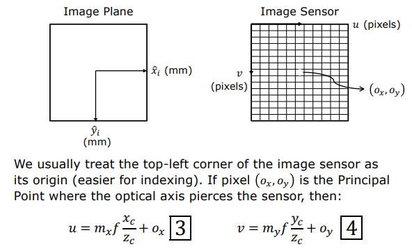
    <figcaption style="margin-top: 0.5em; text-align: center; font-size: 13px; color: #888;"><em>Görsel 3: Sensör indeksleme kolaylığı için orijinin sol-üst köşeye taşınması ve optik eksenin sensörü deldiği Asal Nokta (Principal Point - $o_x, o_y$) kayması.</em></figcaption>
  </div>
</figure>

Bu fiziksel etkiler birleştirildiğinde dijital piksel koordinatları $(u, v)$ şu şekilde yazılır:

$$u = m_x x_i + o_x = m_x f \frac{x_c}{z_c} + o_x$$

$$v = m_y y_i + o_y = m_y f \frac{y_c}{z_c} + o_y$$

Bilinmeyen donanımsal parametreleri azaltmak için piksel cinsinden etkin odak uzaklıkları $f_x$ ve $f_y$ tanımlanır:

$$f_x = m_x \cdot f \quad \text{ve} \quad f_y = m_y \cdot f$$

Böylece nihai doğrusal olmayan projeksiyon denklemleri elde edilir:

$$u = f_x \frac{x_c}{z_c} + o_x \quad \text{ve} \quad v = f_y \frac{y_c}{z_c} + o_y$$

### 2.3 Homojen Koordinatlar ile Doğrusallaştırma

Yukarıdaki denklemlerde paydada yer alan derinlik bileşeni $z_c$ nedeniyle sistem doğrusal değildir (non-linear). Bu matematiksel engeli aşmak için koordinatlar **Homojen Koordinat Uzayına** taşınır. 

2B piksel koordinatı $(u, v)$ homojen $[\tilde{u}, \tilde{v}, \tilde{w}]^T = [z_c u, z_c v, z_c]^T$ vektörüne dönüştürülür. Geometrik olarak bu dönüşüm, 2B düzlemdeki bir noktayı 3B uzayda orijinden geçen bir doğru (ışın) haline getirir; $\tilde{w}=1$ hiper-düzlemi ile bu doğrunun kesişimi gerçek Öklid piksellerini verir.

<figure style="display:flex; justify-content: center; margin: 20px 0;">
  <div style="text-align: center;">
    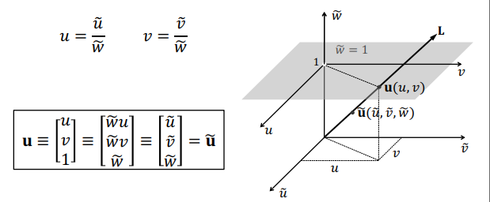
    <figcaption style="margin-top: 0.5em; text-align: center; font-size: 13px; color: #888;"><em>Görsel 4: 2B Homojen koordinat uzayı: $[\tilde{u}, \tilde{v}, \tilde{w}]^T$ uzayındaki bir L doğrusunun $\tilde{w}=1$ izdüşüm düzlemini kestiği nokta Öklid koordinatlarını ($u = \tilde{u}/\tilde{w}, v = \tilde{v}/\tilde{w}$) verir.</em></figcaption>
  </div>
</figure>

Benzer şekilde 3B sahne noktası da $[x_c, y_c, z_c, 1]^T$ homojen vektörüne yükseltilir:

<figure style="display:flex; justify-content: center; margin: 20px 0;">
  <div style="text-align: center;">
    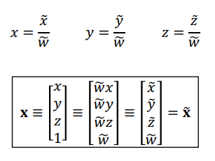
    <figcaption style="margin-top: 0.5em; text-align: center; font-size: 13px; color: #888;"><em>Görsel 5: 3B Öklid koordinatlarının homojenizasyon ile 4 bileşenli $[\tilde{x}, \tilde{y}, \tilde{z}, \tilde{w}]^T$ vektörüne genişletilmesi.</em></figcaption>
  </div>
</figure>

Bu yükseltme sayesinde perspektif bölme işlemi doğrusal bir matris çarpımına dönüştürülür:

<figure style="display:flex; justify-content: center; margin: 20px 0;">
  <div style="text-align: center;">
    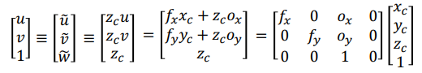
    <figcaption style="margin-top: 0.5em; text-align: center; font-size: 13px; color: #888;"><em>Görsel 6: Doğrusal kamera modelinin 3x4 boyutlu matris çarpımı cinsinden homojen ifadesi.</em></figcaption>
  </div>
</figure>

$$\begin{bmatrix} z_c u \\ z_c v \\ z_c \end{bmatrix} = \begin{bmatrix} f_x & 0 & o_x & 0 \\ 0 & f_y & o_y & 0 \\ 0 & 0 & 1 & 0 \end{bmatrix} \begin{bmatrix} x_c \\ y_c \\ z_c \\ 1 \end{bmatrix}$$

---

## 3. İçsel ve Dışsal Matrisler (Intrinsic and Extrinsic Matrices)

Doğrusal kamera modelini tam olarak tanımlayan iki alt matris mevcuttur:

### 3.1 İçsel Matris (Intrinsic Matrix - $M_{int}$)

Kameranın tamamen kendi iç optik ve donanımsal yapısını temsil eden $3 \times 4$ boyutundaki matristir:

$$M_{int} = \begin{bmatrix} K \mid \mathbf{0} \end{bmatrix} = \begin{bmatrix} f_x & 0 & o_x & 0 \\ 0 & f_y & o_y & 0 \\ 0 & 0 & 1 & 0 \end{bmatrix}$$

Burada $K$, $3 \times 3$ boyutundaki **Kalibrasyon Matrisidir (Calibration Matrix)**:

<figure style="display:flex; justify-content: center; margin: 20px 0;">
  <div style="text-align: center;">
    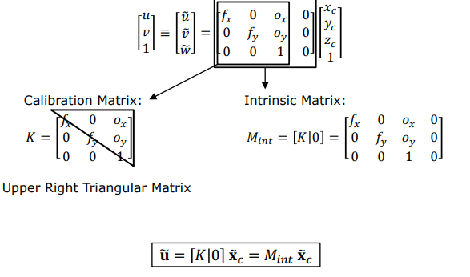
    <figcaption style="margin-top: 0.5em; text-align: center; font-size: 13px; color: #888;"><em>Görsel 7: Kalibrasyon matrisi K'nın sağ-üst üçgen (Upper Right Triangular) yapısı ve İçsel Matris $M_{int} = [K \mid \mathbf{0}]$ tanımı.</em></figcaption>
  </div>
</figure>

$$K = \begin{bmatrix} f_x & 0 & o_x \\ 0 & f_y & o_y \\ 0 & 0 & 1 \end{bmatrix}$$

> **Matematiksel Not:** Kalibrasyon matrisi $K$, ana köşegeninin altındaki elemanları sıfır olan **sağ-üst üçgen (upper-right triangular)** formundadır. Sensör pikselleri tam dik değilse eğiklik (skew) parametresi $s$ eklenerek $K_{12} = s$ yazılabilir, ancak modern sensörlerde $s = 0$'dır.

### 3.2 Dışsal Matris (Extrinsic Matrix - $M_{ext}$)

Dünya koordinat sistemindeki ($\mathcal{W}$) bir $\mathbf{X}_w = [x_w, y_w, z_w]^T$ noktasının kamera koordinat sistemine ($\mathcal{C}$) dönüştürülmesini sağlar. Kameranın yönelimi $3 \times 3$ boyutlu bir **Rotasyon Matrisi ($R$)** ile konumu ise $3 \times 1$ boyutlu **Öteleme Vektörü ($\mathbf{t} = -R \mathbf{c}_w$)** ile ifade edilir:

<figure style="display:flex; justify-content: center; margin: 20px 0;">
  <div style="text-align: center;">
    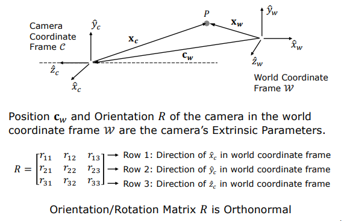
    <figcaption style="margin-top: 0.5em; text-align: center; font-size: 13px; color: #888;"><em>Görsel 8: Dışsal Parametreler: Kameranın dünya sistemindeki konumu $\mathbf{c}_w$ ve eksen yönelimlerini belirten ortonormal Rotasyon Matrisi $R$.</em></figcaption>
  </div>
</figure>

$$\begin{bmatrix} x_c \\ y_c \\ z_c \\ 1 \end{bmatrix} = M_{ext} \begin{bmatrix} x_w \\ y_w \\ z_w \\ 1 \end{bmatrix} = \begin{bmatrix} R_{3 \times 3} & \mathbf{t}_{3 \times 1} \\ \mathbf{0}_{1 \times 3} & 1 \end{bmatrix} \begin{bmatrix} x_w \\ y_w \\ z_w \\ 1 \end{bmatrix}$$

Rotasyon matrisi $R$ **ortonormal** bir matristir; yani satır ve sütunları birbirine dik ve birim uzunluktadır ($R^T R = I, R^{-1} = R^T$).

### 3.3 Projeksiyon Matrisi (Projection Matrix - $P$)

İçsel ve dışsal matrisler ardışık olarak çarpıldığında, 3B dünya koordinatlarındaki bir noktayı doğrudan görüntü üzerindeki piksele eşleyen $3 \times 4$ boyutundaki **Projeksiyon Matrisi ($P$)** elde edilir:

<figure style="display:flex; justify-content: center; margin: 20px 0;">
  <div style="text-align: center;">
    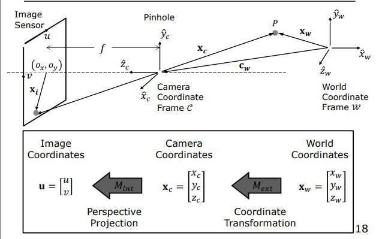
    <figcaption style="margin-top: 0.5em; text-align: center; font-size: 13px; color: #888;"><em>Görsel 9: Dünya koordinatlarından piksel koordinatlarına iki adımlı dönüşüm zinciri ($M_{ext}$ ile Dünya->Kamera, $M_{int}$ ile Kamera->Piksel).</em></figcaption>
  </div>
</figure>

<figure style="display:flex; justify-content: center; margin: 20px 0;">
  <div style="text-align: center;">
    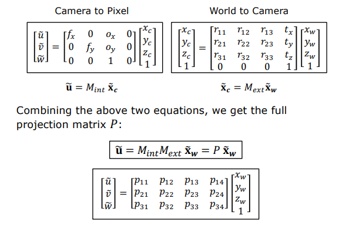
    <figcaption style="margin-top: 0.5em; text-align: center; font-size: 13px; color: #888;"><em>Görsel 10: İçsel ve dışsal dönüşümlerin birleşimiyle tek adımda haritalama sağlayan 3x4 Projeksiyon Matrisi $P = M_{int} M_{ext}$.</em></figcaption>
  </div>
</figure>

$$\tilde{\mathbf{u}} = M_{int} \cdot M_{ext} \cdot \tilde{\mathbf{X}}_w = P \cdot \tilde{\mathbf{X}}_w$$

$$P = K \begin{bmatrix} R \mid \mathbf{t} \end{bmatrix} = \begin{bmatrix} p_{11} & p_{12} & p_{13} & p_{14} \\ p_{21} & p_{22} & p_{23} & p_{24} \\ p_{31} & p_{32} & p_{33} & p_{34} \end{bmatrix}$$

```mermaid
flowchart TD
    WorldPt["3B Dünya Koordinatı (Xw, Yw, Zw, 1)^T"] -->|Dışsal Matris Mext (4x4)| CamPt["3B Kamera Koordinatı (Xc, Yc, Zc, 1)^T"]
    CamPt -->|İçsel Matris Mint (3x4)| HomogPixel["Homojen Piksel Vektörü (z_c*u, z_c*v, z_c)^T"]
    WorldPt -->|Tek Adımda Projeksiyon Matrisi P (3x4)| HomogPixel
    HomogPixel -->|Ölçek Bölmesi (Öklid Homojenizasyonu)| PixelCoord["2B Piksel Koordinatı (u, v)"]
    style WorldPt fill:#0f3460,stroke:#e94560,color:#fff
    style CamPt fill:#0f3460,stroke:#4cc9f0,color:#fff
    style HomogPixel fill:#1a1a2e,stroke:#e94560,color:#fff
    style PixelCoord fill:#16213e,stroke:#4cc9f0,color:#fff
```

---

## 4. Kamera Kalibrasyonu (Camera Calibration)

Kamera kalibrasyonunun amacı, Projeksiyon Matrisi $P$'nin içerdiği 12 adet bilinmeyen parametreyi ($p_{11}$ ile $p_{34}$ arası) denklem sistemi kurarak hesaplamaktır.

<figure style="display:flex; justify-content: center; margin: 20px 0;">
  <div style="text-align: center;">
    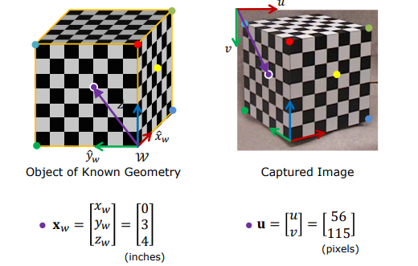
    <figcaption style="margin-top: 0.5em; text-align: center; font-size: 13px; color: #888;"><em>Görsel 11: Geometrisi bilinen kalibrasyon nesnesi (3B küp) üzerindeki dünya noktaları $\mathbf{X}_w$ ile görüntüdeki 2B piksel karşılıkları $\mathbf{u}$ arasındaki eşleşmeler.</em></figcaption>
  </div>
</figure>

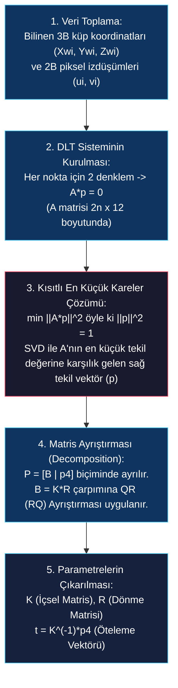

### 4.1 Doğrusal Denklem Sisteminin İnşası (DLT - Direct Linear Transformation)

Kalibrasyon nesnesi üzerindeki $i = 1, \dots, n$ adet noktanın 3B dünya koordinatı $(x_{wi}, y_{wi}, z_{wi})$ ile görüntü üzerindeki 2B piksel koordinatı $(u_i, v_i)$ eşleştirilir. 

<figure style="display:flex; justify-content: center; margin: 20px 0;">
  <div style="text-align: center;">
    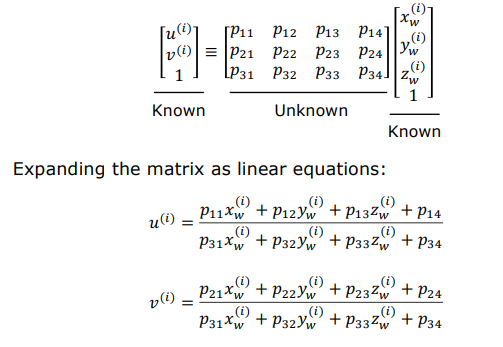
    <figcaption style="margin-top: 0.5em; text-align: center; font-size: 13px; color: #888;"><em>Görsel 12: Bilinen 3B nokta ve 2B piksel koordinatları kullanılarak $P$ matrisinin elemanları cinsinden kesirli projeksiyon eşitliklerinin yazılması.</em></figcaption>
  </div>
</figure>

Projeksiyon denklemi homojen formda açıldığında:

$$\begin{bmatrix} z_{ci} u_i \\ z_{ci} v_i \\ z_{ci} \end{bmatrix} = \begin{bmatrix} p_{11} & p_{12} & p_{13} & p_{14} \\ p_{21} & p_{22} & p_{23} & p_{24} \\ p_{31} & p_{32} & p_{33} & p_{34} \end{bmatrix} \begin{bmatrix} x_{wi} \\ y_{wi} \\ z_{wi} \\ 1 \end{bmatrix}$$

3. satırdan $z_{ci} = p_{31} x_{wi} + p_{32} y_{wi} + p_{33} z_{wi} + p_{34}$ çekilerek 1. ve 2. satırlarda yerine yazılırsa, ölçek çarpanı $z_{ci}$ elenir ve her 3B-2B nokta çifti için **2 bağımsız doğrusal eşitlik** elde edilir:

$$(p_{11} x_{wi} + p_{12} y_{wi} + p_{13} z_{wi} + p_{14}) - u_i (p_{31} x_{wi} + p_{32} y_{wi} + p_{33} z_{wi} + p_{34}) = 0$$

$$(p_{21} x_{wi} + p_{22} y_{wi} + p_{23} z_{wi} + p_{24}) - v_i (p_{31} x_{wi} + p_{32} y_{wi} + p_{33} z_{wi} + p_{34}) = 0$$

Küp üzerindeki $n$ adet noktanın tamamı ($n \ge 6$) için bu denklemler üst üste istiflenerek $2n \times 12$ boyutlarında bir $A$ matrisi ve 12 elemanlı bilinmeyen parametre vektörü $\mathbf{p} = [p_{11}, p_{12}, \dots, p_{34}]^T$ oluşturulur:

<figure style="display:flex; justify-content: center; margin: 20px 0;">
  <div style="text-align: center;">
    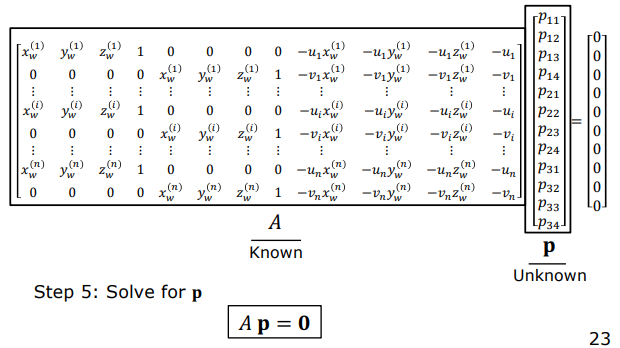
    <figcaption style="margin-top: 0.5em; text-align: center; font-size: 13px; color: #888;"><em>Görsel 13: Tum nokta eslesmelerinin üst üste dizilmesiyle elde edilen $2n \times 12$ boyutlu bilinen $A$ matrisi ve bilinmeyen $\mathbf{p}$ vektörü ($A \mathbf{p} = \mathbf{0}$).</em></figcaption>
  </div>
</figure>

$$A \mathbf{p} = \mathbf{0}$$

### 4.2 Kısıtlı En Küçük Kareler Çözümü (Constrained Least Squares)

Projeksiyon matrisi homojen koordinatlarla çalıştığı için sadece bir ölçek çarpanına (scale factor) kadar saptanabilir ($\lambda P$ ile $P$ aynı piksel izdüşümünü verir). 

<figure style="display:flex; justify-content: center; margin: 20px 0;">
  <div style="text-align: center;">
    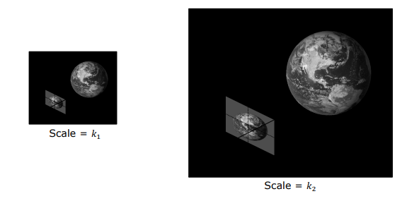
    <figcaption style="margin-top: 0.5em; text-align: center; font-size: 13px; color: #888;"><em>Görsel 14: Perspektif izdüşümde ölçek serbestliği: Sahne boyutunu ve mesafeyi aynı $k$ çarpanıyla ölçeklemek ($Scale = k_1$ vs $Scale = k_2$) piksel izdüşümünü tamamen aynı tutar.</em></figcaption>
  </div>
</figure>

Bu ölçek serbestliğini gidermek amacıyla parametre vektörünün normu bire eşitlenir ($\|\mathbf{p}\|^2 = 1$). Gürültülü ölçümleri minimize etmek için kısıtlı optimizasyon problemi kurulur:

$$\min_{\mathbf{p}} \|A \mathbf{p}\|^2 \quad \text{öyle ki} \quad \|\mathbf{p}\|^2 = 1$$

#### Teorik İspat (Lagrange Çarpanları Yöntemi)

Bu optimizasyon problemini çözmek için bir $\lambda$ Lagrange çarpanı eklenerek Lagrange fonksiyonu tanımlanır:

$$\mathcal{L}(\mathbf{p}, \lambda) = \mathbf{p}^T A^T A \mathbf{p} - \lambda (\mathbf{p}^T \mathbf{p} - 1)$$

Fonksiyonun $\mathbf{p}$ vektörüne göre türevi alınıp sıfıra eşitlendiğinde:

$$\frac{\partial \mathcal{L}}{\partial \mathbf{p}} = 2 A^T A \mathbf{p} - 2 \lambda \mathbf{p} = \mathbf{0} \implies A^T A \mathbf{p} = \lambda \mathbf{p}$$

Bu denklem klasik bir **Özdeğer/Özvektör Problemidir (Eigenvalue Problem)**. 

Bunu minimize etmek istediğimiz $\|A \mathbf{p}\|^2$ ifadesinde yerine koyarsak:

$$\|A \mathbf{p}\|^2 = \mathbf{p}^T A^T A \mathbf{p} = \mathbf{p}^T (\lambda \mathbf{p}) = \lambda \mathbf{p}^T \mathbf{p} = \lambda$$

> **İspat Sonucu:** $\|A \mathbf{p}\|^2$ değerinin minimum olması, $\lambda$ özdeğerinin minimum olmasına bağlıdır! Dolayısıyla $A \mathbf{p} = \mathbf{0}$ doğrusal sistemini kısıt altında en kararlı şekilde çözen parametre vektörü $\mathbf{p}$, **$A^T A$ matrisinin en küçük özdeğerine ($\lambda_{\min}$) karşılık gelen özvektörüdür** (veya $A$ matrisinin Tekil Değer Ayrıştırmasındaki - SVD - en küçük tekil değere karşılık gelen sağ tekil vektörü $V_{*,12}$).

Bu özvektör çözüldükten sonra elemanlar $3 \times 4$ boyutunda yeniden dizilerek Projeksiyon Matrisi $P$ elde edilir.

### 4.3 Projeksiyon Matrisinin İçsel ve Dışsal Bileşenlerine Ayrıştırılması

Elde edilen $P$ matrisinden bağımsız içsel ($K$) ve dışsal ($R, \mathbf{t}$) parametreleri çıkarmak için doğrusal cebir adımları uygulanır:

1. **Kalibrasyon ($K$) ve Rotasyon ($R$) Ayrımı:** Projeksiyon matrisinin sol tarafındaki $3 \times 3$ alt matrisi $B$ olarak adlandıralım:
   $$P = [B_{3 \times 3} \mid \mathbf{p}_4] = [K \cdot R \mid K \cdot \mathbf{t}]$$
   $B = K \cdot R$ çarpımında $K$ sağ-üst üçgen matris (upper-right triangular), $R$ ise ortonormal dönme matrisidir ($R R^T = I$). Matris cebrinde bu form **QR Ayrıştırması (QR Decomposition)** veya **RQ Ayrıştırması** yöntemiyle $K$ ve $R$ matrislerine kusursuz ve benzersiz şekilde ayrıştırılır.
2. **Öteleme Vektörünün ($\mathbf{t}$) Çözümü:** Projeksiyon matrisinin en son (4.) sütunu $\mathbf{p}_4$, kalibrasyon matrisi ile öteleme vektörünün çarpımına eşittir ($\mathbf{p}_4 = K \mathbf{t}$). $K$ matrisinin tersi alınarak öteleme vektörü doğrudan hesaplanır:
   $$\mathbf{t} = K^{-1} \mathbf{p}_4$$

### 4.4 Optik Mercek Bozunmaları (Lens Distortions)

Gerçek mercek sistemleri iğne deliği kamera modelinden sapmalar gösterir. Projeksiyon matrisi $P$ doğrusal modellemeyi çözerken, optik elemanların küresel yapısından kaynaklanan doğrusal olmayan bozunmalar ayrı parametrelerle modellenir ve kalibrasyon sonrasında düzeltilir:

1. **Radyal Bozunma (Radial Distortion):** Merkeze uzaklaştıkça ışınların farklı kırılmasından kaynaklanır (*Barrel* veya *Pincushion* bozunması).
2. **Teğetsel Bozunma (Tangential Distortion):** Mercek elemanlarının görüntü sensörüne tam paralel monte edilememesinden kaynaklanır.

<figure style="display:flex; justify-content: center; margin: 20px 0;">
  <div style="text-align: center;">
    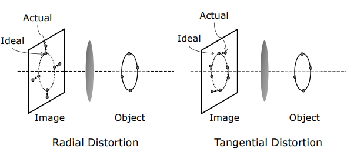
    <figcaption style="margin-top: 0.5em; text-align: center; font-size: 13px; color: #888;"><em>Görsel 15: Mercek kusurlarından kaynaklanan optik bozunma türleri: Radyal Bozunma (Radial Distortion) ve Teğetsel Bozunma (Tangential Distortion).</em></figcaption>
  </div>
</figure>

Bu süreç tamamlandığında kameranın iç geometrik yapısı ($K$), dış dünya koordinatlarındaki kesin konumu ($\mathbf{t}$), yönelimi ($R$) ve optik bozunma katsayıları tamamen çözülmüş olur.
