# Optik Akış ve Görüntü Hareket Analizi (Optical Flow and Motion Analysis)

<!-- toc -->

Bilgisayarlı görüde daha önce ele aldığımız kamera modelleri, kalibrasyon, stereo vizyon ve gölgelendirmeden şekil çıkarma gibi konularda genellikle durağan sahneler (*stationary scenes*) veya sabit kamera koşulları varsayılmıştır. Ancak gerçek fiziksel dünya son derece dinamiktir; nesneler uzayda hareket eder, kameralar hareket halindedir ve hareket, biyolojik ve yapay görsel sistemlerin çevreyi anlamlandırmasında en kritik bilgi kaynaklarından biridir.

Bu ders notunda; hareket alanı (*motion field*) ile optik akış (*optical flow*) arasındaki fiziksel farklardan başlayarak, optik akış kısıt denklemini (*optical flow constraint equation*), açıklık problemini (*aperture problem*), Lucas-Kanade en küçük kareler (*least squares*) çözümünü, kaba-hassas (*coarse-to-fine*) çözünürlük piramidi optimizasyonlarını ve endüstriyel uygulama alanlarını matematiksel ve teorik derinliğiyle ele alıyoruz.

---

## 1. Genel Bakış ve Tarihsel Temeller (Overview)

Dinamik bir sahneyi analiz ederken, zamansal olarak ardışık çekilen video kareleri ($t$ ve $t + \delta t$) arasındaki görsel piksel kaymalarını ölçmek isteriz. Bilgisayarlı görü literatüründe bu problem iki temel kavramla ele alınır:

1. **Hareket Alanı (Motion Field - $\mathbf{v}_i$):** Sahnedeki üç boyutlu gerçek fiziksel noktaların 3B hız vektörlerinin ($\mathbf{v}_0$), kamera perspektif izdüşüm merkezi üzerinden 2B görüntü düzlemine yansıyan geometrik izdüşümüdür.
2. **Optik Akış (Optical Flow - $\mathbf{u}$):** Görüntü sensörü üzerinde piksellerin gösterdiği parlaklık örüntülerinin (*brightness patterns*) zamana bağlı algılanan ve ölçülebilen yerel hareket vektörleridir ($u, v$).

<figure style="display:flex; justify-content: center; margin: 20px 0;">
  

    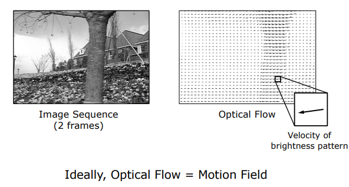
    <figcaption style="margin-top: 0.5em; text-align: center; font-size: 13px; color: #888;"><em>Şekil 1: Ardışık iki görüntü karesi arasında parlaklık deseninin hız vektörleri (Optik Akış). İdeal koşullarda Optik Akış, Hareket Alanına eşittir.</em></figcaption>
  

</figure>

Ana hedefimiz, ardışık video kareleri arasında piksellerin nereye hareket ettiğini saptayarak hareket alanını ($\mathbf{v}_i$) doğrudan ölçmektir. Ancak kamera sensörleri yalnızca piksellerin ham parlaklık ve renk değerlerini kaydettiği için, doğrudan fiziksel hareket alanını ölçemeyiz; sadece parlaklık desenlerinin değişimini (optik akış) ölçebiliriz.

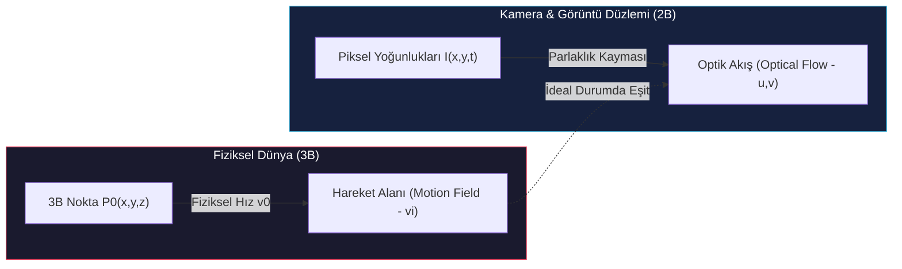

> **Temel İlke (Key Insight):** Çoğu standart aydınlatma ve zengin dokulu sahnede optik akış ile hareket alanı birbirine örtüşür. Ancak yansıma kuralları ve aydınlatma değişimleri nedeniyle bu iki kavramın fiziksel olarak tamamen ayrıştığı çok kritik sınır durumlar mevcuttur.

---

## 2. Hareket Alanı ve Optik Akış (Motion Field & Optical Flow)

### 2.1 Hareket Alanının (Motion Field - $\mathbf{v}_i$) Matematiksel Türetilişi

Dünya koordinat sisteminde, iğne deliği kamerasının optik merkezine (*pinhole*) yerleştirilmiş bir koordinat çerçevesi düşünelim (Horn, 1981).

<figure style="display:flex; justify-content: center; margin: 20px 0;">
  

    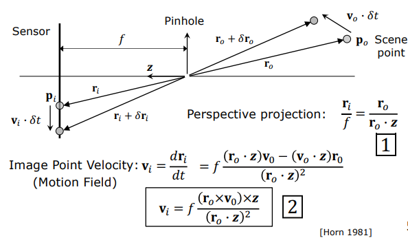
    <figcaption style="margin-top: 0.5em; text-align: center; font-size: 13px; color: #888;"><em>Şekil 2: İğne deliği kamera modelinde 3B nokta hızı (v0) ile görüntü düzlemindeki hareket alanı (vi) geometrisi.</em></figcaption>
  

</figure>

Sahnedeki bir $P_0$ noktasının 3B konumu $\mathbf{r}_0 = [x_w, y_w, z_w]^T$ vektörüyle tanımlansın. Bu noktanın görüntü düzlemindeki perspektif izdüşüm noktası $p_i$ ve konum vektörü $\mathbf{r}_i = [x_i, y_i, f]^T$ olsun.

Kameranın efektif odak uzaklığı $f$ ve optik eksen birim vektörü $\mathbf{z}$ olmak üzere, perspektif izdüşüm kuralına göre:

$$\mathbf{r}_i = f \frac{\mathbf{r}_0}{\mathbf{r}_0 \cdot \mathbf{z}}$$

Burada $\mathbf{r}_0 \cdot \mathbf{z} = z_w$ (noktanın kameraya olan derinliği) ifadesidir.

$P_0$ noktasının 3B uzaydaki gerçek fiziksel hızı $\mathbf{v}_0 = \frac{d\mathbf{r}_0}{dt}$ olsun. Görüntü düzleminde oluşan hareket alanı $\mathbf{v}_i$ ise izdüşüm vektörünün zamana göre türevidir:

$$\mathbf{v}_i = \frac{d\mathbf{r}_i}{dt}$$

Bölümün türevi kuralı (*quotient rule*) uygulandığında:

$$\mathbf{v}_i = \frac{d}{dt} \left( f \frac{\mathbf{r}_0}{\mathbf{r}_0 \cdot \mathbf{z}} \right) = f \frac{(\mathbf{r}_0 \cdot \mathbf{z})\mathbf{v}_0 - \mathbf{r}_0 (\mathbf{v}_0 \cdot \mathbf{z})}{(\mathbf{r}_0 \cdot \mathbf{z})^2}$$

Vektör analizi ve üçlü vektörel çarpım kimliği ($\mathbf{a} \times (\mathbf{b} \times \mathbf{c}) = (\mathbf{a} \cdot \mathbf{c})\mathbf{b} - (\mathbf{a} \cdot \mathbf{b})\mathbf{c}$) kullanılarak bu ifade kompakt biçimde yazılabilir:

$$\mathbf{v}_i = f \frac{(\mathbf{r}_0 \times \mathbf{v}_0) \times \mathbf{z}}{(\mathbf{r}_0 \cdot \mathbf{z})^2} = \frac{f \cdot (\mathbf{z} \times (\mathbf{r}_0 \times \mathbf{v}_0))}{(\mathbf{r}_0 \cdot \mathbf{z})^2}$$

Bu bağıntı; bir noktanın 3B konumu ($\mathbf{r}_0$), derinliği ($z_w$) ve 3B hızı ($\mathbf{v}_0$) bilindiğinde, kamera sensöründe oluşacak gerçek geometrik kayma hızını ($\mathbf{v}_i$) analitik olarak hesaplamamızı sağlar.

---

### 2.2 Optik Akış ile Hareket Alanının Uyuşmadığı Sınır Durumlar

İdeal bir sistemde optik akışın hareket alanına eşit olması beklenir. Ancak ışık yansıma yasaları ve gölgelendirme dinamikleri nedeniyle bu eşitliğin bozulduğu üç temel senaryo vardır:

<figure style="display:flex; justify-content: center; margin: 20px 0;">
  

    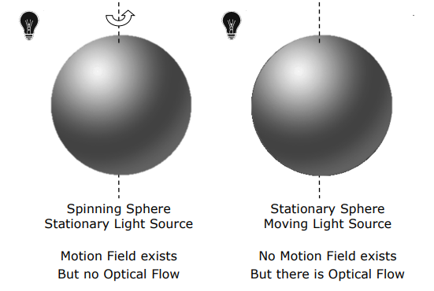
    <figcaption style="margin-top: 0.5em; text-align: center; font-size: 13px; color: #888;"><em>Şekil 3: Sol: Dönen pürüzsüz küre (Hareket alanı var, optik akış yok). Sağ: Hareketsiz küre ve hareket eden ışık kaynağı (Hareket alanı yok, optik akış var).</em></figcaption>
  

</figure>

#### 1. Hareket Alanı Var, Optik Akış Yok (Dönen Pürüzsüz Küre - Spinning Sphere)
- **Senaryo:** Kusursuz pürüzsüz ve homojen bir malzemeden yapılmış bir küre, merkez dikey ekseni etrafında dönmektedir. Küre sabit bir noktasal ışık kaynağıyla aydınlatılmaktadır.
- **Fiziksel Analiz:** Küre döndüğü için üzerindeki tüm fiziksel noktalar hız vektörüne sahiptir ($\mathbf{v}_0 \neq \mathbf{0}$); yani **fiziksel bir hareket alanı (motion field) mevcuttur**. Ancak küre yüzeyi dokusuz ve homojen olduğundan, ışık kaynağı da sabit kaldığından yansıyan parlaklık dağılımı ($I(x,y)$) zamanla kesinlikle değişmez. Ardışık görüntüler piksel piksel aynıdır ($\frac{\partial I}{\partial t} = 0$). Dolayısıyla **optik akış (optical flow) sıfırdır**.

#### 2. Hareket Alanı Yok, Optik Akış Var (Hareket Eden Işık Kaynağı - Moving Light Source)
- **Senaryo:** Küre tamamen hareketsiz (statik) tutulmakta, fakat küreyi aydınlatan ışık kaynağı küre etrafında döndürülmektedir.
- **Fiziksel Analiz:** Küre sabit olduğu için fiziksel hız sıfırdır ($\mathbf{v}_0 = \mathbf{0}$); yani **hareket alanı yoktur**. Ancak ışık kaynağı hareket ettiği için küre üzerindeki aydınlanma, speküler parlaklık ve gölge sınırları görüntü düzleminde sürekli yer değiştirir. Kamera sensörü bu parlaklık kaymasını hareket olarak algılar; yani **optik akış mevcuttur**.

#### 3. Uyuşmayan Doğrultular (Berber Direği İllüzyonu - Barber Pole Illusion)
- **Senaryo:** Üzerinde helis şeklinde (spiral) şeritler barındıran klasik bir berber direği (*cylinder*) kendi dikey ekseni etrafında yatay olarak dönmektedir.
- **Fiziksel Analiz:** Direk dikey eksende döndüğü için tüm fiziksel noktalar yatay doğrultuda hareket eder (**hareket alanı yatay yöndedir**). Ancak kameranın ve gözün algıladığı spiral şerit örüntüleri dikey eksende yukarıdan aşağıya doğru kayıyor gibi görünür (**optik akış dikey yöndedir**). Hareket alanı ile optik akış birbirine tamamen **dik (ortogonal)** doğrultulardadır.

<figure style="display:flex; justify-content: center; margin: 20px 0;">
  

    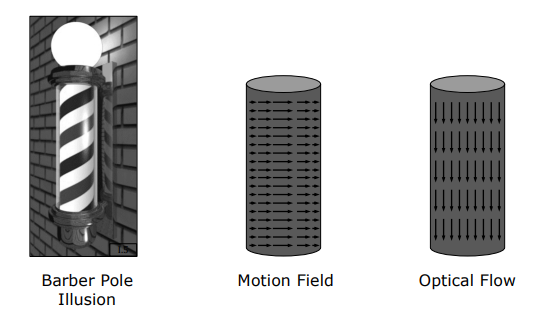
    <figcaption style="margin-top: 0.5em; text-align: center; font-size: 13px; color: #888;"><em>Şekil 4: Barber Pole İllüzyonu: Fiziksel hareket alanı yatay yöndeyken, algılanan optik akış dikey yöndedir (90 derece dik sapma).</em></figcaption>
  

</figure>

---

### 2.3 İnsan Görsel Sisteminde Optik Akış İllüzyonları

İnsan beyninin görsel korteksi (özellikle MT/V5 alanı) optik akış sinyallerini mutlak hareket olarak yorumlamaya programlanmıştır. Bu mekanizma statik görüntülerde bile güçlü hareket yanılsamaları doğurur:

<figure style="display:flex; justify-content: center; margin: 20px 0;">
  

    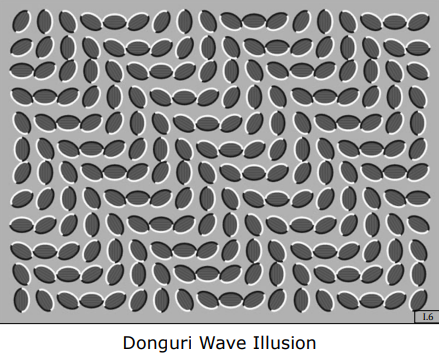
    <figcaption style="margin-top: 0.5em; text-align: center; font-size: 13px; color: #888;"><em>Şekil 5: Donguri Dalga İllüzyonu (Donguri Wave Illusion): Resim tamamen durağan olmasına rağmen, göz hareketleri asimetrik parlaklık gradyanları üzerinden dalgalanan optik akış üretir.</em></figcaption>
  

</figure>

- **Donguri Dalga İllüzyonu (Donguri Wave Illusion):** Asimetrik siyah-beyaz gradyan kenarlarına sahip yaprak desenleri statik bir resimdir. Ancak gözlerimizi resim üzerinde gezdirdiğimizde retinadaki mikro sakkadik hareketler yönlü gradyan yanıtları üretir ve beyin durağan resmi dalga dalga hareket ediyormuş gibi algılar.
- **Ouchi Deseni (Ouchi Pattern):** Ortada dikey çizgili bir dairesel disk, etrafında yatay çizgili bir arka plan yer alır. Resme bakıldığında ortadaki dairenin çerçeveden bağımsız olarak kaydığı hissedilir.

---

## 3. Optik Akış Kısıt Denklemi (Optical Flow Constraint Equation)

İki ardışık video karesi ($t$ ve $t + \delta t$) verildiğinde, her bir piksel için optik akış hız bileşenlerini ($u, v$) hesaplayabilmek için diferansiyel bir kısıt denklemi kurulur.

<figure style="display:flex; justify-content: center; margin: 20px 0;">
  

    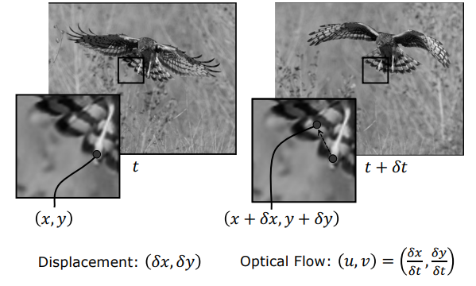
    <figcaption style="margin-top: 0.5em; text-align: center; font-size: 13px; color: #888;"><em>Şekil 6: Uçan bir kuşun t anındaki (x, y) pikselinin t + dt anında (x + dx, y + dy) konumuna ötelenmesi.</em></figcaption>
  

</figure>

### 3.1 Temel Varsayımlar

Optik akış kısıt denklemi iki temel fiziksel varsayım üzerine inşa edilir:

<figure style="display:flex; justify-content: center; margin: 20px 0;">
  

    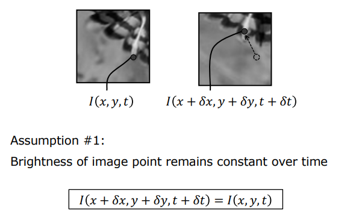
    <figcaption style="margin-top: 0.5em; text-align: center; font-size: 13px; color: #888;"><em>Şekil 7: Varsayım 1: Parlaklık Değişmezliği İlkesi — Bir sahne noktasının parlaklığı hareket boyunca sabit kalır.</em></figcaption>
  

</figure>

1. **Parlaklık Değişmezliği Varsayımı (Brightness Constancy Assumption):** Sahnedeki bir noktanın kamera sensörüne yansıyan parlaklık değeri, hareket boyunca zamanla değişmez:
   $$I(x, y, t) = I(x + \delta x, y + \delta y, t + \delta t)$$
2. **Küçük Hareket Varsayımı (Small Displacements):** Zamansal adım $\delta t$ ile birlikte uzamsal piksel kaymaları $\delta x$ ve $\delta y$ son derece küçüktür ($\delta x, \delta y \ll 1$ piksel). Bu durum Taylor serisi doğrusal yaklaşıklığına izin verir.

---

### 3.2 Taylor Serisi Açılımı ve Diferansiyel Türetim

Çok değişkenli Taylor serisi açılımı formülüne göre, $I(x + \delta x, y + \delta y, t + \delta t)$ fonksiyonunu $(x, y, t)$ noktası etrafında birinci derece kısmi türevlerle açalım:

$$I(x + \delta x, y + \delta y, t + \delta t) \approx I(x, y, t) + \frac{\partial I}{\partial x}\delta x + \frac{\partial I}{\partial y}\delta y + \frac{\partial I}{\partial t}\delta t + \mathcal{O}(\delta^2)$$

Küçük hareket varsayımı gereğince yüksek dereceli terimler ($\mathcal{O}(\delta^2)$) ihmal edilir. Parlaklık değişmezliği eşitliği ($I(x+\delta x, y+\delta y, t+\delta t) - I(x,y,t) = 0$) yerine konulduğunda:

$$I_x \delta x + I_y \delta y + I_t \delta t = 0$$

Burada $I_x = \frac{\partial I}{\partial x}$, $I_y = \frac{\partial I}{\partial y}$ uzamsal gradyanlar, $I_t = \frac{\partial I}{\partial t}$ ise zamansal gradyandır.

Her iki tarafı zamansal artış $\delta t$'ye bölüp $\delta t \to 0$ limitini aldığımızda:

$$I_x \frac{dx}{dt} + I_y \frac{dy}{dt} + I_t = 0$$

Yatay optik akış hızı $u = \frac{dx}{dt}$ ve dikey optik akış hızı $v = \frac{dy}{dt}$ olarak tanımlanırsa, bilgisayarlı görünün en temel eşitliği olan **Optik Akış Kısıt Denklemi (Optical Flow Constraint Equation - OFCE)** elde edilir:

$$I_x u + I_y v + I_t = 0 \quad \iff \quad \nabla I \cdot \mathbf{u} + I_t = 0$$

burada $\nabla I = [I_x, I_y]^T$ uzamsal gradyan vektörü, $\mathbf{u} = [u, v]^T$ ise optik akış hız vektörüdür.

---

### 3.3 Sayısal Gradyanların Hesaplanması (Spatio-Temporal Finite Differences)

$I_x, I_y, I_t$ türevleri, video kareleri üzerinde $2 \times 2 \times 2$ boyutunda bir uzay-zaman piksel küpünün sonlu farkları (Horn-Schunck yöntemi) veya Sobel filtreleri ile hesaplanır:

<figure style="display:flex; justify-content: center; margin: 20px 0;">
  

    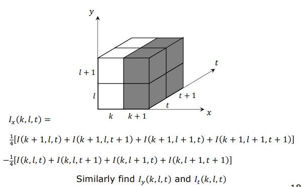
    <figcaption style="margin-top: 0.5em; text-align: center; font-size: 13px; color: #888;"><em>Şekil 8: 2x2x2 uzay-zaman piksel küpü üzerinden simetrik sonlu farklar ile Ix, Iy ve It türevlerinin hesaplanması.</em></figcaption>
  

</figure>

$$I_x(k, l, t) \approx \frac{1}{4} \Big[ I(k+1, l, t) + I(k+1, l, t+1) + I(k+1, l+1, t) + I(k+1, l+1, t+1) \Big] - \frac{1}{4} \Big[ I(k, l, t) + I(k, l, t+1) + I(k, l+1, t) + I(k, l+1, t+1) \Big]$$

Benzer simetrik farklar $I_y(k, l, t)$ ve $I_t(k, l, t)$ için de uygulanır. Bu sayede türevler bilinen reel sayılar haline gelir.

---

### 3.4 Geometrik Yorum ve Açıklık Problemi (Aperture Problem)

Optik akış kısıt denklemi $I_x u + I_y v + I_t = 0$, $u-v$ hız uzayında doğrusal bir kısıt doğrusu (*constraint line*) belirtir.

<figure style="display:flex; justify-content: center; margin: 20px 0;">
  

    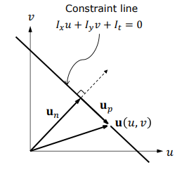
    <figcaption style="margin-top: 0.5em; text-align: center; font-size: 13px; color: #888;"><em>Şekil 9: u-v hız uzayında kısıt doğrusu, normal akış bileşeni (un) ve paralel akış bileşeni (up).</em></figcaption>
  

</figure>

#### Tek Denklem, İki Bilinmeyen
Her bir piksel için elimizde yalnızca 1 adet skaler denklem varken, çözülmesi gereken 2 adet bilinmeyen ($u$ ve $v$) vardır. Bu nedenle sistem **eksik belirlenmiştir (*under-constrained*)**. Gerçek akış vektörü $\mathbf{u}$, kısıt doğrusu üzerindeki sonsuz sayıda noktadan herhangi biri olabilir.

Akış vektörü birbirine dik iki bileşene ayrıştırılabilir:

$$\mathbf{u} = \mathbf{u}_n + \mathbf{u}_p$$

1. **Normal Akış ($\mathbf{u}_n$):** Kısıt doğrusuna dik olan (yani görüntü gradyanı $\nabla I$ yönündeki) bileşendir. Yönü ve büyüklüğü tekil olarak kesin hesaplanabilir:
   $$\hat{\mathbf{u}}_n = \frac{[I_x, I_y]^T}{\sqrt{I_x^2 + I_y^2}}, \quad |\mathbf{u}_n| = \frac{-I_t}{\sqrt{I_x^2 + I_y^2}} \implies \mathbf{u}_n = -\frac{I_t}{I_x^2 + I_y^2} \begin{bmatrix} I_x \\ I_y \end{bmatrix}$$
2. **Paralel Akış ($\mathbf{u}_p$):** Kısıt doğrusuna paralel (kenar çizgisi yönündeki) bileşendir. Bu bileşeni tek bir pikselin denkleminden hesaplamanın hiçbir matematiksel yolu yoktur.

<figure style="display:flex; justify-content: center; margin: 20px 0;">
  

    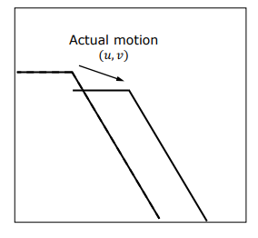
    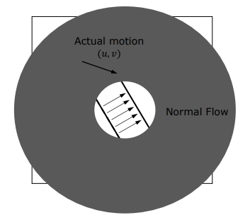
    <figcaption style="margin-top: 0.5em; text-align: center; font-size: 13px; color: #888;"><em>Şekil 10 & 11: Açıklık Problemi (Aperture Problem): Sol: Nesnenin gerçek 2B hareketi (u,v). Sağ: Dairesel bir açıklıktan bakıldığında kenara paralel kayma görünmez; yalnızca kenara dik normal akış algılanabilir.</em></figcaption>
  

</figure>

> **Açıklık Problemi Tanımı:** Düz bir kenara küçük yerel bir açıklıktan (*aperture*) baktığımızda, kenar boyunca meydana gelen hareketler optik olarak görünmezdir. Göz ve algoritmalar sadece kenara dik olan normal hareketi algılayabilir. 2B gerçek hareketi çözebilmek için iki farklı yönde gradyan barındıran köşelere veya komşuluk kısıtlarına ihtiyaç vardır.

---

## 4. Lucas-Kanade Yöntemi (Lucas-Kanade Method)

Bruce Lucas ve Takeo Kanade (1981), eksik belirlenmişlik problemini çözmek amacıyla uzamsal bir tutarlılık varsayımı getirmişlerdir.

### 4.1 Komşuluk Tutarlılığı Varsayımı

Lucas-Kanade yöntemi, incelenen pikselin etrafındaki küçük bir yerel komşuluk penceresindeki ($W$, örneğin $n \times n$ boyutunda, tipik olarak $3 \times 3$ veya $5 \times 5$) tüm piksellerin **aynı hızla hareket ettiğini** varsayar:

$$\mathbf{u}(x, y) = [u, v]^T = \text{sabit} \quad \forall (x,y) \in W$$

$n \times n$ boyutundaki bir pencerede $n^2$ adet piksel yer alır. Her bir piksel kendi lokal gradyanları ($I_{xi}, I_{yi}, I_{ti}$) ile bir optik akış kısıt denklemi üretir. Böylece $n^2$ denklem ve 2 bilinmeyenden oluşan **aşırı belirlenmiş (*overdetermined*)** bir doğrusal sistem kurulur:

$$\begin{aligned}
I_{x1} u + I_{y1} v &= -I_{t1} \\
I_{x2} u + I_{y2} v &= -I_{t2} \\
&\;\;\vdots \\
I_{xn^2} u + I_{yn^2} v &= -I_{tn^2}
\end{aligned}$$

---

### 4.2 Aşırı Belirlenmiş Sistemin Matris Gösterimi ve Least Squares Çözümü

Bu doğrusal denklem sistemi matris formunda yazılır:

$$A \mathbf{u} = \mathbf{b}$$

<figure style="display:flex; justify-content: center; margin: 20px 0;">
  

    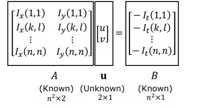
    <figcaption style="margin-top: 0.5em; text-align: center; font-size: 13px; color: #888;"><em>Şekil 12: Lucas-Kanade doğrusal matris sistemi A u = b (n^2 x 2 boyutlu katsayılar matrisi).</em></figcaption>
  

</figure>

Burada:
- $A = \begin{bmatrix} I_{x1} & I_{y1} \\ I_{x2} & I_{y2} \\ \vdots & \vdots \\ I_{xn^2} & I_{yn^2} \end{bmatrix}$ : $n^2 \times 2$ boyutlarında uzamsal gradyanlar matrisi
- $\mathbf{u} = \begin{bmatrix} u \\ v \end{bmatrix}$ : $2 \times 1$ boyutlarında bilinmeyen akış vektörü
- $\mathbf{b} = \begin{bmatrix} -I_{t1} \\ -I_{t2} \\ \vdots \\ -I_{tn^2} \end{bmatrix}$ : $n^2 \times 1$ boyutlarında zamansal türevler vektörü

Denklem sayısı bilinmeyen sayısından fazla olduğu için, karesel hata fonksiyonunu $E(\mathbf{u}) = \|A\mathbf{u} - \mathbf{b}\|^2$ minimize eden çözüm **En Küçük Kareler (Least Squares)** yöntemiyle bulunur:

$$A^T A \mathbf{u} = A^T \mathbf{b} \implies \mathbf{u} = (A^T A)^{-1} A^T \mathbf{b}$$

Matris çarpımları açık olarak yazıldığında $2 \times 2$ boyutlarında kararlı ve son derece hızlı çözülen kompakt bir sistem elde edilir:

$$\begin{bmatrix} \sum I_x^2 & \sum I_x I_y \\ \sum I_x I_y & \sum I_y^2 \end{bmatrix} \begin{bmatrix} u \\ v \end{bmatrix} = \begin{bmatrix} -\sum I_x I_t \\ -\sum I_y I_t \end{bmatrix}$$

Buradaki toplamlar ($\sum = \sum_{i \in W}$), $W$ penceresi içindeki tüm pikseller üzerinden yapılır. Katsayılar matrisi $M = A^T A$, Harris köşe tespitinde kullanılan ikinci moment matrisi (*structure tensor*) ile birebir aynı yapıdadır.

---

### 4.3 Matematiksel Koşul Analizi (Well-Conditioning) ve Özdeğerler

Lucas-Kanade yönteminin doğru ve gürültüye dayanıklı akış üretebilmesi için $M = A^T A$ matrisinin tersinin alınabilir (*invertible*) ve sayısal olarak iyi koşullandırılmış (*well-conditioned*) olması gerekir. Bu durum $M$ matrisinin özdeğerleri ($\lambda_1, \lambda_2$) incelenerek analiz edilir:

<figure style="display:flex; justify-content: center; margin: 20px 0;">
  

    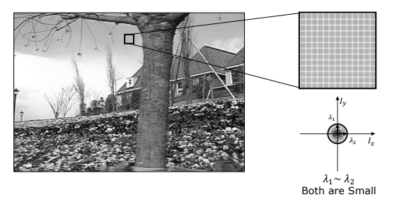
    <figcaption style="margin-top: 0.5em; text-align: center; font-size: 13px; color: #888;"><em>Şekil 13: Durum 1: Dokusuz Düz Alan (Gökyüzü) — lambda1 ~ lambda2 ~ 0 (Kötü koşullanmış, tersi alınamaz).</em></figcaption>
  

</figure>

<figure style="display:flex; justify-content: center; margin: 20px 0;">
  

    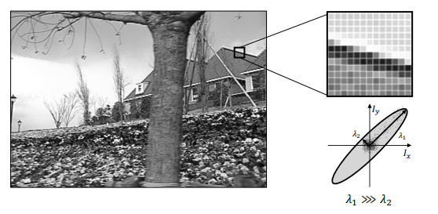
    <figcaption style="margin-top: 0.5em; text-align: center; font-size: 13px; color: #888;"><em>Şekil 14: Durum 2: Düz Kenar Bölgesi (Çatı Kenarı) — lambda1 >> lambda2 ~ 0 (Açıklık problemi, kenara dik akış çözülebilir).</em></figcaption>
  

</figure>

<figure style="display:flex; justify-content: center; margin: 20px 0;">
  

    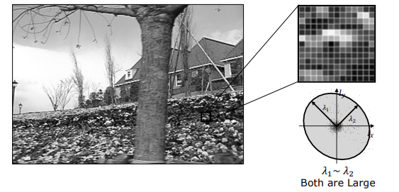
    <figcaption style="margin-top: 0.5em; text-align: center; font-size: 13px; color: #888;"><em>Şekil 15: Durum 3: Zengin Dokulu Alan (Çiçekli Yamaç / Köşe) — lambda1 ve lambda2 her ikisi de büyük (İyi koşullanmış, tam akış çözülür).</em></figcaption>
  

</figure>

| Bölge Tipi | Gradyan Elips Geometrisi | Özdeğer Durumu ($\lambda_1, \lambda_2$) | Matris Koşulu (*Conditioning*) | Akış Kestirim Kalitesi |
| :--- | :--- | :--- | :--- | :--- |
| **Dokusuz Alanlar** (*Textureless* - Örn: Gökyüzü) | Orijin etrafında kümelenmiş minik nokta | $\lambda_1 \approx 0, \; \lambda_2 \approx 0$ | **Kötü Koşullandırılmış:** $\det(M) \approx 0$, tersi alınamaz. | **Hesaplanamaz:** Bölme hatası veya aşırı gürültü patlaması. |
| **Düz Kenarlar** (*Edges* - Örn: Çatı Çizgisi) | Kenar doğrultusunda dar, uzun elips | $\lambda_1 \gg \lambda_2$ ($\lambda_2 \approx 0$) | **Kötü Koşullandırılmış:** Tek bir doğrultuda gradyan var (Açıklık Problemi). | **Kısmi:** Yalnızca kenara dik normal akış çözülür, paralel akış belirsizdir. |
| **Zengin Dokulu Alanlar** (*Textured / Corners*) | Her iki eksende geniş dağılmış dairesel/oval elips | $\lambda_1, \lambda_2 \gg 0$ ($\lambda_1 \sim \lambda_2$) | **İyi Koşullandırılmış (*Well-Conditioned*):** Matris kararlı şekilde ters çevrilir. | **Mükemmel:** Optik akış vektörü ($u, v$) kesin ve hatasız çözülür. |

---

## 5. Kaba-Hassas Akış Kestirimi (Coarse-to-Fine Flow Estimation)

Lucas-Kanade yöntemi Taylor serisi linearizasyonuna dayandığı için pikseller arasındaki hareketlerin **1 pikselden küçük** ($\delta x, \delta y \ll 1$) olduğu varsayımına sıkı sıkıya bağlıdır. Ancak gerçek dünya videolarında hızlı hareket eden nesneler kareler arasında onlarca piksel yer değiştirebilir (*large displacement*). Bu durumda doğrusal yaklaşıklık tamamen çöker.

Bu problemi çözmek için **Çözünürlük Piramitleri (*Resolution / Gaussian Pyramids*)** ve **Geriye Doğru Yamultma (*Warping*)** tabanlı **Kaba-Hassas (*Coarse-to-Fine*)** optimizasyon stratejisi kullanılır (Bouguet, 2000).

<figure style="display:flex; justify-content: center; margin: 20px 0;">
  

    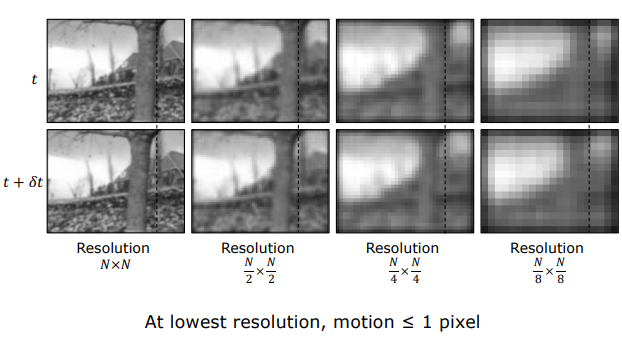
    <figcaption style="margin-top: 0.5em; text-align: center; font-size: 13px; color: #888;"><em>Şekil 16: Çözünürlük Piramidi: Orijinal boyutta büyük olan piksel kaymaları, en kaba piramit seviyesinde 1 pikselin altına düşer.</em></figcaption>
  

</figure>

### 5.1 Çözünürlük Piramidi Mantığı

1. Orijinal $N \times N$ boyutundaki ardışık iki görüntü ($t$ ve $t + \delta t$), ardışık olarak $2 \times 2$ alt örnekleme ile $N/2 \times N/2$, $N/4 \times N/4$, $N/8 \times N/8$ katmanlarına indirgenir.
2. **Kritik Matematiksel Gerçek:** Orijinal görüntüde 16 piksel olan devasa bir hareket, $N/16 \times N/16$ çözünürlüğündeki piramidin tepe noktasında tam olarak **1 piksele** iner!
3. En kaba seviyede hareket 1 pikselin altına düştüğü için Taylor doğrusal varsayımı ve optik akış kısıt denklemi yeniden kusursuz şekilde geçerli hale gelir.

---

### 5.2 Algoritmanın Adım Adım İşleyişi (Bouguet 2000)

<figure style="display:flex; justify-content: center; margin: 20px 0;">
  

    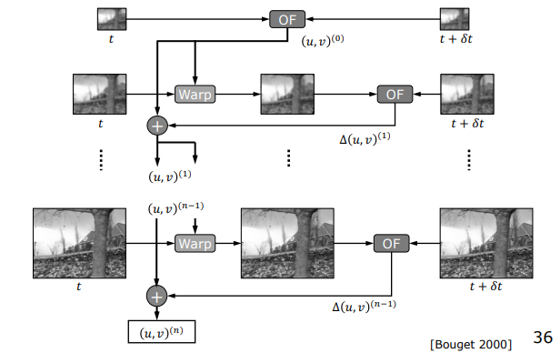
    <figcaption style="margin-top: 0.5em; text-align: center; font-size: 13px; color: #888;"><em>Şekil 17: Kaba-Hassas Akış Mimarisi: En kaba seviyeden başlanarak akış kestirimi (OF), geriye yamultma (Warp), artık akış hesabı (Delta u,v) ve akış akümülasyonu (Bouguet 2000).</em></figcaption>
  

</figure>

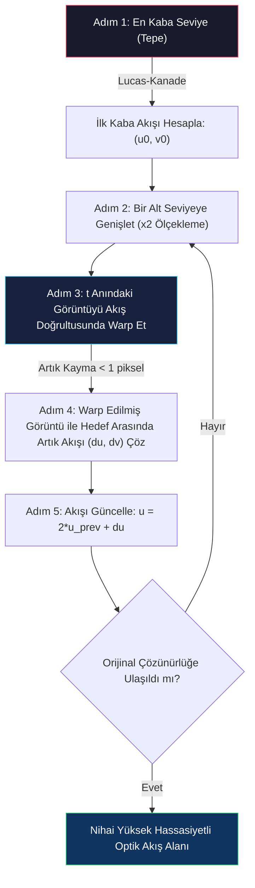

1. **Kaba Akış Hesabı:** En kaba (en düşük) piramit seviyesinde standart Lucas-Kanade çalıştırılarak ilk kaba optik akış $\mathbf{u}^{(0)}$ hesaplanır.
2. **Ölçekleme ve Genişletme:** Bu akış alanı bir alt çözünürlük seviyesine aktarılırken koordinat olarak 2 ile çarpılarak genişletilir ($2 \mathbf{u}^{(0)}$).
3. **Görüntü Yamultma (Warping):** $t$ anındaki kaba görüntü, hesaplanan bu akış vektörleri boyunca geometrik olarak ötelenerek (*warped*) $t + \delta t$ hedef görüntüsünün üzerine hizalanır.
4. **Artık Akışın (Residual Flow) Çözümü:** Warping işlemi büyük hareketleri sıfırladığı için, warp edilmiş ara görüntü ile hedef görüntü arasındaki kalan kayma artık 1 pikselden küçüktür. Standart Lucas-Kanade ile bu küçük düzeltme vektörü ($\Delta \mathbf{u}$) çözülür.
5. **Akış Akümülasyonu:** Yeni artık akış, önceki akışın üzerine eklenir: $\mathbf{u} = 2 \mathbf{u}_{\text{prev}} + \Delta \mathbf{u}$.
6. **Tabana Yakınsama:** Bu döngü orijinal çözünürlüğe ulaşana kadar yinelenir.

Bu sayede hem 50 piksel boyutundaki makro hareketler hem de 0.05 piksel boyutundaki mikron hareketler aynı anda yüksek doğrulukla saptanır.

---

## 6. Alternatif Yaklaşım: Şablon Eşleştirme (Template Matching)

Optik akış diferansiyel türevler yerine, doğrudan piksel pencerelerinin korelasyonuna dayanan şablon eşleştirme (*template matching*) yöntemiyle de kestirilebilir:

<figure style="display:flex; justify-content: center; margin: 20px 0;">
  

    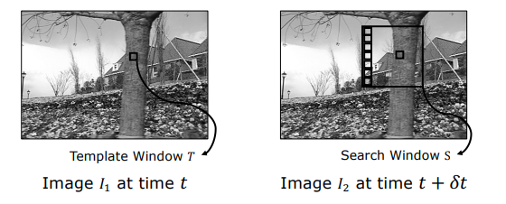
    <figcaption style="margin-top: 0.5em; text-align: center; font-size: 13px; color: #888;"><em>Şekil 18: Şablon Eşleştirme ile Akış Kestirimi: t anındaki T şablonu, t + dt anındaki S arama penceresinde kaydırılarak en iyi eşleşme aranır.</em></figcaption>
  

</figure>

- **Çalışma Prensibi:** $t$ anındaki görüntüden bir pikselin etrafındaki $T$ penceresi şablon olarak alınır. $t+\delta t$ görüntüsündeki geniş $S$ arama penceresi içinde kaydırılarak Kare Farklar Toplamı ($\min \text{SSD}$) veya Normalize Çapraz Korelasyon ($\max \text{NCC}$) skoru veren konum bulunur. Konum farkı akış vektörünü verir.
- **Kritik Dezavantajları:**
  - **Aşırı Yüksek Hesaplama Maliyeti:** Milyonlarca piksel için 2B pencereleri pikselsel kaydırmak diferansiyel yöntemlere göre yüzlerce kat daha yavaştır.
  - **Yanlış Eşleşme (False Matches):** Gradyan kısıtı olmadığı için tekrarlayan desenlerde alakasız bölgelere kolayca kilitlenir.

---

## 7. Optik Akışın Uygulama Alanları (Application of Optical Flow)

Optik akış, tüketici elektroniğinden otonom araçlara, medikal görüntülemeden sinema efektlerine kadar bilgisayarlı görünün en yaygın ticari teknolojilerinden biridir.

### 7.1 Optik Fare (Optical Mouse)

Günlük hayatta kullandığımız optik farelerin altında ultra yüksek hızlı entegre bir bilgisayarlı görü sistemi çalışır:

<figure style="display:flex; justify-content: center; margin: 20px 0;">
  

    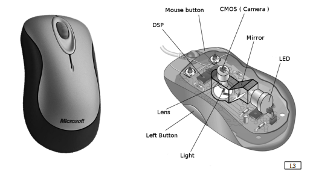
    <figcaption style="margin-top: 0.5em; text-align: center; font-size: 13px; color: #888;"><em>Şekil 19: Optik Farenin İç Mimarisi: LED aydınlatma, mikroskobik lens, optik CMOS sensör ve entegre DSP işlemcisi.</em></figcaption>
  

</figure>

- Farenin altındaki LED veya lazer, masa yüzeyindeki mikroskobik pürüzleri aydınlatır.
- İçeride bulunan küçük çözünürlüklü ($64 \times 64$ piksel) ama saniyede **1500 - 3000 kare (FPS)** yakalayan özel bir CMOS kamera yüzey dokusunu kaydeder.
- Dahili DSP (*Digital Signal Processor*) çipi ardışık mikro kareler arasında gerçek zamanlı optik akış hesaplayarak farenin hareket yönünü ve piksel hızını bilgisayar imlecine aktarır.

---

### 7.2 Trafik İzleme ve Hız Ölçümü (Traffic Monitoring)

Otoyol güvenlik kameralarında araç takip ve otomatik ceza kesim sistemlerinde kullanılır:

<figure style="display:flex; justify-content: center; margin: 20px 0;">
  

    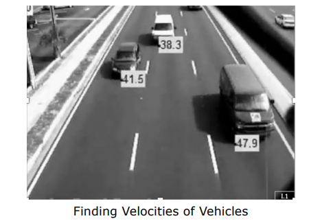
    <figcaption style="margin-top: 0.5em; text-align: center; font-size: 13px; color: #888;"><em>Şekil 20: Optik akış ile otoyol üzerindeki araçların gerçek hızlarının (mph / km/h) saptanması.</em></figcaption>
  

</figure>

- Sabit kameranın yol düzlemine olan perspektif kalibrasyonu ve metrik derinliği önceden modellenir.
- Geçen araçların optik akış vektörleri hesaplanır.
- Kalibre edilmiş 3B düzlem geometrisi yardımıyla piksel/saniye cinsinden akış vektörleri doğrudan $\text{km/saat}$ metrik hızına dönüştürülür.

---

### 7.3 Dijital Görüntü Sabitleme (Digital Image Stabilization)

Akıllı telefon kameralarında el titremelerinden kaynaklanan sarsıntıların giderilmesinde kullanılır:

<figure style="display:flex; justify-content: center; margin: 20px 0;">
  

    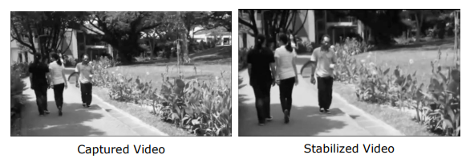
    <figcaption style="margin-top: 0.5em; text-align: center; font-size: 13px; color: #888;"><em>Şekil 21: Çekilen sarsıntılı video (sol) ile optik akış tabanlı baskın hareket telafisiyle üretilen stabilize video (sağ).</em></figcaption>
  

</figure>

- El titremesi sahne genelinde homojen bir optik akış vektör alanı üretir.
- Algoritma tüm piksellerin akışını hesaplayarak arka planın ortak **baskın akışını (*dominant flow*)** saptar.
- Görüntü çerçevesi bu baskın akışın tam tersi yönünde pikselsel olarak kaydırılarak sarsıntı yazılımsal olarak sıfırlanır.

---

### 7.4 Diğer Önemli Endüstriyel Uygulamalar

- **Video Retiming ve Yavaş Çekim (Slow-Motion Interpolation):** Ardışık iki kare arasındaki optik akış vektörleri boyunca ara pikseller enterpole edilerek sanal ara kareler oluşturulur ($t+0.5$). 30 FPS'lik bir video yapay olarak 240 FPS pürüzsüz sinematik slow-motion videoya dönüştürülür.
- **Yüz ve Mikro İfade Takibi (Facial Mesh Tracking):** Yüz üzerine yerleştirilen yüzlerce 3B mesh düğüm noktası video boyunca optik akışla takip edilerek göz kırpma, dudak kıvrılması ve mikro mimikler milimetrik hassasiyetle ölçülür.
- **Etkileşimli Oyun Sistemleri (Interactive Gaming):** Kullanıcının vücut hareketlerinin optik akış vektörleri hesaplanarak sanal objelere fiziksel itme kuvveti veya rüzgar etkisi olarak aktarılır.

---

## 8. Özet ve Teknik Karşılaştırma Matrisi

| Kavram / Yöntem | Temel Matematiksel Formül | Kritik Rolü & Çözdüğü Problem | Karşılaşılan Sınırlamalar / Kısıtlar |
| :--- | :--- | :--- | :--- |
| **Hareket Alanı (Motion Field)** | $\mathbf{v}_i = \frac{f \cdot (\mathbf{z} \times (\mathbf{r}_0 \times \mathbf{v}_0))}{(\mathbf{r}_0 \cdot \mathbf{z})^2}$ | 3B fiziksel hızın 2B kamera düzlemine geometrik izdüşümü | Doğrudan sensörle ölçülemez; derinlik ($z_w$) ve 3B hız bilgisi gerektirir. |
| **Optik Akış Kısıt Denklemi (OFCE)** | $I_x u + I_y v + I_t = 0$ | Piksel parlaklık türevlerini akış hız vektörüyle ($u,v$) ilişkilendirme | **Açıklık Problemi:** 1 denklem, 2 bilinmeyen; paralel akış çözülemez. |
| **Lucas-Kanade Yöntemi** | $\mathbf{u} = (A^T A)^{-1} A^T \mathbf{b}$ | Yerel pencerede sabit akış varsayımıyla En Küçük Kareler çözümü | Dokusuz alanlarda ve düz kenarlarda $A^T A$ matrisinin tekil/kötü koşullanması. |
| **Kaba-Hassas (Coarse-to-Fine)** | Piramit + Warping + $\mathbf{u} = 2\mathbf{u}_{\text{prev}} + \Delta\mathbf{u}$ | Taylor serisi küçük hareket varsayımını koruyarak büyük hareketleri çözme | Piramit interpolasyon kayıpları ve çok katmanlı hesaplama karmaşıklığı. |
| **Şablon Eşleştirme (Template)** | $\min \text{SSD}$ veya $\max \text{NCC}$ | Diferansiyel türev olmadan doğrudan piksel korelasyonuyla eşleşme bulma | Çok yüksek işlemci maliyeti ve tekrarlayan dokularda yanlış eşleşme (*false matching*). |
