# Basit Stereo Vizyon, Disparite ve 3B Rekonstrüksiyon

<!-- toc -->

## 1. Geriye Projeksiyon Belirsizliği (Backward Projection Problem)

Kamera kalibrasyonu ile tek bir kameranın içsel ($K$) ve dışsal ($R, \mathbf{t}$) parametreleri kusursuz biçimde çözülmüş olsa dahi, **tek bir 2B görüntü tek başına sahnenin üç boyutlu (3B) derinlik bilgisini kurtarmak için yetersizdir**.

Tamamen kalibre edilmiş bir tekil kamerada, görüntü düzlemi üzerinde saptanan bir $(u, v)$ piksel noktası ele alalım. Bu noktanın 3B uzaydaki kesin Öklid koordinatlarını $(x, y, z)$ hesaplamak istediğimizde aşılmaz bir matematiksel engelle karşılaşırız.

<figure style="display:flex; justify-content: center; margin: 20px 0;">
  

    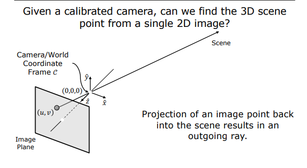
    <figcaption style="margin-top: 0.5em; text-align: center; font-size: 13px; color: #888;"><em>Görsel 1: Geriye projeksiyon belirsizliği: Kalibre bir kamerada $(u,v)$ pikselinin 3B uzaya geriye izdüşümü tek bir nokta değil, sahneye doğru sonsuza uzayan bir ışın (outgoing ray) tanımlar.</em></figcaption>
  

</figure>

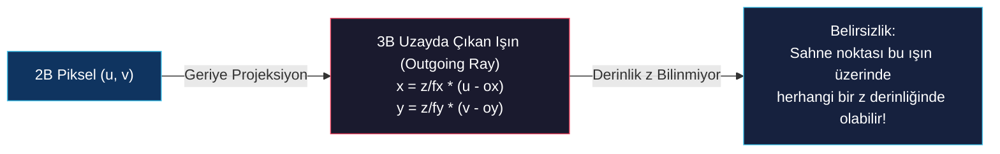

Görüntüdeki o piksel, kameranın optik merkezinden $(0,0,0)$ çıkıp görüntü düzlemindeki $(u,v)$ hücresinden geçerek sahneye doğru sonsuza uzayan tek bir 3B ışın (outgoing ray) tanımlar:

<figure style="display:flex; justify-content: center; margin: 20px 0;">
  

    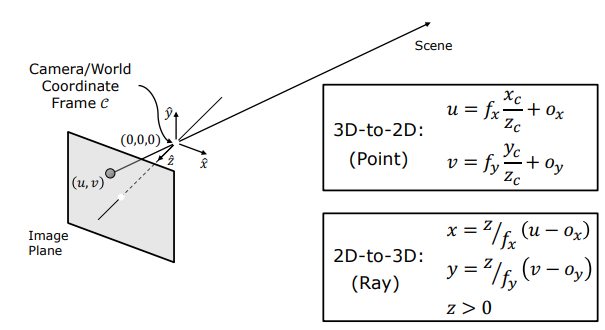
    <figcaption style="margin-top: 0.5em; text-align: center; font-size: 13px; color: #888;"><em>Görsel 2: 3B'dan 2B'a ileri izdüşüm denklemleri ile 2B'dan 3B'a geriye izdüşüm ışın denklemlerinin matematiksel karşılaştırması.</em></figcaption>
  

</figure>

$$\text{2B'dan 3B'a Geri İzdüşüm Işını:} \quad x = \frac{z}{f_x} (u - o_x), \quad y = \frac{z}{f_y} (v - o_y), \quad z > 0$$

Sahnedeki gerçek fiziksel nokta, bu ışın üzerindeki herhangi bir derinlikte ($z$) yer alıyor olabilir. Dolayısıyla tek bir pikselden kesin derinliği elde etmek imkansızdır; bu duruma **Geriye Projeksiyon Belirsizliği (Backward Projection Ambiguity)** denir. 

Derinliği kesin olarak saptayabilmek için, bu ışını farklı bir bakış açısından keserek **nirengi (triangulation)** noktası oluşturacak ikinci bir kameraya ihtiyaç duyulur.

> **Key Insight:** İnsan gözlerinin iki tane olmasının temel sebebi de budur. Tek gözle bakıldığında derinlik sadece gölge ve perspektif ipuçlarıyla tahmin edilebilirken, çift gözle (stereoskopik) nirengi yapılarak kesin 3B derinlik hesaplanır.

---

## 2. Basit Stereo Geometrisi (Simple Stereo Geometry)

İki kameranın optik eksenlerinin birbirine tamamen paralel, dikey konumlarının aynı ve sadece yatay doğrultuda $b$ kadar ötelenerek yerleştirildiği sisteme **Basit Stereo Sistemi (Simple Stereo System)** adı verilir. Kameraların optik merkezleri arasındaki yatay $b$ mesafesine **Baz Çizgisi (Baseline)** adı verilir.

<figure style="display:flex; justify-content: center; margin: 20px 0;">
  

    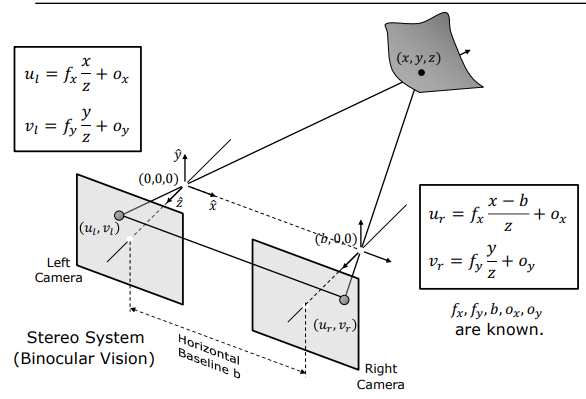
    <figcaption style="margin-top: 0.5em; text-align: center; font-size: 13px; color: #888;"><em>Görsel 3: Basit stereo geometrisi: Sol kamera orijinde $(0,0,0)$, sağ kamera $(b,0,0)$ konumundadır. İki kameradan çıkan ışınların 3B uzayda kesişimi $(x,y,z)$ noktasını verir.</em></figcaption>
  

</figure>

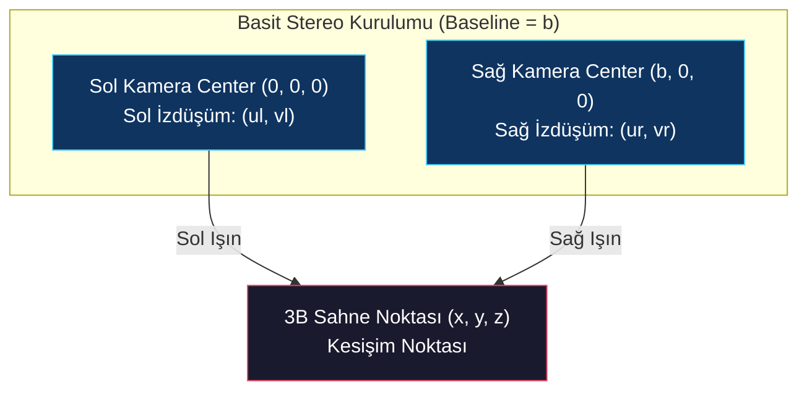

Gerçek dünya uygulamalarında basit stereo sistemleri, iki optik sensörün tek bir gövdeye sabit bir baz çizgisiyle yerleştirilmesiyle imal edilir:

<figure style="display:flex; justify-content: center; margin: 20px 0;">
  

    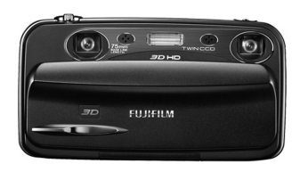
    <figcaption style="margin-top: 0.5em; text-align: center; font-size: 13px; color: #888;"><em>Görsel 4: Fiziksel stereo kamera örneği (Fujifilm 3D HD kamera, 75mm sabit baz çizgisi mesafesi).</em></figcaption>
  

</figure>

### Tarama Çizgisi Tutarlılığı (Scan-line Correspondence Constraint)

Kameralar sadece yatay doğrultuda ($x$ ekseninde) $b$ kadar ötelenmiş olduğundan, dikey piksel koordinatları her iki kamerada da birbirine tam olarak eşittir:

$$v_l = v_r$$

<figure style="display:flex; justify-content: center; margin: 20px 0;">
  

    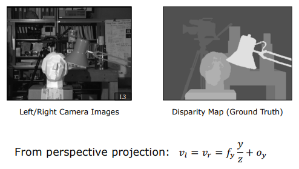
    <figcaption style="margin-top: 0.5em; text-align: center; font-size: 13px; color: #888;"><em>Görsel 5: Sol ve sağ kamera görüntüleri, gerçek disparite haritası ve dikey piksel koordinatlarının eşitliği ($v_l = v_r$).</em></figcaption>
  

</figure>

Bu geometrik özellik, sol görüntüdeki bir pikselin sağ görüntüdeki karşılığını ararken tüm 2B görüntü düzlemini tarama zorunluluğunu ortadan kaldırır. Karşılık gelen piksel, sağ görüntüde **sadece aynı yatay tarama çizgisi (scanline)** üzerinde aranır. 

> **Algoritmik Avantaj:** Arama uzayının 2B düzlemden 1B çizgiye inmesi, stereo eşleştirme algoritmalarının işlem karmaşıklığını $O(N^2)$ seviyesinden $O(N)$ seviyesine indirerek işlem hızını ve doğruluğunu dramatik biçimde artırır.

---

## 3. Disparite ve Derinlik İlişkisi (Disparity & Depth)

Bir $(x, y, z)$ sahne noktasının sol ve sağ kameralardaki perspektif projeksiyon denklemleri benzer üçgenler kullanılarak kurulur:

$$\text{Sol Kamera:} \quad u_l = f_x \frac{x}{z} + o_x \quad \text{ve} \quad v_l = f_y \frac{y}{z} + o_y$$

$$\text{Sağ Kamera:} \quad u_r = f_x \frac{x - b}{z} + o_x \quad \text{ve} \quad v_r = f_y \frac{y}{z} + o_y$$

<figure style="display:flex; justify-content: center; margin: 20px 0;">
  

    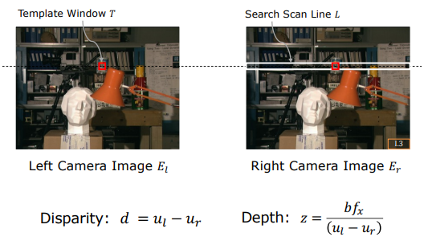
    <figcaption style="margin-top: 0.5em; text-align: center; font-size: 13px; color: #888;"><em>Görsel 6: Sol görüntüdeki şablon penceresinin ($T$) sağ görüntüdeki yatay tarama çizgisi ($L$) boyunca aranması, disparite ($d = u_l - u_r$) ve derinlik ($z = \frac{b f_x}{d}$) hesabı.</em></figcaption>
  

</figure>

Sol ve sağ görüntüdeki yatay piksel koordinatları arasındaki farka **Disparite (Disparity - $d$)** adı verilir:

$$d = u_l - u_r$$

Projeksiyon denklemlerini disparite tanımında yerine yazıp sadeleştirdiğimizde:

$$d = \left(f_x \frac{x}{z} + o_x\right) - \left(f_x \frac{x - b}{z} + o_x\right) = f_x \frac{b}{z}$$

Bu eşitlikten yararlanılarak, sahne noktasının kesin üç boyutlu koordinatları $(x, y, z)$ nirengiyle hesaplanır:

$$z = \frac{f_x \cdot b}{u_l - u_r} = \frac{f_x \cdot b}{d}$$

$$x = \frac{b (u_l - o_x)}{u_l - u_r}$$

$$y = \frac{b f_x (v_l - o_y)}{f_y (u_l - u_r)}$$

### Bu Denklemlerin Ortaya Koyduğu Temel Fiziksel Gerçekler

1. **Ters Orantı ($z \propto 1/d$):** Derinlik ile disparite **ters orantılıdır**. Kameraya çok yakın olan nesnelerin iki görüntü arasındaki kayma miktarı (disparite) çok büyüktür. Nesneler uzaklaştıkça disparite küçülür. Sonsuzdaki nesneler için ($z \to \infty$) disparite sıfıra iner; yani sol ve sağ görüntüler tamamen aynı olur.
2. **Baseline (Baz Çizgisi) Etkisi ($d \propto b$):** İki kamera arasındaki baseline ($b$) ne kadar geniş tutulursa, disparite miktarı o kadar geniş bir piksel aralığına yayılır. Görüntülerimiz sonlu çözünürlükteki piksellerden oluştuğu için, daha uzak mesafelerde yüksek hassasiyetli derinlik ölçümü yapabilmek amacıyla mümkün olduğunca geniş baseline tercih edilmelidir.

---

## 4. Stereo Eşleştirme (Stereo Matching) Zorlukları

Nirengi formüllerini uygulayabilmek için sol görüntüdeki her bir pikselin sağ görüntüdeki tam karşılığını saptamak gerekir. Bu sürece **Stereo Eşleştirme (Correspondence Problem)** adı verilir.

### 4.1 SAD, SSD ve NCC Benzerlik Metrikleri

Yatay tarama çizgisi boyunca en iyi eşleşen pikseli bulmak için küçük bir şablon penceresi (window $W$) kaydırılarak benzerlik testleri uygulanır:

1. **SAD (Sum of Absolute Differences):** Pencerelerdeki piksellerin mutlak farklarının toplamıdır. Hesaplaması en hızlı olan metriktir:
   $$\text{SAD}(u, v, d) = \sum_{(x,y) \in W} |I_l(u+x, v+y) - I_r(u+x-d, v+y)|$$
2. **SSD (Sum of Squared Differences):** Karesel farkların toplamıdır. Büyük parlaklık sapmalarına daha yüksek ceza keser:
   $$\text{SSD}(u, v, d) = \sum_{(x,y) \in W} (I_l(u+x, v+y) - I_r(u+x-d, v+y))^2$$
3. **NCC (Normalized Cross-Correlation):** Pencerelerin parlaklık ortalama ve varyanslarına göre normalize edilmiş korelasyonudur. Sahnedeki ani ışık ve pozlama değişimlerine karşı son derece dayanıklı ve kararlı sonuçlar üretir:
   $$\text{NCC}(u, v, d) = \frac{\sum (I_l - \bar{I}_l)(I_r - \bar{I}_r)}{\sqrt{\sum (I_l - \bar{I}_l)^2 \sum (I_r - \bar{I}_r)^2}}$$

### 4.2 Pencere Boyutu (Window Size) İkilemi

<figure style="display:flex; justify-content: center; margin: 20px 0;">
  

    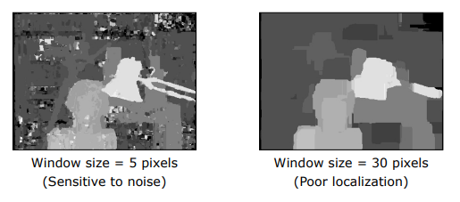
    <figcaption style="margin-top: 0.5em; text-align: center; font-size: 13px; color: #888;"><em>Görsel 8: Pencere boyutu ikilemi: Küçük pencereler ($5 \times 5$) gürültüye hassastır; büyük pencereler ($30 \times 30$) pürüzsüzdür ancak nesne sınırlarını ve detaylarını bulandırır.</em></figcaption>
  

</figure>

* **Küçük Pencereler (Örn: $3 \times 3$ veya $5 \times 5$):** Nesne sınırlarını ve ince detayları çok keskin bir şekilde konumlandırabilir (high localization). Ancak gürültüye (noise) karşı çok hassastır ve yanlış eşleşmeler üretir.
* **Büyük Pencereler (Örn: $21 \times 21$ veya $31 \times 31$):** Gürültüyü filtreleyerek çok pürüzsüz ve kararlı disparite haritaları üretir. Ancak nesne kenarlarındaki ani derinlik geçişlerini aşırı derecede bulandırır (poor localization).

### 4.3 Stereo Vizyonu Felç Eden Fiziksel Sınırlar

Stereo eşleştirme algoritmalarının matematiksel ve optik olarak çaresiz kaldığı üç temel fiziksel durum vardır:

<figure style="display:flex; justify-content: center; margin: 20px 0;">
  

    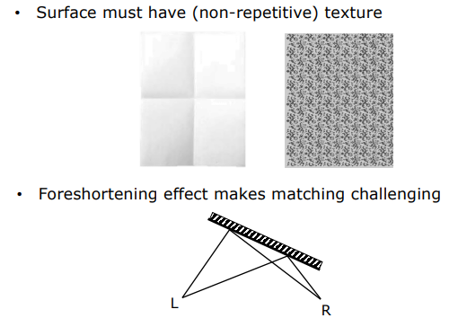
    <figcaption style="margin-top: 0.5em; text-align: center; font-size: 13px; color: #888;"><em>Görsel 7: Stereo eşleştirmeyi zorlaştıran fiziksel etkenler: Yüzeylerin dokusuz/tekrarlı olması ve açılı bakışta oluşan Perspektif Bükülme (Foreshortening) etkisi.</em></figcaption>
  

</figure>

1. **Dokusuz (Textureless) Yüzeyler:** Üzerinde hiçbir desen bulunmayan pürüzsüz beyaz bir duvar veya fincan ele alındığında, şablon penceresi tarama çizgisi boyunca her yerde tamamen aynı benzerlik skorunu üretir; bu durum eşleştirmeyi çözümsüz bırakır.
2. **Tekrarlayan Desenler (Repetitive Patterns):** Satranç tahtası desenleri, bina dış cephe pencereleri veya dikey parmaklıklar gibi kendini tekrar eden yapılarda şablon penceresi birden fazla yerde mükemmel benzerlik skorları bulur ve derinlik belirsizliğe girer.
3. **Perspektif Bükülmeler (Foreshortening):** Nesne yüzeyleri kameralara paralel olmadığında, bakış açısı farkından dolayı sol ve sağ kameralardaki piksel sıkışmaları (bükülmeleri) farklı olur. Bu durum pencerelerin eşleşme kalitesini ciddi ölçüde düşürür.

<figure style="display:flex; justify-content: center; margin: 20px 0;">
  

    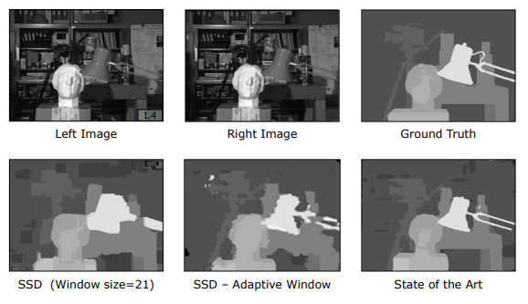
    <figcaption style="margin-top: 0.5em; text-align: center; font-size: 13px; color: #888;"><em>Görsel 9: Farklı stereo eşleştirme yaklaşımlarının karşılaştırılması: Klasik SSD (sabit pencere), Adaptif Pencere (Adaptive Window) ve Modern Küresel Optimizasyon (State of the Art).</em></figcaption>
  

</figure>

Geleneksel pencere bazlı eşleştirme tekniklerinin bu sınırlarını aşmak için günümüzde **Adaptif Pencere Yöntemleri**, **Grafik Kesme (Graph Cuts)**, **Inanç Yayılımı (Belief Propagation)** gibi küresel optimizasyon yöntemleri ve **Derin Öğrenme Tabanlı Stereo Ağları (Stereo CNNs)** kullanılmaktadır.
