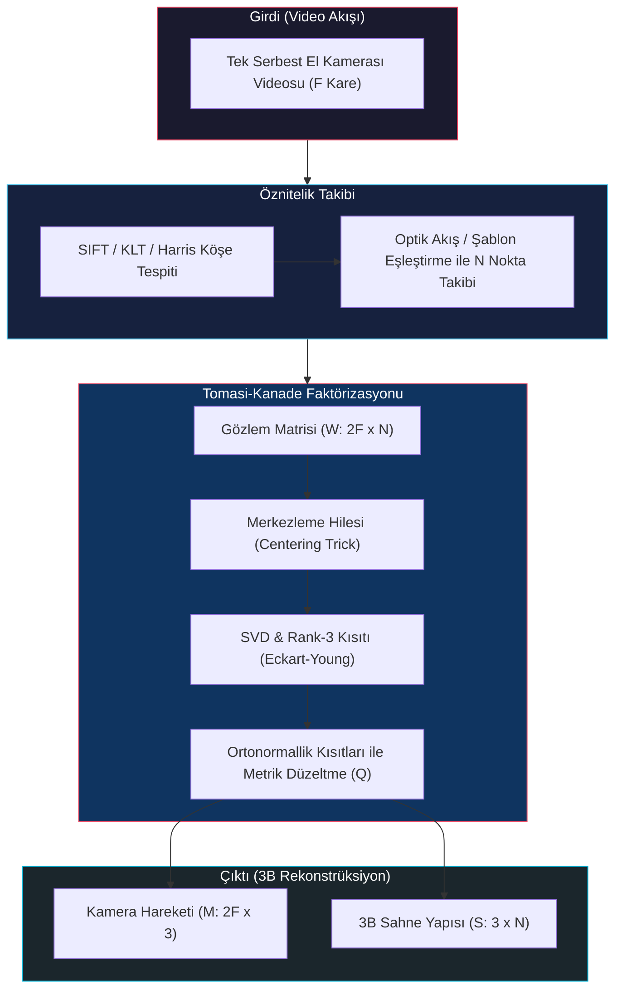

# Hareketten Yapı Çıkarma ve Tomasi-Kanade Faktörizasyonu (Structure from Motion & Factorization)

<!-- toc -->

Bilgisayarlı görünün en zarif, güçlü ve matematiksel açıdan büyüleyici alanlarından biri, kalibre edilmemiş rastgele bir kamera videosundan hem sahnenin üç boyutlu (3B) geometrik yapısını hem de kameranın uzaydaki 3B hareket yörüngesini aynı anda kurtarmaktır. Bu ders notunda; tek bir serbest el kamerasından alınan video dizisi üzerinden çalışan **Structure from Motion (SfM - Hareketten Yapı Çıkarma)** problemi, Carlo Tomasi ve Takeo Kanade (1992) tarafından geliştirilen çığır açıcı **Tomasi-Kanade Faktörizasyon Algoritması**, **Gözlem Matrisi (Observation Matrix)** inşası, **Merkezleme Hilesi (Centering Trick)**, **Rank Teoremi (Rank Theorem)**, **Tekil Değer Ayrışımı (SVD)** ile gürültü filtreleme ve **Ortonormallik Kısıtları Altında Metrik Dönüşüm ($Q$ Matrisi)** hesabı tüm matematiksel, geometrik ve doğrusal cebirsel temelleriyle Columbia Üniversitesi CAVE laboratuvarı (Prof. Shree K. Nayar) müfredatı doğrultusunda incelenmektedir.

---

## 1. Genel Bakış ve Tarihsel Gelişim (Overview)

Bilgisayarlı görüde daha önce ele aldığımız stereo vizyon ve çoklu bakış açısı yaklaşımlarında, iki ya da daha fazla kameranın birbirine göre konumu ve yönelimi (baz çizgisi $b$, dönme matrisi $R$, öteleme vektörü $\mathbf{t}$) ya önceden hassas kalibrasyonla biliniyordu ya da görüntülerdeki epipolar geometri kısıtları yardımıyla hesaplanıyordu. Ancak bu yöntemler genellikle sabit, kalibre edilmiş donanım düzeneklerine veya sınırlı sayıda bakış açısına bağımlıydı.

**Structure from Motion (SfM - Hareketten Yapı Çıkarma)**, bu kısıtlamaları tamamen ortadan kaldırarak çok daha genel, pratik ve güçlü bir problemi çözer:

1. **Kontrolsüz (Casual) Video Akışı:** Elimizde bir nesnenin veya sahnenin etrafında serbestçe yürünerek standart bir kamerayla (örneğin akıllı telefon) kaydedilmiş, kameranın uzaydaki hareket parametreleri (translation ve rotation) önceden bilinmeyen tek bir video dizisi ($F$ adet video karesi) bulunur.
2. **Eş Zamanlı Kestirim (Simultaneous Estimation):** Bu kontrolsüz video akışından başka hiçbir ek donanıma veya kalibrasyon hedefine ihtiyaç duymadan;
   - Sahnenin 3B metrik nokta bulutu yapısı (**Scene Structure - $S$**),
   - Kameranın her bir video karesindeki 3B yönelim ve hareket yörüngesi (**Camera Motion - $M$**)
   aynı anda ve eş zamanlı olarak hesaplanır.

Bu problemin doğrusal ve zarif çözümü için ilk devrim niteliğindeki adımlardan biri **Carlo Tomasi ve Takeo Kanade (1992)** tarafından atılmıştır. Yazarlar, ortografik izdüşüm varsayımı altında, tüm video boyunca izlenen piksellerin koordinatlarını devasa bir **Gözlem Matrisinde (Observation Matrix - $W$)** toplamış ve bu matrisin cebirsel rankının gürültüsüz ortamda en fazla **3** olabileceğini matematiksel olarak ispatlamışlardır (**Rank Teoremi**). 

Bu düşük rank kısıtı, matrisin **Tekil Değer Ayrışımı (SVD - Singular Value Decomposition)** yöntemiyle doğrudan "Kamera Hareketi ($M$)" ve "Sahne Yapısı ($S$)" olarak iki bağımsız matris çarpımına ayrıştırılabilmesini (factorization) sağlamıştır. Günümüzde bu yöntem, internet üzerindeki binlerce fotoğraftan tarihi binaları 3B modelleyen modern SfM sistemlerinin, görsel SLAM (Simultaneous Localization and Mapping) mimarilerinin ve fotogrametrinin temel teorik omurgasını oluşturur.

> **Temel Fikir:** Boyutları ne kadar devasa olursa olsun ($2F \times N$), izlenen tüm piksel yörüngeleri sadece 3 boyutlu bir doğrusal alt uzayda (subspace) yaşar. Bu rank kısıtı, hem gürültüyü kusursuz filtrelememize hem de hareketi ve yapıyı tek hamlede çarpanlarına ayırmamıza imkân tanır.

---

## 2. Hareketten Yapı Çıkarma Probleminin Tanımlanması (SfM Problem)

SfM algoritmasının temel girdisi, zamansal olarak ardışık karelerden oluşan tek bir video dizisidir. Problemi matematiksel olarak modellemek için iki temel aşama ve bir optik model varsayımı kullanılır.

### 2.1 Öznitelik Tespiti ve Takibi (Feature Detection and Tracking)

Matematiksel sistemi kurabilmek için sahnedeki belirgin noktaların tüm video boyunca takip edilmesi gerekir:

1. **Öznitelik Tespiti (Detection):** Video dizisinin ilk karesinde aydınlatma değişimlerine ve gürültüye dayanıklı öznitelik noktaları (örneğin Harris Köşeleri, SIFT anahtar noktaları veya KLT - Kanade-Lucas-Tomasi interest points) saptanır.
2. **Öznitelik Takibi (Tracking):** Bu saptanan noktalar, tüm video kareleri boyunca şablon eşleştirme (template matching), optik akış (Lucas-Kanade optical flow) veya tanımlayıcı eşleştirme yöntemleriyle kareden kareye kesintisiz takip edilir.

<figure style="display:flex; justify-content: center; margin: 20px 0;">
  

    
    <figcaption style="margin-top: 0.5em; text-align: center; font-size: 13px; color: #888;"><em>Görsel 1: Video kareleri üzerinde Harris/SIFT öznitelik noktalarının tespiti ve optik akış / şablon eşleştirme ile video boyunca takibi.</em></figcaption>
  

</figure>

Bu adımın sonucunda algoritmaya girdi olarak; $F$ adet video karesinde ($f = 1, \dots, F$) başarıyla izlenmiş $N$ adet sahne noktasının ($p = 1, \dots, N$) iki boyutlu (2B) piksel koordinatları kümesi elde edilir:

$$\left\\{ (u_{f,p}, v_{f,p}) \right\\} \quad \text{burada} \quad f \in \\{1, \dots, F\\} \quad \text{ve} \quad p \in \\{1, \dots, N\\}$$

### 2.2 Ortografik Kamera Varsayımı (Orthographic Camera Assumption)

Tomasi-Kanade algoritması, perspektif projeksiyonun doğrusal olmayan (non-linear) bölme işlemlerini bertaraf etmek ve problemi kapalı formda çözülebilir doğrusal bir matris denklemine dönüştürmek amacıyla kameranın bir **Ortografik Kamera (Orthographic / Parallel Projection Camera)** olduğunu varsayar.

<figure style="display:flex; justify-content: center; margin: 20px 0;">
  

    
    <figcaption style="margin-top: 0.5em; text-align: center; font-size: 13px; color: #888;"><em>Görsel 2: N adet 3B sahne noktasının ($P_p$) F adet video karesine paralel ışınlarla ortografik izdüşümü.</em></figcaption>
  

</figure>

Bu varsayımın geçerli olduğu fiziksel koşullar şunlardır:

- **Derinlik Değişiminin Mesafeye Oranı:** Nesnenin kendi içindeki derinlik varyasyonları ($\Delta z$), nesnenin kameraya olan ortalama mesafesine ($Z_0$) kıyasla çok küçük olduğunda ($\Delta z \ll Z_0$), perspektif kamera modeli kusursuz bir şekilde ortografik kamera modeliyle yaklaştırılabilir:
  
  $$\frac{\Delta z}{Z_0} \to 0 \implies \text{Büyütme Oranı (Scale)} \approx \text{Sabit}$$

- **Sabit Büyütme (Constant Magnification):** Nesne üzerindeki tüm noktalar kameraya yaklaşık eşit uzaklıkta kabul edilir; dolayısıyla derinliğe bağlı perspektif küçülme/büyüme farkları ihmal edilebilir düzeydedir.
- **Paralel Işın İzdüşümü:** Görüntü oluşumu, tek bir kamera merkezinde odaklanan konik perspektif ışınlar yerine, görüntü düzlemine tamamen dik ve birbirine paralel ışınların nesneye çarpması (orthogonal parallel projection) olarak modellenir.

---

## 3. Gözlem Matrisinin İnşası (Observation Matrix)

Ortografik izdüşüm altında, bir 3B sahne noktasının 2B piksel koordinatlarına nasıl dönüştüğünü adım adım inceleyelim.

### 3.1 Ortografik İzdüşümün Kamera Koordinatlarındaki Geometrisi

Kamera koordinat sisteminin orijinini kameranın optik merkezine ($C$) yerleştirelim. Görüntü düzleminin yatay ve dikey eksenleri boyunca uzanan ortonormal birim yönelim vektörlerini $\mathbf{i}$ (yatay / satır ekseni) ve $\mathbf{j}$ (dikey / sütun ekseni) olarak tanımlayalım.

<figure style="display:flex; justify-content: center; margin: 20px 0;">
  

    
    <figcaption style="margin-top: 0.5em; text-align: center; font-size: 13px; color: #888;"><em>Görsel 3: Kamera koordinat çerçevesinde 3B $P$ noktasının konum vektörü $\mathbf{x}_c$ ve görüntü düzlemindeki $(u, v)$ izdüşümü.</em></figcaption>
  

</figure>

Kamera koordinat sistemindeki bir $P$ noktasının konum vektörü $\mathbf{x}_c$ olsun. Ortografik izdüşüm kuralı gereğince, bu noktanın görüntü düzlemindeki yatay piksel koordinatı $u$ ve dikey piksel koordinatı $v$, konum vektörünün görüntü düzlemi eksen birim vektörleriyle yapılan iç (skaler / nokta) çarpımına eşittir:

$$u = \mathbf{i} \cdot \mathbf{x}_c = \mathbf{i}^T \mathbf{x}_c$$

$$v = \mathbf{j} \cdot \mathbf{x}_c = \mathbf{j}^T \mathbf{x}_c$$

### 3.2 Dünya Koordinat Sistemine Geçiş

Sahnede rastgele seçilmiş sabit bir dünya koordinat sistemi ($\mathcal{W}$) ve bu sistemin orijinini $O$ olarak tanımlayalım.

<figure style="display:flex; justify-content: center; margin: 20px 0;">
  

    
    <figcaption style="margin-top: 0.5em; text-align: center; font-size: 13px; color: #888;"><em>Görsel 4: Sabit dünya koordinat sistemi $\mathcal{W}$ orijini $O$, sahne noktası $P = \mathbf{x}_w$, kamera merkezi $C = \mathbf{c}_w$ ve bağıl vektör $\mathbf{x}_c = \mathbf{x}_w - \mathbf{c}_w$.</em></figcaption>
  

</figure>

- Sahne noktasının dünya koordinat sistemindeki 3B konumu: $P_p = \mathbf{x}_w$
- Kameranın dünya koordinat sistemindeki 3B anlık fiziksel konumu (merkezi): $C_f = \mathbf{c}_w$

Vektör toplamı kuralı gereğince kamera koordinat vektörü $\mathbf{x}_c$, dünya koordinatlarının farkı olarak yazılır:

$$\mathbf{x}_c = \mathbf{x}_w - \mathbf{c}_w = P_p - C_f$$

Bu bağıntıyı izdüşüm eşitliklerine yerleştirdiğimizde, herhangi bir $f$ karesinde izlenen $p$ noktasının piksel koordinatları şu doğrusal denklemlerle ifade edilir:

$$u_{f,p} = \mathbf{i}_f^T (P_p - C_f) = \mathbf{i}_f^T P_p - \mathbf{i}_f^T C_f$$

$$v_{f,p} = \mathbf{j}_f^T (P_p - C_f) = \mathbf{j}_f^T P_p - \mathbf{j}_f^T C_f$$

Burada:
- $P_p \in \mathbb{R}^3$: Kurtarmak istediğimiz bilinmeyen 3B sahne noktasıdır ($p = 1, \dots, N$).
- $\mathbf{i}_f, \mathbf{j}_f \in \mathbb{R}^3$: Kameranın $f$ karesindeki bilinmeyen 3B yönelim (rotasyon) birim vektörleridir ($f = 1, \dots, F$).
- $C_f \in \mathbb{R}^3$: Kameranın $f$ karesindeki bilinmeyen 3B fiziksel pozisyonudur ($f = 1, \dots, F$).

### 3.3 Bilinmeyenlerin Çokluğu ve Çoklu Kare Geometrisi

<figure style="display:flex; justify-content: center; margin: 20px 0;">
  

    
    <figcaption style="margin-top: 0.5em; text-align: center; font-size: 13px; color: #888;"><em>Görsel 5: $F$ adet video karesinde bilinmeyen kamera konumları $\{C_f\}$, bilinmeyen kamera yönelimleri $\{(\mathbf{i}_f, \mathbf{j}_f)\}$ ve bilinmeyen 3B sahne noktaları $\{P_p\}$.</em></figcaption>
  

</figure>

Elimizde $F$ adet kare ve her karede $N$ adet nokta için $2FN$ adet bilinen ölçüm ($u_{f,p}, v_{f,p}$) vardır. Ancak bilinmeyenler şunlardır:
- $N$ adet 3B nokta ($3N$ bilinmeyen),
- $F$ adet kamera pozisyonu $C_f$ ($3F$ bilinmeyen),
- $F$ adet kamera yönelimi $\mathbf{i}_f, \mathbf{j}_f$ ($6F$ bilinmeyen).

Denklem sisteminde kamera merkezleri ($C_f$) yönelim vektörleriyle çarpım halinde olduğundan sistem serbest parametrelerle şişmiştir. Bu karmaşayı çözmek için Tomasi ve Kanade dahiyane bir yöntem geliştirmiştir.

### 3.4 Merkezleme Hilesi (Centering Trick) ile Kamera Merkezinin Yok Edilmesi

Dünya koordinat sisteminin orijini tamamen bizim seçimimize bağlıdır. Matematiksel sistemi en sade hale getirmek için, dünya koordinat sisteminin orijinini sahnedeki tüm $N$ adet 3B noktanın **ağırlık merkezine (3D Centroid - $\bar{P}$)** yerleştirelim.

<figure style="display:flex; justify-content: center; margin: 20px 0;">
  

    
    <figcaption style="margin-top: 0.5em; text-align: center; font-size: 13px; color: #888;"><em>Görsel 6: Dünya koordinat sisteminin orijininin taranan 3B noktaların ağırlık merkezine ($\bar{P}$) yerleştirilmesi.</em></figcaption>
  

</figure>

Bu tercih altında, tüm 3B noktaların koordinat toplamı (ve ortalaması) matematiksel olarak tam sıfıra eşit olur:

$$\sum_{p=1}^N P_p = \mathbf{0} \iff \frac{1}{N}\sum_{p=1}^N P_p = \mathbf{0}$$

Şimdi, her bir $f$ video karesindeki ölçülen tüm piksel koordinatlarının yerel ağırlık merkezini ($\bar{u}_f, \bar{v}_f$) hesaplayalım:

$$\bar{u}\_f = \frac{1}{N} \sum\_{p=1}^N u\_{f,p} = \frac{1}{N} \sum\_{p=1}^N \left( \mathbf{i}\_f^T P\_p - \mathbf{i}\_f^T C\_f \right)$$

Bu toplamı iki ayrı parçaya ayıralım:

$$\bar{u}\_f = \mathbf{i}\_f^T \left( \frac{1}{N} \sum\_{p=1}^N P\_p \right) - \frac{1}{N} \sum\_{p=1}^N \left( \mathbf{i}\_f^T C\_f \right)$$

Dünya orijini centroid üzerinde seçildiği için ilk parantez içi sıfırdır ($\sum P_p = \mathbf{0}$). İkinci terim ise $p$ indeksine bağlı olmayan sabit bir değerdir. Dolayısıyla:

$$\bar{u}\_f = -\mathbf{i}\_f^T C\_f \quad \text{ve benzer şekilde} \quad \bar{v}\_f = -\mathbf{j}\_f^T C\_f$$

Şimdi, ölçülen ham piksel koordinatlarından o kareye ait bu centroid değerlerini çıkartarak **merkezden arındırılmış (centroid-subtracted)** koordinatları ($\tilde{u}_{f,p}, \tilde{v}_{f,p}$) tanımlayalım:

$$\tilde{u}\_{f,p} = u\_{f,p} - \bar{u}\_f = \left( \mathbf{i}\_f^T P\_p - \mathbf{i}\_f^T C\_f \right) - \left( -\mathbf{i}\_f^T C\_f \right) = \mathbf{i}\_f^T P\_p$$

$$\tilde{v}\_{f,p} = v\_{f,p} - \bar{v}\_f = \left( \mathbf{j}\_f^T P\_p - \mathbf{j}\_f^T C\_f \right) - \left( -\mathbf{j}\_f^T C\_f \right) = \mathbf{j}\_f^T P\_p$$

> **Kritik Matematiksel Başarı:** Merkezden arındırma işlemi sayesinde, kameranın uzaydaki anlık 3B pozisyonunu temsil eden tüm bilinmeyen $C_f$ terimleri birbirini kusursuz bir şekilde yok eder! Geriye sadece kamera yönelimi ($\mathbf{i}_f, \mathbf{j}_f$) ile 3B sahne noktalarının ($P_p$) saf iç çarpımlarından oluşan son derece zarif ve doğrusal iki denklem kalır:
> 
> $$\tilde{u}\_{f,p} = \mathbf{i}\_f^T P\_p \quad \text{ve} \quad \tilde{v}\_{f,p} = \mathbf{j}\_f^T P\_p$$

### 3.5 Matris Formülasyonu: $W = M \cdot S$

Tüm video karelerindeki ($F$ adet) ve tüm takip edilen noktalardaki ($N$ adet) merkezden arındırılmış bu koordinatları tek bir devasa matris denkleminde birleştirelim.

<figure style="display:flex; justify-content: center; margin: 20px 0;">
  

    
    <figcaption style="margin-top: 0.5em; text-align: center; font-size: 13px; color: #888;"><em>Görsel 7: Merkezden arındırılmış koordinatların Gözlem Matrisi ($W_{2F \times N}$), Kamera Hareket Matrisi ($M_{2F \times 3}$) ve Sahne Yapı Matrisi ($S_{3 \times N}$) çarpımı olarak matris formülasyonu.</em></figcaption>
  

</figure>

Her bir $f$ karesi ve $p$ noktası için 2B vektör eşitliğini yazalım:

$$\begin{bmatrix} \tilde{u}\_{f,p} \\\\ \tilde{v}\_{f,p} \end{bmatrix} = \begin{bmatrix} \mathbf{i}\_f^T \\\\ \mathbf{j}\_f^T \end{bmatrix} P\_p$$

Bu denklemi tüm $F$ kare ve tüm $N$ nokta boyunca istiflediğimizde temel faktörizasyon denklemi doğar:

$$\mathbf{W}\_{2F \times N} = \mathbf{M}\_{2F \times 3} \cdot \mathbf{S}\_{3 \times N}$$

Buradaki bileşenler:

#### 1. Gözlem Matrisi (Observation Matrix - $W$)
Video karelerinden ölçtüğümüz ve centroidlerini çıkardığımız tüm bilinen verileri barındıran $2F \times N$ boyutundaki matristir:

$$W = \left[ \begin{array}{cccc} 
\tilde{u}\_{1,1} & \tilde{u}\_{1,2} & \dots & \tilde{u}\_{1,N} \\\\
\tilde{u}\_{2,1} & \tilde{u}\_{2,2} & \dots & \tilde{u}\_{2,N} \\\\
\vdots & \vdots & \ddots & \vdots \\\\
\tilde{u}\_{F,1} & \tilde{u}\_{F,2} & \dots & \tilde{u}\_{F,N} \\\\
\hline
\tilde{v}\_{1,1} & \tilde{v}\_{1,2} & \dots & \tilde{v}\_{1,N} \\\\
\tilde{v}\_{2,1} & \tilde{v}\_{2,2} & \dots & \tilde{v}\_{2,N} \\\\
\vdots & \vdots & \ddots & \vdots \\\\
\tilde{v}\_{F,1} & \tilde{v}\_{F,2} & \dots & \tilde{v}\_{F,N}
\end{array} \right]_{2F \times N}$$

#### 2. Kamera Hareket Matrisi (Camera Motion Matrix - $M$)
Kameranın her bir karedeki 3B yönelim vektörlerini alt alta istifleyen $2F \times 3$ boyutundaki bilinmeyen matristir:

$$M = \left[ \begin{array}{c} 
\mathbf{i}\_1^T \\\\
\mathbf{i}\_2^T \\\\
\vdots \\\\
\mathbf{i}\_F^T \\\\
\hline
\mathbf{j}\_1^T \\\\
\mathbf{j}\_2^T \\\\
\vdots \\\\
\mathbf{j}\_F^T
\end{array} \right]_{2F \times 3}$$

#### 3. Sahne Yapı Matrisi (Scene Structure Matrix - $S$)
Kurtarmak istediğimiz tüm 3B sahne noktalarının koordinatlarını yan yana sütunlar halinde içeren $3 \times N$ boyutundaki bilinmeyen matristir:

$$S = \begin{bmatrix} P_1 & P_2 & \dots & P_N \end{bmatrix}_{3 \times N}$$

---

## 4. Gözlem Matrisinin Rankı (Rank of Observation Matrix)

Tomasi-Kanade algoritmasının kalbini oluşturan en derin keşif, bu devasa $W$ gözlem matrisinin taşıdığı cebirsel rank kısıtıdır.

### 4.1 Doğrusal Bağımsızlık ve Vektör Uzayı Kavramı (Math Primer)

Bir vektör kümesinde hiçbir vektör, diğer vektörlerin doğrusal bir kombinasyonu (lineer toplamı) olarak yazılamıyorsa bu küme **doğrusal bağımsızdır (linearly independent)**.

<figure style="display:flex; justify-content: center; margin: 20px 0;">
  

    
    <figcaption style="margin-top: 0.5em; text-align: center; font-size: 13px; color: #888;"><em>Görsel 8: 2B uzayda $\{\mathbf{i}, \mathbf{j}\}$ doğrusal bağımsız bir taban oluştururken, 2B düzleme eklenen 3. veya 4. herhangi bir vektör ($\mathbf{v}_1, \mathbf{v}_2, \mathbf{v}_3$) mutlaka doğrusal bağımlı hale gelir.</em></figcaption>
  

</figure>

- 2B bir düzlemde en fazla 2 adet doğrusal bağımsız vektör bulunabilir. 3. bir vektör eklendiğinde $\{\mathbf{i}, \mathbf{j}, \mathbf{v}_1\}$ kümesi kesinlikle doğrusal bağımlı (linearly dependent) olur.
- Benzer şekilde 3B uzayda en fazla 3 adet doğrusal bağımsız vektör bulunabilir.

### 4.2 Matris Rankı ve Boyutsal Sınırlar

Bir $m \times n$ boyutundaki $A$ matrisi için:
- **Sütun Rankı (Column Rank):** Matrisin doğrusal olarak bağımsız sütunlarının maksimum sayısıdır.
- **Satır Rankı (Row Rank):** Matrisin doğrusal olarak bağımsız satırlarının maksimum sayısıdır.

<figure style="display:flex; justify-content: center; margin: 20px 0;">
  

    
    <figcaption style="margin-top: 0.5em; text-align: center; font-size: 13px; color: #888;"><em>Görsel 9: Bir $m \times n$ matris için sütun rankı satır rankına daima eşittir ve boyutların minimumunu aşamaz: $\text{Rank}(A) \leq \min(m, n)$.</em></figcaption>
  

</figure>

Doğrusal cebirin temel teoremi gereğince, her matris için sütun rankı daima satır rankına eşittir ve bu ortak değere matrisin **Rankı** denir:

$$\text{ColumnRank}(A) = \text{RowRank}(A) = \text{Rank}(A) \leq \min(m, n)$$

Ayrıca iki matrisin çarpımının rankı, çarpan matrislerin ayrı ayrı rank değerlerinin minimumundan daha büyük olamaz:

$$\text{Rank}(A \cdot B) \leq \min(\text{Rank}(A), \text{Rank}(B))$$

### 4.3 Rank Geometrisi (1D, 2D ve 3D Alt Uzaylar)

Rank kavramının geometrik anlamını $3 \times 3$ boyutunda $A = [\mathbf{a} \ \mathbf{b} \ \mathbf{c}]$ matrisi üzerinde görselleştirelim:

#### Rank 1 Durumu (1 Boyutlu Doğru)
Tüm kolon vektörleri ($\mathbf{a}, \mathbf{b}, \mathbf{c}$) 3B uzayda aynı tek bir doğru boyunca uzanır (birbirinin skaler katıdır). Bilgi tek bir boyuta sıkışmıştır:

<figure style="display:flex; justify-content: center; margin: 20px 0;">
  

    
    <figcaption style="margin-top: 0.5em; text-align: center; font-size: 13px; color: #888;"><em>Görsel 10: $\text{Rank}(A) = 1$: Kolon vektörleri tek bir doğru üzerindedir (1D alt uzay).</em></figcaption>
  

</figure>

#### Rank 2 Durumu (2 Boyutlu Düzlem)
Kolon vektörleri 3B uzayda tek bir doğruya sığmaz, ancak hepsi ortak bir 2B düzlem üzerinde yer alır:

<figure style="display:flex; justify-content: center; margin: 20px 0;">
  

    
    <figcaption style="margin-top: 0.5em; text-align: center; font-size: 13px; color: #888;"><em>Görsel 11: $\text{Rank}(A) = 2$: Kolon vektörleri ortak bir 2B düzlem oluşturur (2D alt uzay).</em></figcaption>
  

</figure>

#### Rank 3 Durumu (3 Boyutlu Hacim)
Kolon vektörleri 3B uzayı tam olarak gerer (tüm hacmi doldurur) ve tam ranklıdır:

<figure style="display:flex; justify-content: center; margin: 20px 0;">
  

    
    <figcaption style="margin-top: 0.5em; text-align: center; font-size: 13px; color: #888;"><em>Görsel 12: $\text{Rank}(A) = 3$: Kolon vektörleri tam 3B hacim gerer (tam rank).</em></figcaption>
  

</figure>

### 4.4 Rank Teoremi (The Rank Theorem) ve İspatı

Şimdi bu temel doğrusal cebir kurallarını $W = M \cdot S$ denklemimize uygulayalım:

1. Kamera Hareket Matrisi $M$, $2F \times 3$ boyutundadır. Dolayısıyla rankı en fazla 3 olabilir:
   
   $$\text{Rank}(M) \leq \min(2F, 3) = 3$$

2. Sahne Yapı Matrisi $S$, $3 \times N$ boyutundadır. Dolayısıyla rankı en fazla 3 olabilir:
   
   $$\text{Rank}(S) \leq \min(3, N) = 3$$

3. İki matrisin çarpım rankı kuralı uygulandığında:
   
   $$\text{Rank}(W) \leq \min(\text{Rank}(M), \text{Rank}(S)) \leq 3$$

> **Tomasi-Kanade Rank Teoremi (1992):**
> Bir video dizisinde kaç tane video karesi ($F \gg 3$) çekilirse çekilsin ve sahneden kaç bin adet nokta ($N \gg 3$) takip edilirse edilsin; gürültüsüz ideal bir ortografik kamera sisteminde Gözlem Matrisinin ($W_{2F \times N}$) Rankı **HER ZAMAN EN FAZLA 3'TÜR!**
> 
> $$\text{Rank}(W) \leq 3$$

Bu teoremin önemi muazzamdır: $W$ matrisi binlerce satır ve sütundan oluşsa bile ($2F \times N$), barındırdığı tüm veri sadece 3 boyutlu bir doğrusal alt uzayda yer alır. Matrisin 4. ve sonraki tüm boyutlardaki varyasyonları matematiksel olarak tam sıfırdır; gerçek dünyada sıfırdan farklı çıkan değerler ise yalnızca ölçüm ve takip gürültüsünden (noise) kaynaklanır.

---

## 5. Tomasi-Kanade Faktörizasyon Algoritması (Tomasi-Kanade Factorization)

Rank teoremini pratik bir algoritmaya dönüştürmek için Tekil Değer Ayrışımı (SVD) kullanılır.

### 5.1 Tekil Değer Ayrışımı (SVD - Singular Value Decomposition)

Herhangi bir $2F \times N$ boyutundaki $W$ gözlem matrisine SVD uygulandığında matris üç bileşenin çarpımı olarak ayrışır:

$$W = U \cdot \Sigma \cdot V^T$$

<figure style="display:flex; justify-content: center; margin: 20px 0;">
  

    
    <figcaption style="margin-top: 0.5em; text-align: center; font-size: 13px; color: #888;"><em>Görsel 13: $W_{2F \times N}$ matrisinin $U_{2F \times 2F}$, $\Sigma_{2F \times N}$ ve $V^T_{N \times N}$ matrislerine SVD ayrışımı.</em></figcaption>
  

</figure>

Burada:
- $U$: $2F \times 2F$ boyutunda ortonormal bir matristir ($U^T U = I$, sol tekil vektörler).
- $V^T$: $N \times N$ boyutunda ortonormal bir matristir ($V^T V = I$, sağ tekil vektörler).
- $\Sigma$: $2F \times N$ boyutunda, köşegeninde negatif olmayan tekil değerleri (singular values) azalan sırada barındıran matristir: $\sigma_1 \geq \sigma_2 \geq \sigma_3 \geq \sigma_4 \geq \dots \geq 0$.

### 5.2 Rank-3 Kısıtının Empoze Edilmesi ve Ekonomik Ayrışım (Rank 3 Truncation)

İdeal ve gürültüsüz bir sistemde $\text{Rank}(W) \leq 3$ olduğundan, $\Sigma$ matrisinin ilk 3 diyagonal elemanı dışındaki tüm tekil değerler tam olarak sıfırdır:

$$\sigma_1 \geq \sigma_2 \geq \sigma_3 > 0 \quad \text{ve} \quad \sigma_4 = \sigma_5 = \dots = 0$$

Ancak gerçek ölçümlerde piksel gürültüsü ve takip hataları nedeniyle $\sigma_4, \sigma_5, \dots$ değerleri sıfır yerine küçük ondalıklı sayılar alır. **Eckart-Young-Mirsky Teoremi** uyarınca, $W$ matrisine en yakın Rank-3 matrisi elde etmek için 3'ten büyük tüm tekil değerler zorla sıfırlanır:

<figure style="display:flex; justify-content: center; margin: 20px 0;">
  

    
    <figcaption style="margin-top: 0.5em; text-align: center; font-size: 13px; color: #888;"><em>Görsel 14: SVD matrislerinin blok bölümlemesi: Anlamlı ilk 3 bileşen ($U_1, \Sigma_1, V_1^T$) ve gürültüyü temsil eden atılan parçalar ($U_2, V_2^T$).</em></figcaption>
  

</figure>

Matrisleri bloklara ayıralım:
- $U = \begin{bmatrix} U\_1 & U\_2 \end{bmatrix}$ (burada $U\_1$ ilk 3 sütundur: $2F \times 3$, $U\_2$ geri kalan $2F-3$ sütundur).
- $\Sigma = \begin{bmatrix} \Sigma\_1 & 0 \\\\ 0 & \Sigma\_2 \end{bmatrix}$ (burada $\Sigma\_1 = \text{diag}(\sigma\_1, \sigma\_2, \sigma\_3)$ boyutu $3 \times 3$'tür).
- $V^T = \begin{bmatrix} V\_1^T \\\\ V\_2^T \end{bmatrix}$ (burada $V\_1^T$ ilk 3 satırdır: $3 \times N$).

Gürültülü $\Sigma\_2$ bloklarını sıfırlayarak **Ekonomik SVD Ayrışımını (Economical Representation)** elde ederiz:

$$W \approx U\_1 \cdot \Sigma\_1 \cdot V\_1^T$$

### 5.3 Faktörizasyon ve Temsil Belirsizliği (Affine Ambiguity)

$\Sigma\_1$ pozitif ve diagonal bir matris olduğundan karekökü $\Sigma\_1^{1/2} = \text{diag}(\sqrt{\sigma\_1}, \sqrt{\sigma\_2}, \sqrt{\sigma\_3})$ kolayca hesaplanır. Bu karekökü her iki tarafa simetrik dağıtarak geçici hareket ve yapı matrislerini tanımlayalım:

$$\hat{M} = U\_1 \Sigma\_1^{1/2} \quad (2F \times 3) \quad \text{ve} \quad \hat{S} = \Sigma\_1^{1/2} V\_1^T \quad (3 \times N)$$

Böylece $W \approx \hat{M} \cdot \hat{S}$ eşitliği sağlanmış olur. 

Ancak burada kritik bir sorun karşımıza çıkar: **Afit Belirsizlik (Affine / Linear Ambiguity)**. Herhangi bir tersi alınabilir (non-singular) $3 \times 3$ boyutundaki $Q$ matrisi için, araya birim matris $Q \cdot Q^{-1} = I$ yerleştirildiğinde eşitlik hiçbir şekilde bozulmaz:

$$W = \hat{M} \cdot \hat{S} = \left( \hat{M} Q \right) \cdot \left( Q^{-1} \hat{S} \right) = M \cdot S$$

Bu durum, doğrudan SVD'den bulduğumuz $\hat{M}$ ve $\hat{S}$ matrislerinin fiziksel olarak doğru rotasyon ve metrik 3B yapı matrisleri olmadığını gösterir. Bunlar sadece afit bir deformasyona (affine distortion) uğramış geçici çözümlerdir:

$$M = \hat{M} Q \quad \text{ve} \quad S = Q^{-1} \hat{S}$$

Gerçek kamera yönelimlerini ($M$) ve 3B sahne yapısını ($S$) bulabilmek için bu afit bükülmeyi düzelten benzersiz $3 \times 3$ boyutundaki **$Q$ Metrik Dönüşüm Matrisini** hesaplamak şarttır.

### 5.4 Ortonormallik Kısıtları Altında $Q$ Matrisinin Çözümü

$Q$ matrisinin 9 bilinmeyen elemanını çözmek için, kameranın fiziksel geometrisinden gelen ve şu ana kadar hiç kullanmadığımız **Ortonormallik Kısıtları (Orthonormality Constraints)** devreye sokulur.

Kameranın görüntü düzlemini oluşturan $\mathbf{i}\_f$ (yatay) ve $\mathbf{j}\_f$ (dikey) eksenleri birer birim uzunluktaki vektördür ve birbirlerine tam diktir (ortogonaldir). Dolayısıyla her bir $f$ video karesi için şu 3 temel geometrik kısıt sağlanmak zorundadır:

$$\mathbf{i}\_f^T \mathbf{i}\_f = 1 \quad (\text{Birim uzunluk kısıtı})$$

$$\mathbf{j}\_f^T \mathbf{j}\_f = 1 \quad (\text{Birim uzunluk kısıtı})$$

$$\mathbf{i}\_f^T \mathbf{j}\_f = 0 \quad (\text{Ortogonallik / Diklik kısıtı})$$

SVD'den elde ettiğimiz geçici $\hat{M}$ matrisinin satır vektörlerini $\hat{\mathbf{i}}\_f^T$ ve $\hat{\mathbf{j}}\_f^T$ olarak gösterelim. $M = \hat{M} Q$ bağıntısından gerçek yönelim vektörleri $\mathbf{i}\_f = Q^T \hat{\mathbf{i}}\_f$ ve $\mathbf{j}\_f = Q^T \hat{\mathbf{j}}\_f$ olarak yazılır. Bu ifadeleri ortonormallik kısıtlarına yerleştirdiğimizde:

$$\hat{\mathbf{i}}\_f^T \left( Q Q^T \right) \hat{\mathbf{i}}\_f = 1$$

$$\hat{\mathbf{j}}\_f^T \left( Q Q^T \right) \hat{\mathbf{j}}\_f = 1$$

$$\hat{\mathbf{i}}\_f^T \left( Q Q^T \right) \hat{\mathbf{j}}\_f = 0$$

Bu denklem sisteminde aranacak bilinmeyen matris aslında doğrudan $Q$ değil, onun simetrik matris çarpımı olan **$L = Q Q^T$** matrisidir:

$$L = Q Q^T = \begin{bmatrix} 
l_1 & l_2 & l_3 \\\\
l_2 & l_4 & l_5 \\\\
l_3 & l_5 & l_6
\end{bmatrix}_{3 \times 3}$$

- $L$, $3 \times 3$ boyutunda pozitif-tanımlı simetrik bir matris olduğundan **sadece 6 bağımsız bilinmeyen** ($l_1, l_2, l_3, l_4, l_5, l_6$) içerir.
- Her bir video karesi ($f$) bize yukarıdaki gibi 3 adet bağımsız doğrusal denklem sağlar.
- Eğer videoda en az 3 veya daha fazla kare varsa ($F \geq 3$), elimizde $3F \geq 9$ adet doğrusal denklem oluşur. Bu aşırı belirlenmiş (overdetermined) denklem sistemi **En Küçük Kareler (Linear Least Squares)** yöntemiyle çözülerek $L$ matrisi kesin olarak bulunur.

$L$ matrisi hesaplandıktan sonra, **Cholesky Ayrışımı (Cholesky Decomposition)** veya SVD uygulanarak $L = Q Q^T$ eşitliğinden $Q$ matrisi tekil ve kararlı bir şekilde çıkartılır:

$$L = U\_L \Sigma\_L U\_L^T \implies Q = U\_L \Sigma\_L^{1/2}$$

$Q$ bulunduktan sonra nihai metrik çözümler elde edilir:

$$\mathbf{M} = \hat{M} Q \quad \text{ve} \quad \mathbf{S} = Q^{-1} \hat{S}$$

Böylece sahnedeki noktaların gerçek 3B metrik koordinatları ($S$) ve kameranın tüm video boyunca uzayda çizdiği kesin yönelim ve hareket yörüngesi ($M$) kusursuz şekilde hesaplanmış olur!

### 5.5 Algoritma Doğrulaması ve Klasik Tomasi-Kanade Sonuçları

Tomasi ve Kanade'nin (1992) orijinal çalışmasında, bir oyuncak ev modeli döner tabla üzerinde döndürülmüş ve serbest el kamerasıyla çekilen video dizisine faktörizasyon algoritması uygulanmıştır.

<figure style="display:flex; justify-content: center; margin: 20px 0;">
  

    
    <figcaption style="margin-top: 0.5em; text-align: center; font-size: 13px; color: #888;"><em>Görsel 15: Orijinal Tomasi-Kanade deneyi: Giriş video dizisi (Input Image Sequence) ve algoritma ile kurtarılan 3B nokta bulutu yapısı (Estimated 3D Points).</em></figcaption>
  

</figure>

Sonuçlar, algoritmanın hiçbir ön kalibrasyon olmadan milimetrik doğrulukta bir 3B model ve kusursuz bir kamera hareket yörüngesi çıkardığını açıkça kanıtlamıştır.

---

## 6. Özetleyici Teknik Karşılaştırma Matrisi

| Algoritmik Adım | Boyut / Matematiksel Yapı | Çözdüğü Bilinmeyen / Rolü | En Büyük Gücü / Avantajı | Karşılaşılan Temel Kısıt / Zorluk |
| :--- | :--- | :--- | :--- | :--- |
| **Centering Trick** | Vektörel çıkarma ($\tilde{u} = u - \bar{u}$) | Kamera merkezlerini ($C_f$) denklemden yok etme | Bilinmeyen sayısını dramatik azaltıp sistemi doğrusallaştırma | Tüm noktaların video boyunca kesintisiz izlenmesini gerektirmesi |
| **Observation Matrix ($W$)** | $2F \times N$ büyük veri matrisi | Tüm izlenen piksel koordinatlarını tek çatıda toplama | Hareketi ve yapıyı $W = M \cdot S$ çarpımıyla doğrusal bağlama | Hatalı öznitelik eşleşmelerinin (outliers) matrisi bozabilmesi |
| **Rank Teoremi** | $\text{Rank}(W) \leq 3$ kısıtı | Matrisin teorik bilgi boyutunu sınırlama | Gürültüyü filtrelemek için küresel alt uzay tabanı sunması | Sadece ortografik (paralel) projeksiyon varsayımında tam geçerli olması |
| **SVD & Rank-3 Kısıtı** | $W \approx U_1 \Sigma_1 V_1^T$ ekonomik ayrışım | Gürültülü veriyi en yakın Rank-3 alt uzayına projekte etme | Eckart-Young teoremi ile küresel least squares gürültü eliminasyonu | 3'ten küçük tekil değerlerin atılmasıyla zayıf özniteliklerin elenme riski |
| **Ortonormallik Minimizasyonu** | $3F$ denklemden $L = Q Q^T$ ($3 \times 3$) çözümü | Afit belirsizliği giderip kesin metrik yapı ve hareketi bulma | Kamera yönelimlerinin fiziksel birimlerde (rotasyon) çıkmasını sağlama | $L$ matrisinin pozitif tanımlı olmaması durumunda Cholesky hatası riski |

---

## 7. Sonuç, Deneysel Başarımlar ve Modern SfM Gelişmeleri

### 7.1 Deneysel Sonuçlar ve Yoğun 3B Rekonstrüksiyon

Tomasi-Kanade faktörizasyonu sadece seyrek (sparse) nokta bulutu çıkarmakla kalmaz; takip edilen yüzlerce öznitelik noktası üçgenleştirilerek (Delaunay triangulation) ve yüzey dokuları kaplanarak (texture mapping) yoğun, foto-gerçekçi 3B modeller üretilebilir.

<figure style="display:flex; justify-content: center; margin: 20px 0;">
  

    
    <figcaption style="margin-top: 0.5em; text-align: center; font-size: 13px; color: #888;"><em>Görsel 16: Gerçek bir bina cephesinden alınan video dizisi (Input Image Sequence), takip edilen öznitelikler (Tracked Features) ve faktörizasyon ile elde edilen dokulu 3B rekonstrüksiyon (3D Reconstruction).</em></figcaption>
  

</figure>

### 7.2 Modern SfM, SLAM ve Büyük Ölçekli 3B Modelleme

Orijinal Tomasi-Kanade algoritması bilgisayarlı görünün temel taşıdır. Günümüzde bu temel üzerine inşa edilen modern sistemler şu kritik yenilikleri barındırır:

1. **Perspektif ve Projektif Faktörizasyon (Projective Factorization):** Sturm-Triggs ve Hartley algoritmaları, ortografik kısıtı kaldırarak perspektif kameralarda derinlik ağırlıklarını (projective depths) iteratif olarak çözer.
2. **Kapanma (Occlusion) ve Matris Tamamlama (Matrix Completion):** Gerçek videolarda nesneler kadrajdan çıkıp yeniden girebilir. Modern algoritmalar eksik gözlem matrislerini (missing data) EM (Expectation-Maximization) ve nükleer norm minimizasyonu ile tamamlar.
3. **Büyük Ölçekli SfM (COLMAP, Bundler):** İnternet üzerindeki Flickr fotoğraflarından tüm Roma'yı veya antik kentleri 3B modelleyen modern sistemler (Photo Tourism), Bundle Adjustment ve epipolar geometriyi Tomasi-Kanade'nin çoklu bakış açısı felsefesiyle birleştirir.

<figure style="display:flex; justify-content: center; margin: 20px 0;">
  

    
    <figcaption style="margin-top: 0.5em; text-align: center; font-size: 13px; color: #888;"><em>Görsel 17: Tarihi bir taş kabartma videosundan (Input Video) modern Structure from Motion algoritmalarıyla elde edilen yüksek çözünürlüklü 3B yüzey geometrisi (Computed Structure).</em></figcaption>
  

</figure>

---

## 8. Özet ve Çıkarımlar

1. **SfM'nin Gücü:** Structure from Motion, kalibrasyonsuz ve kontrolsüz tek bir video akışından hem sahnenin 3B yapısını ($S$) hem de kameranın 3B hareket rotasını ($M$) eş zamanlı kurtarır.
2. **Merkezleme Hilesi:** Orijini 3B sahne ağırlık merkezine taşımak, kamera konumlarını ($C_f$) denklemden tamamen düşürerek sistemi $W = M \cdot S$ doğrusal formuna sokar.
3. **Rank Teoremi:** Gürültüsüz ortamda gözlem matrisi $W_{2F \times N}$ boyutu ne kadar büyük olursa olsun rankı en fazla 3'tür ($\text{Rank}(W) \leq 3$).
4. **SVD ve Gürültü Filtreleme:** SVD uygulanıp ilk 3 tekil değer dışındakiler sıfırlanarak küresel en küçük kareler duyarlılığında gürültü temizlenir ($W \approx U_1 \Sigma_1 V_1^T$).
5. **Metrik Düzeltme ($Q$):** SVD afit bir çözüm ($\hat{M}, \hat{S}$) verdiğinden, kamera yönelim birim vektörlerinin ortonormallik kısıtları ($\mathbf{i}_f^T \mathbf{i}_f = 1, \mathbf{j}_f^T \mathbf{j}_f = 1, \mathbf{i}_f^T \mathbf{j}_f = 0$) kullanılarak simetrik $L = Q Q^T$ matrisi çözülür ve gerçek metrik 3B yapı ile kamera hareketi elde edilir.
