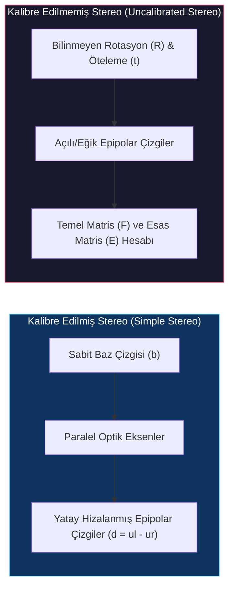
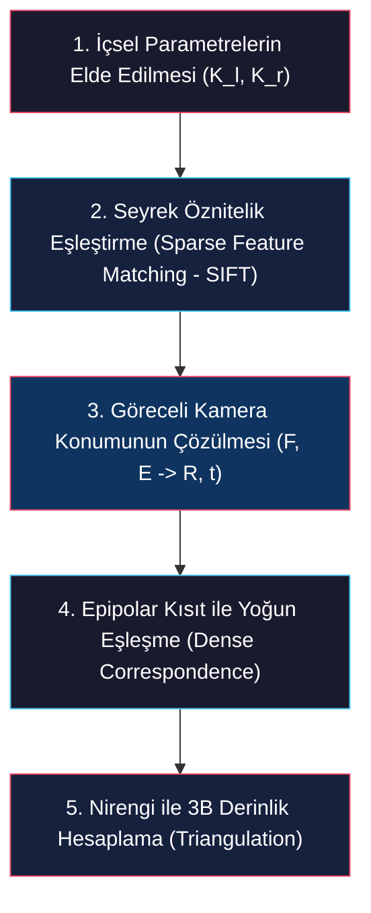

# Kalibre Edilmemiş Stereo ve Doğada Stereo Görüş (Uncalibrated Stereo & Stereopsis)

<!-- toc -->

Bilgisayarlı görünün en heyecan verici ve güçlü alanlarından biri, kameraların uzaydaki konumlarını ($R, \mathbf{t}$) önceden bilmeden, sadece görüntülerdeki piksel eşleşmelerini ve kameraların içsel optik parametrelerini kullanarak sahnenin üç boyutlu (3B) geometrisini sıfırdan inşa etmektir. Bu derste; kalibre edilmemiş iki görüntünün geometrik ilişkilerini yöneten **Epipolar Geometri**, **Esas Matris (Essential Matrix)**, **Temel Matris (Fundamental Matrix)** hesabı, **1D Epipolar Arama** ile yoğun eşleşme, **Nirengi (Triangulation)** ve doğadaki biyolojik stereo görüş sistemlerinin optik/psikofiziksel sırları Columbia Üniversitesi CAVE laboratuvarı (Prof. Shree K. Nayar) müfredatı doğrultusunda derinlemesine incelenmektedir.

---

## 1. Genel Bakış (Overview)

Kalibre edilmiş (basit) stereo sistemlerinde kameralar sabitlenmiştir, optik eksenleri birbirine tamamen paraleldir, dikey olarak hizalanmıştır ve aralarındaki yatay baz çizgisi (baseline - $b$) mesafesi milimetrik hassasiyetle bilinir. 

<figure style="display:flex; justify-content: center; margin: 20px 0;">
  

    
    <figcaption style="margin-top: 0.5em; text-align: center; font-size: 13px; color: #888;"><em>Görsel 1: Kalibre edilmiş (basit) stereo sistem kısıtları: Kameralar dikey doğrultuda hizalıdır, optik eksenleri paraleldir ve baz çizgisi (b) sabittir.</em></figcaption>
  

</figure>

Basit stereo sisteminde sol kamera orijine $(0,0,0)$, sağ kamera ise $(b,0,0)$ konumuna yerleştirildiğinde, bir $\mathbf{X}=(x,y,z)$ noktasının izdüşümleri ve disparite (disparity - $d = u_l - u_r$) üzerinden derinlik şu kapalı formüllerle elde edilir:

$$x = \frac{b(u_l - o_x)}{u_l - u_r}, \quad y = \frac{b \cdot f_x (v_l - o_y)}{f_y (u_l - u_r)}, \quad z = \frac{b \cdot f_x}{u_l - u_r}$$

Ancak gerçek dünya senaryolarında (örneğin internetteki turistik fotoğraflar veya mobil cihazlarla rastgele çekilen kareler) kameraların uzaydaki bağımsız konumları ve dönme açıları önceden bilinemez.

**Kalibre Edilmemiş Stereo (Uncalibrated Stereo)**, kameraların uzaydaki göreceli konumlarını (öteleme - $\mathbf{t}$) ve yönelimlerini (rotasyon - $R$) önceden bilmeden, iki veya daha fazla görüntüden sahnenin 3B yapısını rekonstrükt etmemizi sağlayan bir teknolojidir.

Bu yöntem, genellikle kameraların odak uzaklığı ve asal nokta gibi içsel (intrinsic - $K$) parametre matrislerinin bilindiği (örneğin EXIF metadata verilerinden) varsayımıyla çalışır. Sistem, görüntüler arasındaki geometrik kısıtları ve Epipolar Geometri kurallarını analiz ederek kameraların uzaydaki göreceli konumlarını ve sahnedeki nesnelerin derinliğini eş zamanlı olarak hesaplar.

> **Önemli Not:** Kalibre edilmemiş stereo, modern **Structure from Motion (SfM)** ve **Photo Tourism** algoritmalarının matematiksel çekirdeğini oluşturur. Kameraların uzaydaki pozlandırma bilgisi sıfır olsa dahi saf piksel eşleşmeleri üzerinden 3B dünya koordinatları geri kazanılır.

---

## 2. Kalibre Edilmemiş Stereo Problemi (Problem of Uncalibrated Stereo)

Kalibre edilmemiş stereo probleminde temel amaç, bilinmeyen bir mekansal ilişkiye ($R, \mathbf{t}$) sahip iki ayrı kameradan alınan iki görüntü aracılığıyla sahnenin 3B yapısını çözmektir.

<figure style="display:flex; justify-content: center; margin: 20px 0;">
  

    
    <figcaption style="margin-top: 0.5em; text-align: center; font-size: 13px; color: #888;"><em>Görsel 2: Kalibre edilmemiş stereo problemi: Rastgele pozlanmış sol ve sağ kameraların uzaydaki bağımsız duruşları.</em></figcaption>
  

</figure>

Bu problemi çözmek için 5 sistematik adımdan oluşan bir işlem hattı (pipeline) izlenir:

<figure style="display:flex; justify-content: center; margin: 20px 0;">
  

    
    <figcaption style="margin-top: 0.5em; text-align: center; font-size: 13px; color: #888;"><em>Görsel 3: Kalibre edilmemiş stereo rekonstrüksiyonunun 5 temel adımı ve geometric parametreler.</em></figcaption>
  

</figure>

### 2.1 Adım Adım Problem Çözüm Hattı

1. **İçsel Parametrelerin Elde Edilmesi (Intrinsic Calibration Matrices):** Kameraların odak uzaklığı ($f_x, f_y$) ve asal nokta ($o_x, o_y$) parametrelerini içeren $K_l$ ve $K_r$ matrislerinin bilindiği (veya EXIF verilerinden okunduğu) varsayılır:
   $$K = \begin{bmatrix} f_x & 0 & o_x \\\\ 0 & f_y & o_y \\\\ 0 & 0 & 1 \end{bmatrix}$$

<figure style="display:flex; justify-content: center; margin: 20px 0;">
  

    
    <figcaption style="margin-top: 0.5em; text-align: center; font-size: 13px; color: #888;"><em>Görsel 4: İçsel kamera matrislerinin ($K_l, K_r$) bilinmesi ve ilk güvenilir noktaların seçilmesi.</em></figcaption>
  

</figure>

2. **Seyrek Öznitelik Eşleştirme (Initial Feature Correspondences):** SIFT, SURF veya ORB gibi güçlü özellik dedektörleri kullanılarak sol ve sağ görüntü arasında aynı 3B noktalara karşılık gelen az sayıda (en az 8 adet) belirgin nokta çifti ($u_l^{(i)}, v_l^{(i)}) \leftrightarrow (u_r^{(i)}, v_r^{(i)}$) saptanır.

<figure style="display:flex; justify-content: center; margin: 20px 0;">
  

    
    <figcaption style="margin-top: 0.5em; text-align: center; font-size: 13px; color: #888;"><em>Görsel 5: Sol ve sağ görüntüler üzerinde saptanan seyrek öznitelik eşleşmeleri.</em></figcaption>
  

</figure>

3. **Mekansal İlişkinin Çözülmesi (Dışsal Kalibrasyon):** Saptanan bu eşleşmeler üzerinden **Temel Matris (Fundamental Matrix - $F$)** veya **Esas Matris (Essential Matrix - $E$)** hesaplanır. Ayrıştırma adımıyla iki kamerayı birbirine bağlayan göreceli rotasyon matrisi ($R$) ve öteleme vektörü ($\mathbf{t}$) elde edilerek sistem tamamen kalibre hale getirilir.
4. **Yoğun Eşleşme (Dense Correspondence):** Hesaplanan geometri sayesinde arama uzayı 2B görüntü alanından 1B epipolar çizgilere indirgenir. Sol görüntüdeki hemen her pikselin sağ görüntüdeki karşılığı bu 1D epipolar çizgi boyunca kaydırılarak bulunur.
5. **Nirengi ile Derinlik Hesaplama (Triangulation):** Eşleşen tüm piksel çiftleri iki kameradan çıkan ışınların 3B uzaydaki kesişim noktalarını (nirengi) vererek sahnenin yoğun 3B derinlik haritasını üretir.

---

## 3. Epipolar Geometri (Epipolar Geometry)

Göreceli kamera konumlarını çözmemizi sağlayan **Epipolar Geometri**, iki kamera merkezi ile sahnedeki 3B nokta arasındaki izdüşüm ilişkilerini tanımlayan temel geometrik yapıdır.

<figure style="display:flex; justify-content: center; margin: 20px 0;">
  

    
    <figcaption style="margin-top: 0.5em; text-align: center; font-size: 13px; color: #888;"><em>Görsel 6: Epipolar geometri bileşenleri: Optik merkezler ($O_l, O_r$), epipoller ($e_l, e_r$), epipolar düzlem ve epipolar çizgiler.</em></figcaption>
  

</figure>

### 3.1 Geometrik Tanımlamalar

- **Optik Merkezler ($O_l, O_r$):** Sol ve sağ kameraların izdüşüm (pinhole) merkezleridir.
- **Baz Çizgisi (Baseline):** İki kameranın optik merkezlerini ($O_l$ ve $O_r$) 3B uzayda birleştiren doğru parçasıdır.
- **Epipoller ($e_l, e_r$):** Bir kamera merkezinin diğer kameranın görüntü düzlemindeki izdüşümüdür. Yani baz çizgisinin sol ve sağ görüntü düzlemlerini delip geçtiği noktalardır.
- **Epipolar Düzlem (Epipolar Plane):** Sahnedeki herhangi bir $P$ noktası ile her iki kameranın optik merkezlerinin ($O_l$ ve $O_r$) oluşturduğu 3B üçgensel düzlemdir.
- **Epipolar Çizgiler (Epipolar Lines):** Epipolar düzlemin kamera görüntü düzlemleriyle kesiştiği doğrulardır. Sol görüntüdeki bir $\mathbf{u}_l$ pikselinin sağ görüntüdeki karşılığı $\mathbf{u}_r$, sağ görüntüdeki ilgili epipolar çizgi üzerinde yer almak **zorundadır**. 

> **Key Insight:** Epipolar kısıtlandırma (epipolar constraint), 2B bir görüntü üzerinde piksel arama problemini tek bir 1B çizgi üzerine indirgeyerek hem işlem karmaşıklığını $O(W \times H)$ seviyesinden $O(W)$ seviyesine düşürür hem de hatalı eşleşmeleri eler.

### 3.2 Esas Matris (Essential Matrix - $E$)

Esas Matris kavramı ilk kez 1981 yılında **H.C. Longuet-Higgins** tarafından bilgisayarlı görü dünyasına kazandırılmıştır. Sahnedeki $P$ noktasının sol kamera koordinat sistemindeki 3B konumu $\mathbf{X}_l$, sağ kamera koordinat sistemindeki konumu $\mathbf{X}_r$ olsun. Sağ kameranın sol kameraya göre mekansal ilişkisi rotasyon matrisi $R$ ve öteleme vektörü $\mathbf{t}$ ile tanımlıdır:

$$\mathbf{X}_l = R \mathbf{X}_r + \mathbf{t}$$

Epipolar düzlemin normal vektörünü ($\mathbf{n}$), öteleme vektörü $\mathbf{t}$ ile sahne noktasının $\mathbf{X}_l$ konum vektörünün dış çarpımı (cross product) olarak yazabiliriz:

<figure style="display:flex; justify-content: center; margin: 20px 0;">
  

    
    <figcaption style="margin-top: 0.5em; text-align: center; font-size: 13px; color: #888;"><em>Görsel 7: Epipolar düzlem normal vektörünün türetilmesi ($\mathbf{n} = \mathbf{t} \times \mathbf{X}_l$).</em></figcaption>
  

</figure>

$$\mathbf{n} = \mathbf{t} \times \mathbf{X}_l$$

$\mathbf{X}_l$ vektörü epipolar düzlem üzerinde yer aldığından, düzleme dik olan bu normal vektöre tam diktir; yani nokta çarpımları (dot product) sıfırdır:

$$\mathbf{X}_l \cdot (\mathbf{t} \times \mathbf{X}_l) = 0$$

Vektörel dış çarpım işlemini matris çarpımı formuna dönüştürmek için $\mathbf{t} = [t_x, t_y, t_z]^T$ vektöründen **skew-symmetric** (eğri-simetrik) bir $T_\times$ matrisi tanımlanır:

$$T_\times = \begin{bmatrix} 0 & -t_z & t_y \\\\ t_z & 0 & -t_x \\\\ -t_y & t_x & 0 \end{bmatrix}$$

Bu matrisel gösterim sayesinde $\mathbf{t} \times \mathbf{X}_l = T_\times \mathbf{X}_l$ şeklinde yazılır. Buradan coplanarity (eş-düzlemsellik) kısıtı şu şekle girer:

$$(\mathbf{X}_l - \mathbf{t})^T T_\times \mathbf{X}_l = 0 \implies \mathbf{X}_r^T R^T T_\times \mathbf{X}_l = 0$$

Transpoze alındığında ve rotasyon/öteleme matrisleri birleştirildiğinde **Esas Matris (Essential Matrix - $E$)** türetilir:

$$E = T_\times R$$

$$\mathbf{X}_l^T E \mathbf{X}_r = 0$$

$E$ matrisi $3 \times 3$ boyutundadır, rankı 2'dir ve sadece 5 serbestlik derecesine (3 rotasyon, 2 bağımsız öteleme yönü) sahiptir.

### 3.3 Temel Matris (Fundamental Matrix - $F$)

1992 yılında **Olivier Faugeras** ve **Quang-Tuan Luong** tarafından geliştirilen Temel Matris, kalibre edilmemiş kameralar için esas matrisi piksel koordinatları seviyesine genelleştirir.

Fiziksel 3B sahne koordinatları ($\mathbf{X}_l, \mathbf{X}_r$) başlangıçta bilinmediğinden, Esas Matris kısıtı iğne deliği kamera izdüşüm denklemleri ($\mathbf{u}_l = K_l \mathbf{X}_l \implies \mathbf{X}_l = K_l^{-1} \mathbf{u}_l$ ve $\mathbf{u}_r = K_r \mathbf{X}_r \implies \mathbf{X}_r = K_r^{-1} \mathbf{u}_r$) kullanılarak doğrudan görüntülerdeki piksel koordinatları cinsinden yazılır:

$$(K_l^{-1} \mathbf{u}_l)^T E (K_r^{-1} \mathbf{u}_r) = 0 \implies \mathbf{u}_l^T (K_l^{-T} E K_r^{-1}) \mathbf{u}_r = 0$$

Buradaki parantez içindeki ifadeye **Temel Matris (Fundamental Matrix - $F$)** denir:

$$F = K_l^{-T} E K_r^{-1}$$

$$\mathbf{u}_l^T F \mathbf{u}_r = 0$$

<figure style="display:flex; justify-content: center; margin: 20px 0;">
  

    
    <figcaption style="margin-top: 0.5em; text-align: center; font-size: 13px; color: #888;"><em>Görsel 8: Kalibre edilmiş (yatay çakışık) epipolar çizgiler ile genel (açılı) epipolar çizgilerin karşılaştırılması.</em></figcaption>
  

</figure>

Temel matris $F$, iki görüntünün piksel koordinatlarını herhangi bir 3B bilgiye ihtiyaç duymadan doğrudan birbirine bağlayan $3 \times 3$ boyutunda cebirsel ve geometrik bir köprüdür.

---

## 4. Temel Matrisin Kestirimi (Estimating Fundamental Matrix)

Temel matris $F$'i doğrudan piksel eşleşmelerinden hesaplamak için en popüler ve klasik yöntem **8-Nokta Algoritması (Eight-Point Algorithm)**'dır.

### 4.1 8-Nokta Algoritması Matematiği

Eşleşen $i$. nokta çiftinin homojen piksel koordinatları $\mathbf{u}_{li} = [u_{li}, v_{li}, 1]^T$ ve $\mathbf{u}_{ri} = [u_{ri}, v_{ri}, 1]^T$ olsun. 

$$\mathbf{u}_{li}^T F \mathbf{u}_{ri} = 0$$

Bu matrisel çarpım açık biçimde yazıldığında her bir nokta çiftinden 1 adet doğrusal denklem elde edilir:

$$u_{li} u_{ri} f_{11} + v_{li} u_{ri} f_{12} + u_{ri} f_{13} + u_{li} v_{ri} f_{21} + v_{li} v_{ri} f_{22} + v_{ri} f_{23} + u_{li} f_{31} + v_{li} f_{32} + f_{33} = 0$$

En az 8 adet ($N \ge 8$) öznitelik nokta çifti için bu denklemler üst üste yığılarak bir doğrusal denklem sistemi oluşturulur:

$$A \mathbf{f} = \mathbf{0}$$

Burada $A$, $N \times 9$ boyutunda katsayılar matrisidir, $\mathbf{f} = [f_{11}, f_{12}, f_{13}, f_{21}, f_{22}, f_{23}, f_{31}, f_{32}, f_{33}]^T$ ise kestirilmek istenen $F$ matrisinin vektör halidir.

### 4.2 ÖÖlçek Belirsizliği ve Kısıtlı En Küçük Kareler Çözümü

Temel matris $F$ homojen koordinatlar üzerinde çalıştığından herhangi bir $k$ skaler çarpanı ile çarpılması epipolar kısıtı değiştirmez ($F \equiv k F$). Bu ölçek belirsizliğini (scale ambiguity) sabitlemek ve önemsiz $\mathbf{f}=\mathbf{0}$ çözümünü engellemek amacıyla $\|\mathbf{f}\|^2 = 1$ kısıtı getirilir:

$$\min_{\mathbf{f}} \|A \mathbf{f}\|^2 \quad \text{öyle ki} \quad \|\mathbf{f}\|^2 = 1$$

Bu optimizasyon probleminin matematiksel çözümü, $A^T A$ matrisinin en küçük özdeğerine karşılık gelen **özvektördür (eigenvector)**. Pratikte $A$ matrisine Tekil Değer Ayrışımı (SVD - Singular Value Decomposition) uygulanır: $A = U D V^T$. Çözüm vektörü $\mathbf{f}$, $V$ matrisinin son sütunudur.

### 4.3 Rank-2 Kısıtı ve SVD Ayrıştırması

Matematiksel olarak geometrik bir $F$ matrisinin determinantı sıfır olmalıdır ($\det(F) = 0$, yani rank 2 olmalıdır). Ancak gürültülü verilerden hesaplanan $F$ matrisinin rankı genellikle 3 çıkar. Rank-2 kısıtını zorlamak için $F$ matrisine tekrar SVD uygulanır:

$$F = U \begin{bmatrix} \sigma_1 & 0 & 0 \\\\ 0 & \sigma_2 & 0 \\\\ 0 & 0 & \sigma_3 \end{bmatrix} V^T$$

En küçük tekil değer sıfırlanır ($\sigma_3 = 0$) ve matris rank-2 olarak yeniden inşa edilir:

$$F' = U \begin{bmatrix} \sigma_1 & 0 & 0 \\\\ 0 & \sigma_2 & 0 \\\\ 0 & 0 & 0 \end{bmatrix} V^T$$

Daha sonra Esas Matris geri kazanılır:

$$E = K_l^T F' K_r$$

$E$ matrisi tekrar SVD ile ayrıştırılarak iki kameranın uzaydaki göreceli konumunu belirleyen kesin rotasyon ($R$) ve öteleme ($\mathbf{t}$) parametreleri çözülür. Bu ayrıştırmadan elde edilen 4 olası geometrik çözümden yalnızca bir tanesi (cheirality constraint), rekonstrükt edilen 3B noktaların **her iki kameranın da önünde ($z > 0$) yer alması** şartını sağlar.

---

## 5. Eşleşmelerin Bulunması (Finding Correspondences)

Kameraların göreceli ilişkisi ($R, \mathbf{t}$) çözüldükten sonra, görüntüler arasında piksel piksel yoğun eşleşme (dense correspondence) bulma adımına geçilir.

<figure style="display:flex; justify-content: center; margin: 20px 0;">
  

    
    <figcaption style="margin-top: 0.5em; text-align: center; font-size: 13px; color: #888;"><em>Görsel 9: Epipolar kısıt sayesinde arama alanının 2B piksel ızgarasından 1B epipolar çizgiye indirgenmesi.</em></figcaption>
  

</figure>

### 5.1 Epipolar Doğruların Hesabı

Sol görüntüdeki bir $\mathbf{u}_l = [u_l, v_l, 1]^T$ noktasının sağ görüntüde oluşturduğu epipolar doğrunun katsayıları ($\mathbf{l}_r = [a, b, c]^T$) şu matris çarpımıyla hesaplanır:

$$\mathbf{l}_r = F^T \mathbf{u}_l = \begin{bmatrix} f_{11} & f_{21} & f_{31} \\\\ f_{12} & f_{22} & f_{32} \\\\ f_{13} & f_{23} & f_{33} \end{bmatrix} \begin{bmatrix} u_l \\\\ v_l \\\\ 1 \end{bmatrix}$$

Sağ görüntüdeki karşılık gelen piksel koordinatları ($u_r, v_r$) bu doğrunun denklemini sağlamak zorundadır:

$$a u_r + b v_r + c = 0$$

#### Sayısal Örnek (Numerical Example from CAVE Monograph)

Columbia CAVE müfredatındaki örnek verileri ele alalım:

$$F = \begin{bmatrix} -0.003 & -0.028 & 13.19 \\\\ -0.003 & -0.008 & -29.2 \\\\ 2.97 & 56.38 & -9999 \end{bmatrix}, \quad \tilde{\mathbf{u}}_l = \begin{bmatrix} 343 \\\\ 221 \\\\ 1 \end{bmatrix}$$

Sol görüntüdeki bu $(343, 221)$ noktasının sağ görüntüdeki epipolar doğrusunu bulmak için:

$$\mathbf{l}_r = F^T \tilde{\mathbf{u}}_l = \begin{bmatrix} -0.003 & -0.003 & 2.97 \\\\ -0.028 & -0.008 & 56.38 \\\\ 13.19 & -29.2 & -9999 \end{bmatrix} \begin{bmatrix} 343 \\\\ 221 \\\\ 1 \end{bmatrix} \approx \begin{bmatrix} 0.03 \\\\ 0.99 \\\\ -265 \end{bmatrix}$$

Elde edilen sağ epipolar doğru denklemi:

$$0.03 u_r + 0.99 v_r - 265 = 0$$

Bu sayede $(343, 221)$ pikselinin sağ görüntüdeki karşılığı tüm 2B görüntü yerine sadece bu 1B doğru üzerinde aranır.

### 5.2 1D Arama Uzayı ve Şablon Eşleştirme

Sol pikselin etrafındaki küçük bir pencere (örneğin $5 \times 5$ veya $7 \times 7$), sağ görüntüde hesaplanan bu epipolar çizgi boyunca kaydırılarak benzerlik ölçütleri (SAD, SSD, NCC) hesaplanır:

- **SAD (Sum of Absolute Differences):**
  $$\text{SAD}(u_l, v_l, d) = \sum_{(x,y) \in W} |I_l(x, y) - I_r(x', y')|$$
- **NCC (Normalized Cross-Correlation):**
  $$\text{NCC}(u_l, v_l, d) = \frac{\sum (I_l - \bar{I}_l)(I_r - \bar{I}_r)}{\sqrt{\sum (I_l - \bar{I}_l)^2 \sum (I_r - \bar{I}_r)^2}}$$

En yüksek benzerliği veren piksel eşleşme olarak kaydedilir. 2B arama uzayının 1B çizgiye indirgenmesi işlem yükünü dramatik ölçüde düşürür.

---

## 6. Derinlik Hesaplama (Computing Depth)

Yoğun eşleşmeler saptandıktan sonra, her piksel çiftinin 3B uzay koordinatlarını geri kazanmak amacıyla **Nirengi (Triangulation)** uygulanır.

<figure style="display:flex; justify-content: center; margin: 20px 0;">
  

    
    <figcaption style="margin-top: 0.5em; text-align: center; font-size: 13px; color: #888;"><em>Görsel 10: 1275 adet rastgele turistik fotoğraftan kalibre edilmemiş stereo ve SfM ile oluşturulan St. Peter's Basilica 3B nokta bulutu (Snavely et al., 2006).</em></figcaption>
  

</figure>

### 6.1 Nirengi Matematiği ve Doğrusal İzdüşüm Matrisleri

Sol ve sağ kameraların 3B sahne noktası $\mathbf{X}_r = [x_r, y_r, z_r]^T$ cinsinden izdüşüm denklemlerini yazalım:

$$\tilde{\mathbf{u}}_l \equiv P_l \tilde{\mathbf{X}}_r, \quad \tilde{\mathbf{u}}_r \equiv M_{int_r} \tilde{\mathbf{X}}_r$$

Burada $M_{int_r} = K_r [I \mid \mathbf{0}]$ ($3 \times 4$ sağ içsel matris), $P_l = K_l [R \mid \mathbf{t}]$ ($3 \times 4$ sol izdüşüm matrisidir). Cross product ilişkisi ($u \times P \tilde{\mathbf{X}} = \mathbf{0}$) kullanılarak her görüntüden 2 adet bağımsız denklem türetilir ve 4 denklemden oluşan aşırı belirlenmiş (overdetermined) doğrusal sistem kurulur:

$$\begin{bmatrix} 
u_r m_{31} - m_{11} & u_r m_{32} - m_{12} & u_r m_{33} - m_{13} \\\\
v_r m_{31} - m_{21} & v_r m_{32} - m_{22} & v_r m_{33} - m_{23} \\\\
u_l p_{31} - p_{11} & u_l p_{32} - p_{12} & u_l p_{33} - p_{13} \\\\
v_l p_{31} - p_{21} & v_l p_{32} - p_{22} & v_l p_{33} - p_{23}
\end{bmatrix} \begin{bmatrix} x_r \\\\ y_r \\\\ z_r \end{bmatrix} = \begin{bmatrix} m_{14} - u_r m_{34} \\\\ m_{24} - v_r m_{34} \\\\ p_{14} - u_l p_{34} \\\\ p_{24} - v_l p_{34} \end{bmatrix}$$

$$A_{4 \times 3} \mathbf{x}_r = \mathbf{b}_{4 \times 1}$$

Bu sistemin karesel hatayı minimum yapan en uygun 3B koordinat çözümü sözde evrik (pseudo-inverse) matris yöntemiyle hesaplanır:

$$\mathbf{x}_r = (A^T A)^{-1} A^T \mathbf{b}$$

Bu altyapı, internetten indirilen binlerce fotoğrafın nirengiyle kesiştirilerek şehirlerin 3B modellerinin oluşturulduğu **Photo Tourism** projelerinin motorudur.

### 6.2 Aktif Aydınlatma Entegrasyonu (Active Illumination)

Dokusuz, pürüzsüz veya tek renkli yüzeylerde (örneğin insan yüzü veya boş beyaz bir duvar) piksel şablon eşleştirmesi başarısız olur. Bu durumlarda sahneye zamana ve mekana göre değişen yapay doku projeksiyonu yansıtan **Aktif Aydınlatma (Active Stereo)** teknikleri (Zhang et al., 2003) entegre edilir.

<figure style="display:flex; justify-content: center; margin: 20px 0;">
  

    
    <figcaption style="margin-top: 0.5em; text-align: center; font-size: 13px; color: #888;"><em>Görsel 11: Dokusuz yüzeylerde hassas stereo eşleşme sağlamak için rastgele çizgi/desen projeksiyonu kullanımı ve elde edilen 3B yüz modeli.</em></figcaption>
  

</figure>

---

## 7. Doğada Stereo Görüş (Stereo Vision in Nature - Stereopsis)

Biyolojik canlılar çevreyi 3B algılamak ve mesafeleri kestirmek amacıyla **Stereopsis** (Yunanca *stereo*: katı/3B, *opsis*: görünüm) adı verilen doğal stereo derinlik algılama mekanizmasını kullanırlar.

### 7.1 Avcılar ve Avlar (Predators vs. Prey)

Evrimsel süreçte canlıların göz yerleşimleri yaşam stratejilerine göre şekillenmiştir:

<figure style="display:flex; justify-content: center; margin: 20px 0;">
  

    
    <figcaption style="margin-top: 0.5em; text-align: center; font-size: 13px; color: #888;"><em>Görsel 12: Avcılarda öne bakan gözler (derinlik hassasiyeti) vs Avlarda yana bakan gözler (geniş görüş alanı).</em></figcaption>
  

</figure>

- **Avcılar (Predators - Örn: Aslan, Baykuş, Kartal):** Gözleri kafanın önünde yer alır. Görüş alanları (field of view) büyük oranda çakışır (overlap). Bu geniş çakışma alanı avın kesin mesafesini hesaplamak için mükemmel bir stereopsis sunar.
- **Avlar (Prey - Örn: Ceylan, Fare, Tavşan):** Gözleri kafanın yan tarafında konumlanmıştır. Görüş alanları neredeyse hiç çakışmaz. Amaç stereo yapmak değil, yaklaşan tehlikeleri saptamak için neredeyse 360 derecelik panoramik bir görüş alanı yaratmaktır.

### 7.2 İnsan Görsel Sistemi ve Optik Mekanizmalar

İnsanlarda iki göz arası ortalama mesafe 64 mm'dir. Bir nesneye odaklandığımızda 6 adet oküler göz kasımız optik eksenleri nesne üzerinde kesiştirecek şekilde göz kürelerini içe doğru bükertir; bu harekete **Verjans (Vergence)** denir.

<figure style="display:flex; justify-content: center; margin: 20px 0;">
  

    
    <figcaption style="margin-top: 0.5em; text-align: center; font-size: 13px; color: #888;"><em>Görsel 13: Göz kasları (verjans), optik kiyazma (optic chiasma), LGN ve görsel korteks yönlendirme mekanizması.</em></figcaption>
  

</figure>

Sol ve sağ gözlerden gelen sinyaller **Optik Kiyazma (Optic Chiasma)** noktasında çaprazlaşır ve **LGN (Lateral Geniculate Nucleus)** üzerinden beynin görsel korteksine (visual cortex / area striata) iletilerek hızlı stereo eşleştirme yapılır.

### 7.3 Psikofizik Deneyleri ve İllüzyonlar

Derinlik algısının beynimizdeki işleyişini kanıtlayan klasik psikofiziksel düzenekler ve deneyler şunlardır:

#### Pseudoscope ve Telestereoscope

<figure style="display:flex; justify-content: center; margin: 20px 0;">
  

    
    <figcaption style="margin-top: 0.5em; text-align: center; font-size: 13px; color: #888;"><em>Görsel 14: Pseudoscope (ışınları çaprazlayarak derinliği ters çevirir) ve Telestereoscope (aynalarla baz çizgisini artırır).</em></figcaption>
  

</figure>

- **Pseudoscope:** Aynalar yardımıyla sol göze giden ışınları sağ göze, sağ göze gidenleri sol göze yönlendirir. Derinliğin tamamen tersine dönmesine (depth reversal) yol açarak tümsekleri çukur, çukurları tümsek gösterir.
- **Telestereoscope:** Aynalar kullanarak iki göz arasındaki efektif baz çizgisini sanal olarak artırır ve uzak nesnelerin derinlik kabartısını abartılı biçimde güçlendirir.

#### Pulfrich Sarkaç Etkisi (Pulfrich Pendulum Effect - Arden & Weale, 1954)

Tek bir gözün önüne koyu renkli bir cam konulduğunda, ışık azlığı nedeniyle retina hücreleri görüntüyü beyne milisaniyelik bir zamansal gecikmeyle (temporal delay) iletir.

<figure style="display:flex; justify-content: center; margin: 20px 0;">
  

    
    <figcaption style="margin-top: 0.5em; text-align: center; font-size: 13px; color: #888;"><em>Görsel 15: Pulfrich etkisi: Tek gözdeki zamansal iletim gecikmesi nedeniyle düz hatta sallanan sarkacın 3B elips çiziyor gibi algılanması.</em></figcaption>
  

</figure>

Düz bir hatta sağa-sola sallanan bir sarkaç, bu zamansal gecikmeden doğan sanal disparite nedeniyle 3B uzayda derinlemesine elips çizen bir sarkaç gibi algılanır.

#### Stratton'ın Ters Görüntü Deneyi (1896)

George Stratton, gözün retinasına düşen ters görüntüyü aynalarla düzelterek dünyayı düz gösteren özel bir gözlük takmış ve günlerce bu gözlükle yaşamıştır. 

<figure style="display:flex; justify-content: center; margin: 20px 0;">
  

    
    <figcaption style="margin-top: 0.5em; text-align: center; font-size: 13px; color: #888;"><em>Görsel 16: Stratton'ın ters görüntü deneyinde kullandığı optik ayna mekanizması (Stratton, 1896).</em></figcaption>
  

</figure>

Birkaç gün sonunda beynin görsel adaptasyon (nöroplastisite) yeteneği sayesinde dünyayı tekrar normal algılamaya başlamıştır.

#### Held ve Hein Kitten Deneyi (1963) ve Pfister'in Tavuğu

- **Held ve Hein Kitten Deneyi (1963):** Biri aktif hareket eden (yürüyen), diğeri pasif taşınan iki yavru kedi karanlıkta büyütülmüştür. Aynı görsel uyarıcıları almalarına rağmen sadece **aktif kedi** derinlik algısı geliştirebilmiştir. Bu durum derinlik algısının gelişmesi için dünyayla fiziksel etkileşimin şart olduğunu kanıtlar.
- **Pfister'in Tavuğu (Hess, 1953):** Tavukların gözlerine prizmalar takıldığında, evrimsel olarak gelişmiş canlılar (insan, kedi) bu sapmalara adapte olabilirken tavuklar adapte olamayarak yemleri sürekli ıskalamışlardır.

---

## 8. Özetleyici Teknik Karşılaştırma Matrisi

| Konu Başlığı | Temel Matematiksel / Fiziksel Mantık | Geri Kazandığı Bilgi | Karşılaşılan Temel Sınır / Kısıt |
| :--- | :--- | :--- | :--- |
| **Epipolar Geometri** | $\mathbf{u}_l^T F \mathbf{u}_r = 0$ | Sol ve sağ görüntüler arasındaki izdüşümsel ilişki. | Dokusuz ve desensiz pürüzsüz yüzeylerde eşleşme bulunamaması. |
| **Temel Matris Tahmini** | $A \mathbf{f} = \mathbf{0}, \|\mathbf{f}\|^2=1$ (SVD / Eigenvector) | Kameranın içsel kısıtları altında $F \to E \to R, \mathbf{t}$ ayrışımı. | En az 8 bağımsız ve eş-düzlemsel olmayan nokta gereksinimi. |
| **Eşleşmelerin Bulunması** | $\mathbf{l}_r = F^T \mathbf{u}_l$, 1D Arama ($a u_r + b v_r + c = 0$) | Sol piksele karşılık gelen sağ epipolar doğrunun denklemi. | Açı farkından ötürü piksellerde oluşan geometrik bükülmeler (foreshortening). |
| **Derinlik Hesaplama** | $A_{4 \times 3} \mathbf{x}_r = \mathbf{b}_{4 \times 1} \implies \mathbf{x}_r = (A^T A)^{-1} A^T \mathbf{b}$ | En küçük kareler nirengisiyle kesin 3B sahne koordinatları. | Ölçüm piksellerindeki gürültülerin derinlik haritasında yapay pürüzler yaratması. |
| **Doğada Stereo Görüş** | Verjans, LGN yönlendirmesi, Aktif Etkileşim | Canlıların derinlik algılama sınırları ve adaptasyon yeteneği. | Düşük seviyeli canlıların optik sapmalara adapte olamaması. |
