# Karar Ağaçları (Decision Trees)

<!-- toc -->

## Karar Ağacı Modeli (Decision Tree Model)

### Karar Ağacı Nedir?

**Karar ağacı (decision tree)**, sınıflandırma ve regresyon görevleri için kullanılan, gözetimli bir makine öğrenimi algoritmasıdır. Verileri öznitelik (feature) değerlerine göre dallara ayırarak, insanın karar verme sürecini taklit eden bir ağaç benzeri yapı oluşturur. Bir karar ağacının temel bileşenleri şunlardır:

- **Kök Düğüm (Root Node)**: Tüm veri kümesini temsil eden ilk karar noktası.
- **İç Düğümler (Internal Nodes)**: Verinin bir özniteliğe göre bölündüğü karar noktaları.
- **Dallar (Branches)**: Bir karar düğümünün olası sonuçları.
- **Yaprak Düğümler (Leaf Nodes)**: Nihai sınıflandırmayı veya tahmini sağlayan terminal düğümler.

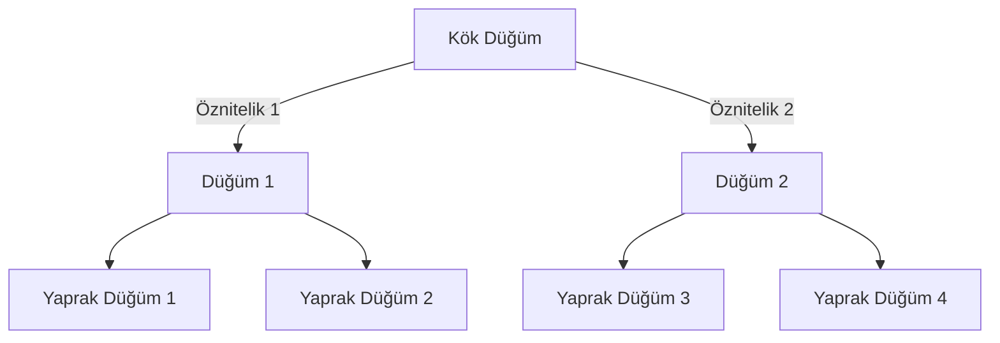

Karar ağaçları, bir durdurma koşulu (stopping condition) karşılanana kadar veriyi seçilen bir özniteliğe göre yinelemeli olarak bölerek çalışır.

### Karar Ağaçlarının Avantajları ve Dezavantajları

**Avantajlar:**

- **Yorumlaması Kolay**: Karar ağaçları, karar verme sürecinin sezgisel bir temsilini sunar.
- **Hem Sayısal hem de Kategorik Verileri İşler**: Karma veri türleriyle çalışabilirler.
- **Öznitelik Ölçeklemesi Gerektirmez**: Lojistik regresyon veya DVM'ler (SVM'ler) gibi algoritmaların aksine, karar ağaçları öznitelik normalizasyonu gerektirmez.
- **Küçük Veri Kümeleriyle İyi Çalışır**: Karar ağaçları sınırlı veriyle bile etkili olabilir.

**Dezavantajlar:**

- **Aşırı Öğrenme (Overfitting)**: Karar ağaçları, örüntüleri eğitim verisine fazla spesifik olarak öğrenme eğilimindedir, bu da genellemenin zayıflamasına yol açar.
- **Gürültülü Veriye Duyarlılık**: Verideki küçük değişiklikler farklı ağaç yapılarına yol açabilir.
- **Hesaplama Karmaşıklığı**: Büyük veri kümeleri için derin bir ağaç eğitmek zaman alıcı ve bellek yoğun olabilir.

**Örnek: Karar Ağacı Kullanarak Meyveleri Sınıflandırma**

Renk, boyut ve doku özelliklerine göre farklı meyve türlerini içeren bir veri kümesi düşünelim. Amacımız, belirli bir meyvenin elma mı yoksa portakal mı olduğunu sınıflandırmaktır.

| Renk   | Boyut | Doku   | Meyve    |
| ------ | ----- | ------ | -------- |
| Kırmızı| Küçük | Pürüzsüz | Elma    |
| Yeşil  | Küçük | Pürüzsüz | Elma    |
| Sarı   | Büyük | Sert    | Portakal |
| Turuncu| Büyük | Sert    | Portakal |

**Karar Ağacı Gösterimi:**

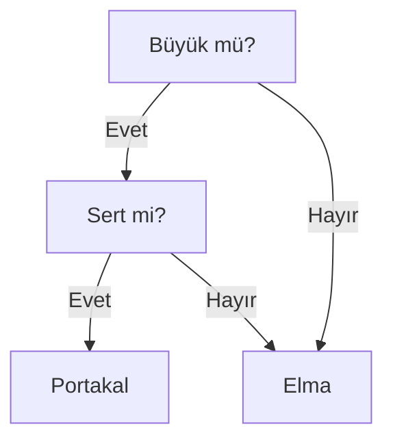

Karar ağacı, yukarıdan aşağıya bir yaklaşım izler:

1. Kök düğüm önce meyvenin **büyük** olup olmadığını kontrol eder.
2. **Evet** ise, dokunun **sert** olup olmadığını kontrol eder.
3. Doku sertse meyveyi **portakal** olarak sınıflandırır; aksi takdirde **elma** olarak sınıflandırır.

Bu örnek, karar ağaçlarının karmaşık karar verme süreçlerini basit ikili kararlara nasıl ayırdığını göstermektedir.

Öğrenme süreci, veri kümesini yinelemeli olarak daha küçük alt kümelere bölmeyi içerir. Bölme kriteri, Gini katsayısı (Gini impurity) veya entropi (entropy) gibi **saflık ölçütlerine (purity measures)** göre seçilir. Her bölme, durdurma koşulu karşılanana kadar alt düğümler oluşturur.

### Durdurma Kriterleri ve Aşırı Öğrenme (Stopping Criteria and Overfitting)

Bir karar ağacı, her yaprak yalnızca bir sınıf içerene kadar büyümeye devam edebilir. Ancak bu genellikle **aşırı öğrenmeye (overfitting)** yol açar; bu durumda model eğitim verisini ezberler ancak yeni verilere genelleme yapamaz. Bunu önlemek için aşağıdaki gibi durdurma kriterleri kullanılabilir:

- Yaprak başına **minimum örnek sayısı**
- **Maksimum ağaç derinliği**
- **Minimum saflık kazancı**

Ek olarak, **budama (pruning)** teknikleri, tahmin değeri düşük dalları kaldırarak aşırı öğrenmeyi azaltmaya yardımcı olur.

**Budama Örneği**

- **Ön Budama (Pre-pruning)**: Ağacın belirli bir derinliğin ötesinde büyümesini durdurma.
- **Sonraki Budama (Post-pruning)**: Ağacın tamamını büyütüp ardından doğrulama performansına göre önemsiz dalları kaldırma.

<br/>
<br/>

---

## Saflığı Ölçme (Measuring Purity)

Karar ağaçlarında "saflık (purity)", belirli bir düğümdeki verinin ne kadar homojen olduğunu ifade eder. Bir düğüm, yalnızca tek bir sınıftan örnekler içeriyorsa saf kabul edilir. Saflığı ölçmek, etkili bir karar ağacı oluşturmak için veri kümesini bölmenin en iyi yolunu belirlemede önemlidir. Saflığı ölçmek için kullanılan en yaygın iki metrik **Entropi (Entropy)** ve **Gini Katsayısı'dır (Gini Impurity)**.

### Entropi (Entropy)

Bilgi teorisinden türetilen entropi, bir veri kümesindeki rastgeleliği veya düzensizliği ölçer. İkili sınıflandırma problemi için entropi denklemi:

$$ H(S) = - p_1 \log_2(p_1) - p_2 \log_2(p_2) $$

Burada:

- $ p_1 $ ve $ p_2 $, $ S $ kümesindeki her bir sınıfın oranlarıdır.

<div style="text-align: center;display:flex; justify-content: center; margin-bottom: 20px; ">
    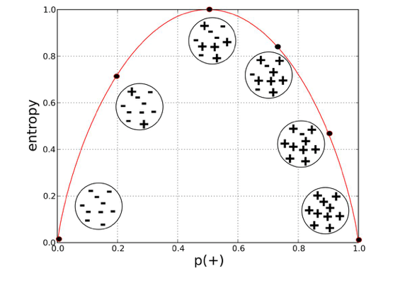
</div>

- **Entropi = 0**: Düğüm saftır (tüm örnekler bir sınıfa aittir).
- **Entropi yüksek**: Düğüm farklı sınıfların bir karışımını içerir, yani daha fazla düzensizlik vardır.
- **Entropi 0,5'te maksimuma ulaşır**: Her iki sınıfın olasılığı eşitse (yani %50-%50), entropi en yüksek seviyededir.

**Örnek Hesaplama:**

Bir düğüm 8 pozitif ve 2 negatif örnek içeriyorsa, entropi şu şekilde hesaplanır:

$$ H(S) = - \left( \frac{8}{10} \log_2 \frac{8}{10} + \frac{2}{10} \log_2 \frac{2}{10} \right) $$

$$ H(s) = 0.7958$$

<br/>

### Gini Katsayısı (Gini Impurity)

Gini katsayısı, kümeden rastgele seçilen bir elemanın, sınıf dağılımına göre rastgele etiketlenmesi durumunda yanlış sınıflandırılma sıklığını ölçer.

Gini katsayısı formülü:

$$
G(S) = 1 - \sum\limits_{i=1}^{C} p_i^2
$$

Burada:

- $ p_i $, veri kümesindeki $ i $ sınıfının olasılığıdır.

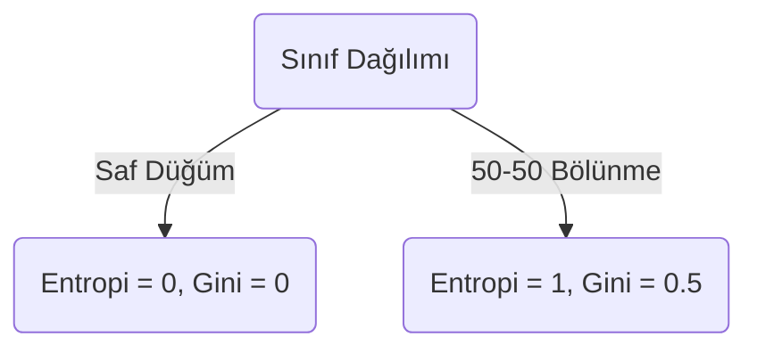

<div style="text-align: center;display:flex; justify-content: center; margin-bottom: 20px; ">
    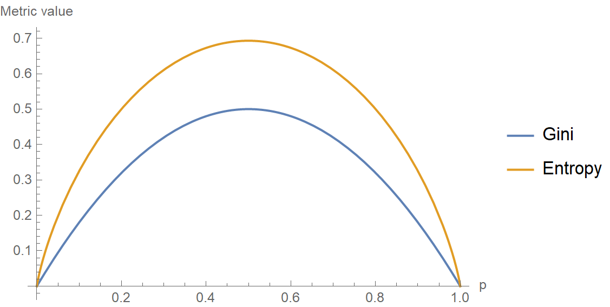
</div>

- **Gini = 0**: Düğüm tamamen saftır.
- **Gini yüksek**: Düğüm sınıfların bir karışımını içerir.

**Örnek Hesaplama:**

Aynı 8 pozitif ve 2 negatif örnekli düğüm için:

$$ G(S) = 1 - \left( \left(\frac{8}{10}\right)^2 + \left(\frac{2}{10}\right)^2 \right) $$

$$ G(S) = 0.32 $$

Her iki metrik de bir karar ağacında bir düğümü bölmenin en iyi yolunu belirlemek için kullanılır, ancak küçük farklılıkları vardır:

- **Entropi**, logaritmik hesaplamalar içerdiğinden hesaplama açısından daha maliyetlidir.
- **Gini katsayısı** hesaplaması daha hızlıdır ve genellikle **CART (Classification and Regression Trees)** gibi karar ağacı uygulamalarında tercih edilir.

Pratikte her ikisi de benzer performans gösterir ve seçim, belirli probleme ve hesaplama kısıtlamalarına bağlıdır.

Bu metrikleri kullanarak düğümlerin safsızlığını ölçebilir ve bir karar ağacı oluştururken mümkün olan en iyi bölünmeleri belirlemek için bunları kullanabiliriz.

<br/>
<br/>

---

## Bölünme Seçimi: Bilgi Kazancı (Information Gain)

Bir karar ağacı oluştururken, en iyi modeli elde etmek için hangi öznitelikte bölünme yapılacağını seçmek kritiktir. Amaç, bir özniteliğin veriyi ne kadar iyi saf alt kümelere ayırdığını ölçen **Bilgi Kazancını (Information Gain)** maksimize etmektir.

<br/>

### Entropiyi Azaltma

Bilgi Kazancı (IG), bir öznitelikte bölünme yaptıktan sonra entropideki azalmadır. Şu şekilde hesaplanır:

$$
IG(S, A) = H(S) - \sum\limits_{v \in \text{Değerler}(A)} \frac{|S_v|}{|S|} H(S_v)
$$

Burada:

- $ H(S) $ orijinal kümenin entropisidir.
- $ S_v $, $ A $ özniteliğinde bölünerek oluşturulan alt kümeleri temsil eder.
- $ \frac{|S_v|}{|S|} $, her bir alt kümedeki örneklerin ağırlıklı oranıdır.

**Örnek Hesaplama**

Aşağıdaki örnekleri içeren bir veri kümesini ele alalım:

<div style="text-align: center;display:flex; justify-content: center; margin-bottom: 20px; ">
    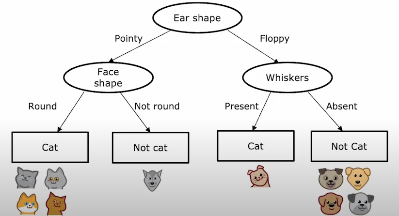
</div>

1. Başlangıç entropisini hesaplayın:

   - 5 `Kedi` etiketi ve 5 `Köpek` etiketi.

    <div style="text-align: center;display:flex; justify-content: center; margin-bottom: 20px; ">
    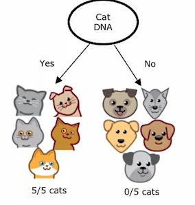
    </div>

   - $ p_1 = \frac{5}{10} $, $ \quad p_2 = \frac{5}{10} $.

   - $ H(S) = - \frac{5}{10} \log_2\frac{5}{10} - \frac{5}{10} \log_2\frac{5}{10} = 1.0 $.

    <br/>

2. **`Kulak Şekli`**'ne göre bölünme sonrası entropiyi hesaplayın:

   - `Sivri` alt kümesi: {Kedi, Kedi, Kedi, Kedi, Köpek}

     - $ H = -\frac{4}{5} \log_2\frac{4}{5} - \frac{1}{5} \log_2\frac{1}{5} \approx 0.72 $

   - `Sarkık` alt kümesi: {Kedi, Köpek, Köpek, Köpek, Köpek}

     - $ H = -\frac{1}{5} \log_2\frac{1}{5} - \frac{4}{5} \log_2\frac{4}{5} \approx 0.72 $

   - $ IG = 1.0 - (5/10)(0.72) - (5/10)(0.72) = 0.28 $

    <br/>

3. **`Yüz Şekli`**'ne göre bölünme sonrası entropiyi hesaplayın:

   - `Yuvarlak` alt kümesi: {Kedi, Kedi, Kedi, Köpek, Köpek, Köpek, Kedi}

     - $ H = -\frac{4}{7} \log_2\frac{4}{7} - \frac{3}{7} \log_2\frac{3}{7} \approx 0.99 $

   - `Yuvarlak Değil` alt kümesi: {Kedi, Köpek, Köpek}

     - $ H = -\frac{1}{3} \log_2\frac{1}{3} - \frac{2}{3} \log_2\frac{2}{3} \approx 0.92 $

   - $ IG = 1.0 - (7/10)(0.99) - (3/10)(0.92) = 0.03 $

     <br/>

4. **`Bıyıklar`**'a göre bölünme sonrası entropiyi hesaplayın:

   - `Var` alt kümesi: {Kedi, Kedi, Kedi, Köpek}

     - $ H = -\frac{3}{4} \log_2\frac{3}{4} - \frac{1}{4} \log_2\frac{1}{4} \approx 0.81 $

   - `Yok` alt kümesi: {Köpek, Köpek, Köpek, Köpek, Kedi, Kedi}

     - $ H = -\frac{4}{6} \log_2\frac{4}{6} - \frac{2}{6} \log_2\frac{2}{6} \approx 0.92 $

   - $ IG = 1.0 - (4/10)(0.81) - (6/10)(0.92) = 0.12 $

<br/>

<div style="text-align: center;display:flex; justify-content: center; margin-bottom: 20px; ">
    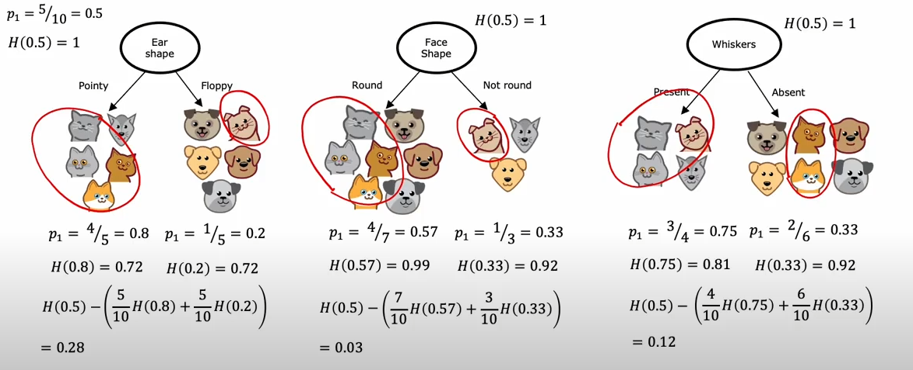
</div>

En yüksek Bilgi Kazancı $0.28$ (Kulak Şekli) olduğundan, bu özniteliklerden birinde bölünme yapmak optimaldir.

<br/>
<br/>

---

<br/>

## Sürekli Öznitelikler için Karar Ağaçları (Decision Trees for Continuous Features)

Sürekli özniteliklerle çalışırken, karar ağaçları kategorik özelliklerde olduğu gibi sonuçları tahmin etmek için etkili bir şekilde kullanılabilir.

<div style="text-align: center;display:flex; justify-content: center; margin-bottom: 20px; ">
    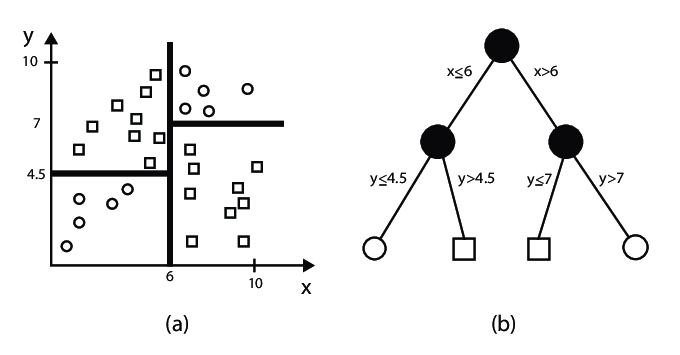
</div>

Temel fark, sürekli öznitelikler için karar ağaçlarının, bölme için kategorik değerler kullanmak yerine, verideki optimal kesme noktalarını (cutoff) veya eşik değerlerini (threshold) belirlemesidir. Bu, algoritmanın sürekli girdi özelliklerine dayalı olarak sürekli hedef değişkenler için tahminler yapmasını sağlar.

Bu örnekte, bir hayvanın **kilosuna** dayanarak **kedi** mi yoksa **köpek** mi olduğunu, sürekli öznitelikleri işleyen bir karar ağacı kullanarak tahmin edeceğiz.

Diyelim ki aşağıdaki hayvan veri kümesine sahibiz ve bir hayvanın kilosuna göre **kedi** mi **köpek** mi olduğunu tahmin etmek istiyoruz:

| Hayvan | Kilo (kg) |
| ------ | ----------- |
| Kedi   | 4.5         |
| Kedi   | 5.1         |
| Kedi   | 4.7         |
| Köpek  | 8.2         |
| Köpek  | 9.0         |
| Kedi   | 5.3         |
| Köpek  | 10.1        |
| Köpek  | 11.4        |
| Köpek  | 12.0        |
| Köpek  | 9.8         |

Burada, bir hayvanın **kedi** mi **köpek** mi olduğunu belirlemek için **Kilo** özniteliğine dayalı bir **karar ağacı** oluşturmayı hedefliyoruz.

<br/>

**Adım 1: Kilo Özniteliği İçin En İyi Bölünmeyi Bulma**

**Kilo** özniteliğine dayalı olası bölünmeleri değerlendireceğiz. Karar ağacı, olası kesme noktalarını dikkate alacak ve her bölünme için kirliliği (impurity) veya varyansı hesaplayacaktır.

Şu bölünmeleri ele alalım:

- **Kilo ≤ 7.0 kg**: `Kedi` olarak ata
- **Kilo > 7.0 kg**: `Köpek` olarak ata

Karar ağacı, olası her bölünme için kirliliği (sınıflandırma için) veya varyansı (regresyon için) hesaplayarak bu bölünmeleri değerlendirecektir.

<br/>

**Adım 2: Bir Karar Ağacı Modeli Eğitme**

En iyi bölünmeyi öğrenmek ve kiloya göre hayvan türünü tahmin etmek için bir karar ağacı kullanabiliriz. Bunu Python'da şu şekilde uygulayabiliriz:

```python
import numpy as np
from sklearn.tree import DecisionTreeClassifier
import pandas as pd

# Veri kümesini oluşturma
data = {
    'Weight': [4.5, 5.1, 4.7, 8.2, 9.0, 5.3, 10.1, 11.4, 12.0, 9.8],
    'Animal': ['Cat', 'Cat', 'Cat', 'Dog', 'Dog', 'Cat', 'Dog', 'Dog', 'Dog', 'Dog']
}
df = pd.DataFrame(data)

# Öznitelikler ve hedef değişkeni ayırma
X = df[['Weight']]  # Öznitelik
y = df['Animal']  # Hedef

# Karar ağacı sınıflandırıcısını eğitme
clf = DecisionTreeClassifier(criterion='gini', max_depth=1)
clf.fit(X, y)

# Hayvan türünü tahmin etme
predictions = clf.predict(X)
print(f'Tahmin Edilen Hayvanlar: {predictions}')
```

<br/>

**Adım 3: Karar Ağacını Görselleştirme**

Karar ağacı, Kilo özniteliğine göre bölünmenin nasıl yapıldığını göstermek için görselleştirilebilir.

```python
from sklearn.tree import plot_tree
import matplotlib.pyplot as plt

plt.figure(figsize=(10,8))
plot_tree(clf, feature_names=['Weight'], class_names=['Cat', 'Dog'], filled=True)
plt.show()
```

<br/>

**Adım 4: Sonuçları Yorumlama**

Ortaya çıkan karar ağacı, Kilo özniteliğinin bir eşik değerde (ör. $7.0$ kg) bölündüğü bir kök düğüme sahip olacaktır. Hayvanın kilosu $7.0$ kg'dan küçük veya eşitse `Kedi` olarak sınıflandırılır; aksi takdirde `Köpek` olarak sınıflandırılır.

<br/>
<br/>

---

## Regresyon Ağaçları (Regression Trees)

Regresyon ağaçları, hedef değişkenin kategorik değil sürekli olduğu durumlarda kullanılır. Kesikli etiketler tahmin eden sınıflandırma ağaçlarının aksine, regresyon ağaçları veriyi yinelemeli olarak bölerek ve her yaprak düğümüne bir ortalama değer atayarak sayısal değerler tahmin eder.

**Regresyon Ağaçları Nasıl Çalışır**

<div style="text-align: center;display:flex; justify-content: center; margin-bottom: 20px; ">
    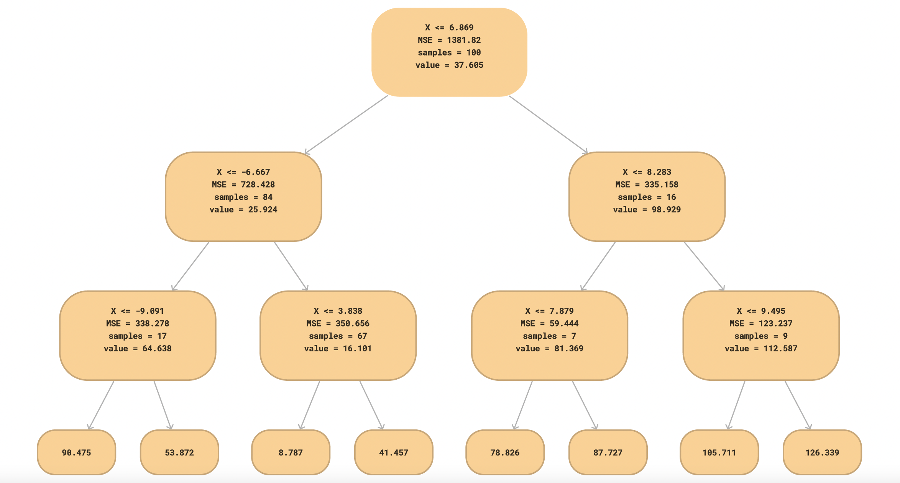
</div>

1. **Veriyi Bölme:** Algoritma, varyansı minimize ederek veriyi bölmek için en iyi özniteliği ve eşik değerini bulur.
2. **Yapraklara Değer Atama:** Sınıf etiketleri yerine, yaprak düğümler o bölgedeki hedef değerlerin ortalamasını saklar.
3. **Tahmin:** Yeni bir örnek verildiğinde, öznitelik değerlerine göre ağacı dolaşın ve ilgili yaprak düğümünden ortalama değeri döndürün.

**Örnek: Hayvan Ağırlıklarını Tahmin Etme**

Veri kümemizi yeni bir öznitelik ekleyerek genişletiyoruz: **Kilo**. Veri kümemiz 10 hayvandan oluşmakta olup aşağıdaki özniteliklere sahiptir:

- **Kulak Şekli:** (Sivri, Sarkık)
- **Yüz Şekli:** (Yuvarlak, Yuvarlak Değil)
- **Bıyıklar:** (Var, Yok)
- **Kilo (kg):** Sürekli hedef değişken

<br/>

| Kulak Şekli | Yüz Şekli    | Bıyıklar | Hayvan | Kilo (kg) |
| ----------- | ------------ | -------- | ------ | ----------- |
| Sivri       | Yuvarlak     | Var      | Kedi   | 4.5         |
| Sivri       | Yuvarlak     | Var      | Kedi   | 5.1         |
| Sivri       | Yuvarlak     | Yok      | Kedi   | 4.7         |
| Sivri       | Yuvarlak Değil | Var    | Köpek  | 8.2         |
| Sivri       | Yuvarlak Değil | Yok    | Köpek  | 9.0         |
| Sarkık      | Yuvarlak     | Var      | Kedi   | 5.3         |
| Sarkık      | Yuvarlak     | Yok      | Köpek  | 10.1        |
| Sarkık      | Yuvarlak Değil | Var    | Köpek  | 11.4        |
| Sarkık      | Yuvarlak Değil | Yok    | Köpek  | 12.0        |
| Sarkık      | Yuvarlak     | Yok      | Köpek  | 9.8         |

<br/>

**Regresyon Ağacı Oluşturma**

En iyi bölünmeyi belirlemek için **Ortalama Kare Hatası (MSE - Mean Squared Error)** kullanırız. En düşük MSE'yi veren bölünme seçilir.

<br/>

**Adım 1: Başlangıç MSE'sini Hesaplama**

Genel ortalama kilo:

$$ \bar{y} = \frac{4.5 + 5.1 + 4.7 + 8.2 + 9.0 + 5.3 + 10.1 + 11.4 + 12.0 + 9.8}{10} = 7.61 $$

Bölünme öncesi MSE:
$$ MSE = \frac{1}{10} \sum (y_i - \bar{y})^2 \approx 6.84 $$

<br/>

**Adım 2: En İyi Bölünmeyi Bulma**

Öznitelik değerlerine göre bölünmeleri değerlendiriyoruz:

- **Kulak Şekli'ne göre bölünme:**

  - Sivri: ${(4.5, 5.1, 4.7, 8.2, 9.0)}$ → Ortalama = $6.3$
  - Sarkık: ${(5.3, 10.1, 11.4, 12.0, 9.8)}$ → Ortalama = $9.72$
  - MSE = $3.2$ (başlangıç MSE'sinden daha iyi)

- **Yüz Şekli'ne göre bölünme:**

  - Yuvarlak: ${(4.5, 5.1, 4.7, 5.3, 10.1, 9.8)}$ → Ortalama = $6.58$
  - Yuvarlak Değil: ${(8.2, 9.0, 11.4, 12.0)}$ → Ortalama = $10.15$
  - MSE = $2.9$ (daha da iyi)

- **Bıyıklar'a göre bölünme:**
  - Var: ${(4.5, 5.1, 8.2, 5.3, 11.4)}$ → Ortalama = $6.9$
  - Yok: ${(4.7, 9.0, 10.1, 12.0, 9.8)}$ → Ortalama = $9.12$
  - MSE = $3.1$ (başlangıçtan iyi ancak Yüz Şekli'nden kötü)

Bu nedenle, ilk bölünme olarak **Yüz Şekli** seçilir.

**Python'da Uygulama**

```python
import numpy as np
from sklearn.tree import DecisionTreeRegressor
import pandas as pd

# Veri kümesini oluşturma
data = {
    'Ear_Shape': [0, 0, 0, 0, 0, 1, 1, 1, 1, 1],  # 0: Sivri, 1: Sarkık
    'Face_Shape': [0, 0, 0, 1, 1, 0, 0, 1, 1, 0],  # 0: Yuvarlak, 1: Yuvarlak Değil
    'Whiskers': [0, 0, 1, 0, 1, 0, 1, 1, 0, 0],  # 0: Var, 1: Yok
    'Weight': [4.5, 5.1, 4.7, 8.2, 9.0, 5.3, 10.1, 11.4, 12.0, 9.8]
}
df = pd.DataFrame(data)

# Öznitelikler ve hedef değişkeni ayırma
X = df[['Ear_Shape', 'Face_Shape', 'Whiskers']]
y = df['Weight']

# Regresyon ağacını eğitme
regressor = DecisionTreeRegressor(criterion='squared_error', max_depth=2)
regressor.fit(X, y)

# Ağırlıkları tahmin etme
predictions = regressor.predict(X)
print(f'Tahmin Edilen Ağırlıklar: {predictions}')
```

Bu regresyon ağacı, öznitelik değerlerine dayalı olarak hayvan ağırlıkları için tahminler sağlar.

<br/>
<br/>

---

## Birden Fazla Karar Ağacı Kullanma (Using Multiple Decision Trees)

Tek bir karar ağacı kullanmak, özellikle veri kümesinde gürültü varsa, bazen aşırı öğrenmeye veya kararsızlığa yol açabilir. Birden fazla karar ağacını birlikte kullanarak model performansını ve sağlamlığını iyileştirebiliriz. Bunu başarmak için iki ana teknik **Torbalama (Bagging)** ve **Güçlendirme'dir (Boosting)**.

<br/>

### Torbalama (Bagging - Bootstrap Aggregating)

Torbalama, veri kümesinin farklı rastgele alt kümeleri üzerinde birden fazla karar ağacı eğiterek ve ardından tahminlerini ortalamasını alarak varyansı azaltır. Torbalama'nın en bilinen örneği **Rastgele Orman algoritmasıdır (Random Forest algorithm)**.

**Torbalama'da Temel Adımlar:**

1. Eğitim verisinden (yerine koyarak) **rastgele alt kümeler** çekin.
2. Her alt küme üzerinde bir karar ağacı eğitin.
3. Tahminleri çoğunluk oylaması (sınıflandırma için) veya ortalama alma (regresyon için) kullanarak birleştirin.

**Torbalama Görselleştirmesi:**

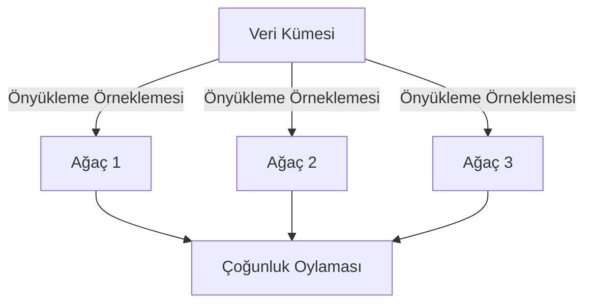

<br/>

#### Yerine Koyarak Örnekleme (Sampling with Replacement)

Yerine koyarak örnekleme, her veri noktasının yeni bir örneklemde birden çok kez seçilme olasılığının eşit olduğu bir tekniktir. Bu yöntem, orijinal veri kümesinden birden çok eğitim veri kümesi oluşturmak, sağlam model eğitimi ve varyans azaltma sağlamak için **Torbalama'da (Bootstrap Aggregating - Bagging)** yaygın olarak kullanılır.

- **Neden Yerine Koyarak Örnekleme Kullanılır?**
  - Model varyansını azaltmaya yardımcı olur.
  - Orijinal veri kümesinden birden çok çeşitli veri kümesi oluşturur.
  - Birden çok modelin ortalamasını alarak aşırı öğrenmeyi önler.

<br/>

**Önyükleme Örnekleme Süreci**

1. $ N $ boyutunda bir veri kümesi verildiğinde, $ N $ örneği **yerine koyarak** rastgele seçerek yeni bir veri kümesi oluşturun.
2. Bazı orijinal örnekler birden çok kez görünebilirken, bazıları hiç görünmeyebilir.
3. Bu örneklenmiş veri kümeleri üzerinde birden çok model eğitin ve tahminleri birleştirin.

Beş örnekli $ A, B, C, D, E $ veri kümesini düşünelim:

<br/>

| Orijinal Veri | Önyükleme Örneği 1 | Önyükleme Örneği 2 |
| ------------- | ------------------ | ------------------ |
| A             | B                  | A                  |
| B             | A                  | C                  |
| C             | C                  | A                  |
| D             | D                  | B                  |
| E             | A                  | E                  |

Her önyükleme örneğinde bazı örneklerin birden çok kez göründüğünü, bazılarının ise eksik olduğunu fark edin.

<br/>
<br/>

#### Rastgele Orman Algoritması (Random Forest Algorithm)

<div style="text-align: center;display:flex; justify-content: center; margin-bottom: 20px; ">
    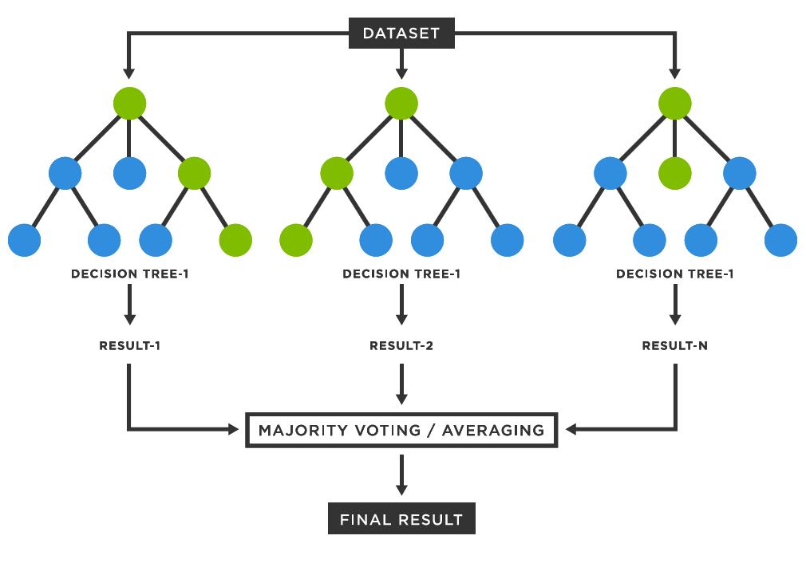
</div>

Rastgele Orman, birden çok karar ağacı oluşturan ve daha iyi performans elde etmek için bunları birleştiren bir topluluk öğrenme (ensemble learning) yöntemidir. Aşırı öğrenmeyi azaltmaya ve doğruluğu artırmaya yardımcı olan **torbalama (bagging)** kavramına dayanır.

<br/>

**Rastgele Orman Nasıl Çalışır**

1. **Önyükleme Örneklemesi:** Eğitim verisinin alt kümelerini rastgele seçin (yerine koyarak).
2. **Karar Ağaçları:** Farklı alt kümeler üzerinde birden çok karar ağacı eğitin.
3. **Öznitelik Rastgeleliği:** Her bölünmede, çeşitlilik sağlamak için özniteliklerin yalnızca rastgele bir alt kümesi dikkate alınır.
4. **Birleştirme:**
   - Sınıflandırma için tüm ağaçlar arasında çoğunluk oylaması yapılır.
   - Regresyon için tüm ağaçların tahminlerinin ortalaması alınır.

$$
Tahmin_{RF} = \frac{1}{N} \sum_{i=1}^{N} Ağaç_i(x)
$$

Burada $ N $ ağaç sayısı ve $ Ağaç_i(x) $, $ i^{inci} $ ağacın tahminidir.

**Temel Hiperparametreler**

| Hiperparametre        | Açıklama                                    |
| --------------------- | ------------------------------------------- |
| `n_estimators`        | Ormandaki karar ağacı sayısı                |
| `max_depth`           | Her ağacın maksimum derinliği               |
| `max_features`        | Bölünme için dikkate alınan öznitelik sayısı|
| `min_samples_split`   | Bir düğümü bölmek için gereken minimum örnek|
| `min_samples_leaf`    | Bir yaprak düğümde gereken minimum örnek    |

**Karar Ağacı vs. Rastgele Orman**

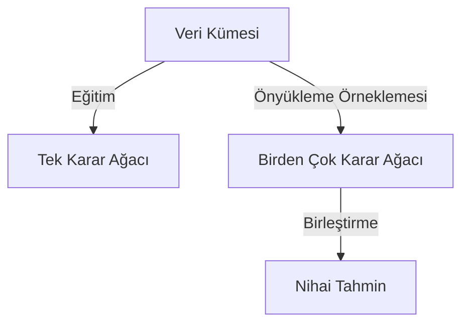

**Telco Müşteri Kaybı Veri Kümesi Üzerinde Rastgele Orman Örneği**

```python
import pandas as pd
import numpy as np
from sklearn.model_selection import train_test_split
from sklearn.ensemble import RandomForestClassifier
from sklearn.metrics import accuracy_score, classification_report

# Veri kümesini yükleme
df = pd.read_csv('Telco-Customer-Churn.csv')

# Ön işleme
df = df.drop(columns=['customerID'])  # İlgisiz sütunu kaldır
df = pd.get_dummies(df, drop_first=True)  # Kategorik değişkenleri dönüştür

# Veriyi bölme
X = df.drop(columns=['Churn_Yes'])
y = df['Churn_Yes']
X_train, X_test, y_train, y_test = train_test_split(X, y, test_size=0.2, random_state=42)

# Rastgele Orman modelini eğitme
rf = RandomForestClassifier(n_estimators=100, max_depth=10, random_state=42)
rf.fit(X_train, y_train)

# Tahminler
y_pred = rf.predict(X_test)

# Değerlendirme
print("Doğruluk:", accuracy_score(y_test, y_pred))
print(classification_report(y_test, y_pred))
```

**Rastgele Orman Ne Zaman Kullanılır**

- Minimum ayarla yüksek doğruluk gerektiğinde.
- Büyük öznitelik uzaylarıyla çalışırken.
- Öznitelik önemi (feature importance) önemli olduğunda.
- Karar ağaçlarına kıyasla aşırı öğrenmeyi azaltmak istediğinizde.

Rastgele Orman, çeşitli veri kümelerinde iyi performans gösteren güçlü ve esnek bir modeldir. Ancak, büyük veri kümeleri için hesaplama açısından maliyetli olabilir.

<br/>
<br/>

### Güçlendirme (Boosting)

Güçlendirme, ağaçları sırayla oluşturan ve her ağacın bir öncekinin hatalarını düzeltmeye çalıştığı başka bir topluluk yöntemidir. Zor örneklere daha yüksek ağırlıklar atayarak onlara odaklanır.

En popüler güçlendirme yöntemi **XGBoost'tur (Extreme Gradient Boosting)**.

**Güçlendirme'de Temel Adımlar:**

1. Eğitim verisi üzerinde zayıf bir model eğitin.
2. Yanlış sınıflandırılan örnekleri belirleyin ve onlara daha yüksek ağırlıklar atayın.
3. Bu zor durumlara odaklanarak bir sonraki modeli eğitin.
4. Bir durdurma kriteri karşılanana kadar tekrarlayın.

**Güçlendirme Görselleştirmesi:**

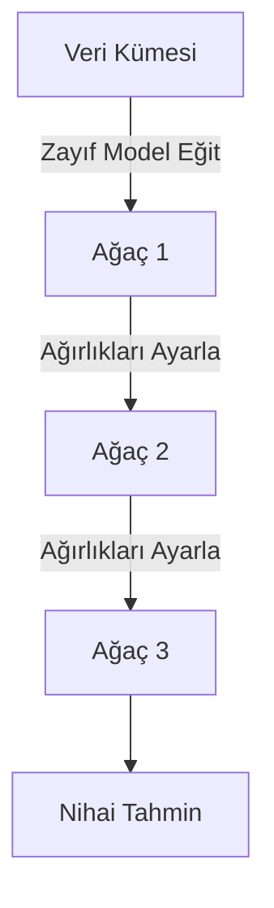

<br/>

#### XGBoost

XGBoost (Extreme Gradient Boosting), yüksek performansı ve ölçeklenebilirliği nedeniyle makine öğrenimi yarışmalarında ve gerçek dünya uygulamalarında yaygın olarak kullanılan, gradyan güçlendirmenin güçlü ve verimli bir uygulamasıdır.

<div style="text-align: center;display:flex; justify-content: center; margin-bottom: 20px; ">
    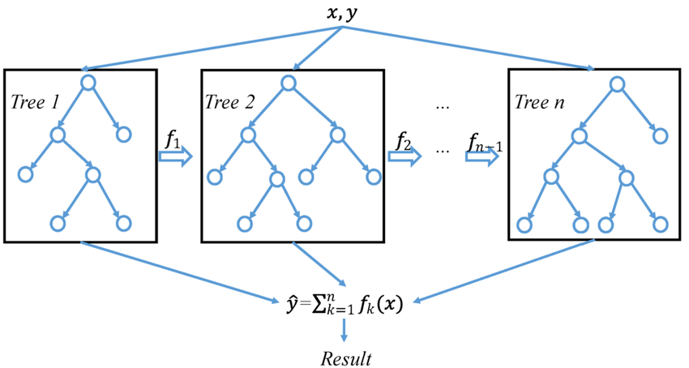
</div>

XGBoost, her ağacın bir öncekinin hatalarını düzelttiği sıralı karar ağaçlarından oluşan bir topluluk oluşturur. Algoritma, gradyan inişi (gradient descent) kullanarak bir kayıp fonksiyonunu (loss function) optimize eder ve hataları etkili bir şekilde en aza indirmesini sağlar.

**XGBoost'un Temel Bileşenleri:**

1. **Gradyan Güçlendirme Çerçevesi:** Zayıf öğrenicileri yinelemeli olarak iyileştirmek için güçlendirme kullanır.
2. **Düzenlileştirme (Regularization):** Aşırı öğrenmeyi azaltmak için L1 ve L2 düzenlileştirmesi içerir.
3. **Paralelleştirme:** Paralel hesaplama kullanarak hızlı eğitim için optimize edilmiştir.
4. **Eksik Değerleri İşleme:** Eksik veriler için otomatik olarak optimal bölünmeler bulur.
5. **Ağaç Budama:** Verimlilik için ağırlık budaması yerine derinlik bazlı budama kullanır.
6. **Özel Amaç Fonksiyonları:** Özel kayıp fonksiyonları tanımlamaya izin verir.

XGBoost aşağıdaki amaç fonksiyonunu (objective function) optimize eder:

$$ J(\theta) = \sum L(y_i, \hat{y}_i) + \sum \Omega(T_k) $$

Burada:

- $ L(y_i, \hat{y}_i) $ kayıp fonksiyonudur (ör. regresyon için kare hatası, sınıflandırma için log kaybı).
- $ \Omega(T_k) $, model karmaşıklığını kontrol eden düzenlileştirme terimidir.
- $ T_k $ bireysel ağaçları temsil eder.

**Telco Müşteri Kaybı Veri Kümesi Üzerinde XGBoost Uygulaması**

Müşteri kaybını tahmin etmek için bir XGBoost modeli eğiteceğiz.

<br/>

**Adım 1: Veri kümesini yükleme**

```python
import pandas as pd
from xgboost import XGBClassifier
from sklearn.model_selection import train_test_split
from sklearn.metrics import accuracy_score

# Veri kümesini yükleme
df = pd.read_csv("Telco-Customer-Churn.csv")

# Veriyi ön işleme
df = df.dropna()
df = pd.get_dummies(df, drop_first=True)

X = df.drop("Churn_Yes", axis=1)
y = df["Churn_Yes"]

# Veriyi bölme
X_train, X_test, y_train, y_test = train_test_split(X, y, test_size=0.2, random_state=42)
```

<br/>

**Adım 2: XGBoost Modelini Eğitme**

```python
xgb_model = XGBClassifier(n_estimators=100, learning_rate=0.1, max_depth=4, reg_lambda=1, use_label_encoder=False, eval_metric='logloss')
xgb_model.fit(X_train, y_train)
```

<br/>

**Adım 3: Modeli Değerlendirme**

```python
y_pred = xgb_model.predict(X_test)
accuracy = accuracy_score(y_test, y_pred)
print(f"Doğruluk: {accuracy:.4f}")
```

<br/>

**Hiperparametre Ayarlama**

XGBoost'taki temel hiperparametreler:

<br/>

| Hiperparametre      | Açıklama                                     |
| ------------------- | -------------------------------------------- |
| `n_estimators`      | Modeldeki ağaç sayısı.                       |
| `learning_rate`     | Ağırlıkları güncellemek için adım boyutu.    |
| `max_depth`         | Ağaçların maksimum derinliği.                |
| `subsample`         | Ağaç başına kullanılan örneklerin oranı.     |
| `colsample_bytree`  | Ağaç başına kullanılan özniteliklerin oranı. |
| `gamma`             | Bölünme için gereken minimum kayıp azalması. |

**XGBoost Ne Zaman Kullanılır**

- Yapılandırılmış/tablosal verileriniz olduğunda.
- Yüksek doğruluk gerektiğinde.
- Eksik değerleri verimli bir şekilde işleyen bir modele ihtiyacınız olduğunda.
- Öznitelik etkileşimleri önemli olduğunda.

XGBoost, tahmine dayalı modelleme için en güçlü algoritmalardan biridir. Yapılandırılmış verileri işleme, düzenlileştirme ve paralel işlemedeki güçlü yönlerinden yararlanarak, birçok gerçek dünya uygulamasında geleneksel makine öğrenimi yöntemlerinden önemli ölçüde daha iyi performans gösterebilir.

<br/>

#### XGBoost vs Rastgele Orman

| Özellik                        | XGBoost                       | Rastgele Orman                |
| ------------------------------ | ----------------------------- | ----------------------------- |
| Eğitim Hızı                    | Daha Hızlı (paralelleştirilmiş) | Daha Yavaş                  |
| Aşırı Öğrenme Kontrolü         | Daha Güçlü (Düzenlileştirme)  | Orta                          |
| Yapılandırılmış Verilerde Performans | Yüksek                   | İyi                           |
| Eksik Verileri İşleme          | Evet                          | Hayır                         |
