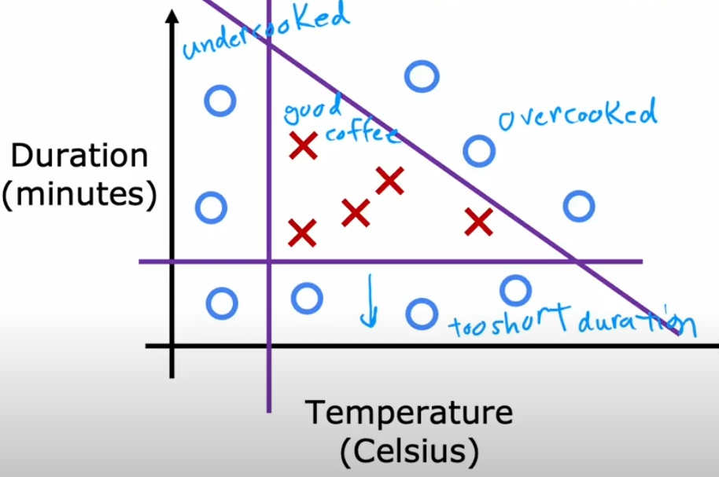
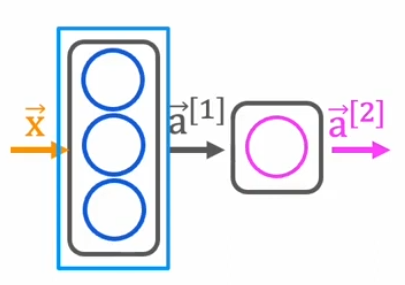
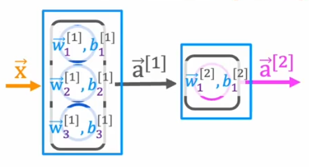
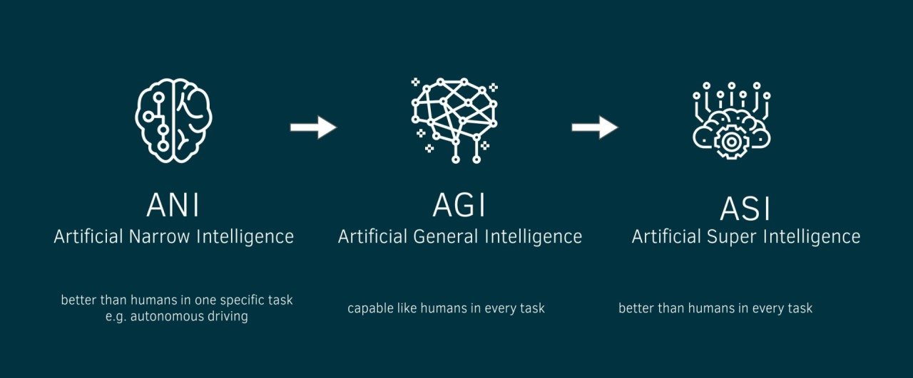

# İleri Yayılımın Uygulanması (Implementation of Forward Propagation)

<!-- toc -->

## Kahve Kavurma Örneği (Sınıflandırma Görevi)

Kahveyi iki faktöre göre "İyi" veya "Kötü" olarak sınıflandırmak istediğimizi düşünelim:

- **Sıcaklık (Temperature)** (°C)
- **Kavurma Süresi (Roasting Time)** (dakika)

Basitlik açısından şöyle tanımlayalım:

- **İyi kahve:** Sıcaklık 190°C ile 210°C arasındaysa ve kavurma süresi 10 ile 15 dakika arasındaysa.
- **Kötü kahve:** Diğer tüm durumlar.

<div style="text-align: center;display:flex; justify-content: center; margin-bottom: 20px; ">
    
</div>

Aşağıdaki verileri topluyoruz:

| Sıcaklık (°C) | Kavurma Süresi (dakika) | Kalite (1 = İyi, 0 = Kötü) |
| ------------- | ----------------------- | --------------------------- |
| 200           | 12                      | 1                           |
| 180           | 10                      | 0                           |
| 210           | 15                      | 1                           |
| 220           | 20                      | 0                           |
| 195           | 13                      | 1                           |

Yeni kahve örneklerini sınıflandırmak için TensorFlow kullanarak basit bir sinir ağı (neural network) uygulayacağız.

## Sinir Ağı Mimarisi (Neural Network Architecture)

Aşağıdaki yapıyı kullanarak bir sinir ağı oluşturuyoruz:

<div style="text-align: center;display:flex; justify-content: center; margin-bottom: 20px; ">
    
</div>

- **Giriş Katmanı (Input Layer)**: İki nöron (sıcaklık, süre)
- **Gizli Katman (Hidden Layer)**: Üç nöron, **sigmoid (sigmoid)** fonksiyonu ile aktive edilir
- **Çıktı Katmanı (Output Layer)**: Bir nöron, **sigmoid** fonksiyonu ile aktive edilir (ikili sınıflandırma - binary classification)

## TensorFlow ile Uygulama (TensorFlow Implementation)

### Adım 1: Kütüphaneleri İçe Aktarma

```python
import tensorflow as tf
import numpy as np
```

- `tensorflow`, sinir ağlarını tanımlamamızı ve eğitmemizi sağlayan temel derin öğrenme (deep learning) kütüphanesidir.
- `numpy`, dizileri ve sayısal işlemleri verimli bir şekilde yönetmek için kullanılır.

### Adım 2: Giriş ve Çıkışları Tanımlama

```python
X = np.array([[200, 12], [180, 10], [210, 15], [220, 20], [195, 13]], dtype=np.float32)
y = np.array([[1], [0], [1], [0], [1]], dtype=np.float32)
```

- `X`, giriş özelliklerini (sıcaklık ve kavurma süresi) bir NumPy dizisi olarak temsil eder.
- `y`, beklenen çıktıyı (iyi kahve için 1, kötü kahve için 0) temsil eder.
- `dtype=np.float32`, sayısal kararlılığı ve TensorFlow ile uyumluluğu sağlar.

### Adım 3: Modeli Oluşturma

```python
model = tf.keras.Sequential([
    tf.keras.layers.Dense(3, activation='sigmoid', input_shape=(2,)),
    tf.keras.layers.Dense(1, activation='sigmoid')
])
```

- `Sequential()` doğrusal bir katman yığını oluşturur.
- `Dense(3, activation='sigmoid', input_shape=(2,))` gizli katmanı tanımlar:
  - 3 nöron
  - Sigmoid aktivasyon fonksiyonu (activation function)
  - İki giriş özelliğimiz olduğu için (2,) şeklinde giriş boyutu.
- `Dense(1, activation='sigmoid')`, 1 nöron ve sigmoid aktivasyonu ile çıktı katmanını tanımlar.

### Adım 4: Modeli Eğitme

```python
model.compile(optimizer='adam', loss='binary_crossentropy', metrics=['accuracy'])
model.fit(X, y, epochs=500, verbose=0)
```

- `compile()` modeli eğitim için yapılandırır:
  - `adam` optimizasyon algoritması (optimizer) öğrenme hızını otomatik olarak uyarlar.
  - `binary_crossentropy` ikili sınıflandırma problemleri için kullanılan kayıp (loss) fonksiyonudur.
  - `accuracy` metriği, modelin kahve örneklerini ne kadar iyi sınıflandırdığını takip eder.
- `fit(X, y, epochs=500, verbose=0)` modeli 500 epoch (dönem) boyunca eğitir.

### Adım 5: Tahmin Yapma

```python
new_coffee = np.array([[205, 14]], dtype=np.float32)
prediction = model.predict(new_coffee)
print("Prediction (Probability of Good Coffee):", prediction)
```

- `new_coffee`, sınıflandırılacak yeni bir örnek (205°C, 14 dk) içerir.
- `model.predict(new_coffee)` kahvenin iyi olma olasılığını hesaplar.
- Çıktı bir olasılık değeridir (1'e yakın = iyi, 0'a yakın = kötü).

## Adım Adım İleri Yayılım (NumPy ile Uygulama)

Şimdi TensorFlow'un perde arkasında nasıl çalıştığını anlamak için **NumPy** kullanarak ileri yayılımı (forward propagation) manuel olarak uyguluyoruz.

### Ağırlıklar ve Bias Değerlerini Başlatma

<div style="text-align: center;display:flex; justify-content: center; margin-bottom: 20px; ">
    
</div>

```python
np.random.seed(42)  # Tekrarlanabilirlik için
W1 = np.random.randn(2, 4)  # Gizli katman ağırlıkları (2 giriş -> 4 nöron)
b1 = np.random.randn(4)     # Gizli katman bias değeri
W2 = np.random.randn(4, 1)  # Çıktı katmanı ağırlıkları (4 nöron -> 1 çıktı)
b2 = np.random.randn(1)     # Çıktı katmanı bias değeri
```

- `np.random.randn()` ağırlıkları (weights) ve bias değerlerini (biases) normal dağılımdan rastgele başlatır.
- `W1` ve `b1` gizli katman parametrelerini tanımlar.
- `W2` ve `b2` çıktı katmanı parametrelerini tanımlar.

### İleri Yayılım Hesaplaması

```python
def sigmoid(z):
    return 1 / (1 + np.exp(-z))
```

- Bu fonksiyon, 0 ile 1 arasında değerler üreten **sigmoid aktivasyon fonksiyonunu** uygular.

```python
def forward_propagation(X):
    Z1 = np.dot(X, W1) + b1  # Doğrusal dönüşüm (Gizli Katman)
    A1 = sigmoid(Z1)  # Aktivasyon fonksiyonu (Gizli Katman)
    Z2 = np.dot(A1, W2) + b2  # Doğrusal dönüşüm (Çıktı Katmanı)
    A2 = sigmoid(Z2)  # Aktivasyon fonksiyonu (Çıktı Katmanı)
    return A2
```

- `np.dot(X, W1) + b1` gizli katman için girişlerin ağırlıklı toplamını hesaplar.
- `sigmoid(Z1)` doğrusal olmama (non-linearity) katmak için aktivasyon fonksiyonunu uygular.
- `np.dot(A1, W2) + b2` gizli katman çıktılarının ağırlıklı toplamını hesaplar.
- `sigmoid(Z2)` nihai tahmini üretir.

```python
# Örnek bir giriş ile test etme
output = forward_propagation(np.array([[185, 10]]))
print(output)
```

Bu, TensorFlow'un ileri yayılımını **salt NumPy** kullanarak manuel olarak tekrarlar.

<br/>

---

## Yapay Genel Zeka (Artificial General Intelligence - AGI)

AGI, bir insanın yapabileceği her türlü entelektüel görevi yerine getirebilen yapay zekayı ifade eder. Mevcut yapay zeka sistemlerinin aksine, AGI göreve özgü eğitime ihtiyaç duymadan **uyum sağlar, öğrenir ve geneller** (generalize).

<div style="text-align: center;display:flex; justify-content: center; margin-bottom: 20px; ">
    
</div>

### Günlük Hayattan Örnek: AGI ve Dar Yapay Zeka (Narrow AI)

- **Dar Yapay Zeka (Mevcut Yapay Zeka)**: Bir **satranç oynayan yapay zeka** dünya şampiyonlarını yenebilir ancak **araba kullanamaz**.
- **AGI**: Eğer bir satranç oynayan yapay zeka gerçekten zeki olsaydı, açıkça programlanmaya gerek kalmadan tıpkı bir insan gibi **araba kullanmayı öğrenebilirdi**.

### AGI'nin Temel Zorlukları

1. **Transfer Öğrenme (Transfer Learning)**: Mevcut yapay zeka büyük miktarda veriye ihtiyaç duyar. İnsanlar **az sayıda örnekle** öğrenir.
2. **Sağduyu ile Muhakeme (Common Sense Reasoning)**: Yapay zeka, "Bir bardağı düşürürsem kırılır" gibi basit mantıkta zorlanır.
3. **Kendi Kendine Öğrenme (Self-Learning)**: AGI, insan müdahalesine ihtiyaç duymadan kendini geliştirebilmelidir.

### AGI Mümkün mü?

- Bazı bilim insanları AGI'nin onlarca yıl uzakta olduğuna inanırken, diğerleri bunun asla gerçekleşmeyebileceğini savunuyor.
- **Beyinden ilham alan mimariler (Sinir Ağları gibi)**, AGI'ye giden yolda bir basamak olabilir.

<br/>
<br/>
