# Model Değerlendirme, Seçim ve İyileştirme

<!-- toc -->

## Bir Modeli Değerlendirme

**Metrik (metric)**, bir modelin belirli bir veri kümesi üzerindeki performansını değerlendirmek için kullanılan sayısal bir ölçüttür. Metrikler, modelin tahminleri ne kadar iyi yaptığını ve istenen hedefleri karşılayıp karşılamadığını ölçmemize yardımcı olur. Metrik seçimi, problemin doğasına bağlıdır:

- **Sınıflandırma (classification)** görevlerinde, modelin etiketleri ne kadar doğru atadığını ölçeriz.
- **Regresyon (regression)** görevlerinde, modelin tahminlerinin gerçek değerlere ne kadar yakın olduğunu değerlendiririz.
- **Diğer alanlarda** (doğal dil işleme - NLP veya bilgisayarlı görü - computer vision gibi) uzmanlaşmış metrikler kullanılır.

Bununla birlikte, yüksek bir metrik değeri her zaman modelin gerçekten etkili olduğu anlamına gelmez. Örneğin:

- **Dengesiz bir veri kümesinde (imbalanced dataset)** doğruluk (accuracy) yanıltıcı olabilir. Çoğunluk sınıfını %100 oranında tahmin eden bir model yüksek doğruluğa sahip olabilir ancak genel olarak zayıf performans gösterir.
- Düşük ortalama karesel hataya (MSE) sahip bir regresyon modeli, kritik durumlarda büyük hatalar yapıyorsa gerçek dünya uygulamalarında yine de başarısız olabilir.

### Model Değerlendirmede Temel Metrikler

**Sınıflandırma Metrikleri**

- **Doğruluk (Accuracy):** Doğru tahmin edilen örneklerin yüzdesini ölçer.
- **Kesinlik (Precision):** Pozitif olarak tahmin edilenler arasında gerçekten doğru olanların oranı.
- **Duyarlılık (Recall):** Gerçek pozitiflerin ne kadarının doğru şekilde tespit edildiğini gösterir.
- **F1-skoru (F1-score):** Kesinlik ve duyarlılığın harmonik ortalamasıdır; dengesiz veri kümeleri için kullanışlıdır.
- **ROC-AUC (Alıcı İşletim Karakteristiği - Eğri Altındaki Alan):** Modelin sınıfları birbirinden ayırt etme yeteneğini değerlendirir.

**Regresyon Metrikleri**

- **Ortalama Karesel Hata (Mean Squared Error - MSE):** Tahmin edilen değerlerle gerçek değerler arasındaki ortalama karesel farkı ölçer.
- **Ortalama Mutlak Hata (Mean Absolute Error - MAE):** Ortalama mutlak farkı ölçer.
- **R-kare (R-squared - R²):** Modelin verideki varyansı ne kadar açıkladığını gösterir.

**Diğer Metrikler**

- **Log loss:** Olasılıksal sınıflandırma modelleri için kullanılır.
- **BLEU skoru:** NLP görevlerinde benzerliği ölçer.
- **Kesişim Birleşim Oranı (Intersection over Union - IoU):** Nesne tespitinde, tahmin edilen ve gerçek sınırlayıcı kutular arasındaki örtüşmeyi ölçmek için kullanılır.

### Doğru Metriği Seçme

Bir spam sınıflandırıcısı oluşturduğumuzu varsayalım. E-postaların %99'u spam değilse, tüm e-postalar için "spam değil" tahmini yapan basit bir model %99 doğruluğa sahip olur ancak tamamen işe yaramaz. Bu durumda, **kesinlik ve duyarlılık** daha anlamlı metriklerdir çünkü modelin çok fazla yanlış pozitif (false positive) üretmeden gerçek spam e-postalarını ne kadar iyi tespit ettiğini gösterirler.

Bu nedenle, doğru metriği seçmek, yüksek bir skor elde etmek kadar önemlidir. İyi performans gösteren bir model, görevin gerçek dünyadaki hedefiyle uyumlu olandır.

<br/>
<br/>

---

## Model Seçimi ve Eğitim/Doğrulama/Test Kümeleri

Doğru modeli seçmek, görülmemiş verilerde yüksek performans elde etmek için çok önemlidir. Eğitim verilerinde iyi performans gösteren ancak yeni verilerde kötü performans gösteren bir model aşırı öğrenme (overfitting) yapıyordur; çok basit bir model ise yetersiz öğrenme (underfitting) yapabilir. Bir modeli doğru bir şekilde değerlendirmek ve performansını ince ayarlamak için veri kümesini üç temel alt kümeye ayırırız:

**Eğitim Kümesi (Training Set)**

Eğitim kümesi, makine öğrenimi modelini eğitmek için kullanılan veri bölümüdür. Model, iç parametrelerini ayarlayarak bu verilerden desenler (patterns) öğrenir. Ancak modeli yalnızca eğitim kümesi üzerinde değerlendirmek yanıltıcıdır çünkü model verileri genellemek (generalize) yerine ezberleyebilir.

**Doğrulama Kümesi (Validation Set)**

Doğrulama kümesi, hiperparametreleri (hyperparameters) ayarlamak ve en iyi model mimarisini seçmek için kullanılan ayrı bir veri bölümüdür. Hiperparametreler, model tarafından öğrenilmeyen, bunun yerine manuel olarak veya otomatik arama yöntemleriyle belirlenen harici yapılandırma ayarlarıdır. Hiperparametre örnekleri şunları içerir:

- Öğrenme oranı (learning rate)
- Bir sinir ağındaki gizli katman sayısı
- Düzenlileştirme parametreleri (L1, L2)
- Grup boyutu (batch size)

Doğrulama kümesinde farklı hiperparametre değerlerini test ederek en iyi genelleme performansına yol açan kombinasyonu bulabiliriz. Ancak doğrulama kümesi çok küçükse veya ayarlama için aşırı kullanılırsa, model ona aşırı öğrenmeye başlayabilir.

**Test Kümesi (Test Set)**

Test kümesi, model eğitimi ve hiperparametre ayarlamasından sonra nihai model performansını değerlendirmek için yalnızca bir kez kullanılır. Test kümesi, modelin gerçek dünya verilerinde nasıl performans göstereceğine dair tarafsız bir tahmin sağlamak için eğitim ve doğrulama sırasında tamamen görülmemiş kalmalıdır.

### Çapraz Doğrulama (Cross-Validation)

Çapraz doğrulama, mevcut verilerden daha iyi yararlanmak ve model seçimini iyileştirmek için kullanılan bir tekniktir. Tek bir doğrulama kümesine güvenmek yerine, veri kümesini birden fazla alt kümeye böler ve eğitim ile doğrulamayı birden çok kez gerçekleştiririz. En yaygın yaklaşım, şu şekilde çalışan **k-katlı çapraz doğrulama (k-fold cross-validation)** dır:

<div style="text-align: center;display:flex; justify-content: center; margin-bottom: 20px; ">
    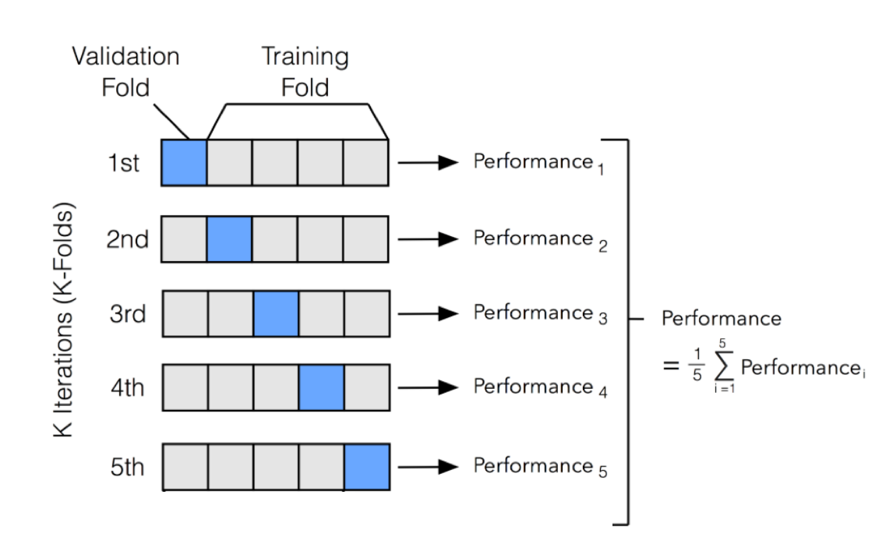
</div>

1. Veri kümesi **k** eşit büyüklükte katmana (fold) ayrılır.
2. Model **k-1** katmanda eğitilir ve kalan bir katmanda doğrulanır.
3. Bu işlem, her katman bir kez doğrulama kümesi olacak şekilde **k** kez tekrarlanır.
4. Nihai performans metriği, tüm doğrulama skorlarının ortalamasıdır.

Örneğin, **5-katlı çapraz doğrulamada** veri kümesi 5 parçaya ayrılır. Model 4 parçada eğitilir ve kalan bir parçada doğrulanır; bu işlem her parça bir kez doğrulama kümesi olarak kullanılana kadar tekrarlanır. Bu, yalnızca belirli bir doğrulama kümesinde iyi performans gösteren ancak görülmemiş verilerde kötü olan bir modeli seçme riskini azaltır.

Çapraz doğrulama, özellikle küçük veri kümeleriyle çalışırken kullanışlıdır çünkü verilerin daha verimli kullanılmasını sağlar. Ancak, özellikle eğitimin zaman alıcı olduğu derin öğrenme modelleri için hesaplama açısından pahalı olabilir.

Eğitim, doğrulama ve test kümelerini uygun şekilde kullanarak—ve gerektiğinde çapraz doğrulama ile—model seçimi hakkında bilinçli kararlar alabilir ve yeni verilere iyi genelleme yapılmasını sağlayabiliriz.

<br/>
<br/>

---

## Yanlılık ve Varyansı Teşhis Etme

**Yanlılık (bias)** ve **varyans (variance)**, bir modelin görülmemiş verilere genelleme yeteneğini belirleyen iki temel faktördür. Bu kavramları anlamak için basit doğrusal modeli inceleyelim:

$$
f(x) = wx + b
$$

İyi performans gösteren bir model iyi genelleme yapabilmelidir, yani verilerdeki temel desenleri gürültüyü (noise) ezberlemeden yakalamalıdır. Bunu denklem üzerinden inceleyelim.

<div style="text-align: center;display:flex; justify-content: center; margin-bottom: 20px; ">
    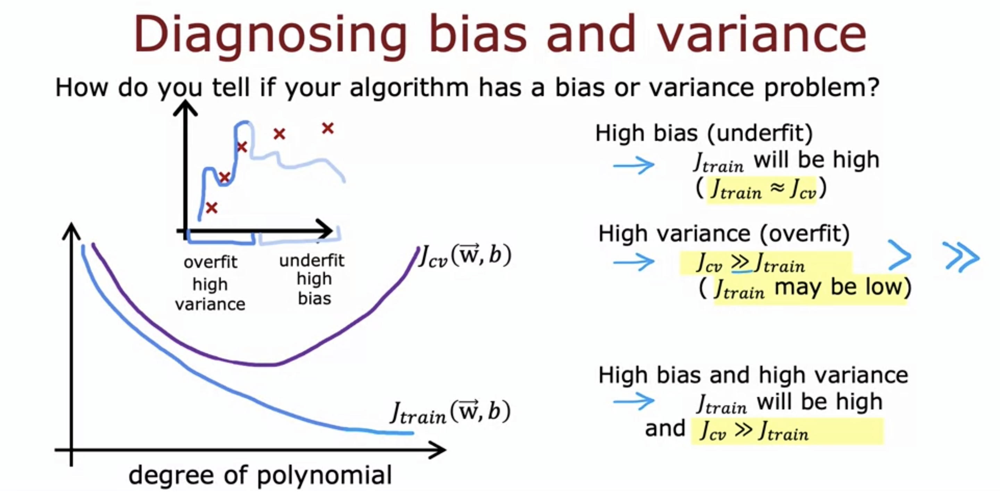
</div>

| **Sorun**                         | **Açıklama**                                                       | **Etkileri**                                                                                                   | **Daha Fazla Verinin Etkisi**                                    |
| --------------------------------- | ------------------------------------------------------------------- | -------------------------------------------------------------------------------------------------------------- | ---------------------------------------------------------------- |
| **Yüksek Yanlılık (Yetersiz Öğrenme)** | Model çok basittir ve temel desenleri yakalayamaz.                    | - Hem eğitim hem de test kümelerinde zayıf performans. <br> - Model çok basittir.                              | Eğitim verisini artırmak performansı **iyileştirmez**.           |
| **Yüksek Varyans (Aşırı Öğrenme)**    | Model çok karmaşıktır ve gürültü dahil eğitim verilerini ezberler.    | - Eğitim hatası çok düşük, ancak test hatası yüksektir. <br> - Model gerçek desenler yerine gürültüyü öğrenir. | Eğitim verisini artırmak genellemeye **yardımcı olabilir**.      |

<br/>
<br/>

---

## **Düzenlileştirme ve Yanlılık-Varyans Ödünleşimi**

Aşırı öğrenmeyi önlemek için, büyük ağırlıkları cezalandıran **düzenlileştirme (regularization)** uyguluyoruz.

Düzenlileştirilmiş kayıp fonksiyonu:

$$
J(w) = \\text{Loss}(w) + \\lambda \\sum\\_{i} \\phi(w_i)
$$

Burada:

- $ \\text{Loss}(w) $ orijinal kayıp fonksiyonudur (örneğin, Ortalama Karesel Hata),
- $ \\lambda $ düzenlileştirme gücüdür,
- $ \\phi(w) $ ceza terimidir (L1 veya L2).

**Düzenlileştirmenin Etkisi**

<div style="text-align: center;display:flex; justify-content: center; margin-bottom: 20px; ">
    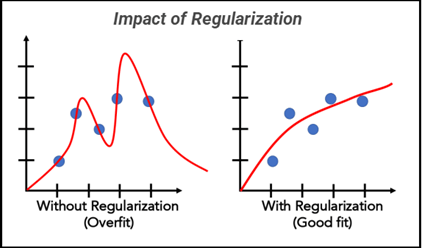
</div>

- $ \\lambda $ çok **düşükse**, model aşırı öğrenebilir ($ w $ değerleri büyür).
- $ \\lambda $ çok **yüksekse**, model çok basit hale gelir ($ w $ değerleri çok küçülür).
- İdeal $ \\lambda $ değeri, yanlılık ve varyans arasında denge kurar.

<br/>
<br/>

---

## Temel Performans Seviyesi Belirleme

Bir temel model (baseline), iyileştirmeyi ölçmeye yardımcı olur. Yaygın temeller şunları içerir:

<div style="text-align: center;display:flex; justify-content: center; margin-bottom: 20px; ">
    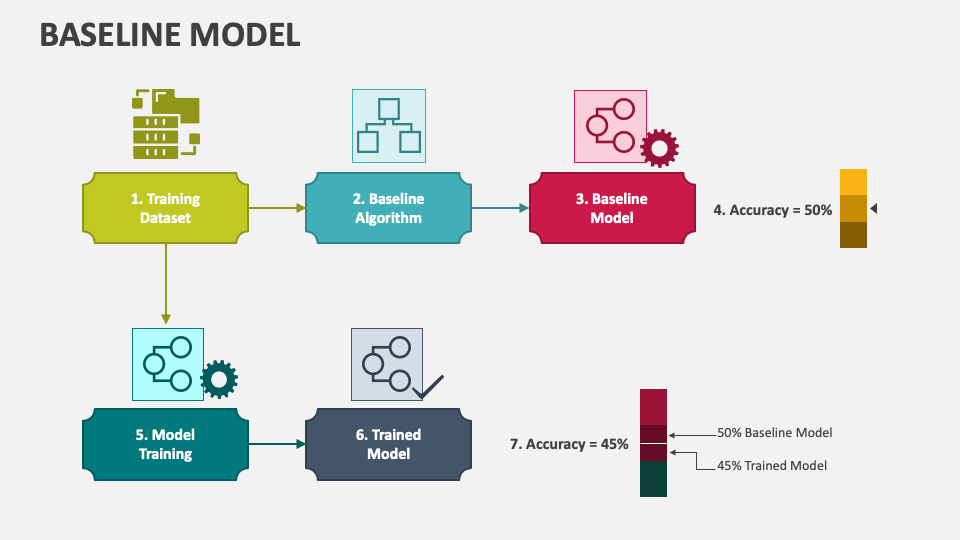
</div>

- Rastgele sınıflandırıcılar (sınıflandırma görevleri için)
- Ortalama tahminleri (regresyon görevleri için)
- Basit sezgisel yöntemler (heuristic-based methods)

Bir modelin kullanışlı sayılması için temel modeli geçmesi gerekir.

<br/>
<br/>

---

## ML Geliştirmenin Yinelemeli Döngüsü

Makine öğrenimi geliştirmesi yinelemeli bir döngü izler:

<div style="text-align: center;display:flex; justify-content: center; margin-bottom: 20px; ">
    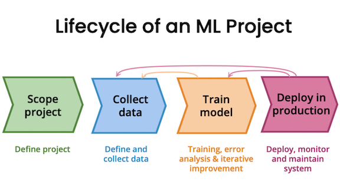
</div>

1. Bir temel model eğit.
2. Yanlılık/varyans hatalarını teşhis et.
3. Model karmaşıklığını, düzenlileştirmeyi veya veri stratejisini ayarla.
4. Performans tatmin edici olana kadar tekrarla.

<br/>
<br/>

---

## Veri Ekleme: Veri Artırma ve Sentezleme

Bir modelin genelleme yeteneğini geliştirmenin en etkili yollarından biri, eğitim verisi miktarını artırmaktır. Daha fazla veri, modelin yalnızca eğitim kümesine özgü olmayan desenleri öğrenmesine yardımcı olur, aşırı öğrenmeyi azaltır ve sağlamlığı (robustness) artırır.

### Veri Artırma (Data Augmentation)

**Veri Artırma**, mevcut verilere dönüşümler uygulayarak eğitim veri kümesinin boyutunu yapay olarak artırmayı ifade eder. Özellikle bilgisayarlı görü ve NLP gibi alanlarda, etiketli veri toplamanın pahalı ve zaman alıcı olduğu durumlarda kullanışlıdır.

**Yaygın Veri Artırma Teknikleri**

1. **Görüntü Veri Artırma** (Derin öğrenme bilgisayarlı görü görevleri için kullanılır):

    <div style="text-align: center;display:flex; justify-content: center; margin-bottom: 20px; ">
    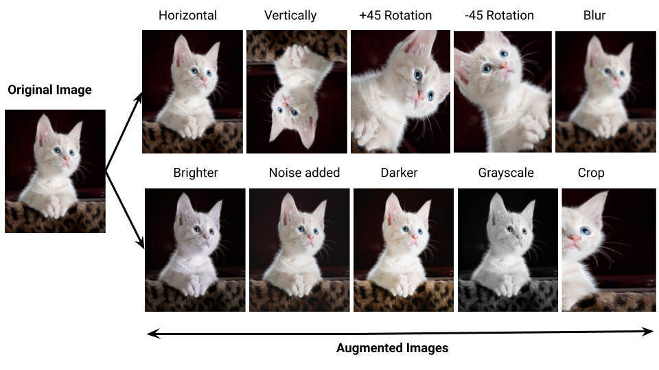
    </div>

   - **Döndürme (Rotation):** Farklı perspektifleri simüle etmek için görüntüleri küçük derecelerde döndürme.
   - **Kırpma (Cropping):** Farklı alanlara odaklanmak için görüntünün rastgele bölümlerini kırpma.
   - **Çevirme (Flipping):** Görüntüleri yatay veya dikey olarak çevirme.
   - **Ölçekleme (Scaling):** En-boy oranlarını koruyarak görüntüleri yeniden boyutlandırma.
   - **Parlaklık/Kontrast Ayarlamaları:** Aydınlatma varyasyonlarını simüle etmek için parlaklık ve kontrastı değiştirme.
   - **Gürültü Ekleme (Noise Injection):** Farklı sensör koşullarını simüle etmek için Gauss gürültüsü ekleme.

   **TensorFlow/Keras'ta Örnek:**

   ```python
   from tensorflow.keras.preprocessing.image import ImageDataGenerator

   datagen = ImageDataGenerator(
       rotation_range=20,
       width_shift_range=0.1,
       height_shift_range=0.1,
       horizontal_flip=True,
       brightness_range=[0.8, 1.2]
   )

   augmented_images = datagen.flow(x_train, y_train, batch_size=32)
   ```

2. **Metin Veri Artırma** (NLP modellerinde kullanılır):

    <div style="text-align: center;display:flex; justify-content: center; margin-bottom: 20px; ">
    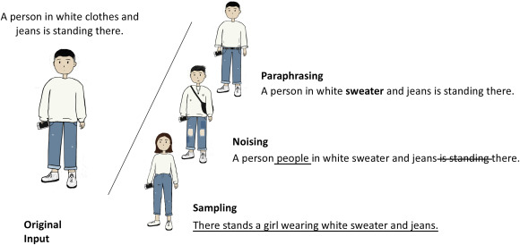
    </div>

   - **Eş Anlamlı Değiştirme (Synonym Replacement):** Kelimeleri eş anlamlılarıyla değiştirme.
   - **Rastgele Ekleme (Random Insertion):** Sözlükten rastgele kelimeler ekleme.
   - **Geri Çeviri (Back Translation):** Metni başka bir dile çevirip geri çevirerek çeşitlilik sağlama.
   - **Cümle Karıştırma (Sentence Shuffling):** Kelimeleri veya cümleleri hafifçe yeniden sıralama.

     `nlpaug` kullanarak örnek:

   ```python
   import nlpaug.augmenter.word as naw

    aug = naw.SynonymAug(aug_src='wordnet')
    text = "Deep learning models require large amounts of data."
    augmented_text = aug.augment(text)
    print(augmented_text)

   ```

3. **Zaman Serisi Veri Artırma** (Finansal veriler, konuşma işlemede kullanılır):

    <div style="text-align: center;display:flex; justify-content: center; margin-bottom: 20px; ">
    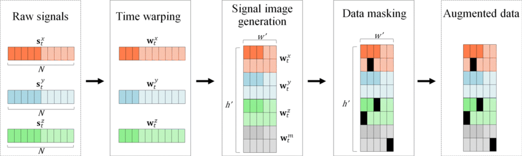
    </div>

   - **Zaman Çarpıtma (Time Warping):** Zaman serisi verilerini esnetme veya sıkıştırma.
   - **Sallantı Ekleme (Jittering):** Sayısal değerlere küçük rastgele gürültü ekleme.
   - **Ölçekleme (Scaling):** Veri noktalarını rastgele bir faktörle çarpma.

<br/>

### Veri Sentezleme (Data Synthesis)

Veri sentezleme, gerçek dünya dağılımlarını taklit eden tamamen yeni veri noktaları oluşturmayı içerir. Gerçek verilerin kıt veya elde edilmesi zor olduğu durumlarda kullanışlıdır.

**Yaygın Veri Sentezleme Teknikleri**

1. **Çekişmeli Üretici Ağlar** (Generative Adversarial Networks - GANs)

    <div style="text-align: center;display:flex; justify-content: center; margin-bottom: 20px; ">
    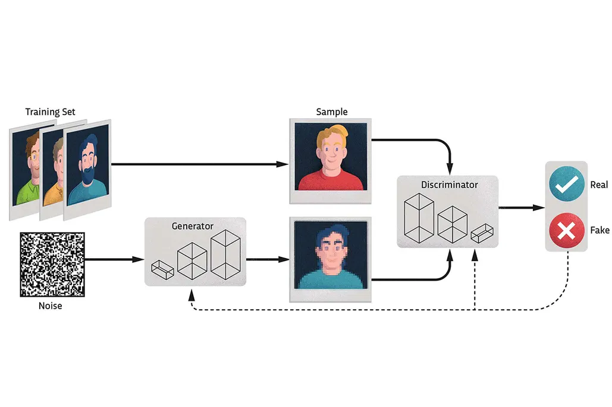
    </div>

   - GAN'ler, veri kümesinin temel dağılımını öğrenerek gerçekçi görüntüler, metin veya ses üretebilir.
   - Örnek: GAN tarafından oluşturulmuş insan yüzleri (thispersondoesnotexist.com).

   PyTorch kullanarak GAN örneği:

   ```python
   import torch.nn as nn
   import torch.optim as optim

   class Generator(nn.Module):
       def __init__(self):
           super(Generator, self).__init__()
           self.fc = nn.Linear(100, 784)  # 100-boyutlu gürültü vektöründen 28x28 görüntüye

       def forward(self, x):
           return torch.tanh(self.fc(x))

   generator = Generator()
   noise = torch.randn(1, 100)
   fake_image = generator(noise)
   ```

2. **Yeniden Örnekleme (Bootstrapping)**

   - Verileri yeniden örnekleyerek (yerine koyarak) yeni örnekler oluşturan istatistiksel bir yöntemdir.
   - Eğitim boyutunu artırmak için küçük veri kümelerinde kullanışlıdır.
   - Genellikle topluluk öğrenmesinde (ensemble learning) kullanılır (örneğin, torbalama - bagging).

3. **Sentetik Azınlık Aşırı Örnekleme (SMOTE)**

    <div style="text-align: center;display:flex; justify-content: center; margin-bottom: 20px; ">
    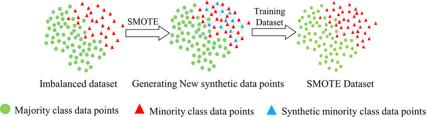
    </div>

   - Dengesiz veri kümelerinde sentetik azınlık sınıfı örnekleri oluşturmak için kullanılır.
   - Mevcut veri noktaları arasında enterpolasyonlu örnekler oluşturur.
   - `imbalanced-learn` kullanarak örnek:

   ```python
   from imblearn.over_sampling import SMOTE
   from sklearn.model_selection import train_test_split

   X_resampled, y_resampled = SMOTE().fit_resample(X_train, y_train)
   ```

4. Simülasyon Tabanlı Sentezleme

    <div style="text-align: center;display:flex; justify-content: center; margin-bottom: 20px; ">
    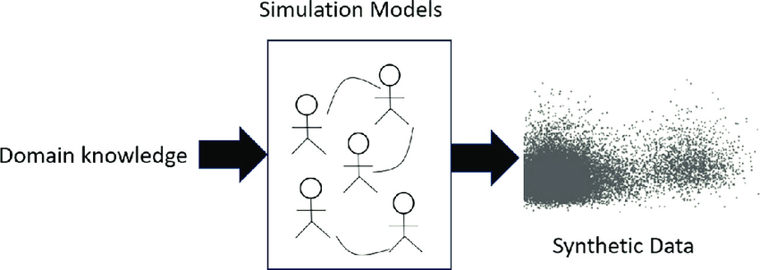
    </div>

   - Robotik, sağlık hizmetleri ve otonom sürüş gibi gerçek dünya veri toplamanın pahalı veya tehlikeli olduğu alanlarda kullanılır.
   - Örnek: Gerçek dünyaya dağıtımdan önce simüle edilmiş ortamlarda eğitilen otonom arabalar.

### Veri Artırma vs. Veri Sentezleme Ne Zaman Kullanılır?

| **Yöntem**             | **En uygun olduğu durum**         | **Yaygın Kullanım Alanları**                              |
| ---------------------- | --------------------------------- | --------------------------------------------------------- |
| **Veri Artırma**       | Mevcut veri kümelerini genişletme | Görüntü sınıflandırma, konuşma tanıma                     |
| **Veri Sentezleme**    | Yeni sentetik örnekler oluşturma  | GAN'ler ile görüntü üretimi, NLP metin sentezleme         |

<br/>
<br/>

---

## Transfer Öğrenme: Farklı Bir Görevden Veri Kullanma

**Transfer öğrenme (transfer learning)**, önceden eğitilmiş modellerden yararlanır:

<div style="text-align: center;display:flex; justify-content: center; margin-bottom: 20px; ">
    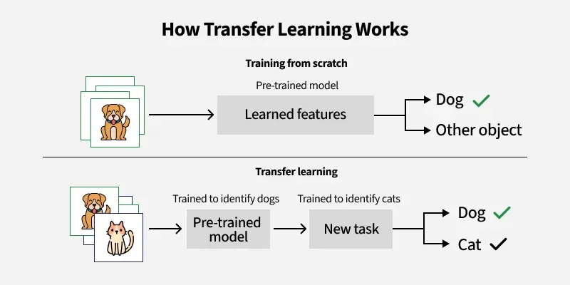
</div>

- **Öznitelik çıkarımı (Feature extraction):** Önceden eğitilmiş model katmanlarını öznitelik çıkarıcı olarak kullanma.
- **İnce ayar (Fine-tuning):** Katmanları dondurmaktan çıkarıp yeni bir veri kümesinde yeniden eğitme.

Örnek: Tıbbi görüntü sınıflandırması için ImageNet ile eğitilmiş modelleri kullanma.

<br/>
<br/>

---

## Dengesiz Veri Kümeleri için Hata Metrikleri

Dengesiz veri kümelerinde, tek başına doğruluk genellikle yanıltıcıdır. Örneğin, bir veri kümesinin %95'i negatif ve %5'i pozitif örneklerden oluşuyorsa, her zaman "negatif" tahmin eden bir model %95 doğruluğa sahip olur ancak tamamen işe yaramaz. Bunun yerine daha bilgilendirici metrikler kullanırız:

### Kesinlik, Duyarlılık ve F1-Skoru

<div style="text-align: center;display:flex; justify-content: center; margin-bottom: 20px; ">
    
</div>

- **Kesinlik ($P$)**: Pozitif olarak tahmin edilenlerin kaçının gerçekten doğru olduğunu ölçer.

  $$
  P = \\frac{TP}{TP + FP}
  $$

  - **Yüksek Kesinlik:** Model daha az yanlış pozitif (false positive) hatası yapar.
  - **Örnek:** Bir e-posta spam filtresinde, yüksek kesinlik daha az sayıda meşru e-postanın yanlışlıkla spam olarak sınıflandırıldığı anlamına gelir.

- **Duyarlılık ($R$)**: Gerçek pozitiflerin kaçının doğru şekilde tespit edildiğini ölçer.

  $$
  R = \\frac{TP}{TP + FN}
  $$

  - **Yüksek Duyarlılık:** Model, gerçek pozitif vakaların çoğunu yakalar.
  - **Örnek:** Kanser için yapılan bir tıbbi testte, yüksek duyarlılık neredeyse tüm kanser vakalarının tespit edilmesini sağlar.

- **F1-Skoru**: Kesinlik ve duyarlılığın harmonik ortalamasıdır ve her iki yönü dengeler.

  $$
  F_1 = 2 \\times \\frac{P \\times R}{P + R}
  $$

  - Hem yanlış pozitiflerin hem de yanlış negatiflerin (false negative) en aza indirilmesi gerektiğinde kullanılır.
  - F1-skoru **0 ile 1** arasında değişir; **1, kesinlik ve duyarlılık arasında mükemmel bir dengeyi gösteren en iyi olası skordur**. Bununla birlikte, "iyi" veya "kötü" bir F1-skoru olarak nitelendirilen şey, problemin bağlamına bağlıdır.

<br/>
<br/>
