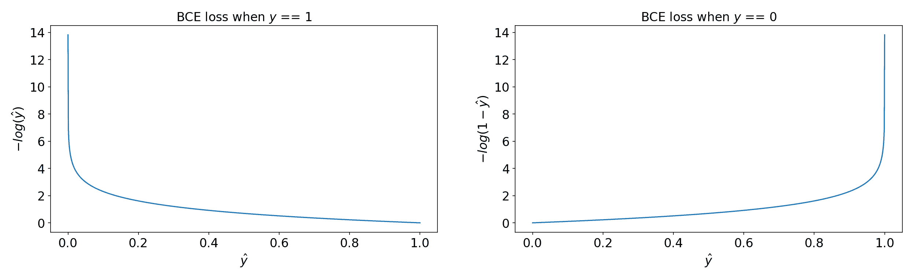
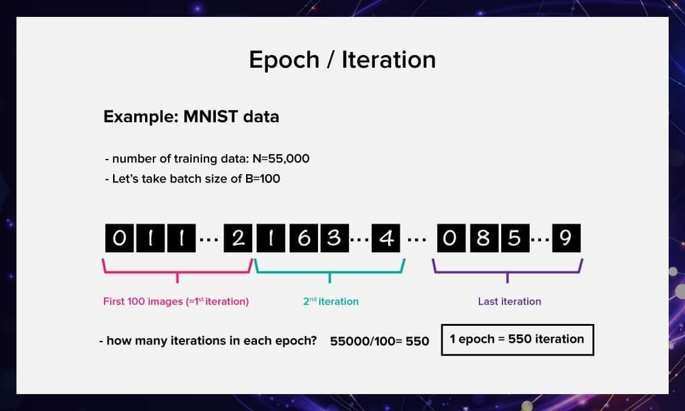
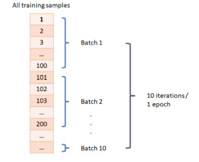
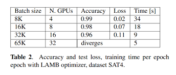
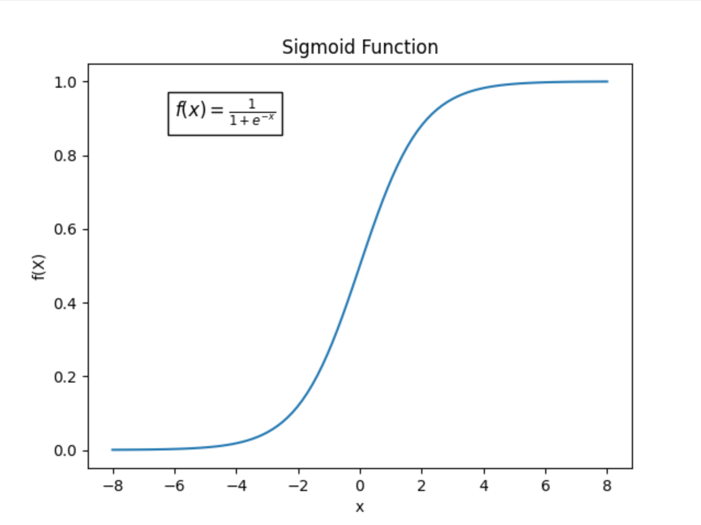
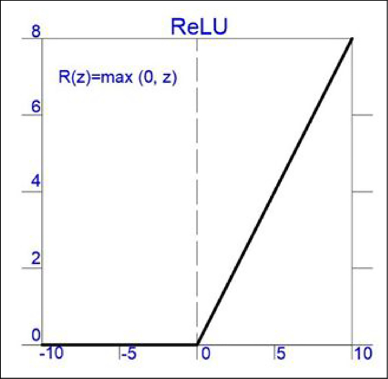
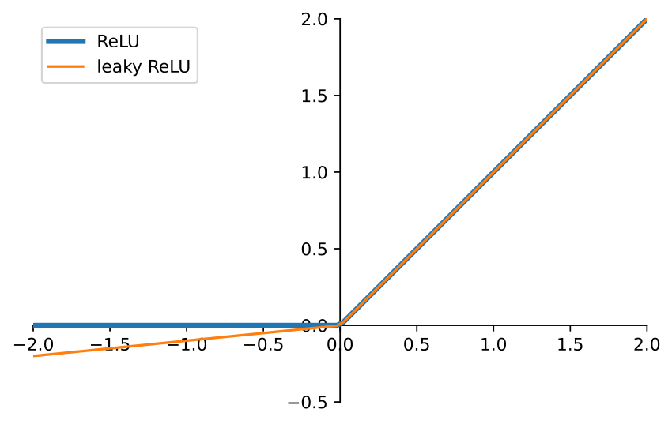
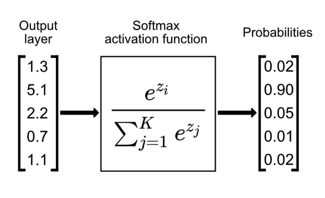
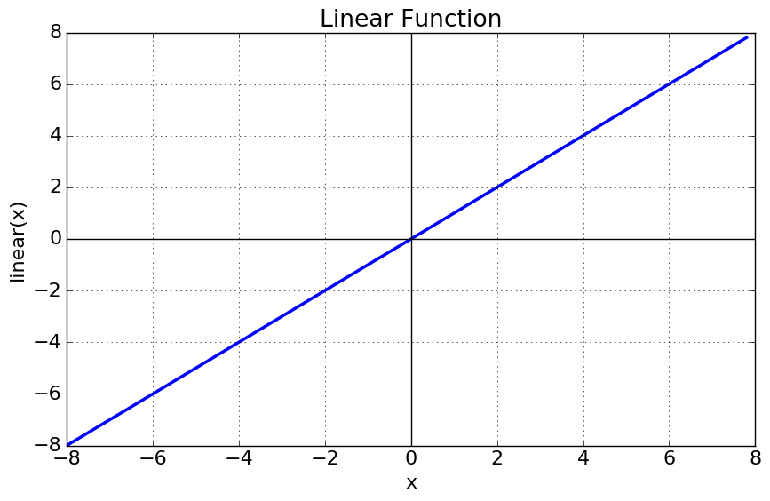

# Sinir Ağı Eğitimi ve Aktivasyon Fonksiyonları (Neural Network Training and Activation Functions)

<!-- toc -->

## Kayıp Fonksiyonlarını Anlama (Understanding Loss Functions)

### İkili Çapraz Entropi (Binary Crossentropy - BCE)

İkili çapraz entropi, ikili sınıflandırma (binary classification) problemlerinde yaygın olarak kullanılır. Tahmin edilen olasılık $ \hat{y} $ ile gerçek etiket $ y $ arasındaki farkı aşağıdaki şekilde ölçer:

<div style="text-align: center;display:flex; justify-content: center; margin-bottom: 20px; ">
    
</div>

$$
L = - \frac{1}{N} \sum\limits_{i=1}^{N} \left[ y_i \log(\hat{y}_i) + (1 - y_i) \log(1 - \hat{y}_i) \right]
$$

**TensorFlow Uygulaması**

```python
import tensorflow as tf
loss_fn = tf.keras.losses.BinaryCrossentropy()
y_true = [1, 0, 1, 1]
y_pred = [0.9, 0.1, 0.8, 0.6]
loss = loss_fn(y_true, y_pred)
print("Binary Crossentropy Loss:", loss.numpy())
```

<br/>

---

### Ortalama Kare Hata (Mean Squared Error - MSE)

Regresyon (regression) problemleri için MSE, gerçek ve tahmin edilen değerler arasındaki ortalama kare farklarını hesaplar:

<div style="text-align: center;display:flex; justify-content: center; margin-bottom: 20px; ">
    
</div>

$$
L = \frac{1}{N} \sum\limits_{i=1}^{N} (y_i - \hat{y}_i)^2
$$

**TensorFlow Uygulaması**

```python
mse_fn = tf.keras.losses.MeanSquaredError()
y_true = [3.0, -0.5, 2.0, 7.0]
y_pred = [2.5, 0.0, 2.1, 7.8]
mse_loss = mse_fn(y_true, y_pred)
print("Mean Squared Error Loss:", mse_loss.numpy())
```

<br/>

---

### Kategorik Çapraz Entropi (Categorical Crossentropy - CCE)

Kategorik çapraz entropi, etiketlerin tek-sıcak kodlu (one-hot encoded) olduğu çok sınıflı sınıflandırma (multi-class classification) problemlerinde kullanılır. Kayıp fonksiyonu şu şekilde verilir:

$$L = - \sum\limits_{i=1}^{N} \sum\limits_{j=1}^{C} y_{ij} \log(\hat{y}_{ij})$$

burada $ C $ sınıf sayısını belirtir.

**TensorFlow Uygulaması**

```python
cce_fn = tf.keras.losses.CategoricalCrossentropy()
y_true = [[0, 0, 1], [0, 1, 0]]  # One-hot encoded labels
y_pred = [[0.1, 0.2, 0.7], [0.2, 0.6, 0.2]]  # Model predictions
cce_loss = cce_fn(y_true, y_pred)
print("Categorical Crossentropy Loss:", cce_loss.numpy())
```

<br/>

---

### Seyrek Kategorik Çapraz Entropi (Sparse Categorical Crossentropy - SCCE)

Seyrek kategorik çapraz entropi, kategorik çapraz entropiye benzer ancak etiketlerin tek-sıcak kodlu olmadığı (yani vektörler yerine tam sayılar olduğu) durumlarda kullanılır.

**TensorFlow Uygulaması**

```python
scce_fn = tf.keras.losses.SparseCategoricalCrossentropy()
y_true = [2, 1]  # Integer labels
y_pred = [[0.1, 0.2, 0.7], [0.2, 0.6, 0.2]]  # Model predictions
scce_loss = scce_fn(y_true, y_pred)
print("Sparse Categorical Crossentropy Loss:", scce_loss.numpy())
```

<br/>

---

### Doğru Kayıp Fonksiyonunu Seçme (Choosing the Right Loss Function)

| Problem Türü                             | Uygun Kayıp Fonksiyonu         | Örnek Uygulama              |
| ---------------------------------------- | ------------------------------ | --------------------------- |
| İkili Sınıflandırma (Binary Classification) | BinaryCrossentropy             | Spam tespiti                |
| Çok Sınıflı Sınıflandırma (tek-sıcak kodlu) | CategoricalCrossentropy        | Görüntü sınıflandırma       |
| Çok Sınıflı Sınıflandırma (tam sayı etiketli) | SparseCategoricalCrossentropy  | Duygu analizi               |
| Regresyon (Regression)                   | MeanSquaredError               | Ev fiyatı tahmini           |

Her kayıp fonksiyonu farklı bir amaca hizmet eder ve problemin yapısına göre seçilir. Sınıflandırma görevleri için çapraz entropi tabanlı kayıplar tercih edilirken, regresyon için MSE yaygın olarak kullanılır. Doğru kayıp fonksiyonunu seçerken veri kümenizin yapısını ve beklenen çıktı formatını anlamak çok önemlidir.

## Eğitim Detayları Temel Kavramlar (Training Details Main Concepts)

### Epoch'lar (Epochs)

Bir **epoch**, tüm eğitim veri kümesinin sinir ağından bir tam geçişini temsil eder. Her epoch sırasında model, kayıp fonksiyonundan hesaplanan hataya göre ağırlıklarını günceller.

<div style="text-align: center;display:flex; justify-content: center; margin-bottom: 20px; ">
    
</div>

- **Bir epoch** için eğitim yaparsak, model her eğitim örneğini **tam olarak bir kez** görür.
- **Birden fazla epoch** için eğitim yaparsak, model aynı verileri tekrar tekrar görür ve performansı artırmak için ağırlıklarını sürekli günceller.

<br/>

**Epoch Sayısını Seçme**

<div style="text-align: center;display:flex; justify-content: center; margin-bottom: 20px; ">
    
</div>

- **Çok Az Epoch** → Model **düşük uyum (underfit)** yapabilir, yani verilerden yeterli örüntü öğrenmemiş olur.
- **Çok Fazla Epoch** → Model **aşırı uyum (overfit)** yapabilir, yani eğitim verilerini ezberler ancak yeni verilere genelleme yapmakta zorlanır.
- En uygun epoch sayısı tipik olarak **erken durdurma (early stopping)** ile belirlenir; bu yöntem doğrulama kaybını izler ve kayıp artmaya başladığında (aşırı uyum işareti) eğitimi durdurur.

**TensorFlow Uygulaması**

```python
model.fit(X_train, y_train, epochs=50, batch_size=32, validation_data=(X_val, y_val))
```

<br/>

---

### Yığın Boyutu (Batch Size)

Tüm veri kümesini modele bir kerede beslemek yerine, eğitim **yığın (batch)** adı verilen daha küçük alt kümeler halinde gerçekleştirilir.

<div style="text-align: center;display:flex; justify-content: center; margin-bottom: 20px; ">
    
</div>

**Temel Kavramlar:**

- **Yığın Boyutu (Batch Size)**: Modelin ağırlıkları güncellenmeden önce işlenen eğitim örneği sayısı.
- **İterasyon (Iteration)**: Bir yığının işlenmesinden sonra model ağırlıklarının bir güncellemesi.
- **Epoch Başına Adım Sayısı (Steps Per Epoch)**: `N` eğitim örneğimiz ve `B` yığın boyutumuz varsa, epoch başına adım sayısı **N/B**'dir.

<br/>

**Yığın Boyutunu Seçme**

- **Küçük Yığın Boyutları (ör. 16, 32)**:
  - **Daha az bellek** gerektirir.
  - **Gürültülü ancak etkili güncellemeler** sağlar (daha iyi genelleme).
- **Büyük Yığın Boyutları (ör. 256, 512, 1024)**:
  - **Daha fazla bellek** gerektirir.
  - **Daha yumuşak ancak potansiyel olarak daha az genelleşmiş güncellemelere** yol açar.

**TensorFlow Uygulaması**

```python
model.fit(X_train, y_train, epochs=20, batch_size=64)
```

<br/>

---

### Doğrulama Verileri (Validation Data)

Bir **doğrulama kümesi (validation set)**, veri kümesinin eğitim için **kullanılmayan** ayrı bir bölümüdür. Modelin performansını izlemeye ve aşırı uyumu tespit etmeye yardımcı olur.

<br/>

**Eğitim, Doğrulama ve Test Verileri Arasındaki Farklar:**

| Veri Türü                | Amaç                                                 |
| ------------------------ | ---------------------------------------------------- |
| **Eğitim Kümesi (Training Set)**   | Eğitim sırasında model ağırlıklarını güncellemek için kullanılır. |
| **Doğrulama Kümesi (Validation Set)** | Hiperparametreleri ayarlamak ve aşırı uyumu tespit etmek için kullanılır. |
| **Test Kümesi (Test Set)**       | Görülmemiş verilerde nihai model performansını değerlendirmek için kullanılır. |

<br/>

**Veriler Nasıl Ayrılır:**

Yaygın bir ayırma oranı **%80 eğitim, %10 doğrulama, %10 test** şeklindedir, ancak bu veri kümesi boyutuna göre değişebilir.

<br/>

**TensorFlow Uygulaması**

```python
from sklearn.model_selection import train_test_split

X_train, X_val, y_train, y_val = train_test_split(X, y, test_size=0.2, random_state=42)

model.fit(X_train, y_train, epochs=30, batch_size=32, validation_data=(X_val, y_val))
```

<br/>
<br/>

---

## Aktivasyon Fonksiyonları (Activation Functions)

### 1. Neden Aktivasyon Fonksiyonlarına İhtiyacımız Var?

Aktivasyon fonksiyonu olmadan, çok katmanlı bir sinir ağı tek katmanlı bir doğrusal model gibi davranır çünkü:

$$ f(x) = Wx + b $$

sadece doğrusal bir dönüşümdür. Aktivasyon fonksiyonları **doğrusal olmama (non-linearity)** özelliği kazandırarak ağın karmaşık örüntüleri öğrenmesini sağlar.

Doğrusal olmama uygulamazsak, ne kadar çok katman yığarsak yığalım, nihai çıktı girdinin doğrusal bir fonksiyonu olarak kalır. Aktivasyon fonksiyonları, modelin karmaşık, doğrusal olmayan ilişkileri yaklaşık olarak öğrenmesini sağlayarak bu sorunu çözer.

### 2. Yaygın Aktivasyon Fonksiyonları

#### Sigmoid (Lojistik Fonksiyon - Logistic Function)

$$ \sigma(x) = \frac{1}{1 + e^{-x}} $$

<div style="text-align: center;display:flex; justify-content: center; margin-bottom: 20px; ">
    
</div>

- **Aralık (Range):** (0, 1)
- **Kullanıldığı yer:** İkili sınıflandırma (binary classification) problemleri
- **Avantajları:** Çıktılar olasılık olarak yorumlanabilir.
- **Dezavantajları:** \\( x \\)'in çok büyük veya çok küçük değerlerinde kaybolan gradyanlar (vanishing gradients) görülür, bu da eğitimi yavaşlatır.

#### ReLU (Doğrultulmuş Doğrusal Birim - Rectified Linear Unit)

$$ f(x) = \max(0, x) $$

<div style="text-align: center;display:flex; justify-content: center; margin-bottom: 20px; ">
    
</div>

- **Aralık (Range):** [0, ∞)
- **Kullanıldığı yer:** Derin sinir ağlarının gizli katmanları (hidden layers).
- **Avantajları:** Gradyan akışına yardımcı olur ve kaybolan gradyanları (vanishing gradients) önler.
- **Dezavantajları:** **Ölen ReLU (dying ReLU)** sorununa yol açabilir (girdi negatifse nöronlar 0 çıktısı verir ve öğrenmeyi durdurur).

#### Sızdıran ReLU (Leaky ReLU)

$$ f(x) = \max(0.01x, x) $$

<div style="text-align: center;display:flex; justify-content: center; margin-bottom: 20px; ">
    
</div>

- **Aralık (Range):** (-∞, ∞)
- **Kullanıldığı yer:** ReLU'ya alternatif olarak gizli katmanlarda.
- **Avantajları:** Ölen ReLU sorununu önler.
- **Dezavantajları:** Küçük negatif eğim, yine de yavaş öğrenmeye yol açabilir.

#### Softmax

$$ \sigma(x_i) = \frac{e^{x_i}}{\sum_{j} e^{x_j}} $$

<div style="text-align: center;display:flex; justify-content: center; margin-bottom: 20px; ">
    
</div>

- **Kullanıldığı yer:** Çok sınıflı sınıflandırma (multi-class classification) — çıktı katmanı.
- **Avantajları:** Bir olasılık dağılımı üretir (her sınıf 0 ile 1 arasında bir olasılık alır ve toplamları 1 olur).
- **Dezavantajları:** Büyük sayıların üssü alınırken sayısal kararsızlığa (numerical instability) yol açabilir.

#### Doğrusal Aktivasyon (Linear Activation)

$$ f(x) = x $$

<div style="text-align: center;display:flex; justify-content: center; margin-bottom: 20px; ">
    
</div>

- **Kullanıldığı yer:** Regresyon (regression) problemleri — çıktı katmanı.
- **Avantajları:** Çıktı değerleri üzerinde herhangi bir kısıtlama yoktur.
- **Dezavantajları:** Değerleri belirli bir aralığa eşlemediği için sınıflandırma için kullanışlı değildir.

### 3. Doğru Aktivasyon Fonksiyonunu Seçme

| Katman                                    | Önerilen Aktivasyon Fonksiyonu                    | Açıklama                                              |
| ----------------------------------------- | ------------------------------------------------- | ----------------------------------------------------- |
| Gizli Katmanlar (Hidden Layers)           | **ReLU** (veya ReLU ölüyorsa **Leaky ReLU**)      | Gradyan akışını koruyarak derin ağlara yardımcı olur  |
| Çıktı Katmanı (İkili Sınıflandırma)       | **Sigmoid**                                       | İki sınıflı sınıflandırma için olasılıklar üretir     |
| Çıktı Katmanı (Çok Sınıflı Sınıflandırma) | **Softmax**                                       | Logitleri olasılık dağılımlarına dönüştürür           |
| Çıktı Katmanı (Regresyon)                 | **Doğrusal (Linear)**                             | Doğrudan sayısal değerler çıktısı verir               |

### Softmax ve Sigmoid: Temel Farklar

- **Sigmoid** temel olarak **ikili sınıflandırma (binary classification)** için kullanılır, değerleri (0,1) aralığına eşler ve bu değerler sınıf olasılıkları olarak yorumlanabilir.
- **Softmax** ise **çok sınıflı sınıflandırma (multi-class classification)** için kullanılır ve birden fazla sınıf üzerinde bir olasılık dağılımı üretir.

Çok sınıflı problemler için sigmoid kullanırsanız, her çıktı düğümü bağımsız hareket eder ve toplamlarının 1 olmasını sağlamak zorlaşır. Softmax, çıktıların toplamının 1 olmasını garanti ederek daha net bir olasılıksal yorumlama sağlar.

### Softmax'ın Geliştirilmiş Uygulaması (Improved Implementation of Softmax)

##### Çıktı Katmanında Softmax Yerine Neden Doğrusal Kullanmalıyız?

Sınıflandırma için bir sinir ağı uygularken, softmax'ı açıkça uygulamak yerine genellikle logitleri (ham çıktıları) doğrudan kayıp fonksiyonuna iletiriz.

Matematiksel olarak, eğer softmax'ı açıkça uygularsak:

$$ L = - \sum y_i \log(\sigma(z_i)) $$

burada \\( \sigma(z) \\) softmax fonksiyonudur.

Ancak, **ham logitleri** (softmax olmadan) çapraz entropi kayıp fonksiyonuna iletirsek, TensorFlow dahili olarak log-softmax hilesini (log-softmax trick) uygular:

$$ L = - \sum y_i z_i + \log \sum e^{z_i} $$

Bu, büyük üstel hesaplamalardan kaçınarak sayısal kararlılığı (numerical stability) artırır ve hesaplama maliyetini düşürür.

**TensorFlow Uygulaması**

Bunun yerine:

```python
model = tf.keras.Sequential([
    tf.keras.layers.Dense(128, activation='relu'),
    tf.keras.layers.Dense(64, activation='relu'),
    tf.keras.layers.Dense(10, activation='softmax')  # Explicit softmax
])
model.compile(loss=tf.keras.losses.SparseCategoricalCrossentropy(), optimizer='adam')
```

Şunu kullanın:

```python
model = tf.keras.Sequential([
    tf.keras.layers.Dense(128, activation='relu'),
    tf.keras.layers.Dense(64, activation='relu'),
    tf.keras.layers.Dense(10)  # No activation here!
])
model.compile(loss=tf.keras.losses.SparseCategoricalCrossentropy(from_logits=True), optimizer='adam')
```

Bu, TensorFlow'un softmax'ı dahili olarak yönetmesini sağlayarak gereksiz hesaplamalardan kaçınır ve sayısal hassasiyeti artırır.

<br/>
<br/>
