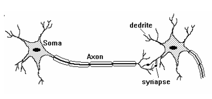
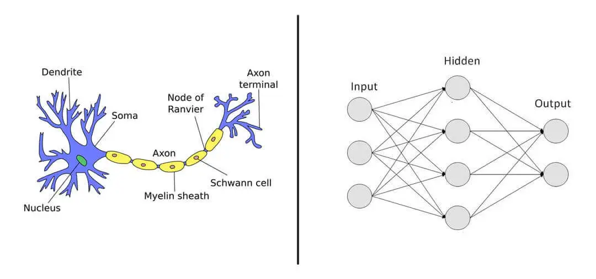
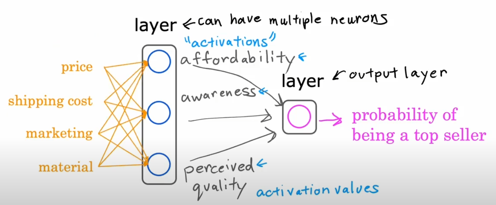
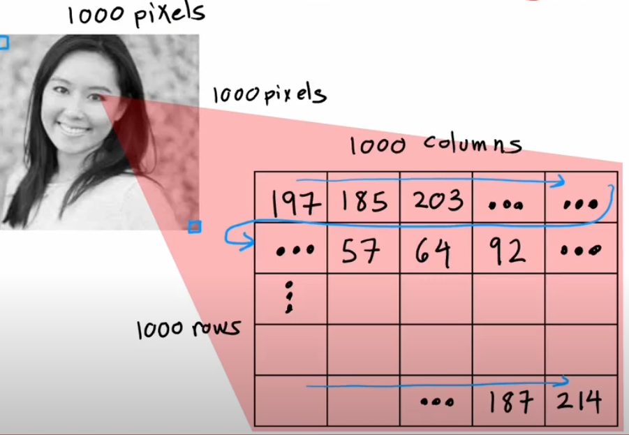
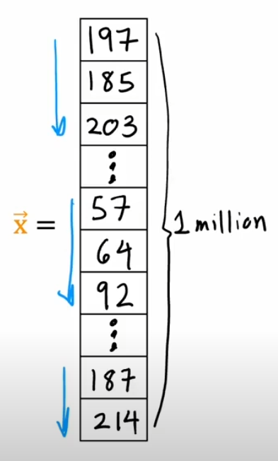
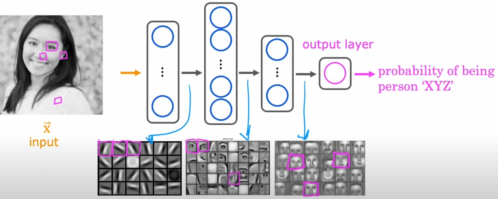
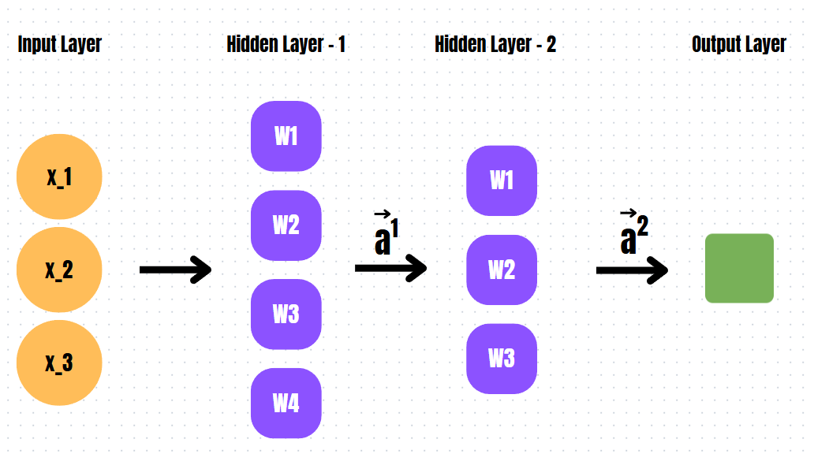
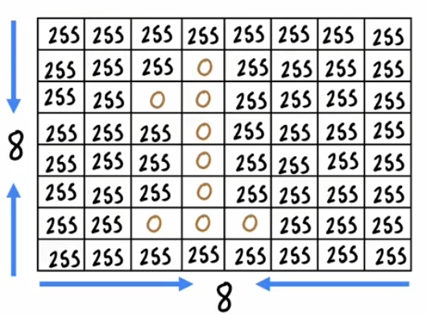

# Sinir Ağları: Sezgi ve Model (Neural Networks: Intuition and Model)

<!-- toc -->

## Sinir Ağlarını Anlamak (Understanding Neural Networks)

Sinir ağları, derin öğrenmenin temel bir kavramı olup, insan beyninin bilgiyi işleme biçiminden ilham alır. Yapay nöronlardan oluşan katmanlar halinde düzenlenirler ve girdi verilerini anlamlı çıktılara dönüştürürler. Bir sinir ağının özünde basit bir matematiksel işlem vardır: her nöron girdileri alır, ağırlıklı bir toplam uygular, bir bias (bias) terimi ekler ve sonucu bir aktivasyon fonksiyonundan (activation function) geçirir. Bu süreç, ağın örüntüleri öğrenmesini ve tahminler yapmasını sağlar.

## Biyolojik İlham: Beyin ve Sinapslar (Biological Inspiration: The Brain and Synapses)

Yapay sinir ağları (artificial neural networks - ANNs), insan beyninin biyolojik yapısı temel alınarak tasarlanmıştır. Beyin, **sinapslar (synapses)** adı verilen yapılar aracılığıyla birbirine bağlı milyarlarca nörondan oluşur. Nöronlar, öğrenme, hafıza ve karar verme süreçlerinde kritik bir rol oynayan elektriksel ve kimyasal sinyaller ileterek birbirleriyle iletişim kurar.

### Biyolojik Bir Nöronun Yapısı (Structure of a Biological Neuron)

Her bir biyolojik nöron birkaç temel bileşenden oluşur:

    

- **Dendritler (Dendrites)**: Diğer nöronlardan gelen girdi sinyallerini alır.
- **Hücre Gövdesi (Cell Body - Soma)**: Alınan sinyalleri işler ve nöronun aktive edilip edilmeyeceğine karar verir.
- **Akson (Axon)**: Çıktı sinyalini diğer nöronlara iletir.
- **Sinapslar (Synapses)**: Kimyasal nörotransmitterlerin iletişimi sağladığı nöronlar arası bağlantı noktalarıdır.

### Yapay Sinir Ağları ve Biyolojik Ağlar (Artificial Neural Networks vs. Biological Networks)

Yapay sinir ağlarında:

    

- **Nöronlar (Neurons)** hesaplama birimleri olarak işlev görür.
- **Ağırlıklar (Weights)** sinaps güçlerine karşılık gelir ve bir girdinin ne kadar etkili olduğunu belirler.
- **Bias (bias) terimleri** aktivasyon eşiğini kaydırmaya yardımcı olur.
- **Aktivasyon fonksiyonları (activation functions)**, biyolojik nöronların yalnızca belirli eşikler aşıldığında ateşlenme biçimini taklit eder.

## Sinir Ağlarında Katmanların Önemi (Importance of Layers in Neural Networks)

Sinir ağları, her biri girdi verilerinden öznitelikleri (features) çıkarmak ve işlemekten sorumlu olan birden çok katmandan oluşur. Bir ağın katman sayısı arttıkça daha derin hale gelir ve karmaşık hiyerarşik örüntüleri öğrenebilir.

### Örnek: Bir Tişörtün En Çok Satan Ürün Olma Durumunu Tahmin Etme

Çevrimiçi bir giyim mağazasının, yeni bir tişörtün en çok satan ürün (top-seller) olup olmayacağını tahmin etmek istediğini düşünelim. Bu sonucu etkileyen ve sinir ağımıza **girdi (input)** olarak hizmet eden birkaç faktör vardır:

- **Fiyat** ($x_1$)
- **Kargo Ücreti** ($x_2$)
- **Pazarlama** ($x_3$)
- **Malzeme** ($x_4$)

Bu girdiler, ağın ilk katmanına beslenir ve bu katman anlamlı öznitelikler çıkarır. Olası bir **gizli katman yapısı (hidden layer structure)** şöyle olabilir:

    

1. **Gizli Katman 1 (Hidden Layer 1)**: Şu gibi birkaç aktivasyon fonksiyonu içerir: _erişilebilirlik (affordability)_, _farkındalık (awareness)_, _algılanan kalite (perceived quality)_.
2. **Çıktı Katmanı (Output Layer)**: Önceki katmanlardan gelen bilgileri bir araya getirerek nihai bir tahmin yapar.

Çıktı katmanı bir **sigmoid aktivasyon fonksiyonu (sigmoid activation function)** uygular:

$$ \sigma(z) = \frac{1}{1 + e^{-z}} $$

burada $z$, bir önceki katmanın çıktılarının ağırlıklı toplamıdır. Eğer $\sigma(z) > 0.5$ ise, tişörtü en çok satan ürün olarak sınıflandırırız; aksi halde değildir.

## Yüz Tanıma Örneği: Katman Katman İşleme (Face Recognition Example: Layer-by-Layer Processing)

Yüz tanıma, sinir ağlarının üstün olduğu gerçek dünya örneklerinden biridir. Yüz tanıma için tasarlanmış derin bir sinir ağını ele alalım ve işlemeyi adım adım inceleyelim:

1. **Girdi Katmanı (Input Layer)**: Bir yüz görüntüsü piksel değerlerine dönüştürülür (örneğin, 100x100 boyutunda bir gri tonlamalı görüntü, 10.000 piksel değerinden oluşan bir vektör olarak temsil edilir).

    
    

2. **Birinci Gizli Katman (First Hidden Layer)**: Basit filtreler uygulayarak görüntüdeki temel kenarları ve köşeleri tespit eder.
3. **İkinci Gizli Katman (Second Hidden Layer)**: Kenar ve köşe bilgilerini birleştirerek gözler, burunlar ve ağızlar gibi yüz özelliklerini tanımlar.
4. **Üçüncü Gizli Katman (Third Hidden Layer)**: Tüm yüz yapılarını ve öznitelikler arasındaki ilişkileri tanır.

    

5. **Çıktı Katmanı (Output Layer)**: Bir olasılık skoru üreterek yüzün bilinen bir kimlikle eşleşip eşleşmediğini belirler.

## Bir Sinir Ağının Matematiksel Gösterimi (Mathematical Representation of a Neural Network)

Bir sinir ağındaki aktivasyonları verimli bir şekilde hesaplamak için matris gösterimi kullanırız. İleri yayılım (forward propagation) için genel formül şöyledir:

$$ Z^{[l]} = W^{[l]} A^{[l-1]} + b^{[l]} $$

burada:

- $ A^{[l-1]} $ bir önceki katmanın aktivasyonudur,
- $ W^{[l]} $ mevcut katmanın ağırlık matrisidir,
- $ b^{[l]} $ bias vektörüdür,
- $ Z^{[l]} $ aktivasyon fonksiyonu uygulanmadan önceki girdilerin doğrusal kombinasyonudur.

Aktivasyon fonksiyonu şu şekilde uygulanır:

$$ A^{[l]} = g(Z^{[l]}) $$

burada $ g $ tipik olarak sigmoid, ReLU veya softmax fonksiyonudur.

### Örnek Hesaplama (Example Calculation)

Tek katmanlı, üç girdili ve bir nöronlu bir sinir ağımız olduğunu varsayalım. Girdileri şu şekilde tanımlayalım:

$$
x_1 = 0.5, \quad x_2 = 0.8, \quad x_3 = 0.2
$$

Karşılık gelen ağırlık matrisi ve bias terimi şöyledir:

$$
W = \left[ \begin{array}{ccc} 0.9 & -0.5 & 0.3 \end{array} \right], \quad b = 0.1
$$

Ağırlıklı toplam \(Z\) şu şekilde hesaplanır:

$$
Z = W \cdot X + b = (0.5 \times 0.9) + (0.8 \times -0.5) + (0.2 \times 0.3) + 0.1
$$

$$
Z = 0.45 - 0.4 + 0.06 + 0.1 = 0.21
$$

Sigmoid aktivasyon fonksiyonunu uygulayarak:

$$
\sigma(Z) = \frac{1}{1 + e^{-Z}} = \frac{1}{1 + e^{-0.21}} \approx 0.552
$$

Çıktı 0.5'in üzerinde olduğu için bu durumu pozitif olarak sınıflandırırız.

### İki Gizli Katmanlı Sinir Ağı Hesaplaması (Two Hidden Layer Neural Network Calculation)

Şimdi, iki gizli katmanlı bir sinir ağını ele alalım.

#### Ağ Yapısı (Network Structure)

    

- **Girdi Katmanı (Input Layer)**: 3 girdi değeri $X = [x_1, x_2, x_3]$
- **Birinci Gizli Katman (First Hidden Layer)**: 4 nöron
- **İkinci Gizli Katman (Second Hidden Layer)**: 3 nöron
- **Çıktı Katmanı (Output Layer)**: 1 nöron

#### Birinci Gizli Katman Hesaplaması (First Hidden Layer Calculation)

Girdi vektörü:

$$
X = \left[ \begin{array}{c} 0.5 \\ 0.8 \\ 0.2 \end{array} \right]
$$

Birinci gizli katman için ağırlık matrisi:

$$
W^{(1)} = \left[ \begin{array}{ccc} 0.2 & -0.3 & 0.5 \\ -0.7 & 0.1 & 0.4 \\ 0.3 & 0.8 & -0.6 \\ 0.5 & -0.2 & 0.7 \end{array} \right]
$$

Bias vektörü:

$$
b^{(1)} = \left[ \begin{array}{c} 0.1 \\ -0.2 \\ 0.3 \\ 0.4 \end{array} \right]
$$

Ağırlıklı toplamın hesaplanması:

$$
Z^{(1)} = W^{(1)}X + b^{(1)}
$$

Sigmoid aktivasyon fonksiyonunun uygulanması:

$$
A^{(1)} = \sigma(Z^{(1)})
$$

#### İkinci Gizli Katman Hesaplaması (Second Hidden Layer Calculation)

Ağırlık matrisi:

$$
W^{(2)} = \left[ \begin{array}{cccc} 0.6 & -0.1 & 0.3 & 0.7 \\ 0.2 & 0.9 & -0.5 & 0.4 \\ -0.3 & 0.5 & 0.7 & -0.6 \end{array} \right]
$$

Bias vektörü:

$$
b^{(2)} = \left[ \begin{array}{c} -0.1 \\ 0.3 \\ 0.2 \end{array} \right]
$$

Ağırlıklı toplamın hesaplanması:

$$
Z^{(2)} = W^{(2)} A^{(1)} + b^{(2)}
$$

Sigmoid aktivasyon fonksiyonunun uygulanması:

$$
A^{(2)} = \sigma(Z^{(2)})
$$

#### Çıktı Katmanı Hesaplaması (Output Layer Calculation)

Ağırlık matrisi:

$$
W^{(3)} = \left[ \begin{array}{ccc} 0.5 & -0.7 & 0.6 \end{array} \right]
$$

Bias:

$$
b^{(3)} = -0.2
$$

Nihai ağırlıklı toplamın hesaplanması:

$$
Z^{(3)} = W^{(3)} A^{(2)} + b^{(3)}
$$

Sigmoid aktivasyon fonksiyonunun uygulanması:

$$
A^{(3)} = \sigma(Z^{(3)})
$$

Eğer $ A^{(3)} > 0.5 $ ise, çıktı pozitif olarak sınıflandırılır.

### Sonuç (Conclusion)

1. Birinci gizli katman temel öznitelikleri çıkarır.
2. İkinci gizli katman daha soyut temsilleri öğrenir.
3. Çıktı katmanı nihai sınıflandırma kararını verir.

Bu, çok katmanlı bir sinir ağının bilgiyi hiyerarşik bir şekilde nasıl işlediğini göstermektedir.

### İki Katman Kullanarak El Yazısı Rakam Tanıma (Handwritten Digit Recognition Using Two Layers)

    

Sinir ağlarının klasik bir uygulaması el yazısı rakam tanımadır. İki katmanlı basit bir sinir ağı kullanarak 8x8 piksel ızgarasından '1' rakamını tanımayı ele alalım.

#### Birinci Katman: Öznitelik Çıkarımı (First Layer: Feature Extraction)

- 8x8 görüntü, 64 boyutlu bir girdi vektörüne düzleştirilir (flatten).
- Bu vektör, birinci gizli katmandaki nöronlar tarafından işlenir.
- Nöronlar, öğrenilmiş ağırlıkları kullanarak kenarları, eğrileri ve basit şekilleri tanımlar.
- Matematiksel olarak, birinci katmanın çıktısı şu şekilde temsil edilebilir:

$$ Z^{(1)} = W^{(1)}X + b^{(1)} $$
$$ A^{(1)} = \sigma(Z^{(1)}) $$

#### İkinci Katman: Örüntü Tanıma (Second Layer: Pattern Recognition)

- Birinci katmanın çıktısı ikinci bir gizli katmana iletilir.
- Bu katman, '1' rakamının karakteristik dikey çizgisi gibi rakama özgü öznitelikleri tespit eder.
- Bu aşamadaki dönüşüm şu şekildedir:

$$ Z^{(2)} = W^{(2)}A^{(1)} + b^{(2)} $$
$$ A^{(2)} = \sigma(Z^{(2)}) $$

#### Çıktı Katmanı: Sınıflandırma (Output Layer: Classification)

- Son katman, her biri 0'dan 9'a kadar bir rakamı temsil eden 10 nörona sahiptir.
- En yüksek aktivasyona sahip nöron, tahmin edilen rakamı belirler:

$$ Z^{(3)} = W^{(3)}A^{(2)} + b^{(3)} $$
$$ \text{Tahmin (Prediction)} = \arg\max(A^{(3)}) $$

Bu yapılandırılmış yaklaşım, sinir ağlarının ikili sınıflandırmadan (binary classification) yüz ve el yazısı tanıma gibi derin öğrenme uygulamalarına kadar gerçek dünya problemlerini nasıl modellediğini göstermektedir.
