# Optimizasyon Algoritmaları ve Katman Türleri (Optimizers and Layer Types)

<!-- toc -->

# Derin Öğrenmede Optimizasyon Algoritmaları (Optimizers in Deep Learning)

Optimizasyon algoritmaları (optimizers), model parametrelerini ayarlayarak kayıp fonksiyonunu (loss function) minimize etmek suretiyle derin öğrenme modellerinin eğitilmesinde kritik bir rol oynar. Yakınsama hızını, doğruluğu ve kararlılığı iyileştirmek için farklı optimizasyon algoritmaları geliştirilmiştir. Bu makalede, derin öğrenmede kullanılan çeşitli optimizasyon algoritmalarını, bunların matematiksel formülasyonlarını ve pratik uygulamalarını inceleyeceğiz.

## Doğru Optimizasyon Algoritmasını Seçmek (Choosing the Right Optimizer)

Doğru optimizasyon algoritmasını seçmek, aşağıdakiler dahil olmak üzere çeşitli faktörlere bağlıdır:

- Veri kümesinin (dataset) doğası
- Modelin karmaşıklığı
- Gürültülü gradyanların (noisy gradients) varlığı
- Gerekli hesaplama verimliliği

<div style="text-align: center;display:flex; justify-content: center; margin-bottom: 20px; ">
    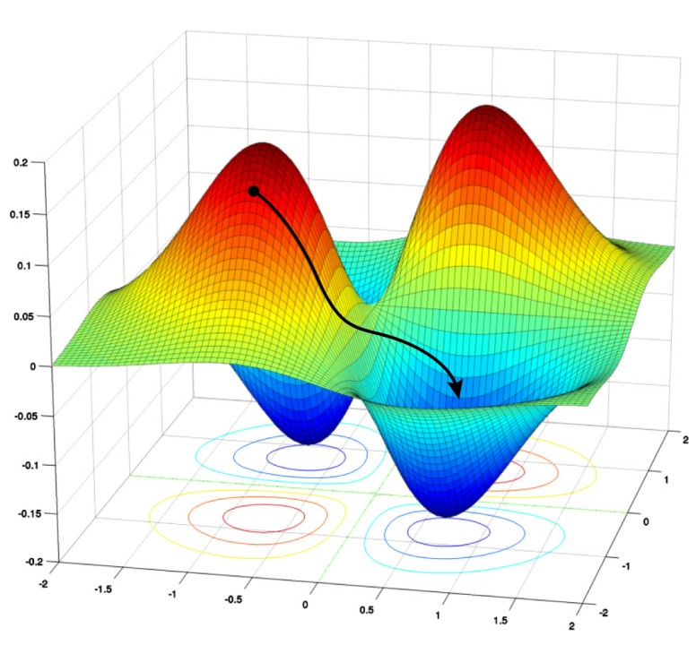
</div>

Aşağıda, farklı optimizasyon algoritması türlerini matematiksel formülasyonlarıyla birlikte inceleyeceğiz.

---

## Gradyan İnişi (Gradient Descent - GD)

**Matematiksel Formülasyon**

Gradyan İnişi (Gradient Descent), model parametrelerini $ \theta $, kayıp fonksiyonu $ J(\theta) $'nın gradyanını kullanarak yinelemeli bir şekilde günceller:

$$
\theta = \theta - \alpha \nabla J(\theta)
$$

<div style="text-align: center;display:flex; justify-content: center; margin-bottom: 20px; ">
    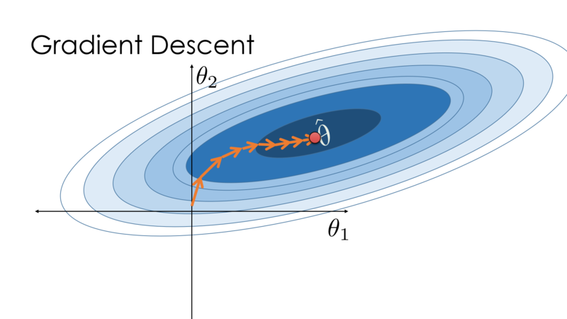
</div>

burada:

- $ \alpha $ öğrenme oranıdır (learning rate)
- $ \nabla J(\theta) $ kayıp fonksiyonunun gradyanıdır

**Özellikler**

- Gradyanı tüm veri kümesi üzerinde hesaplar
- Büyük veri kümeleri için yavaştır
- Yerel minimumlara (local minima) takılma eğilimindedir

---

## Stokastik Gradyan İnişi (Stochastic Gradient Descent - SGD)

Gradyan inişi, büyük veri kümelerinde zorlanır; bu da stokastik gradyan inişini (Stochastic Gradient Descent - SGD) daha iyi bir alternatif haline getirir. Standart gradyan inişinden farklı olarak SGD, model parametrelerini küçük, rastgele seçilmiş veri grupları (mini-batch) kullanarak günceller ve böylece hesaplama verimliliğini artırır.

SGD, $ w $ parametrelerini ve $ \alpha $ öğrenme oranını başlatır, ardından her yinelemede verileri karıştırarak mini-gruplara göre güncelleme yapar. Bu, gürültü ekleyerek yakınsama için daha fazla yineleme gerektirir, ancak yine de tam grup gradyan inişine (full-batch gradient descent) kıyasla toplam hesaplama süresini azaltır.

Hızın önemli olduğu büyük veri kümeleri için SGD, toplu gradyan inişine (batch gradient descent) tercih edilir.

**Matematiksel Formülasyon**

SGD, gradyanı tüm veri kümesi yerine tek bir veri noktası kullanarak hesaplar:

$$
\theta = \theta - \alpha \nabla J(\theta; x_i, y_i)
$$

<div style="text-align: center;display:flex; justify-content: center; margin-bottom: 20px; ">
    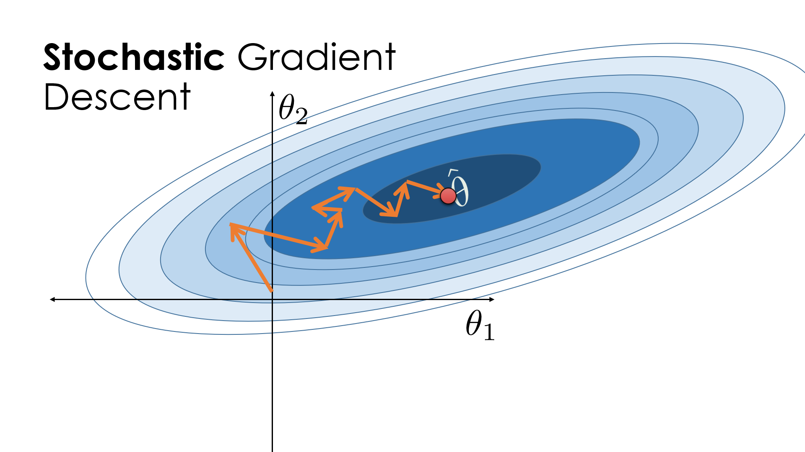
</div>

burada $ x_i, y_i $ tek bir eğitim örneğidir.

**Özellikler**

- Tam grup gradyan inişinden daha hızlıdır
- Güncellemelerde yüksek varyans (variance) vardır
- Yerel minimumlardan kaçmaya yardımcı olabilecek gürültü ekler

---

## Momentumlu Stokastik Gradyan İnişi (Stochastic Gradient Descent with Momentum - SGD-Momentum)

SGD gürültülü bir optimizasyon yolu izler, daha fazla yineleme ve daha uzun hesaplama süresi gerektirir. Yakınsamayı hızlandırmak için momentumlu SGD kullanılır.

<div style="text-align: center;display:flex; justify-content: center; margin-bottom: 20px; ">
    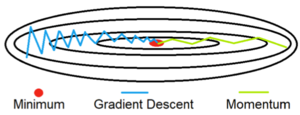
</div>

Momentum (momentum), önceki güncellemenin bir kısmını mevcut güncellemeye ekleyerek güncellemeleri stabilize etmeye yardımcı olur, salınımları azaltır ve yakınsamayı hızlandırır. Ancak, yüksek bir momentum terimi, optimal minimumun aşılmasını önlemek için öğrenme oranının düşürülmesini gerektirir.

<div style="text-align: center;display:flex; justify-content: center; margin-bottom: 20px; ">
    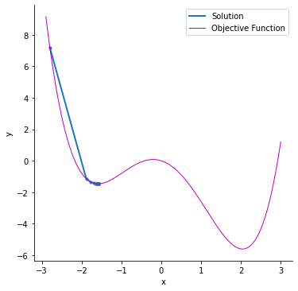
    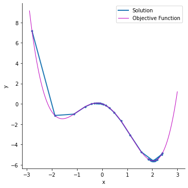
</div>

Momentum hızı artırırken, çok fazla momentum kararsızlığa ve düşük doğruluğa neden olabilir. Etkili optimizasyon için uygun ayar (tuning) yapılması esastır.

**Matematiksel Formülasyon**

Momentum, bir hız terimi (velocity term) tutarak SGD'yi hızlandırmaya yardımcı olur:

$$
v_t = \beta v_{t-1} + (1 - \beta) \nabla J(\theta)
$$

$$
\theta = \theta - \alpha v_t
$$

burada:

- $ v_t $ momentum terimidir
- $ \beta $ momentum katsayısıdır (genellikle 0.9)

**Özellikler**

- Salınımları azaltır
- Daha hızlı yakınsama

---

## Mini-Grup Gradyan İnişi (Mini-Batch Gradient Descent)

Mini-grup gradyan inişi (Mini-Batch Gradient Descent), tüm veri kümesi yerine bir veri alt kümesi kullanarak eğitimi optimize eder ve gereken yineleme sayısını azaltır. Bu, onu hem stokastik hem de toplu gradyan inişinden daha hızlı kılarken daha verimli ve bellek dostu yapar.

<div style="text-align: center;display:flex; justify-content: center; margin-bottom: 20px; ">
    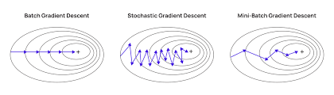
</div>

**Başlıca Avantajlar**

- SGD'ye kıyasla gürültüyü azaltarak ancak toplu gradyan inişinden daha dinamik güncellemeler tutarak hız ve doğruluk arasında denge kurar.
- Tüm verileri belleğe yüklemeyi gerektirmez, uygulama verimliliğini artırır.

**Sınırlamalar**

- Optimum doğruluk için mini-grup boyutunun (genellikle 32) ayarlanmasını gerektirir.
- Bazı durumlarda düşük nihai doğruluğa yol açabilir ve alternatif yaklaşımlar gerektirebilir.

**Matematiksel Formülasyon**

$$
\theta = \theta - \alpha \frac{1}{m} \sum\limits_{i=1}^{m} \nabla J(\theta; x_i, y_i)
$$

Mini-grup GD, tüm veri kümesi veya tek bir örnekle güncelleme yapmak yerine $ m $ örnekten oluşan küçük bir grup kullanır:

---

## Adagrad (Uyarlamalı Gradyan İnişi - Adaptive Gradient Descent)

Adagrad, diğer gradyan inişi algoritmalarından farklı olarak her yineleme için benzersiz bir öğrenme oranı kullanır ve parametre değişikliklerine göre ayarlama yapar. Daha büyük parametre güncellemeleri daha küçük öğrenme oranı ayarlamalarına yol açar; bu da onu hem seyrek (sparse) hem de yoğun (dense) özelliklere sahip veri kümeleri için etkili kılar.

<div style="text-align: center;display:flex; justify-content: center; margin-bottom: 20px; ">
    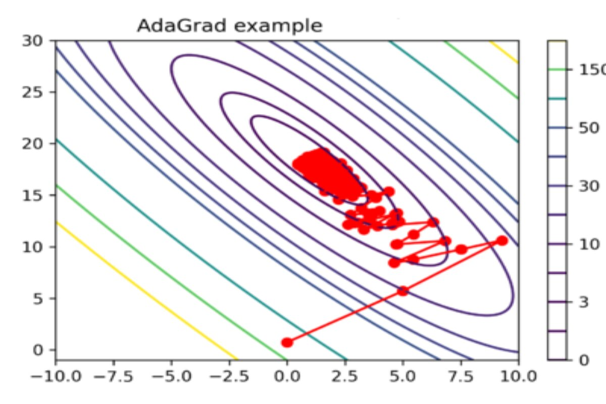
</div>

**Başlıca Avantajlar**

- Otomatik olarak uyum sağlayarak manuel öğrenme oranı ayarlamasını ortadan kaldırır.
- Standart gradyan inişi yöntemlerine kıyasla daha hızlı yakınsama.

**Sınırlamalar**

- Zaman içinde öğrenme oranını agresif bir şekilde düşürür, bu da öğrenmeyi yavaşlatabilir ve doğruluğu olumsuz etkileyebilir.
- Paydadaki karesel gradyanların birikmesi, öğrenme oranının çok küçük olmasına neden olarak daha fazla model iyileştirmesini sınırlar.

**Matematiksel Formülasyon**

Adagrad, her parametre için öğrenme oranlarını uyarlar:

$$
\theta = \theta - \frac{\alpha}{\sqrt{G_{t} + \epsilon}} \nabla J(\theta)
$$

burada $ G_t $ geçmiş karesel gradyanları biriktirir:

$$
G_t = G_{t-1} + \nabla J(\theta)^2
$$

**Özellikler**

- Seyrek veriler için uygundur
- Öğrenme oranı zamanla azalır

---

## RMSprop (Kök Ortalama Kare Yayılımı - Root Mean Square Propagation)

RMSProp, büyük gradyan dalgalanmalarını önleyerek adım boyutlarını ağırlık başına uyarlar ve kararlılığı artırır. Öğrenme oranlarını dinamik olarak ayarlamak için karesel gradyanların hareketli ortalamasını (moving average) tutar.

**Matematiksel Formülasyon**

$$
G_t = \beta G_{t-1} + (1 - \beta) \nabla J(\theta)^2
$$

$$
\theta = \theta - \frac{\alpha}{\sqrt{G_{t} + \epsilon}} \nabla J(\theta)
$$

**Avantajlar**

- Daha yumuşak güncellemelerle daha hızlı yakınsama.
- Diğer gradyan inişi varyantlarına göre daha az ayar gerektirir.
- Aşırı öğrenme oranı düşüşünü önleyerek Adagrad'dan daha kararlıdır.

** Dezavantajlar**

- Manuel öğrenme oranı ayarlaması gerektirir ve varsayılan değerler her zaman optimal olmayabilir.

---

## AdaDelta

**Matematiksel Formülasyon**

AdaDelta, geçmiş karesel gradyanların üstel olarak azalan ortalamasını kullanarak Adagrad'ı değiştirir:

$$
\Delta \theta_t = - \frac{\sqrt{E[\Delta \theta^2] + \epsilon}}{\sqrt{E[g^2] + \epsilon}} g_t
$$

burada $ E[\cdot] $ hareketli ortalamadır (moving average).

**Özellikler**

- Adagrad'daki azalan öğrenme oranları sorununu ele alır
- Manuel olarak bir öğrenme oranı belirlemeye gerek yoktur

---

## Adam (Uyarlamalı Moment Tahmini - Adaptive Moment Estimation)

Adam (Adaptive Moment Estimation), her ağırlık için öğrenme oranlarını dinamik olarak ayarlayarak SGD'yi genişleten, yaygın olarak kullanılan bir derin öğrenme optimizasyon algoritmasıdır. Uyarlamalı öğrenme oranları ve kararlı güncellemeleri dengelemek için AdaGrad ve RMSProp'u birleştirir.

**Matematiksel Formülasyon**

Adam, momentum ve RMSprop'u birleştirir:

$$
m_t = \beta_1 m_{t-1} + (1 - \beta_1) \nabla J(\theta)
$$

$$
v_t = \beta_2 v_{t-1} + (1 - \beta_2) \nabla J(\theta)^2
$$

$$
\theta = \theta - \alpha \frac{\hat{m_t}}{\sqrt{\hat{v_t}} + \epsilon}
$$

burada $ \hat{m_t} $ ve $ \hat{v_t} $ bias düzeltmeli (bias-corrected) tahminlerdir.

**Temel Özellikler**

- Gradyanların birinci (ortalama) ve ikinci (varyans) momentlerini kullanır.
- Minimum ayarla daha hızlı yakınsama.
- Düşük bellek kullanımı ve verimli hesaplama.

** Dezavantajlar**

- Hızı genellemeden (generalization) öncelikli tutar; bu nedenle SGD bazı durumlar için daha iyidir.
- Her veri kümesi için her zaman ideal olmayabilir.

Adam, birçok derin öğrenme görevi için varsayılan seçimdir ancak veri kümesine ve eğitim gereksinimlerine göre seçilmelidir.

<br/>

---

## Uygulamalı Optimizasyon Algoritmaları (Hands-on Optimizers)

### Gerekli Kütüphaneleri İçe Aktarma

```python
import keras
from keras.datasets import mnist
from keras.models import Sequential
from keras.layers import Dense, Dropout, Flatten
from keras.layers import Conv2D, MaxPooling2D
from keras import backend as K
(x_train, y_train), (x_test, y_test) = mnist.load_data()
print(x_train.shape, y_train.shape)
```

### Veri Kümesini Yükleme

```python
x_train= x_train.reshape(x_train.shape[0],28,28,1)
x_test=  x_test.reshape(x_test.shape[0],28,28,1)
input_shape=(28,28,1)
y_train=keras.utils.to_categorical(y_train)#,num_classes=)
y_test=keras.utils.to_categorical(y_test)#, num_classes)
x_train= x_train.astype('float32')
x_test= x_test.astype('float32')
x_train /= 255
x_test /=255
```

### Modeli Oluşturma

```python
batch_size=64

num_classes=10

epochs=10

def build_model(optimizer):

    model=Sequential()

    model.add(Conv2D(32,kernel_size=(3,3),activation='relu',input_shape=input_shape))

    model.add(MaxPooling2D(pool_size=(2,2)))

    model.add(Dropout(0.25))

    model.add(Flatten())

    model.add(Dense(256, activation='relu'))

    model.add(Dropout(0.5))

    model.add(Dense(num_classes, activation='softmax'))

    model.compile(loss=keras.losses.categorical_crossentropy, optimizer= optimizer, metrics=['accuracy'])

    return model
```

### Modeli Eğitme

```python
optimizers = ['Adadelta', 'Adagrad', 'Adam', 'RMSprop', 'SGD']

for i in optimizers:

model = build_model(i)

hist=model.fit(x_train, y_train, batch_size=batch_size, epochs=epochs, verbose=1, validation_data=(x_test,y_test))
```

---

## Tablo Analizi (Table Analysis)

| Optimizasyon Algoritması | 1. Devir (Doğruluk | Kayıp) | 5. Devir (Doğruluk | Kayıp) | 10. Devir (Doğruluk | Kayıp) | Toplam Süre |
| ------------------------ | ----------------- | ------ | ----------------- | ------ | ------------------ | ------ | ----------- |
| Adadelta                 | .4612             | 2.2474 | .7776             | 1.6943 | .8375              | 0.9026 | 8:02 dk     |
| Adagrad                  | .8411             | .7804  | .9133             | .3194  | .9286              | 0.2519 | 7:33 dk     |
| Adam                     | .9772             | .0701  | .9884             | .0344  | .9908              | .0297  | 7:20 dk     |
| RMSprop                  | .9783             | .0712  | .9846             | .0484  | .9857              | .0501  | 10:01 dk    |
| SGD with momentum        | .9168             | .2929  | .9585             | .1421  | .9697              | .1008  | 7:04 dk     |
| SGD                      | .9124             | .3157  | .9569             | 1.451  | .9693              | .1040  | 6:42 dk     |

Yukarıdaki tablo, farklı devirlerdeki (epoch) doğrulama doğruluğunu ve kaybını göstermektedir. Ayrıca, modelin her bir optimizasyon algoritması için 10 devir boyunca çalışması için geçen toplam süreyi de içerir. Yukarıdaki tablodan aşağıdaki analizleri yapabiliriz.

- Adam optimizasyon algoritması, tatmin edici bir sürede en iyi doğruluğu göstermektedir.
- RMSprop, Adam'a benzer doğruluk gösterir ancak karşılaştırmalı olarak çok daha fazla hesaplama süresi gerektirir.
- Şaşırtıcı bir şekilde, SGD algoritması eğitim için en az süreyi almış ve iyi sonuçlar üretmiştir. Ancak Adam optimizasyon algoritmasının doğruluğuna ulaşmak için SGD daha fazla yineleme gerektirecek ve dolayısıyla hesaplama süresi artacaktır.
- Momentumlu SGD, beklenmedik şekilde daha büyük bir hesaplama süresiyle SGD'ye benzer doğruluk gösterir. Bu, kullanılan momentum değerinin optimize edilmesi gerektiği anlamına gelir.
- Adadelta, hem doğruluk hem de hesaplama süresi açısından zayıf sonuçlar göstermektedir.

<div style="text-align: center;display:flex; justify-content: center; margin-bottom: 20px; ">
    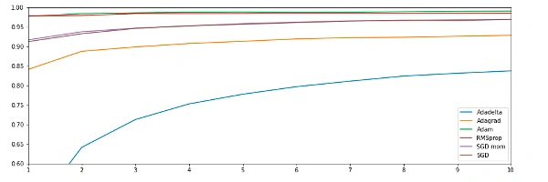
</div>

Yukarıdaki grafikten her bir optimizasyon algoritmasının her devirdeki doğruluğunu analiz edebilirsiniz.

---

## Sonuç (Conclusion)

<div style="text-align: center;display:flex; justify-content: center; margin-bottom: 20px; ">
    
</div>

<div style="text-align: center;display:flex; justify-content: center; margin-bottom: 20px; ">
    
</div>

Farklı optimizasyon algoritmaları, veri kümesine ve model mimarisine bağlı olarak benzersiz avantajlar sunar. SGD en basitiyken, Adam uyarlamalı öğrenme oranı ve momentumu nedeniyle derin öğrenme görevlerinde sıklıkla tercih edilir.

Bu optimizasyon algoritmalarını anlayarak, derin öğrenme modellerini optimum performans için ince ayar yapabilirsiniz!

<br/>
<br/>

---

# Sinir Ağlarında Ek Katman Türleri (Additional Layer Types in Neural Networks)

Derin öğrenmede, farklı katman türleri (layer types) belirli amaçlara hizmet eder ve sinir ağlarının karmaşık temsiller öğrenmesine yardımcı olur. Bu bölüm, çeşitli katman türlerini, matematiksel temellerini ve pratik uygulamalarını incelemektedir.

## Yoğun Katman (Dense Layer - Tam Bağlantılı Katman)

**Yoğun katman (Dense layer)**, her bir nöronun bir önceki katmandaki her nörona bağlı olduğu temel bir katmandır.

<div style="text-align: center;display:flex; justify-content: center; margin-bottom: 20px; ">
    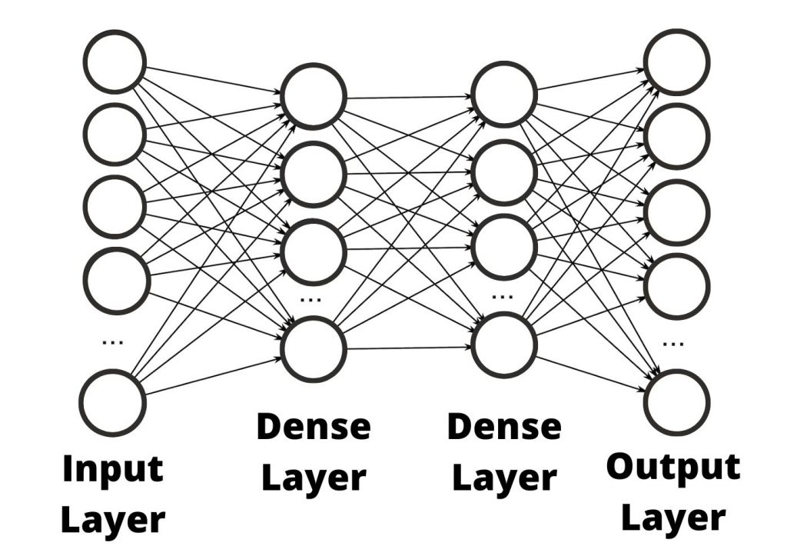
</div>

**Matematiksel Gösterim:**

$ n $ boyutunda bir girdi vektörü $ x $, $ m \times n $ boyutunda ağırlıklar $ W $ ve $ m $ boyutunda bias $ b $ verildiğinde, çıktı $ y $ şu şekilde hesaplanır:

$$
y = f(Wx + b)
$$

burada $ f $, ReLU, Sigmoid veya Softmax gibi bir aktivasyon fonksiyonudur (activation function).

**TensorFlow'da Uygulama:**

```python
import tensorflow as tf
from tensorflow.keras.models import Sequential
from tensorflow.keras.layers import Dense

model = Sequential([
    Dense(64, activation='relu', input_shape=(100,)),
    Dense(32, activation='relu'),
    Dense(10, activation='softmax')
])
model.summary()
```

---

## Evrişimsel Katman (Convolutional Layer - Conv2D)

**Evrişimsel katman (Convolutional layer)**, görüntü işlemede kullanılır ve girdi görüntülerinden özellikler (features) çıkarmak için filtreler (kernel) uygular.

<div style="text-align: center;display:flex; justify-content: center; margin-bottom: 20px; ">
    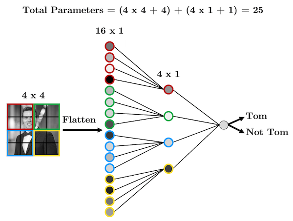
</div>

**Matematiksel Gösterim:**

Bir girdi görüntüsü $ I $ ve bir filtre $ K $ için evrişim (convolution) işlemi şu şekilde tanımlanır:

$$
S(i, j) = \sum_m \sum_n I(i+m, j+n) K(m, n)
$$

**TensorFlow'da Uygulama:**

```python
from tensorflow.keras.layers import Conv2D

model = Sequential([
    Conv2D(32, kernel_size=(3,3), activation='relu', input_shape=(28,28,1)),
    Conv2D(64, kernel_size=(3,3), activation='relu'),
])
model.summary()
```

---

## Havuzlama Katmanı (Pooling Layer - MaxPooling & AveragePooling)

Havuzlama katmanları (pooling layers), önemli özellikleri korurken boyutsallığı (dimensionality) azaltır.

<div style="text-align: center;display:flex; justify-content: center; margin-bottom: 20px; ">
    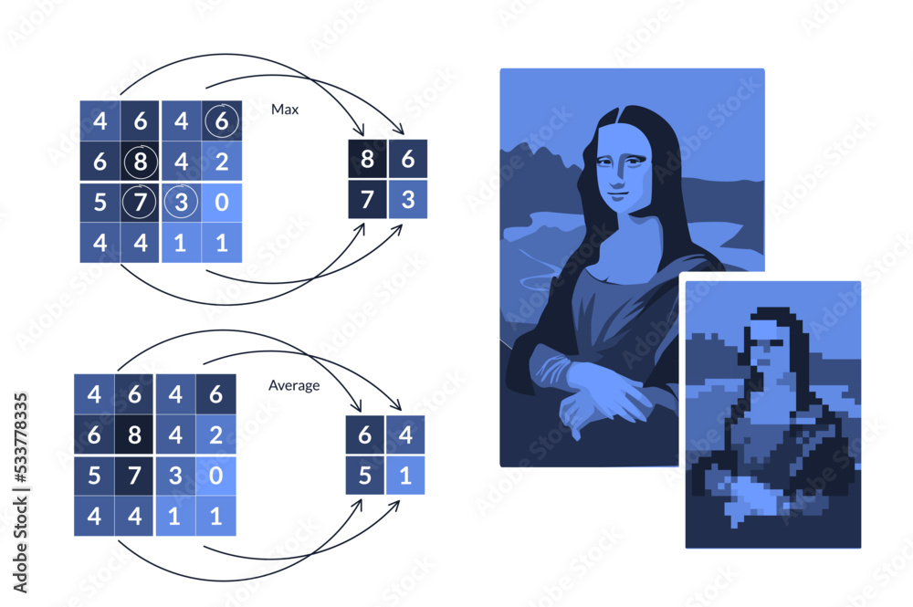
</div>

**Maksimum Havuzlama (Max Pooling):**

$$
S(i, j) = \max (I_{region})
$$

**Ortalama Havuzlama (Average Pooling):**

$$
S(i, j) = \frac{1}{N} \sum I_{region}
$$

**Uygulama:**

```python
from tensorflow.keras.layers import MaxPooling2D, AveragePooling2D

model = Sequential([
    MaxPooling2D(pool_size=(2,2)),
    AveragePooling2D(pool_size=(2,2))
])
model.summary()
```

---

## Tekrarlayan Katman (Recurrent Layer - RNN, LSTM, GRU)

Tekrarlayan katmanlar (recurrent layers), geçmiş girdilerin hafızasını tutarak sıralı verileri (sequential data) işler.

<div style="text-align: center;display:flex; justify-content: center; margin-bottom: 20px; ">
    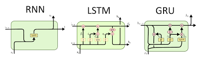
</div>

### RNN Matematiksel Modeli:

$$
h_t = f(W_h h_{t-1} + W_x x_t + b)
$$

### LSTM Güncelleme Denklemleri:

$$
i_t = \sigma(W_i x_t + U_i h_{t-1} + b_i)
$$

$$
f_t = \sigma(W_f x_t + U_f h_{t-1} + b_f)
$$

$$
c_t = f_t c_{t-1} + i_t \tanh(W_c x_t + U_c h_{t-1} + b_c)
$$

**Uygulama:**

```python
from tensorflow.keras.layers import SimpleRNN, LSTM, GRU

model = Sequential([
    LSTM(64, return_sequences=True, input_shape=(100, 10)),
    GRU(32)
])
model.summary()
```

---

## Dropout Katmanı (Dropout Layer)

**Dropout katmanı**, aşırı öğrenmeyi (overfitting) önlemek için girdi birimlerinin bir kısmını rastgele 0'a ayarlar.

<div style="text-align: center;display:flex; justify-content: center; margin-bottom: 20px; ">
    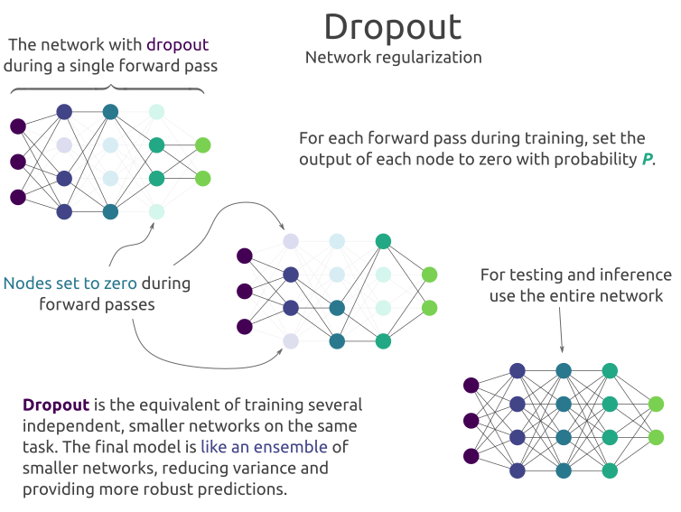
</div>

**Matematiksel Açıklama:**

Eğitim sırasında, her nöron için tutulma olasılığı $ p $'dir:

$$
y = \frac{1}{p} f(Wx + b) \quad \text{nöron tutulursa, aksi halde } y = 0
$$

**Uygulama:**

```python
from tensorflow.keras.layers import Dropout

model = Sequential([
    Dense(128, activation='relu'),
    Dropout(0.5),
    Dense(64, activation='relu'),
    Dropout(0.3),
    Dense(10, activation='softmax')
])
model.summary()
```

---

## Karşılaştırma Tablosu (Comparison Table)

| Katman Türü | Amaç                     | Tipik Kullanım Alanı                |
| ----------- | ------------------------ | ----------------------------------- |
| Dense       | Tam bağlantılı katman    | Genel derin öğrenme modelleri       |
| Conv2D      | Özellik çıkarımı         | Görüntü işleme                      |
| Pooling     | Alt örnekleme            | Boyut küçültmek için CNN'ler        |
| RNN         | Sıralı işleme            | Zaman serileri, NLP                 |
| LSTM/GRU    | Uzun süreli hafıza       | Dil modelleri                       |
| Dropout     | Aşırı öğrenmeyi önleme   | Derin ağlarda düzenlileştirme       |

## Sonuç (Conclusion)

Farklı katman türlerini anlamak, etkili derin öğrenme modelleri tasarlamada çok önemlidir. Veri türüne ve problem alanına göre doğru katmanları seçmek, model performansını önemli ölçüde etkiler. Bu katmanların kombinasyonlarıyla denemeler yapmak, sonuçları optimize etmenin anahtarıdır.
