# Lojistik Regresyon ile Sınıflandırma (Classification with Logistic Regression)

<!-- toc -->

## 1. Sınıflandırmaya Giriş (Introduction to Classification)

Sınıflandırma (classification), sürekli değerler yerine **kesikli kategorileri** tahmin etmeyi amaçlayan bir denetimli öğrenme (supervised learning) problemidir. Sayısal değerler tahmin eden regresyonun aksine, sınıflandırma veri noktalarını **etiketlere veya sınıflara** atar.

### **Sınıflandırma ve Regresyon (Classification vs. Regression)**

    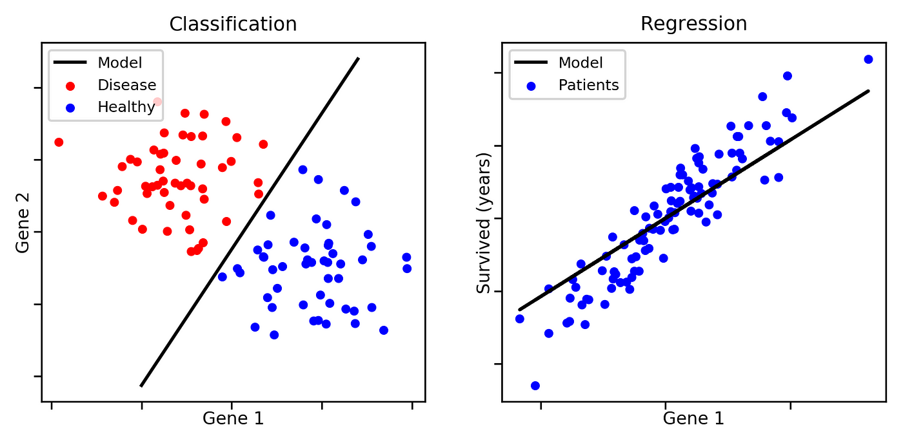

| Özellik (Feature)    | Regresyon (Regression)   | Sınıflandırma (Classification) |
| -------------------- | ------------------------ | ------------------------------ |
| Çıktı Türü           | Sürekli (Continuous)     | Kesikli (Discrete)             |
| Örnek                | Ev fiyatları tahmini     | E-posta spam tespiti           |
| Algoritma Örneği     | Doğrusal Regresyon       | Lojistik Regresyon             |

### **Sınıflandırma Problemlerine Örnekler (Examples of Classification Problems)**

- **E-posta Spam Tespiti**: E-postaları "spam" veya "spam değil" olarak sınıflandırma.
- **Tıbbi Teşhis**: Bir hastanın bir hastalığa sahip olup olmadığını belirleme (evet/hayır).
- **Kredi Kartı Dolandırıcılık Tespiti**: Bir işlemin dolandırıcılık mı yoksa meşru mu olduğunu belirleme.
- **Görüntü Tanıma**: Görüntüleri "kedi" veya "köpek" olarak sınıflandırma.

Sınıflandırma modelleri şunlar olabilir:

- **İkili Sınıflandırma (Binary Classification)**: Yalnızca iki olası sonuç (örneğin, spam veya spam değil).
- **Çok Sınıflı Sınıflandırma (Multi-class Classification)**: İkiden fazla olası sonuç (örneğin, el yazısı rakamları 0-9 arasında sınıflandırma).

 

---

## 2. Lojistik Regresyon (Logistic Regression)

### **Lojistik Regresyona Giriş (Introduction to Logistic Regression)**

Lojistik regresyon (logistic regression), ikili sınıflandırma (binary classification) problemleri için kullanılan istatistiksel bir modeldir. Sürekli değerler tahmin eden doğrusal regresyonun aksine, lojistik regresyon kesikli sınıf etiketlerine eşlenen olasılıkları tahmin eder.

Doğrusal regresyon (linear regression) sınıflandırma için makul bir yaklaşım gibi görünebilir, ancak önemli sınırlamaları vardır:

1. **Sınırsız Çıktı (Unbounded Output)**: Doğrusal regresyon, herhangi bir gerçek değeri alabilen çıktılar üretir; bu, tahminlerin **negatif** veya **1'den büyük** olabileceği anlamına gelir ki bu, olasılık tabanlı sınıflandırma için anlamsızdır.

    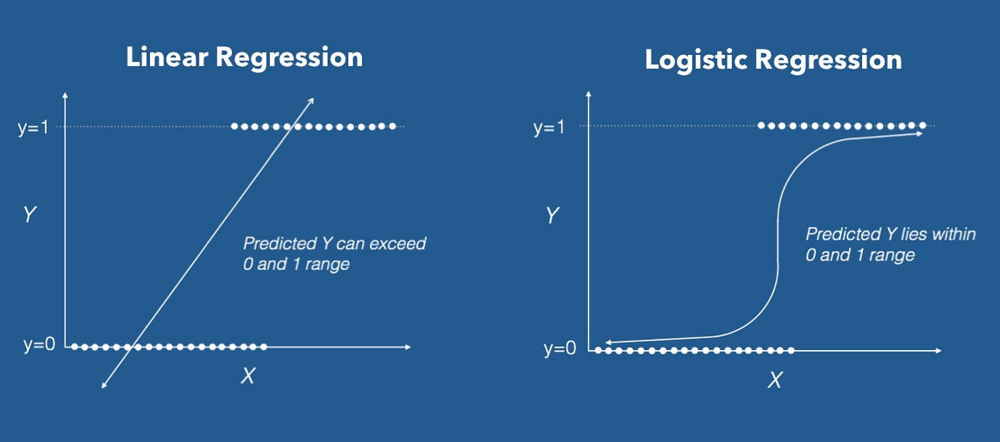

2. **Zayıf Karar Sınırları (Poor Decision Boundaries)**: Sınıflandırma için doğrusal bir fonksiyon kullanırsak, veri setindeki uç değerler karar sınırını (decision boundary) bozarak yanlış sınıflandırmalara yol açabilir.

    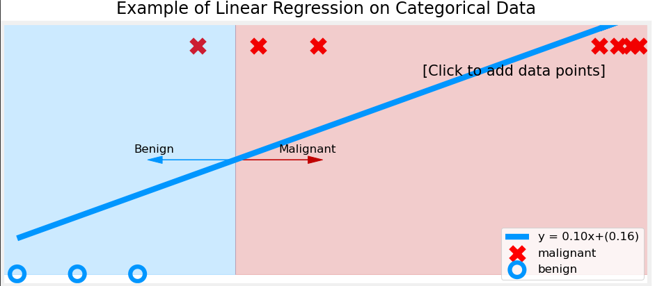
    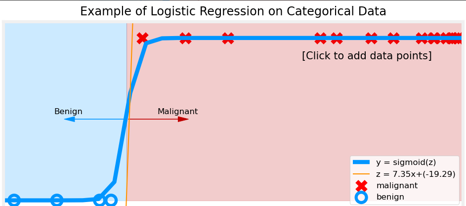

Bu sorunları çözmek için, çıktıları **0 ile 1** arasında bir olasılık aralığına dönüştürmek üzere **sigmoid fonksiyonunu** (sigmoid function) uygulayan **lojistik regresyonu** kullanırız.

---

### **Sigmoid Fonksiyonuna Neden İhtiyacımız Var? (Why Do We Need the Sigmoid Function?)**

**Sigmoid fonksiyonu**, lojistik regresyonun temel bir bileşenidir. Çıktıların her zaman **0 ile 1** arasında kalmasını sağlayarak bunların olasılık olarak yorumlanabilmesini mümkün kılar.

Müşteri davranışına göre bir işlemin dolandırıcılık (1) veya meşru (0) olup olmadığını tahmin eden bir **dolandırıcılık tespit sistemi** düşünelim. Doğrusal bir model kullandığımızı varsayalım:

$$
y = \theta_0 + \theta_1 x_1 + \theta_2 x_2
$$

    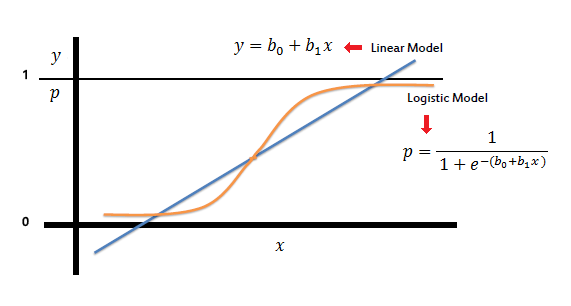

Bazı işlemler için çıktı **y = 7,5** veya **y = -3,2** olabilir; bu değerler olasılık değerleri olarak anlamlı değildir. Bunun yerine, herhangi bir gerçel sayıyı geçerli bir olasılık aralığına sıkıştırmak için **sigmoid fonksiyonunu** kullanırız:

$$
h_{\theta}(x) = \frac{1}{1 + e^{-\theta^T x}}
$$

Bu fonksiyon şunları eşler:

- Büyük pozitif değerleri **1'e** yakın olasılıklara (dolandırıcılık işlemi).
- Büyük negatif değerleri **0'a** yakın olasılıklara (meşru işlem).
- **0'a** yakın değerleri **0,5'e** yakın olasılıklara (belirsiz sınıflandırma).

---

### **Sigmoid Fonksiyonu ve Olasılık Yorumu (Sigmoid Function and Probability Interpretation)**

Sigmoid fonksiyonunun çıktısı şu şekilde yorumlanabilir:

- **$ h_θ(x) \approx 1 $** → Model **Sınıf 1'i** tahmin eder (örneğin, spam e-posta, dolandırıcılık işlemi).
- **$ h_θ(x) \approx 0 $** → Model **Sınıf 0'ı** tahmin eder (örneğin, spam olmayan e-posta, meşru işlem).

Nihai sınıflandırma kararı için bir **eşik değeri** (threshold) (genellikle 0,5) uygularız:

$$
\hat{y} =
\begin{cases}
1, & \text{eğer } h_{\theta}(x) \geq 0,5 \\
0, & \text{eğer } h_{\theta}(x) < 0,5
\end{cases}
$$

Bu şu anlama gelir:

- Olasılık **≥ 0,5** ise, girdiyi **1 (pozitif sınıf)** olarak sınıflandırırız.
- Olasılık **< 0,5** ise, girdiyi **0 (negatif sınıf)** olarak sınıflandırırız.

---

### **Karar Sınırı (Decision Boundary)**

**Karar sınırı** (decision boundary), lojistik regresyonda farklı sınıfları ayıran yüzeydir. Modelin **0,5** olasılığı tahmin ettiği noktadır; yani modelin sınıflandırma konusunda eşit derecede belirsiz olduğu noktadır.

Lojistik regresyon, **sigmoid fonksiyonunu** kullanarak olasılıklar ürettiğinden, karar sınırını matematiksel olarak şu şekilde tanımlarız:

$$
h_{\theta}(x) = \frac{1}{1 + e^{-\theta^T x}} = 0,5
$$

Sigmoid fonksiyonunun tersini alarak şunu elde ederiz:

$$
\theta^T x = 0
$$

Bu denklem, karar sınırını özellik uzayında (feature space) **doğrusal bir fonksiyon** olarak tanımlar.

---

#### **Karar Sınırını Örneklerle Anlamak (Understanding the Decision Boundary with Examples)**

##### **1. Tek Özellik Durumu (1B) (Single Feature Case)**

Yalnızca **bir özelliğimiz** $ x_1 $ varsa, model denklemi şöyledir:

$$
\theta_0 + \theta_1 x_1 = 0
$$

$ x_1 $ için çözersek:

$$
x_1 = -\frac{\theta_0}{\theta_1}
$$

Bu, $ x_1 $ bu eşiği geçtiğinde modelin **Sınıf 0'dan** **Sınıf 1'e** geçtiği anlamına gelir.

    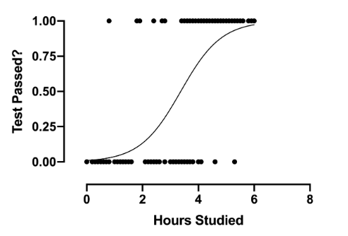

**Örnek:**
Bir öğrencinin çalışma saatlerine ($ x_1 $) göre geçip kalacağını tahmin ettiğimizi düşünelim:

- Eğer $ x_1 < 5 $ saat → Kalır (Sınıf 0).
- Eğer $ x_1 \geq 5 $ saat → Geçer (Sınıf 1).

Bu durumda karar sınırı basitçe $ x_1 = 5 $'tir.

---

##### **2. İki Özellik Durumu (2B) (Two Features Case)**

**İki özellik** $ x_1 $ ve $ x_2 $ için karar sınırı denklemi şöyle olur:

$$
\theta_0 + \theta_1 x_1 + \theta_2 x_2 = 0
$$

Yeniden düzenlersek:

$$
x_2 = -\frac{\theta_0}{\theta_2} - \frac{\theta_1}{\theta_2} x_1
$$

Bu, iki sınıfı **2B düzlemde** ayıran **düz bir çizgiyi** temsil eder.

    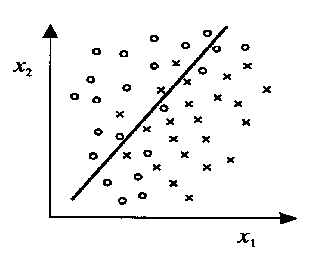

**Örnek:**
Öğrencileri **çalışma saatlerine ($ x_1 $)** ve **uyku saatlerine ($ x_2 $)** göre geçen (1) veya kalan (0) olarak sınıflandırdığımızı varsayalım:

- Karar sınırı şöyle olabilir:
  $$
  x_2 = -2 - 0,5 x_1
  $$
- Eğer $ x_2 $ çizginin üzerindeyse, **geçer** olarak sınıflandır.
- Eğer $ x_2 $ çizginin altındaysa, **kalır** olarak sınıflandır.

---

##### **3. İki Özellik Durumu (3B) (Two Features Case)**

**Üç özelliğe** $ x_1 $, $ x_2 $ ve $ x_3 $ geçtiğimizde, karar sınırı üç boyutlu uzayda bir **düzlem** (plane) haline gelir:

$$
\theta_0 + \theta_1 x_1 + \theta_2 x_2 + \theta_3 x_3 = 0
$$

$ x_3 $ için yeniden düzenlersek:

$$
x_3 = -\frac{\theta_0}{\theta_3} - \frac{\theta_1}{\theta_3} x_1 - \frac{\theta_2}{\theta_3} x_2
$$

Bu denklem, 3B uzayı iki bölgeye ayıran **düz bir düzlemi** temsil eder; bir bölge **Sınıf 1** ve diğeri **Sınıf 0** içindir.

    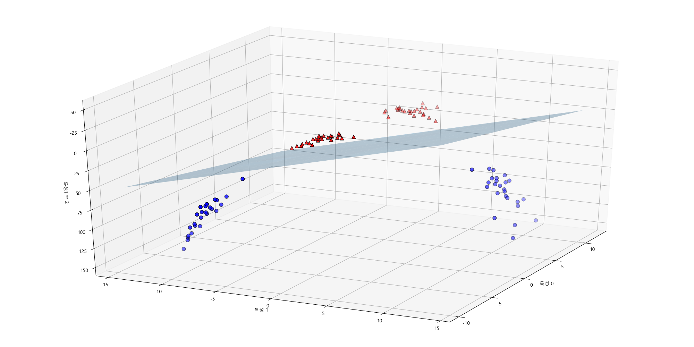

**Örnek:**  
Bir şirketin aşağıdakilere göre **kârlı (1) veya kârsız (0)** olacağını tahmin ettiğimizi düşünelim:

- **Pazarlama Bütçesi** ($ x_1 $)
- **Ar-Ge Yatırımı** ($ x_2 $)
- **Çalışan Sayısı** ($ x_3 $)

Karar sınırı, 3B uzayda kârlı ve kârsız şirketleri ayıran bir **düzlem** olacaktır.

Genel olarak, **n özellik** için karar sınırı, n-boyutlu uzayda bir **hiper düzlemdir** (hyperplane).

---

##### **4. Doğrusal Olmayan Karar Sınırları Derinlemesine (Non-Linear Decision Boundaries in Depth)**

Şu ana kadar **lojistik regresyonun** **doğrusal** karar sınırları oluşturduğunu gördük. Ancak, birçok gerçek dünya problemi **doğrusal olmayan** (non-linear) ilişkilere sahiptir. Bu gibi durumlarda, düz bir çizgi (veya düzlem) sınıfları ayırmak için **yeterli değildir**.

**Karmaşık karar sınırlarını** yakalamak için **polinom özellikleri** (polynomial features) veya **özellik dönüşümleri** (feature transformations) ekleriz.

###### **Örnek 1: Dairesel Karar Sınırı (Circular Decision Boundary)**

Veri **dairesel bir sınır** gerektiriyorsa, ikinci dereceden terimler kullanabiliriz:

$$
\theta_0 + \theta_1 x_1^2 + \theta_2 x_2^2 = 0
$$

Bu, 2B uzayda bir **daireyi** temsil eder.

    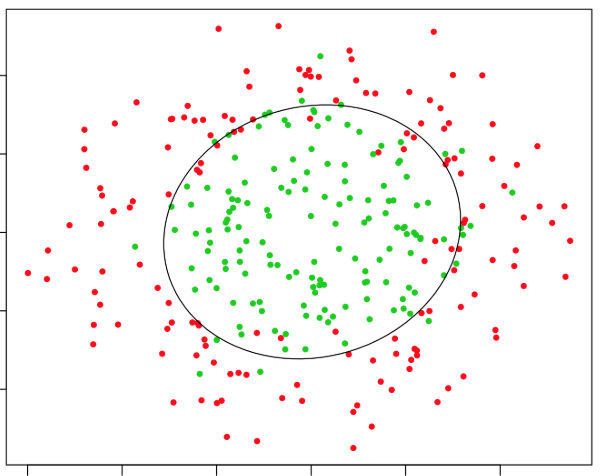

Örneğin:

- Eğer $ x_1 $ ve $ x_2 $ noktaların koordinatlarıysa, şöyle bir karar sınırı:

  $$
  x_1^2 + x_2^2 = 4
  $$

  **yarıçapı 2 olan bir dairenin** içindeki noktaları Sınıf 1, dışındakileri Sınıf 0 olarak sınıflandıracaktır.

###### **Örnek 2: Eliptik Karar Sınırı (Elliptical Decision Boundary)**

Daha genel bir ikinci dereceden denklem:

$$
\theta_0 + \theta_1 x_1^2 + \theta_2 x_2^2 + \theta_3 x_1 x_2 = 0
$$

    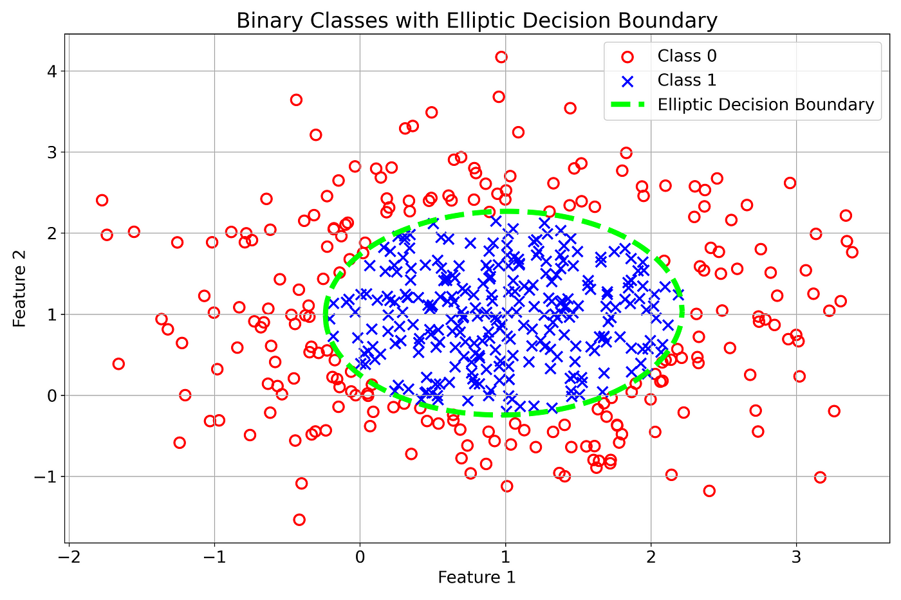

Bu, **eliptik** karar sınırlarına olanak tanır.

###### **Örnek 3: Karmaşık Doğrusal Olmayan Sınırlar (Complex Non-Linear Boundaries)**

Daha da **karmaşık** sınırlar için **daha yüksek dereceli polinom özellikleri** ekleyebiliriz, örneğin:

$$
\theta_0 + \theta_1 x_1 + \theta_2 x_2 + \theta_3 x_1^2 + \theta_4 x_2^2 + \theta_5 x_1 x_2 + \theta_6 x_1^3 + \theta_7 x_2^3 = 0
$$

    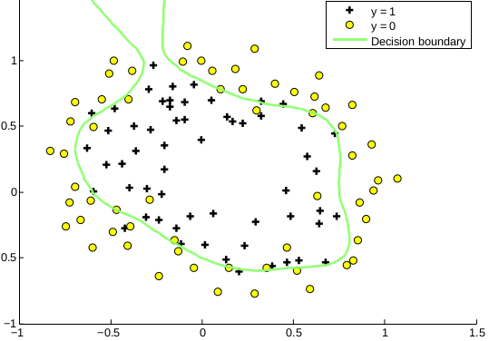

Bu, karar sınırında **bükülmeler ve eğrilikler** sağlayarak lojistik regresyonun **yüksek derecede doğrusal olmayan** desenleri modellemesine olanak tanır.

###### **Doğrusal Olmayan Sınırlar için Özellik Mühendisliği (Feature Engineering for Non-Linear Boundaries)**

- Polinom terimlerini manuel olarak eklemek yerine, **taban fonksiyonlarını** (basis functions) (örneğin, Gauss çekirdekleri veya radyal taban fonksiyonları) kullanarak özellikleri **dönüştürebiliriz**.
- **Özellik haritaları** (feature maps), doğrusal olarak ayrılamayan veriyi, doğrusal bir karar sınırının çalıştığı daha yüksek boyutlu bir uzaya dönüştürebilir.

###### **Doğrusal Olmayan Sınırlar için Lojistik Regresyonun Sınırlamaları (Limitations of Logistic Regression for Non-Linear Boundaries)**

- **Özellik mühendisliği gereklidir**: Sinir ağları veya karar ağaçlarının aksine, lojistik regresyon karmaşık sınırları otomatik olarak öğrenemez.
- **Yüksek dereceli polinomlar aşırı öğrenmeye (overfitting) yol açabilir**: Çok fazla doğrusal olmayan terim, modeli gürültüye karşı hassas hale getirir.

---

### **Önemli Çıkarımlar (Key Takeaways)**

- **3B'de** karar sınırı bir **düzlemdir** ve daha yüksek boyutlarda bir **hiper düzlem** haline gelir.
- **Doğrusal olmayan karar sınırları**, **ikinci dereceden, üçüncü dereceden veya dönüştürülmüş özellikler** kullanılarak oluşturulabilir.
- Lojistik regresyonun doğrusal olarak ayrılamayan problemlerde iyi çalışması için **özellik mühendisliği çok önemlidir**.
- **Çok fazla yüksek dereceli polinom terimi** aşırı öğrenmeye neden olabilir, bu nedenle düzenlileştirme (regularization) gereklidir.

 
 

---

## 3. Lojistik Regresyon için Maliyet Fonksiyonu (Cost Function for Logistic Regression)

### **1. Neden Bir Maliyet Fonksiyonuna İhtiyacımız Var? (Why Do We Need a Cost Function?)**

Doğrusal regresyonda, maliyet fonksiyonu olarak **Ortalama Kare Hatasını** (Mean Squared Error - MSE) kullanırız:

$$
J(\theta) = \frac{1}{m} \sum_{i=1}^{m} (h_θ(x_i) - y_i)^2
$$

Ancak bu maliyet fonksiyonu **lojistik regresyon** için iyi çalışmaz çünkü:

- Lojistik regresyondaki hipotez fonksiyonu, sigmoid fonksiyonu nedeniyle **doğrusal değildir**.
- Kare hatalarının kullanılması, birden çok yerel minimumu olan **dışbükey olmayan** (non-convex) bir fonksiyonla sonuçlanır ve bu da optimizasyonu zorlaştırır.

    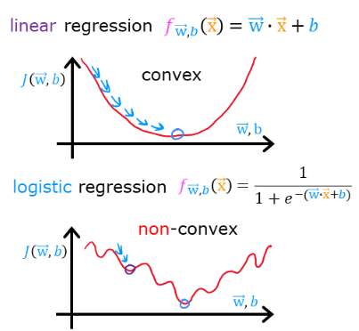

Farklı bir maliyet fonksiyonuna ihtiyacımız var:  
✅ **Sigmoid fonksiyonuyla** iyi çalışmalı.  
✅ **Dışbükey** (convex) olmalı, böylece gradyan inişi (gradient descent) onu verimli bir şekilde en aza indirebilir.

---

### **2. Lojistik Regresyon için Basitleştirilmiş Maliyet Fonksiyonu (Simplified Cost Function for Logistic Regression)**

Kare hataları kullanmak yerine, bir **log-kayıp fonksiyonu** (log loss function) kullanırız:

$$
J(\theta) = -\frac{1}{m} \sum_{i=1}^{m} \left[ y_i \log(h_θ(x_i)) + (1 - y_i) \log(1 - h_θ(x_i)) \right]
$$

Burada:

- $ y_i $ gerçek etikettir (0 veya 1).
- $ h_θ(x_i) $ sigmoid fonksiyonundan elde edilen tahmini olasılıktır.

Bu fonksiyon şunları sağlar:

- **Eğer $ y = 1 $ ise** → İlk terim baskındır: $ -\log(h_θ(x)) $; eğer $ h\_\theta(x) \approx 1 $ (doğru tahmin) ise 0'a yakındır.
- **Eğer $ y = 0 $ ise** → İkinci terim baskındır: $ -\log(1 - h_θ(x)) $; eğer $ h\_\theta(x) \approx 0 $ ise 0'a yakındır.

    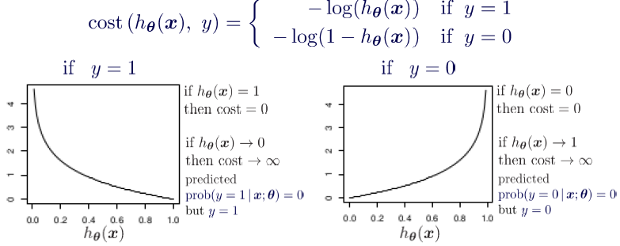

✅ **Yorum**: Fonksiyon, doğru tahminleri ödüllendirirken yanlış tahminleri ağır bir şekilde cezalandırır.

---

### **3. Maliyet Fonksiyonunun Ardındaki Sezgi (Intuition Behind the Cost Function)**

Bunu adım adım inceleyelim:

- **$ y = 1 $** olduğunda, maliyet fonksiyonu şuna indirgenir:

  $$
  -\log(h_θ(x))
  $$

  Bu şu anlama gelir:

  - Eğer $ h_θ(x) \approx 1 $ (doğru tahmin), $ -\log(1) = 0 $ → Cezası yok.
  - Eğer $ h_θ(x) \approx 0 $ (yanlış tahmin), $ -\log(0) \to \infty $ → Yüksek ceza!

- **$ y = 0 $** olduğunda, maliyet fonksiyonu şuna indirgenir:

  $$
  -\log(1 - h_θ(x))
  $$

  Bu şu anlama gelir:

  - Eğer $ h_θ(x) \approx 0 $ (doğru tahmin), $ -\log(1) = 0 $ → Cezası yok.
  - Eğer $ h_θ(x) \approx 1 $ (yanlış tahmin), $ -\log(0) \to \infty $ → Yüksek ceza!

✅ **Önemli Çıkarım**:  
Fonksiyon, yanlış tahminler için çok yüksek cezalar atayarak modelin doğru sınıflandırmaları öğrenmesini teşvik eder.

 
 

---

## 4. Lojistik Regresyon için Gradyan İnişi (Gradient Descent for Logistic Regression)

### **1. Neden Gradyan İnişine İhtiyacımız Var? (Why Do We Need Gradient Descent?)**

Lojistik regresyonda amacımız, **maliyet fonksiyonunu** en aza indiren en iyi **parametreleri** $ \theta $ bulmaktır:

$$
J(\theta) = -\frac{1}{m} \sum_{i=1}^{m} \left[ y_i \log(h_{\theta}(x_i)) + (1 - y_i) \log(1 - h_{\theta}(x_i)) \right]
$$

Doğrusal regresyondaki gibi **kapalı formda bir çözüm** (closed-form solution) olmadığından, minimum maliyete ulaşana kadar $ \theta $'yı yinelemeli olarak güncellemek için **gradyan inişini** (gradient descent) kullanırız.

---

### **2. Gradyan İnişi Algoritması (Gradient Descent Algorithm)**

Gradyan inişi, parametreleri şu kuralı kullanarak günceller:

$$
\theta_j := \theta_j - \alpha \frac{\partial J(\theta)}{\partial \theta_j}
$$

Burada:

- $ \alpha $, **öğrenme oranıdır** (learning rate/adım büyüklüğü).
- $ \frac{\partial J(\theta)}{\partial \theta_j} $, **gradyandır** (en dik artışın yönü).

Lojistik regresyon için maliyet fonksiyonunun türevi şöyledir:

$$
\frac{\partial J(\theta)}{\partial \theta_j} = \frac{1}{m} \sum_{i=1}^{m} (h_{\theta}(x_i) - y_i) x_{ij}
$$

Böylece güncelleme kuralı şu hale gelir:

$$
\theta_j := \theta_j - \alpha \frac{1}{m} \sum_{i=1}^{m} (h_{\theta}(x_i) - y_i) x_{ij}
$$

✅ **Önemli Anlayış:**

- Hatayı hesaplarız: $ h_θ(x_i) - y_i $.
- Bunu $ x_{ij} $ özelliği ile çarparız.
- Tüm eğitim örnekleri üzerinden ortalamasını alırız.
- $ \alpha $ ile ölçeklendirir ve $ \theta_j $'yi güncelleriz.

---
