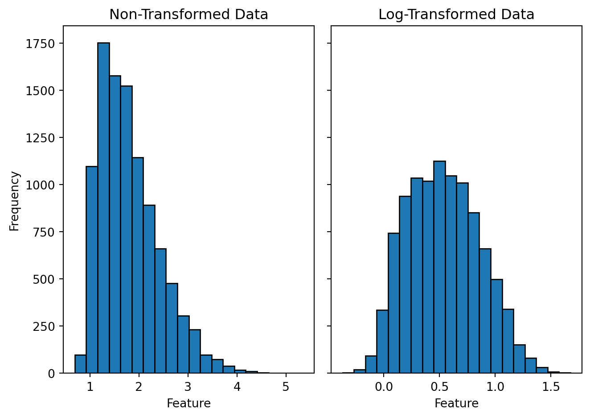
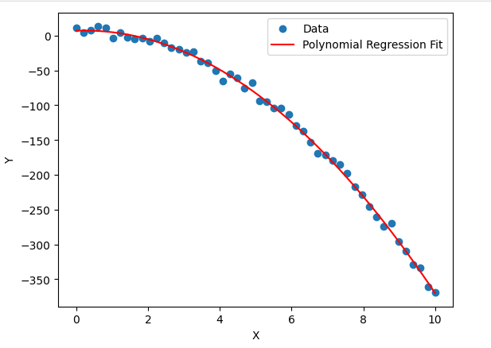

# Özellik Mühendisliği (Feature Engineering) ve Polinom Regresyonu (Polynomial Regression)

<!-- toc -->

# Özellik Mühendisliği (Feature Engineering)

## Özellik Mühendisliğine Giriş

Özellik mühendisliği, ham veriyi makine öğrenmesi modellerinin tahmin gücünü artıran anlamlı özniteliklere (feature) dönüştürme sürecidir. Yeni öznitelikler oluşturmayı, mevcut olanları değiştirmeyi ve model performansını iyileştirmek için en alakalı öznitelikleri seçmeyi içerir.

### Özellik Mühendisliği Neden Önemlidir?

- **Model doğruluğunu artırır**: İyi tasarlanmış öznitelikler, modellerin veriyi daha iyi temsil etmesine yardımcı olur.
- **Model karmaşıklığını azaltır**: Doğru şekilde tasarlanmış öznitelikler, karmaşık modelleri daha basit ve yorumlanabilir hale getirebilir.
- **Genellemeyi iyileştirir**: İyi öznitelik seçimi aşırı öğrenmeyi (overfitting) önler ve görülmemiş verilerdeki performansı artırır.

### Gerçek Dünya Örneği

Bir ev fiyatı tahmin problemi düşünelim. Sadece metrekare ve oda sayısı gibi ham verileri kullanmak yerine, aşağıdaki gibi yeni öznitelikler oluşturabiliriz:

- **Metrekare başına fiyat** = `Fiyat / Büyüklük`
- **Evin yaşı** = `Güncel Yıl - İnşa Yılı`
- **Şehir merkezine yakınlık** = `km cinsinden mesafe`

Bu tasarlanmış öznitelikler genellikle daha iyi içgörüler sağlar ve yalnızca ham veri kullanmaya kıyasla model performansını iyileştirir.

---

## Öznitelik Dönüşümü (Feature Transformation)

Öznitelik dönüşümü, veriyi makine öğrenmesi modelleri için daha uygun hale getirmek amacıyla mevcut özniteliklere matematiksel işlemler uygulamayı içerir.

### **1. Log Dönüşümü (Log Transformation)**

Yüksek çarpıklığa (skewness) sahip verilerde çarpıklığı azaltmak ve varyansı dengelemek için kullanılır.

#### **Örnek: Gelir Verisi**

Birçok gelir veri seti, çoğu değerin düşük olduğu ancak birkaç değerin aşırı yüksek olduğu sağa çarpık (right-skewed) bir dağılıma sahiptir. Log dönüşümü uygulamak veriyi daha normale yakın hale getirir:

$$X' = \log(X)$$

<div style="text-align: center;display:flex; justify-content: center; margin-top: 15px;">
    
</div>

### **2. Polinom Öznitelikleri (Polynomial Features)**

Doğrusal olmayan ilişkileri yakalamak için polinom terimleri (kareli, küplü) ekleme.

#### **Örnek: Ev Fiyatı Tahmini**

`Büyüklük` özniteliğini tek başına kullanmak yerine, doğrusal olmayan desenlere daha iyi uyum sağlamak için `Büyüklük^2` ve `Büyüklük^3` terimlerini dahil edebiliriz.

```python
from sklearn.preprocessing import PolynomialFeatures
import numpy as np

X = np.array([[1000], [1500], [2000], [2500]])  # Ev büyüklükleri
poly = PolynomialFeatures(degree=2)
X_poly = poly.fit_transform(X)
print(X_poly)
```

### **3. Etkileşim Öznitelikleri (Interaction Features)**

Mevcut öznitelikler arasındaki etkileşimlere dayalı yeni öznitelikler oluşturma.

#### **Örnek: Öznitelikleri Birleştirme**

Bir sağlık modeli için `Boy` ve `Kilo` yu ayrı ayrı kullanmak yerine, yeni bir VKİ (BMI) özniteliği oluşturun:

$$BMI = \frac{Kilo}{Boy^2}$$

```python
def calculate_bmi(height, weight):
    return weight / (height ** 2)

height = np.array([1.65, 1.75, 1.80])  # Metre cinsinden boylar
weight = np.array([65, 80, 90])  # kg cinsinden kilolar
bmi = calculate_bmi(height, weight)
print(bmi)
```

Bu, modelin sağlık risklerini boy ve kiloyu ayrı ayrı kullanmaktan daha iyi anlamasını sağlar.

---

## Öznitelik Seçimi (Feature Selection)

Öznitelik seçimi, bir model için en alakalı öznitelikleri belirlerken gereksiz veya tekrarlayan olanları çıkarma işlemidir. Bu, model performansını iyileştirir ve hesaplama karmaşıklığını azaltır.

### **1. Gereksiz Öznitelikler**

Tüm öznitelikler model performansına eşit katkıda bulunmaz. Bazıları ilgisiz veya tekrarlayıcı olabilir, bu da aşırı öğrenmeye (overfitting) ve artan hesaplama maliyetine yol açar. Gereksiz özniteliklere örnekler:

- **ID sütunları**: Tahmin değeri sağlamayan benzersiz tanımlayıcılar.
- **Yüksek korelasyonlu öznitelikler**: Benzer bilgi içeren öznitelikler.
- **Sabit veya sabite yakın öznitelikler**: Çok az değişim gösteren veya hiç değişim göstermeyen öznitelikler.

### **2. Korelasyon Analizi (Correlation Analysis)**

Korelasyon analizi, iki veya daha fazla özniteliğin yüksek derecede ilişkili olduğu çoklu doğrusal bağlantıyı (multicollinearity) tespit etmeye yardımcı olur. İki öznitelik benzer bilgi sağlıyorsa, bunlardan biri çıkarılabilir.

#### **Örnek: Yüksek Korelasyonlu Öznitelikleri Bulma**

```python
import pandas as pd
import numpy as np

# Örnek veri seti
data = {
    'Feature1': [1, 2, 3, 4, 5],
    'Feature2': [2, 4, 6, 8, 10],
    'Feature3': [5, 3, 6, 9, 2]
}
df = pd.DataFrame(data)

# Korelasyon matrisini hesaplama
correlation_matrix = df.corr()
print(correlation_matrix)
```

Korelasyon katsayısı ±1'e yakın olan öznitelikler tekrarlayıcı olarak değerlendirilebilir ve çıkarılabilir.

### **3. İstatistiksel Öznitelik Seçim Yöntemleri**

Öznitelik seçim teknikleri, farklı özniteliklerin önemini istatistiksel testlere veya model tabanlı önem ölçümlerine dayanarak sıralamak için kullanılabilir.

> Bu aşamada yüzeysel öğrenmek yeterlidir!

#### **Yaygın Yöntemler:**

- **Ki-Kare Testi (Chi-Square Test)**: Kategorik öznitelikler ile hedef değişken arasındaki bağımlılığı ölçer.
- **Karşılıklı Bilgi (Mutual Information)**: Bir özniteliğin ne kadar bilgi katkısı sağladığını değerlendirir.
- **Tekrarlamalı Öznitelik Elemesi (Recursive Feature Elimination - RFE)**: Model performansına göre daha az önemli öznitelikleri tekrarlayarak çıkarır.
- **Ağaç Tabanlı Modellerden Öznitelik Önemi (Feature Importance from Tree-Based Models)**: Karar ağaçları ve rastgele ormanlar, öznitelik önem skorları sağlar.

Öznitelik seçimi, yalnızca en değerli özniteliklerin nihai modelde kullanılmasını sağlayarak verimliliği ve tahmin gücünü artırır.

<br/>

---

<br/>

# Polinom Regresyonu (Polynomial Regression)

## Polinom Regresyonuna Giriş

Polinom Regresyonu, girdi öznitelikleri ile hedef değişken arasındaki doğrusal olmayan ilişkileri modelleyen Doğrusal Regresyonun (Linear Regression) bir uzantısıdır. Doğrusal Regresyon düz bir çizgi ilişkisi varsayarken, Polinom Regresyonu eğrileri ve daha karmaşık desenleri yakalar.

### Neden Polinom Regresyonu Kullanmalıyız?

- **Doğrusal Olmamayı (Non-Linearity) İşler**: Doğrudan bir ilişki varsayan Doğrusal Regresyonun aksine, Polinom Regresyonu eğrisel eğilimleri modeller.
- **Gerçek Dünya Verileri İçin Daha İyi Uyum**: Nüfus artışı, ekonomik eğilimler ve fizik tabanlı modeller gibi birçok gerçek dünya olgusu doğrusal olmayan davranış sergiler.
- **Öznitelik Mühendisliği Alternatifi**: Etkileşim terimlerini manuel olarak oluşturmak yerine, Polinom Regresyonu karmaşık bağımlılıkları yakalamak için otomatik bir yol sağlar.

### Örnek: Ev Fiyatlarını Tahmin Etme

Ev fiyatlarının büyüklükle doğrusal olarak artmadığı bir veri seti düşünelim. Bunun yerine talep, konum ve altyapı gibi faktörler nedeniyle doğrusal olmayan bir eğilim izlerler. Bir Polinom Regresyon modeli bu deseni daha iyi yakalayabilir.

Örneğin:

- **Doğrusal Model**: $ Fiyat = \beta_0 + \beta_1 \cdot Büyüklük $
- **Polinom Modeli**: $ Fiyat = \beta_0 + \beta_1 \cdot Büyüklük + \beta_2 \cdot Büyüklük^2 $

Bu ikinci dereceden terim, eğrisel fiyat eğilimini daha doğru bir şekilde modellemeye yardımcı olur.

<div style="text-align: center;display:flex; justify-content: center; margin-top: 15px;">
    
</div>

## Matematiksel Gösterim ve Uygulama

Polinom regresyonu, öznitelik setine polinom terimleri ekleyerek doğrusal regresyonu genişletir. Hipotez fonksiyonu şu şekilde gösterilir:

$$
h_{\theta}(x) = \theta_0 + \theta_1 x + \theta_2 x^2 + \theta_3 x^3 + ... + \theta_n x^n
$$

burada:

- $ x $ girdi özniteliğidir,
- $ \theta_0, \theta_1, ..., \theta_n $ parametrelerdir (ağırlıklar),
- $ x^n $ daha yüksek dereceli polinom terimlerini temsil eder.

Bu, modelin verideki **doğrusal olmayan** ilişkileri yakalamasını sağlar.
