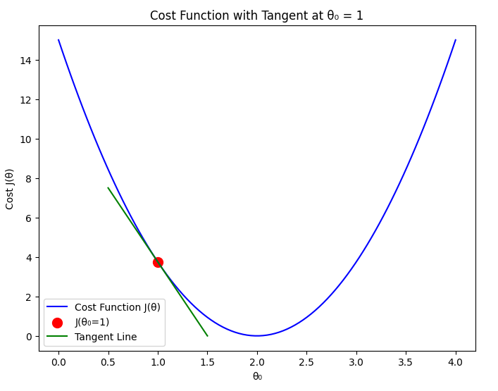
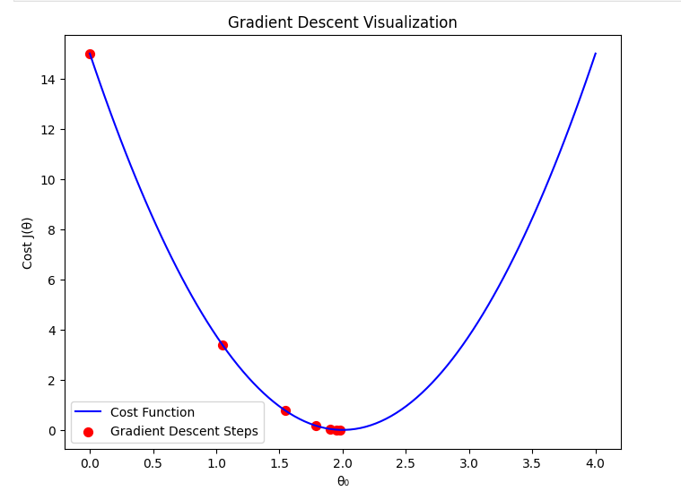
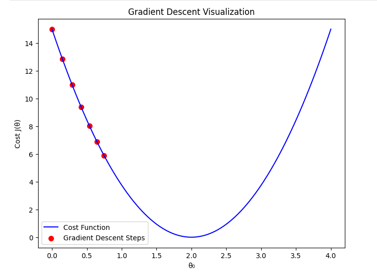
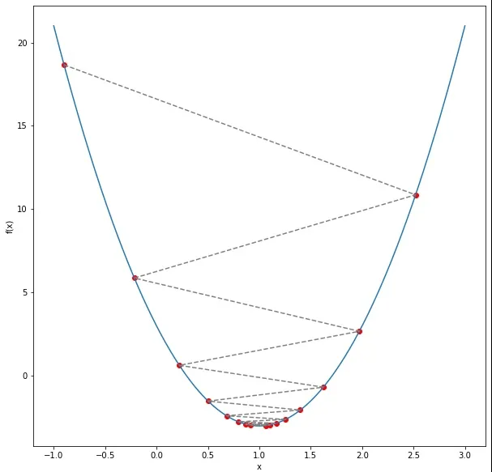
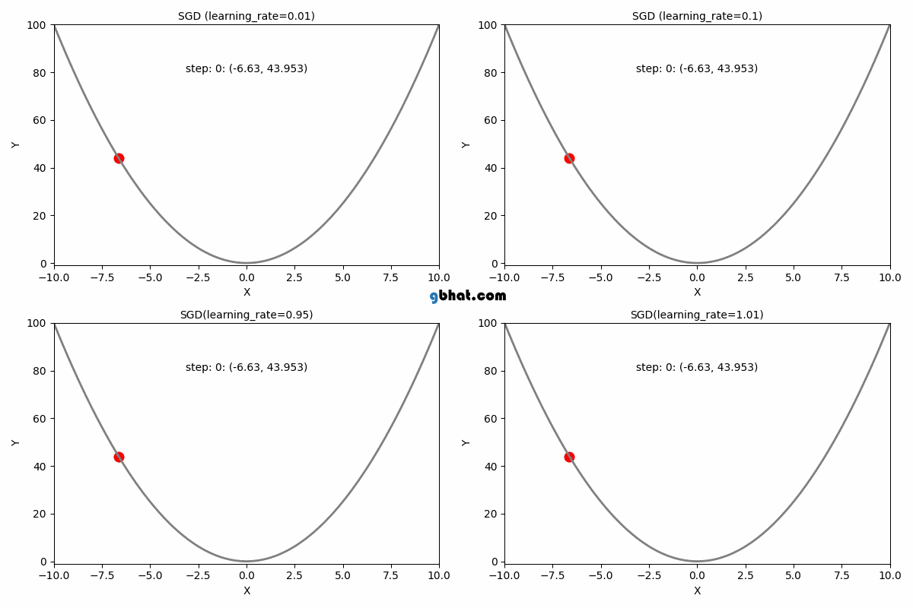
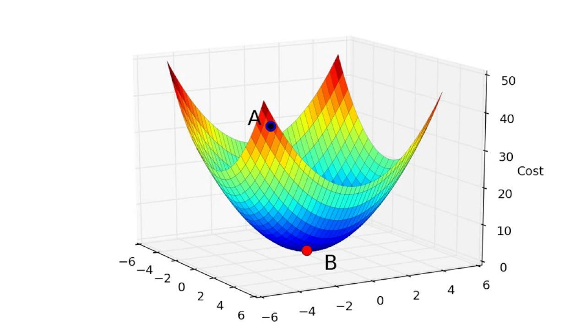
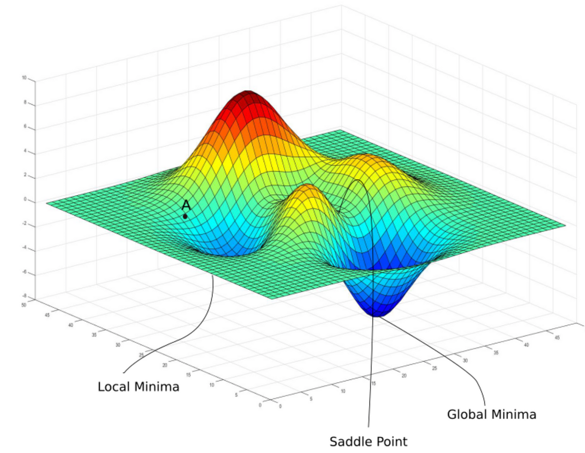

<!-- toc -->

## Gradient Descent'e Giriş (Introduction to Gradient Descent)

Önceki bölümde, $\\theta_1 = 0$ varsayımıyla farklı $\\theta_0$ değerleri aldığımızda maliyet fonksiyonunun nasıl davrandığını keşfetmiştik (Görselleştirmeyi kolaylaştırmak için $\\theta_1$'e sıfır verdik). Şimdi, $J(\\theta)$ maliyet fonksiyonunu en aza indiren en iyi parametreleri bulmak için kullanılan bir optimizasyon algoritması olan Gradient Descent'i (Gradyan İnişi) tanıtıyoruz.

Hipotez fonksiyonumuz şu şekilde sadeleşir: $$h_{\\theta}(x) = \\theta_0 \\cdot x $$

Gradient Descent, $\\theta$ parametresini maliyet fonksiyonunu azaltan yönde adım adım güncelleyen yinelemeli (iterative) bir yöntemdir. Algoritma, farklı değerleri manuel olarak test etmek yerine $\\theta_0$'ın optimal değerini verimli bir şekilde bulmamıza yardımcı olur.

Gradient Descent'in nasıl çalıştığını anlamak için veri kümemizi (dataset) hatırlayalım:

| x değerleri | y değerleri |
| ----------- | ----------- |
| 1           | 2           |
| 2           | 4           |
| 3           | 6           |
| 4           | 8           |

    

Tahminlerimiz $h_\\theta(x) = \\theta_0 \\cdot x$ ile gerçek $y$ değerleri arasındaki hatayı en aza indiren en iyi $\\theta_0$ değerini bulmayı hedefliyoruz. Gradient Descent, minimum maliyete ulaşmak için $\\theta_0$'ı yinelemeli olarak ayarlayacaktır.

---

## Gradient Descent'in Matematiksel Formülasyonu (Mathematical Formulation of Gradient Descent)

Gradient Descent, parametrelerini en dik iniş (steepest descent) yönünde yinelemeli olarak güncelleyerek bir fonksiyonu en aza indirmek için kullanılan bir optimizasyon algoritmasıdır. Bizim durumumuzda, maliyet fonksiyonunu (cost function) en aza indirmeyi hedefliyoruz:

$$ J(\\theta) = \\frac{1}{2m} \\sum (h_θ(x_i) - y_i)^2 $$

Burada:

- **𝑚**, eğitim örneklerinin (training examples) sayısıdır.
- **$h_θ(x)$**, hipotez fonksiyonumuzu (tahmin edilen değerler) temsil eder.
- **y**, gerçek hedef değerleri temsil eder.
- **Hedef**: $J(θ)$'yi en aza indiren optimal $θ$'yı bulmak.

### **1. Gradient Descent Güncelleme Kuralı (Update Rule)**

Gradient Descent, **güncellemelerin yönünü ve büyüklüğünü** belirlemek için maliyet fonksiyonunun türevini (derivative) kullanır. $\\theta$ için genel güncelleme kuralı şudur:

$$\\theta := \\theta - \\alpha \\frac{\\partial J(\\theta)}{\\partial \\theta}$$

    

Burada:

- **$\\alpha$ (öğrenme oranı — learning rate)** güncellemelerin adım boyutunu kontrol eder.
- **$\\frac{\\partial J(\\theta)}{\\partial \\theta} $**, maliyet fonksiyonunun $ \\theta $'ya göre gradyanıdır (türev).

#### Neden Türev Kullanıyoruz?

Türev **$\\frac{\\partial J(\\theta)}{\\partial \\theta} $** bize maliyet fonksiyonunun eğimini (slope) söyler. Eğim pozitifse $θ_0$'ı azaltmamız, negatifse $θ_0$'ı artırmamız gerekir; bu bizi $J(θ_0)$'ın minimumuna yönlendirir. Türevler olmadan, fonksiyonu en aza indirmek için hangi yönde hareket edeceğimizi bilemezdik.

Gradyan bize **bir noktada fonksiyonun ne kadar dik arttığını veya azaldığını** söyler.

- Gradyan **pozitifse**, $ \\theta $ **azaltılır**.
- Gradyan **negatifse**, $ \\theta $ **artırılır**.

Bu, maliyet fonksiyonunun minimumuna doğru hareket etmemizi sağlar.

---

### **2. Gradyanı Hesaplama (Computing the Gradient)**

İlk olarak, hipotez fonksiyonumuzu hatırlayalım:

$$
h_θ(x) = \\theta_0 \\cdot x
$$

Şimdi, maliyet fonksiyonunun türevini hesaplıyoruz:

$$
\\frac{\\partial J(\\theta)}{\\partial \\theta_0} = \\frac{1}{m} \\sum (h_θ(x^{(i)}) - y^{(i)}) x^{(i)}
$$

Bu ifade, **hataların ortalama gradyanının** girdi değerleriyle çarpılmasını temsil eder. Bu gradyanı kullanarak, her yinelemede $ \\theta_0 $'ı güncelleriz:

$$
\\theta_0 := \\theta_0 - \\alpha \\cdot \\frac{1}{m} \\sum(h_θ(x^{(i)}) - y^{(i)}) x^{(i)}
$$

- **Hata büyükse**, güncelleme adımı daha büyüktür.
- **Hata küçükse**, güncelleme adımı daha küçüktür.

    

Bu şekilde, algoritma kademeli olarak optimal $ \\theta_0 $'a doğru ilerler.

---

## Öğrenme Oranı (Learning Rate — $\\alpha$)

Öğrenme oranı $(\\alpha)$, gradient descent algoritmasında çok önemli bir parametredir. Her yinelemede negatif gradyan yönünde ne kadar büyük bir adım atacağımızı belirler. Uygun bir öğrenme oranı seçmek, algoritmanın verimli bir şekilde yakınsamasını (convergence) sağlamak için çok önemlidir.

Öğrenme oranı çok küçükse, algoritma minimuma doğru çok küçük adımlar atar ve bu da yavaş yakınsamaya yol açar. Öte yandan, öğrenme oranı çok büyükse, algoritma minimumu aşabilir (overshoot) ve hatta ıraksayabilir (diverge), asla optimal bir çözüme ulaşamaz.

### 1. $\\alpha$ Çok Küçük Olduğunda

Öğrenme oranı çok küçük ayarlanırsa:

- Gradient descent her yinelemede çok küçük adımlar atar.
- Minimum maliyete yakınsama son derece yavaş olur.
- Yararlı bir çözüme ulaşmak için çok fazla sayıda yineleme gerekebilir.
- Algoritma, maliyet fonksiyonunun yerel varyasyonlarında takılıp kalabilir ve öğrenmeyi yavaşlatabilir.

    

Matematiksel olarak, güncelleme kuralı şudur:
$\\theta_0 := \\theta_0 - \\alpha \\frac{d}{d\\theta_0} J(\\theta_0) $
$\\alpha$ çok küçük olduğunda, adım başına $\\theta_0$'daki değişim minimum düzeydedir ve bu da süreci verimsiz hale getirir.

### 2. $\\alpha$ Optimal Olduğunda

Öğrenme oranı optimal seçilirse:

- Gradient descent algoritması minimuma doğru verimli bir şekilde hareket eder.
- Hız ve kararlılık arasında denge kurar ve makul sayıda yinelemede yakınsar.
- Maliyet fonksiyonu salınımlar veya ıraksama olmadan istikrarlı bir şekilde azalır.

    

İyi seçilmiş bir $\\alpha$, gradient descent'in minimuma düzgün ve istikrarlı bir yol izlemesini sağlar.

### 3. $\\alpha$ Çok Büyük Olduğunda

Öğrenme oranı çok büyük ayarlanırsa:

- Gradient descent aşırı büyük adımlar atabilir.
- Yakınsamak yerine minimum etrafında salınım yapabilir veya tamamen ıraksayabilir.
- Optimal $\\theta_0$'ı aşma nedeniyle maliyet fonksiyonu azalmak yerine artabilir.

    

Aşırı durumlarda, maliyet fonksiyonu değerleri süresiz olarak artabilir ve algoritmanın bir minimum bulamamasına neden olabilir.

### Özet

Gradient descent'in verimli çalışması için doğru öğrenme oranını seçmek çok önemlidir. İyi dengelenmiş bir $\\alpha$, algoritmanın hızlı ve etkili bir şekilde yakınsamasını sağlar. Bir sonraki bölümde, etkilerini görselleştirmek için gradient descent'i farklı öğrenme oranlarıyla uygulayacağız.

    

---

## Gradient Descent Yakınsaması (Convergence)

Gradient Descent, parametreleri adım adım güncelleyerek maliyet fonksiyonu $J(\\theta)$'yı en aza indiren yinelemeli bir optimizasyon algoritmasıdır. Ancak, algoritmanın ne zaman yakınsadığını belirlemek için uygun bir durdurma kriterine (stopping criterion) ihtiyacımız vardır.

### 1. Yakınsama Kriterleri (Convergence Criteria)

Algoritma, aşağıdaki koşullardan biri karşılandığında durmalıdır:

- **Küçük Gradyan:** Maliyet fonksiyonunun türevi (gradyanı) sıfıra yakınsa, algoritma optimal noktaya yakındır.
- **Minimum Maliyet Değişimi:** Yinelemeler arasındaki maliyet fonksiyonu farkı önceden tanımlanmış bir eşik değerinin altındaysa ($ |J(\\theta_t) - J(\\theta_{t-1})| < \\varepsilon $).
- **Maksimum Yineleme:** Sonsuz döngüleri önlemek için sabit sayıda yinelemeye ulaşıldıysa.

### 2. Doğru Durdurma Koşulunu Seçme

- **Çok Erken Durdurmak:** Algoritma optimal çözüme ulaşmadan durursa, model iyi performans göstermeyebilir.
- **Çok Geç Durdurmak:** Çok fazla yineleme çalıştırmak, önemli bir iyileşme olmadan hesaplama kaynaklarını boşa harcayabilir.
- **Optimal Durdurma:** En iyi koşul, daha fazla güncellemenin maliyet fonksiyonunu veya parametreleri önemli ölçüde değiştirmediği zamandır.

---

## Yerel Minimum (Local Minimum) ve Global Minimum (Global Minimum)

### Kavramı Anlamak

Bir fonksiyonu optimize ederken, fonksiyonun en düşük değerine ulaştığı noktayı bulmayı hedefleriz. Bu, makine öğreniminde çok önemlidir çünkü $ J(\\theta) $ maliyet fonksiyonunu etkili bir şekilde en aza indirmek isteriz. Ancak, gradient descent'in karşılaşabileceği iki tür minimum vardır:

- **Global Minimum (Genel Minimum):** Fonksiyonun mutlak en düşük noktası. İdeal olarak, gradient descent buraya yakınsamalıdır.
- **Local Minimum (Yerel Minimum):** Fonksiyonun yakın çevresindeki noktalardan daha düşük bir değere sahip olduğu, ancak mutlak en düşük değer olmadığı nokta.

İçbükey (konveks — convex) fonksiyonlar (ikinci dereceden maliyet fonksiyonumuz gibi) için gradient descent'in global minimuma ulaşacağı garanti edilir. Ancak, içbükey olmayan (non-convex) fonksiyonlar için algoritma yerel bir minimumda takılıp kalabilir.

### İçbükey ve İçbükey Olmayan Maliyet Fonksiyonları (Convex vs Non-Convex Cost Functions)

1. **İçbükey Fonksiyonlar (Convex Functions)**

    

- Doğrusal regresyon için $ J(\\theta) $ maliyet fonksiyonu içbükeydir (konvekstir).
- Bu, gradient descent'in her zaman global minimuma ulaşmasını sağlar.
- Örnek: $ J(\\theta) = (\\theta - 2)^2 $ gibi basit bir ikinci dereceden fonksiyon.

2. **İçbükey Olmayan Fonksiyonlar (Non-Convex Functions)**

    

- Derin öğrenme (deep learning) ve karmaşık makine öğrenimi modellerinde daha yaygındır.
- Birden fazla yerel minimum olabilir.
- Örnek: $J(\\theta) = \\sin(\\theta) + \\frac{\\theta^2}{10} $ gibi birden çok tepe ve vadiye sahip fonksiyonlar.

 
 
