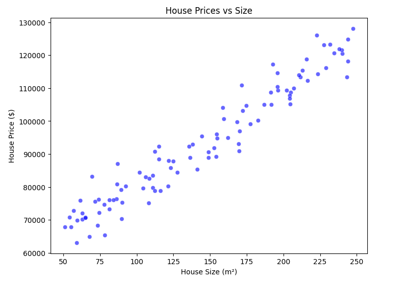
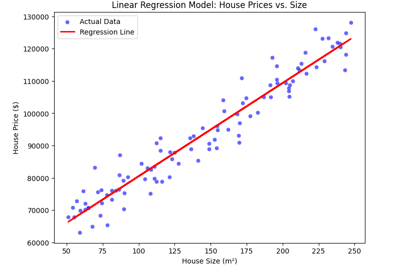
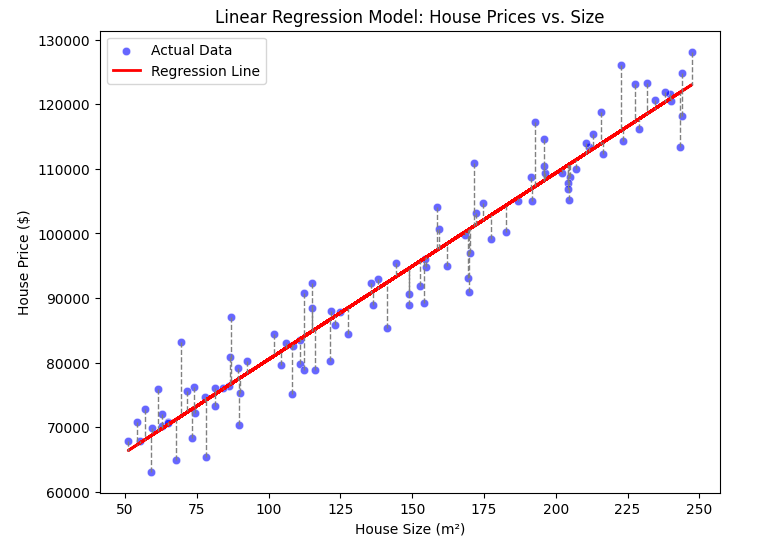
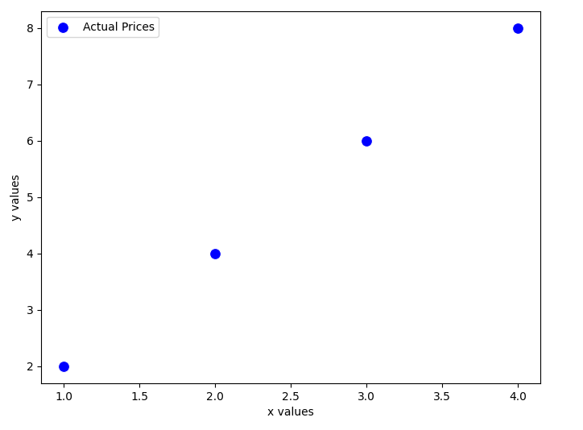
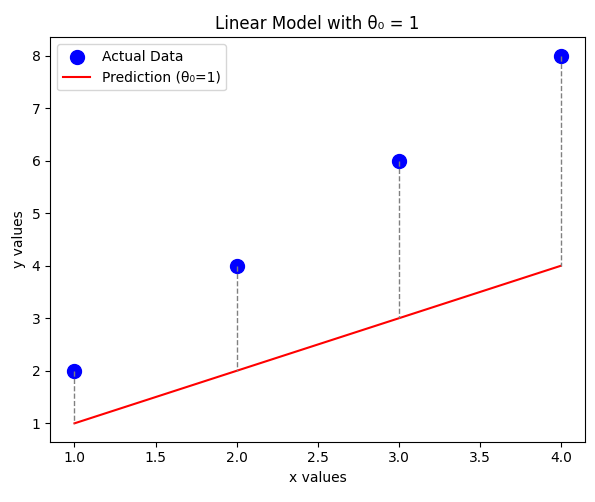
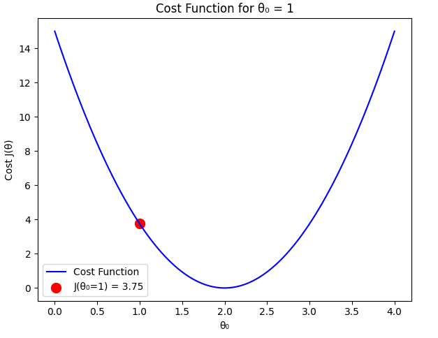
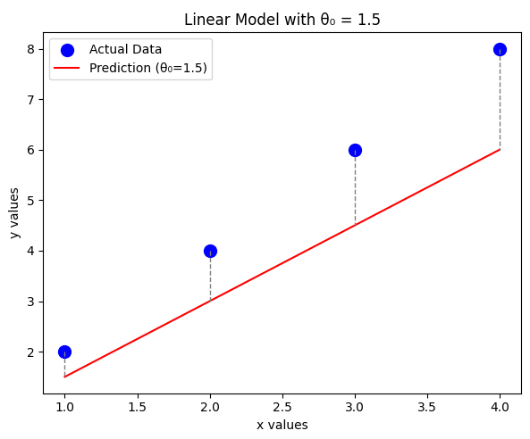
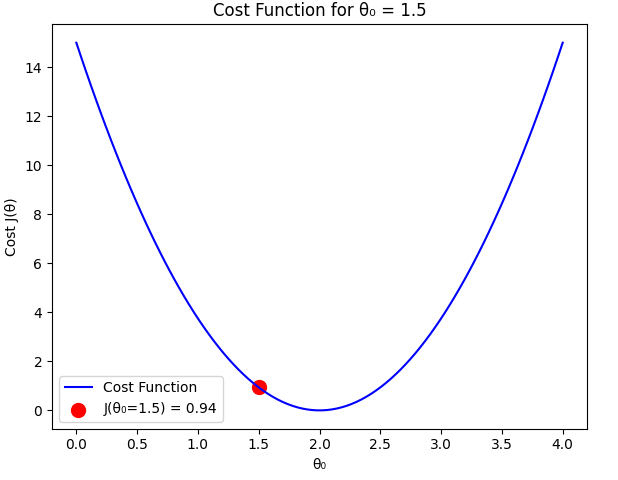
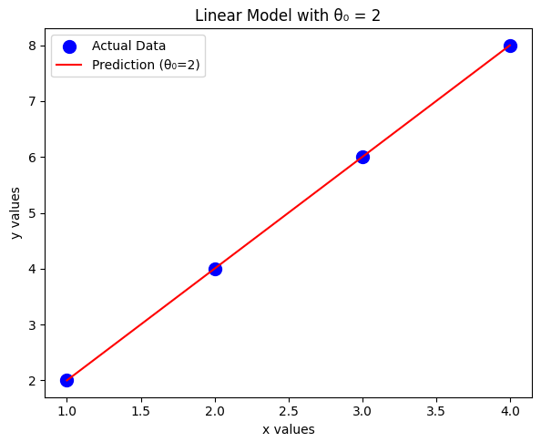
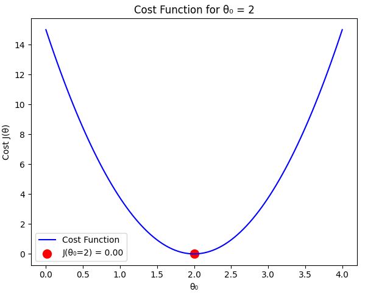

<!-- toc -->

# Lineer Regresyon ve Maliyet Fonksiyonu (Linear Regression and Cost Function)

## 1. Giriş (Introduction)

Lineer regresyon (linear regression), makine öğrenimindeki temel algoritmalardan biridir. Özellikle girdi ve çıktı değişkenleri arasındaki ilişkinin doğrusal olduğu varsayıldığında, tahmine dayalı modelleme (predictive modeling) için yaygın olarak kullanılır. Temel amaç, tahmin edilen değerler ile gerçek değerler arasındaki hatayı en aza indiren en uygun doğruyu bulmaktır.

### Neden Lineer Regresyon?

Lineer regresyon, birçok gerçek dünya uygulaması için basit ancak güçlüdür. Bazı yaygın kullanım alanları şunlardır:

- **Ev fiyatlarını tahmin etmek** — büyüklük, oda sayısı ve konum gibi özelliklere dayanarak.
- **Maaşları tahmin etmek** — deneyim, eğitim seviyesi ve sektöre göre.
- **Trendleri anlamak** — finans, sağlık ve ekonomi gibi çeşitli alanlarda.

### Gerçek Dünya Örneği: Konut Fiyatları

Ev büyüklüğüne (metrekare cinsinden) dayanarak ev fiyatlarını tahmin etmeyi düşünelim. Basit bir doğrusal ilişki varsayılabilir: daha büyük evler daha yüksek fiyatlara sahip olma eğilimindedir. Bu varsayım, lineer regresyon modelimizin temelidir.

<div style="text-align: center;display:flex; justify-content: center;">
    
</div>

## 2. Matematiksel Gösterim (Mathematical Representation)

Basit bir lineer regresyon modeli, girdi $x$ (metrekare cinsinden ev büyüklüğü) ile çıktı $y$ (ev fiyatı) arasında doğrusal bir ilişki olduğunu varsayar. Şu şekilde gösterilir:

$$ h_θ(x) = \theta_0 + \theta_1 x $$

burada:

- $h_θ(x) $ tahmin edilen ev fiyatıdır.
- $ \theta_0 $ (kesim noktası - intercept) ve $\theta_1 $ (eğim - slope) modelin parametreleridir.
- $x$ ev büyüklüğüdür.
- $y$ gerçek ev fiyatıdır.

### 2.1 Lineer Modeli Anlamak

Peki bu denklem gerçekte ne anlama geliyor?

- $\theta_0$ (kesim noktası - intercept): Büyüklüğü 0 m² olduğunda bir evin fiyatı.

- $\theta_1$ (eğim - slope): Her ilave metrekare için ev fiyatındaki artış.

Örneğin, eğer:

- $\theta_0 = 50,000$ ve $\theta_1 = 300$ ise,

- 100 m²'lik bir evin maliyeti: $ h_θ(100) = 50000 + 300 \cdot 100 = 80000 $

- 200 m²'lik bir evin maliyeti: $ h_θ(200) = 50000 + 300 \cdot 200 = 110000 $

Bu ilişkiyi bir regresyon doğrusu kullanarak görselleştirebiliriz.

## 3. Lineer Regresyonu Adım Adım Uygulama

Teorik kavramları daha net hale getirmek için, regresyon modelini Python kullanarak adım adım uygulayalım.

### 3.1 Gerekli Kütüphaneleri İçe Aktarma

```python
import numpy as np
import matplotlib.pyplot as plt
import seaborn as sns
```

### 3.2 Örnek Veri Oluşturma

```python
np.random.seed(42)
x = 50 + 200 * np.random.rand(100, 1)  # Ev büyüklükleri m² cinsinden (50 ila 250)
y = 50000 + 300 * x + np.random.randn(100, 1) * 5000  # Gürültülü ev fiyatları
```

Burada, 100 örneklemli bir veri seti oluşturuyoruz:

- $x$ ev büyüklüklerini temsil eder ($50$ ile $250$ m² arasında rastgele değerler).

- $y$ ev fiyatlarını temsil eder, doğrusal bir ilişki izler ancak bir miktar gürültü (noise) içerir.

### 3.3 Veriyi Görselleştirme

```python
plt.figure(figsize=(8,6))
sns.scatterplot(x=x.flatten(), y=y.flatten(), color='blue', alpha=0.6)
plt.xlabel('Ev Büyüklüğü (m²)')
plt.ylabel('Ev Fiyatı ($)')
plt.title('Ev Fiyatları ve Büyüklük')
plt.show()
```

### 3.4 Regresyon Doğrusunu Çizdirme

Maliyet fonksiyonuna geçmeden önce, verimize basit bir regresyon doğrusu yerleştirelim ve görselleştirelim.

Gerçek dünya uygulamalarında, bu parametreleri manuel olarak hesaplamayız. Bunun yerine, lineer regresyonu verimli bir şekilde gerçekleştirmek için **scikit-learn** gibi kütüphaneler kullanırız.

#### 3.4.1 Eğimi Hesaplama ($\theta_1$)

```python
theta_1 = np.sum((x - np.mean(x)) * (y - np.mean(y))) / np.sum((x - np.mean(x))**2)
```

Burada, eğimi ($\theta_1$) **en küçük kareler yöntemi (least squares method)** ile hesaplıyoruz.

#### 3.4.2 Kesim Noktasını Hesaplama ($\theta_0$)

```python
theta_0 = np.mean(y) - theta_1 * np.mean(x)
```

Bu, kesim noktasını ($\theta_0$) hesaplar ve regresyon doğrumuzun verinin ortalamasından geçmesini sağlar.

### 3.5 Regresyon Doğrusunu Çizdirme

```python
y_pred = theta_0 + theta_1 * x  # Tahmin edilen değerleri hesapla

plt.figure(figsize=(8,6))
sns.scatterplot(x=x.flatten(), y=y.flatten(), color='blue', alpha=0.6, label='Gerçek Veriler')
plt.plot(x, y_pred, color='red', linewidth=2, label='Regresyon Doğrusu')
plt.xlabel('Ev Büyüklüğü (m²)')
plt.ylabel('Ev Fiyatı ($)')
plt.title('Lineer Regresyon Modeli: Ev Fiyatları ve Büyüklük')
plt.legend()
plt.show()
```

<div style="text-align: center;display:flex; justify-content: center;">
    
</div>

### 3.6 Regresyon Doğrusunun Yorumlanması

Peki, bu doğru bize ne anlatıyor?

✅ Eğer eğim $\theta_1$ pozitifse, daha büyük evler daha pahalıdır (beklendiği gibi).

✅ Eğer kesim noktası $\theta_0$ yüksekse, en küçük evlerin bile önemli bir taban fiyatı olduğu anlamına gelir.

✅ Doğrunun dikliği, fiyatın metrekare başına ne kadar arttığını gösterir.

## 4. Maliyet Fonksiyonu (Cost Function)

Modelimizin ne kadar iyi performans gösterdiğini ölçmek için maliyet fonksiyonunu (cost function) kullanırız. Lineer regresyon için en yaygın maliyet fonksiyonu **Ortalama Karesel Hata (Mean Squared Error - MSE)**'dir:

$$ J(\theta) = \frac{1}{2m} \sum (h_{\theta}(x_i) - y_i)^2 $$

burada:

- $ m $ eğitim örneklerinin sayısıdır (number of training examples).
- $ h_\theta(x_i) $ $ i.$ ev için tahmin edilen fiyattır.
- $ y_i $ gerçek fiyattır.

<div style="text-align: center;display:flex; justify-content: center;">
    
</div>

Kesikli çizgilerin her biri bir hatayı (error) gösterir. Yukarıdaki formülde, bunların toplamını yani $J(\theta)$'yı hesapladık.

Bu fonksiyon, tahmin edilen ve gerçek değerler arasındaki ortalama karesel farkı hesaplar ve büyük hataları daha fazla cezalandırır. Amaç, en iyi model parametrelerine ulaşmak için $J(\theta)$'yı en aza indirmektir (minimize etmektir).

### 4.1 Örnek: $\theta_1 = 0$ Varsayımı

Maliyet fonksiyonunun nasıl davrandığını göstermek için, $\theta_1 = 0$ olduğunu varsayalım, yani modelimiz yalnızca $\theta_0$'a bağlıdır. Dört x değeri ve y değerinden oluşan küçük bir veri seti kullanacağız:

| x değerleri | y değerleri |
| ----------- | ----------- |
| 1           | 2           |
| 2           | 4           |
| 3           | 6           |
| 4           | 8           |

<div style="text-align: center;display:flex; justify-content: center; margin-top: 15px;">
    
</div>

$\theta_1 = 0$ varsaydığımız için hipotez fonksiyonumuz şu şekilde sadeleşir: $$h_{\theta}(x) = \theta_0 \cdot x $$

$\theta_0$'ın farklı değerlerini değerlendirecek ve karşılık gelen maliyet fonksiyonunu hesaplayacağız.

#### Durum 1: $\theta_0 = 1$

$\theta_0 = 1$ için tahmin edilen değerler:

$$ h_θ(x) = 1 \cdot x = [1, 2, 3, 4] $$

<div style="text-align: center;display:flex; justify-content: center; margin-top: 15px;">
    
</div>

Hata değerleri:

$$ \text{error} = h_θ(x) - y = [1 - 2, 2 - 4, 3 - 6, 4 - 8] = [-1, -2, -3, -4] $$

Maliyet fonksiyonunu hesaplama:

<div style="text-align: center;display:flex; justify-content: center; margin-top: 15px;">
    
</div>

$$ J(\theta_0 = 1) = \frac{1}{2m} \sum (h_{\theta}(x_i) - y_i)^2 $$

$$ J(1) = \frac{1}{8} ((-1)^2 + (-2)^2 + (-3)^2 + (-4)^2) = \frac{1}{8} (1 + 4 + 9 + 16) = \frac{30}{8} = 3.75 $$

#### Durum 2: $\theta_0 = 1.5$

$\theta_0 = 1.5$ için tahmin edilen değerler:

$$ h_θ(x) = 1.5 \cdot x = [1.5, 3, 4.5, 6] $$

<div style="text-align: center;display:flex; justify-content: center; margin-top: 15px;">
    
</div>

Hata değerleri:

$$ \text{error} = [1.5 - 2, 3 - 4, 4.5 - 6, 6 - 8] = [-0.5, -1, -1.5, -2] $$

Maliyet fonksiyonunu hesaplama:

<div style="text-align: center;display:flex; justify-content: center; margin-top: 15px;">
    
</div>

$$ J(1.5) = \frac{1}{8} ((-0.5)^2 + (-1)^2 + (-1.5)^2 + (-2)^2) $$

$$ J(1.5) = \frac{1}{8} (0.25 + 1 + 2.25 + 4) = \frac{7.5}{8} = 0.9375 $$

#### Durum 3: $\theta_0 = 2$ (Optimal Durum)

$\theta_0 = 2$ için tahmin edilen değerler gerçek değerlerle eşleşir:

$$ h_θ(x) = 2 \cdot x = [2, 4, 6, 8] $$

<div style="text-align: center;display:flex; justify-content: center; margin-top: 15px;">
    
</div>

Hata değerleri:

$$ \text{error} = [2 - 2, 4 - 4, 6 - 6, 8 - 8] = [0, 0, 0, 0] $$

Maliyet fonksiyonunu hesaplama:

<div style="text-align: center;display:flex; justify-content: center; margin-top: 15px;">
    
</div>

$$ J(2) = \frac{1}{8} ((0)^2 + (0)^2 + (0)^2 + (0)^2) = 0 $$

#### Karşılaştırma

Hesaplamalarımıza göre:

- $ J(1) = 3.75 $
- $ J(1.5) = 0.9375 $
- $ J(2) = 0 $

Beklendiği gibi, maliyet fonksiyonu $\theta_0 = 2$ olduğunda en aza iner ve bu değer veri setine mükemmel şekilde uyar. Bu değerden herhangi bir sapma daha yüksek bir maliyetle sonuçlanır.

Peki makine kaç kez deneyip doğru değeri bulabilir? Buna nasıl öğretebiliriz? Cevap bir sonraki konuda.

<br/>
<br/>
