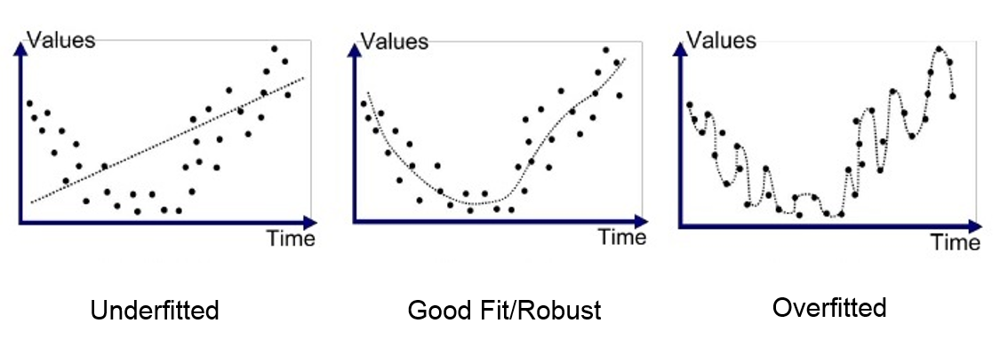
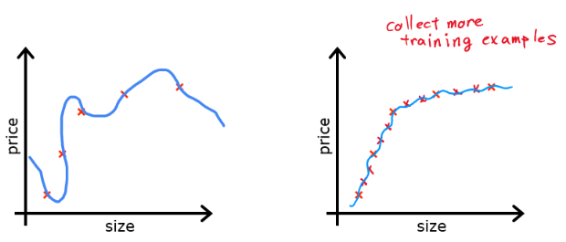
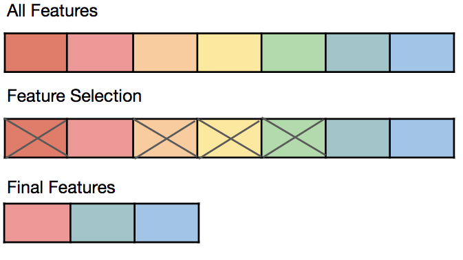
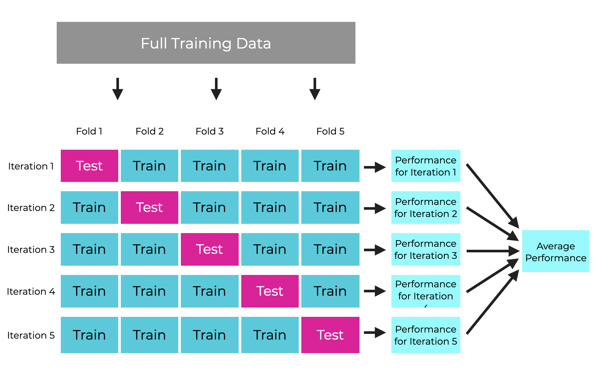
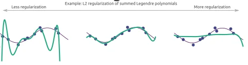

# Aşırı Uyum ve Düzenlileştirme (Overfitting and Regularization)

<!-- toc -->

## 1. Aşırı Uyum Problemi (The Problem of Overfitting)

### **Aşırı Uyum (Overfitting) Nedir?**

Aşırı uyum (overfitting), bir makine öğrenmesi modelinin **eğitim verisini çok iyi öğrenmesi**, altta yatan örüntü (pattern) yerine **gürültüyü (noise)** ve **rastgele dalgalanmaları** yakalaması durumunda ortaya çıkar. Sonuç olarak, model eğitim verisinde iyi performans gösterir ancak görülmemiş verilere karşı zayıf genelleme (generalization) yapar.

### **Aşırı Uyum Belirtileri (Symptoms of Overfitting)**

- **Yüksek eğitim doğruluğu ancak düşük test doğruluğu** (zayıf genelleme).
- **Karmaşık karar sınırları (decision boundaries)** eğitim verisine çok yakın şekilde uyum sağlar.
- **Büyük model parametreleri (yüksek büyüklükte ağırlıklar)**, girdi verisindeki küçük değişikliklere aşırı duyarlılığa yol açar.

### **Regresyonda Aşırı Uyum Örneği (Example of Overfitting in Regression)**

Bir polinom regresyon modelini düşünelim. Veriye yüksek dereceli bir polinom uyarlarsak, model tüm eğitim noktalarından mükemmel şekilde geçebilir ancak yeni veriyi doğru şekilde tahmin edemeyebilir.

#### **Aşırı Uyum ve Yetersiz Uyum (Overfitting vs. Underfitting)**

| Model Karmaşıklığı            | Eğitim Hatası | Test Hatası | Genelleme |
| ----------------------------- | ------------- | ----------- | --------- |
| Yetersiz Uyum (Yüksek Yanlılık) | Yüksek        | Yüksek      | Zayıf     |
| İyi Uyum                      | Düşük         | Düşük       | İyi       |
| Aşırı Uyum (Yüksek Varyans)   | Çok Düşük     | Yüksek      | Zayıf     |

#### **Aşırı Uyum Görselleştirmesi (Visualization of Overfitting)**

    

- **Sol (Yetersiz Uyum):** Model çok basittir ve eğilimi yakalayamaz.
- **Orta (İyi Uyum):** Model, aşırı karmaşıklaştırmadan örüntüyü yakalar.
- **Sağ (Aşırı Uyum):** Model eğitim verisine çok yakından uyar ve yeni girdilerde başarısız olur.

 
 

---

## 2. Aşırı Uyumu Giderme (Addressing Overfitting)

Aşırı uyum (overfitting), bir modelin verideki **altta yatan örüntü yerine gürültüyü öğrenmesi** durumunda ortaya çıkar. Aşırı uyumu gidermek için, modelin görülmemiş verilere genelleme yeteneğini geliştirmek amacıyla çeşitli stratejiler uygulayabiliriz.

### **1. Daha Fazla Veri Toplama (Collecting More Data)**

    

- Daha fazla eğitim verisi, modelin **gürültüyü ezberlemek yerine gerçek örüntüleri yakalamasına** yardımcı olur.
- Özellikle derin öğrenme modellerinde etkilidir; **küçük veri kümeleri hızla aşırı uyuma eğilimlidir**.
- Her zaman uygulanabilir olmasa da, **veri artırma (data augmentation) teknikleri** ile desteklenebilir.

### **2. Özellik Seçimi ve Mühendisliği (Feature Selection & Engineering)**

    

- Gereksiz veya ilgisiz özellikleri (features) kaldırmak, **model karmaşıklığını** azaltır.
- **Temel Bileşen Analizi (PCA)** gibi teknikler **boyut azaltmaya (dimensionality reduction)** yardımcı olur.
- Yeni özellikler mühendisliği (örneğin, **polinom özellikler veya etkileşim terimleri oluşturma**) genellemeyi iyileştirebilir.

### **3. Çapraz Doğrulama (Cross-Validation)**

    

- **k-katlı çapraz doğrulama (k-fold cross-validation)**, modelin farklı veri bölümlerinde iyi performans göstermesini sağlar.
- Modeli birden çok veri alt kümesinde test ederek **aşırı uyumun erken tespit edilmesine** yardımcı olur.
- **Bir-dışarıda çapraz doğrulama (LOOCV)**, özellikle küçük veri kümeleri için kullanışlı olan başka bir yaklaşımdır.

### **4. Bir Çözüm Olarak Düzenlileştirme (Regularization as a Solution)**

- Düzenlileştirme (regularization) teknikleri, aşırı karmaşıklığı önlemek için **modele kısıtlamalar ekler**.
- **L1 (Lasso) ve L2 (Ridge) Düzenlileştirme**, büyük katsayılar için cezalar (penalties) ekler.
- **Bir sonraki bölümde düzenlileştirilmiş maliyet fonksiyonlarını inceleyeceğiz.**

Bu teknikleri uygulayarak **model karmaşıklığını kontrol eder** ve **genelleme performansını** iyileştiririz. Bir sonraki bölümde, **düzenlileştirme ve bunun maliyet fonksiyonundaki rolü** hakkında daha derinlemesine bilgi edineceğiz.

 
 

---

## 3. Düzenlileştirilmiş Maliyet Fonksiyonu (Regularized Cost Function)

Aşırı uyum (overfitting), genellikle bir modelin **aşırı karmaşıklık öğrenmesi** ve bunun zayıf genellemeye yol açması durumunda ortaya çıkar. Bunu kontrol etmenin bir yolu, **maliyet fonksiyonunu (cost function)** değiştirerek **aşırı karmaşık modelleri cezalandırmaktır**.

### **1. Maliyet Fonksiyonu Neden Değiştirilmeli? (Why Modify the Cost Function?)**

Regresyon veya sınıflandırmadaki standart maliyet fonksiyonu **yalnızca eğitim verisindeki hatayı en aza indirir**; bu da **veriye aşırı uyum sağlayan büyük katsayılara (ağırlıklara)** yol açabilir.

Bir **düzenlileştirme terimi (regularization term)** ekleyerek **büyük ağırlıkları caydırır**, modeli basitleştirir ve aşırı uyumu azaltırız.

### **2. Düzenlileştirme Terimi Ekleme (Adding Regularization Term)**

Düzenlileştirme, maliyet fonksiyonuna **model parametrelerini küçülten bir ceza terimi (penalty term)** ekler. En yaygın iki düzenlileştirme türü şunlardır:

#### **L2 Düzenlileştirme (Ridge Regresyonu - Ridge Regression)**

**L2 düzenlileştirmede**, maliyet fonksiyonuna ağırlıkların karelerinin toplamını ekleriz:

$$
J(\theta) = \frac{1}{m} \sum_{i=1}^{m} \left[ h_\theta(x^{(i)}) - y^{(i)} \right]^2 + \lambda \sum_{j=1}^{n} \theta_j^2
$$

- **$\lambda$** (düzenlileştirme parametresi) ne kadar düzenlileştirme uygulanacağını kontrol eder.
- Daha yüksek $\lambda$ değerleri, modeli **parametrelerin büyüklüğünü azaltmaya** zorlayarak aşırı uyumu önler.
- L2 düzenlileştirme **tüm özellikleri korur** ancak etkilerini azaltır.

#### **L1 Düzenlileştirme (Lasso Regresyonu - Lasso Regression)**

**L1 düzenlileştirmede**, ağırlıkların mutlak değerlerini ekleriz:

$$
J(\theta) = \frac{1}{m} \sum_{i=1}^{m} \left[ h_\theta(x^{(i)}) - y^{(i)} \right]^2 + \lambda \sum_{j=1}^{n} |\theta_j|
$$

- L1 düzenlileştirme **bazı katsayıları sıfıra iter** ve etkili bir şekilde **özellik seçimi (feature selection)** yapar.
- Birçok özelliğin ilgisiz olduğu durumlarda kullanışlı olan **daha seyrek (sparse) modeller** ortaya çıkarır.

### **3. Düzenlileştirmenin Model Karmaşıklığı Üzerindeki Etkisi (Effect of Regularization on Model Complexity)**

Düzenlileştirme, parametre değerlerini kısıtlayarak **model karmaşıklığını kontrol eder**:

- **Düzenlileştirme Yok ($\lambda = 0$)** → Model eğitim verisine çok yakından uyar (**aşırı uyum**).
- **Küçük $\lambda$** → Model hâlâ esnektir ancak daha iyi genelleme yapar.
- **Büyük $\lambda$** → Model çok basitleşir (**yetersiz uyum - underfitting**), önemli örüntüleri kaybeder.

#### **Düzenlileştirme Etkilerinin Görselleştirmesi (Visualization of Regularization Effects)**

    

- **Sol (Düzenlileştirme Yok):** Model eğitim verisine aşırı uyar.
- **Orta (Orta Düzey Düzenlileştirme):** Model iyi genelleme yapar.
- **Sağ (Güçlü Düzenlileştirme):** Model veriye yetersiz uyar.

 
 

---

## 4. Düzenlileştirilmiş Doğrusal Regresyon (Regularized Linear Regression)

Düzenlileştirme olmayan doğrusal regresyon, özellikle model çok fazla özelliğe sahip olduğunda veya eğitim verisi sınırlı olduğunda **aşırı uyumdan** etkilenebilir. **Düzenlileştirme, modelin parametrelerini kısıtlayarak** yüksek varyansa yol açan aşırı değerleri önlemeye yardımcı olur.

### **1. Doğrusal Regresyon Maliyet Fonksiyonu (Düzenlileştirme Olmadan)**

**Doğrusal regresyon** için standart maliyet fonksiyonu şöyledir:

$$
J(\theta) = \frac{1}{2m} \sum_{i=1}^{m} \left( h_\theta(x^{(i)}) - y^{(i)} \right)^2
$$

burada:

- $ h\_\theta(x) = \theta^T x $ hipotez (tahmin edilen değer),
- $ m $ eğitim örneği sayısıdır.

Bu fonksiyon **hata kareler toplamını en aza indirir** ancak parametre değerleri üzerinde herhangi bir kısıtlama getirmez, bu da aşırı uyuma yol açabilir.

### **2. Doğrusal Regresyon için Düzenlileştirilmiş Maliyet Fonksiyonu**

Aşırı uyumu önlemek için, büyük parametre değerlerini cezalandırmak amacıyla bir **L2 düzenlileştirme terimi** (aynı zamanda **Ridge Regresyonu** olarak da bilinir) ekleriz:

$$
J(\theta) = \frac{1}{2m} \sum_{i=1}^{m} \left( h_\theta(x^{(i)}) - y^{(i)} \right)^2 + \frac{\lambda}{2m} \sum_{j=1}^{n} \theta_j^2
$$

burada:

- $ \lambda $, cezayı kontrol eden **düzenlileştirme parametresidir**,
- $ \sum \theta_j^2 $ terimi büyük $ \theta $ değerlerini cezalandırır,
- $ \theta_0 $ (yanlılık terimi - bias term) **düzenlileştirilmez**.

### **3. Düzenlileştirmenin Gradyan İnişindeki Etkisi (Effect of Regularization in Gradient Descent)**

Düzenlileştirme, **gradyan inişi (gradient descent) güncelleme kuralını** değiştirir:

$$
\theta_j := \theta_j - \alpha \left[ \frac{1}{m} \sum_{i=1}^{m} \left( h_\theta(x^{(i)}) - y^{(i)} \right) x_j + \frac{\lambda}{m} \theta_j \right]
$$

- Eklenen $ \frac{\lambda}{m} \theta_j $ terimi, parametre değerlerini zamanla **küçültür**.
- $ \lambda $ **çok büyük** olduğunda, model **yetersiz uyar** (çok basit).
- $ \lambda $ **çok küçük** olduğunda, model **aşırı uyar** (çok karmaşık).

#### **Düzenlileştirmenin Parametreler Üzerindeki Etkisi**

- **$ \lambda = 0 $ ise**: Düzenlileştirme kapalı → Aşırı uyum riski.
- **$ \lambda $ çok yüksekse**: Model çok basit → Yetersiz uyum.
- **$ \lambda $ optimal ise**: İyi genelleme → Dengeli model.

### **4. Düzenlileştirme ile Normal Denklem (Normal Equation with Regularization)**

Doğrusal regresyon için, gradyan inişinden kaçınarak $ \theta $'yı **Normal Denklem (Normal Equation)** ile çözebiliriz:

$$
\theta = (X^T X + \lambda I)^{-1} X^T y
$$

burada:

- $ I $ birim matristir (identity matrix) ($ \theta_0 $ düzenlileştirilmez).
- $ \lambda I $ eklemek, $ X^T X $'in tersinir olmasını sağlar ve çoklu doğrusal bağlantı (multicollinearity) sorunlarını azaltır.

### **5. Özet (Summary)**

✅ Düzenlileştirme, büyük ağırlıkları cezalandırarak **aşırı uyumu azaltır**.  
✅ **L2 düzenlileştirme (Ridge Regresyonu)**, maliyet fonksiyonuna $ \sum \theta_j^2 $ ekleyerek değiştirir.  
✅ **Gradyan İnişi ve Normal Denklem** düzenlileştirmeyi içerecek şekilde uyarlanır.  
✅ **$ \lambda $ seçimi** kritiktir: **çok yüksek → yetersiz uyum, çok düşük → aşırı uyum**.

 
 

---

## 5. Düzenlileştirilmiş Lojistik Regresyon (Regularized Logistic Regression)

Lojistik regresyon yaygın olarak **sınıflandırma görevleri** için kullanılır, ancak doğrusal regresyon gibi, çok fazla özellik olduğunda veya sınırlı veri olduğunda **aşırı uyuma** uğrayabilir. **Düzenlileştirme, büyük parametre değerlerini cezalandırarak aşırı uyumu kontrol etmeye yardımcı olur.**

### **1. Lojistik Regresyon Maliyet Fonksiyonu (Düzenlileştirme Olmadan)**

**Lojistik regresyon** için standart maliyet fonksiyonu şöyledir:

$$
J(\theta) = -\frac{1}{m} \sum_{i=1}^{m} \left[ y^{(i)} \log h_\theta(x^{(i)}) + (1 - y^{(i)}) \log (1 - h_\theta(x^{(i)})) \right]
$$

burada:

- $ h\_\theta(x) = \frac{1}{1 + e^{-\theta^T x}} $ **sigmoid fonksiyonudur**,
- $ y $ gerçek sınıf etiketidir ($ 0 $ veya $ 1 $),
- $ m $ eğitim örneği sayısıdır.

Bu maliyet fonksiyonu düzenlileştirme **içermez**, yani model bazı özelliklere **büyük ağırlıklar** atayabilir ve bu da aşırı uyuma yol açar.

### **2. Lojistik Regresyon için Düzenlileştirilmiş Maliyet Fonksiyonu**

Aşırı uyumu azaltmak için, düzenlileştirilmiş doğrusal regresyona benzer şekilde bir **L2 düzenlileştirme terimi ekleriz**:

$$
J(\theta) = -\frac{1}{m} \sum_{i=1}^{m} \left[ y^{(i)} \log h_\theta(x^{(i)}) + (1 - y^{(i)}) \log (1 - h_\theta(x^{(i)})) \right] + \frac{\lambda}{2m} \sum_{j=1}^{n} \theta_j^2
$$

burada:

- $ \lambda $ **düzenlileştirme parametresidir** (cezayı kontrol eder),
- $ \sum \theta_j^2 $ terimi büyük parametre değerlerini caydırır,
- **$ \theta_0 $ (yanlılık terimi) düzenlileştirilmez.**

✅ **Düzenlileştirmenin Etkisi**

- **Küçük $ \lambda $** → Model **aşırı uyum** gösterebilir (karmaşık karar sınırı).
- **Büyük $ \lambda $** → Model **yetersiz uyum** gösterebilir (çok basit, önemli özellikleri kaçırır).
- **Optimal $ \lambda $** → Model iyi genelleme yapar.

### **3. Düzenlileştirmenin Gradyan İnişindeki Etkisi**

Düzenlileştirme, **gradyan inişi güncelleme kuralını** değiştirir:

$$
\theta_j := \theta_j - \alpha \left[ \frac{1}{m} \sum_{i=1}^{m} \left( h_\theta(x^{(i)}) - y^{(i)} \right) x_j + \frac{\lambda}{m} \theta_j \right]
$$

- **Düzenlileştirme terimi** $ \frac{\lambda}{m} \theta_j $, ağırlık değerlerini zamanla **küçültür**.
- Örüntüleri öğrenmek yerine **eğitim verisini ezberleyen** modellerden kaçınmaya yardımcı olur.

### **4. Karar Sınırı ve Düzenlileştirme (Decision Boundary and Regularization)**

Düzenlileştirme ayrıca **karar sınırlarını (decision boundaries)** da etkiler:

- **Düzenlileştirme olmadan ($ \lambda = 0 $)**: Gürültüye uyum sağlayan karmaşık sınırlar.
- **Orta düzey $ \lambda $ ile**: Daha iyi genelleme yapan daha basit sınırlar.
- **Çok yüksek $ \lambda $ ile**: Yetersiz uyum sağlayan aşırı basit sınırlar.

### **5. Özet (Summary)**

✅ **Lojistik regresyonda düzenlileştirme**, parametre boyutlarını kontrol ederek **aşırı uyumu önler**.  
✅ **L2 düzenlileştirme (Ridge Regresyonu)**, maliyet fonksiyonuna $ \sum \theta_j^2 $ ekler.  
✅ **Gradyan İnişi**, büyük ağırlıkları küçültecek şekilde **uyarlanır**.  
✅ **$ \lambda $ seçimi**, iyi genelleme yapan bir model için **kritiktir**.

 
 
