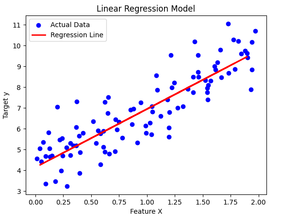
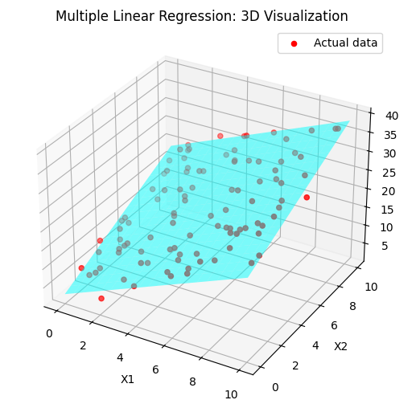
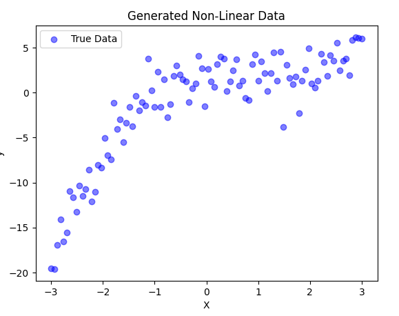
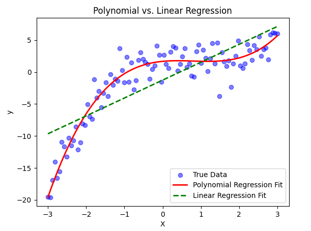
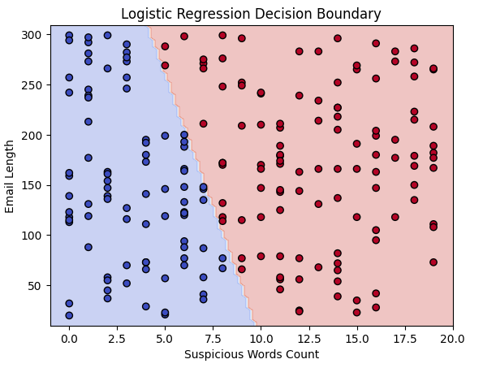
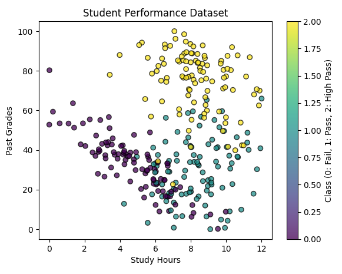
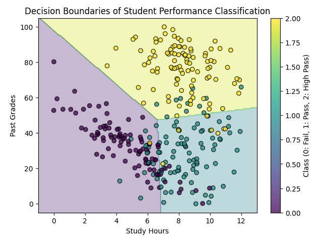

# Scikit-learn: Pratik Uygulamalar

<!-- toc -->

## 1. Scikit-Learn'e Giriş

Scikit-Learn, makine öğrenmesi (machine learning) için en popüler ve güçlü Python kütüphanelerinden biridir. Veri ön işleme (data preprocessing), model seçimi (model selection) ve değerlendirme (evaluation) için çeşitli makine öğrenmesi algoritmalarının ve araçlarının verimli uygulamalarını sağlar. NumPy, SciPy ve Matplotlib üzerine inşa edilmiştir ve Python'daki bilimsel hesaplama ekosistemiyle oldukça uyumludur.

### **Neden Scikit-Learn Kullanmalıyız?**

- **Kullanımı Kolay**: Makine öğrenmesi modelleri için basit ve tutarlı bir API sağlar.
- **Kapsamlı**: Regresyon, sınıflandırma (classification), kümeleme (clustering) ve boyut indirgeme (dimensionality reduction) dahil olmak üzere geniş bir algoritma yelpazesi içerir.
- **Verimli**: ML algoritmalarının hızlı ve optimize edilmiş sürümlerini uygular.
- **Entegrasyon**: Pandas, NumPy ve Matplotlib gibi diğer kütüphanelerle iyi çalışır.

### **Scikit-Learn'de Yerleşik Veri Kümelerini Yükleme**

Scikit-Learn, pratik ve deney yapmak için kullanılabilecek çeşitli yerleşik veri kümeleri (built-in datasets) sağlar. Yaygın veri kümelerinden bazıları şunlardır:

- **İris Veri Kümesi** (`load_iris`): Çiçek türleri için sınıflandırma veri kümesi.
- **Boston Konut Veri Kümesi** (`load_boston`) (Kullanımdan Kaldırıldı): Ev fiyatlarını tahmin etmek için regresyon veri kümesi.
- **Rakamlar Veri Kümesi** (`load_digits`): El yazısı rakam sınıflandırması.
- **Şarap Veri Kümesi** (`load_wine`): Farklı şarap türleri için sınıflandırma veri kümesi.
- **Meme Kanseri Veri Kümesi** (`load_breast_cancer`): Kanser teşhisi için ikili sınıflandırma (binary classification) veri kümesi.

#### **Örnek: İris Veri Kümesini Yükleme ve Keşfetme**

```python
from sklearn.datasets import load_iris
import pandas as pd

# Veri kümesini yükle
iris = load_iris()

# DataFrame'e dönüştür
iris_df = pd.DataFrame(iris.data, columns=iris.feature_names)

# Hedef etiketleri ekle
iris_df['target'] = iris.target

# İlk birkaç satırı göster
print(iris_df.head())
```

### **Veriyi Ayırma: Eğitim-Test Bölmesi**

Bir makine öğrenmesi modelini değerlendirmek için, veriyi bir **eğitim kümesine** (training set) ve bir **test kümesine** (test set) ayırmamız gerekir. Bu, modelin daha önce görmediği veriler üzerindeki performansını ölçebilmemizi sağlar.

Scikit-Learn bu amaçla `train_test_split` işlevini sağlar:

#### **Örnek: İris Veri Kümesini Bölme**

```python
from sklearn.model_selection import train_test_split

# Özellikler ve hedef değişken
X = iris.data
y = iris.target

# %80 eğitim ve %20 test olarak böl
X_train, X_test, y_train, y_test = train_test_split(X, y, test_size=0.2, random_state=42)

print(f"Eğitim örnekleri: {len(X_train)}, Test örnekleri: {len(X_test)}")
```

- `test_size=0.2`, verinin %20'sinin test için ayrıldığı anlamına gelir.
- `random_state=42`, tekrarlanabilirliği (reproducibility) sağlar.

Bu adımları izleyerek, bir veri kümesini başarıyla yükledik ve makine öğrenmesi için hazırladık. Bir sonraki bölümde, Scikit-Learn kullanarak **Doğrusal Regresyonu** (Linear Regression) nasıl uygulayacağımızı keşfedeceğiz.

### **Eğitim-Test Bölmesi ve Neden Önemlidir**

Bir makine öğrenmesi modelini eğitirken, genelleme (generalization) yapabildiğinden emin olmak için performansını daha önce görülmemiş veriler üzerinde değerlendirmeliyiz. Bu, veri kümesini **eğitim** ve **test** kümelerine ayırarak yapılır.

#### **Neden Eğitim İçin Verinin %100'ünü Kullanmıyoruz?**

Modeli mevcut tüm verileri kullanarak eğitirsek, yeni girdilerde ne kadar iyi performans gösterdiğini kontrol edecek bağımsız bir verimiz kalmaz. Bu, modelin genel kalıpları öğrenmek yerine eğitim verilerini ezberlediği **aşırı öğrenmeye** (overfitting) yol açar.

#### **Neden Test İçin %90 veya Daha Fazlasını Kullanmıyoruz?**

Büyük bir test kümesi, gerçek dünya performansının daha iyi bir tahminini verse de, eğitim için mevcut veri miktarını azaltır. Çok az veriyle eğitilen bir model, anlamlı kalıpları öğrenmek için yeterli bilgiye sahip olmadığı için **yetersiz öğrenmeden** (underfitting) muzdarip olabilir.

#### **İdeal Eğitim-Test Bölmesi Nedir?**

Yaygın olarak kullanılan bir oran **%80 eğitim, %20 test** şeklindedir. Ancak bu, aşağıdakilere bağlıdır:

- **Veri Kümesi Boyutu**: Veri sınırlıysa, daha fazla eğitim verisi tutmak için %90/10 bölmesi kullanabiliriz.
- **Model Karmaşıklığı**: Daha basit modeller daha az eğitim verisiyle çalışabilir, ancak derin öğrenme modelleri daha fazlasını gerektirir.
- **Kullanım Durumu**: Kritik uygulamalarda (örneğin, tıbbi teşhis), güvenilir değerlendirme için daha büyük bir test kümesi (örneğin, %30) tercih edilir.

> **_Önemli Çıkarımlar_**
>
> ✅ %80/20 iyi bir başlangıç noktasıdır, ancak veri kümesi boyutuna ve model ihtiyaçlarına göre değişebilir.
>
> ✅ Çok küçük test kümesi → Güvenilmez performans değerlendirmesi.
>
> ✅ Çok büyük test kümesi → Modelin düzgün öğrenmek için yeterli eğitim verisi olmayabilir.
>
> ✅ Yanlı sonuçlardan (biased results) kaçınmak için veriyi bölmeden önce her zaman karıştırın (shuffle).

## 2. Scikit-Learn ile Doğrusal Regresyon

### **1. Doğrusal Regresyona Giriş**

Doğrusal regresyon (linear regression), bağımlı değişken (hedef) ile bir veya daha fazla bağımsız değişken (özellik) arasındaki ilişkiyi modellemek için kullanılan temel bir gözetimli öğrenme (supervised learning) algoritmasıdır. Girdi özellikleri ile çıktı arasında doğrusal bir ilişki olduğunu varsayar.

Basit bir doğrusal regresyon modelinin matematiksel formu şudur:

$$
y = \theta_0 + \theta_1 x
$$

Burada:

- $y$ tahmin edilen çıktıdır.
- $x$ girdi özelliğidir.
- $\theta_0$ kesişim (bias) terimidir.
- $\theta_1$ özelliğin katsayısıdır (ağırlık).

Şimdi, Scikit-Learn kullanarak **basit bir doğrusal regresyon modeli** uygulayalım.

<br/>

### **2. Gerekli Kütüphanelerin İçe Aktarılması**

İlk olarak, veriyi işlemek, modeli oluşturmak ve performansını değerlendirmek için gerekli kütüphaneleri içe aktarıyoruz.

```python
import numpy as np
import matplotlib.pyplot as plt
import pandas as pd
from sklearn.model_selection import train_test_split
from sklearn.linear_model import LinearRegression
from sklearn.metrics import mean_squared_error, r2_score
```

### 3. Örnek Bir Veri Kümesi Oluşturma

**Doğrusal regresyon modelimizi** eğitmek ve test etmek için sentetik bir veri kümesi oluşturacağız.

```python
# Rastgele veri oluştur
np.random.seed(42)  # Tekrarlanabilirliği sağlar
X = 2 * np.random.rand(100, 1)  # 100 örnek, tek özellik
y = 4 + 3 * X + np.random.randn(100, 1)  # y = 4 + 3X + Gaussian gürültüsü

# Daha iyi görselleştirme için DataFrame'e dönüştür
df = pd.DataFrame(np.hstack((X, y)), columns=["Özellik X", "Hedef y"])
df.head()
```

- `np.random.rand(100, 1)`: $0$ ile $2$ arasında $100$ rastgele değer üretir.
- `y = 4 + 3X + gürültü`: Biraz gürültü eklenmiş doğrusal bir ilişki tanımlar.
- İlk birkaç örneği görüntülemek için `pd.DataFrame` kullanırız.

### 4. Veriyi Eğitim ve Test Kümelerine Ayırma

Model performansını görülmemiş veriler üzerinde değerlendirmek için veri kümesini **eğitim** ve **test** kümelerine ayırmak çok önemlidir.

```python
# Veri kümesini %80 eğitim ve %20 test olarak ayırma
X_train, X_test, y_train, y_test = train_test_split(X, y, test_size=0.2, random_state=42)

print(f"Eğitim kümesi boyutu: {X_train.shape[0]} örnek")
print(f"Test kümesi boyutu: {X_test.shape[0]} örnek")
```

### 5. Doğrusal Regresyon Modelini Eğitme

Şimdi, Scikit-Learn'ün `LinearRegression()` sınıfını kullanarak bir doğrusal regresyon modeli eğitiyoruz.

```python
# Modeli oluştur ve eğit
model = LinearRegression()
model.fit(X_train, y_train)

# Öğrenilen parametreleri yazdır
print(f"Kesişim (theta_0): {model.intercept_[0]:.2f}")
print(f"Katsayı (theta_1): {model.coef_[0][0]:.2f}")
```

- `fit(X_train, y_train)`: En uygun doğruyu bularak modeli eğitir.
- `model.intercept_`: Öğrenilen bias terimi.
- `model.coef_`: Özellik için öğrenilen ağırlık.

### 6. Tahmin Yapma

Eğitimden sonra, test kümesi üzerinde tahminler yapıyoruz.

```python
# Test verisi üzerinde tahmin yap
y_pred = model.predict(X_test)

# Gerçek ve tahmin edilen değerleri karşılaştır
comparison_df = pd.DataFrame({"Gerçek": y_test.flatten(), "Tahmin": y_pred.flatten()})
comparison_df.head()
```

- `model.predict(X_test)`: Tahminler üretir.
- DataFrame, gerçek ve tahmin edilen değerleri karşılaştırır.

### 7. Modeli Değerlendirme

Model performansını değerlendirmek için **Ortalama Karesel Hata (Mean Squared Error - MSE)** ve **R² Skoru** kullanırız.

```python
# Ortalama Karesel Hata (MSE) hesapla
mse = mean_squared_error(y_test, y_pred)

# R-kare skorunu hesapla
r2 = r2_score(y_test, y_pred)

print(f"Ortalama Karesel Hata: {mse:.2f}")
print(f"R-kare Skoru: {r2:.2f}")
```

- **MSE**: Gerçek ve tahmin edilen değerler arasındaki ortalama karesel farkları ölçer (_düşük daha iyidir_).
- **R² Skoru**: Modelin verideki varyansı ne kadar iyi açıkladığını ölçer (_1'e yakın daha iyidir_).

### 8. Sonuçları Görselleştirme

Son olarak, veriyi ve regresyon doğrusunu çizelim.

<div style="text-align: center;display:flex; justify-content: center; margin-bottom: 15px;">
    
</div>

```python
plt.scatter(X, y, color="blue", label="Gerçek Veri")
plt.plot(X_test, y_pred, color="red", linewidth=2, label="Regresyon Doğrusu")
plt.xlabel("Özellik X")
plt.ylabel("Hedef y")
plt.title("Doğrusal Regresyon Modeli")
plt.legend()
plt.show()
```

Bu grafik şunları gösterir:

- **Mavi noktalar** → Gerçek test verisi
- **Kırmızı çizgi** → En uygun regresyon doğrusu

<br/>
<br/>

---

## 3. Scikit-Learn ile Çoklu Doğrusal Regresyon

### **Çoklu Doğrusal Regresyon Nedir?**

Çoklu doğrusal regresyon (Multiple Linear Regression), birden fazla bağımsız değişken ($x_1, x_2, ..., x_n$) kullanarak bağımlı bir değişkeni ($y$) tahmin ettiğimiz basit doğrusal regresyonun bir uzantısıdır. Denklemin genel formu şudur:

$$
y = \theta_0 + \theta_1 x_1 + \theta_2 x_2 + ... + \theta_n x_n
$$

Burada:

- $ y $ = tahmin edilen çıktı
- $ x_1, x_2, ..., x_n $ = bağımsız değişkenler (özellikler)
- $ \theta_0 $ = kesişim
- $ \theta_1, \theta_2, ..., \theta_n $ = katsayılar (ağırlıklar)

Bu bölümde şunları yapacağız:

- Çoklu doğrusal regresyon modeli için sentetik bir veri kümesi oluşturma.
- Scikit-Learn kullanarak bir model eğitme.
- İlişkiyi **3B grafikte** görselleştirme.

### **Adım 1: Sentetik Bir Veri Kümesi Oluşturma**

İlk olarak, iki bağımsız değişkenli ($x_1$ ve $x_2$) ve bir bağımlı değişkenli ($y$) bir veri kümesi oluşturalım. Daha gerçekçi olması için biraz gürültü ekleyeceğiz.

```python
import numpy as np
import matplotlib.pyplot as plt
from mpl_toolkits.mplot3d import Axes3D
from sklearn.linear_model import LinearRegression
from sklearn.model_selection import train_test_split

# Tekrarlanabilirlik için sabit değer belirle
np.random.seed(42)

# x1 ve x2 için rastgele veri oluştur
x1 = np.random.uniform(0, 10, 100)
x2 = np.random.uniform(0, 10, 100)

# Gerçek denklemi tanımla: y = 3 + 2*x1 + 1.5*x2 + gürültü
y = 3 + 2*x1 + 1.5*x2 + np.random.normal(0, 2, 100)

# Model eğitimi için x1 ve x2'yi yeniden şekillendir
X = np.column_stack((x1, x2))
```

---

### **Adım 2: Modeli Eğitme**

Şimdi, veri kümesini eğitim ve test kümelerine ayırıp çoklu doğrusal regresyon modeli eğitiyoruz.

```python
# Veriyi eğitim ve test kümelerine ayır
X_train, X_test, y_train, y_test = train_test_split(X, y, test_size=0.2, random_state=42)

# Modeli oluştur ve eğit
model = LinearRegression()
model.fit(X_train, y_train)

# Model parametrelerini al
theta0 = model.intercept_
theta1, theta2 = model.coef_
print(f"Model denklemi: y = {theta0:.2f} + {theta1:.2f}*x1 + {theta2:.2f}*x2")
```

---

### **Adım 3: Regresyon Düzlemini Görselleştirme**

İki bağımsız değişkenimiz ($x_1$ ve $x_2$) olduğundan, regresyon düzlemini **3B uzayda** çizebiliriz.

<div style="text-align: center;display:flex; justify-content: center; margin-bottom: 15px;">
    
</div>

```python
# x1 ve x2 için ızgara oluştur
x1_range = np.linspace(0, 10, 20)
x2_range = np.linspace(0, 10, 20)
x1_grid, x2_grid = np.meshgrid(x1_range, x2_range)

# Tahmin edilen y değerlerini hesapla
y_pred_grid = theta0 + theta1 * x1_grid + theta2 * x2_grid

# 3B grafik oluştur
fig = plt.figure(figsize=(10, 6))
ax = fig.add_subplot(111, projection='3d')

# Gerçek verinin nokta grafiği
ax.scatter(x1, x2, y, color='red', label='Gerçek veri')

# Regresyon düzlemi
ax.plot_surface(x1_grid, x2_grid, y_pred_grid, alpha=0.5, color='cyan')

# Etiketler
ax.set_xlabel('X1')
ax.set_ylabel('X2')
ax.set_zlabel('Y')
ax.set_title('Çoklu Doğrusal Regresyon: 3B Görselleştirme')
plt.legend()
plt.show()
```

---

### **Önemli Çıkarımlar**

- **Bir veri kümesi oluşturduk** — iki bağımsız değişken ve bir bağımlı değişken ile.
- **Çoklu Doğrusal Regresyon modeli eğittik** — Scikit-Learn kullanarak.
- **Regresyon düzlemini 3B olarak görselleştirdik** — $x_1$ ve $x_2$'nin $y$'yi nasıl etkilediğini göstererek.

<br/>
<br/>

---

## 4. Scikit-Learn ile Polinom Regresyonu

Polinom regresyonu (Polynomial Regression), verideki **doğrusal olmayan ilişkileri** (non-linear relationships) yakalamak için polinom terimleri eklediğimiz **Doğrusal Regresyonun** bir uzantısıdır.

### **1. Polinom Regresyonu Nedir?**

Doğrusal regresyon, ilişkileri düz bir çizgi kullanarak modeller:

$$
y = \theta_0 + \theta_1 x
$$

Ancak, veri **doğrusal olmayan bir desen** izliyorsa, düz bir çizgi iyi uymayacaktır. Bunun yerine, polinom terimleri ekleyebiliriz:

$$
y = \theta_0 + \theta_1 x + \theta_2 x^2 + \theta_3 x^3 + \dots + \theta_n x^n
$$

Bu, modelin verideki **eğriliği yakalamasına** olanak tanır.

---

### **2. Doğrusal Olmayan Veri Oluşturma**

İlk olarak, doğrusal olmayan bir ilişkiye sahip **sentetik bir veri kümesi** oluşturalım.

```python
import numpy as np
import matplotlib.pyplot as plt

# -3 ile 3 arasında rastgele x değerleri oluştur
np.random.seed(42)
X = np.linspace(-3, 3, 100).reshape(-1, 1)

# Biraz gürültü ile doğrusal olmayan bir fonksiyon oluştur
y = 0.5 * X**3 - X**2 + 2 + np.random.randn(100, 1) * 2

# Verinin nokta grafiği
plt.scatter(X, y, color='blue', alpha=0.5, label="Gerçek Veri")
plt.xlabel("X")
plt.ylabel("y")
plt.title("Oluşturulan Doğrusal Olmayan Veri")
plt.legend()
plt.show()
```

<div style="text-align: center;display:flex; justify-content: center; margin-bottom: 15px;">
    
</div>

- -3 ile 3 arasında 100 rastgele nokta oluşturuyoruz.
- Oluşturduğumuz fonksiyon kübik bir denklemi takip eder:
- $y=0.5x^3 − x^2 + 2$ ve eklenmiş gürültü.
- Veriyi bir nokta grafiği kullanarak görselleştiriyoruz.

### 3. Polinom Özelliklerini Uygulama

Doğrusal özelliklerimizi polinom özelliklerine dönüştürmek için `sklearn.preprocessing` modülünden `PolynomialFeatures` kullanırız.

```python
from sklearn.preprocessing import PolynomialFeatures

# X'i polinom özelliklerine dönüştür (degree=3)
poly = PolynomialFeatures(degree=3)
X_poly = poly.fit_transform(X)

print(f"Orijinal X boyutu: {X.shape}")
print(f"Dönüştürülmüş X boyutu: {X_poly.shape}")
print(f"X_poly'nin ilk 5 satırı:\n{X_poly[:5]}")
```

- Polinom terimlerini $x^3$'e kadar eklemek için `PolynomialFeatures(degree=3)` kullanırız.
- Bu, her $x$ değerini $[1, x, x^2, x^3]$ özellik vektörüne dönüştürür.
- Yeni boyutu ve dönüştürülmüş ilk birkaç satırı yazdırırız.

### 4. Polinom Regresyon Modeli Eğitme

Şimdi, bu polinom özelliklerini kullanarak bir Doğrusal Regresyon modeli eğitiyoruz.

```python
from sklearn.linear_model import LinearRegression

# Polinom regresyon modelini eğit
model = LinearRegression()
model.fit(X_poly, y)

# Tahminler
y_pred = model.predict(X_poly)
```

### 5. Sonuçları Görselleştirme

Polinom regresyon modelini gerçek veriyle karşılaştırmalı olarak çizelim.

```python
plt.scatter(X, y, color='blue', alpha=0.5, label="Gerçek Veri")
plt.plot(X, y_pred, color='red', linewidth=2, label="Polinom Regresyon Uyumu")
plt.xlabel("X")
plt.ylabel("y")
plt.title("Polinom Regresyon Modeli")
plt.legend()
plt.show()
```

### 6. Doğrusal Regresyon ile Karşılaştırma

Şimdi, Polinom Regresyonu basit bir Doğrusal Regresyon modeliyle karşılaştıralım.

<div style="text-align: center;display:flex; justify-content: center; margin-bottom: 15px;">
    
</div>

```python
# Basit bir Doğrusal Regresyon modeli eğit
linear_model = LinearRegression()
linear_model.fit(X, y)
y_linear_pred = linear_model.predict(X)

# Her iki modeli de çiz
plt.scatter(X, y, color='blue', alpha=0.5, label="Gerçek Veri")
plt.plot(X, y_pred, color='red', linewidth=2, label="Polinom Regresyon Uyumu")
plt.plot(X, y_linear_pred, color='green', linestyle="dashed", linewidth=2, label="Doğrusal Regresyon Uyumu")
plt.xlabel("X")
plt.ylabel("y")
plt.title("Polinom vs. Doğrusal Regresyon")
plt.legend()
plt.show()
```

<br/>
<br/>

---

## 5. Lojistik Regresyon ile İkili Sınıflandırma

Lojistik regresyon (Logistic Regression), **ikili sınıflandırma** (binary classification) problemleri için kullanılan temel bir algoritmadır. Belirli bir girdinin belirli bir sınıfa ait olma olasılığını **sigmoid fonksiyonunu** kullanarak tahmin eder.

### **1. Lojistik Regresyon Nedir?**

Sürekli değerler tahmin eden Doğrusal Regresyonun aksine, Lojistik Regresyon **olasılıkları** tahmin eder ve bunları sınıf etiketlerine (0 veya 1) eşler. Model şu şekilde tanımlanır:

$$ P(y=1 | X) = \frac{1}{1 + e^{-\theta^T X}} $$

Burada:

- $\theta$ model parametrelerini (ağırlıklar ve bias) temsil eder.
- $X$ girdi özelliklerini temsil eder.
- Çıktı, 0 ile 1 arasında bir olasılıktır.

---

### **2. Sentetik Bir Veri Kümesi Oluşturma (Spam Tespiti Örneği)**

E-postaların iki özelliğe göre **spam (1) veya spam değil (0)** olarak sınıflandırıldığı sentetik bir veri kümesi oluşturacağız:

1. **Şüpheli kelime sayısı**
2. **E-posta uzunluğu**

```python
import numpy as np
import matplotlib.pyplot as plt
from sklearn.model_selection import train_test_split
from sklearn.linear_model import LogisticRegression
from sklearn.metrics import accuracy_score

# Sentetik veri oluşturma
np.random.seed(42)
num_samples = 200

# Özellik 1: Şüpheli kelime sayısı (rastgele seçilmiş değerler)
suspicious_words = np.random.randint(0, 20, num_samples)

# Özellik 2: E-posta uzunluğu (kısa e-postalar spam olma eğilimindedir)
email_length = np.random.randint(20, 300, num_samples)

# Etiketler: Spam (1) veya Spam Değil (0)
labels = (suspicious_words + email_length / 50 > 10).astype(int)

# Özellik matrisini oluşturma
X = np.column_stack((suspicious_words, email_length))
y = labels

# Eğitim ve test kümelerine ayırma
X_train, X_test, y_train, y_test = train_test_split(X, y, test_size=0.2, random_state=42)
```

---

### **3. Lojistik Regresyon Modelini Eğitme**

Şimdi, veri kümemiz üzerinde bir **Lojistik Regresyon** modeli eğitiyoruz.

```python
# Modeli eğitme
model = LogisticRegression()
model.fit(X_train, y_train)

# Tahmin yapma
y_pred = model.predict(X_test)

# Modeli değerlendirme
accuracy = accuracy_score(y_test, y_pred)
print(f"Model Doğruluğu: {accuracy:.2f}")
```

---

### **4. Karar Sınırını Görselleştirme**

Karar sınırı (decision boundary), modelin **spam ve spam olmayan e-postaları nasıl ayırdığını görmemize** yardımcı olur. Sınırı 2B olarak çiziyoruz.

```python
# Karar sınırını çizme fonksiyonu
def plot_decision_boundary(model, X, y):
    x_min, x_max = X[:, 0].min() - 1, X[:, 0].max() + 1
    y_min, y_max = X[:, 1].min() - 10, X[:, 1].max() + 10
    xx, yy = np.meshgrid(np.linspace(x_min, x_max, 100),
                         np.linspace(y_min, y_max, 100))

    Z = model.predict(np.c_[xx.ravel(), yy.ravel()])
    Z = Z.reshape(xx.shape)

    plt.contourf(xx, yy, Z, alpha=0.3, cmap=plt.cm.coolwarm)
    plt.scatter(X[:, 0], X[:, 1], c=y, edgecolors='k', cmap=plt.cm.coolwarm)
    plt.xlabel("Şüpheli Kelime Sayısı")
    plt.ylabel("E-posta Uzunluğu")
    plt.title("Lojistik Regresyon Karar Sınırı")
    plt.show()

# Karar sınırını çizme
plot_decision_boundary(model, X, y)
```

<div style="text-align: center;display:flex; justify-content: center; margin-bottom: 15px;">
    
</div>

Bu grafik, modelin iki özelliğimizi kullanarak **spam ve spam olmayan e-postaları nasıl ayırdığını** gösterir.

---

### **Önemli Çıkarımlar**

- Lojistik Regresyon **ikili sınıflandırma** için kullanılır.
- **Sigmoid fonksiyonunu** kullanarak olasılıkları tahmin eder.
- Spam tespitini taklit eden **sentetik bir veri kümesi** oluşturduk.
- Bir **Lojistik Regresyon modelini** eğittik ve değerlendirdik.
- **Karar sınırları**, modelin veriyi nasıl sınıflandırdığını görselleştirmeye yardımcı olur.

<br/>
<br/>

---

## 6. Lojistik Regresyon ile Çok Sınıflı Sınıflandırma

Bu bölümde, Lojistik Regresyon kullanarak **Çok Sınıflı Sınıflandırma** (Multi-Class Classification) modeli uygulayacağız. İkili sınıflandırma problemi yerine, veri noktalarını üç farklı kategoriye ayıracağız.

Bu proje, Lojistik Regresyon kullanarak bir öğrencinin başarı seviyesini çalışma saatleri ve geçmiş notlarına göre tahmin eder.

Öğrencileri üç kategoriye ayırıyoruz:

- **Başarısız** (0)
- **Geçti** (1)
- **Yüksek Başarı** (2)

### Adım 1: Kütüphaneleri İçe Aktarma

Aşağıdakiler için gerekli kütüphaneleri içe aktararak başlıyoruz:

- Veri oluşturma
- Görselleştirme
- Model eğitimi

```python
import numpy as np
import matplotlib.pyplot as plt
from sklearn.datasets import make_classification
from sklearn.model_selection import train_test_split
from sklearn.preprocessing import StandardScaler
from sklearn.linear_model import LogisticRegression
from sklearn.metrics import ConfusionMatrixDisplay, classification_report
```

### Adım 2: Sentetik Veri Oluşturma

`make_classification` kullanarak yapay öğrenci verisi oluşturuyoruz.

Her öğrencinin:

- Geçmiş Notları (0-100)
- Çalışma Saatleri (negatif olmayan)

<div style="text-align: center;display:flex; justify-content: center; margin-bottom: 15px;">
    
</div>

Tekrarlanabilirliği sağlamak için `random_state = 457897` olarak ayarlıyoruz.

```python
# Bir sınıflandırma veri kümesi oluştur
X, y = make_classification(n_samples=300,
                           n_features=2,
                           n_classes=3,
                           n_clusters_per_class=1,
                           n_informative=2,
                           n_redundant=0,
                           random_state=457897)  # Tutarlı sonuçlar sağlar

# Çalışma Saatlerini negatif olmayacak şekilde normalize et ve Geçmiş Notlarını (0-100) ölçekle
X[:, 0] = X[:, 0] * 12
X[:, 1] = X[:, 1] * 100

# Oluşturulan verinin nokta grafiği
plt.figure(figsize=(7, 5))
plt.scatter(X[:, 0], X[:, 1], c=y, cmap='viridis', edgecolors='k', alpha=0.75)
plt.xlabel("Çalışma Saatleri")
plt.ylabel("Geçmiş Notlar")
plt.title("Öğrenci Performansı Veri Kümesi")
plt.colorbar(label="Sınıf (0: Başarısız, 1: Geçti, 2: Yüksek Başarı)")
plt.show()
```

### Adım 3: Veriyi Bölme

```python
X_train, X_test, y_train, y_test = train_test_split(X, y, test_size=0.2, random_state=457897, stratify=y)

# Daha iyi model performansı için özellikleri standartlaştırma
scaler = StandardScaler()
X_train = scaler.fit_transform(X_train)
X_test = scaler.transform(X_test)
```

### Adım 4: Lojistik Regresyon Modelini Eğitme

```python
from sklearn.multiclass import OneVsRestClassifier

# Modeli tanımla ve eğit
model = OneVsRestClassifier(LogisticRegression(solver='lbfgs'))
model.fit(X_train, y_train)
```

### Adım 5: Karar Sınırlarını Görselleştirme

<div style="text-align: center;display:flex; justify-content: center; margin-bottom: 15px;">
    
</div>

```python
# Görselleştirme için bir ağ ızgarası tanımla
x_min, x_max = X[:, 0].min() - 1, X[:, 0].max() + 1
y_min, y_max = X[:, 1].min() - 5, X[:, 1].max() + 5
xx, yy = np.meshgrid(np.linspace(x_min, x_max, 200),
                     np.linspace(y_min, y_max, 200))

# Ağ ızgarasında tahmin yap
Z = model.predict(scaler.transform(np.c_[xx.ravel(), yy.ravel()]))
Z = Z.reshape(xx.shape)

# Karar sınırını çiz
plt.figure(figsize=(7, 5))
plt.contourf(xx, yy, Z, alpha=0.3, cmap="viridis")
plt.scatter(X[:, 0], X[:, 1], c=y, cmap="viridis", edgecolors='k', alpha=0.75)
plt.xlabel("Çalışma Saatleri")
plt.ylabel("Geçmiş Notlar")
plt.title("Öğrenci Performansı Sınıflandırması Karar Sınırları")
plt.colorbar(label="Sınıf (0: Başarısız, 1: Geçti, 2: Yüksek Başarı)")
plt.show()
```

<br/>
<br/>

---
