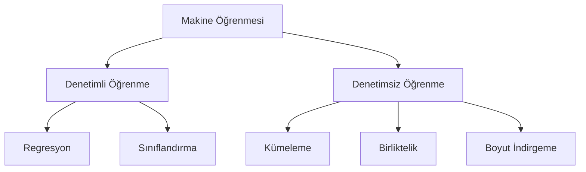
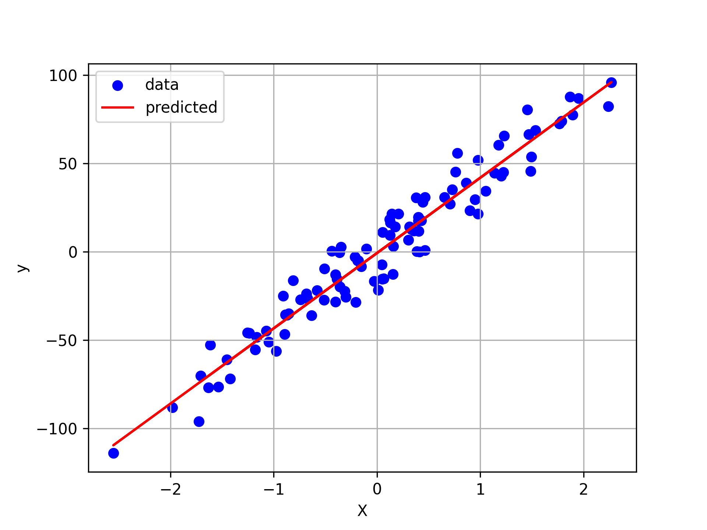
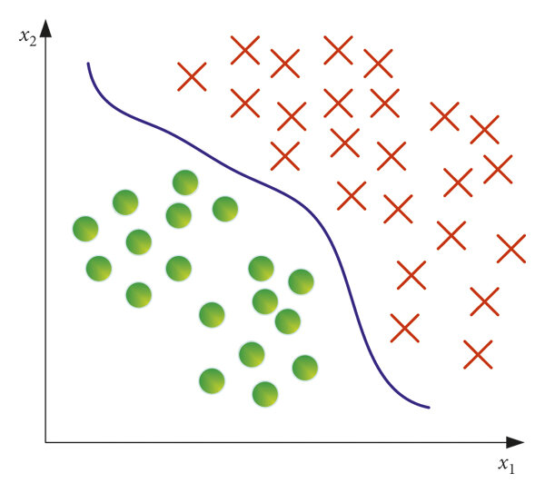
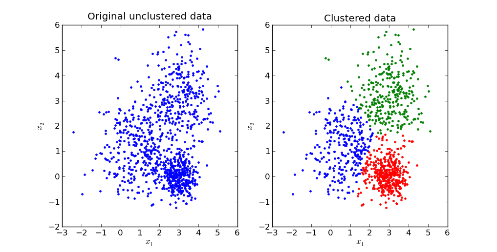
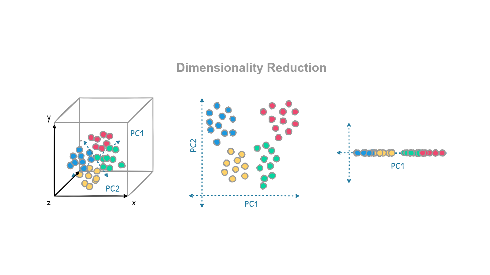
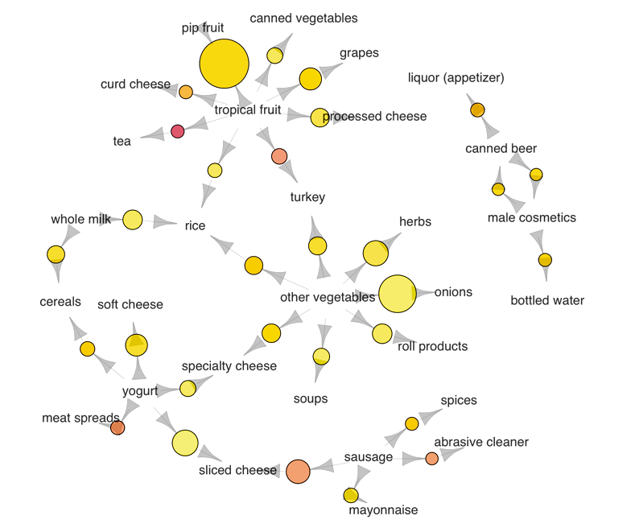

# Denetimli ve Denetimsiz Makine Öğrenmesi (Supervised and Unsupervised Machine Learning)

## Giriş (Introduction)

&emsp; Makine öğrenmesi (machine learning), yapay zekânın bir dalı olup sistemlerin açık bir şekilde programlanmadan öğrenmesine, tahminler yapmasına veya kararlar almasına olanak tanır. İki ana makine öğrenmesi türü **Denetimli Öğrenme (Supervised Learning)** ve **Denetimsiz Öğrenmedir (Unsupervised Learning)**. Aşağıda, bu iki türün özelliklerini, alt alanlarını ve görsel bir temsilini bulabilirsiniz.

---

 

## **Denetimli Öğrenme (Supervised Learning)**

&emsp; Denetimli öğrenme, modelin etiketlenmiş veriler (labeled data) üzerinde eğitildiği bir makine öğrenmesi türüdür. Etiketlenmiş veri, her girdi için karşılık gelen bir çıktının (veya hedefin) önceden sağlanmış olduğu anlamına gelir. Modelin amacı, girdiler ve çıktılar arasındaki ilişkiyi öğrenerek yeni, görülmemiş veriler için tahminler yapabilmektir.

### **Temel Özellikler (Key Characteristics)**

- **Girdi ve Çıktı:** Eğitim verisi, hem girdi özelliklerini (X) hem de hedef etiketleri (Y) içerir.
- **Amaç:** Belirli bir girdi (X) için çıktıyı (Y) tahmin etmek.

### **Alt Alanlar (Subfields)**

1. **Regresyon (Regression):** Sürekli değerlerin tahmin edilmesi (örneğin, daire büyüklüğüne göre kira fiyatlarının tahmin edilmesi).
2. **Sınıflandırma (Classification):** Girdilerin ayrık kategorilere atanması (örneğin, kanserin iyi huylu veya kötü huylu olarak teşhis edilmesi).

### **Örnek: Regresyon (Regression)**

- **Senaryo:** Daire büyüklüğüne (m²) göre kira fiyatlarının tahmin edilmesi.
- **Detaylar:**
  - Girdi özellikleri (X): Daire büyüklüğü, oda sayısı, mahalle vb.
  - Hedef değişken (Y): Kira fiyatı (örneğin, aylık $).
- **Modelin Görevi:** Daire özellikleri ile kira fiyatları arasındaki ilişkiyi öğrenmek ve yeni bir daire için kira fiyatını tahmin etmek.

    

### **Örnek: Sınıflandırma (Classification)**

- **Senaryo:** Kanser teşhisi (örneğin, iyi huylu veya kötü huylu tümör).
- **Detaylar:**
  - Girdi özellikleri (X): Tümör boyutu, doku, hücre şekli gibi ölçümler.
  - Hedef değişken (Y): Sınıf etiketi (örneğin, "İyi Huylu" veya "Kötü Huylu").
- **Modelin Görevi:** Girdi özelliklerine dayanarak yeni bir tümörü iyi huylu veya kötü huylu olarak sınıflandırmak.

    

---

 

## **Denetimsiz Öğrenme (Unsupervised Learning)**

&emsp; Denetimsiz öğrenme, etiketlenmemiş veriler (unlabeled data) ile ilgilenir. Model, önceden tanımlanmış herhangi bir etiket veya hedef olmadan veri içindeki örüntüleri, yapıları veya ilişkileri bulmaya çalışır. Genellikle keşifsel veri analizi (exploratory data analysis) için kullanılır.

### **Temel Özellikler (Key Characteristics)**

- **Yalnızca Girdi:** Veri, yalnızca girdi özelliklerini (X) içerir, hedef etiketleri (Y) yoktur.
- **Amaç:** Verideki gizli örüntüleri veya gruplaşmaları keşfetmek.

### **Alt Alanlar (Subfields)**

1. **Kümeleme (Clustering):** Benzer veri noktalarını kümeler halinde gruplama (örneğin, müşteri segmentasyonu).
2. **Boyut İndirgeme (Dimensionality Reduction):** Önemli bilgileri koruyarak veri setindeki özellik sayısını azaltma (örneğin, PCA).
3. **Birliktelik (Association):** Büyük veri setlerinde değişkenler arasındaki ilişkileri veya birliktelikleri keşfetme (örneğin, sepet analizi).

### **Örnek: Kümeleme (Clustering)**

- **Senaryo:** Hedefli pazarlama için müşterilerin gruplandırılması.
- **Detaylar:**
  - Girdi özellikleri (X): Müşteri yaşı, geliri, satın alma geçmişi, konumu vb.
  - Önceden tanımlanmış etiketler (Y) yoktur.
- **Modelin Görevi:** Müşteri kümelerini belirlemek (örneğin, "Yüksek harcamacılar," "Bütçe bilincine sahip alıcılar").

    

### **Örnek: Boyut İndirgeme (Dimensionality Reduction)**

- **Senaryo:** Yüksek boyutlu verilerin görselleştirilmesi.
- **Detaylar:**
  - 100'den fazla özelliğe sahip bir veri setiniz olduğunu düşünün (örneğin, bir fabrikadan alınan sensör verileri).
  - Boyut indirgeme (örneğin, PCA), daha kolay görselleştirme için veriyi 2B veya 3B'ye indirgemeye yardımcı olur.
- **Modelin Görevi:** Karmaşıklığı azaltırken verinin önemli yapısını korumak.

    

### **Örnek: Birliktelik (Association)**

- **Senaryo:** Ürün birlikteliklerini belirlemek için sepet analizi (market basket analysis).
- **Detaylar:**
  - Girdi özellikleri (X): Birlikte satın alınan ürünleri gösteren işlem verileri.
  - Önceden tanımlanmış etiketler (Y) yoktur.
- **Modelin Görevi:** "Bir müşteri ekmek alıyorsa, tereyağı alma olasılığı yüksektir" gibi kurallar belirlemek.
- **Kullanım Alanı:** Öneri sistemleri, envanter planlaması.

    

---

 

## **Karşılaştırma Tablosu (Comparison Table)**

| Özellik              | Denetimli Öğrenme                           | Denetimsiz Öğrenme                                  |
| -------------------- | ------------------------------------------- | --------------------------------------------------- |
| **Veri Türü**        | Etiketlenmiş veri (X, Y)                    | Etiketlenmemiş veri (yalnızca X)                    |
| **Amaç**             | Sonuçları tahmin etmek                      | Örüntüler veya yapılar bulmak                       |
| **Temel Teknikler**  | Regresyon, Sınıflandırma                    | Kümeleme, Boyut İndirgeme, Birliktelik              |
| **Örnekler**         | Dolandırıcılık tespiti, Hisse senedi fiyat tahmini | Pazar segmentasyonu, Görüntü sıkıştırma       |

---

## **Anahtar Çıkarımlar (Key Takeaways)**

- **Denetimli Öğrenme**, etiketlenmiş veri gerektirir ve regresyon ile sınıflandırma gibi tahmin görevlerinde yaygın olarak kullanılır.
- **Denetimsiz Öğrenme**, etiketlenmemiş verilerle çalışır ve kümeleme veya boyut indirgeme yoluyla gizli örüntüleri bulmaya odaklanır.
- Her tekniğin belirli uygulamaları vardır ve probleme ile mevcut veriye göre seçilir.

 
