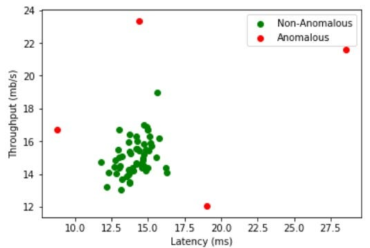
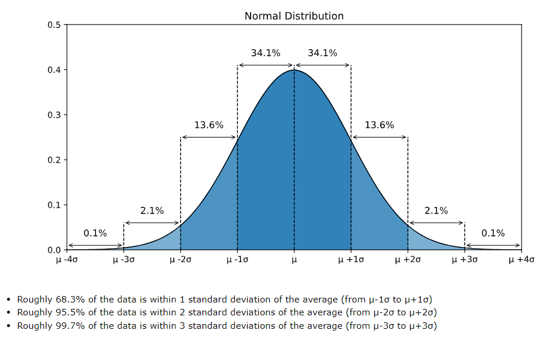
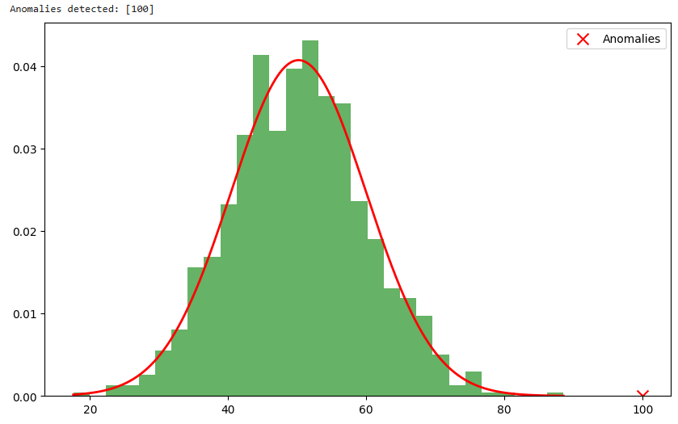

# Anomali Tespiti (Anomaly Detection)

<!-- toc -->

## Olağandışı Olayları Bulma

Anomali tespiti (anomaly detection), veride beklenen davranışa uymayan nadir veya olağandışı desenleri (pattern) belirleme sürecidir. Bu anomaliler, dolandırıcılık tespiti, sistem arızaları veya sağlık ve finans gibi çeşitli alanlardaki nadir olaylar gibi kritik durumlara işaret edebilir.

<div style="text-align: center;display:flex; justify-content: center; margin-bottom: 20px; ">
    
</div>

### Gerçek Dünyadan Örnekler

- **Kredi Kartı Dolandırıcılığı Tespiti (Credit Card Fraud Detection)**: Bir kullanıcının normal harcama alışkanlıklarından önemli ölçüde sapan şüpheli işlemleri belirleme.
- **Üretim Kusurları (Manufacturing Defects)**: Üretim metriklerindeki olağandışı desenleri belirleyerek hatalı ürünleri tespit etme.
- **Ağ Saldırı Tespiti (Network Intrusion Detection)**: Olağandışı ağ trafiğini tespit ederek siber saldırıları belirleme.
- **Tıbbi Teşhis (Medical Diagnosis)**: Hastalığa işaret edebilecek anormal desenleri tıbbi verilerde bulma.

## Gauss (Normal) Dağılımı (Gaussian Distribution)

Gauss dağılımı (Gaussian distribution), normal dağılım (normal distribution) olarak da bilinir ve istatistik ile makine öğreniminde temel bir olasılık dağılımıdır. Şu şekilde tanımlanır:

$$
P(x) = \frac{1}{\sqrt{2 \pi \sigma^2}} e^{- \frac{(x - \mu)^2}{2 \sigma^2}}
$$

Burada:

- $ \mu $, ortalamadır (mean / expected value)
- $ \sigma^2 $, varyanstır (variance)
- $ x $, ilgilenilen değişkendir

### Gauss Dağılımının Özellikleri

<div style="text-align: center;display:flex; justify-content: center; margin-bottom: 20px; ">
    
</div>

- **Simetrik (Symmetric)**: Ortalama $ \mu $ etrafında merkezlenmiştir
- **$68-95-99.7$ Kuralı**:
  - Değerlerin $68\%$'i ortalamanın $1$ standart sapma ($ \sigma $) içindedir.
  - $95\%$'i $2$ standart sapma içindedir.
  - $99.7\%$'si $3$ standart sapma içindedir.

Gauss dağılımı, anomali tespitinde genellikle normal davranışı modellemek için kullanılır; bu dağılımdan sapmalar anomali olarak değerlendirilir.

## Anomali Tespit Algoritması (Anomaly Detection Algorithm)

### Anomali Tespitindeki Adımlar

1. **Öznitelik Seçimi (Feature Selection)**: Veri kümesinden ilgili öznitelikleri (feature) belirleme.
2. **Normal Davranışı Modelleme**: Normal veriye bir olasılık dağılımı (örneğin Gauss) uydurma (fit).
3. **Olasılık Yoğunluğunu Hesaplama**: Öğrenilen dağılımı kullanarak yeni veri noktalarının olasılık yoğunluğunu (probability density) hesaplama.
4. **Eşik Belirleme (Threshold)**: Veri noktalarının anomali olarak sınıflandırılacağı bir eşik değeri tanımlama.
5. **Anomalileri Tespit Etme**: Yeni gözlemleri eşik değeri ile karşılaştırma.

### Matematiksel Yaklaşım

Bir $ x $ özniteliği için, Gauss dağılımı varsayımıyla:

$$

P(x) = \frac{1}{\sqrt{2 \pi \sigma^2}} e^{- \frac{(x - \mu)^2}{2 \sigma^2}}


$$

Eğer $ P(x) $, önceden tanımlanmış bir $ \epsilon $ eşik değerinden düşükse, $ x $ bir anomali olarak kabul edilir:

$$

P(x) < \epsilon \Rightarrow x \text{ bir anomalidir}


$$

## Anomali Tespit Sistemi Geliştirme ve Değerlendirme

### Veri Hazırlığı

- **Normal ve anormal örnekler içeren etiketlenmiş bir veri kümesi elde edin**
- **Veriyi ön işleme**: Eksik değerleri ele alın, öznitelikleri normalize edin

### Model Eğitimi

1. Eğitim verisini kullanarak $ \mu $ ve $ \sigma^2 $ parametrelerini tahmin edin:

$$
\mu = \frac{1}{m} \sum\limits_{i=1}^{m} x^{(i)}, \quad \sigma^2 = \frac{1}{m} \sum\limits_{i=1}^{m} (x^{(i)} - \mu)^2
$$

2. Test verisi için olasılık yoğunluğunu hesaplayın
3. Anomali eşiği $ \epsilon $'yı belirleyin

### Performans Değerlendirmesi

- **Kesinlik-Geri Çağırma Dengesi (Precision-Recall Tradeoff)**: Daha yüksek geri çağırma (recall) daha fazla anomali yakalamak anlamına gelir ancak yanlış pozitifleri (false positive) artırabilir.
- **F1 Skoru (F1 Score)**: Kesinlik (precision) ve geri çağırmanın harmonik ortalamasıdır.
- **ROC Eğrisi (ROC Curve)**: Farklı eşik ayarlarını değerlendirir.

## 5. Anomali Tespiti ve Denetimli Öğrenme Karşılaştırması

| Öznitelik                     | Anomali Tespiti (Anomaly Detection) | Denetimli Öğrenme (Supervised Learning) |
| ----------------------------- | ----------------------------------- | --------------------------------------- |
| Etiket Gerekli mi?            | Hayır                               | Evet                                    |
| Etiketsiz Veriyle Çalışır mı? | Evet                                | Hayır                                   |
| Nadir Olaylar İçin Uygun mu?  | Evet                                | Hayır                                   |
| Örnekler                      | Dolandırıcılık tespiti, Üretim kusurları | Spam tespiti, Görüntü sınıflandırma     |

## Kullanılacak Öznitelikleri Seçme

- **Alan Bilgisi (Domain Knowledge)**: Hangi özniteliklerin ilgili olduğunu anlayın.
- **İstatistiksel Analiz (Statistical Analysis)**: Korelasyon matrisleri ve dağılımları kullanın.
- **Öznitelik Ölçekleme (Feature Scaling)**: Veriyi normalize veya standardize edin.
- **Boyut İndirgeme (Dimensionality Reduction)**: Gürültüyü azaltmak için PCA veya Otokodlayıcılar (Autoencoders) kullanın.

## TensorFlow ile Tam Python Örneği

```python
import numpy as np
import tensorflow as tf
from scipy.stats import norm
import matplotlib.pyplot as plt

# Sentez normal veri oluştur
np.random.seed(42)
data = np.random.normal(loc=50, scale=10, size=1000)

# Ortalama ve varyansı hesapla
mu = np.mean(data)
sigma = np.std(data)

# Olasılık yoğunluk fonksiyonunu tanımla
pdf = norm(mu, sigma).pdf(data)

# Anomali eşiğini belirle (örneğin, %0.1 persentil)
threshold = np.percentile(pdf, 1)

# Yeni test noktaları oluştur
new_data = np.array([30, 50, 70, 100])
new_pdf = norm(mu, sigma).pdf(new_data)

# Anomalileri tespit et
anomalies = new_data[new_pdf < threshold]
print("Anomalies detected:", anomalies)

# Görselleştir
plt.figure(figsize=(10, 6))
plt.hist(data, bins=30, density=True, alpha=0.6, color='g')
x = np.linspace(min(data), max(data), 1000)
plt.plot(x, norm(mu, sigma).pdf(x), 'r', linewidth=2)
plt.scatter(anomalies, norm(mu, sigma).pdf(anomalies), color='red', marker='x', s=100, label='Anomalies')
plt.legend()
plt.show()
```

<div style="text-align: center;display:flex; justify-content: center; margin-bottom: 20px; ">
    
</div>

### Açıklama

1. **Sentez veri oluşturma**: Normal bir veri kümesi oluşturuyoruz.
2. **Ortalama ve varyansı hesaplama**: Normal davranışı modelliyoruz.
3. **Olasılık yoğunluğunu hesaplama**: Her veri noktasının olasılığını belirliyoruz.
4. **Eşik belirleme**: Bir anomali sınır değeri tanımlıyoruz.
5. **Anomalileri tespit etme**: Yeni gözlemleri eşik değeriyle karşılaştırıyoruz.
6. **Sonuçları görselleştirme**: Normal dağılımı ve tespit edilen anomalileri gösteriyoruz.

Bu örnek, olasılık dağılımlarını kullanarak anomali tespiti için bir temel sağlar ve otokodlayıcılar (autoencoders) veya Gauss Karışım Modelleri (Gaussian Mixture Models - GMMs) gibi derin öğrenme teknikleriyle genişletilebilir.
