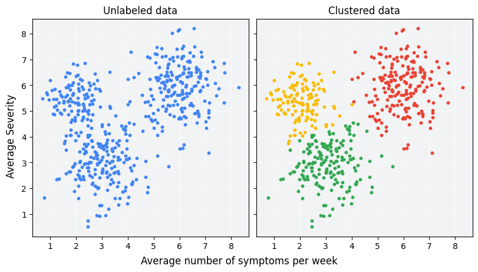
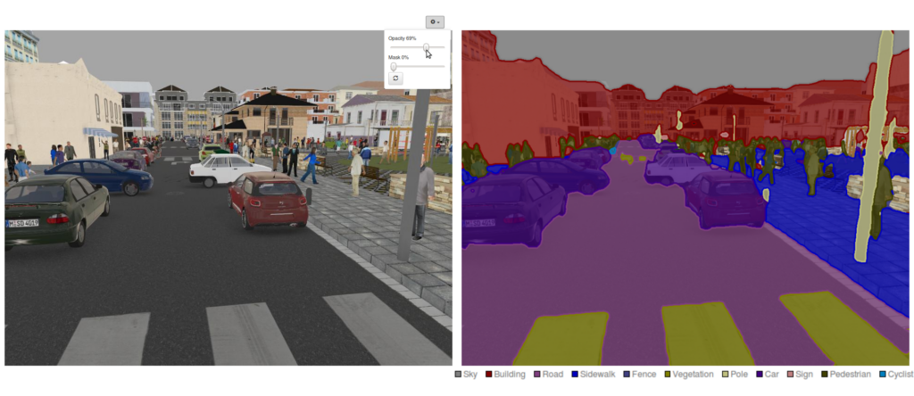
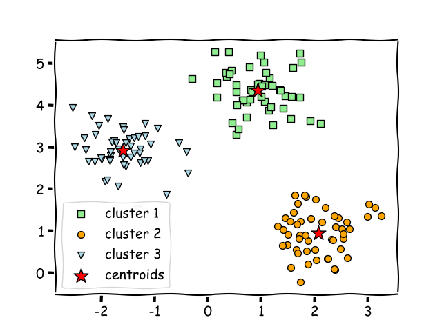
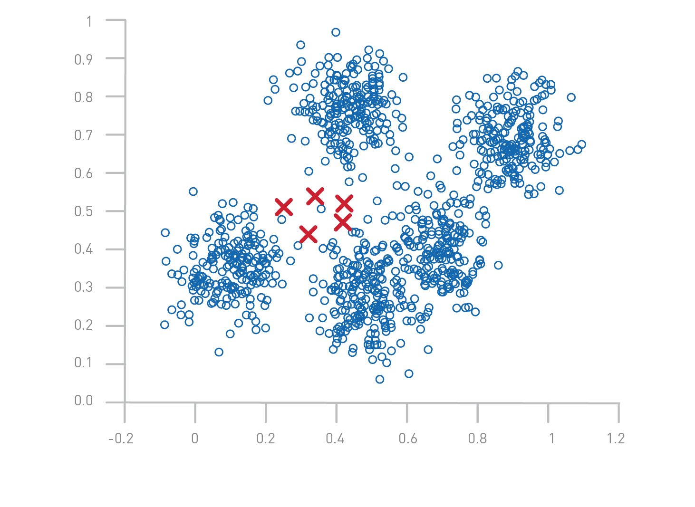
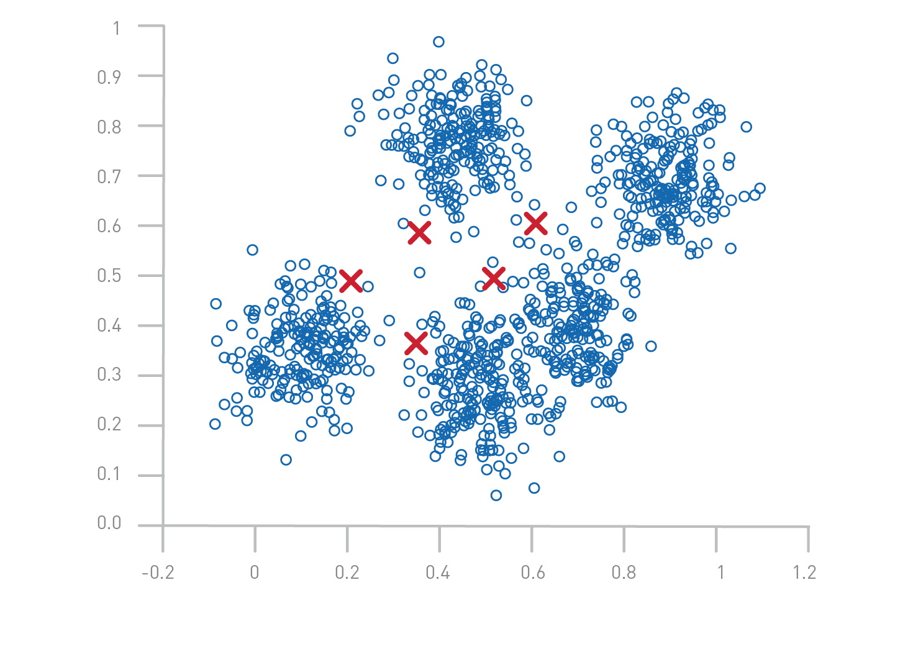
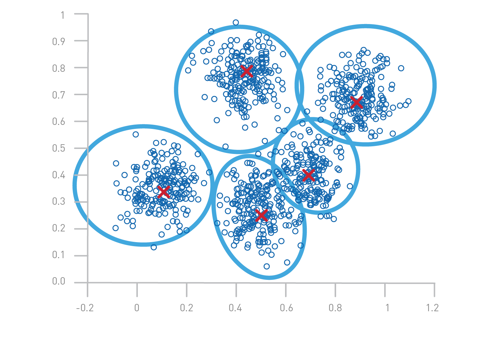
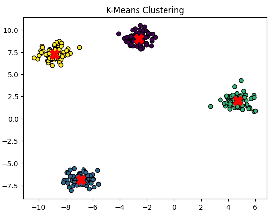
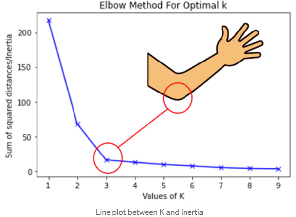
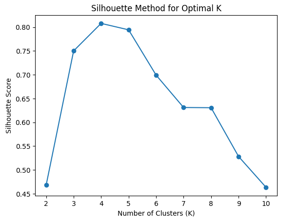

# K-Means Kümeleme

<!-- toc -->

## Kümeleme Nedir?

<div style="text-align: center;display:flex; justify-content: center; margin-bottom: 20px; ">
    
</div>

Kümeleme (clustering), veri noktalarını benzerliklerine göre ayrı kümeler halinde gruplamak için kullanılan bir gözetimsiz öğrenme (unsupervised learning) tekniğidir. Gözetimli öğrenmenin aksine, kümeleme etiketli verilere dayanmaz, bunun yerine bir veri kümesi içindeki temel yapıları belirler.

### Kümelemenin Uygulama Alanları

- **Müşteri Segmentasyonu (Customer Segmentation):** Benzer satın alma davranışlarına sahip müşteri gruplarını belirleme.
- **Anomali Tespiti (Anomaly Detection):** Finansal işlemlerdeki hileli faaliyetleri tespit etme.
- **Görüntü Segmentasyonu (Image Segmentation):** Bir görüntüyü anlamlı bölgelere ayırma.
    <div style="text-align: center;display:flex; justify-content: center; margin-bottom: 20px; ">
    
    </div>
- **Doküman Kategorizasyonu (Document Categorization):** Benzer konulara sahip dokümanları gruplama.
- **Genomik (Genomics):** Gen ifade modellerini belirleme ve biyolojik verileri kategorize etme.
- **Sosyal Ağ Analizi (Social Network Analysis):** Bir ağ içindeki toplulukları tespit etme.

## K-Means Sezgisi

K-Means, basitliği, verimliliği ve ölçeklenebilirliği nedeniyle en yaygın kullanılan kümeleme algoritmalarından biridir. K-Means'in temel amacı, belirli bir veri kümesini `K` kümeye ayırarak küme içi varyansı (intra-cluster variance) en aza indirirken kümeler arası farklılıkları (inter-cluster differences) en üst düzeye çıkarmaktır.

### Temel Sezgi:

<div style="text-align: center;display:flex; justify-content: center; margin-bottom: 20px; ">
    
</div>

1. Aynı küme içindeki veri noktaları mümkün olduğunca benzer olmalıdır.
2. Farklı kümelerdeki veri noktaları mümkün olduğunca farklı olmalıdır.
3. Her kümenin **_merkezi (centroid)_** , o kümedeki tüm noktaların `ortalamasını` temsil eder.
4. Algoritma, yakınsamaya (convergence) kadar kümeleri yinelemeli olarak iyileştirir.

## K-Means Algoritması

K-Means algoritması şu adımları izler:

1.  **K küme merkezini (centroid) rastgele** veya belirli bir yöntem (örneğin, K-Means++) kullanarak başlat.
<div style="text-align: center;display:flex; justify-content: center; margin-bottom: 20px; ">

</div>

2.  **Her bir veri noktasını** Öklid mesafesi (Euclidean distance) kullanarak en yakın merkeze ata:
    $$
    d(x, c) = \sqrt{(x_1 - c_1)^2 + (x_2 - c_2)^2 + \dots + (x_n - c_n)^2}
    $$
    <div style="text-align: center;display:flex; justify-content: center; margin-bottom: 20px; ">
    
     </div>
3.  **Merkezleri güncelle** — her kümeye atanan tüm noktaların ortalamasını hesaplayarak:
    $$
    c_k = \frac{1}{N_k} \sum_{i=1}^{N_k} x_i
    $$
    burada $ N_k $, $ k $ kümesindeki nokta sayısıdır.
     <div style="text-align: center;display:flex; justify-content: center; margin-bottom: 20px; ">
     
     </div>
4.  **Tekrarla** — merkezler stabilize olana kadar (iterasyonlar arasında önemli ölçüde değişmeyene kadar).

## Optimizasyon Hedefi

Yakınlık ölçüsü olarak Öklid mesafesini kullanan verileri ele alalım. Kümeleme kalitesini ölçen amaç fonksiyonumuz için, dağılım (scatter) olarak da bilinen hata kareleri toplamını (Sum of Squared Errors — SSE) kullanırız.

Başka bir deyişle, her bir veri noktasının hatasını, yani en yakın merkeze olan Öklid mesafesini hesaplar ve ardından hata karelerinin toplamını buluruz. K-means'in iki farklı çalıştırması tarafından üretilen iki farklı küme seti verildiğinde, en küçük hata karesine sahip olanı tercih ederiz, çünkü bu, bu kümelemenin prototiplerinin (**merkezler**), kendi kümelerindeki noktaları daha iyi temsil ettiği anlamına gelir.

$$
J = \sum_{i=1}^{m} \sum_{k=1}^{K} w_{ik} ||x_i - c_k||^2
$$

burada:

- $ x_i $ bir veri noktasıdır.
- $ c_k $, $ k $ kümesinin merkezidir.
- $ w_{ik} $, $ x_i $, $ k $ kümesine aitse 1, aksi halde 0'dır.

## K-Means'i Başlatma

Başlatma (initialization), K-Means'in performansını ve sonuçlarını önemli ölçüde etkiler. Yaygın başlatma yöntemleri şunlardır:

- **Rastgele Başlatma (Random Initialization):** Veri kümesinden K rastgele nokta seçme.
- **K-Means++ Başlatması:** Yakınsama hızını artırmak ve zayıf kümeleme sonuçları riskini azaltmak için ilk merkezleri yayan daha akıllı bir yöntem.
- **Forgy Yöntemi:** Başlangıç merkezleri olarak K farklı veri noktası seçme.

## Küme Sayısını Seçme

Uygun küme sayısını (K) seçmek çok önemlidir. Yaygın yöntemler şunlardır:

- **Dirsek Yöntemi (Elbow Method):** WCSS'yi K'ya karşı çizme ve 'dirsek' noktasını belirleme.
- **Siluet Skoru (Silhouette Score):** Bir veri noktasının kendi kümesine karşı diğer kümelere ne kadar benzer olduğunu ölçme.
- **Gap İstatistiği (Gap Statistic):** Optimal K'yi belirlemek için WCSS'yi rastgele bir dağılımla karşılaştırma.

## Python ile K-Means Uygulaması

```python
import numpy as np
import matplotlib.pyplot as plt
from sklearn.cluster import KMeans
from sklearn.datasets import make_blobs

# Create a synthetic dataset
X, _ = make_blobs(n_samples=300, centers=4, cluster_std=0.6, random_state=42)

# Apply K-Means
kmeans = KMeans(n_clusters=4, random_state=42)
kmeans.fit(X)
labels = kmeans.labels_
centroids = kmeans.cluster_centers_

# Plot the clusters
plt.scatter(X[:, 0], X[:, 1], c=labels, cmap='viridis', marker='o', edgecolor='black')
plt.scatter(centroids[:, 0], centroids[:, 1], s=200, c='red', marker='X')
plt.title("K-Means Clustering")
plt.show()
```

<div style="text-align: center;display:flex; justify-content: center; margin-bottom: 20px; ">
    
</div>

## Küme Sayısını Seçme

K-Means kümelemesinden anlamlı sonuçlar elde etmek için uygun küme sayısını (K) seçmek çok önemlidir. Çok az küme seçmek yetersiz öğrenmeye (underfitting) yol açabilirken, çok fazla seçmek aşırı öğrenmeye (overfitting) ve gereksiz karmaşıklığa neden olabilir. Optimal K'yi belirlemeye yardımcı olan birkaç teknik vardır:

### 1. Dirsek Yöntemi (Elbow Method)

Dirsek Yöntemi, Atık-Küme İçi Kareler Toplamı (Within-Cluster Sum of Squares — WCSS) veya eylemsizlik (inertia) olarak da bilinen değeri analiz ederek K seçimi için yaygın olarak kullanılan bir buluşsal yöntemdir (heuristic).

<div style="text-align: center;display:flex; justify-content: center; margin-bottom: 20px; ">
    
</div>

**Adımlar:**

1. Farklı K değerleri için (örneğin, 1'den 10'a kadar) K-Means kümelemesini çalıştırın.
2. Her K için WCSS'yi hesaplayın. WCSS şu şekilde tanımlanır:
   $$
   WCSS = \sum_{i=1}^{K} \sum_{x \in C_i} || x - \mu_i ||^2
   $$
   burada $ \mu_i $, $ C_i $ kümesinin merkezi ve $ x $, o kümedeki bir veri noktasıdır.
3. WCSS'yi K'ya karşı çizin ve azalma oranının keskin bir şekilde değiştiği bir 'dirsek' noktası arayın.
4. Optimal K, daha fazla küme eklemenin WCSS'yi önemli ölçüde azaltmadığı dirsek noktasında seçilir.

### 2. Siluet Skoru (Silhouette Score)

Siluet Skoru, bir veri noktasının kendi kümesine diğer kümelere kıyasla ne kadar benzer olduğunu hesaplayarak kümelerin ne kadar iyi tanımlandığını ölçer. $-1$ ile $1$ arasında değişir:

- **1:** Veri noktası iyi kümelendirilmiştir.
- **0:** Veri noktası küme sınırındadır.
- **-1:** Veri noktası yanlış kümelendirilmiştir.

<div style="text-align: center;display:flex; justify-content: center; margin-bottom: 20px; ">
    
</div>

**Adımlar:**

1. Her veri noktası için ortalama küme içi mesafe $ a(i) $'yi hesaplayın.
2. Her veri noktası için ortalama en yakın küme mesafesi $ b(i) $'yi hesaplayın.
3. Her nokta için siluet skorunu hesaplayın:
   $$
   S(i) = \frac{b(i) - a(i)}{\max(a(i), b(i))}
   $$
4. Genel Siluet Skoru, tüm $ S(i) $ değerlerinin ortalamasıdır.
5. Optimal K, Siluet Skorunu maksimize eden değerdir.

### 3. Gap İstatistiği (Gap Statistic)

Gap İstatistiği, veri kümesinin kümeleme kalitesini rastgele bir düzgün dağılımla karşılaştırır. Belirli bir kümeleme yapısının rastgele kümelemeden önemli ölçüde daha iyi olup olmadığını belirlemeye yardımcı olur.

**Adımlar:**

1. Farklı K değerleri için K-Means'i çalıştırın ve küme içi dağılım $ W_k $'yi hesaplayın.
2. Benzer bir aralığa sahip rastgele bir veri kümesi oluşturun ve $ W_k^{rastgele} $ değerini hesaplayın.
3. Gap istatistiğini hesaplayın:
   $$
   G_k = \frac{1}{B} \sum_{b=1}^{B} \log(W_k^{rastgele}) - \log(W_k)
   $$
   burada $ B $, rastgele veri kümelerinin sayısıdır.
4. $ G_k $'nın anlamlı derecede büyük olduğu en küçük K'yı seçin.

## K-Means'in Avantajları ve Dezavantajları

### Avantajlar

1. **Basitlik (Simplicity):** Anlaşılması ve uygulanması kolaydır.
2. **Ölçeklenebilirlik (Scalability):** Büyük veri kümeleri için verimlidir.
3. **Hızlı Yakınsama (Fast Convergence):** Tipik olarak birkaç iterasyonda yakınsar.
4. **Dışbükey kümeler için iyi çalışır:** Kümeler iyi ayrılmışsa, K-Means etkili bir şekilde performans gösterir.
5. **Yorumlanabilir Sonuçlar:** Kümeler kolayca görselleştirilebilir ve analiz edilebilir.

### Dezavantajlar

1. **K Seçimi:** Küme sayısını seçmek için ön bilgi veya buluşsal yöntemler gerektirir.
2. **Başlatmaya Duyarlılık (Sensitivity to Initialization):** Zayıf başlangıç merkezi seçimi, optimal olmayan sonuçlara yol açabilir.
3. **Dışbükey Olmayan Şekiller İçin Uygun Değildir:** Rasgele şekilli kümelerde zorlanır.
4. **Aykırı Değerlerden Etkilenir (Affected by Outliers):** Aykırı değerler merkezleri kaydırarak zayıf kümelemeye yol açabilir.
5. **Eşit Varyans Varsayımı (Equal Variance Assumption):** Kümelerin benzer varyansa sahip olduğunu varsayar, bu her zaman geçerli olmayabilir.

**Zayıf Performans Örneği:**
Veri kümesi, değişen yoğunluklara veya küresel olmayan şekillere sahip kümeler içeriyorsa, K-Means veri noktalarını yanlış sınıflandırabilir. Bu gibi durumlarda DBSCAN veya Gauss Karışım Modelleri (Gaussian Mixture Models — GMMs) gibi alternatifler daha iyi performans gösterebilir.

## Sonuç

K-Means, endüstrilerde yaygın olarak kullanılan güçlü bir kümeleme tekniğidir. Basit ve verimli olmasına rağmen, başlatmaya duyarlılık ve dışbükey olmayan kümeleri işlemede zorluk gibi sınırlamaları vardır. Bununla birlikte, optimizasyon teknikleri ve dikkatli K seçimi uygulanarak, gözetimsiz öğrenmede güçlü bir araç olmaya devam etmektedir.
