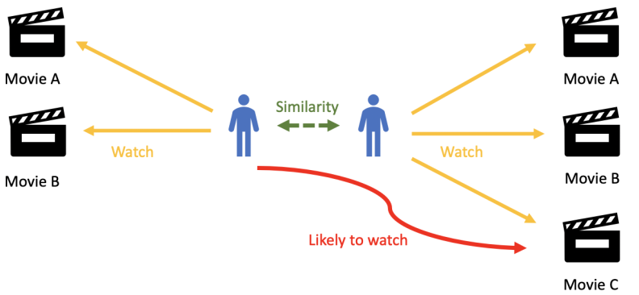
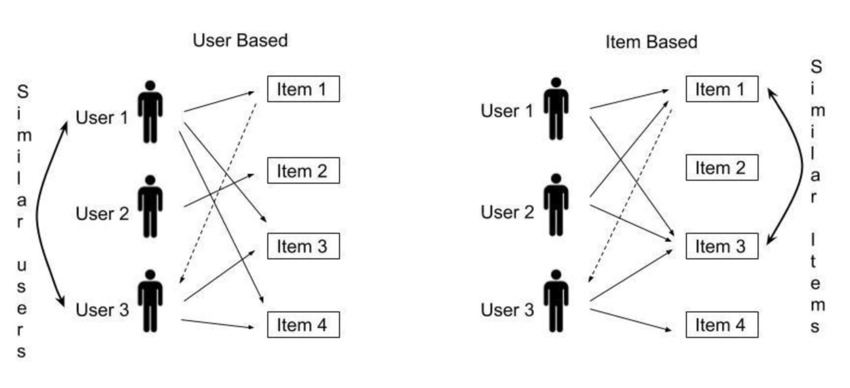
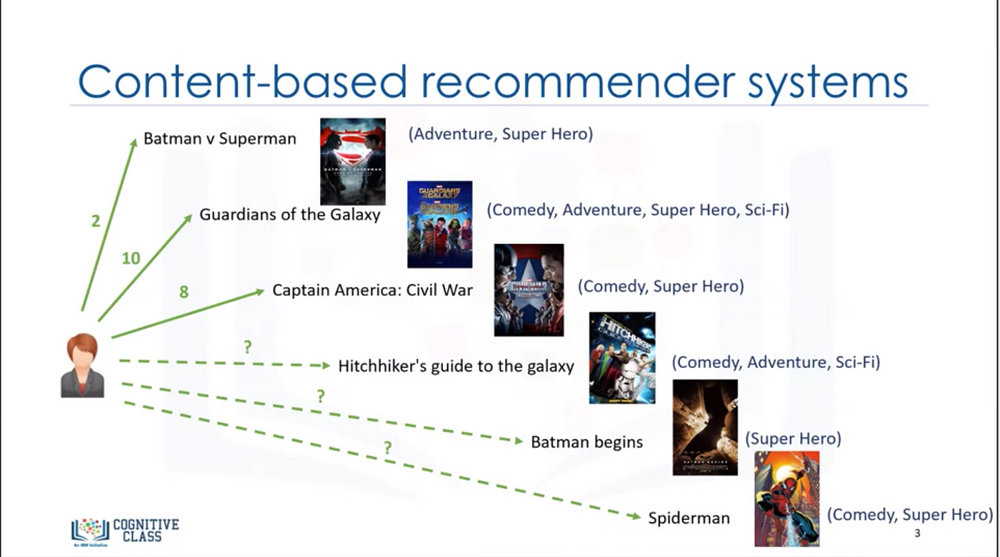
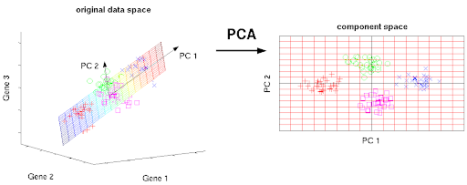
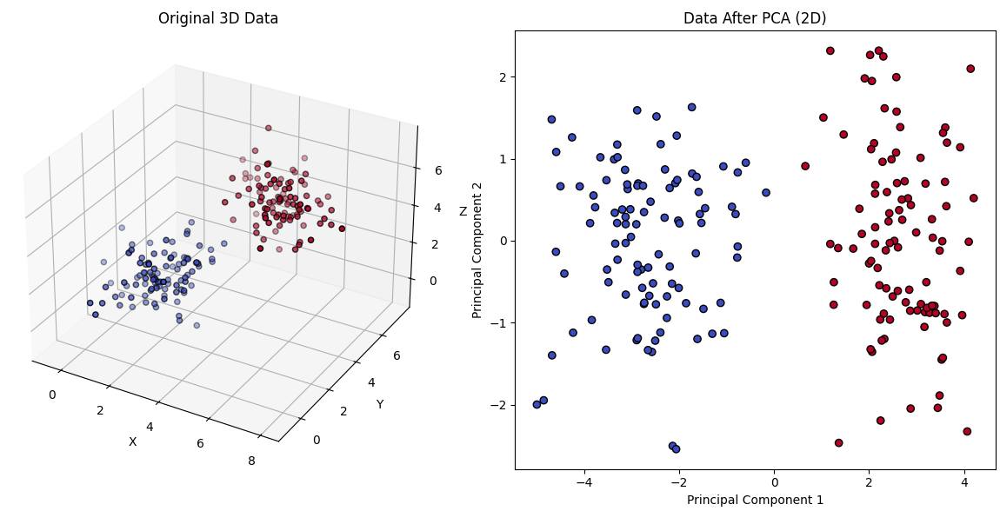

# Öneri Sistemleri (Recommender Systems)

<!-- toc -->

<br/>

Öneri sistemleri (recommender systems), dijital hayatımızın her yerinde karşımıza çıkar; Netflix'in izleme geçmişimize göre film önermesinden Amazon'un önceki satın alımlarımıza dayanarak ürün tavsiye etmesine kadar. Bu sistemler, kullanıcıların geçmiş davranışlarına veya öğelerin kendi niteliklerine dayanarak neleri sevebileceklerini tahmin etmeyi amaçlar.

# Ortak Filtreleme (Collaborative Filtering)

Ortak filtreleme (collaborative filtering), öneri sistemlerinde en yaygın kullanılan tekniklerden biridir. Kullanıcıların davranışlarını ve tercihlerini kullanarak, kullanıcıların neleri sevebileceği hakkında tahminler yapar. Ortak filtreleme, öğelerin kendi özelliklerine güvenmek yerine, kullanıcılar ve öğeler arasındaki etkileşimlere odaklanır.

<div style="text-align: center;display:flex; justify-content: center; margin-bottom: 20px; ">
    
</div>

Netflix gibi bir akış platformu düşünün. "Matrix" filmi izleyen kullanıcıların çoğu "Inception" filmini de izlediyse, sistem daha önce "Matrix" izlemiş bir kullanıcıya "Inception" önerebilir. Bu yöntem, benzer kullanıcıların benzer zevklere sahip olduğu varsayımına dayanır.

Ortak filtrelemenin iki ana türü vardır:

1. **Kullanıcı Tabanlı Ortak Filtreleme (User-based Collaborative Filtering)**: Öneriler, benzer tercihlere sahip kullanıcılar bularak yapılır.
2. **Öğe Tabanlı Ortak Filtreleme (Item-based Collaborative Filtering)**: Öneriler, kullanıcı etkileşimlerine dayanarak benzer öğeler bularak yapılır.

<br/>

## Kullanıcı Tabanlı Ortak Filtreleme (User-based Collaborative Filtering)

Dört kullanıcılı (A, B, C, D) ve yedi filmli (M1, M2, M3, M4, M5, M6, M7) bir film öneri sistemi düşünelim. Kullanıcılar filmlerden bazılarını 1 ile 5 arasında bir ölçekte puanlamıştır, ancak her kullanıcı her filmi izlememiştir. Amacımız, **D** kullanıcısının **izlemediği filmlerden** hangisini en çok seveceğini tahmin etmek ve onu önermektir.

Aşağıda puanlama matrisi (ratings matrix) yer almaktadır:

| Kullanıcı | M1  | M2  | M3  | M4  | M5  | M6  | M7  |
| --------- | --- | --- | --- | --- | --- | --- | --- |
| A         | 5   | 3   | 4   | -   | 2   | -   | 1   |
| B         | 4   | -   | 5   | 3   | 1   | 2   | -   |
| C         | 3   | 5   | -   | 4   | -   | 1   | 2   |
| D         | -   | 4   | 5   | 2   | 1   | -   | -   |

**D** kullanıcısı **M1, M6 ve M7** filmlerini puanlamamıştır, bu nedenle hangisini en çok beğeneceğini tahmin etmemiz gerekiyor.

<br/>

**Benzer Kullanıcıları Bulma**

**D**'ye en çok benzeyen kullanıcıları belirlemek için bir benzerlik ölçütü (similarity measure) kullanırız. Yaygın bir seçenek, şu şekilde tanımlanan **kosinüs benzerliğidir (cosine similarity)**:

$$
\text{sim}(u, v) = \frac{ \sum_{i \in I} r_{ui} r_{vi} }{ \sqrt{ \sum_{i \in I} r_{ui}^2 } \sqrt{ \sum_{i \in I} r_{vi}^2 } }
$$

burada:

- $ r_{ui} $, $ u $ kullanıcısının $ i $ öğesine verdiği puandır.
- $ I $, her iki kullanıcı tarafından da puanlanmış öğelerin kümesidir.

**D** ile diğer kullanıcılar arasındaki benzerliği hesaplama:

**Kosinüs benzerliğini** kullanarak D'yi diğer kullanıcılarla karşılaştırıyoruz:

| Kullanıcı | M2  | M3  | M5  |
| --------- | --- | --- | --- |
| A         | 3   | 4   | 2   |
| D         | 4   | 5   | 1   |

<br/>

$$
sim(D, A) = \frac{(4 \times 3) + (5 \times 4) + (1 \times 2)}{\sqrt{(4^2 + 5^2 + 1^2)} \times \sqrt{(3^2 + 4^2 + 2^2)}} = 0.974
$$

Benzer şekilde hesaplıyoruz:

| Kullanıcı | M3  | M4  | M5  |
| --------- | --- | --- | --- |
| B         | 5   | 3   | 1   |
| D         | 5   | 2   | 1   |

<br/>

| Kullanıcı | M2  | M4  |
| --------- | --- | --- |
| C         | 5   | 4   |
| D         | 4   | 2   |

$$
sim(D, B) = 0.988, \quad sim(D, C) = 0.979
$$

<br/>

**B**, **D**'ye en çok benzediğinden, **D**'nin izlemediği filmler **(M1, M6, M7)** için puanlarını ağırlıklı ortalama (weighted average) kullanarak tahmin ederiz:

$$
\hat{r}_{D, j} = \bar{r}_D + \frac{ \sum_{u} \, \text{sim}(D, u) \cdot (r_{u, j} - \bar{r}_u) }{ \sum_{u} |\text{sim}(D, u)| }
$$

<br/>

**M1 için Puan Tahmini**

Ağırlıklı toplam formülünü kullanarak:

<br/>

$$
\hat{r}_{D, M1} = \frac{(sim(D, A) \times r_{A, M1}) + (sim(D, B) \times r*{B, M1}) + (sim(D, C) \times r*{C, M1})}{sim(D, A) + sim(D, B) + sim(D, C)}
$$

<br/>

$$
\hat{r}_{D, M1} = \frac{(0.974 \times 5) + (0.988 \times 4) + (0.979 \times 3)}{0.974 + 0.988 + 0.979} = 3.998
$$

<br/>

M6 ve M7 için tekrarladığımızda şunları elde ederiz:

$$
\hat{r}_{D, M6} = 1.494, \quad \hat{r}_{D, M7} = 1.505
$$

**M1 en yüksek tahmini puana (3.998)** sahip olduğu için, D kullanıcısına M1'i öneriyoruz.

- **M1 için tahmini puan: 3.998**
- **M6 için tahmini puan: 1.494**
- **M7 için tahmini puan: 1.505**

**M1** en yüksek tahmini puana sahip olduğundan, **D**'ye **M1**'i öneriyoruz.

<br/>

## Öğe Tabanlı Ortak Filtreleme (Item-based Collaborative Filtering)

<div style="text-align: center;display:flex; justify-content: center; margin-bottom: 20px; ">
    
</div>

Benzer kullanıcıları bulmak yerine, **öğe tabanlı ortak filtreleme**, kullanıcıların onları nasıl puanladığına dayanarak benzer öğeleri belirler. Temel fikir, iki filmin birçok kullanıcı tarafından benzer şekilde puanlanması durumunda, bu filmlerin benzer olma olasılığının yüksek olmasıdır.

**Benzer Öğeleri Bulma**

Öğe benzerliğini belirlemek için kosinüs benzerliğini kullanırız, ancak bu kez kullanıcı puan vektörleri yerine film puan vektörleri arasında hesaplama yaparız.

**M1, M6 ve M7** ile diğer filmler arasındaki benzerliği hesaplama:

- **sim(M1, M3)** = 0.82
- **sim(M6, M2)** = 0.78
- **sim(M7, M5)** = 0.73

**M3**, **M1**'e en çok benzediğinden, **D'nin M1 puanını**, **D'nin M3 puanına** dayanarak tahmin ederiz:

$$
\hat{r}_{D, M1} = \frac{ \sum_{i} \, \text{sim}(M1, i) \cdot r_{D, i} }{ \sum_{i} |\text{sim}(M1, i)| }
$$

Hesaplamalardan sonra:

- **M1 için tahmini puan: 4.1**
- **M6 için tahmini puan: 3.7**
- **M7 için tahmini puan: 3.6**

**M1** en yüksek tahmini puana sahip olduğu için, yine **D**'ye **M1**'i öneriyoruz.

<br/>

**Sonuç**

- **Kullanıcı tabanlı filtreleme**, benzer kullanıcıları bulur ve onların tercihlerine göre öneri yapar.
- **Öğe tabanlı filtreleme**, benzer öğeleri bulur ve bir kullanıcının geçmişine dayanarak puan tahmini yapar.
- Her iki yöntem de **D'nin en çok M1'i beğeneceğini** tahmin etmiş, bu da M1'i en iyi öneri haline getirmiştir.
- Bu teknikler, doğruluğu artırmak için **hibrit öneri sistemlerinde (hybrid recommender systems)** birleştirilebilir.

<br/>
<br/>

---

<br/>
<br/>

# İçerik Tabanlı Filtreleme (Content-Based Filtering)

İçerik tabanlı filtreleme (content-based filtering), bir kullanıcının etkileşimde bulunduğu öğelerin özelliklerini analiz ederek ve bunları diğer öğelerin özellikleriyle karşılaştırarak önerilerde bulunur. Kullanıcı-öğe etkileşimlerine dayanan ortak filtrelemenin aksine, içerik tabanlı filtreleme, benzerlikleri belirlemek için tür (genre), oyuncular veya metin açıklamaları gibi öğe meta verilerini (item metadata) kullanır.

**İçerik Tabanlı Filtrelemeyi Anlamak**

İçerik tabanlı filtrelemede, her öğe bir dizi özellik (feature) ile temsil edilir. Kullanıcıların, daha önce beğendikleri öğelere benzer özelliklere sahip öğelere karşı bir tercihi olduğu varsayılır. Öneri süreci tipik olarak şunları içerir:

<div style="text-align: center;display:flex; justify-content: center; margin-bottom: 20px; ">
    
</div>

1. **Özellik Temsili (Feature Representation)**: Öğelerin özellik vektörleri (feature vectors) cinsinden temsil edilmesi.
2. **Kullanıcı Profili Oluşturma (User Profile Construction)**: Geçmiş etkileşimlere dayanarak her kullanıcı için bir tercih modeli oluşturulması.
3. **Benzerlik Hesaplama (Similarity Computation)**: Yeni öğelerin kullanıcının profiliyle karşılaştırılarak öneriler oluşturulması.
4. **Önerilerin Oluşturulması (Generating Recommendations)**: Öğelerin benzerlik puanlarına göre sıralanması ve en iyilerinin önerilmesi.

Bu yaklaşımı daha iyi anlamak için bir örnek ele alalım.

<br/>

**Örnek: Film Önerisi**

Her biri üç özellikle (tür, yönetmen ve başrol oyuncusu) tanımlanan yedi filmden oluşan bir veri kümemiz var. Ayrıca, dört kullanıcı bu filmlerden bazılarını 1 ile 5 arasında puanlamıştır.

Her film, tür, yönetmen ve oyunculara dayalı bir özellik vektörü ile temsil edilir. Kategorik özelliklere, tek-sıcak kodlama (one-hot encoding) kullanarak sayısal değerler atarız.

| Film | Aksiyon | Komedi | Dram | Bilim Kurgu | Yönetmen A | Yönetmen B | Oyuncu X | Oyuncu Y |
| ---- | ------- | ------ | ---- | ----------- | ---------- | ---------- | -------- | -------- |
| M1   | 1       | 0      | 0    | 1           | 1          | 0          | 1        | 0        |
| M2   | 0       | 1      | 1    | 0           | 0          | 1          | 0        | 1        |
| M3   | 1       | 1      | 0    | 0           | 1          | 0          | 1        | 0        |
| M4   | 0       | 0      | 1    | 1           | 0          | 1          | 0        | 1        |
| M5   | 1       | 0      | 1    | 0           | 1          | 0          | 1        | 0        |
| M6   | 0       | 1      | 0    | 1           | 0          | 1          | 0        | 1        |
| M7   | 1       | 0      | 1    | 0           | 1          | 0          | 1        | 0        |

<br/>

**Kullanıcı Puanları**

| Kullanıcı | M1  | M2  | M3  | M4  | M5  | M6  | M7  |
| --------- | --- | --- | --- | --- | --- | --- | --- |
| A         | 5   | 3   | 4   | -   | 2   | -   | 1   |
| B         | 4   | -   | 5   | 3   | 1   | 2   | -   |
| C         | 3   | 5   | -   | 4   | -   | 1   | 2   |
| D         | -   | 4   | 5   | 2   | 1   | -   | -   |

<br/>

**Adım 1: Kullanıcı Profillerinin Oluşturulması**

Her kullanıcı için, puanladıkları filmlerin özellik vektörlerinin, puanlarıyla ağırlıklandırılmış ortalamasını alarak bir tercih vektörü (preference vector) hesaplarız.

Örneğin, D kullanıcısı üç filmi puanlamıştır: M2 (4), M3 (5) ve M4 (2). Profil vektörü şu şekilde hesaplanır:

$$ P*D = \frac{4 \times V*{M2} + 5 \times V*{M3} + 2 \times V*{M4}}{4 + 5 + 2} $$

Bu, D kullanıcısının tercihlerini temsil eden bir vektörle sonuçlanır.

<br/>

**Adım 2: Benzerlik Puanlarının Hesaplanması**

Yeni bir film (örneğin M6 veya M7) önermek için, kullanıcının tercih vektörü ile aday filmin özellik vektörü arasındaki kosinüs benzerliğini hesaplarız:

$$ \text{sim}(P*D, V*{Mi}) = \frac{P*D \cdot V*{Mi}}{||P*D|| \times ||V*{Mi}||} $$

Burada $ P*D \cdot V*{Mi} $ iç çarpım (dot product), $ ||P*D|| $ ve $ ||V*{Mi}|| $ ise büyüklüklerdir (magnitudes).

<br/>

**Adım 3: Önerilerin Oluşturulması**

Filmleri, kullanıcının profiliyle olan benzerlik puanlarına göre sıralayarak en yüksek puana sahip filmi önerebiliriz. M6'nın benzerliği 0.85 ve M7'nin benzerliği 0.75 ise, M6'yı öneririz.

<br/>

## İçerik Tabanlı Filtrelemenin Avantajları ve Zorlukları

**Avantajlar:**

- Bireysel tercihlere dayalı kişiselleştirilmiş öneriler.
- Öğeler için soğuk başlangıç problemi (cold start problem) yaşanmaz.
- Kapsamlı kullanıcı etkileşim verisine ihtiyaç duymaz.

**Zorluklar:**

- İyi tanımlanmış öğe özellikleri gerektirir.
- Yeni kullanıcılar için soğuk başlangıç problemiyle başa çıkmakta zorlanır.
- Yalnızca daha önce etkileşimde bulunulan öğelere benzer öğeleri önermekle sınırlıdır.

Kelime gömmeleri (word embeddings) ve sinir ağları (neural networks) gibi derin öğrenme tekniklerini entegre ederek, içerik tabanlı filtreleme doğruluğu artırabilir ve önerileri doğrudan benzerliklerin ötesine taşıyabilir.

<br/>
<br/>
<br/>

---

<br/>

# Temel Bileşen Analizi (Principal Components Analysis - PCA)

Temel Bileşen Analizi (Principal Components Analysis - PCA), makine öğrenimi ve istatistikte kullanılan bir boyut indirgeme (dimensionality reduction) tekniğidir. Büyük bir ilişkili özellik kümesini, temel bileşenler (principal components) adı verilen daha küçük bir ilişkisiz özellik kümesine dönüştürür. Bu, verinin değişkenliğinin çoğunu korurken karmaşıklığını azaltmaya yardımcı olur.

<div style="text-align: center;display:flex; justify-content: center; margin-bottom: 20px; ">
    
</div>

PCA yaygın olarak şunlar için kullanılır:

- Yüksek boyutlu veri kümelerindeki özellik sayısını, mümkün olduğunca fazla varyansı koruyarak azaltmak.
- Yüksek boyutlu verileri 2B veya 3B olarak görselleştirmek.
- Gürültü filtreleme ve veri sıkıştırma.
- Özellik çıkarımı ve seçimi.

<br/>

**Neden PCA?**

Birçok makine öğrenimi görevinde, veriler genellikle yüksek sayıda boyuta sahiptir, bu da hesaplamayı pahalı ve yorumlamayı zorlaştırır. Örneğin, bir film öneri sistemi, film başına binlerce özelliğe (tür, yönetmen, oyuncular, puanlar vb.) sahip olabilir. PCA kullanarak, bu sayıyı verideki en önemli desenleri yakalayan daha küçük bir bileşen kümesine indirgeyebiliriz.

## PCA Nasıl Çalışır?

PCA aşağıdaki adımları içerir:

1. **Standartlaştırma (Standardization)**: Veri, ortalaması çıkarılarak merkezlenir ve birim varyansa sahip olacak şekilde ölçeklenir.
2. **Kovaryans Matrisi Hesaplama (Covariance Matrix Computation)**: Özellik ilişkilerini anlamak için bir kovaryans matrisi hesaplanır.
3. **Özdeğer ve Özvektör Hesaplama (Eigenvalue and Eigenvector Computation)**: Kovaryans matrisinin özdeğerleri (eigenvalues) ve özvektörleri (eigenvectors) bulunur.
4. **Temel Bileşenlerin Seçilmesi**: En büyük özdeğerlere karşılık gelen özvektörler, temel bileşenler olarak seçilir.
5. **Verinin Dönüştürülmesi**: Orijinal veri, yeni temel bileşen eksenlerine yansıtılır.

## PCA'nın Matematiksel Temelleri

**Adım 1: Standartlaştırma**

PCA varyansa dayandığı için, verinin ortalaması sıfır ve varyansı bir olacak şekilde standartlaştırılması gerekir:

$$
x' = \frac{x - \mu}{\sigma}
$$

burada:

- $x$ orijinal özellik,
- $\mu$ özelliğin ortalaması,
- $\sigma$ standart sapmadır.

<br/>
<br/>

**Adım 2: Kovaryans Matrisini Hesaplama**

Kovaryans matrisi, farklı özellikler arasındaki ilişkileri yakalar:

$$
C = \frac{1}{n} X^T X
$$

burada $X$ standartlaştırılmış veri matrisidir.

<br/>
<br/>

**Adım 3: Özdeğerler ve Özvektörler**

PCA, kovaryans matrisinin özdeğerlerini ve özvektörlerini hesaplayarak temel bileşenleri belirler:

$$
C v = \lambda v
$$

burada:

- $\lambda$ özdeğerler (her temel bileşen tarafından yakalanan varyans),
- $v$ özvektörlerdir (temel bileşen yönleri).

<br/>
<br/>

**Adım 4: Veriyi Temel Bileşenlere Yansıtma**

Veri, yeni koordinat sistemine dönüştürülür:

$$
Z = X V_k
$$

burada $V_k$ en yüksek $k$ özvektörü içerir.

<br/>

## PCA Görselleştirme Örneği

PCA uygulamadan önce ve sonra bir veri kümesini görselleştireceğiz.

```python
import numpy as np
import matplotlib.pyplot as plt
from sklearn.decomposition import PCA
from mpl_toolkits.mplot3d import Axes3D

# 3D veriyi oluşturma
np.random.seed(42)
n_samples = 100
mean1 = [2, 2, 2]
cov1 = [[1, 0.5, 0.2], [0.5, 1, 0.1], [0.2, 0.1, 1]]
data1 = np.random.multivariate_normal(mean1, cov1, n_samples)

mean2 = [5, 5, 5]
cov2 = [[1, -0.3, 0.1], [-0.3, 1, -0.2], [0.1, -0.2, 1]]
data2 = np.random.multivariate_normal(mean2, cov2, n_samples)

X = np.concatenate((data1, data2))
y = np.concatenate((np.zeros(n_samples), np.ones(n_samples)))

# 3D veriyi görselleştirme
fig = plt.figure(figsize=(12, 6))
ax = fig.add_subplot(121, projection='3d')
ax.scatter(X[:, 0], X[:, 1], X[:, 2], c=y, cmap='coolwarm', edgecolors='k')
ax.set_xlabel('X')
ax.set_ylabel('Y')
ax.set_zlabel('Z')
ax.set_title('Original 3D Data')

# PCA uygulama
pca = PCA(n_components=2)
X_pca = pca.fit_transform(X)

# 2D veriyi görselleştirme
ax2 = fig.add_subplot(122)
ax2.scatter(X_pca[:, 0], X_pca[:, 1], c=y, cmap='coolwarm', edgecolors='k')
ax2.set_xlabel('Principal Component 1')
ax2.set_ylabel('Principal Component 2')
ax2.set_title('Data After PCA (2D)')

plt.tight_layout()
plt.show()
```

<div style="text-align: center;display:flex; justify-content: center; margin-bottom: 20px; ">
    
</div>

- İlk grafik orijinal veri kümesini göstermektedir.
- İkinci grafik, verinin iki temel bileşene yansıtılmış halini göstermektedir.
- PCA, verinin boyutunu indirgerken ana varyansını etkili bir şekilde yakalar.

---

## Sonuç

PCA, boyut indirgeme ve veri görselleştirme için temel bir tekniktir. Temel bileşenleri belirleyerek desenleri ortaya çıkarmaya, gürültüyü azaltmaya ve makine öğrenimi model verimliliğini artırmaya yardımcı olur. Ancak PCA doğrusallık (linearity) varsayar ve yüksek derecede doğrusal olmayan verilerde iyi performans gösteremeyebilir; bu gibi durumlarda t-SNE veya UMAP gibi teknikler daha iyi alternatifler olabilir.
