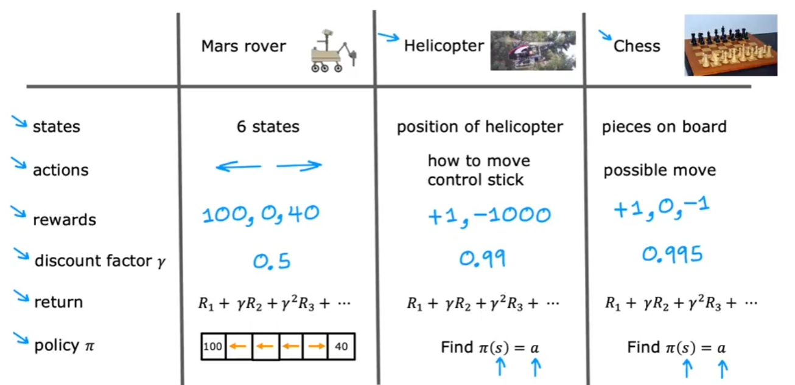
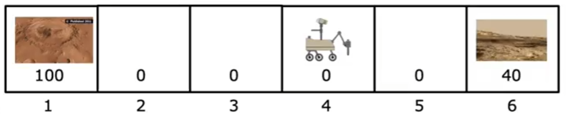
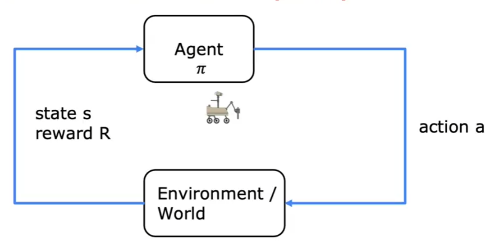
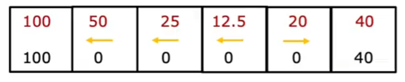
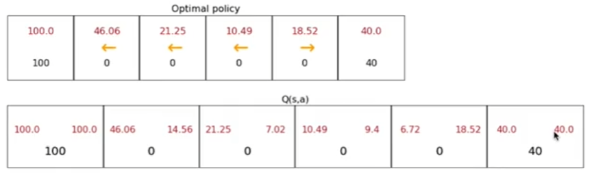
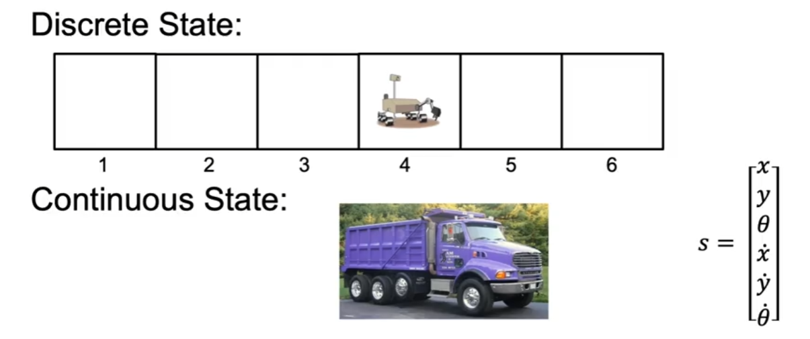
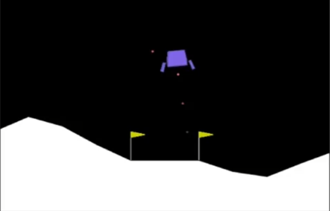
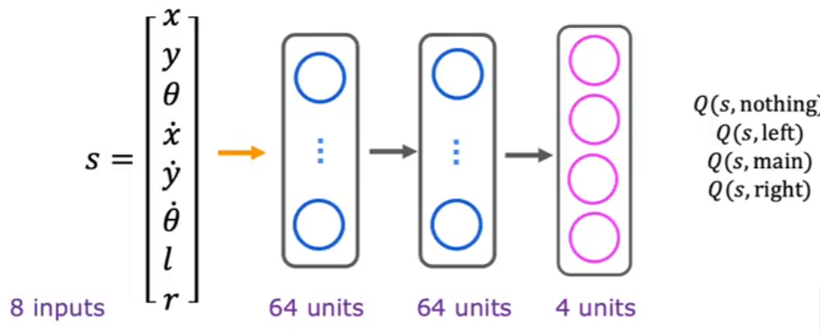
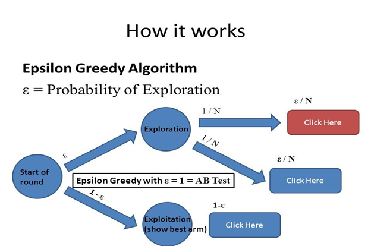

# Pekiştirmeli Öğrenme (Reinforcement Learning)

<!-- toc -->

## Pekiştirmeli Öğrenme Nedir?

Pekiştirmeli Öğrenme (Reinforcement Learning - RL), bir **ajanın (agent)** bir **çevre (environment)** ile etkileşime girerek kümülatif bir **ödülü (reward)** en üst düzeye çıkarmak için sıralı kararlar almayı öğrendiği bir makine öğrenimi paradigmasıdır. Etiketli verilerin sağlandığı gözetimli öğrenmenin (supervised learning) aksine RL, deneme-yanılma yoluyla ödül veya ceza şeklinde geri bildirim alır.

### Pekiştirmeli Öğrenmenin Temel Özellikleri:

    

- **Ajan (Agent)**: Kararları alan varlık (örneğin, bir robot, bir otonom araba veya bir oyundaki yapay zeka oyuncusu).
- **Çevre (Environment)**: Ajanın etkileşimde bulunduğu dış sistem.
- **Durum (State - s)**: Ajanın çevre içindeki mevcut durumunun bir temsili.
- **Eylem (Action - a)**: Ajanın belirli bir durumda yaptığı seçim.
- **Ödül (Reward - R)**: Ajanın eylemlerine karşılık olarak verilen sayısal bir değer.
- **Politika (Policy - $ \pi$ )**: Durumları eylemlere eşleyen bir strateji.
- **Getiri (Return - G)**: Zaman içinde toplanan kümülatif ödül.
- **İndirim Faktörü (Discount Factor - $ \gamma $ )**: Gelecekteki ödüllerin önemini belirleyen 0 ile 1 arasında bir değer.

 
 

**Mars Keşif Aracı Örneği**

RL kavramlarını bir **Mars Keşif Aracı (Mars Rover)** örneği ile açıklayalım. Altı **ızgara konumu** olan **1 boyutlu bir araziyi** keşfeden bir gezgin hayal edin:

Her konum 1'den 6'ya kadar numaralandırılmıştır. Gezgin **4. konumda** başlar ve **sol (-1)** veya **sağ (+1)** hareket edebilir. Amaç, **1. ve 6. konumlarda** verilen ödülleri en üst düzeye çıkarmaktır:

    

- **1. Konum ödülü**: **100** (örneğin, malzemeleri olan bir araştırma istasyonu)
- **6. Konum ödülü**: **40** (örneğin, güvenli bir dinlenme noktası)
- **Diğer konumların ödülü**: **0**

 

**Durumlar, Eylemler ve Ödüller**

| Durum (State) | Olası Eylemler (Possible Actions)        | Ödül (Reward) |
| --------- | ------------------------------- | ------ |
| 1         | Sağa hareket et (+1)                 | 100    |
| 2         | Sola hareket et (-1), Sağa hareket et (+1) | 0      |
| 3         | Sola hareket et (-1), Sağa hareket et (+1) | 0      |
| 4 (Başlangıç) | Sola hareket et (-1), Sağa hareket et (+1) | 0      |
| 5         | Sola hareket et (-1), Sağa hareket et (+1) | 0      |
| 6         | Sola hareket et (-1)                  | 40     |

- **Ajan (keşif aracı)** hangi yöne hareket edeceğine karar vermelidir.
- **Durum (state)**, keşif aracının mevcut konumudur.
- **Eylem (action)**, sola veya sağa hareket etmektir.
- **Ödül (reward)**, hedef durumlara (1 veya 6) ulaşmaya bağlıdır.

 

**Keşif Aracının Nereye Gideceğine Nasıl Karar Verdiği**

Keşif aracının kararı, **beklenen gelecekteki ödüllerini** en üst düzeye çıkarmaya dayanır. İki olası hedef konumu (1 ve 6) olduğu için farklı stratejileri değerlendirmelidir. Keşif aracı aşağıdakileri göz önünde bulundurmalıdır:

1. **Anlık Ödül Stratejisi (Immediate Reward Strategy)**

   - Keşif aracı yalnızca anlık ödüllere odaklanırsa, çoğu konumun (1 ve 6 hariç) ödülü 0 olduğu için rastgele hareket edecektir.
   - Bu strateji **optimal değildir** çünkü gelecekteki ödülleri hesaba katmaz.

2. **Kısa Vadeli Açgözlü Strateji (Short-Term Greedy Strategy)**

   - Keşif aracı en yakın ödülü seçerse, 1. konumdan daha yakın olduğu için büyük olasılıkla **6. konuma** gidecektir.
   - Ancak bu, en iyi uzun vadeli karar olmayabilir.

3. **Uzun Vadeli Ödül Maksimizasyonu (Long-Term Reward Maximization)**

   - Keşif aracı, ne kadar **iskontolu gelecek ödül** biriktirebileceğini değerlendirmelidir.
   - **6. konumun** ödülü **40** olsa da, **1. konumun** ödülü **çok daha yüksektir (100)**.
   - Keşif aracı **1. konuma** güvenilir bir şekilde ulaşabiliyorsa, daha fazla adım gerektirse bile bu rotayı tercih etmelidir.

Bunu formüle etmek için keşif aracı, **indirim faktörünü ($ \gamma $)** dikkate alarak her olası yol için beklenen getiriyi **G** hesaplayabilir.

 

### İndirim Faktörü ($ \gamma $) ve Beklenen Getiri

İndirim faktörü **$ \gamma $**, gelecekteki ödüllerin anlık ödüllere göre ne kadar değerli olduğunu belirler. $ \gamma = 1 $ ise, tüm gelecek ödüller eşit derecede önemli kabul edilir. $ \gamma = 0,9 $ ise, gelecekteki ödüller anlık ödüllerden biraz daha az önemlidir.

Örneğin, keşif aracı **1. konuma** 3 adımda ulaşmayı ve **100** ödül almayı beklediği bir yolu izlerse, iskontolu getiri şöyledir:

$$
G = 100 \times \gamma^3 = 100 \times 0,9^3 = 72,9
$$

**6. konuma** 2 adımda ulaşır ve **40** ödül alırsa, getiri şöyledir:

$$
G = 40 \times \gamma^2 = 40 \times 0,9^2 = 32,4
$$

**72,9**, **32,4'ten** büyük olduğu için keşif aracı, daha uzakta olmasına rağmen 1. konuma gitmeye öncelik vermelidir.

### Politika ($ \pi $)

Bir **politika (policy - $ \pi $)**, keşif aracının stratejisini tanımlar: her durum için hangi eylemin yapılacağını belirtir. Olası politikalar şunları içerir:

1. **Açgözlü politika (Greedy policy)**: Her zaman en yüksek ödüllü duruma doğru hemen hareket eder.
2. **Keşfedici politika (Exploratory policy)**: Bazen daha iyi stratejiler bulmak için yeni eylemler dener.
3. **İskontolu getiri politikası (Discounted return policy)**: Kısa vadeli ve uzun vadeli ödülleri dengeler.

Keşif aracı **optimal bir politika** izlerse, olası her eylem için toplam beklenen ödülü hesaplamalı ve uzun vadeli getirisini en üst düzeye çıkaracak olanı seçmelidir.

 
 

---

## Markov Karar Süreci (Markov Decision Process - MDP)

Pekiştirmeli Öğrenme problemleri genellikle **Markov Karar Süreçleri (Markov Decision Processes - MDPs)** olarak modellenir ve şunlarla tanımlanır:

1. **Durum Kümesi (Set of States - S)**: $ s_1, s_2, ..., s_n $
2. **Eylem Kümesi (Set of Actions - A)**: $ a_1, a_2, ..., a_m $
3. **Geçiş Olasılığı (Transition Probability - P)**: Bir eylem verildiğinde bir durumdan diğerine geçme olasılığı $ P(s' | s, a) $
4. **Ödül Fonksiyonu (Reward Function - R)**: $ s $'den $ s' $'ye geçerken alınan ödülü tanımlar.
5. **İndirim Faktörü (Discount Factor - $ \gamma $)**: Gelecekteki ödüllerin önemini belirler.

**Mars Keşif Aracı** örneğimizde:

    

- **Durumlar (S)**: {1, 2, 3, 4, 5, 6}
- **Eylemler (A)**: {Sol (-1), Sağ (+1)}
- **Geçiş Olasılıkları (P)**: Deterministik (örneğin, keşif aracı sağa hareket ederse her zaman bir sonraki duruma ulaşır)
- **Ödül Fonksiyonu (R)**:
  - $ R(1) = 100 $, $ R(6) = 40 $, $ R(2,3,4,5) = 0 $
- **İndirim Faktörü ($ \gamma $)**: $ 0,9 $ (varsayılan)

 
 

---

## Durum-Eylem Değer Fonksiyonu (State-Action Value Function - $Q(s,a)$)

**Durum-Eylem Değer Fonksiyonu (State-Action Value Function)**, $Q(s,a)$ ile gösterilir, $s$ durumundan başlayarak $a$ eylemini alıp ardından bir $ \pi $ politikasını izlerken elde edilen **beklenen getiriyi (expected return)** temsil eder. Resmi olarak:

$$
Q(s,a) = \mathbb{E} \big[ G_t \mid S_t = s, A_t = a \big]
$$

Bu fonksiyon, ajanın belirli bir durumda hangi eylemin en yüksek ödüle yol açacağını belirlemesine yardımcı olur.

 

**Mars Keşif Aracına Uygulama**

Mars keşif aracı örneğimizi kullanarak, her durum-eylem çifti için $Q(s,a)$ değerlerini tahmin edebiliriz. Varsayalım ki:

    

- $Q(4, \text{sol}) = 25$
- $Q(4, \text{sağ}) = 20$
- $Q(5, \text{sağ}) = 40$
- $Q(3, \text{sol}) = 50$

Keşif aracı, ödülleri en üst düzeye çıkarmak için her zaman en yüksek $Q$ değerine sahip eylemi seçmelidir.

 
 

---

## Bellman Denklemi (Bellman Equation)

**Bellman Denklemi**, pekiştirmeli öğrenmede değer fonksiyonlarını hesaplamak için özyinelemeli bir ilişki sağlar. Bir durumun değerini, ardıl durumların değerleri cinsinden ifade eder.

 

**Bellman Denklemini Anlamak**

Pekiştirmeli öğrenmede, bir ajan gelecekteki ödülleri en üst düzeye çıkaracak şekilde kararlar alır. Ancak, gelecekteki ödüller belirsiz olduğu için bunları verimli bir şekilde tahmin etmenin bir yoluna ihtiyacımız vardır. Bellman denklemi, bir durumun değerini iki bileşene ayırarak bunu yapmamıza yardımcı olur:

1. **Anlık Ödül ($R(s,a)$)**: $s$ durumunda $a$ eylemini alarak elde edilen ödül.
2. **Gelecek Ödüller ($V(s')$)**: Bir sonraki $s'$ durumunun beklenen değeri, o duruma ulaşma olasılığı ile ağırlıklandırılır.

Bellman denklemi şu şekilde yazılır:

$$
V(s) = \max_a \Big[ R(s,a) + \gamma \sum_{s'} P(s' | s,a) V(s') \Big]
$$

burada:

- $V(s)$: $s$ durumunun değeri.
- $R(s,a)$: $s$ durumunda $a$ eylemini almanın anlık ödülü.
- $\gamma$: İndirim faktörü ($0 \leq \gamma \leq 1$), gelecekteki ödüllerin ne kadar dikkate alınacağını belirler.
- $P(s' | s,a)$: $a$ eylemini aldıktan sonra $s'$ durumuna ulaşma olasılığı.
- $V(s')$: Bir sonraki $s'$ durumunun değeri.

 

**Mars Keşif Aracı için Örnek Hesaplama**

Diyelim ki:

- `4`'ten `3`'e hareket etmenin ödülü `-1`.
- `4`'ten `5`'e hareket etmenin ödülü `-1`.
- `1` konumunun ödülü `100`.

$s=4$ için:

$$
V(4) = \max \big[ -1 + \gamma V(3), -1 + \gamma V(5) \big]
$$

$V(3) = 50$ ve $V(5) = 30$ olduğunu ve indirim faktörü $\gamma = 0,9$ olduğunu varsayarsak:

$$
V(4) = \max \big[ -1 + 0,9 \times 50, -1 + 0,9 \times 30 \big]
$$

$$
V(4) = \max \big[ -1 + 45, -1 + 27 \big]
$$

$$
V(4) = \max [44, 26] = 44
$$

Bu nedenle, `4` durumu için optimal değer `44`'tür, yani ajan sola doğru `3`'e gitmeyi tercih etmelidir.

 

**Bellman Denkleminin Arkasındaki Sezgi**

1. Bellman denklemi, bir **durumun değerini** **anlık ödül** ve **beklenen gelecek ödül** olarak ayrıştırır.
2. Değerleri yinelemeli olarak hesaplamamızı sağlar: kaba tahminlerle başlar ve zamanla bunları iyileştiririz.
3. **Politika değerlendirmesinde (policy evaluation)** — belirli bir politikanın ne kadar iyi olduğunu belirlemede yardımcı olur.
4. **Değer Yinelemesi (Value Iteration)** ve **Politika Yinelemesi (Policy Iteration)** gibi **Dinamik Programlama (Dynamic Programming)** yöntemlerinin temelini oluşturur.

 
 

---

## Stokastik Çevre (RL'de Rastgelelik)

Gerçek dünya uygulamalarında, çevreler genellikle **stokastiktir (stochastic)**, yani eylemler her zaman aynı sonuca yol açmaz.

**Mars Keşif Aracı Örneğinde Stokastiklik**

Mars keşif aracının motorlarının bazen arızalandığını ve küçük bir olasılıkla (örneğin, %10) ters yönde hareket etmesine neden olduğunu varsayalım. Şimdi, geçiş dinamikleri şunları içerir:

    

- $P(s' = 5 | s = 4, a = \text{sağ}) = 0,9$
- $P(s' = 3 | s = 4, a = \text{sağ}) = 0,1$

Bu rastgelelik, karar vermeyi daha zorlu hale getirir. Keşif aracı artık sadece ödülleri değil, aynı zamanda **beklenen ödülleri** ve farklı durumlara düşme olasılığını da hesaba katmalıdır.

 

**Karar Verme Üzerindeki Etkisi**

Stokastik çevrelerde, deterministik politikalar (her zaman en iyi eylemi almak) optimal olmayabilir. Bunun yerine, bir **keşif-sömürü (exploration-exploitation)** dengesine ihtiyaç vardır:

- **Sömürü (Exploitation):** Geçmiş deneyimlere dayanarak en iyi bilinen eylemi takip etmek.
- **Keşif (Exploration):** Potansiyel olarak daha iyi ödüller keşfetmek için yeni eylemler denemek.

Bu kavram, gelecek bölümlerde ele alacağımız **Q-Öğrenme (Q-Learning)** ve **Politika Gradyan Yöntemleri (Policy Gradient Methods)** gibi algoritmaların merkezinde yer alır.

 
 

---

## Sürekli Durum ve Ayrık Durum (Continuous State vs. Discrete State)

Pekiştirmeli öğrenmede durumlar ayrık (discrete) veya sürekli (continuous) olabilir. **Ayrık durum**, olası durumların sayısının sonlu ve iyi tanımlanmış olduğu anlamına gelirken, **sürekli durum** sonsuz sayıda olası durum olduğunu ifade eder.

    

Örneğin, altı olası duruma sahip **Mars Keşif Aracı** örneğimizi düşünün. Keşif aracı herhangi bir anda bu altı durumdan herhangi birinde olabilir, bu da onu ayrık durumlu bir çevre yapar. Ancak, bir otoyolda giden bir kamyonu düşünürsek, konumu, hızı, açısı ve diğer nitelikleri sonsuz sayıda değer alabilir, bu da onu sürekli durumlu bir çevre yapar.

Sürekli durum uzayları, sonsuz sayıda durum üzerinde verimli bir şekilde genelleme yapmak için genellikle **sinir ağları (neural networks)** gibi fonksiyon yaklaştırıcıları (function approximators) kullanılarak yaklaşık olarak hesaplanır.

 
 

---

## Ay İniş Aracı (Lunar Lander) Örneği

Klasik bir pekiştirmeli öğrenme problemi **Ay İniş Aracı (Lunar Lander)**'dır; burada amaç bir uzay aracını bir gezegenin yüzeyine güvenli bir şekilde indirmektir. Ajan (iniş aracı), dört olası eylemden birini seçerek çevre ile etkileşime girer:

    

- **Hiçbir Şey Yapma (Do Nothing)**: İtki uygulanmaz.
- **Sol İtki (Left Thruster)**: Sola hareket etmek için kuvvet uygular.
- **Sağ İtki (Right Thruster)**: Sağa hareket etmek için kuvvet uygular.
- **Ana İtki (Main Thruster)**: Alçalmayı yavaşlatmak için kuvvet uygular.

 

**Ödüller ve Cezalar:**

Çevre, ödüller ve cezalar yoluyla geri bildirim sağlar:

- **Yumuşak İniş (Soft Landing)**: +100 ödül
- **Çarpışmalı İniş (Crash Landing)**: -100 ceza
- **Ana Motoru Çalıştırma**: -0,3 ceza (yakıt tüketimi)
- **Yan İtkileri Çalıştırma**: -0,1 ceza (yakıt tüketimi)

 

**Durum Temsili (State Representation)**

Ay iniş aracının **durumu (state)** şu şekilde temsil edilebilir:

$$ s = [x, y, \theta, l, r, x', y', \theta'] $$

burada:

- $ x, y $ : İniş aracının konumu
- $ \theta $ : Yönelim (eğim açısı)
- $ l, r $ : Sol ve sağ iniş takımlarıyla temas (ikili değerler)
- $ x', y' $ : x ve y yönlerindeki hızlar
- $ \theta' $ : Açısal hız

**Politika (policy)** fonksiyonu $ \pi(s) $, mevcut duruma göre hangi eylemin yapılacağını belirler.

 

### Ay İniş Aracı için Derin Q-Ağı (Deep Q-Network - DQN) Sinir Ağı

Optimal politikayı yaklaşık olarak hesaplamak için **derin bir sinir ağı (deep neural network)** kullanırız. Ağ, 8 boyutlu durum vektörünü girdi olarak alır ve dört eylemin her biri için Q-değerlerini tahmin eder.

#### Ağ Mimarisi (Network Architecture):

    

- **Girdi Katmanı (8 nöron)**: $ x, y, \theta, l, r, x', y', \theta' $ değerlerine karşılık gelir
- **İki Gizli Katman (her biri 64 nöron, ReLU aktivasyonu)**
- **Çıktı Katmanı (4 nöron)**: Dört olası eylem için Q-değerlerini temsil eder

Çıktı nöronları şunlara karşılık gelir:

- $ Q(s, \text{hiçbir şey yapma}) $
- $ Q(s, \text{ana itki}) $
- $ Q(s, \text{sağ itki}) $
- $ Q(s, \text{sol itki}) $

Ağ, tahmin edilen ve gerçek Q-değerleri arasındaki farkı en aza indirmek için **Bellman denklemi** kullanılarak eğitilir.

 
 

---

## $ \varepsilon $-Açgözlü Politika ($ \varepsilon $-Greedy Policy)

Pekiştirmeli öğrenmede, bir ajan **keşif (exploration)** (yeni eylemler denemek) ve **sömürü (exploitation)** (en iyi bilinen eylemi seçmek) arasında denge kurmalıdır. **$ \varepsilon $-açgözlü politika (epsilon-greedy policy)**, bu dengeyi sağlamak için yaygın bir yaklaşımdır:

    

- $ \varepsilon $ olasılığı ile rastgele bir eylem al (keşif).
- $ 1 - \varepsilon $ olasılığı ile en yüksek Q-değerine sahip eylemi al (sömürü).

Başlangıçta $ \varepsilon $, keşfi teşvik etmek için yüksek bir değere (örneğin 1,0) ayarlanır ve zamanla kademeli olarak azalır.

 
 

---

## Pekiştirmeli Öğrenmede Mini-Grup Öğrenme (Mini-Batch Learning)

Derin pekiştirmeli öğrenmede, eğitim verimliliğini ve kararlılığını artırmak için **mini-grup öğrenme (mini-batch learning)** kullanırız.

### Neden Mini-Grup Öğrenme?

- Tek bir deneyimden büyük güncellemeleri önler (eğitimi dengeler).
- Ardışık deneyimler arasındaki korelasyonu kırmaya yardımcı olur (genellemeyi iyileştirir).
- Verimli GPU hesaplamasına izin verir (daha hızlı yakınsama).

### Nasıl Çalışır:

1. Deneyimleri **(durum, eylem, ödül, sonraki durum)** bir **tekrar tamponunda (replay buffer)** saklayın.
2. Bir **mini-grup (mini-batch)** deneyim örnekleyin.
3. Bellman denklemini kullanarak hedef Q-değerlerini hesaplayın.
4. Q-ağı üzerinde bir **gradyan iniş güncellemesi (gradient descent update)** gerçekleştirin.

Mini-grup öğrenme, pekiştirmeli öğrenmeyi daha sağlam hale getirir ve son deneyimlere aşırı uyumu (overfitting) önler.

 
 
